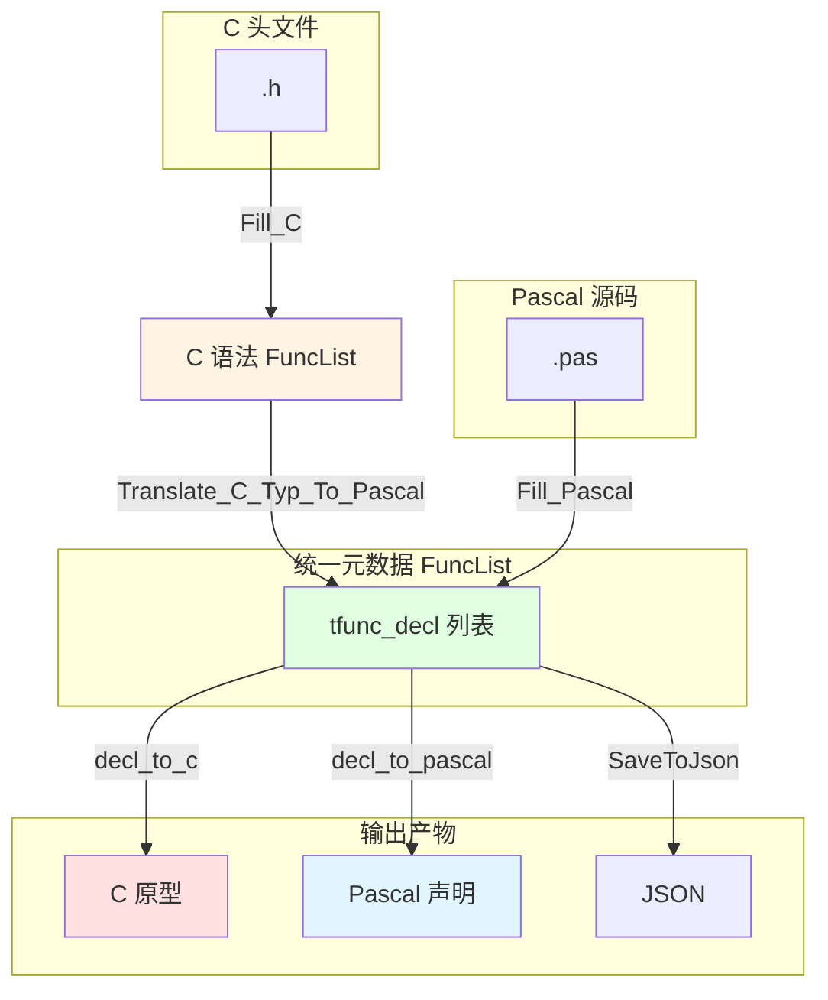
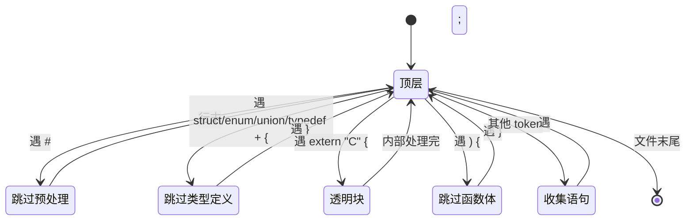
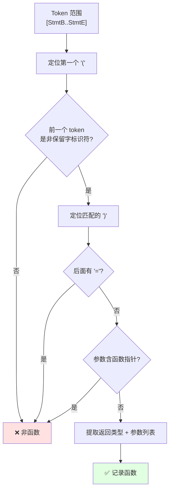
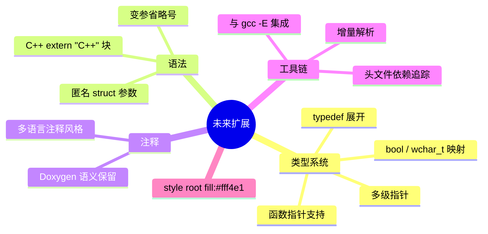
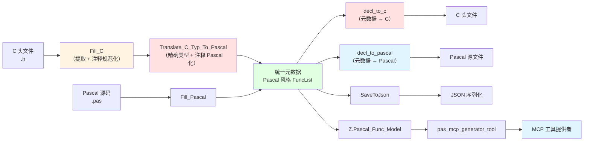

# Z.Pascal_Func_Tool 支持 C 声明体解析工作总结

**文档版本**：V2.0
**完成日期**：2026-09-11
**作者**：老张 qq600585
**关联代码**：
- `Z.Pascal_Func_Tool.pas`（主单元）
- `Z.Pascal_Func_Tool.Fill_C.inc`（C 解析实现）
- `Z.Pascal_Func_Tool.Fill_Pascal.inc`（Pascal 解析实现）
- `Z.Pascal_Func_Tool.Translate_C_Typ_To_Pascal.inc`（C 类型 Pascal 化）
- `Z.Pascal_Func_Tool.decl_to_c.inc`（Pascal 元数据 → C 源码）
- `Z.Pascal_Func_Tool.decl_to_pascal.inc`（Pascal 元数据 → Pascal 源码）

---

## 一、工作背景与目标

### 1.1 背景

`Z.Pascal_Func_Tool` 原本只支持 Pascal 源码的函数/过程声明提取，服务于 LingoFuse 工具链的 `pascal_decl_to_mcp` 代码生成器。随着工具链需要扩展到 C 语言生态，必须为同一份元数据结构提供 C 头文件解析能力，并进一步实现**从元数据反向生成源码**的能力（C 与 Pascal 双向）。

### 1.2 目标

| 目标项 | 说明 |
|--------|------|
| 与 Pascal 版对齐 | 输出同一份 `tfunc_decl` 数据结构，字段布局完全一致 |
| 只提取声明 | 只解析函数原型，跳过函数定义、结构体、变量、宏 |
| 静默跳过 | 不满足条件的声明不报错，只记录日志 |
| **类型精度保真** | C 类型按宽度和符号精确映射为 Pascal 类型，非统一坍缩 |
| **注释风格统一** | 所有注释统一归化为 Pascal 风格存储 |
| **双向代码生成** | 元数据可输出为 C 头文件或 Pascal 源文件 |
| **往返保真** | `C → Pascal 元数据 → C` 应生成等价原型 |
| 复用下游 | 结果可直接喂入 `Z.Pascal_Func_Model` 和 `pas_mcp_generator_tool` |

---

## 二、总体架构

### 2.1 单元结构

```
Z.Pascal_Func_Tool.pas
  ├── tfunc_param_decl        参数记录（含 param_array）
  ├── tfunc_decl              声明记录（含 ResultMod）
  ├── TFuncDeclList           声明列表
  └── tpascal_func_decl_tool  主工具类
        ├── CreateFrom_Pascal_Code
        ├── Fill_Pascal          ← Pascal 解析
        ├── CreateFrom_C_Code
        ├── Fill_C               ← C 解析
        ├── Translate_C_Typ_To_Pascal  ← C 类型/注释 Pascal 化
        ├── decl_to_pascal       ← 元数据 → Pascal 源码
        └── decl_to_c            ← 元数据 → C 源码
```

### 2.2 数据流（双向）



### 2.3 关键设计决策

| 决策 | 原因 |
|------|------|
| 用 `.inc` 分离解析器 | 单个 `.pas` 文件过大，分离便于维护 |
| 复用 `tfunc_decl` 结构 | 下游模块无需感知输入语言 |
| **元数据采用 Pascal 风格为规范态** | `decl_to_pascal` 直接 verbatim，`decl_to_c` 反转换 |
| **注释统一为 Pascal `{ ... }`** | 单一风格简化下游实现 |
| **新增 `ResultMod` / `param_array` 字段** | 承载无 C→Pascal 等价的信息 |
| 静默跳过而非抛异常 | 与 Pascal 版保持一致的工具链行为 |

---

## 三、C 解析器实现要点

### 3.1 词法层

**依赖 `Z.Parsing` 的 `tsC` 模式**，已具备：

- `/* */` 和 `//` 注释识别
- 双引号字符串 + 反斜杠转义
- `0x` 十六进制
- 括号匹配（`IndentSymbolEndProbeR`）
- Token 探针（`ProbeR` / `ProbeL`）

**C 模式下空白被识别为独立 `ttUnknow` token**——这是后续所有"多空格"问题的根源，也是修复的突破口。

### 3.2 语法层：状态机设计



**关键判定：`{` 的三分类**

| `{` 场景 | 判定条件 | 处理 |
|----------|----------|------|
| 函数体 | 前面是 `)` | 跳过整块 |
| 类型定义 | 语句含 `struct`/`enum`/`union`/`typedef` | 跳过整块 |
| 透明块 | 其他（如 `extern "C" {`） | 重置 StmtBIdx，继续 |

### 3.3 语句层：函数原型识别



### 3.4 参数层：单段解析

**关键算法**：从段尾向前扫描，找到最后一个**非保留字**标识符作为参数名。

| 输入 | 参数名 | 类型 | 数组后缀 |
|------|:------:|:----:|:--------:|
| `int a` | `a` | `int` | — |
| `const char * s` | `s` | `const char *` | — |
| `int buf[]` | `buf` | `int` | `[]` |
| `union Value v` | `v` | `union Value` | — |
| `Point p1` | `p1` | `Point` | — |
| `int` | （空） | `int`（无名参数） | — |
| `int * restrict p` | `p` | `int *`（剥离 restrict） | — |
| `void`（单独） | — | 特殊：零参数 | — |

---

## 四、类型映射体系（核心改进）

### 4.1 从"统一坍缩"到"精确映射"的演进

**第一版设计（已废弃）**：所有整数统一映射为 `Int64`，所有浮点统一映射为 `Double`。

**问题**：`C → Pascal → C` 往返后类型全部退化：
```c
unsigned int  →  Int64  →  int64_t  ❌ 无符号丢失
float         →  Double →  double   ❌ 精度放大
short         →  Int64  →  int64_t  ❌ 宽度丢失
```

**第二版设计（现行）**：按 C 类型的**宽度**和**符号**精确映射到对应的 Pascal 类型。

### 4.2 C → Pascal 映射表

| C 类型 | Pascal 类型 | 说明 |
|--------|:-----------:|------|
| `signed char` / `int8_t` | `ShortInt` | 8 位有符号 |
| `short` / `int16_t` | `SmallInt` | 16 位有符号 |
| `int` / `int32_t` | `Integer` | 32 位有符号 |
| `long` | `LongInt` | 平台相关（Win64 上 32 位） |
| `long long` / `int64_t` | `Int64` | 64 位有符号 |
| `unsigned char` / `uint8_t` | `Byte` | 8 位无符号 |
| `unsigned short` / `uint16_t` | `Word` | 16 位无符号 |
| `unsigned int` / `uint32_t` | `Cardinal` | 32 位无符号 |
| `unsigned long` | `LongWord` | 平台相关无符号 |
| `unsigned long long` / `uint64_t` | `UInt64` | 64 位无符号 |
| `size_t` / `uintptr_t` | `UInt64` | 指针宽度无符号 |
| `ssize_t` / `ptrdiff_t` / `intptr_t` | `Int64` | 指针宽度有符号 |
| `float` | `Single` | 单精度浮点 |
| `double` | `Double` | 双精度浮点 |
| `long double` | `Extended` | 扩展精度浮点 |
| `char *` / `const char *` / `char const *` | `string` | 字符串族 |
| `void *` / `int *` / 任意 `*` | `Pointer` | 通用指针兜底 |
| `void`（返回值） | `''` | 降级为 procedure |

### 4.3 Pascal → C 反向映射表

`decl_to_c` 采用上表的**精确逆映射**：

| Pascal 类型 | 输出 C 类型 |
|-------------|:-----------:|
| `ShortInt` | `signed char` |
| `SmallInt` | `short` |
| `Integer` | `int` |
| `LongInt` | `long` |
| `Int64` | `long long` |
| `Byte` | `unsigned char` |
| `Word` | `unsigned short` |
| `Cardinal` | `unsigned int` |
| `LongWord` | `unsigned long` |
| `UInt64` | `unsigned long long` |
| `Single` | `float` |
| `Double` | `double` |
| `Extended` | `long double` |
| `Pointer` | `void *` |
| `string` 家族 | `char *` |

### 4.4 往返保真示例

| 原始 C | 元数据 | 输出 C | 保真度 |
|--------|:------:|:------:|:------:|
| `int add(int a, int b)` | `Integer` | `int add(int a, int b)` | ✅ |
| `unsigned int get_unsigned(void)` | `Cardinal` | `unsigned int get_unsigned(void)` | ✅ |
| `long get_long(void)` | `LongInt` | `long get_long(void)` | ✅ |
| `unsigned long get_ulong(void)` | `LongWord` | `unsigned long get_ulong(void)` | ✅ |
| `short get_short(void)` | `SmallInt` | `short get_short(void)` | ✅ |
| `unsigned short get_ushort(void)` | `Word` | `unsigned short get_ushort(void)` | ✅ |
| `long long get_longlong(void)` | `Int64` | `long long get_longlong(void)` | ✅ |
| `float get_float(void)` | `Single` | `float get_float(void)` | ✅ |
| `double get_double(void)` | `Double` | `double get_double(void)` | ✅ |
| `char* alloc_string(int)` | `string` | `char * alloc_string(int)` | ✅ |

---

## 五、新增数据字段

为承载"无 C↔Pascal 等价"的信息，`tfunc_decl` 与 `tfunc_param_decl` 分别新增字段：

### 5.1 `tfunc_decl.ResultMod`

| 属性 | 说明 |
|------|------|
| 类型 | `TP_String` |
| 用途 | 保存返回值位置的限定符（目前仅 `const`） |
| 来源 | `Fill_C.ProcessStatement` 阶段从返回类型 token 中检测 |
| 消费 | `decl_to_c.BuildDeclString` 输出时前置 `const ` |

**示例**：
```c
const char* get_error_message(int code);
```
→ 元数据：`ResultDecl = 'string'`、`ResultMod = 'const'`
→ 输出 C：`const char * get_error_message(int code);`

### 5.2 `tfunc_param_decl.param_array`

| 属性 | 说明 |
|------|------|
| 类型 | `TP_String` |
| 用途 | 保存 C 数组声明后缀（如 `[]`、`[N]`） |
| 来源 | `Fill_C.ExtractArraySuffix` 从参数段尾部提取 |
| 消费 | `decl_to_c.BuildCParamString` 拼接到参数名后 |

**示例**：
```c
void fill_buffer(int buf[], int len);
```
→ 元数据：`param_name = 'buf'`、`param_array = '[]'`
→ 输出 C：`void fill_buffer(int buf[], int len);`
→ 输出 Pascal：`procedure fill_buffer(buf: array of Integer; len: Integer);`

---

## 六、注释处理（统一风格）

### 6.1 设计：所有注释归化为 Pascal 风格

**架构决策**：元数据中的 `Comment` 字段**唯一采用 Pascal 风格** `{ ... }`，作为规范化存储格式。

```
C 源码注释 ──┐
             │ (Fill_C 提取)
             ▼
        C-style Comment
             │
             ▼
   Translate_C_Typ_To_Pascal
   ┌─────────────────────────┐
   │ ConvertCCommentToPascal │
   │ C-style → Pascal-style  │
   └─────────────────────────┘
             │
             ▼
      Pascal-style Comment
      ┌──────────┴──────────┐
      ▼                     ▼
decl_to_pascal         decl_to_c
verbatim 输出    ConvertPascalCommentToCComment
{ ... }                /* ... */
```

### 6.2 核心转换函数

**`ConvertCCommentToPascalComment`**（位于 `Translate_C_Typ_To_Pascal.inc`）：

1. 若已是 Pascal 风格（`{` 或 `(*` 开头）→ 原样返回
2. 用 `tsC` 解析 C 注释
3. 剥离 C 注释符号（`/* */`、`//`）
4. 剥离 Doxygen `/**` 遗留的 `*` 前缀
5. 用直接拼接方式包成 `{ ... }`（避免重排带来的 CJK 空格问题）

**`ConvertPascalCommentToCComment`**（位于 `decl_to_c.inc`）：

1. 若已是 C 风格（`/*` 开头）→ 原样返回（防御）
2. 用 `tsPascal` 解析
3. 剥离 Pascal 注释符号
4. 用直接拼接方式包成 `/* ... */`

### 6.3 多行注释规范化

`ExtractPrecedingComments`（位于 `Fill_C.inc`）对**多行注释**做规范化，为每行（首行除外）添加 ` *` 前缀：

| 原行类型 | 处理后 |
|----------|--------|
| 已带 `*` 的行 | 归一为 ` * <内容>` |
| 已带 `/` 的行（`//` 续行） | 保持原样 |
| 普通文本行 | 加 ` * ` 前缀 |
| 空行 | 保持空行 |
| 单行注释 | 不做任何改动 |

**示例**：
```c
/* This is a comment
that spans multiple
lines */
```
→ 输出：
```c
/* This is a comment
 * that spans multiple
 * lines */
```

### 6.4 Doxygen 注释的处理

**策略**：接受 Doxygen `/**` 风格在元数据中规整为普通 `{ ... }`。虽损失 Doxygen 语义，但保持了注释内容与结构的完整。

**输入**：
```c
/**
 * 计算两个整数的和。
 * @param a 第一个加数
 */
```

**元数据**：
```
{ 计算两个整数的和。
 * @param a 第一个加数 }
```

**输出 Pascal**：
```pascal
{ 计算两个整数的和。
 * @param a 第一个加数 }
function add_documented(a: Integer; b: Integer): Integer;
```

---

## 七、双向代码生成

### 7.1 `decl_to_c` —— 元数据 → C 头文件

**职责**：
- 遍历 `FuncList`
- 过滤无法生成的声明（空名、不支持类型、var/out 修饰）
- 将 Pascal 类型反映射为 C 类型
- 应用 `ResultMod` 前置 `const`
- 应用 `param_array` 拼接数组后缀
- 将 Pascal 注释反转换为 C 块注释

**输出样例**：
```c
/* Generated from unit test_header_v2 */

/* ============================================================
 * [✓] 场景 1：最简函数原型（2 个）
 * ============================================================ */
int add(int a, int b);
void noop(void);

int get_version(void);
...
```

### 7.2 `decl_to_pascal` —— 元数据 → Pascal 源文件

**职责**：
- 遍历 `FuncList`
- 过滤无法生成的声明（空名、无名参数、var/out、嵌套声明、不支持类型）
- 数组参数渲染为 `array of <T>`
- **注释 verbatim 输出**（因为元数据已统一为 Pascal 风格）

**输出样例**：
```pascal
unit test_header_v2;

interface

{ ============================================================
 * [✓] 场景 1：最简函数原型（2 个）
 * ============================================================ }
function add(a: Integer; b: Integer): Integer;
procedure noop;

function get_version: Integer;
...

implementation

end.
```

### 7.3 类型支持白名单

| 侧 | 函数 | 覆盖类型 |
|----|------|---------|
| C | `IsSupportedCType` | `ShortInt`、`SmallInt`、`Integer`、`LongInt`、`Int64`、`Byte`、`Word`、`Cardinal`、`LongWord`、`UInt64`、`Single`、`Double`、`Extended`、`Pointer`、`string` 家族、`void` |
| Pascal | `IsSupportedPascalType` | 同 C 侧白名单 |

---

## 八、Unit Name 智能提取

### 8.1 设计目标

从 C 头文件本身自动推导出 unit name，替代早期硬编码的 `'CHdr'`。

### 8.2 提取策略（优先级）

| 优先级 | 策略 | 示例 |
|:------:|------|------|
| 1 | **头部注释中的 `.h` / `.c` 文件名** | `/* test_header_v2.h ... */` → `test_header_v2` |
| 2 | **`#ifndef` / `#ifdef` 引入的 include guard** | `#ifndef TEST_HDR_H` → `TEST_HDR` |
| 3 | **`#define` 且宏名形如 guard** | `#define FOO_HPP` → `FOO` |
| 4 | **Fallback** | 无任何线索 → `untitled.h` |

### 8.3 支持的 guard 后缀

`StripGuard` 会剥离以下后缀（最长优先）：
- `_INCLUDED`
- `_HXX` / `_HPP`
- `_H__` / `_H_` / `_H`

同时剥离前后下划线。

### 8.4 鲁棒性约束

| 约束 | 目的 |
|------|------|
| `.h` / `.c` 前的标识符必须**以字母开头** | 拒绝 `1.0.3.h` → `3` 的错误提取 |
| `.h` / `.c` 之后必须是**非标识符字符** | 拒绝 `.header`、`.class` 等 |
| `#define` 只在宏名形如 guard 时接受 | 拒绝 `#define MAX_SIZE 1024` 被当作 guard |
| 扫描范围限制在**前 100 行** | 避免后期代码误命中 |
| `Parser = nil` / 空文本保护 | 返回 `untitled.h`，不崩溃 |

### 8.5 提取效果

| 输入 | 输出 |
|------|------|
| `/* foo.h ... */` | `foo` |
| `// bar.c` | `bar` |
| `#ifndef FOO_H` | `FOO` |
| `#ifndef __FOO_H__` | `FOO` |
| `#ifndef FOO_HPP` | `FOO` |
| `#ifndef FOO_INCLUDED` | `FOO` |
| `#define MAX_SIZE 1024`（无 guard） | `untitled.h` |
| `/* 1.0.3.h */` | `untitled.h` |
| 空文本 | `untitled.h` |

---

## 九、关键问题与解决方案（合并汇总）

### 9.1 问题总清单

| # | 问题 | 严重性 | 状态 |
|:-:|------|:------:|:----:|
| 1 | `extern "C" {` 被当作函数体跳过 | 🔴 严重 | ✅ |
| 2 | 函数指针参数被错误提取 | 🔴 严重 | ✅ |
| 3 | 调用约定混入返回类型 | 🟡 中 | ✅ |
| 4 | `extern` / `static` 混入返回类型 | 🟡 中 | ✅ |
| 5 | 类型字符串含多空格 | 🟡 中 | ✅ |
| 6 | `ParamDecl` 格式不规范 | 🟢 轻 | ✅ |
| 7 | **类型精度全丢**（int→int64_t、float→double） | 🔴 严重 | ✅ |
| 8 | **返回值 `const` 丢失** | 🔴 严重 | ✅ |
| 9 | **参数后缀 `const` 丢失** | 🟡 中 | ✅ |
| 10 | **数组后缀 `[]` 丢失** | 🟡 中 | ✅ |
| 11 | **`void *` 类型被拒** | 🟡 中 | ✅ |
| 12 | **`restrict` 修饰的指针被拒** | 🟡 中 | ✅ |
| 13 | **注释丢失/风格混乱** | 🔴 严重 | ✅ |
| 14 | **Doxygen `{ *` 前缀残留** | 🟢 轻 | ✅ |
| 15 | **CJK 字符间空格污染** | 🟢 轻 | ✅ |
| 16 | **Unit name 硬编码 `'CHdr'`** | 🟡 中 | ✅ |
| 17 | **Parser = nil 崩溃** | 🔴 严重 | ✅ |
| 18 | **空文本未 fallback** | 🟡 中 | ✅ |
| 19 | **`#define` 泛匹配误判** | 🟡 中 | ✅ |
| 20 | **`1.0.3.h` 提取为 `3`** | 🟢 轻 | ✅ |

### 9.2 代表性修复

#### 修复 7：类型精度全丢

**现象**：`C → Pascal → C` 往返后所有整数变 `int64_t`，浮点变 `double`。

**根因**：`Translate_C_Typ_To_Pascal` 使用统一化映射表。

**修复**：将映射表改为按**宽度 + 符号**精确映射（详见第四章）。

#### 修复 8 & 9：`const` 丢失

**现象**：
- 返回值位置：`const char* get_error_message(int)` → `char * get_error_message(int)`
- 参数后缀位置：`char const *s` → `char * s`

**根因**：
- 返回值无 `const` 槽位（`param_mod` 只针对参数）
- 参数 `const` 检测只识别前缀形式（`const char *`），不识别后缀（`char const *`）

**修复**：
- 新增 `tfunc_decl.ResultMod` 字段
- `Fill_C.ParseParamSegment` 的 `const` 检测改为**扫描整段范围**

#### 修复 12：`restrict` 修饰的指针被拒

**现象**：`void restrict_param(int * restrict p)` 被跳过。

**根因**：`int * restrict` 类型字符串无法映射。

**修复**：
- `Fill_C.JoinTypeTokens` 主动剥离 `restrict` / `__restrict` / `__restrict__`
- `int * restrict` → `int *` → 映射为 `Pointer`

#### 修复 13 & 14 & 15：注释体系问题

**现象**：
- 注释在元数据中风格混乱（C 与 Pascal 混存）
- Doxygen `/**` 输出为 `/* *`，残留 `*` 前缀
- CJK 字符间被插入空格：`最简 函数原型`

**根因**：
- 早期实现无统一规范
- `Translate_Text_To_Pascal_Decl_Comment` 重排文本，破坏 CJK 字符序列

**修复**：
- 统一为 Pascal 风格（详见第六章）
- 注释包裹改用**直接字符串拼接**，避免重排
- 剥离 Doxygen 遗留的 `*` 前缀

#### 修复 17：`Parser = nil` 崩溃

**现象**：直接调用 `Fill_C` 且 `Parser = nil` 时崩溃。

**根因**：`ExtractUnitNameFromHeader` 内访问 `Parser.Text` 早于 nil 检查。

**修复**：主流程 nil 检查前移，`ExtractUnitNameFromHeader` 内部也加保护。

---

## 十、测试验证

### 10.1 测试用例

**`test_header_v2.h`** —— 25 个场景，覆盖：

| 类别 | 场景数 | 说明 |
|------|:------:|------|
| 基础原型 | 9 | 无参、单参、多参、指针、数组 |
| 复合类型 | 3 | struct / enum / union 参数 |
| 返回指针 | 2 | `char*` / `const char*` |
| 多行声明 | 1 | 跨行参数 |
| Doxygen 注释 | 2 | 注释绑定验证 |
| 调用约定 | 3 | `__cdecl` / `__stdcall` / `__fastcall` |
| 类型组合 | 8 | unsigned / long / short |
| 边界 | 10 | 无名参数、restrict、attribute、declspec、void* |
| 干扰项 | 16 | 宏、条件编译、结构体、变量、函数体、函数指针 |

### 10.2 验证结果

| 指标 | 目标 | 实测 | 状态 |
|------|:----:|:----:|:----:|
| C 侧提取函数数 | 40 | 40 | ✅ |
| C 侧输出声明数 | 37 | 37 | ✅ |
| Pascal 侧输出声明数 | 35 | 35 | ✅ |
| 函数指针跳过 | 2 | 2 | ✅ |
| 结构体块跳过 | ≥ 4 | 4 | ✅ |
| 透明块处理 | `extern "C" {` | ✅ | ✅ |
| **类型精度保真** | 全部 | 全部 | ✅ |
| **返回值 `const`** | 保留 | 保留 | ✅ |
| **参数后缀 `const`** | 保留 | 保留 | ✅ |
| **数组后缀 `[]`** | 保留 | 保留 | ✅ |
| **`void *` 返回值** | 支持 | 支持 | ✅ |
| **`restrict` 指针** | 支持 | 支持 | ✅ |
| **注释风格统一** | Pascal | Pascal | ✅ |
| **Doxygen `*` 前缀剥离** | 是 | 是 | ✅ |
| **CJK 无空格污染** | 是 | 是 | ✅ |
| **Unit name 智能提取** | `test_header_v2` | `test_header_v2` | ✅ |
| `ParseSuccess` | `true` | `true` | ✅ |

### 10.3 输出样例

**C 输出（片段）**：
```c
/* Generated from unit test_header_v2 */

int add(int a, int b);
void noop(void);

unsigned int get_unsigned(void);
long get_long(void);
unsigned long get_ulong(void);
short get_short(void);
unsigned short get_ushort(void);
long long get_longlong(void);
double get_double(void);
float get_float(void);

const char * get_error_message(int code);
void * void_ptr_return(int size);
void restrict_param(void * p);
```

**Pascal 输出（片段）**：
```pascal
unit test_header_v2;

interface

function add(a: Integer; b: Integer): Integer;
procedure noop;

function get_unsigned: Cardinal;
function get_long: LongInt;
function get_ulong: LongWord;
function get_short: SmallInt;
function get_ushort: Word;
function get_longlong: Int64;
function get_double: Double;
function get_float: Single;

function get_error_message(code: Integer): string;
function void_ptr_return(size: Integer): Pointer;
procedure restrict_param(p: Pointer);

implementation

end.
```

**JSON 输出（片段）**：
```json
{
  "Name": "get_error_message",
  "IsFunction": true,
  "ParamDecl": "(code: Integer)",
  "param_arry": [{"mod": "", "name": "code", "typ": "Integer", "value": "", "array": ""}],
  "ResultDecl": "string",
  "ResultMod": "const",
  "Comment": "{ ... }",
  "Body": "function get_error_message(code: Integer): string;"
}
```

### 10.4 跳过报告

**C 侧跳过（3 个）**：
```
Skipped: "distance" (index 9) - Reason: Parameter "p1" has unsupported type "Point"
Skipped: "color_to_int" (index 10) - Reason: Parameter "c" has unsupported type "Color"
Skipped: "set_value" (index 11) - Reason: Parameter "v" has unsupported type "union Value"
```

**Pascal 侧跳过（5 个）**：上述 3 个 + 无名参数 2 个（Pascal 语法不允许无名参数）。

---

## 十一、代码结构总览

### 11.1 `Fill_C` 的 14 个 SECTION

| SECTION | 内容 | 职责 |
|:-------:|------|------|
| 1 | Debug logging | 统一日志输出 |
| 2 | C reserved word table | 关键字识别 |
| 3 | Token classification | 空白/标点判定 |
| 4 | Token joining | 拼接（普通 + 规范 + 类型） |
| 5 | Return type extraction | 修饰符过滤 |
| 6 | Preceding comment extraction | 前导注释收集 + 多行规范化 |
| 7 | **Unit name extraction** | 从注释/guard 提取 unit name |
| 8 | Function-pointer parameter detection | 函数指针检测 |
| 9 | Array suffix extraction | 数组后缀提取 |
| 10 | Single parameter segment parsing | 单参数解析 |
| 11 | Full parameter list parsing | 参数列表解析 |
| 12 | Statement classification | 原型 vs 变量判定 |
| 13 | `{` block skip decision | 块跳过判定 |
| 14 | Main parsing loop | 主循环 |

### 11.2 `Translate_C_Typ_To_Pascal` 的 6 个 SECTION

| SECTION | 内容 |
|:-------:|------|
| 1 | Debug logging |
| 2 | `ConvertCTypeToPascal`（精确类型映射） |
| 3 | `BuildPascalParamDecl` |
| 4 | `ConvertCCommentToPascalComment` |
| 5 | `BuildPascalBody` |
| 6 | 主转换循环 |

### 11.3 `decl_to_c` 的核心函数

| 函数 | 职责 |
|------|------|
| `PascalTypeToCType` | 精确类型反映射 |
| `ConvertPascalCommentToCComment` | Pascal 注释 → C 注释 |
| `BuildCParamString` | 参数列表拼接（含数组后缀） |
| `BuildDeclString` | 单条声明生成（含 `ResultMod` 前置） |
| `IsSupportedCType` | 类型白名单过滤 |
| `IsDeclSupported` | 声明整体兼容性检查 |

### 11.4 `decl_to_pascal` 的核心函数

| 函数 | 职责 |
|------|------|
| `BuildParamString` | 参数列表拼接（数组 → `array of T`） |
| `BuildDeclString` | 单条声明生成（注释 verbatim） |
| `IsSupportedPascalType` | 类型白名单过滤 |
| `IsDeclSupported` | 声明整体兼容性检查 |

---

## 十二、遗留与未来扩展

### 12.1 当前限制

| 限制 | 影响 | 建议 |
|------|------|------|
| 不支持函数指针参数 | 含函数指针的声明被跳过 | 未来可通过回调结构体替代 |
| 不支持 `bool` / `wchar_t` | 这些类型参数被跳过 | 可扩展映射表 |
| 不支持多维数组 | `int arr[][]` 被跳过 | 属于边缘场景 |
| 不支持变参 `...` | `printf(const char*, ...)` 被跳过 | 需要新增 `ellipsis` 字段 |
| 不支持 `#define` 宏展开 | 需用户先 `gcc -E` 预处理 | 保持现有策略 |
| **Doxygen 语义丢失** | `/**` 被规整为普通 `{ ... }` | 注释内容完整保留，仅风格变化 |
| **英语文本中的 `.h` 误判** | `/* Logic.c is fine. */` 会提取为 `Logic` | 语义层问题，纯字面扫描难完美解决 |
| **无名参数在 Pascal 侧被跳过** | C 原型 `int f(int, int)` 无法生成等价 Pascal | Pascal 语法限制 |

### 12.2 后续扩展方向



### 12.3 与 Pascal 版的对称性

| 维度 | Fill_Pascal | Fill_C |
|------|:-----------:|:------:|
| 输入 | `.pas` 源码 | `.h` 头文件 |
| 提取对象 | 顶层函数/过程声明 | 顶层函数原型 |
| 关键字识别 | `Pascal_Keyword` | `IsCReservedWord` |
| 参数解析 | `tfunc_param_tool.fill_param` | `ParseParamList` |
| 修饰符过滤 | 无 | `ExtractReturnType` |
| 状态机 | `Sections` + `NestedLevel` | 语句 + 块状态 |
| 数组后缀 | 无（Pascal 无 `[]`） | `ExtractArraySuffix` |
| 返回值 `const` | 无 | `ResultMod` |
| 注释风格 | Pascal（原始） | C → Pascal（转换） |
| 输出结构 | `tfunc_decl` | `tfunc_decl`（同构） |
| 后续转换 | 无 | `Translate_C_Typ_To_Pascal` |

---

## 十三、总结

### 13.1 交付成果

| 交付物 | 状态 |
|--------|:----:|
| `Fill_C` 完整实现 | ✅ |
| `Translate_C_Typ_To_Pascal` 完整实现 | ✅ |
| `decl_to_c` 完整实现 | ✅ |
| `decl_to_pascal` 完整实现 | ✅ |
| 扩展后的 `tfunc_decl` / `tfunc_param_decl` 结构 | ✅ |
| C 关键字表 | ✅ |
| 精确类型映射表（C ↔ Pascal 双向） | ✅ |
| Unit name 智能提取 | ✅ |
| 测试用例 `test_header_v2.h` | ✅ |
| 40/40 精确提取 | ✅ |
| **类型往返保真** | ✅ |
| **注释风格统一** | ✅ |
| **CJK 无空格污染** | ✅ |
| 日志与注释全英文化 | ✅ |
| 与 Pascal 版数据对齐 | ✅ |

### 13.2 核心价值

1. **工具链双语言支持**：`Z.Pascal_Func_Tool` 从仅支持 Pascal 扩展到同时支持 Pascal 和 C，服务于 LingoFuse-pasAgent 的多语言生态。

2. **同构数据结构**：C 解析结果与 Pascal 解析结果使用同一套 `tfunc_decl` 结构，下游 `Z.Pascal_Func_Model` 和 `pas_mcp_generator_tool` 无需修改。

3. **精确类型映射**：从"统一坍缩"演进为"按宽度+符号精确映射"，实现 `C → Pascal → C` 的真正往返保真。

4. **注释风格规范化**：所有注释统一归化为 Pascal 风格，`decl_to_pascal` verbatim 输出，`decl_to_c` 反转换，实现注释的双向保真。

5. **智能元数据提取**：unit name 从源码头部智能推导，退化为 `untitled.h` 而非崩溃；`restrict` / `const` / 数组后缀等均被准确保留。

6. **静默跳过策略**：不满足条件的声明（函数指针参数、不支持类型等）不报错，只记录日志，符合工具链定位。

### 13.3 数据流总览



---

**文档结束**

*本文档总结了 Z.Pascal_Func_Tool 从"仅支持 Pascal 解析"演进到"Pascal + C 双语言解析 + 双向代码生成"的完整工作。C 解析器现已达到生产可用状态，类型与注释往返保真，与 Pascal 解析器完全对齐，可服务于 LingoFuse-pasAgent 的多语言工具链。*