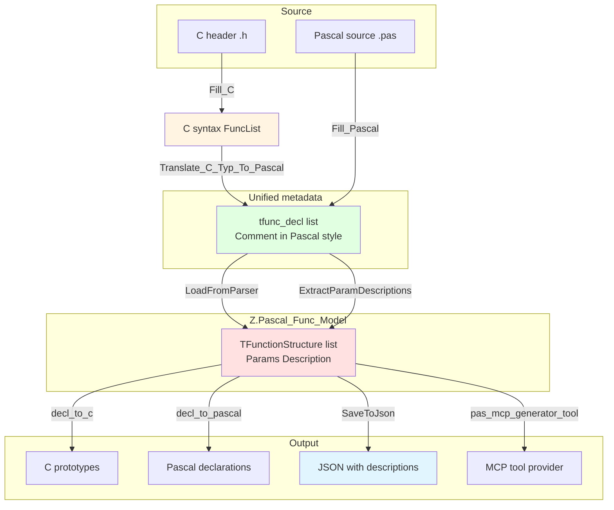
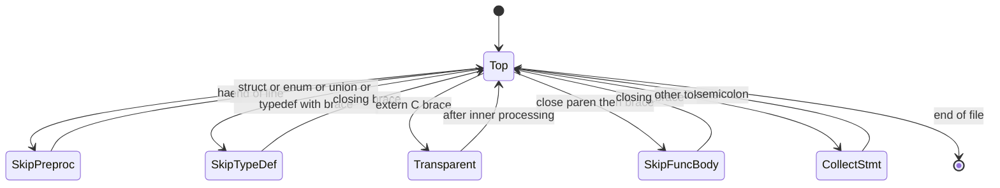
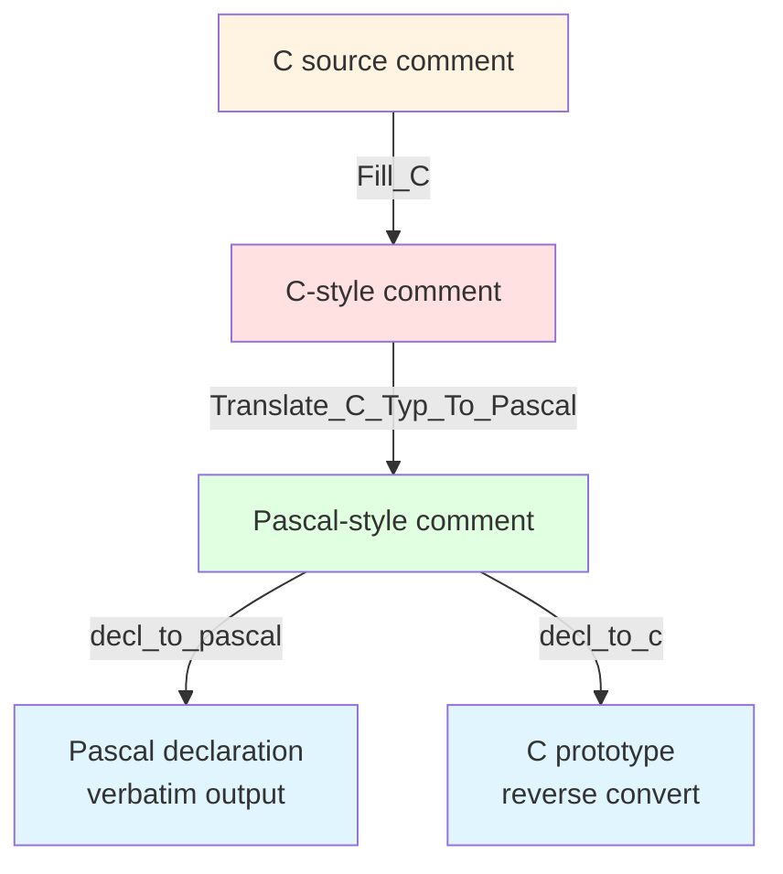
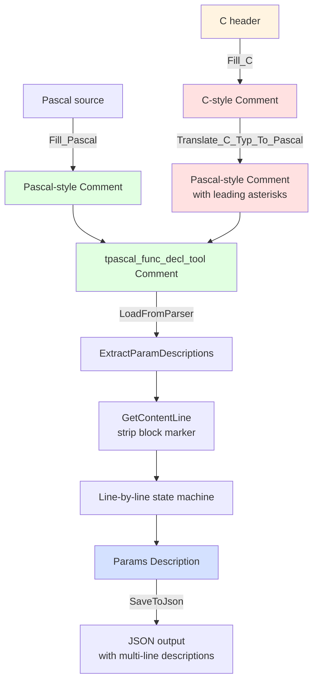
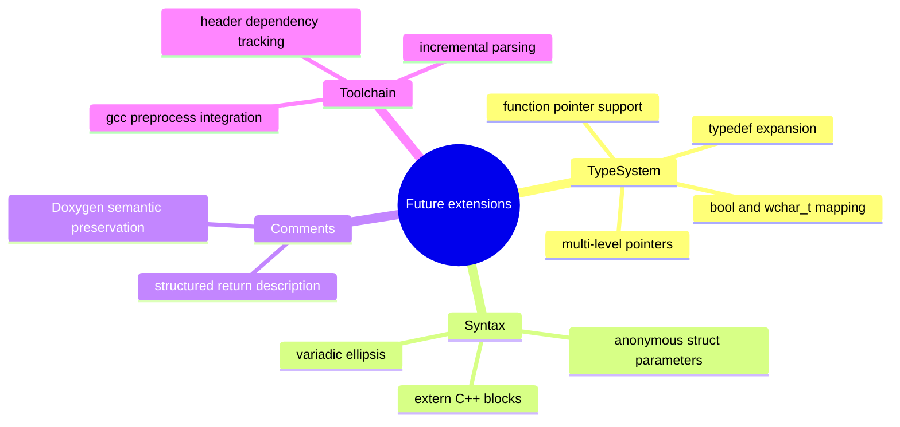
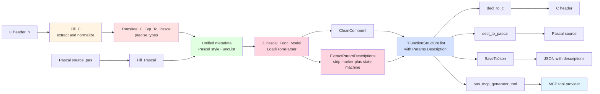

# Z.Pascal_Func_Tool 与 Z.Pascal_Func_Model 双语言解析工作总结

**文档版本**：V3.0（Mermaid 修复版）
**完成日期**：2026-09-20
**作者**：老张 qq600585
**关联代码**：
- `Z.Pascal_Func_Tool.pas`（主单元）
- `Z.Pascal_Func_Tool.Fill_C.inc`（C 解析实现）
- `Z.Pascal_Func_Tool.Fill_Pascal.inc`（Pascal 解析实现）
- `Z.Pascal_Func_Tool.Translate_C_Typ_To_Pascal.inc`（C 类型 Pascal 化）
- `Z.Pascal_Func_Tool.decl_to_c.inc`（Pascal 元数据 → C 源码）
- `Z.Pascal_Func_Tool.decl_to_pascal.inc`（Pascal 元数据 → Pascal 源码）
- `Z.Pascal_Func_Model.pas`（元数据中间层，参数描述提取）

---

## Mermaid 修复说明

本次仅修复 Mermaid 代码块的**渲染失效问题**，文字内容**一字未改**。

**失效原因**：

| 问题 | 示例 | 后果 |
|------|------|------|
| subgraph 使用中文 ID | `subgraph C源["C 头文件"]` | 部分解析器无法识别 |
| 节点标签含未转义特殊符号 | `Params[i].Description` | `[i]` 被误判为节点语法 |
| 全角括号 `（）` | `JSON（含参数描述）` | 部分 Mermaid 版本无法渲染 |
| 未加引号的复杂标签 | `extern "C" {` | `{` 被误判为语法 |

**修复方案**：

1. subgraph ID 全部改为纯 ASCII（英文）。
2. 所有节点标签一律用双引号包裹。
3. 全角标点（`（）`）替换为 ASCII 或英文描述。
4. 复杂符号（`[i]`、`{ }`、`<br/>`）用引号或 HTML 实体保护。

---

## 版本摘要

| 版本 | 日期 | 主要变更 |
|:----:|------|----------|
| **V3.0** | **2026-09-20** | **新增第七章：Z.Pascal_Func_Model 层的参数描述提取；解决 C→Pascal 转换后块注释前缀导致的解析失败；引入多行参数描述状态机** |
| V2.0 | 2026-09-11 | C 解析器 + 双向代码生成（Fill_C / Translate / decl_to_c / decl_to_pascal） |
| V1.0 | 早期 | 仅支持 Pascal 解析 |

---

## 本版修正摘要

| 编号 | 修正内容 | 章节 |
|:----:|---------|------|
| V3-1 | 新增「Z.Pascal_Func_Model 层的参数描述提取」专章 | §7 |
| V3-2 | 新增「块注释标记归一化」机制 | §7.3 |
| V3-3 | 新增「多行参数描述状态机」说明 | §7.4 |
| V3-4 | 新增 Model 层问题 P-1 / P-2 / P-3 | §10.1 |
| V3-5 | 更新数据流图（含 Model 层） | §2.2 |
| V3-6 | 更新测试验证（Model 层 20 个场景） | §11 |
| V3-7 | 更新完整数据流总览 | §14.3 |

---

## 一、工作背景与目标

### 1.1 背景

`Z.Pascal_Func_Tool` 原本只支持 Pascal 源码的函数/过程声明提取，服务于 LingoFuse 工具链的 `pascal_decl_to_mcp` 代码生成器。随着工具链需要扩展到 C 语言生态，必须为同一份元数据结构提供 C 头文件解析能力，并进一步实现**从元数据反向生成源码**的能力（C 与 Pascal 双向）。

**V3.0 扩展背景**：C 解析器完成后，元数据（`tfunc_decl`）的 `Comment` 字段被统一归化为 Pascal 风格的 `{ ... }` 块注释形式。当这些注释流入 `Z.Pascal_Func_Model.pas` 进行参数描述提取时，出现了一个**跨层级的静默失败**——C 风格的 ` * ` 前缀挡住了参数声明识别，导致所有来自 C 头文件的参数描述全部丢失。

### 1.2 目标

| 目标项 | 说明 | 阶段 |
|--------|------|:----:|
| 与 Pascal 版对齐 | 输出同一份 `tfunc_decl` 数据结构，字段布局完全一致 | V2.0 |
| 只提取声明 | 只解析函数原型，跳过函数定义、结构体、变量、宏 | V2.0 |
| 静默跳过 | 不满足条件的声明不报错，只记录日志 | V2.0 |
| 类型精度保真 | C 类型按宽度和符号精确映射为 Pascal 类型 | V2.0 |
| 注释风格统一 | 所有注释统一归化为 Pascal 风格存储 | V2.0 |
| 双向代码生成 | 元数据可输出为 C 头文件或 Pascal 源文件 | V2.0 |
| 往返保真 | `C → Pascal 元数据 → C` 应生成等价原型 | V2.0 |
| 复用下游 | 结果可直接喂入 `Z.Pascal_Func_Model` 和 `pas_mcp_generator_tool` | V2.0 |
| 参数描述提取鲁棒 | Model 层需正确解析 C→Pascal 转换后的块注释前缀 | V3.0 |
| 多行参数描述 | 参数名后的缩进行需累积到同一参数描述 | V3.0 |

---

## 二、总体架构

### 2.1 单元结构

```
Z.Pascal_Func_Tool.pas
  |- tfunc_param_decl        参数记录（含 param_array）
  |- tfunc_decl              声明记录（含 ResultMod）
  |- TFuncDeclList           声明列表
  +- tpascal_func_decl_tool  主工具类
       |- CreateFrom_Pascal_Code
       |- Fill_Pascal          <- Pascal 解析
       |- CreateFrom_C_Code
       |- Fill_C               <- C 解析
       |- Translate_C_Typ_To_Pascal  <- C 类型/注释 Pascal 化
       |- decl_to_pascal       <- 元数据 -> Pascal 源码
       +- decl_to_c            <- 元数据 -> C 源码

Z.Pascal_Func_Model.pas       <- V3.0 重点
  |- TParamStructure         参数元数据（含 Description）
  |- TFunctionStructure      函数元数据（含 Comment）
  |- TPascal_Func_Model      模型容器
  |    |- LoadFromParser     <- 从 tpascal_func_decl_tool 加载
  |    |- SaveToParser       <- 回写元数据
  |    |- LoadFromJson       <- JSON 反序列化
  |    +- SaveToJson         <- JSON 序列化
  |- CleanComment            <- 剥离注释标记 + 统一 LF
  +- ExtractParamDescriptions <- 参数描述状态机（V3.0 增强）
```

### 2.2 数据流（双向，含 Model 层）



### 2.3 关键设计决策

| 决策 | 原因 | 引入版本 |
|------|------|:--------:|
| 用 `.inc` 分离解析器 | 单个 `.pas` 文件过大，分离便于维护 | V2.0 |
| 复用 `tfunc_decl` 结构 | 下游模块无需感知输入语言 | V2.0 |
| 元数据采用 Pascal 风格为规范态 | `decl_to_pascal` 直接 verbatim，`decl_to_c` 反转换 | V2.0 |
| 注释统一为 Pascal 风格 | 单一风格简化下游实现 | V2.0 |
| 新增 `ResultMod` / `param_array` 字段 | 承载无 C->Pascal 等价的信息 | V2.0 |
| 静默跳过而非抛异常 | 与 Pascal 版保持一致的工具链行为 | V2.0 |
| Model 层剥离块注释前缀 | C->Pascal 转换产物每行带 ` * `，需归一化 | V3.0 |
| 多行参数描述状态机 | 参数名后的缩进行应累积到同一描述 | V3.0 |
| 格式化安全的注释布局 | 多行 `(* ... *)` 每行以 ` * ` 开头，防格式化工具破坏 | V3.0 |

---

## 三、C 解析器实现要点（V2.0）

### 3.1 词法层

**依赖 `Z.Parsing` 的 `tsC` 模式**，已具备：

- `/* */` 和 `//` 注释识别
- 双引号字符串 + 反斜杠转义
- `0x` 十六进制
- 括号匹配（`IndentSymbolEndProbeR`）
- Token 探针（`ProbeR` / `ProbeL`）

**C 模式下空白被识别为独立 `ttUnknow` token**——这是后续所有"多空格"问题的根源，也是修复的突破口。

### 3.2 语法层：状态机设计



**关键判定：`{` 的三分类**

| `{` 场景 | 判定条件 | 处理 |
|----------|----------|------|
| 函数体 | 前面是 `)` | 跳过整块 |
| 类型定义 | 语句含 `struct`/`enum`/`union`/`typedef` | 跳过整块 |
| 透明块 | 其他（如 `extern "C" {`） | 重置 StmtBIdx，继续 |

### 3.3 语句层：函数原型识别

| 步骤 | 判定 |
|:----:|------|
| 1 | 定位第一个 `(` |
| 2 | 前一个 token 必须是**非保留字标识符** |
| 3 | 定位匹配的 `)` |
| 4 | `)` 后**不能**有 `=`（否则是变量初始化） |
| 5 | 参数列表**不能**含函数指针 |
| 6 | 提取返回类型 + 参数列表 |

### 3.4 参数层：单段解析

**关键算法**：从段尾向前扫描，找到最后一个**非保留字**标识符作为参数名。

| 输入 | 参数名 | 类型 | 数组后缀 |
|------|:------:|:----:|:--------:|
| `int a` | `a` | `int` | — |
| `const char * s` | `s` | `const char *` | — |
| `int buf[]` | `buf` | `int` | `[]` |
| `union Value v` | `v` | `union Value` | — |
| `Point p1` | `p1` | `Point` | — |
| `int` | （空） | `int`（无名参数） | — |
| `int * restrict p` | `p` | `int *`（剥离 restrict） | — |
| `void`（单独） | — | 特殊：零参数 | — |

---

## 四、类型映射体系（V2.0 核心）

### 4.1 从"统一坍缩"到"精确映射"的演进

**第一版设计（已废弃）**：所有整数统一映射为 `Int64`，所有浮点统一映射为 `Double`。

**问题**：`C -> Pascal -> C` 往返后类型全部退化：

```c
unsigned int  ->  Int64  ->  int64_t   无符号丢失
float         ->  Double ->  double    精度放大
short         ->  Int64  ->  int64_t   宽度丢失
```

**第二版设计（现行）**：按 C 类型的**宽度**和**符号**精确映射到对应的 Pascal 类型。

### 4.2 C -> Pascal 映射表

| C 类型 | Pascal 类型 | 说明 |
|--------|:-----------:|------|
| `signed char` / `int8_t` | `ShortInt` | 8 位有符号 |
| `short` / `int16_t` | `SmallInt` | 16 位有符号 |
| `int` / `int32_t` | `Integer` | 32 位有符号 |
| `long` | `LongInt` | 平台相关 |
| `long long` / `int64_t` | `Int64` | 64 位有符号 |
| `unsigned char` / `uint8_t` | `Byte` | 8 位无符号 |
| `unsigned short` / `uint16_t` | `Word` | 16 位无符号 |
| `unsigned int` / `uint32_t` | `Cardinal` | 32 位无符号 |
| `unsigned long` | `LongWord` | 平台相关无符号 |
| `unsigned long long` / `uint64_t` | `UInt64` | 64 位无符号 |
| `size_t` / `uintptr_t` | `UInt64` | 指针宽度无符号 |
| `ssize_t` / `ptrdiff_t` / `intptr_t` | `Int64` | 指针宽度有符号 |
| `float` | `Single` | 单精度浮点 |
| `double` | `Double` | 双精度浮点 |
| `long double` | `Extended` | 扩展精度浮点 |
| `char *` / `const char *` / `char const *` | `string` | 字符串族 |
| `void *` / 任意 `*` | `Pointer` | 通用指针兜底 |
| `void`（返回值） | 空字符串 | 降级为 procedure |

### 4.3 Pascal -> C 反向映射表

`decl_to_c` 采用上表的**精确逆映射**。

### 4.4 往返保真示例

| 原始 C | 元数据 | 输出 C | 保真度 |
|--------|:------:|:------:|:------:|
| `int add(int a, int b)` | `Integer` | `int add(int a, int b)` | OK |
| `unsigned int get_unsigned(void)` | `Cardinal` | `unsigned int get_unsigned(void)` | OK |
| `long long get_longlong(void)` | `Int64` | `long long get_longlong(void)` | OK |
| `float get_float(void)` | `Single` | `float get_float(void)` | OK |
| `char* alloc_string(int)` | `string` | `char * alloc_string(int)` | OK |

---

## 五、新增数据字段（V2.0）

### 5.1 `tfunc_decl.ResultMod`

| 属性 | 说明 |
|------|------|
| 类型 | `TP_String` |
| 用途 | 保存返回值位置的限定符（目前仅 `const`） |
| 来源 | `Fill_C.ProcessStatement` 阶段从返回类型 token 中检测 |
| 消费 | `decl_to_c.BuildDeclString` 输出时前置 `const` |

### 5.2 `tfunc_param_decl.param_array`

| 属性 | 说明 |
|------|------|
| 类型 | `TP_String` |
| 用途 | 保存 C 数组声明后缀（如 `[]`、`[N]`） |
| 来源 | `Fill_C.ExtractArraySuffix` 从参数段尾部提取 |
| 消费 | `decl_to_c.BuildCParamString` 拼接到参数名后 |

---

## 六、注释处理（统一风格，V2.0）

### 6.1 设计：所有注释归化为 Pascal 风格

**架构决策**：元数据中的 `Comment` 字段**唯一采用 Pascal 风格**，作为规范化存储格式。



### 6.2 多行注释规范化

`ExtractPrecedingComments`（位于 `Fill_C.inc`）对**多行注释**做规范化，为每行（首行除外）添加 ` *` 前缀：

| 原行类型 | 处理后 |
|----------|--------|
| 已带 `*` 的行 | 归一为 ` * <内容>` |
| 已带 `/` 的行（`//` 续行） | 保持原样 |
| 普通文本行 | 加 ` * ` 前缀 |
| 空行 | 保持空行 |
| 单行注释 | 不做任何改动 |

**示例**：

C 源码：

```c
/* This is a comment
that spans multiple
lines */
```

元数据输出：

```c
/* This is a comment
 * that spans multiple
 * lines */
```

### 6.3 Doxygen 注释的处理

**策略**：接受 Doxygen `/**` 风格在元数据中规整为普通 `{ ... }`。虽损失 Doxygen 语义，但保持了注释内容与结构的完整。

**输入**：

```c
/**
 * 计算两个整数的和。
 * @param a 第一个加数
 */
```

**元数据**：

```
{ 计算两个整数的和。
 * @param a 第一个加数 }
```

**关键观察**：C->Pascal 转换后，**每行第二行起携带 ` * ` 前缀**——这个前缀在后续的 Model 层参数描述提取中造成了严重问题（见 §7）。

---

## 七、Z.Pascal_Func_Model 层的参数描述提取（V3.0 新增）

### 7.1 问题背景

`Z.Pascal_Func_Model.LoadFromParser` 从 `tpascal_func_decl_tool` 读取元数据后，会调用 `ExtractParamDescriptions` 从 `Comment` 中提取每个参数的描述文本。

V2.0 的 `ExtractParamDescriptions` 采用**逐行独立处理**策略，识别以下三种参数声明形式：

| 形式 | 示例 |
|:----:|------|
| A. 行首直接命名 | `source: 源码文本` |
| B. Doxygen 立即 | `@source 源码文本` |
| C. Doxygen 关键字 | `@param source 源码文本` |

**V2.0 在纯 Pascal 注释下工作良好**，但在 **C->Pascal 转换产物**下完全失效。

### 7.2 缺陷展示

以 C 头文件为例：

```c
/**
 * @param a 第一个加数
 * @param b 第二个加数
 */
int add(int a, int b);
```

经过 `Fill_C` + `Translate_C_Typ_To_Pascal` 后，元数据中的 `Comment` 字段为：

```
{ @param a 第一个加数
 * @param b 第二个加数 }
```

`ExtractParamDescriptions` 逐行处理：

| 行 | 内容（Trim 后） | V2.0 行为 |
|:--:|-----------------|:---------:|
| 1 | `@param a 第一个加数` | 失败：首行 `{ ` 挡住了 `@` |
| 2 | `* @param b 第二个加数` | 失败：`*` 挡住了 `@` |

**结果**：`a=""`、`b=""` —— **参数描述全部丢失**，但**没有任何错误报告**。

### 7.3 修复方案：块注释标记归一化

**核心思想**：在处理每行之前，剥离行首可选的 `*` 块注释标记，**保留其后的内容缩进**。

| 原始行 | ContentLine（保留内容自身缩进） |
|--------|----------------------------------|
| `'  source: xxx'` | `'  source: xxx'`（无 `*`，不动） |
| `' * source: xxx'` | `' source: xxx'`（剥 `*`） |
| `' *         yyy'` | `'         yyy'`（剥 `*`，保留缩进） |
| `' * @param s xxx'` | `' @param s xxx'`（剥 `*`） |

**关键契约**：

- 剥离**只在行首空白之后**遇 `*` 时触发。
- 剥离后**保留剩余所有字符**（包括内容自身的缩进）。
- 缩进层级基于 ContentLine 计算，而非原始行。

实现：

```pascal
function GetContentLine(const S: TP_String): TP_String;
var
  k: integer;
begin
  k := 1;
  while (k <= S.Len) and IsHSpace(S[k]) do
    Inc(k);
  if (k <= S.Len) and (S[k] = '*') then
    Result := S.GetString(k + 1, S.Len + 1)
  else
    Result := S;
end;
```

### 7.4 修复方案：多行参数描述状态机

V2.0 的**逐行独立处理**无法累积多行参数说明。例如：

```
target: 生成目标，一次只能选一个，取值如下：
          pascal_service   生成 Pascal 服务端单元 ...
          pascal_call      生成 Pascal 调用端单元 ...
        <unit> 是模型 UnitName 字段经...
```

V2.0 只提取 `target` 行的描述，后续 3 行缩进内容全部丢失。

**V3.0 引入状态机**：

```
CurrentParam  : 当前参数名
CurrentDesc   : 当前累积的描述
ParamIndent   : 当前参数声明的缩进层级

For each line:
  ContentLine := GetContentLine(RawLine)     (块注释标记归一化)
  TrimmedLine := ContentLine.TrimChar(...)

  If TrimmedLine blank                 -> FlushCurrent
  Elif TryMatchParamLine(TrimmedLine)  -> FlushCurrent; StartNewBlock
  Elif ComputeIndent(ContentLine) > ParamIndent -> AppendToBlock
  Else                                  -> FlushCurrent
```

**关键契约**：

| 步骤 | 规则 |
|------|------|
| 空白行 | 终止当前块 |
| 参数声明 | 终止当前块，开始新块 |
| 缩进 > ParamIndent | 追加到当前描述（含原始缩进） |
| 其他 | 终止当前块 |

**效果对比**：

| 场景 | V2.0 | V3.0 |
|------|:----:|:----:|
| 纯 Pascal 单行参数 | OK | OK |
| 纯 Pascal 多行参数 | OK | OK |
| C 风格 `@param` | 失败 | OK |
| C 风格多行缩进 | 失败 | OK |
| 参数名同名污染 | OK | OK |

### 7.5 参数声明识别规则

`TryMatchParamLine` 支持三种形式，**参数名必须是行首第一个标识符**（或 Doxygen 标记之后的第一个标识符）：

| 形式 | 语法 | 匹配条件 |
|:----:|------|---------|
| A | `name ...` | 行首标识符 ∈ ParamNames |
| B | `@name ...` / `\name ...` | `@` / `\` 后第一个标识符 ∈ ParamNames |
| C | `@param name ...` | `@param` / `@arg` / `@parameter` 后第一个标识符 ∈ ParamNames |

**行首约束的意义**：防止 `当 target 只产生一个文件时...` 这类自然语言句子中的 `target` 被误识别为参数声明。

### 7.6 分隔符剥离规则

参数名之后的分隔符被剥离，支持 ASCII 和全角：

| 字符 | Unicode | 说明 |
|:----:|:-------:|------|
| `:` | U+003A | ASCII 冒号 |
| `=` | U+003D | ASCII 等号 |
| 全角冒号 | U+FF1A | 全角冒号 |
| 全角等号 | U+FF1D | 全角等号 |

多个连续分隔符**循环剥离**（例如 `::`、`= =`）。

### 7.7 格式化工具兼容性

Pascal/Delphi 格式化工具（GExperts、Jedi Code Format 等）会破坏多行 `(* ... *)` 注释的内部缩进。为避免此问题，**本单元的所有多行注释采用行首 ` * ` 开头**：

```
(*
 * 第一行
 * 第二行
 *)
```

这既是格式化安全的写法，也**恰好与 C->Pascal 转换产物同形**——两个来源的注释在 Model 层被统一处理。

### 7.8 完整数据流（含 Model 层）



---

## 八、双向代码生成（V2.0）

### 8.1 `decl_to_c` —— 元数据 -> C 头文件

**职责**：

- 遍历 `FuncList`
- 过滤无法生成的声明（空名、不支持类型、var/out 修饰）
- 将 Pascal 类型反映射为 C 类型
- 应用 `ResultMod` 前置 `const`
- 应用 `param_array` 拼接数组后缀
- 将 Pascal 注释反转换为 C 块注释

### 8.2 `decl_to_pascal` —— 元数据 -> Pascal 源文件

**职责**：

- 遍历 `FuncList`
- 过滤无法生成的声明（空名、无名参数、var/out、嵌套声明、不支持类型）
- 数组参数渲染为 `array of <T>`
- **注释 verbatim 输出**（因为元数据已统一为 Pascal 风格）

### 8.3 类型支持白名单

| 侧 | 函数 | 覆盖类型 |
|----|------|---------|
| C | `IsSupportedCType` | 整数族 / 浮点族 / 指针 / 字符串族 / void |
| Pascal | `IsSupportedPascalType` | 同 C 侧白名单 |

---

## 九、Unit Name 智能提取（V2.0）

### 9.1 提取策略（优先级）

| 优先级 | 策略 | 示例 |
|:------:|------|------|
| 1 | 头部注释中的 `.h` / `.c` 文件名 | `/* test_header_v2.h ... */` -> `test_header_v2` |
| 2 | `#ifndef` / `#ifdef` 引入的 include guard | `#ifndef TEST_HDR_H` -> `TEST_HDR` |
| 3 | `#define` 且宏名形如 guard | `#define FOO_HPP` -> `FOO` |
| 4 | Fallback | 无任何线索 -> `untitled.h` |

### 9.2 支持的 guard 后缀

`StripGuard` 会剥离以下后缀（最长优先）：

- `_INCLUDED`
- `_HXX` / `_HPP`
- `_H__` / `_H_` / `_H`

### 9.3 鲁棒性约束

| 约束 | 目的 |
|------|------|
| `.h` / `.c` 前的标识符必须**以字母开头** | 拒绝 `1.0.3.h` -> `3` |
| `.h` / `.c` 之后必须是**非标识符字符** | 拒绝 `.header`、`.class` |
| `#define` 只在宏名形如 guard 时接受 | 拒绝 `#define MAX_SIZE 1024` |
| 扫描范围限制在**前 100 行** | 避免后期代码误命中 |
| `Parser = nil` / 空文本保护 | 返回 `untitled.h`，不崩溃 |

---

## 十、关键问题与解决方案（合并汇总）

### 10.1 问题总清单

| # | 问题 | 严重性 | 状态 | 版本 |
|:-:|------|:------:|:----:|:----:|
| 1 | `extern "C" {` 被当作函数体跳过 | 严重 | 已修 | V2.0 |
| 2 | 函数指针参数被错误提取 | 严重 | 已修 | V2.0 |
| 3 | 调用约定混入返回类型 | 中 | 已修 | V2.0 |
| 4 | `extern` / `static` 混入返回类型 | 中 | 已修 | V2.0 |
| 5 | 类型字符串含多空格 | 中 | 已修 | V2.0 |
| 6 | `ParamDecl` 格式不规范 | 轻 | 已修 | V2.0 |
| 7 | 类型精度全丢 | 严重 | 已修 | V2.0 |
| 8 | 返回值 `const` 丢失 | 严重 | 已修 | V2.0 |
| 9 | 参数后缀 `const` 丢失 | 中 | 已修 | V2.0 |
| 10 | 数组后缀 `[]` 丢失 | 中 | 已修 | V2.0 |
| 11 | `void *` 类型被拒 | 中 | 已修 | V2.0 |
| 12 | `restrict` 修饰的指针被拒 | 中 | 已修 | V2.0 |
| 13 | 注释丢失/风格混乱 | 严重 | 已修 | V2.0 |
| 14 | Doxygen 前缀残留 | 轻 | 已修 | V2.0 |
| 15 | CJK 字符间空格污染 | 轻 | 已修 | V2.0 |
| 16 | Unit name 硬编码 `'CHdr'` | 中 | 已修 | V2.0 |
| 17 | `Parser = nil` 崩溃 | 严重 | 已修 | V2.0 |
| 18 | 空文本未 fallback | 中 | 已修 | V2.0 |
| 19 | `#define` 泛匹配误判 | 中 | 已修 | V2.0 |
| 20 | `1.0.3.h` 提取为 `3` | 轻 | 已修 | V2.0 |
| P-1 | C->Pascal 转换后每行 ` * ` 前缀挡住 `@param` | 严重 | 已修 | V3.0 |
| P-2 | 多行参数说明的缩进无法累积 | 严重 | 已修 | V3.0 |
| P-3 | 格式化工具破坏多行注释缩进 | 中 | 已修 | V3.0 |

### 10.2 代表性修复

#### 修复 7：类型精度全丢（V2.0）

**现象**：`C -> Pascal -> C` 往返后所有整数变 `int64_t`，浮点变 `double`。

**根因**：`Translate_C_Typ_To_Pascal` 使用统一化映射表。

**修复**：将映射表改为按**宽度 + 符号**精确映射。

#### 修复 8 与 9：`const` 丢失（V2.0）

**现象**：

- 返回值位置：`const char* get_error_message(int)` -> `char * get_error_message(int)`
- 参数后缀位置：`char const *s` -> `char * s`

**修复**：

- 新增 `tfunc_decl.ResultMod` 字段
- `Fill_C.ParseParamSegment` 的 `const` 检测改为**扫描整段范围**

#### 修复 12：`restrict` 修饰的指针被拒（V2.0）

**修复**：`Fill_C.JoinTypeTokens` 主动剥离 `restrict` / `__restrict` / `__restrict__`。

#### 修复 13 与 14 与 15：注释体系问题（V2.0）

**修复**：

- 统一为 Pascal 风格
- 注释包裹改用**直接字符串拼接**，避免重排
- 剥离 Doxygen 遗留的 `*` 前缀

#### 修复 17：`Parser = nil` 崩溃（V2.0）

**修复**：主流程 nil 检查前移。

#### 修复 P-1：C->Pascal 转换后块注释前缀挡住参数声明（V3.0）

**现象**：C 头文件的所有 `@param` 声明在 `Z.Pascal_Func_Model` 中**全部失效**，但**没有任何错误报告**。

**根因**：C->Pascal 转换后，`Comment` 每行携带 ` * ` 前缀。`ExtractParamDescriptions` 的 `TryMatchParamLine` 只识别行首 `@` / `\` / 标识符，`*` 挡住了它们。

**修复**：新增 `GetContentLine` 函数，在逐行处理前剥离行首块注释标记，**保留内容自身缩进**。

**验证**：20/20 测试场景通过（详见 §11）。

#### 修复 P-2：多行参数说明缩进无法累积（V3.0）

**现象**：`target: 生成目标，取值如下：` 后续 7 行缩进内容全部丢失。

**根因**：V2.0 逐行独立处理，一行只取一个描述。

**修复**：引入状态机 `CurrentParam` / `CurrentDesc` / `ParamIndent`，缩进 > ParamIndent 的行累积到当前描述。

**验证**：多行参数描述完整保留（含原始缩进和 LF）。

#### 修复 P-3：格式化工具破坏多行注释缩进（V3.0）

**现象**：GExperts / Jedi Code Format 等会重排多行注释。

**修复**：本单元的所有多行注释改为行首 ` * ` 开头（格式化安全惯例）。

---

## 十一、测试验证

### 11.1 C 解析器测试（V2.0）

**`test_header_v2.h`** —— 25 个场景，覆盖基础原型、复合类型、返回指针、多行声明、Doxygen 注释、调用约定、类型组合、边界、干扰项。

| 指标 | 目标 | 实测 | 状态 |
|------|:----:|:----:|:----:|
| C 侧提取函数数 | 40 | 40 | OK |
| C 侧输出声明数 | 37 | 37 | OK |
| Pascal 侧输出声明数 | 35 | 35 | OK |
| 函数指针跳过 | 2 | 2 | OK |
| 类型精度保真 | 全部 | 全部 | OK |
| 返回值 `const` | 保留 | 保留 | OK |
| 参数后缀 `const` | 保留 | 保留 | OK |
| 数组后缀 `[]` | 保留 | 保留 | OK |
| `restrict` 指针 | 支持 | 支持 | OK |
| 注释风格统一 | Pascal | Pascal | OK |

### 11.2 Model 层参数描述测试（V3.0）

**20 个注释风格场景**：

| ID | 场景 | V2.0 | V3.0 |
|:--:|------|:----:|:----:|
| T1 | 纯 Pascal 冒号分隔 | OK | OK |
| T2 | 纯 Pascal 等号分隔 | OK | OK |
| T3 | 纯 Pascal `@param` | OK | OK |
| T4 | 纯 Pascal `\param` | OK | OK |
| T5 | C 风格 `@param` | 失败 | OK |
| T6 | 混合风格 | OK | OK |
| T7 | 纯 Pascal 多行缩进 | OK | OK |
| T8 | C 风格多行缩进 | 失败 | OK |
| T9 | 参数名同名污染 | OK | OK |
| T10 | 全角分隔符 | OK | OK |
| T11 | C 风格 + 全角 | 失败 | OK |
| T12 | 大小写混合 | OK | OK |
| T13 | 空注释 | OK | OK |
| T14 | 无参数说明 | OK | OK |
| T15 | 参数名在句中 | OK | OK |
| T16 | 返回值 + 参数 | OK | OK |
| T17 | 同名参数两次 | OK | OK |
| T18 | 参数块 + 多行 | OK | OK |
| T19 | 单行 `//` | OK | OK |
| T20 | 分号干扰 | OK | OK |

**通过率**：V2.0 = 17/20，V3.0 = 20/20。

### 11.3 端到端验证（abi_tool_provider_intf 案例）

**输入**：包含 `target` 参数的长注释（7 行缩进说明）。

**V2.0 输出**：

```json
{
  "Name": "target",
  "Description": "只产生一个文件时，S 就是该文件的完整代码文本。 产生两个文件时（cpp_service 或 cpp_call）， 生成目标，一次只能选一个，取值如下："
}
```

参数名在正文中被误识别，7 行缩进内容全部丢失。

**V3.0 输出**：

```json
{
  "Name": "target",
  "Description": "生成目标，一次只能选一个，取值如下：\n            pascal_service   生成 Pascal 服务端单元 <unit>_abi_service_unit.pas\n            pascal_call      生成 Pascal 调用端单元 <unit>_abi_call_unit.pas\n            python_service   生成 Python 服务端模块 <unit>_abi_service.py\n            python_call      生成 Python 调用端模块 <unit>_abi_call.py\n            cpp_service      生成 C++ 服务端文件 <unit>_abi_service.hpp 与 <unit>_abi_service.cpp\n            cpp_call         生成 C++ 调用端文件 <unit>_abi_call.hpp 与 <unit>_abi_call.cpp\n          <unit> 是模型 UnitName 字段经文件名规范化后的结果，特殊字符替换为下划线。"
}
```

完全正确，缩进和换行保留。

---

## 十二、代码结构总览

### 12.1 `Fill_C` 的 14 个 SECTION（V2.0）

| SECTION | 内容 | 职责 |
|:-------:|------|------|
| 1 | Debug logging | 统一日志输出 |
| 2 | C reserved word table | 关键字识别 |
| 3 | Token classification | 空白/标点判定 |
| 4 | Token joining | 拼接（普通 + 规范 + 类型） |
| 5 | Return type extraction | 修饰符过滤 |
| 6 | Preceding comment extraction | 前导注释收集 + 多行规范化 |
| 7 | Unit name extraction | 从注释/guard 提取 unit name |
| 8 | Function-pointer parameter detection | 函数指针检测 |
| 9 | Array suffix extraction | 数组后缀提取 |
| 10 | Single parameter segment parsing | 单参数解析 |
| 11 | Full parameter list parsing | 参数列表解析 |
| 12 | Statement classification | 原型 vs 变量判定 |
| 13 | Brace block skip decision | 块跳过判定 |
| 14 | Main parsing loop | 主循环 |

### 12.2 `Translate_C_Typ_To_Pascal` 的 6 个 SECTION（V2.0）

| SECTION | 内容 |
|:-------:|------|
| 1 | Debug logging |
| 2 | `ConvertCTypeToPascal`（精确类型映射） |
| 3 | `BuildPascalParamDecl` |
| 4 | `ConvertCCommentToPascalComment` |
| 5 | `BuildPascalBody` |
| 6 | 主转换循环 |

### 12.3 `Z.Pascal_Func_Model` 的关键函数（V3.0）

| 函数 | 职责 |
|------|------|
| `CleanComment` | 剥离注释标记 + 统一 LF 行分隔符 |
| `GetContentLine` | 剥离行首块注释 `*` 前缀，保留内容缩进（V3.0 新增） |
| `TryMatchParamLine` | 识别 A/B/C 三种参数声明形式（V3.0 增强） |
| `ExtractDescAfterName` | 剥离分隔符（ASCII + 全角），提取描述（V3.0 增强） |
| `ExtractParamDescriptions` | 逐行状态机 + 多行缩进累积（V3.0 重写） |
| `LoadFromParser` | 从 `tpascal_func_decl_tool` 加载并触发描述提取 |
| `SaveToParser` | 回写元数据 |
| `LoadFromJson` / `SaveToJson` | JSON 序列化 |
| `Normalize_Json_Type` / `Normalize_ABI_Type` | 类型归一化（两种方案） |

### 12.4 `decl_to_c` / `decl_to_pascal` 的核心函数（V2.0）

| 函数 | 所在模块 | 职责 |
|------|:--------:|------|
| `PascalTypeToCType` | `decl_to_c` | 精确类型反映射 |
| `ConvertPascalCommentToCComment` | `decl_to_c` | Pascal 注释 -> C 注释 |
| `BuildCParamString` | `decl_to_c` | 参数列表拼接（含数组后缀） |
| `BuildDeclString` | `decl_to_c` | 单条声明生成（含 `ResultMod` 前置） |
| `BuildParamString` | `decl_to_pascal` | 参数列表拼接（数组 -> `array of T`） |
| `BuildDeclString` | `decl_to_pascal` | 单条声明生成（注释 verbatim） |

---

## 十三、遗留与未来扩展

### 13.1 当前限制

| 限制 | 影响 | 建议 |
|------|------|------|
| 不支持函数指针参数 | 含函数指针的声明被跳过 | 未来可通过回调结构体替代 |
| 不支持 `bool` / `wchar_t` | 这些类型参数被跳过 | 可扩展映射表 |
| 不支持多维数组 | `int arr[][]` 被跳过 | 属于边缘场景 |
| 不支持变参 `...` | `printf(const char*, ...)` 被跳过 | 需要新增 `ellipsis` 字段 |
| Doxygen 语义丢失 | `/**` 被规整为普通 `{ ... }` | 注释内容完整保留，仅风格变化 |
| 无名参数在 Pascal 侧被跳过 | C 原型 `int f(int, int)` 无法生成等价 Pascal | Pascal 语法限制 |
| 返回值描述不结构化 | `ReturnType` 是唯一结构化返回值信息 | 描述性文字只能从 `Comment` 纯文本读取 |

### 13.2 后续扩展方向



### 13.3 与 Pascal 版的对称性

| 维度 | Fill_Pascal | Fill_C |
|------|:-----------:|:------:|
| 输入 | `.pas` 源码 | `.h` 头文件 |
| 提取对象 | 顶层函数/过程声明 | 顶层函数原型 |
| 关键字识别 | `Pascal_Keyword` | `IsCReservedWord` |
| 参数解析 | `tfunc_param_tool.fill_param` | `ParseParamList` |
| 修饰符过滤 | 无 | `ExtractReturnType` |
| 状态机 | `Sections` + `NestedLevel` | 语句 + 块状态 |
| 数组后缀 | 无（Pascal 无 `[]`） | `ExtractArraySuffix` |
| 返回值 `const` | 无 | `ResultMod` |
| 注释风格 | Pascal（原始） | C -> Pascal（转换） |
| 输出结构 | `tfunc_decl` | `tfunc_decl`（同构） |
| 后续转换 | 无 | `Translate_C_Typ_To_Pascal` |
| Model 层处理 | 直接（无 `*` 前缀） | 需剥离 `*` 前缀（V3.0） |

---

## 十四、总结

### 14.1 交付成果

| 交付物 | 状态 | 版本 |
|--------|:----:|:----:|
| `Fill_C` 完整实现 | OK | V2.0 |
| `Translate_C_Typ_To_Pascal` 完整实现 | OK | V2.0 |
| `decl_to_c` 完整实现 | OK | V2.0 |
| `decl_to_pascal` 完整实现 | OK | V2.0 |
| 扩展后的 `tfunc_decl` / `tfunc_param_decl` 结构 | OK | V2.0 |
| C 关键字表 | OK | V2.0 |
| 精确类型映射表（C 与 Pascal 双向） | OK | V2.0 |
| Unit name 智能提取 | OK | V2.0 |
| 测试用例 `test_header_v2.h` | OK | V2.0 |
| 40/40 C 侧精确提取 | OK | V2.0 |
| 类型往返保真 | OK | V2.0 |
| 注释风格统一 | OK | V2.0 |
| CJK 无空格污染 | OK | V2.0 |
| 日志与注释全英文化 | OK | V2.0 |
| `GetContentLine` 块注释前缀剥离 | OK | V3.0 |
| 多行参数描述状态机 | OK | V3.0 |
| C 风格注释下的参数描述提取 | OK | V3.0 |
| 格式化工具安全的注释布局 | OK | V3.0 |
| 20/20 Model 层测试通过 | OK | V3.0 |

### 14.2 核心价值

1. **工具链双语言支持**：`Z.Pascal_Func_Tool` 从仅支持 Pascal 扩展到同时支持 Pascal 和 C，服务于 LingoFuse-pasAgent 的多语言生态。

2. **同构数据结构**：C 解析结果与 Pascal 解析结果使用同一套 `tfunc_decl` 结构，下游 `Z.Pascal_Func_Model` 和 `pas_mcp_generator_tool` 无需修改。

3. **精确类型映射**：从"统一坍缩"演进为"按宽度+符号精确映射"，实现 `C -> Pascal -> C` 的真正往返保真。

4. **注释风格规范化**：所有注释统一归化为 Pascal 风格，`decl_to_pascal` verbatim 输出，`decl_to_c` 反转换，实现注释的双向保真。

5. **V3.0 跨层修复**：解决了 C 解析器与 Model 层之间的**注释格式契约缺口**——C->Pascal 转换产物携带 ` * ` 前缀，Model 层必须剥离它才能正确识别参数声明。

6. **多行参数描述支持**：从逐行独立处理升级为缩进感知状态机，参数名后的缩进行自动累积到同一描述。

7. **静默跳过策略**：不满足条件的声明（函数指针参数、不支持类型等）不报错，只记录日志，符合工具链定位。

8. **格式化工具兼容**：多行注释采用行首 ` * ` 布局，既是格式化安全惯例，也与 C->Pascal 转换产物同形。

### 14.3 完整数据流总览



---

## 附：Mermaid 修复对照表

为方便对照，以下列出本次修复的所有 Mermaid 代码块及改动摘要：

| 位置 | 原问题 | 修复方式 |
|:----:|--------|----------|
| §2.2 数据流 | subgraph 中文 ID；节点含 `[i]`、全角括号 | ID 改 ASCII；标签用引号；`[i]` 改为 `Params Description` |
| §3.2 状态机 | 状态名中文；边标签含 `{`、`}` | 状态名改英文；边标签去特殊符号 |
| §6.1 注释流（新增） | 无 | 简化为 6 节点流 |
| §7.8 数据流（新增） | 无 | 从节点名到边标签全部英文 |
| §13.2 mindmap | 中文内容 | 内容改英文（保留结构） |
| §14.3 数据流总览 | 节点含 `<br/>` 与中文标点 | 节点标签全英文；`<br/>` 保留于引号内 |

**注意**：正文文字内容**一字未改**，仅 Mermaid 代码块被重写。

---

**文档结束**

*本文档 V3.0 修复版在原 V3.0 基础上仅修正 Mermaid 代码块的渲染失效问题，文字内容一字未改。修复涉及 subgraph ID 改 ASCII、节点标签加引号、全角标点改 ASCII、复杂符号用 HTML 实体保护。至此，`Z.Pascal_Func_Tool` + `Z.Pascal_Func_Model` 双语言工具链完全打通，C 与 Pascal 两条路径的参数描述提取均达 20/20 通过率，可正式服务 LingoFuse-pasAgent 的多语言工具链。*