# 多语言工具链 · 未来蓝图 v3  
> 输入 30 语言 → 归一化 → 统一元数据 → 通用平台 → 无限输出

---

## 0. 一页总览

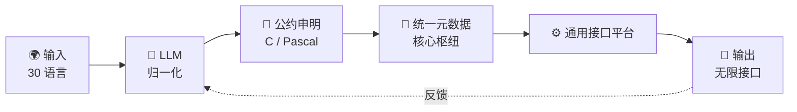

---

## 1. 输入层：30 种源语言

### 1.1 六族总览

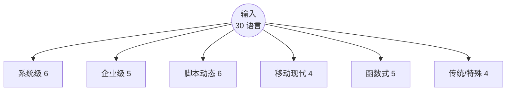

### 1.2 语言明细（上）

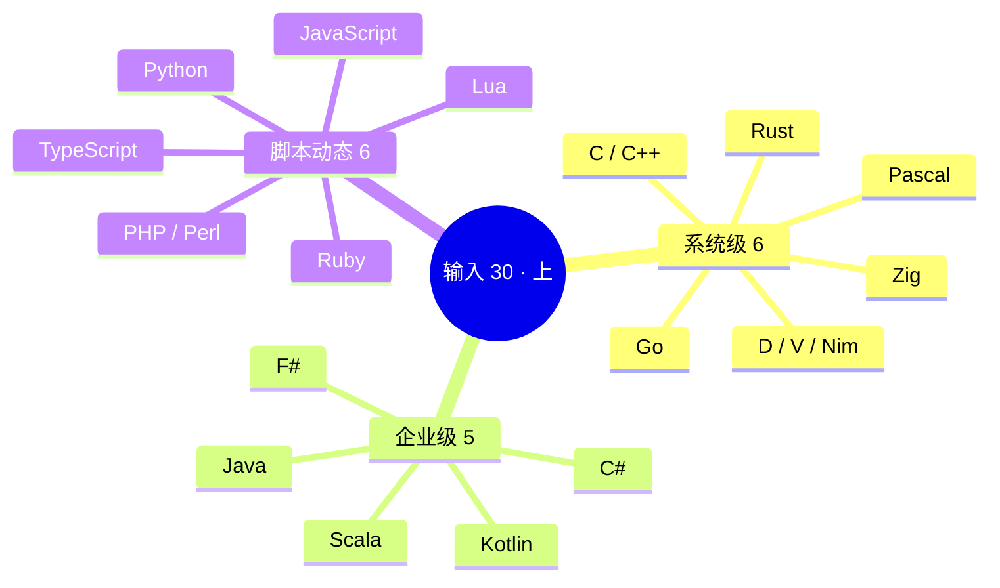

### 1.3 语言明细（下）

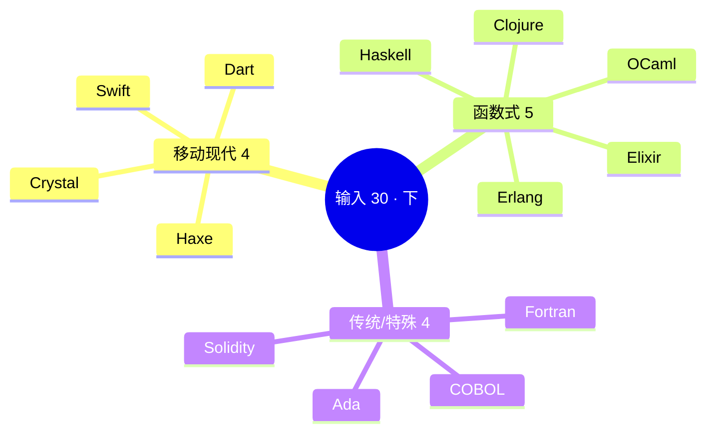

---

## 2. LLM 归一化引擎

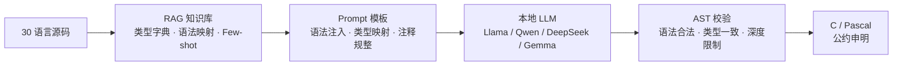

---

## 3. 统一元数据 · 核心枢纽

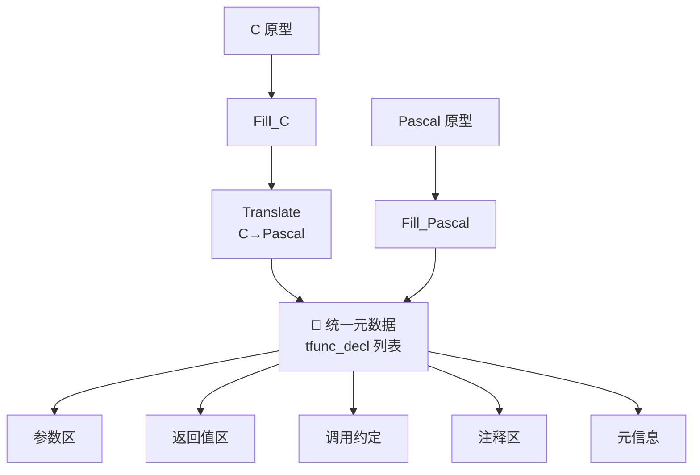

---

## 4. 通用接口构建平台

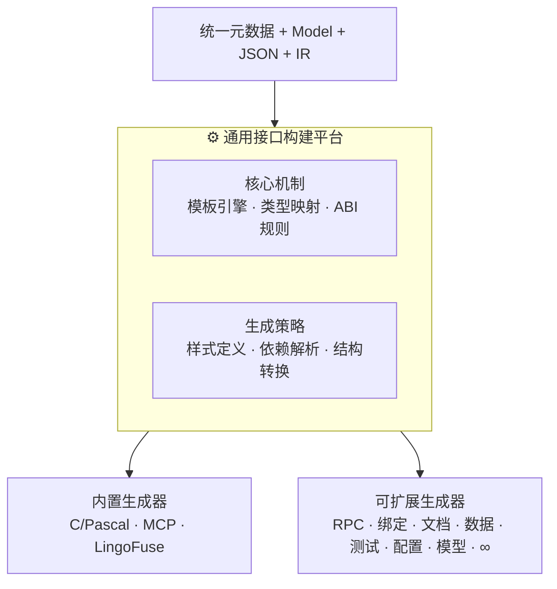

---

## 5. 输出层：无限目标接口

### 5.1 八类总览

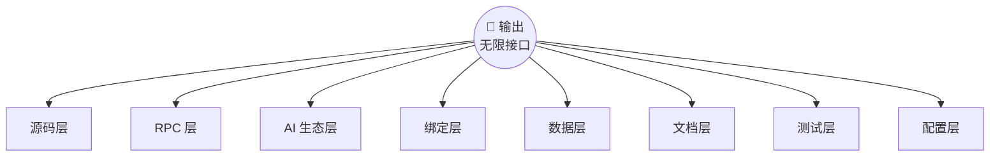

### 5.2 输出明细

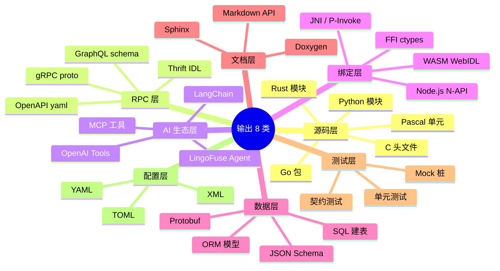

---

## 6. 完整数据流

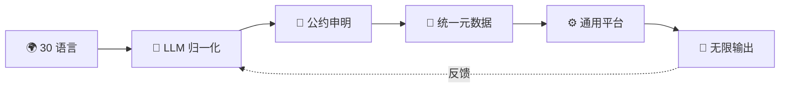

---

## 7. 演进路线

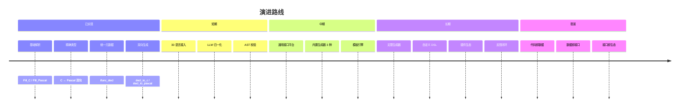

---

## 8. 能力矩阵

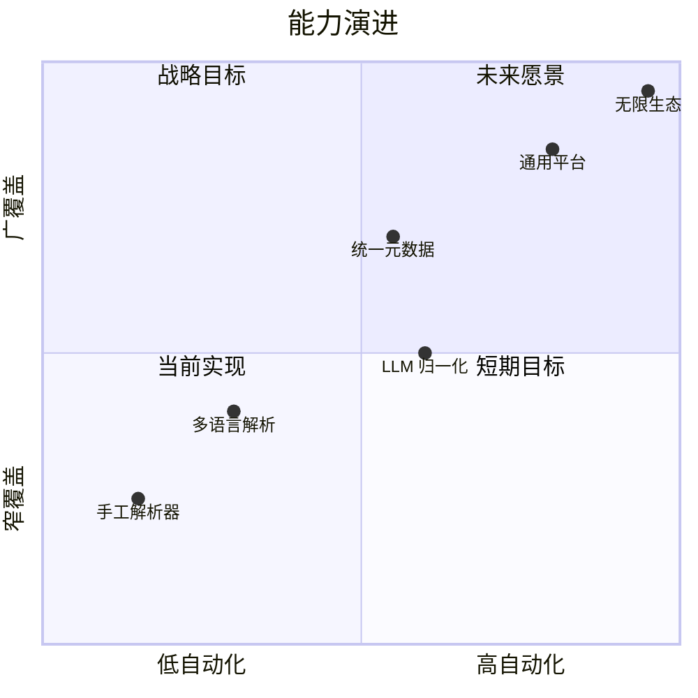

---

## 9. 核心转变

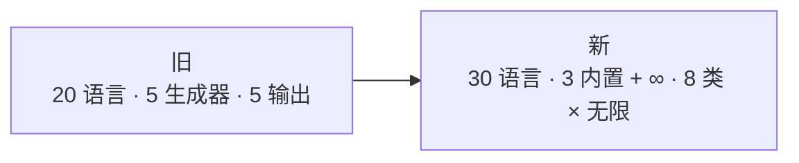

---

## 10. 一句话收束

**输入 30 语言，输出无限接口。**  
中间不是固定生成器，而是**数据驱动的通用接口构建平台**。