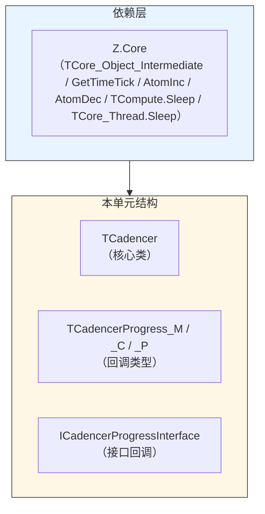
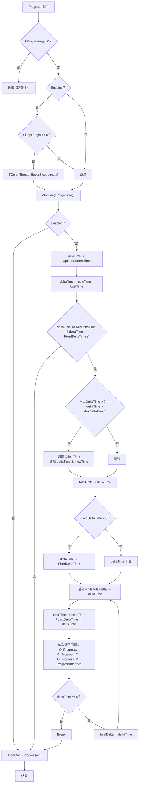
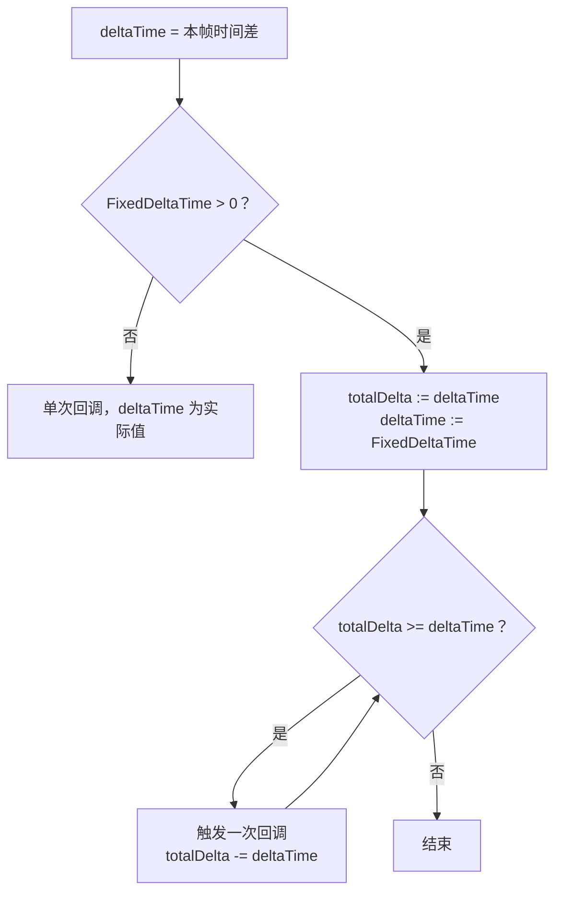
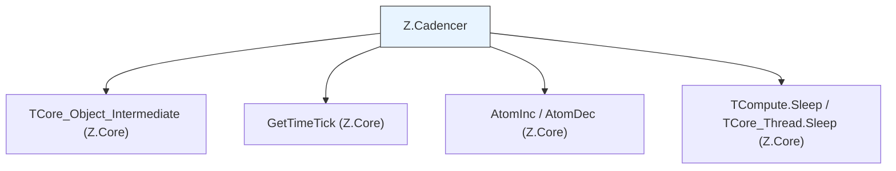

# Z.Cadencer 知识库（最终传承版）

> **定位**：面向 AI 与人类工程师的权威参考。目标是让读者**无需翻阅源码**即可安全、准确地使用 `Z.Cadencer`。
> **承诺**：所有描述均来自 `Z.Cadencer.pas` 的逐行核对。凡我无法从源码确定的，在文末「诚实的不确定清单」中明示。
> **制图约定**：全文流程图/架构图/决策树一律使用 Mermaid，不使用字符制图。

---

## 第 0 章 快速定位：这个单元是什么

`Z.Cadencer` 是 Z 框架的**时间驱动进度器**。它根据真实时间计算 `deltaTime` 和 `newTime`，并触发回调，用于动画、模拟、固定步长逻辑等场景。它**不创建线程**，需要外部定期调用 `Progress`。



**核心能力**：

| 能力 | 说明 |
|------|------|
| 时间驱动 | 基于 `GetTimeTick` 计算秒级 `deltaTime` / `newTime` |
| 时间乘数 | `TimeMultiplier` 可缩放时间流速 |
| 暂停/恢复 | `Enabled` 切换，保持时间连续（不跳跃） |
| 最大 Delta | `MaxDeltaTime` 钳制单次进度，隐藏多余时间 |
| 最小 Delta | `MinDeltaTime` 限制最小步长，避免过密回调 |
| 固定步长 | `FixedDeltaTime` 将一帧拆分为多次固定 `deltaTime` 回调 |
| 多种回调 | `OnProgress`（方法）、`OnProgress_C`（过程）、`OnProgress_P`（匿名/嵌套）、`ProgressInterface`（接口） |
| 防重入计数 | `FProgressing` 用于析构时等待，但不阻止回调中再次调用 `Progress` |

**它不是**：
- **不是**定时器（不自动触发，需手动调用 `Progress`）。
- **不是**线程安全的（多线程同时调用 `Progress` 需外部加锁）。
- **不是**高精度计时器（依赖 `GetTimeTick`，精度为毫秒）。

---

## 第 1 章 类型与接口

### 1.1 回调类型

```pascal
type
  TCadencerProgress_M = procedure(Sender: TObject; const deltaTime, newTime: Double) of object;
  TCadencerProgress_C = procedure(Sender: TObject; const deltaTime, newTime: Double);
{$IFDEF FPC}
  TCadencerProgress_P = procedure(Sender: TObject; const deltaTime, newTime: Double) is nested;
{$ELSE FPC}
  TCadencerProgress_P = reference to procedure(Sender: TObject; const deltaTime, newTime: Double);
{$ENDIF FPC}
```

| 类型 | 风格 | 捕获上下文 |
|------|------|-----------|
| `_M` | 对象方法 | 通过 `Self` |
| `_C` | 独立过程 | ❌ 无 |
| `_P` | FPC 嵌套过程 / Delphi 匿名方法 | ✅ 可捕获局部变量 |

### 1.2 接口

```pascal
ICadencerProgressInterface = interface
  procedure CadencerProgress(const deltaTime, newTime: Double);
end;
```

**契约**：
- 接口方法**没有 `Sender` 参数**。
- 实现该接口的对象需提供 `CadencerProgress` 方法。
- 设置 `ProgressInterface` / `OnProgressInterface` 属性即可挂接。

---

## 第 2 章 `TCadencer` 类

### 2.1 字段总览

```pascal
TCadencer = class(TCore_Object_Intermediate)
private
  FTimeMultiplier: Double;              // 时间乘数，默认 1
  LastTime, DownTime, LastMultiplier: Double;
  FLastDeltaTime: Double;               // 最后一次回调的 deltaTime
  FEnabled: Boolean;                    // 启用状态，默认 True
  FSleepLength: Integer;                // 睡眠毫秒，默认 -1（不睡眠）
  FCurrentTime: Double;                 // 当前进度时间
  FOriginTime: Double;                  // 时间原点
  FMaxDeltaTime, FMinDeltaTime, FFixedDeltaTime: Double;
  FOnProgress: TCadencerProgress_M;
  FOnProgress_C: TCadencerProgress_C;
  FOnProgress_P: TCadencerProgress_P;
  FProgressing: Integer;                // 进度计数，防重入/析构等待
  FOn_Progress_Interface: ICadencerProgressInterface;
protected
  function StoreTimeMultiplier: Boolean;
  procedure SetEnabled(const val_: Boolean);
  procedure SetTimeMultiplier(const val_: Double);
  procedure SetCurrentTime(const Value: Double);
  function GetRawReferenceTime: Double;
public
  constructor Create;
  destructor Destroy; override;
  procedure Progress;
  function UpdateCurrentTime: Double;
  function IsBusy: Boolean;
  procedure Reset;
  // 属性...
end;
```

### 2.2 构造函数 `Create`

**初始化顺序**（源码）：
1. `inherited Create`。
2. `DownTime := GetRawReferenceTime`。
3. `FOriginTime := DownTime`。
4. `FTimeMultiplier := 1`。
5. `LastTime := 0`。
6. `LastMultiplier := 0`。
7. `FLastDeltaTime := 0`。
8. `FSleepLength := -1`。
9. **`Enabled := True`**（触发 `SetEnabled`）。
10. 四个回调置 `nil`。

**⚠️ 关键陷阱**：`Enabled := True` 会调用 `SetEnabled(True)`。由于 `FEnabled` 初始为 `False`，`SetEnabled` 会执行：
```pascal
FEnabled := True;
if Enabled then
  FOriginTime := FOriginTime + GetRawReferenceTime - DownTime;
```
此时 `FOriginTime` 是 `DownTime`，新的 `GetRawReferenceTime` 比 `DownTime` 稍大，因此 `FOriginTime` 被更新为新的当前时间。**初始 `CurrentTime` 约为 0**，但 `FOriginTime` 不再等于 `DownTime`。这是有意行为：确保启用后时间从 0 附近开始。

### 2.3 析构函数 `Destroy`

```pascal
destructor TCadencer.Destroy;
begin
  while FProgressing > 0 do
    TCompute.Sleep(1);
  inherited Destroy;
end;
```

**契约**：
- 等待 `FProgressing` 归零，避免在 `Progress` 执行中释放对象。
- **若回调中一直调用 `Progress`**，可能导致死循环。
- **不等待回调完成**，只等待 `Progress` 计数归零。

### 2.4 属性详解

| 属性 | 类型 | 默认值 | 读/写 | 语义 |
|------|------|--------|-------|------|
| `OriginTime` | `Double` | 构造时当前时间 | 读/写 | 时间原点，`CurrentTime = (Raw - OriginTime) * TimeMultiplier` |
| `CurrentTime` | `Double` | 0 | 读/写 | 当前进度时间，写会触发 `SetCurrentTime` |
| `Enabled` | `Boolean` | True | 读/写 | 启用/禁用，禁用时 `Progress` 无操作 |
| `TimeMultiplier` | `Double` | 1 | 读/写 | 时间乘数，0 表示暂停 |
| `MaxDeltaTime` | `Double` | 0 | 读/写 | 最大单次 `deltaTime`，0 或负数表示无限制 |
| `MinDeltaTime` | `Double` | 0 | 读/写 | 最小单次 `deltaTime`，低于此值不触发回调 |
| `FixedDeltaTime` | `Double` | 0 | 读/写 | 固定步长，>0 时每次回调 `deltaTime` 固定为该值 |
| `SleepLength` | `Integer` | -1 | 读/写 | 每次 `Progress` 前睡眠毫秒，<0 不睡眠 |
| `LastDeltaTime` | `Double` | 0 | 只读 | 最后一次回调的 `deltaTime` |
| `OnProgress` | `TCadencerProgress_M` | nil | 读/写 | 方法回调 |
| `OnProgress_C` | `TCadencerProgress_C` | nil | 读/写 | 过程回调 |
| `OnProgress_P` | `TCadencerProgress_P` | nil | 读/写 | 匿名/嵌套回调 |
| `ProgressInterface` | `ICadencerProgressInterface` | nil | 读/写 | 接口回调 |
| `OnProgressInterface` | `ICadencerProgressInterface` | nil | 读/写 | 同 `ProgressInterface` |

### 2.5 `SetCurrentTime` 的精确行为

```pascal
procedure TCadencer.SetCurrentTime(const Value: Double);
begin
  LastTime := Value - (FCurrentTime - LastTime);
  FOriginTime := FOriginTime + (FCurrentTime - Value);
  FCurrentTime := Value;
end;
```

**契约**：
- 调整 `LastTime` 和 `FOriginTime`，使 `deltaTime` 计算不受跳跃影响。
- 下次 `UpdateCurrentTime` 返回 `Value`。
- **不触发 `Progress`**。

### 2.6 `SetEnabled` 的精确行为

```pascal
procedure TCadencer.SetEnabled(const val_: Boolean);
begin
  if FEnabled <> val_ then
  begin
    FEnabled := val_;
    if Enabled then
      FOriginTime := FOriginTime + GetRawReferenceTime - DownTime
    else
      DownTime := GetRawReferenceTime;
  end;
end;
```

**契约**：
- **禁用时**：记录 `DownTime = 当前 Raw`。
- **启用时**：`FOriginTime += 当前 Raw - DownTime`，使 `CurrentTime` 连续，不跳跃。
- **不修改 `TimeMultiplier`**。
- **如果 `TimeMultiplier = 0`**，`CurrentTime` 恒为 0，启用/禁用调整 `OriginTime` 无实际影响。

### 2.7 `SetTimeMultiplier` 的精确行为

```pascal
procedure TCadencer.SetTimeMultiplier(const val_: Double);
var
  rawRef: Double;
begin
  if val_ <> FTimeMultiplier then
  begin
    if val_ = 0 then
    begin
      LastMultiplier := FTimeMultiplier;
      Enabled := False;
    end
    else
    begin
      rawRef := GetRawReferenceTime;
      if FTimeMultiplier = 0 then
      begin
        Enabled := True;
        FOriginTime := rawRef - (rawRef - FOriginTime) * LastMultiplier / val_;
      end
      else
        FOriginTime := rawRef - (rawRef - FOriginTime) * FTimeMultiplier / val_;
    end;
    FTimeMultiplier := val_;
  end;
end;
```

**契约**：
- **设置 `val_ = 0`**：保存当前乘数到 `LastMultiplier`，`Enabled := False`，然后 `FTimeMultiplier := 0`。
- **从 0 恢复到非 0**：`Enabled := True`，用 `LastMultiplier` 调整 `OriginTime` 保持时间连续，然后 `FTimeMultiplier := val_`。
- **非 0 到非 0**：调整 `OriginTime` 保持 `CurrentTime` 连续。
- **`GetRawReferenceTime` 被调用两次**（一次在 `rawRef`，一次在 `SetEnabled` 内部），可能导致微小误差。

### 2.8 `Reset` 的精确行为

```pascal
procedure TCadencer.Reset;
begin
  LastTime := 0;
  DownTime := GetRawReferenceTime;
  FOriginTime := DownTime;
end;
```

**契约**：
- `LastTime := 0`。
- `OriginTime := 当前 Raw`。
- `DownTime := 当前 Raw`。
- **不重置 `FCurrentTime`**，下次 `UpdateCurrentTime` 会重新计算。
- **不重置 `TimeMultiplier` / `Enabled` / 回调**。

### 2.9 `UpdateCurrentTime` 与 `GetRawReferenceTime`

```pascal
function TCadencer.GetRawReferenceTime: Double;
begin
  Result := GetTimeTick() * 0.001;
end;

function TCadencer.UpdateCurrentTime: Double;
begin
  Result := (GetRawReferenceTime - FOriginTime) * FTimeMultiplier;
  FCurrentTime := Result;
end;
```

**契约**：
- `GetRawReferenceTime` 返回**系统启动以来的秒数**（`GetTimeTick` 毫秒 * 0.001）。
- `UpdateCurrentTime` 计算并更新 `FCurrentTime`，返回新值。
- **`CurrentTime` 不自动更新**，需调用 `UpdateCurrentTime` 或 `Progress`。

### 2.10 `IsBusy`

```pascal
function TCadencer.IsBusy: Boolean;
begin
  Result := (FProgressing > 0);
end;
```

**契约**：`Progress` 执行期间返回 `True`。

---

## 第 3 章 核心方法 `Progress`

### 3.1 完整流程图



### 3.2 关键契约

1. **防御性检查**：`if FProgressing < 0 then Exit`。`FProgressing` 不会为负，除非手动修改。
2. **睡眠**：`Enabled` 为 `True` 且 `SleepLength >= 0` 时，先 `TCore_Thread.Sleep(SleepLength)`。单位毫秒。
3. **原子计数**：`AtomInc(FProgressing)` 和 `AtomDec(FProgressing)` 保证析构时能等待。
4. **二次检查 `Enabled`**：睡眠后可能被其他线程禁用，所以再次检查。
5. **时间计算**：`newTime := UpdateCurrentTime`，`deltaTime := newTime - LastTime`。
6. **最小/固定步长门槛**：`(deltaTime >= MinDeltaTime) and (deltaTime >= FixedDeltaTime)`。若 `FixedDeltaTime = 0`，则 `deltaTime >= 0` 总成立；若 `FixedDeltaTime > 0`，则要求 `deltaTime >= FixedDeltaTime` 才进入。
7. **最大 Delta 钳制**：若 `MaxDeltaTime > 0` 且 `deltaTime > MaxDeltaTime`，则：
   - `FOriginTime += (deltaTime - MaxDeltaTime) / FTimeMultiplier`（隐藏多余时间）。
   - `deltaTime := MaxDeltaTime`。
   - `newTime := LastTime + deltaTime`。
8. **固定步长拆分**：
   - `totalDelta := deltaTime`。
   - 若 `FixedDeltaTime > 0`，`deltaTime := FixedDeltaTime`。
   - 循环 `while totalDelta >= deltaTime`：
     - `LastTime += deltaTime`。
     - `FLastDeltaTime := deltaTime`。
     - 调用四个回调（若已赋值），异常被 `try...except` 吞掉。
     - 若 `deltaTime <= 0` 则 `Break`。
     - `totalDelta -= deltaTime`。
9. **回调参数**：`newTime` 是**本帧 `UpdateCurrentTime` 计算出的总时间**，在固定步长循环中**不随循环更新**。因此每次回调收到的 `newTime` 相同，而 `deltaTime` 是 `FixedDeltaTime`。
10. **异常吞掉**：所有回调异常被静默捕获，不中断循环。
11. **`FProgressing` 防重入**：`Progress` 本身**不阻止**回调中再次调用 `Progress`。嵌套调用会增加 `FProgressing`，可能导致 `LastTime` 被多次修改，行为混乱。**强烈建议不要在回调中调用 `Progress`**。

### 3.3 回调执行顺序

源码中依次检查：
```pascal
if Assigned(FOnProgress) then FOnProgress(Self, deltaTime, newTime);
if Assigned(FOnProgress_C) then FOnProgress_C(Self, deltaTime, newTime);
if Assigned(FOnProgress_P) then FOnProgress_P(Self, deltaTime, newTime);
if Assigned(FOn_Progress_Interface) then FOn_Progress_Interface.CadencerProgress(deltaTime, newTime);
```

**顺序**：`OnProgress`（方法） → `OnProgress_C`（过程） → `OnProgress_P`（匿名/嵌套） → `ProgressInterface`（接口）。

**⚠️ 若同时赋值多个回调，它们都会被执行**。通常应只赋值一个。

---

## 第 4 章 时间模型

### 4.1 核心变量关系


### 4.2 时间连续性维护

| 操作 | 对 `OriginTime` / `DownTime` 的影响 | 对 `CurrentTime` 的影响 |
|------|-----------------------------------|------------------------|
| `Enabled := False` | `DownTime := 当前 Raw` | 不变（但 `Raw` 继续走，若乘数非 0，`CurrentTime` 仍会增长，因为 `OriginTime` 未变） |
| `Enabled := True` | `OriginTime += 当前 Raw - DownTime` | 连续，不跳跃 |
| `TimeMultiplier := 0` | `Enabled := False`，保存 `LastMultiplier` | `CurrentTime` 变为 0（乘数为 0） |
| `TimeMultiplier := 非0` | 调整 `OriginTime` 使 `CurrentTime` 连续 | 连续 |
| `SetCurrentTime(V)` | 调整 `LastTime` 和 `OriginTime` | 变为 `V` |
| `Reset` | `OriginTime := 当前 Raw`，`LastTime := 0` | 下次 `UpdateCurrentTime` 约为 0 |

**⚠️ 禁用时 `CurrentTime` 仍会增长**：因为 `UpdateCurrentTime` 仍会计算 `(Raw - OriginTime) * TimeMultiplier`，而 `OriginTime` 未变。但 `Progress` 在 `Enabled=False` 时直接退出，所以不会触发回调。`CurrentTime` 属性本身不会被更新，除非手动调用 `UpdateCurrentTime`。

### 4.3 `GetRawReferenceTime` 的精度

- `GetTimeTick()` 返回 `UInt64` 毫秒。
- 乘以 `0.001` 转为秒（`Double`）。
- 精度约 1 毫秒。
- 系统启动后约 49.7 天回绕？`GetTimeTick` 在 Z.Core 中已处理回绕，返回 64 位累加值。

---

## 第 5 章 固定步长与 Delta 钳制

### 5.1 `FixedDeltaTime` 的行为



**契约**：
- 若 `FixedDeltaTime > 0`，每次 `Progress` 可能触发**多次**回调，每次 `deltaTime = FixedDeltaTime`。
- `newTime` 参数是**本帧总时间**，在多次回调中**保持不变**。
- 若 `totalDelta < FixedDeltaTime`，则**不触发任何回调**（因为门槛检查 `deltaTime >= FixedDeltaTime` 失败）。
- 若 `FixedDeltaTime = 0`，则只触发一次回调，`deltaTime` 为实际值。

### 5.2 `MaxDeltaTime` 的行为

- 若 `MaxDeltaTime > 0` 且 `deltaTime > MaxDeltaTime`：
  - `FOriginTime += (deltaTime - MaxDeltaTime) / FTimeMultiplier`。
  - `deltaTime := MaxDeltaTime`。
  - `newTime := LastTime + deltaTime`。
- **效果**：隐藏超出部分，使 `CurrentTime` 不反映被隐藏的时间。后续 `Progress` 的 `deltaTime` 会相应减小。

### 5.3 `MinDeltaTime` 的行为

- 若 `deltaTime < MinDeltaTime`，**不触发回调**。
- 与 `FixedDeltaTime` 同时存在时，门槛是 `deltaTime >= MinDeltaTime 且 deltaTime >= FixedDeltaTime`。

---

## 第 6 章 完整使用范式

### 6.1 基本用法

```pascal
var
  C: TCadencer;
begin
  C := TCadencer.Create;
  try
    C.OnProgress := MyProgressHandler;  // procedure(Sender: TObject; const deltaTime, newTime: Double) of object
    while Running do
    begin
      C.Progress;   // 定期调用，例如主循环中
      // 其他逻辑...
    end;
  finally
    C.Free;
  end;
end;
```

### 6.2 固定步长

```pascal
C.FixedDeltaTime := 1 / 60;   // 固定 60Hz 步长
C.MinDeltaTime := 1 / 120;    // 最小步长，避免过于频繁
C.Progress;                    // 可能触发 0 次或多次回调，每次 deltaTime = 1/60
```

### 6.3 暂停/恢复

```pascal
C.Enabled := False;   // 暂停，时间连续
// ...
C.Enabled := True;    // 恢复，不跳跃
```

### 6.4 时间乘数

```pascal
C.TimeMultiplier := 2.0;   // 2 倍速
C.TimeMultiplier := 0.5;   // 半速
C.TimeMultiplier := 0;     // 暂停（同时 Enabled 变为 False）
```

### 6.5 接口回调

```pascal
type
  TMyProgress = class(TInterfacedObject, ICadencerProgressInterface)
    procedure CadencerProgress(const deltaTime, newTime: Double);
  end;

var
  P: TMyProgress;
begin
  P := TMyProgress.Create;
  C.ProgressInterface := P;
end;
```

### 6.6 防重入

**不要在回调中调用 `Progress`**。若需要递归触发，用 `TCompute.Post` 或标志位延迟。

---

## 第 7 章 反例集

### 7.1 同时赋值多个回调

```pascal
// ❌ 错误：所有回调都会被执行
C.OnProgress := MyMethod;
C.OnProgress_C := MyProc;
C.OnProgress_P := procedure(...) begin ... end;
// Progress 时三者依次执行
```

**✅ 正确**：只赋值一个。

### 7.2 回调中调用 `Progress`

```pascal
// ❌ 错误：重入导致 LastTime 混乱
C.OnProgress := procedure(Sender: TObject; const dt, nt: Double)
begin
  C.Progress;   // 嵌套调用，FProgressing 增加，LastTime 被多次修改
end;
```

**✅ 正确**：用标志位或 `Post` 延迟。

### 7.3 期望 `FixedDeltaTime` 下 `newTime` 递增

```pascal
// ⚠️ 误区：newTime 是总时间，不随固定步长循环递增
C.FixedDeltaTime := 0.1;
C.OnProgress := procedure(Sender: TObject; const dt, nt: Double)
begin
  WriteLn(nt);   // 多次回调输出相同的 nt
end;
```

**结论**：`newTime` 是本帧总时间，不是步进时间。

### 7.4 禁用后 `CurrentTime` 不增长

```pascal
// ⚠️ 误区：禁用时 CurrentTime 仍会因 Raw 增长而增长（若手动 UpdateCurrentTime）
C.Enabled := False;
C.UpdateCurrentTime;   // CurrentTime 仍会增加，因为 OriginTime 未变
```

**✅ 正确**：`Progress` 在禁用时不触发回调，但 `CurrentTime` 属性需自行调用 `UpdateCurrentTime` 才更新。

### 7.5 `TimeMultiplier := 0` 后直接恢复

```pascal
// ⚠️ 直接设非零可能丢失 LastMultiplier
C.TimeMultiplier := 0;    // Enabled := False, LastMultiplier := 1
C.TimeMultiplier := 2;    // 使用 LastMultiplier 调整 OriginTime，然后 Enabled := True
// 正确
```

### 7.6 析构时回调仍在运行

```pascal
// ❌ 错误：回调中长时间阻塞，析构会等待
C.OnProgress := procedure(...) begin Sleep(10000); end;
C.Free;   // 等待 FProgressing 归零，可能卡住
```

**✅ 正确**：确保回调快速返回。

### 7.7 `SetCurrentTime` 后 `deltaTime` 异常

```pascal
// ⚠️ 手动设置 CurrentTime 会调整 LastTime 和 OriginTime
C.CurrentTime := 100;
C.Progress;   // deltaTime 基于调整后的 LastTime，可能为 0 或负
```

---

## 第 8 章 常见错误对照表

| 现象 | 根因 | 修正 |
|------|------|------|
| 回调不执行 | `Enabled=False` 或 `deltaTime < MinDeltaTime` | 检查启用状态和最小步长 |
| 回调执行多次 | 同时赋值多个回调 | 只赋值一个 |
| `newTime` 不变 | `FixedDeltaTime > 0` 时 `newTime` 是总时间 | 用 `deltaTime` 累加 |
| 时间跳跃 | 未正确使用 `Enabled` 或 `TimeMultiplier` | 用属性切换，不要直接改 `OriginTime` |
| 析构卡住 | 回调中长时间阻塞或递归调用 `Progress` | 保持回调快速返回 |
| `CurrentTime` 不更新 | 未调用 `UpdateCurrentTime` 或 `Progress` | 定期调用 `Progress` |
| `TimeMultiplier=0` 后恢复异常 | 直接改 `OriginTime` | 用 `SetTimeMultiplier` 恢复 |
| 多线程崩溃 | `Progress` 非线程安全 | 外部加锁 |

---

## 第 9 章 诚实的不确定清单

> 以下是我从源码**无法完全确定**的点。若 AI 需要在这些场景下工作，**必须回查源码或询问人类**。

1. **`Progress` 中 `FixedDeltaTime` 循环时 `newTime` 不更新是否有意**
   - 源码：`newTime` 在循环外计算一次，循环内不变。
   - **不确定**：是否应随循环递增。**推测**：可能是有意（`newTime` 表示本帧总时间），但用户需注意。

2. **`FProgressing` 是否设计为允许嵌套**
   - 源码：`AtomInc` / `AtomDec`，无重入保护。
   - **不确定**：嵌套调用是否安全。**推测**：不安全，应避免。

3. **`SetTimeMultiplier` 中两次调用 `GetRawReferenceTime` 的误差**
   - 源码：`rawRef := GetRawReferenceTime`，然后 `SetEnabled` 内部再次调用。
   - **不确定**：是否会导致微小时间漂移。**推测**：可能，但影响极小。

4. **构造函数中 `Enabled := True` 导致 `FOriginTime` 被覆盖**
   - 源码：`DownTime` 和 `FOriginTime` 先设为 `Raw`，然后 `Enabled := True` 触发 `SetEnabled`，`FOriginTime` 更新为新的 `Raw`。
   - **不确定**：是否与 `DownTime` 不一致有影响。**推测**：初始 `CurrentTime` 约 0，可接受。

5. **`MaxDeltaTime` 钳制时 `FOriginTime` 的调整**
   - 源码：`FOriginTime += (deltaTime - MaxDeltaTime) / FTimeMultiplier`。
   - **不确定**：若 `FTimeMultiplier = 0` 是否会除零。**推测**：`FTimeMultiplier = 0` 时 `Enabled` 为 `False`，不会进入 `Progress` 内部逻辑。

6. **`MinDeltaTime` 与 `FixedDeltaTime` 的门槛逻辑**
   - 源码：`(deltaTime >= MinDeltaTime) and (deltaTime >= FixedDeltaTime)`。
   - **不确定**：若 `FixedDeltaTime = 0`，`deltaTime >= 0` 总成立，是否合理。**推测**：合理，表示无固定步长。

7. **`Reset` 不重置 `FCurrentTime`**
   - 源码：只重置 `LastTime`、`DownTime`、`FOriginTime`。
   - **不确定**：`FCurrentTime` 保持旧值是否有影响。**推测**：下次 `UpdateCurrentTime` 会覆盖。

8. **`SetEnabled` 中 `GetRawReferenceTime` 的调用时机**
   - 源码：`FOriginTime := FOriginTime + GetRawReferenceTime - DownTime`。
   - **不确定**：若 `DownTime` 未初始化（理论上构造函数已初始化）。**推测**：安全。

9. **回调异常被完全吞掉**
   - 源码：`try ... except end`。
   - **不确定**：是否应记录异常。**推测**：静默，难以调试。

10. **`ICadencerProgressInterface` 的引用计数**
    - 接口属性赋值会管理引用计数。
    - **不确定**：是否会导致循环引用。**推测**：需注意实现对象的生命周期。

---

## 第 10 章 与 Z.Core 的衔接

### 10.1 类型依赖



### 10.2 线程安全

| 组件 | 线程安全 |
|------|---------|
| `TCadencer` 实例 | ❌ 否 |
| `Progress` / `UpdateCurrentTime` | ❌ 否 |
| 属性读写 | ❌ 否（除 `FProgressing` 用原子操作） |

**建议**：多线程访问同一 `TCadencer` 必须外部加锁。通常在主线程/主循环中调用 `Progress`。

### 10.3 与 `Z.Notify` / `Z.Timer` 的区别

| 特性 | `Z.Cadencer` | `Z.Notify` | `Z.Timer` |
|------|-------------|-----------|-----------|
| 驱动方式 | 手动 `Progress` | 手动 `Progress`（全局调度） | 主线程 `CheckThread` 自动 |
| 时间单位 | 秒（浮点） | 秒（浮点） | 毫秒（整数） |
| 执行次数 | 每次 `Progress` 可能多次 | 单次延迟 | 周期 |
| 固定步长 | 支持 | 不支持 | 不支持 |
| 时间乘数 | 支持 | 不支持 | 不支持 |
| 适用场景 | 动画、模拟、游戏循环 | 延迟任务 | 周期任务 |

---

## 第 11 章 结语

### 11.1 本知识库覆盖范围

- **已精确描述**：
  - `TCadencer` 的所有字段、属性、方法。
  - `Progress` 的完整执行流程与陷阱。
  - 时间模型（`OriginTime` / `CurrentTime` / `TimeMultiplier`）。
  - 启用/禁用、时间乘数、固定步长、Delta 钳制的行为。
  - 四种回调类型与执行顺序。
  - 反例与常见错误。

- **已纠正的常见幻觉**：
  - **`Enabled := True` 在构造函数中会触发 `SetEnabled`**，导致 `FOriginTime` 被更新。
  - **`Progress` 不阻止回调中再次调用 `Progress`**，重入会导致混乱。
  - **`FixedDeltaTime > 0` 时 `newTime` 不随循环递增**。
  - **禁用时 `CurrentTime` 属性仍可能增长**（若手动 `UpdateCurrentTime`）。
  - **多个回调同时赋值会全部执行**。
  - **回调异常被静默吞掉**。

### 11.2 给 AI 的使用规则

1. **在主循环中定期调用 `Progress`**。
2. **只赋值一个回调**（`OnProgress` 或 `_C` 或 `_P` 或接口）。
3. **不要在回调中调用 `Progress`**。
4. **用 `Enabled` 暂停/恢复**，不要手动改 `OriginTime`。
5. **用 `TimeMultiplier` 调速**，0 表示暂停。
6. **`FixedDeltaTime > 0` 时 `newTime` 是总时间**，用 `deltaTime` 累加。
7. **`MaxDeltaTime` 会隐藏多余时间**，`CurrentTime` 不反映被隐藏部分。
8. **析构前确保回调已返回**。
9. **多线程访问必须加锁**。
10. **遇到不确定清单里的场景，请查源码或问人**。

### 11.3 与 Z.Core 的衔接

- 使用本单元前，请先读 Z.Core 知识库第 1、2 章。
- `GetTimeTick` 来自 `Z.Core`，返回毫秒。
- `AtomInc` / `AtomDec` 用于 `FProgressing`。
- `TCompute.Sleep` / `TCore_Thread.Sleep` 用于睡眠。

---

**本知识库的定位**：一份**准确的、有边界的、可操作的** `Z.Cadencer` 参考。它不假装能替代源码，但能让你在 90% 的场景下正确使用，并在剩下 10% 的场景下知道该停下来问人。