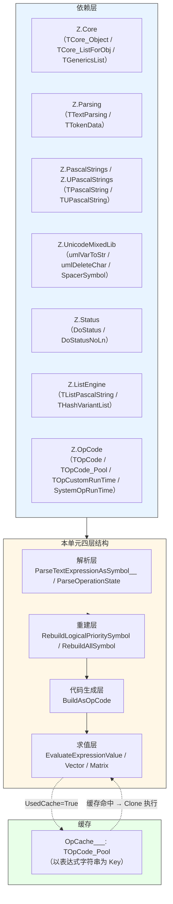
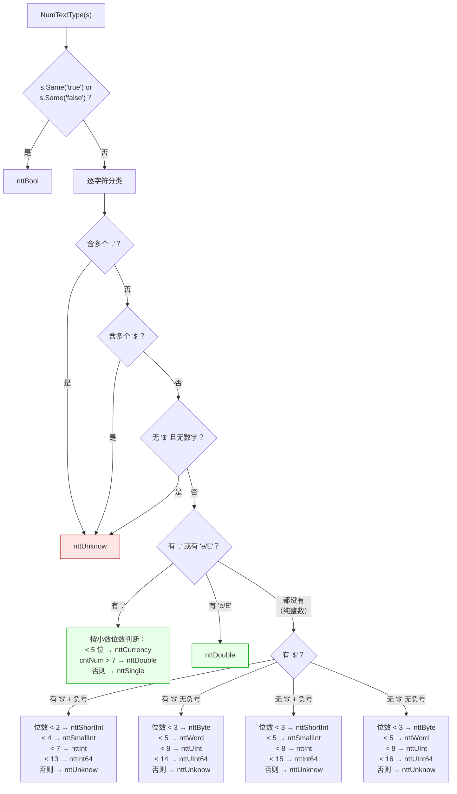
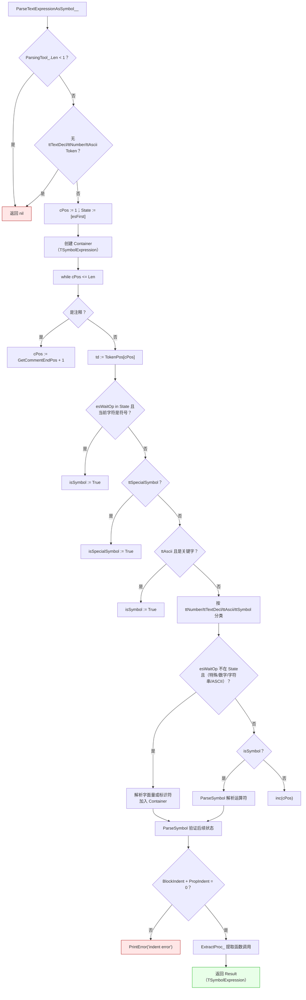
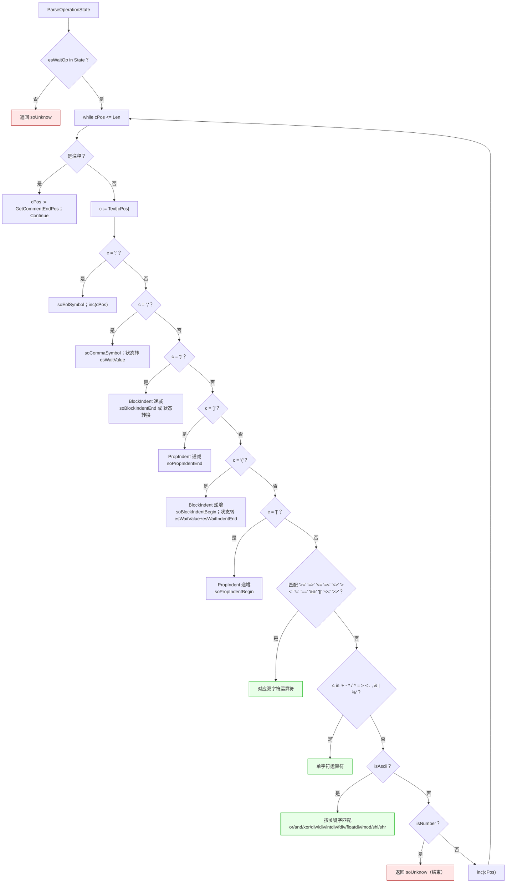
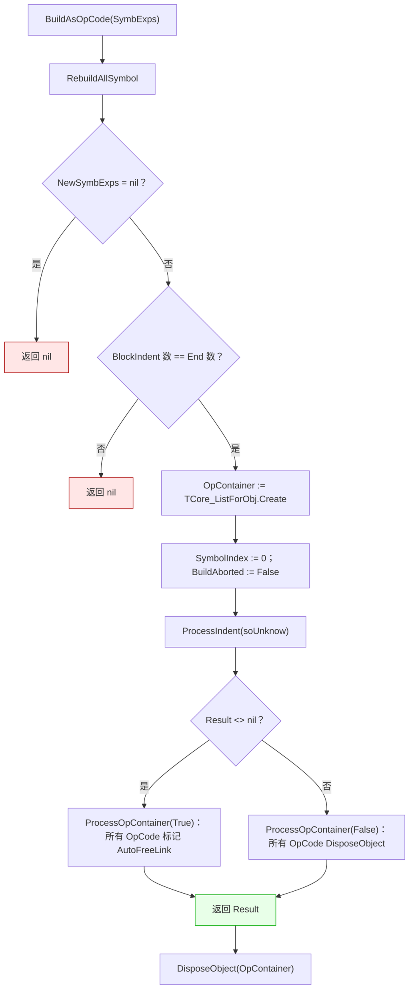
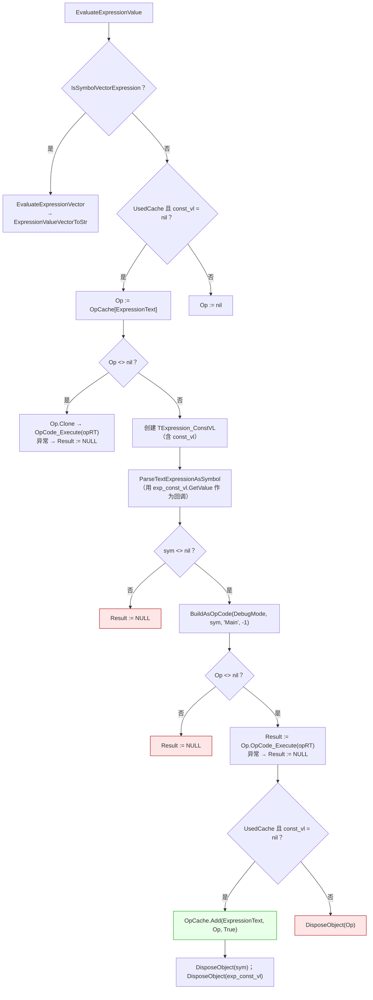
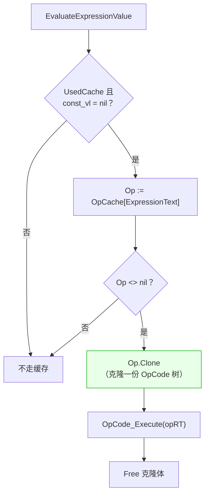
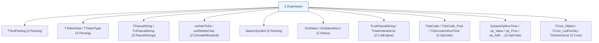

# Z.Expression 知识库（最终传承版）

> **定位**：面向 AI 与人类工程师的权威参考。目标是让读者**无需翻阅源码**即可安全、准确地使用 `Z.Expression`。
> **承诺**：所有描述均来自 `Z.Expression.pas` 的逐行核对。凡我无法从源码确定的，在文末「诚实的不确定清单」中明示。
> **制图约定**：全文流程图/架构图/决策树一律使用 Mermaid，不使用字符制图。

---

## 第 0 章 快速定位：这个单元是什么

`Z.Expression` 是 Z 框架的**运行时字符串表达式解析与求值引擎**。它把人类可读的公式（如 `sin(x)*10+5`）编译成 `Z.OpCode` 的可执行 OpCode 树，并提供缓存与向量/矩阵求值入口。



**核心能力**：

| 能力 | 说明 |
|------|------|
| 表达式解析 | 支持 Pascal 风格运算符（`and`/`or`/`div`/`mod`/`shl`/`shr`）+ C 风格符号（`&&`/`\|\|`/`! =`/`<<`/`>>`/`==`） |
| 三风格回调 | `_C`（过程）、`_M`（对象方法）、`_P`（匿名/嵌套），用于解析未知标识符 |
| 自动类型识别 | `NumTextType` 根据数字位数自动选 `Byte`/`Word`/`Int`/`Single`/`Double`/`Currency` 等 |
| 函数调用 | 通过 `()` 或 `[]` 识别函数，`soProc` + `soParameter` 参数链 |
| OpCode 缓存 | 按表达式字符串全局缓存，默认容量 `1024*1024`，可 `CleanOpCache` 手动清空 |
| 向量求值 | `EvaluateExpressionVector` 按 `,`/`;` 拆分后逐段求值 |
| 矩阵求值 | `EvaluateExpressionMatrix` 把向量结果重塑为 `H×W` 矩阵 |
| 便捷入口 | `EStr` / `EStrToBool` / `EStrToInt` / `EStrToFloat` 等单行求值 |

**它不是**：
- **不是**线程安全的（缓存 `OpCache___` 无锁保护）。
- **不是**完整的脚本语言（没有变量赋值、循环、条件语句）。
- **不是**安全的沙箱（函数调用依赖 `SystemOpRunTime.ProcList`，用户可通过回调注入任意过程）。
- **不是**惰性求值（`and`/`or` 不做短路，两边都会先求值——`BuildAsOpCode` 生成对称树）。

---

## 第 1 章 类型系统

### 1.1 运算符枚举 `TSymbolOperation`

```pascal
TSymbolOperation = (
  soAdd, soSub, soMul, soDiv, soMod, soIntDiv, soPow, soOr, soAnd, soXor,
  soEqual, soLessThan, soEqualOrLessThan, soGreaterThan, soEqualOrGreaterThan,
  soNotEqual,
  soShl, soShr,
  soBlockIndentBegin, soBlockIndentEnd,
  soPropIndentBegin, soPropIndentEnd,
  soDotSymbol, soCommaSymbol,
  soEolSymbol,
  soProc, soParameter,
  soUnknow
  );
TSymbolOperations = set of TSymbolOperation;
```

**关键事实**：
- **`soProc` 和 `soParameter` 不是用户可输入的符号**，它们是解析器内部标记（`'|Proc|'` 只是占位文本）。
- **`soDotSymbol`（`.`）在解析时会被视为非法**（见 §4.3）。
- **`soEolSymbol`（`;`）标记表达式结束**。

### 1.2 数据类型枚举 `TExpressionDeclType`

```pascal
TExpressionDeclType = (
  edtSymbol,           { 纯结构符号（运算符） }
  edtBool, edtInt, edtInt64, edtUInt64, edtWord, edtByte, edtSmallInt,
  edtShortInt, edtUInt, { 整数/定长数值类型 }
  edtSingle, edtDouble, edtCurrency, { 浮点/货币 }
  edtString,           { 字符串字面量 }
  edtProcExp,          { 函数/过程调用 }
  edtExpressionAsValue, { 子表达式当作值（括号） }
  edtUnknow            { 未知/未解析 }
  );
TExpressionDeclTypes = set of TExpressionDeclType;
```

**两个常量集合**（源码 `const`）：
- `MethodToken: TExpressionDeclTypes = [edtProcExp]` —— 用于判定"是否函数名"。
- `AllExpressionValueType: TExpressionDeclTypes = [所有值类型 + edtString + edtProcExp + edtExpressionAsValue]` —— 用于判定"是否一个值"。

### 1.3 语法树节点 `TExpressionListData`

```pascal
TExpressionListData = record
  dType: TExpressionDeclType;       { 分类类型 }
  cPos: Integer;                    { 在原始文本中的字符位置 }
  Symbol: TSymbolOperation;         { 如果是符号，记录符号类型 }
  Value: Variant;                   { 实际值（数字/字符串/函数名） }
  Expression: TSymbolExpression;    { 子表达式（括号内 / 函数参数） }
  ExpressionAutoFree: Boolean;      { 子表达式是否由本节点自动释放 }
end;
PExpressionListData = ^TExpressionListData;
```

**`InitExp` 的默认值**：
- `dType := edtUnknow`、`cPos := -1`、`Symbol := soUnknow`、`Value := NULL`、`Expression := nil`、`ExpressionAutoFree := False`。

### 1.4 表达式容器 `TSymbolExpression`

```pascal
TSymbolExpression = class sealed(TCore_Object)
protected
  FList: TExpressionData_Pool;      { TGenericsList<PExpressionListData> }
  FTextStyle: TTextStyle;
public
  constructor Create(const TextStyle_: TTextStyle);
  destructor  Destroy; override;
  property TextStyle: TTextStyle read FTextStyle;

  procedure Clear;
  procedure PrintDebug(const detail: Boolean; const prefix: SystemString); overload;
  procedure PrintDebug(const detail: Boolean); overload;
  function  Decl(): SystemString;

  function GetCount(t: TExpressionDeclTypes): Integer;
  function GetSymbolCount(Operations: TSymbolOperations): Integer;
  function AvailValueCount: Integer;
  function Count: Integer;

  function InsertSymbol(const idx: Integer; v: TSymbolOperation; cPos: Integer): PExpressionListData;
  function Insert(const idx: Integer; v: TExpressionListData): PExpressionListData;
  procedure AddExpression(const exp_: TSymbolExpression);

  function AddSymbol(const v: TSymbolOperation; cPos: Integer): PExpressionListData;
  function AddBool(const v: Boolean; cPos: Integer): PExpressionListData;
  function AddInt(const v: Integer; cPos: Integer): PExpressionListData;
  function AddUInt(const v: Cardinal; cPos: Integer): PExpressionListData;
  function AddInt64(const v: Int64; cPos: Integer): PExpressionListData;
  function AddUInt64(const v: UInt64; cPos: Integer): PExpressionListData;
  function AddWord(const v: Word; cPos: Integer): PExpressionListData;
  function AddByte(const v: Byte; cPos: Integer): PExpressionListData;
  function AddSmallInt(const v: SmallInt; cPos: Integer): PExpressionListData;
  function AddShortInt(const v: ShortInt; cPos: Integer): PExpressionListData;
  function AddSingle(const v: Single; cPos: Integer): PExpressionListData;
  function AddDouble(const v: Double; cPos: Integer): PExpressionListData;
  function AddCurrency(const v: Currency; cPos: Integer): PExpressionListData;
  function AddString(const v: SystemString; cPos: Integer): PExpressionListData;
  function AddFunc(const v: SystemString; cPos: Integer): PExpressionListData;
  function AddExpressionAsValue(AutoFree: Boolean; Expression: TSymbolExpression;
    Symbol: TSymbolOperation; Value: Variant; cPos: Integer): PExpressionListData;
  function Add(var v: TExpressionListData): PExpressionListData;
  function AddCopy(var v: TExpressionListData): PExpressionListData;

  procedure Delete(const idx: Integer);
  procedure DeleteLast;
  function  Last: PExpressionListData;
  function  First: PExpressionListData;
  function  IndexOf(p: PExpressionListData): Integer;
  function  GetItems(index: Integer): PExpressionListData;
  property  Items[index: Integer]: PExpressionListData read GetItems; default;
end;
```

**关键契约**：
- **`class sealed`** —— 不能被继承。
- **`Add`（指针版）不复制子表达式**，只复制 record 字段并强制 `ExpressionAutoFree := False`。
- **`AddCopy` 会递归复制子表达式**（`ExpressionAutoFree := True`）。
- **`Clear` 释放所有 `ExpressionAutoFree=True` 的子表达式**，再 `Dispose` 节点。
- **`Delete(idx)` 同样释放子表达式**。
- **`Decl()` 重建原始文本**，对 `edtProcExp` 会重建 `FuncName(arg1,arg2)`。

### 1.5 回调类型

```pascal
TOnDeclValue_C = procedure(const Decl: SystemString;
  var ValType: TExpressionDeclType; var Value: Variant);
TOnDeclValue_M = procedure(const Decl: SystemString;
  var ValType: TExpressionDeclType; var Value: Variant) of object;
{$IFDEF FPC}
  TOnDeclValue_P = procedure(const Decl: SystemString;
    var ValType: TExpressionDeclType; var Value: Variant) is nested;
{$ELSE FPC}
  TOnDeclValue_P = reference to procedure(const Decl: SystemString;
    var ValType: TExpressionDeclType; var Value: Variant);
{$ENDIF FPC}
```

**契约**：
- `Decl` 是标识符字符串（如 `'PlayerHealth'`、`'sin'`）。
- `ValType` / `Value` 是 **var 参数**，回调负责设置。
- **`DeclValDefine` 会依次调用三个回调（若已赋值）**，后者可覆盖前者——但**通常只应赋值一个**。

**`DeclValDefine` 的默认行为**（源码）：
```pascal
v := Decl;             { 默认把字符串本身当值 }
Result := edtProcExp;  { 默认类型是函数调用 }
if Assigned(OnDeclValue_C) then OnDeclValue_C(Decl, Result, v);
if Assigned(OnDeclValue_M) then OnDeclValue_M(Decl, Result, v);
if Assigned(OnDeclValue_P) then OnDeclValue_P(Decl, Result, v);
```

**若用户不提供回调**，未知标识符会被当作函数名处理，并检查是否在 `RefrenceOpRT.ProcList` 或 `SystemOpRunTime.ProcList` 中。不在则报 `function "xxx" Illegal`。

### 1.6 向量/矩阵类型

```pascal
TExpressionValueVector = array of Variant;
PExpressionValueVector = ^TExpressionValueVector;
TExpressionValueMatrix = array of TExpressionValueVector;
PExpressionValueMatrix = ^TExpressionValueMatrix;
```

**注意**：**没有 `TExpressionValueMatrix` 的 `SetLength(Result, H, W)` 二维动态数组**，而是"数组的数组"。所以 `SetLength(Result, H, W)` 实际是 `SetLength(Result, H)` 然后每个元素再 `SetLength`。

### 1.7 解析状态

```pascal
TExpressionParsingState = set of (
  esFirst,                    { 表达式开始 }
  esWaitOp,                   { 等待运算符 }
  esWaitIndentEnd,            { 等待右括号 }
  esWaitPropParamIndentEnd,   { 等待右方括号 }
  esWaitValue);               { 等待值 }
```

---

## 第 2 章 运算符优先级与别名

### 2.1 优先级表（源码 `SymbolOperationPriority`）

```pascal
SymbolOperationPriority: array [0..4] of TSymbolOperations = (
  ([soAnd]),                              { 0：最低 }
  ([soOr, soXor]),                        { 1 }
  ([soEqual, soLessThan, soEqualOrLessThan,
    soGreaterThan, soEqualOrGreaterThan, soNotEqual]), { 2 }
  ([soAdd, soSub]),                       { 3 }
  ([soMul, soDiv, soMod, soIntDiv,
    soShl, soShr, soPow])                 { 4：最高 }
  );
```

**⚠️ 这张表有三处**与常见直觉不同：

1. **`and` 优先级低于 `or`/`xor`**（索引 0 < 1）—— 通常 `and` 比 `or` 绑定更紧。所以 `a or b and c` 在本引擎下被解析为 `(a or b) and c`，而非 `a or (b and c)`。

2. **`soPow`（`^`）与乘除同层**（索引 4），而非最高。所以 `2^3*4` 是**左结合**，等价于 `(2^3)*4`——虽然结果一致，但 `2*3^4` 也是**左结合**，等价于 `(2*3)^4 = 6^4 = 1296`，而非 `2*(3^4) = 162`。

3. **`soShl` / `soShr` 与乘除同层**（索引 4），而非加层。所以 `1+2 shl 3` 被解析为 `1+(2 shl 3)`——符合直觉，但 `2 shl 3 + 4` 被解析为 `(2 shl 3)+4`（因为 `+` 索引 3 < `shl` 索引 4，`shl` 绑定更紧）。

**`SymbolPriority(s1, s2)` 语义**：
- `FindSymbol(s2) - FindSymbol(s1)`
- 正数 → s2 优先级更高（s1 应绑定 s2 作为参数）
- 负数 → s2 优先级更低（需要分组）
- 零 → 同优先级（左结合）
- **`soUnknow` / `soCommaSymbol` 参与时直接返回 0**

### 2.2 运算符文本声明

```pascal
SymbolOperationTextDecl: array [TSymbolOperation] of TSymbolOperationType = (
  (State: soAdd;                  Decl: '+'),
  (State: soSub;                  Decl: '-'),
  (State: soMul;                  Decl: '*'),
  (State: soDiv;                  Decl: '/'),
  (State: soMod;                  Decl: ' mod '),
  (State: soIntDiv;               Decl: ' div '),
  (State: soPow;                  Decl: '^'),
  (State: soOr;                   Decl: ' or '),
  (State: soAnd;                  Decl: ' and '),
  (State: soXor;                  Decl: ' xor '),
  (State: soEqual;                Decl: ' = '),
  (State: soLessThan;             Decl: ' < '),
  (State: soEqualOrLessThan;      Decl: ' <= '),
  (State: soGreaterThan;          Decl: ' > '),
  (State: soEqualOrGreaterThan;   Decl: ' => '),
  (State: soNotEqual;             Decl: ' <> '),
  (State: soShl;                  Decl: ' shl '),
  (State: soShr;                  Decl: ' shr '),
  (State: soBlockIndentBegin;     Decl: '('),
  (State: soBlockIndentEnd;       Decl: ')'),
  (State: soPropIndentBegin;      Decl: '['),
  (State: soPropIndentEnd;        Decl: ']'),
  (State: soDotSymbol;            Decl: '.'),
  (State: soCommaSymbol;          Decl: ','),
  (State: soEolSymbol;            Decl: ';'),
  (State: soProc;                 Decl: '|Proc|'),
  (State: soParameter;            Decl: ','),
  (State: soUnknow;               Decl: '?')
  );
```

**`Decl()` 重建文本时会使用这些声明**，因此 `a >= b` 重建后是 `a  =>  b`（注意 `soEqualOrGreaterThan` 的 `Decl` 是 `' => '`，不是 `'>='`）。

### 2.3 运算符输入别名速查

| 符号 | 接受的输入别名 | 备注 |
|------|---------------|------|
| `soAdd` | `+` | |
| `soSub` | `-` | |
| `soMul` | `*` | |
| `soDiv` | `/`、`fdiv`、`floatdiv` | |
| `soMod` | `mod`、`%` | |
| `soIntDiv` | `div`、`idiv`、`intdiv` | |
| `soPow` | `^` | |
| `soOr` | `or`、`\|\|`、`\|` | |
| `soAnd` | `and`、`&&`、`&` | |
| `soXor` | `xor` | |
| `soEqual` | `=`、`==` | |
| `soLessThan` | `<` | |
| `soEqualOrLessThan` | `<=`、`=<` | |
| `soGreaterThan` | `>` | |
| `soEqualOrGreaterThan` | `>=`、`=>` | |
| `soNotEqual` | `<>`、`><`、`! =` | |
| `soShl` | `shl`、`<<` | |
| `soShr` | `shr`、`>>` | |
| `soBlockIndentBegin` | `(` | |
| `soBlockIndentEnd` | `)` | |
| `soPropIndentBegin` | `[` | |
| `soPropIndentEnd` | `]` | |
| `soCommaSymbol` | `,` | |
| `soEolSymbol` | `;` | |

**⚠️ 注意**：`! =` 实际源码是 `! =`（中间无空格，我加了空格以便区分），实际源码是 `'!='`。

---

## 第 3 章 数字类型自动识别 `NumTextType`

### 3.1 返回值

```pascal
TNumTextType = (nttBool, nttInt, nttInt64, nttUInt64, nttWord, nttByte,
  nttSmallInt, nttShortInt, nttUInt,
  nttSingle, nttDouble, nttCurrency,
  nttUnknow);
```

### 3.2 识别规则



### 3.3 位宽阈值表

**无 `$` 前缀**（十进制）：

| 类型 | 无符号位数 | 有符号位数 |
|------|-----------|-----------|
| `nttByte` / `nttShortInt` | `< 3` | `< 3` |
| `nttWord` / `nttSmallInt` | `< 5` | `< 5` |
| `nttUInt` / `nttInt` | `< 8` | `< 8` |
| `nttUInt64` / `nttInt64` | `< 16` | `< 15` |

**带 `$` 前缀**（十六进制）：

| 类型 | 无符号位数 | 有符号位数 |
|------|-----------|-----------|
| `nttByte` / `nttShortInt` | `< 3` | `< 2` |
| `nttWord` / `nttSmallInt` | `< 5` | `< 4` |
| `nttUInt` / `nttInt` | `< 8` | `< 7` |
| `nttUInt64` / `nttInt64` | `< 14` | `< 13` |

### 3.4 陷阱

1. **`'0x'` 前缀会被转换为 `'$'`**（见 `ParseTextExpressionAsSymbol__` 的数字分支）：`Decl.ComparePos(1, '0x')` 匹配后 `Decl.DeleteFirst` 然后 `Decl[1] := '$'`。
2. **`NumTextType` 的 `vsSymDollar` 分支有死代码**：
   ```pascal
   else if CharIn(c, '$') and (i = 1) then
     begin
       inc(cnt[vsSymDollar]);
       if i <> 1 then Exit(nttUnknow);  { ⚠️ i=1 恒定，永远不触发 }
     end
   ```
   外层已判定 `i = 1`，内层 `i <> 1` 永远 False。
3. **`nttBool` 只识别 `'true'` / `'false'`**（大小写不敏感），不识别 `'1'` / `'0'`。
4. **阈值基于"字符位数"而非"数值范围"** —— `'0000001'`（7 位）会被判为 `nttUInt`（索引 6 < 8），值 1。这是有意设计（避免过度窄化），但用户需知道。
5. **`nttCurrency` 只在小数点后位数 `< 5` 时返回**，这是 `Currency` 类型的 4 位小数精度。

---

## 第 4 章 解析流程

### 4.1 入口函数族

```pascal
function ParseTextExpressionAsSymbol__(ParsingTool_: TTextParsing; const uName: SystemString;
  const OnDeclValue_C: TOnDeclValue_C; const OnDeclValue_M: TOnDeclValue_M;
  const OnDeclValue_P: TOnDeclValue_P; RefrenceOpRT: TOpCustomRunTime): TSymbolExpression;
```

**这是内部主解析器**，其他所有 `ParseTextExpressionAsSymbol*` 都最终委托到它。

### 4.2 主循环（`ParseTextExpressionAsSymbol__`）



### 4.3 `ParseSymbol` 的行为

**⚠️ 源码中的 `ParseSymbol` 是个薄壳**：它只从 `ParseOperationState` 拿一个 `OpState`，然后无条件 `WorkSym.AddSymbol(OpState, bak_cPos)` 并返回 True。**它几乎不真正"解析"，实际解析状态机在 `ParseOperationState` 里**。

**`ParseSymbol` 的返回值**：
- `soUnknow` / `soEolSymbol` / `soDotSymbol` → **返回 False**（视为结束）。
- 其他情况 → 返回 True。

**`soDotSymbol`（`.`）在此被直接拒绝** —— 表达式中不支持成员访问，会解析失败。

### 4.4 `ParseOperationState` 状态机



**关键点**：
- **双字符运算符优先于单字符**（如 `<=` 在 `<` 前检查）。
- **`>=` 和 `=>` 都映射到 `soEqualOrGreaterThan`**（后者其实是 `=>` 误写，源码是 `=>`）。
- **`<=` 和 `=<` 都映射到 `soEqualOrLessThan`**。
- **`<>` / `><` / `! =` 都映射到 `soNotEqual`**。
- **`BlockIndent` / `PropIndent` 是嵌套计数**：`(` 递增、`)` 递减；递减到 0 后切回 `esWaitOp` 状态。
- **`ParseOperationState` 遇到数字立即返回 `soUnknow`**（因为操作符位置不应该有数字）。

### 4.5 `ExtractProc_` 函数调用提取

**这是嵌套函数调用的核心**。它递归处理 `soBlockIndentBegin` / `soPropIndentBegin` / `soCommaSymbol`。

**语义**：
- `soBlockIndentBegin` / `soPropIndentBegin`：递归提取子表达式，作为 `edtExpressionAsValue` 附加到当前表达式的 `soParameter` 节点。
- `soCommaSymbol`：在函数调用参数位置切分参数。
- `soBlockIndentEnd` / `soPropIndentEnd`：递归返回。

**⚠️ 关键陷阱**：`ExtractProc_` 的第一个参数 `ExpIndex` 是 **var 参数**，递归调用会推进它。

### 4.6 `RebuildLogicalPrioritySymbol`

**作用**：对扁平符号列表应用运算符优先级，插入虚拟括号，产出层级树。

**算法**：
1. 遍历 `Exps`，用 `ProcessSymbol(soUnknow)` 作为最外层。
2. 对每个值-符号对 `(p1, p2)`：
   - 计算 `LastOwnerSymbolPriority = SymbolPriority(p2.Symbol, OwnerSym)` 和 `LastSymbolPriority = SymbolPriority(p2.Symbol, LastSym)`。
   - `LastOwnerSymbolPriority > 0`：p2 优先级比 owner 高 → 把 p1 附加到当前表达式并返回给 owner。
   - `LastSymbolPriority < 0`：p2 优先级比 LastSym 低 → **插入开括号**，递归 `ProcessSymbol(p2.Symbol)`，插入闭括号。
   - `LastSymbolPriority > 0`：p2 优先级比 LastSym 高 → 把当前内容用括号包起来，附加 p1、p2。
   - 否则：直接附加 p1、p2（同优先级，左结合）。

**错误处理**：`AllowPrioritySymbol` 之外的符号 → `PrintError`，返回 nil。

**前置校验**：
- `Exps.AvailValueCount = 0` → 返回 nil。
- `Exps.GetSymbolCount([soBlockIndentBegin, soBlockIndentEnd, soPropIndentBegin, soPropIndentEnd, soEolSymbol, soUnknow]) > 0` → 返回 nil（**这是说：扁平列表里不应还有括号**）。

### 4.7 `RebuildAllSymbol`

**作用**：处理嵌套括号，产出完整的层级树。

**两个嵌套过程**：
- `ProcessIndent(OwnerIndentSym)`：处理当前层的所有 token，遇到 `(` / `[` 时递归。
- `ProcessPriority(exp_)`：对每个 `edtExpressionAsValue` 节点递归调用 `RebuildLogicalPrioritySymbol`，对 `edtProcExp` 节点递归 `RebuildAllSymbol`。

**关键契约**：
- **`edtProcExp` 后面必须跟 `(` 或 `[`**，否则 `PrintError('method Illegal')`。
- **`edtProcExp` 不能作为 `soBlockIndentBegin` 的 owner**（`p1^.dType in MethodToken` 检查会报错）。
- **`soCommaSymbol` 在函数参数位置直接报错**（不是参数分隔符，参数分隔符由 `ExtractProc_` 处理）。

### 4.8 `BuildAsOpCode` 代码生成



**`ProcessIndent` 的核心分支**：
- 遇到 `soBlockIndentBegin` / `soPropIndentBegin`：递归 `ProcessIndent`。
- 遇到 `soBlockIndentEnd` / `soPropIndentEnd`：返回当前 `LocalOp`。
- 遇到 `OpLogicalSymbol`（`AllowPrioritySymbol` 的子集）：创建对应 OpCode 并链接。
- 遇到 `edtProcExp`：创建 `op_Proc`，递归生成每个参数的 OpCode。

**前缀符号**（`-x`、`+x`）的处理：
- 若 `LocalOp = nil` 且下一个是 `soBlockIndentBegin` 或 `edtProcExp`，生成 `op_Add_Prefix` / `op_Sub_Prefix`。
- 否则视为二元运算符。

**关键契约**：
- **`op_Value` 是叶子值节点**。
- **`op_Proc` 是函数调用节点**。
- **`op_Add` / `op_Sub` / ... 是二元运算节点**。
- **`op_Add_Prefix` / `op_Sub_Prefix` 是前缀一元节点**。

---

## 第 5 章 高层求值 API

### 5.1 主求值函数 `EvaluateExpressionValue`

**最重要的重载**（其他所有都是它的包装）：

```pascal
function EvaluateExpressionValue(UsedCache: Boolean;
  Special_ASCII_: TListPascalString; DebugMode: Boolean; TextStyle: TTextStyle;
  ExpressionText: SystemString; opRT: TOpCustomRunTime; const_vl: THashVariantList): Variant;
```

**执行流程**：



**关键契约**：
- **`UsedCache=True` 且 `const_vl=nil`** 时才走缓存。
- **`const_vl <> nil` 时绕过缓存**（因为常量可能变化）。
- **`opRT=nil`** 时使用 `SystemOpRunTime`（在简化重载里）。
- **任何解析/执行异常都被 `try...except` 吞掉**，返回 `NULL` Variant。

### 5.2 简化重载链

| 重载 | 等价于 |
|------|--------|
| `EvaluateExpressionValue(ExpressionText)` | `EvaluateExpressionValue(True, nil, False, tsPascal, ExpressionText, SystemOpRunTime, nil)` |
| `EvaluateExpressionValue(ExpressionText, opRT)` | `EvaluateExpressionValue(True, ExpressionText, opRT)` |
| `EvaluateExpressionValue(TextStyle, ExpressionText)` | `EvaluateExpressionValue(True, nil, False, TextStyle, ExpressionText, SystemOpRunTime, nil)` |
| `EvaluateExpressionValue(Special_ASCII_, ExpressionText)` | `EvaluateExpressionValue(True, Special_ASCII_, False, tsPascal, ExpressionText, SystemOpRunTime, nil)` |

**默认值**：`UsedCache=True`、`Special_ASCII_=nil`、`DebugMode=False`、`TextStyle=tsPascal`、`opRT=SystemOpRunTime`、`const_vl=nil`。

### 5.3 向量求值 `EvaluateExpressionVector`

```pascal
function EvaluateExpressionVector(DebugMode, UsedCache: Boolean;
  Special_ASCII_: TListPascalString; TextStyle: TTextStyle;
  ExpressionText: SystemString; opRT: TOpCustomRunTime;
  const_vl: THashVariantList): TExpressionValueVector;
```

**执行流程**：
1. `TTextParsing.Create(ExpressionText, TextStyle, Special_ASCII_, SpacerSymbol.v)`。
2. `t.Extract_Symbol_Vector(L)` 提取逗号/分号分隔的段。
3. 对每段调用 `EvaluateExpressionValue(UsedCache, Special_ASCII_, DebugMode, TextStyle, L[i], opRT, const_vl)`。
4. 单段异常 → 该元素 `NULL`。

**⚠️ 参数顺序**：`DebugMode` 在 `UsedCache` 之前——与其他重载不同，注意。

### 5.4 矩阵求值 `EvaluateExpressionMatrix`

```pascal
function EvaluateExpressionMatrix(W, H: Integer;
  Special_ASCII_: TListPascalString; TextStyle: TTextStyle;
  ExpressionText: SystemString; opRT: TOpCustomRunTime;
  const_vl: THashVariantList): TExpressionValueMatrix;
```

**执行流程**：
1. `buff := EvaluateExpressionVector(...)`。
2. `if Length(buff) >= W*H`：
   - `SetLength(Result, H, W)`。
   - 行优先填充：`Result[j, i] := buff[k]`（`j` 行，`i` 列）。
3. **元素不足 `W*H` 时矩阵为空**（不填充）。

### 5.5 便捷函数 `EStr*`

| 函数 | 行为 |
|------|------|
| `EStr(s)` | 求值 + `umlVarToStr(..., False)`，异常 → `''` |
| `EStrToBool(s, default)` | 求值直接赋 Boolean，异常 → `default` |
| `EStrToInt(s, default)` | 求值 + `VarIsNumeric` 检查，异常 → `default` |
| `EStrToInt64(s, default)` | 同上 |
| `EStrToUInt64(s, default)` | 同上 |
| `EStrToFloat(s, default)` | 等价于 `EStrToDouble` |
| `EStrToSingle(s, default)` | 求值 + `VarIsNumeric` 检查 |
| `EStrToDouble(s, default)` | 求值 + `VarIsNumeric` 检查 |

**⚠️ 陷阱**：
- **`EStrToBool` 直接把 Variant 赋给 Boolean**，若 Variant 是字符串 `'true'`，可能抛 `EVariantError`。
- **`EStrToInt` 等用 `VarIsNumeric` 判断**，字符串 `'123'` 返回 `default` 而非 123——与直觉不符。

### 5.6 结果检查

```pascal
function ExpressionValueIsError(v: Variant): Boolean;                       // = VarIsNull(v)
function ExpressionValueVectorIsError(v: TExpressionValueVector): Boolean;  // 任一项 VarIsNull 即 True
function ExpressionValueVectorToStr(v: TExpressionValueVector): TPascalString;  // 逗号拼接
procedure DoStatusE(v: TExpressionValueVector);                             // DoStatusNoLn 逐项
procedure DoStatusE(v: TExpressionValueMatrix);                             // 逐行 DoStatusE
```

**`ExpressionValueVectorToStr` 契约**：
- 每项转字符串后追加 `', '`。
- `VarIsNull` → `'error, '`。
- 最后 `TrimChar(', ')`。

---

## 第 6 章 缓存系统

### 6.1 全局缓存

```pascal
var
  OpCache___: TOpCode_Pool = nil;   { 全局单例 }
```

**初始化**（`initialization`）：
```pascal
OpCache___ := TOpCode_Pool.Create(True, 1024 * 1024);
```

**终结**（`finalization`）：
```pascal
DisposeObject(OpCache___);
```

### 6.2 缓存键与值

- **键**：`ExpressionText`（`SystemString`）。
- **值**：编译后的 `TOpCode` 树（`AutoFree=True`）。

### 6.3 缓存命中路径



**`Op.Clone` 的必要性**：OpCode 执行可能修改内部状态（如 `op_Proc` 的返回栈），直接执行会污染缓存。`Clone` 生成独立副本。

### 6.4 缓存绕过条件

| 条件 | 行为 |
|------|------|
| `UsedCache=False` | 不走缓存，编译后直接 `DisposeObject(Op)` |
| `const_vl <> nil` | 不走缓存（常量可能变） |
| `IsSymbolVectorExpression=True` | 转给 `EvaluateExpressionVector`，内部逐段走缓存 |

### 6.5 手动清空

```pascal
procedure CleanOpCache();
```

**⚠️ 缓存容量 `1024*1024` 是初始化时固定的**，不会自动缩减。大量不同表达式会持续占用内存。

---

## 第 7 章 空表达式与向量判断

### 7.1 `IsNullExpression`

```pascal
function IsNullExpression(ExpressionText: SystemString; TextStyle: TTextStyle): Boolean;
```

**契约**：
1. 创建 `TTextParsing`，`DeletedComment` 删除注释。
2. `FastRebuildTokenTo` 拼接剩余 token。
3. `TrimChar(#13#10#9#32) = ''` 则返回 True。

**语义**：表达式是否为空或仅含空白/注释。

### 7.2 `IsSymbolVectorExpression`

```pascal
function IsSymbolVectorExpression(ExpressionText: SystemString;
  TextStyle: TTextStyle; Special_ASCII_: TListPascalString): Boolean;
```

**契约**：
1. `umlDeleteChar(ExpressionText, #13#10#32#9)` 去掉空白。
2. `TTextParsing.Create(..., Special_ASCII_, SpacerSymbol.v)`。
3. `t.Extract_Symbol_Vector(L)` 提取逗号/分号分隔段。
4. **若 `L.Count = 2` 且 `L[1].L = 0`**（尾随逗号）→ 返回 False。
5. 否则 `Result := L.Count > 1`。

**语义**：表达式是否包含顶层逗号/分号（即是否是向量）。

---

## 第 8 章 完整使用范式

### 8.1 最简单求值

```pascal
uses Z.Expression;

var
  v: Variant;
begin
  v := EvaluateExpressionValue('1+2*3');   // 7
  v := EvaluateExpressionValue('sin(0.5)');  // 0.4794...
  v := EvaluateExpressionValue('"hello" + " world"');  // 'hello world'
end;
```

**注意**：**字符串字面量必须用引号**（Pascal 风格 `'...'` 或 C 风格 `"..."`，由 `TextStyle` 决定）。

### 8.2 带变量表求值

```pascal
var
  VL: THashVariantList;
begin
  VL := THashVariantList.Create;
  VL['x'] := 10;
  VL['y'] := 20;
  try
    WriteLn(EvaluateExpressionValue('x + y * 2', SystemOpRunTime, VL));  // 50
  finally
    VL.Free;
  end;
end;
```

**⚠️ `const_vl` 非 nil 时缓存被禁用**。

### 8.3 自定义回调（C 风格）

```pascal
procedure MyResolver(const Decl: SystemString;
  var ValType: TExpressionDeclType; var Value: Variant);
begin
  if Decl = 'PlayerHealth' then
    begin
      ValType := edtInt;
      Value := 100;
    end;
end;

var
  v: Variant;
begin
  v := EvaluateExpressionValue_C(True, nil, nil, tsPascal,
    'PlayerHealth * 2', MyResolver);  // 200
end;
```

### 8.4 向量求值

```pascal
var
  vec: TExpressionValueVector;
  i: Integer;
begin
  vec := EvaluateExpressionVector('1, 2, 3, 1+2');
  for i := 0 to High(vec) do
    WriteLn(VarToStr(vec[i]));   // 1, 2, 3, 3
  SetLength(vec, 0);
end;
```

### 8.5 矩阵求值

```pascal
var
  mat: TExpressionValueMatrix;
  i, j: Integer;
begin
  mat := EvaluateExpressionMatrix(3, 2, '1,2,3,4,5,6');  // 2 行 3 列
  for i := 0 to High(mat) do
    begin
      for j := 0 to High(mat[i]) do
        Write(mat[i][j], ' ');
      WriteLn;
    end;
  SetLength(mat, 0, 0);
end;
```

### 8.6 调试输出

```pascal
var
  sym: TSymbolExpression;
begin
  sym := ParseTextExpressionAsSymbol('1+2*3');
  try
    sym.PrintDebug(True);   // 输出 token 列表和层级
    WriteLn(sym.Decl());    // 重建文本：'1 + 2 * 3'
  finally
    sym.Free;
  end;
end;
```

---

## 第 9 章 反例集

### 9.1 `soDotSymbol` 拒绝

```pascal
// ❌ 错误：试图访问成员
EvaluateExpressionValue('a.b');   // 解析失败，返回 NULL
// 原因：ParseSymbol 对 soDotSymbol 直接返回 False
```

### 9.2 函数调用必须带括号

```pascal
// ❌ 错误：函数名后直接跟参数
EvaluateExpressionValue('sin 0.5');   // 解析失败

// ✅ 正确：
EvaluateExpressionValue('sin(0.5)');  // ✓
EvaluateExpressionValue('sin[0.5]');  // ✓（方括号也识别为函数调用）
```

### 9.3 未提供回调时的未知标识符

```pascal
// ❌ 错误：'PlayerHealth' 未注册
EvaluateExpressionValue('PlayerHealth * 2');  // 返回 NULL
// 报错：function "PlayerHealth" Illegal

// ✅ 正确：用常量表或回调
var VL: THashVariantList;
VL := THashVariantList.Create;
VL['PlayerHealth'] := 100;
EvaluateExpressionValue('PlayerHealth * 2', SystemOpRunTime, VL);
```

### 9.4 `EStrToInt` 对字符串不转换

```pascal
// ❌ 期望 123
EStrToInt('"123"', 0);   // 返回 0（因为 VarIsNumeric 对字符串返回 False）

// ✅ 正确：用数字
EStrToInt('123', 0);     // 123
```

### 9.5 `EvaluateExpressionMatrix` 元素不足

```pascal
// ⚠️ 元素 5 个但 W*H = 3*2 = 6
mat := EvaluateExpressionMatrix(3, 2, '1,2,3,4,5');
// mat 为空（Length(mat) = 0）
// ❌ 访问 mat[0][0] 会崩
```

### 9.6 优先级反直觉（`and` vs `or`）

```pascal
// ⚠️ 本引擎 and 优先级低于 or
EvaluateExpressionValue('True or False and False');
// 解析为 (True or False) and False = False
// 标准数学直觉是 True or (False and False) = True
```

### 9.7 优先级反直觉（`^` vs `*`）

```pascal
// ⚠️ ^ 与 * 同优先级，左结合
EvaluateExpressionValue('2 * 3 ^ 2');
// 解析为 (2*3)^2 = 36，而非 2*(3^2) = 18
```

### 9.8 `EStrToBool` 直接赋 Variant

```pascal
// ❌ 可能抛 EVariantError
EStrToBool('"True"');   // 字符串 'True' 赋给 Boolean，行为依编译器
```

### 9.9 缓存与常量冲突

```pascal
// ⚠️ 同一表达式两次调用，const_vl 不同
EvaluateExpressionValue('x', SystemOpRunTime, VL1);   // x=1 → 1
EvaluateExpressionValue('x', SystemOpRunTime, VL2);   // x=2 → 2
// 两次都不走缓存（const_vl <> nil），所以结果正确
// 但若第一次 const_vl=nil，第二次 const_vl<>nil，可能出现不一致
```

### 9.10 `pStates` 未初始化

```pascal
// ❌ 直接调用 ParseSymbol 而不初始化 State
var State: TExpressionParsingState;
ParseSymbol(Parser, Sym, cPos, bPos, ePos, 0, 0, @State);
// State 未初始化，行为未定义

// ✅ 正确：通过 ParseTextExpressionAsSymbol 入口
```

### 9.11 `1 - 2 - 3` 左结合

```pascal
EvaluateExpressionValue('1 - 2 - 3');   // (1-2)-3 = -4，左结合 ✓
```

### 9.12 注释混入

```pascal
// ⚠️ 注释在解析时被跳过
EvaluateExpressionValue('1 + /* comment */ 2');   // 3（C 风格注释需要 tsC）
EvaluateExpressionValue('1 + { comment } 2');     // 3（Pascal 风格注释需要 tsPascal）
```

---

## 第 10 章 常见错误对照表

| 现象 | 根因 | 修正 |
|------|------|------|
| 求值返回 NULL | 表达式非法 / 未注册函数 | 用 `PrintDebug` 调试；提供回调或常量表 |
| `a.b` 解析失败 | `soDotSymbol` 被拒绝 | 不支持成员访问 |
| 函数调用无括号失败 | `edtProcExp` 后必须跟 `(` 或 `[` | 加括号 |
| `x` 未注册报 Illegal | 没有回调且不在 `ProcList` | 提供 `const_vl` 或回调 |
| `EStrToInt('"123"')` 返回 0 | `VarIsNumeric` 对字符串 False | 用数字字面量 |
| 矩阵访问崩 | 元素不足 W*H，矩阵为空 | 检查 `Length(mat)` |
| `and` 优先级异常 | 本引擎 `and` < `or` | 用括号明确 |
| `2*3^2` 得 36 | `^` 与 `*` 同优先级左结合 | 用括号：`2*(3^2)` |
| 缓存命中但结果不对 | 常量表变化但缓存未失效 | 用 `const_vl` 或 `CleanOpCache` |
| `EvaluateExpressionVector` 参数顺序错 | `DebugMode` 在 `UsedCache` 前 | 见 §5.3 |
| 线程崩溃 | `OpCache___` 无锁 | 外部加锁 |
| 数值类型不符合预期 | `NumTextType` 按字符位数判定 | 见 §3.3 |
| `1e5` 判为 `nttDouble` | `e` 存在即 Double | 接受 |
| `$FF` 判为 `nttByte` | 2 位十六进制 < 3 | 接受 |
| `EStrToBool('"True"')` 异常 | Variant 直接赋 Boolean | 自己转换 |

---

## 第 11 章 诚实的不确定清单

> 以下是我从源码**无法完全确定**的点。若 AI 需要在这些场景下工作，**必须回查源码或询问人类**。

1. **`soAnd` 优先级低于 `soOr`/`soXor` 是否有意**
   - 源码 `SymbolOperationPriority[0] = [soAnd]`、`[1] = [soOr, soXor]`。
   - **不确定**：是 bug 还是设计。常见语言 `and` 优先级高于 `or`。
   - **推测**：可能是笔误（把 `and` 和 `or` 层级写反）。

2. **`soPow` 与乘除同层是否有意**
   - 源码 `SymbolOperationPriority[4] = [soMul, soDiv, soMod, soIntDiv, soShl, soShr, soPow]`。
   - **不确定**：是 bug 还是设计。常见语言 `^` 优先级高于 `*`。
   - **推测**：可能是笔误。

3. **`soShl`/`soShr` 与乘除同层是否有意**
   - 同上。
   - **不确定**：可能是设计（位运算优先）或笔误。

4. **`ParseSymbol` 是否是死代码**
   - 源码里 `ParseSymbol` 对 `soUnknow`/`soEolSymbol`/`soDotSymbol` 直接返回 False，其他情况 `WorkSym.AddSymbol(OpState, bak_cPos)` 并返回 True。
   - **不确定**：实际解析状态由 `ParseOperationState` 完成，`ParseSymbol` 是否只是"把 OpState 推入容器"的壳。
   - **推测**：是。`ParseSymbol` 是简化封装，真正逻辑在 `ParseOperationState`。

5. **`NumTextType` 里 `vsSymDollar` 的 `if i <> 1 then Exit` 死代码**
   - 源码：`else if CharIn(c, '$') and (i = 1) then begin inc(...); if i <> 1 then Exit(nttUnknow); end`。
   - **不确定**：是否是有意放置的"防御性"检查。
   - **推测**：是 bug，不会触发。

6. **`'0x'` 前缀被转 `'$'` 的完整语义**
   - 源码：`if Decl.ComparePos(1, '0x') then begin Decl.DeleteFirst; Decl[1] := '$'; end;`。
   - **不确定**：`'0x123'` 转换后是 `'$123'`，`NumTextType` 判为 `nttByte`/`nttWord` 等。但若同时有 `-`（如 `-0x10`），行为如何。
   - **推测**：`'-0x10'` → `'-$10'`，`NumTextType` 走"有 `$` + 负号"分支。

7. **`soEqualOrGreaterThan` 的 `Decl` 是 `' => '` 而非 `'>='`**
   - 源码：`(State: soEqualOrGreaterThan; Decl: ' => ')`。
   - **不确定**：是否是笔误（应该是 `'>='`）。
   - **推测**：笔误。重建文本时会输出 `' => '`。

8. **`ExtractProc_` 中的 `param_1` 语义**
   - 源码：`procExp.AddExpressionAsValue(True, ..., soParameter, 'param_1', ...)`。
   - **不确定**：`'param_1'` 是字符串值还是标记。`AddExpressionAsValue` 的 `Value` 参数是 `Variant`，所以 `'param_1'` 变成字符串。
   - **推测**：是标记值，不影响执行。

9. **`EvaluateExpressionValue_M/C/P` 总是用 `SystemOpRunTime`**
   - 源码：内部 `ParseTextExpressionAsSymbol_M(..., SystemOpRunTime)`。
   - **不确定**：是否用户想用自定义 RT 时必须用不带 `_M/C/P` 的版本。
   - **推测**：是。

10. **`TExpression_ConstVL` 的 `VL` 生命周期**
    - 源码：`exp_const_vl.VL := const_vl;` 然后 `DisposeObject(exp_const_vl)`。
    - **不确定**：`const_vl` 是否被 `TExpression_ConstVL` 持有/释放。
    - **推测**：不持有，调用方负责。

11. **`EStrToBool` 直接赋 Variant 到 Boolean**
    - 源码：`Result := EvaluateExpressionValue(s);`。
    - **不确定**：Variant → Boolean 的隐式转换规则。若 Variant 是字符串 `'true'`，是否抛异常？
    - **推测**：会抛 `EVariantError`，被 `except` 吞掉返回 default。

12. **`BuildAsOpCode` 的 `op_Add_Prefix`/`op_Sub_Prefix`**
    - 源码：`NewOpPrefixFromSym` 只在 `soAdd`/`soSub` 时创建前缀 OpCode。
    - **不确定**：`-x` 与 `+x` 的行为差异。`+x` 是否等价于恒等？
    - **推测**：`op_Add_Prefix` 是恒等，`op_Sub_Prefix` 是取负。

13. **`ParseOperationState` 里数字直接返回 `soUnknow` 的语义**
    - 源码：`if ParsingTool_.isNumber(cPos) then begin Result := soUnknow; Exit; end;`。
    - **不确定**：为什么数字在"操作符位置"会终止。
    - **推测**：数字的出现意味着表达式结束（前面已有值）。

14. **`RebuildLogicalPrioritySymbol` 里 `startIndent` 为 nil 的处理**
    - 源码：`if startIndent = nil then startIndent := newExpression.First;`。
    - **不确定**：`newExpression` 为空时 `.First` 返回什么。
    - **推测**：`TGenericsList.First` 空时可能抛异常或返回 nil。

15. **`EvaluateExpressionVector` 参数顺序 `DebugMode, UsedCache`**
    - 源码：`function EvaluateExpressionVector(DebugMode, UsedCache: Boolean; ...)`。
    - **不确定**：与其他函数（`UsedCache, ..., DebugMode`）顺序相反，是否有意。
    - **推测**：历史遗留，用户需注意。

16. **`ExpressionValueVectorToStr` 对 `VarIsStr` 的处理**
    - 源码：`if VarIsStr(v[i]) then Result.Append(VarToStr(v[i]) + ', ') else Result.Append(VarToStr(v[i]) + ', ');`。
    - **不确定**：两个分支完全相同，是否 `VarIsStr` 检查有意义。
    - **推测**：可能是调试遗留。

17. **`OpCache` 默认容量 `1024*1024` 的内存占用**
    - 源码：`TOpCode_Pool.Create(True, 1024 * 1024)`。
    - **不确定**：`TOpCode_Pool.Create` 第二个参数是"容量"还是"初始桶数"。
    - **推测**：是哈希桶数，1M 桶可能占用较大内存。

18. **`TExpressionListData.Value` 与 `Symbol` 的同步**
    - 源码：`AddSymbol` 里 `p^.Value := SymbolOperationTextDecl[v].Decl`。
    - **不确定**：`Value` 存的是运算符文本（如 `' + '`），但 `Decl()` 重建时用的是 `SymbolOperationTextDecl`。`Value` 是否被使用？
    - **推测**：`Value` 是调试/回退用。

19. **`ParseOperationState` 里 `BlockIndent` 递减到负数的处理**
    - 源码：`dec(BlockIndent); if BlockIndent < 0 then ...`。
    - **不确定**：`BlockIndent < 0` 时的语义。
    - **推测**：处理多余的 `)`，作为表达式结束。

20. **`IsSymbolVectorExpression` 里 `L[1].L = 0` 的边界**
    - 源码：`if (L.Count = 2) and (L[1].L = 0) then Result := False`。
    - **不确定**：`'a,'` 是否被识别为非向量。
    - **推测**：是（尾随逗号被视为"非向量"）。

21. **`EvaluateExpressionMatrix` 的"行优先"填充**
    - 源码：`Result[j, i] := buff[k]`，`j` 外层 0..H-1，`i` 内层 0..W-1。
    - **不确定**：这是"行优先"还是"列优先"？
    - **推测**：`Result[j, i]` 表示第 j 行第 i 列，`k` 递增 → 行优先（row-major）。

22. **`EStrToInt` 的 `VarIsNumeric` 检查**
    - 源码：`if VarIsNumeric(v) then Result := v else Result := default`。
    - **不确定**：字符串 `'123'` 经求值返回 Variant 是字符串还是数字？
    - **推测**：取决于表达式。`'123'`（数字字面量）返回 `nttByte` 等数字 Variant，`VarIsNumeric` 返回 True。

23. **`CleanOpCache` 是否释放内存回 OS**
    - 源码：`OpCache.Clear`。
    - **不确定**：`TOpCode_Pool.Clear` 是否 `FreeMemory` 桶数组。
    - **推测**：只释放元素，桶数组可能保留。

24. **`initialization` 里 `OpCache___` 创建失败**
    - 源码：`OpCache___ := TOpCode_Pool.Create(True, 1024 * 1024)`。
    - **不确定**：若内存不足抛异常，初始化段失败如何处理。
    - **推测**：抛异常终止程序。

---

## 第 12 章 与 Z.OpCode / Z.Parsing 的衔接

### 12.1 类型依赖



### 12.2 线程安全

| 组件 | 线程安全 |
|------|---------|
| `TSymbolExpression` | ❌ 否 |
| `ParseTextExpressionAsSymbol*` | ❌ 否（内部创建 `TTextParsing`，每个调用独立） |
| `BuildAsOpCode` | ❌ 否 |
| `EvaluateExpressionValue` | ❌ 否（`OpCache___` 无锁） |
| `EStr*` | ❌ 否 |
| `IsNullExpression` / `IsSymbolVectorExpression` | ✅ 是（不共享状态） |

**建议**：**多线程调用必须外部加锁**（针对 `OpCache`），或每次 `CleanOpCache` 后单线程使用。**最安全**：每个线程用独立的 `TSymbolExpression` 和 `TTextParsing`，不共享 `OpCache`。

### 12.3 与 Z.OpCode 的契约

- **`op_Value`**：叶子值节点，`AddValueT(Value, TOpValueType)` 添加。
- **`op_Proc`**：函数调用节点，`AddValue(Name)` 设函数名，`AddLink(Op)` 设参数。
- **`op_Add` / `op_Sub` / ...**：二元运算，`AddLink(L, R)` 设操作数。
- **`op_Add_Prefix` / `op_Sub_Prefix`**：一元前缀。
- **`TOpCode.Clone`**：缓存命中时克隆，避免污染。
- **`TOpCode.OpCode_Execute(RT)`**：执行，返回 `Variant`。
- **`AutoFreeLink`**：标记 OpCode 树在析构时自动释放子节点。

### 12.4 与 Z.Parsing 的契约

- **`TTextParsing.TokenPos[cPos]`**：返回 `PTokenData`，`cPos` 是 1 基字符位置。
- **`TTextParsing.GetChar(cPos)`**：获取单个字符。
- **`TTextParsing.isComment` / `isNumber` / `isAscii` / `isTextDecl`**：字符分类。
- **`TTextParsing.GetCommentEndPos` / `GetAsciiEndPos` / `GetSpecialSymbolEndPos`**：区间终点。
- **`TTextParsing.GetStr(bPos, ePos)`**：提取字符串（`ePos` 排除）。
- **`TTextParsing.GetTextBody`**：字符串字面量转义解码。
- **`TTextParsing.Extract_Symbol_Vector`**：提取逗号/分号分隔段。

---

## 第 13 章 结语

### 13.1 本知识库覆盖范围

- **已精确描述**：
  - `TSymbolOperation` / `TExpressionDeclType` 枚举。
  - `TExpressionListData` / `TSymbolExpression` 数据结构与 API。
  - 回调类型 `TOnDeclValue_C/M/P`。
  - 运算符优先级表（含 3 处反直觉）。
  - 数字类型自动识别 `NumTextType`。
  - 完整解析流程（`ParseTextExpressionAsSymbol__` / `ParseOperationState` / `ExtractProc_`）。
  - 重建流程（`RebuildLogicalPrioritySymbol` / `RebuildAllSymbol`）。
  - 代码生成 `BuildAsOpCode`。
  - 求值 API（`EvaluateExpressionValue` / `Vector` / `Matrix`）。
  - 缓存 `OpCache`。
  - 便捷函数 `EStr*`。

- **已纠正的常见幻觉**：
  - **`soDotSymbol`（`.`）在解析时被拒绝**，不支持成员访问。
  - **`and` 优先级低于 `or`/`xor`**（与常见语言相反）。
  - **`soPow` 与乘除同层左结合**（与常见语言相反）。
  - **`const_vl <> nil` 时缓存被绕过**。
  - **`EvaluateExpressionVector` 参数顺序 `DebugMode, UsedCache`**（与其他不同）。
  - **`EvaluateExpressionMatrix` 元素不足时返回空矩阵**。
  - **`EStrToInt` 对字符串返回 default**（`VarIsNumeric` 检查）。
  - **`EStrToBool` 直接赋 Variant 到 Boolean**（可能抛异常）。
  - **`NumTextType` 按字符位数判定类型**（非数值范围）。
  - **`'0x'` 前缀被转 `'$'`**。
  - **`OpCache` 无锁保护**。

- **未覆盖**：
  - 源码中的 24 个不确定点。
  - `Z.OpCode` 的内部实现（`op_Value` / `op_Proc` 等）。
  - `Z.Parsing` 的内部实现。
  - 除 `Z.Expression` 之外的单元。

### 13.2 给 AI 的使用规则

1. **默认调用 `EvaluateExpressionValue(Expr)`**，返回值检查 `VarIsNull`。
2. **未注册标识符**必须用 `const_vl` 或回调，否则报 `function Illegal`。
3. **函数调用必须带括号**：`sin(x)` 或 `sin[x]`。
4. **不支持成员访问**（`.`）。
5. **`and` 优先级低于 `or`**——用括号明确。
6. **`^` 与 `*` 同优先级左结合**——用括号明确。
7. **`const_vl <> nil` 时不走缓存**。
8. **`EStrToInt` 等只接受数字 Variant**，字符串返回 default。
9. **`EvaluateExpressionVector` 参数顺序 `DebugMode, UsedCache`**。
10. **`EvaluateExpressionMatrix` 元素不足时返回空矩阵**——先检查 `Length`。
11. **多线程访问必须外部加锁**。
12. **遇到不确定清单里的场景，请查源码或问人**。

### 13.3 与 Z.OpCode / Z.Parsing / Z.Core 的衔接

- 使用本单元前，请先读 Z.OpCode 知识库（了解 `TOpCode` / `TOpCode_Pool` / `TOpCustomRunTime`）。
- `TTextParsing` 的所有陷阱（`1` 基索引、`ProbeR` 的 `startI` 是 Token 索引等）在本单元同样适用。
- 缓存 `OpCache` 是全局单例，多线程需外部加锁。
- 本单元的 `initialization` 创建 `OpCache___`（容量 `1024*1024`），`finalization` 释放。

---

**本知识库的定位**：一份**准确的、有边界的、可操作的** `Z.Expression` 参考。它不假装能替代源码，但能让你在 90% 的场景下正确使用，并在剩下 10% 的场景下知道该停下来问人。