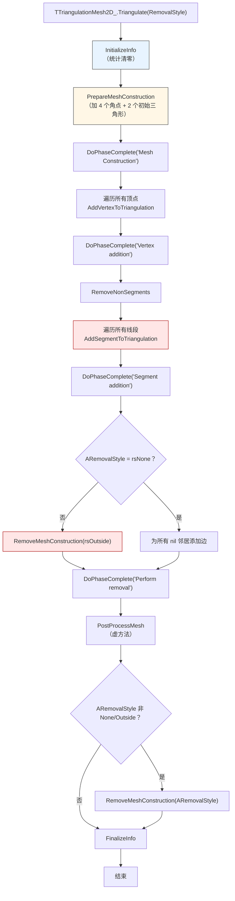
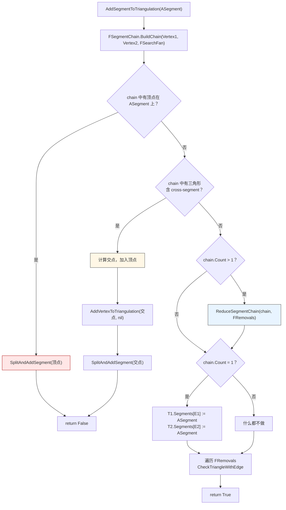
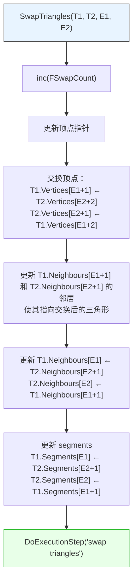
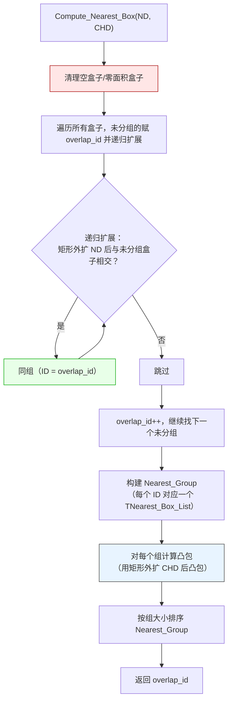
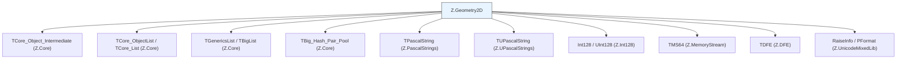

# Z.Geometry2D 知识库（最终传承版）

> **定位**：面向 AI 与人类工程师的权威参考。目标是让读者**无需翻阅源码**即可安全、准确地使用 `Z.Geometry2D`。
> **承诺**：所有描述均来自 `Z.Geometry2D.pas` + `Z.Geometry.Split.Header.inc` + `Z.Geometry.Split.Body.inc` 的逐行核对。凡我无法从源码确定的，在文末「诚实的不确定清单」中明示。
> **制图约定**：全文流程图/架构图/决策树一律使用 Mermaid，不使用字符制图。

---

## 第 0 章 快速定位：这个单元是什么

`Z.Geometry2D` 是 Z 框架的**2D 几何算法库**。它覆盖从基础向量运算到**Delaunay 三角剖分**和**质量网格生成**的完整技术栈。

```mermaid
flowchart TD
    subgraph L0["依赖层"]
        C1["Z.Core<br/>（TCore_Object_Intermediate / TGenericsList）"]
        C2["Z.PascalStrings / Z.UPascalStrings<br/>（TPascalString）"]
        C3["Z.MemoryStream<br/>（TMS64）"]
        C4["Z.DFE（Data Frame Engine）<br/>用于序列化"]
        C5["Z.UnicodeMixedLib（实现期）<br/>（RaiseInfo / PFormat）"]
    end

    subgraph L1["基础类型层"]
        T1["TVec2 / TRectV2 / TLineV2 / TTriangle<br/>（数组 record）"]
        T2["TV2Rect4<br/>（旋转矩形）"]
        T3["TV2L<br/>（点列表 + 多边形操作）"]
        T4["T2DPolygonGraph<br/>（带孔多边形）"]
        T5["TDeflectionPolygon<br/>（极坐标多边形）"]
    end

    subgraph L2["几何运算层（函数族）"]
        F1["向量运算（Add/Sub/Mul/Div/Dot）"]
        F2["几何测试（PointInRect/Intersect/Collision）"]
        F3["变换（Rotate/Projection/Mirror/Scale）"]
        F4["多边形算法（ConvexHull/Spline/Reduction）"]
    end

    subgraph L3["三角剖分层"]
        M1["基础设施<br/>TCustomSortedList / TVertex2D_ / TSegment2D_"]
        M2["网格类<br/>TTriMesh2D_ / TTriangulationMesh2D_"]
        M3["Delaunay<br/>TDelaunayTriangle2D_ / TDelaunayMesh2D_"]
        M4["质量网格<br/>TQualityTriangle2D_ / TQualityMesh2D_"]
    end

    subgraph L4["工具层"]
        P1["TRectPacking<br/>（矩形打包）"]
        P2["TNearest_Box_Tool<br/>（近邻盒子分组）"]
        P3["THausdorf<br/>（Hausdorff 距离）"]
        P4["TTriangleList<br/>（三角化结果容器）"]
    end

    L0 --> L1
    L1 --> L2
    L2 --> L3
    L3 --> L4

    style L0 fill:#e8f4ff,stroke:#444
    style L1 fill:#fff7e6,stroke:#444
    style L2 fill:#e8ffe8,stroke:#444
    style L3 fill:#ffe6e6,stroke:#444
    style L4 fill:#f0e8ff,stroke:#444
```



**核心能力**：

| 能力 | 说明 |
|------|------|
| 向量运算 | `Vec2Add`/`Vec2Sub`/`Vec2Mul`/`Vec2Div`/`Vec2DotProduct` |
| 几何测试 | `PointInRect`/`RectToRectIntersect`/`SimpleIntersect`/`Intersect` |
| 变换 | `Rotate`/`Mirror`/`RectProjection`/`RectRotationProjection` |
| 多边形 | `TV2L.ConvexHull`/`TV2L.SplineSmooth*`/`VertexReduction` |
| 三角剖分 | `TDelaunayMesh2D_`/`TQualityMesh2D_`（受约束 Delaunay） |
| 打包 | `TRectPacking`（4 种策略） |
| 分组 | `TNearest_Box_Tool`（IoU 图 + 连通分量 + 凸包） |
| 相似度 | `THausdorf.Compute`（多边形 Hausdorff 距离） |

---

## 第 1 章 基础类型

### 1.1 几何类型别名

```pascal
type
  TGeoFloat     = Single;                    // 基本浮点类型
  TGeoFloatList = TGenericsList<TGeoFloat>;
  TGeoInt       = Integer;                   // 基本整数类型

  TVec2 = array [0 .. 1] of TGeoFloat;       // 2D 向量（X, Y）
  PVec2 = ^TVec2;

  TRectV2 = array [0 .. 1] of TVec2;         // 轴对齐矩形（[0]=左上, [1]=右下）
  PRectV2 = ^TRectV2;

  TLineV2 = array [0 .. 1] of TVec2;         // 线段（两个端点）
  PLineV2 = ^TLineV2;

  TTriangle = array [0 .. 2] of TVec2;       // 三角形（三个顶点）
  PTriangle = ^TTriangle;

  TArrayVec2    = array of TVec2;
  TArrayRectV2  = array of TRectV2;
  TArrayLineV2  = array of TLineV2;
  TTriangleArray = array of TTriangle;
  TArrayPVec2   = array of PVec2;
```

**关键事实**：
- **`TVec2` 是 `Single` 数组**，不是 `Double`。默认精度为 7 位有效数字。
- **`TRectV2` 索引约定**：`[0]` = 左上角，`[1]` = 右下角。与 `TRect` 的 `(Left, Top, Right, Bottom)` 不同。
- **`TGeoInt = Integer`**（32 位有符号）。

### 1.2 跨编译器类型（FPC 兼容）

```pascal
{$IFDEF FPC}
  TPointf = record
    X: TGeoFloat;
    Y: TGeoFloat;
  end;

  TRectf = record
    case TGeoInt of
      0: (Left, Top, Right, Bottom: TGeoFloat);
      1: (TopLeft, BottomRight: TPointf);
  end;
{$ENDIF FPC}

// 构造函数
function Pointf(X, Y: TGeoFloat): TPointf;
function Rectf(Left, Top, Right, Bottom: TGeoFloat): TRectf;
```

**⚠️ FPC 下 `TPointf` 是 record，不是数组**。与 `TVec2` 不同。

### 1.3 常量

```pascal
const
  // 零值常量
  XPoint: T2DPoint = (1, 0);
  YPoint: T2DPoint = (0, 1);
  NULLPoint: T2DPoint = (0, 0);
  NULLVec2: T2DPoint = (0, 0);
  ZeroPoint: T2DPoint = (0, 0);
  ZeroVec2: T2DPoint = (0, 0);
  NULLRect: TRectV2 = ((0, 0), (0, 0));
  ZeroRect: TRectV2 = ((0, 0), (0, 0));
  NULLRectV2: TRectV2 = ((0, 0), (0, 0));
  ZeroRectV2: TRectV2 = ((0, 0), (0, 0));
  ZeroTriangle: TTriangle = ((0, 0), (0, 0), (0, 0));

  // 方向常量
  RightHandSide = -1;
  LeftHandSide  = +1;
  CollinearOrientation = 0;
  AboveOrientation = +1;
  BelowOrientation = -1;
  CoplanarOrientation = 0;

// 实现期常量
const
  C_Epsilon = 1.0E-12;
  Zero = 0.0;
  PIDiv180 = 0.017453292519943295769236907684886;
  cZero2D: TPoing2D_ = (X: 0; Y: 0);
  cDefaultMinimumAngle: Double = 30;             // 质量网格最小角度
  cDefaultMinimumSegmentLength: Double = 0.5;
  cOneThird: Double = 1 / 3;
  cDefaultTriangulationPrecision = 1E-3;
```

**⚠️ `C_Epsilon` 是 `1.0E-12`**，但 `TGeoFloat = Single`（精度约 7 位）。用 `1E-12` 做 Single 比较**可能永远不会满足**。

---

## 第 2 章 数学辅助函数

### 2.1 基础数学

```pascal
function Compute_PI(Num: Integer): Double;   // 数值积分求 π
function FAbs(const V: Single): Single; overload;
function FAbs(const V: Double): Double; overload;
function FAbs(const v2: TVec2): TVec2; overload;
function Clamp(const Value_, Min_, Max_: TGeoFloat): TGeoFloat;
function MaxF(const v1, v2: TGeoFloat): TGeoFloat; overload;
function MaxF(const V: TVec2): TGeoFloat; overload;
function MaxF(const R: TRectV2): TGeoFloat; overload;
function MinF(...): ...;                       // 对称重载
function CompareFloat(const f1, f2, Epsilon_: TGeoFloat): ShortInt; overload;
function CompareFloat(const f1, f2: TGeoFloat): ShortInt; overload;  // 用 C_Epsilon
function CompareGeoInt(const g1, g2: TGeoInt): ShortInt;
function HypotX(const X, Y: TGeoFloat): TGeoFloat;   // 安全 sqrt(x²+y²)
```

**`HypotX` 实现**：使用 `TempY * Sqrt(1 + Sqr(TempX / TempY))` 形式，避免溢出。

### 2.2 向量构造

```pascal
function MakeVec2(const X, Y: TGeoFloat): TVec2; overload;
function MakeVec2(const X, Y: TGeoInt): TVec2; overload;
function MakePoint(const X, Y: TGeoFloat): TVec2; overload;
function MakePoint(const pt: TVec2): TPoint; overload;
function Point2Point(const pt: TVec2): TPoint; overload;
function Point2Pointf(const pt: TVec2): TPointf; overload;
function PointMake(const X, Y: TGeoFloat): TVec2; overload;
function PointMake(const pt: TPoint): TVec2; overload;
function PointMake(const pt: TPointf): TVec2; overload;
function Make2DPoint(...): TVec2; overload;    // 多个重载
function vec2(const p: PVec2): TVec2; overload;
function vec2(const f: TGeoFloat): TVec2; overload;  // (f, f)
function vec2(const X, Y: TGeoFloat): TVec2; overload;
function vec2(const X, Y: TGeoInt): TVec2; overload;
function vec2(const X, Y: Int64): TVec2; overload;
function vec2(const pt: TPoint): TVec2; overload;
function vec2(const pt: TPointf): TVec2; overload;
```

**推荐使用 `vec2(X, Y)`**——最简洁。

### 2.3 零值与 NaN 检查

```pascal
function IsZero(const V: TGeoFloat): Boolean; overload;
function IsZero(const pt: TVec2): Boolean; overload;
function IsZero(const R: TRectV2): Boolean; overload;
function IsNan(const pt: TVec2): Boolean; overload;
function IsNan(const X, Y: TGeoFloat): Boolean; overload;
```

**⚠️ `IsZero` 用 `C_Epsilon = 1E-12`**，对 Single 太严格。

### 2.4 向量运算

```pascal
function PointNorm(const V: TVec2): TGeoFloat;      // = V[0]² + V[1]²
function PointNegate(const V: TVec2): TVec2;
function Vec2Norm(const V: TVec2): TGeoFloat;
function Vec2Negate(const V: TVec2): TVec2;
function Vec2Inv(const V: TVec2): TVec2;             // 交换 X 和 Y
procedure SetVec2(var V: TVec2; const vSrc: TVec2);

function Vec2Direction(sour, dest: TVec2): TVec2;    // = dest - sour
function RectDirection(sour, dest: TRectV2): TRectV2;

// Add 系列
function Vec2Add(const v1, v2: TVec2): TVec2; overload;
function Vec2Add(const v1: TVec2; v2: TGeoFloat): TVec2; overload;
function Vec2Add(const v1: TVec2; X, Y: TGeoFloat): TVec2; overload;
function Vec2Add(const v1: TGeoFloat; v2: TVec2): TVec2; overload;
function Vec2Add(const v1: TArrayVec2; v2: TVec2): TArrayVec2; overload;
function Vec2Add(const v1: TArrayVec2; v2: TGeoFloat): TArrayVec2; overload;

// Sub/Mul/Div 系列（类似）
function Vec2Sub(...): TVec2; overload;
function Vec2Mul(...): TVec2; overload;
function Vec2Div(...): TVec2; overload;

// 归一化
function PointNormalize(const V: TVec2): TVec2; overload;
function Vec2Normalize(const V: TVec2): TVec2; overload;
function NoLoss_PointNormalize(const V: TVec2): TVec2; overload;   // 按最大分量缩放
function NoLoss_Vec2Normalize(const V: TVec2): TVec2; overload;

// 长度
function PointLength(const V: TVec2): TGeoFloat; overload;
function Vec2Length(const V: TVec2): TGeoFloat; overload;
procedure PointScale(var V: TVec2; factor: TGeoFloat);
function PointDotProduct(const v1, v2: TVec2): TGeoFloat; overload;
function Vec2DotProduct(const v1, v2: TVec2): TGeoFloat; overload;
```

**关键事实**：
- **`Vec2Div` 不做除零检查**。`Vec2Div(v, 0)` 产生 `Inf` 或 NaN。
- **`Vec2Normalize` 对零向量返回原值**（源码 `if vn = 0 then Result := V`）。
- **`NoLoss_*Normalize` 按最大分量缩放**，避免平方溢出。

### 2.5 距离

```pascal
function Distance(const x1, y1, x2, y2: TGeoFloat): TGeoFloat; overload;
function Distance(const x1, y1, z1, x2, y2, z2: TGeoFloat): TGeoFloat; overload;  // 3D
function Distance(const L: TLineV2): TGeoFloat; overload;
function Distance(const f1, f2: TGeoFloat): TGeoFloat; overload;  // = |f2-f1|
function FloatDistance(const f1, f2: TGeoFloat): TGeoFloat; overload;
function PointDistance(const v1, v2: TVec2): TGeoFloat; overload;
function Vec2Distance(const v1, v2: TVec2): TGeoFloat; overload;
function LineDistance(const L: TLineV2): TGeoFloat; overload;
function PointLayDistance(const v1, v2: TVec2): TGeoFloat; overload;  // 平方距离
function LayDistance(const x1, y1, x2, y2: TGeoFloat): TGeoFloat;
function SqrDistance(const v1, v2: TVec2): TGeoFloat; overload;
```

**⚠️ `PointDistance` 和 `Vec2Distance` 是同一个实现**——都返回 sqrt 距离。

### 2.6 线性插值

```pascal
function PointLerp(const v1, v2: TVec2; t: TGeoFloat): TVec2; overload;
function PointLerpTo(const sour, dest: TVec2; const d: TGeoFloat): TVec2; overload;  // 按距离 d
function Vec2Lerp(const v1, v2: TVec2; t: TGeoFloat): TVec2; overload;
function Vec2LerpTo(const sour, dest: TVec2; const d: TGeoFloat): TVec2; overload;
procedure SwapPoint(var v1, v2: TVec2); overload;
procedure SwapVec2(var v1, v2: TVec2); overload;
function Pow(V: TGeoFloat): TGeoFloat; overload;          // = V*V
function Pow(const V, n: TGeoFloat): TGeoFloat; overload; // 通用幂
function MiddleVec2(const pt1, pt2: TVec2): TVec2; overload;
function Vec2Middle(const pt1, pt2: TVec2): TVec2; overload;
```

**`PointLerpTo` 契约**：
- 返回从 `sour` 到 `dest` 方向上距离为 `d` 的点。
- `d = 0` 或方向相同 → 返回 `sour`。
- **不检查 `d > |dest-sour|`**——会返回超出 `dest` 的点。

### 2.7 相等与比较

```pascal
function IsEqual(const Val1, Val2, Epsilon_: TGeoFloat): Boolean; overload;
function IsEqual(const Val1, Val2: TGeoFloat): Boolean; overload;   // C_Epsilon
function IsEqual(const Val1, Val2: TVec2): Boolean; overload;
function IsEqual(const Val1, Val2: TVec2; Epsilon_: TGeoFloat): Boolean; overload;
function IsEqual(const Val1, Val2: TRectV2): Boolean; overload;
function IsEqual_X(const Val1, Val2: TVec2): Boolean; overload;
function IsEqual_Y(const Val1, Val2: TVec2): Boolean; overload;
function NotEqual(const Val1, Val2, Epsilon_: TGeoFloat): Boolean; overload;
function NotEqual(const Val1, Val2: TGeoFloat): Boolean; overload;
function NotEqual(const Val1, Val2: TVec2): Boolean; overload;
function LessThanOrEqual(const Val1, Val2: TGeoFloat): Boolean; overload;
function GreaterThanOrEqual(const Val1, Val2: TGeoFloat): Boolean; overload;
```

**⚠️ 源码中的 `Assert`**：`IsEqual` / `NotEqual` 内部有 `Assert` 检查逻辑一致性。**DEBUG 下 Assert 失败会崩**。

### 2.8 旋转与角度

```pascal
procedure Rotate(RotAng: TGeoFloat; const X, Y: TGeoFloat; out Nx, Ny: TGeoFloat); overload;
function Rotate(const RotAng: TGeoFloat; const Point: TVec2): TVec2; overload;
function NormalizeDegAngle(const Angle: TGeoFloat): TGeoFloat; overload;  // 规范到 [-180,180]
function VerticalMirror(const Angle: TGeoFloat): TGeoFloat;
function HorizontalMirror(const Angle: TGeoFloat): TGeoFloat;

function PointAngle(const axis, pt: TVec2): TGeoFloat; overload;
function PointAngle(const pt: TVec2): TGeoFloat; overload;   // 从原点
function AngleDistance(const s, a: TGeoFloat): TGeoFloat; overload;
function PointRotation(const axis: TVec2; const Dist, Angle: TGeoFloat): TVec2; overload;
function PointRotation(const axis, pt: TVec2; const Angle: TGeoFloat): TVec2; overload;
function RectRotation(const axis: TVec2; const R: TRectV2; const Angle: TGeoFloat): TRectV2;
```

**`Rotate` 契约**：角度是**度**（内部转弧度）。

**`PointAngle` 契约**：返回 `[-180, 180]` 度的角度。

### 2.9 几何测试

```pascal
function CircleInCircle(const cp1, cp2: TVec2; const r1, r2: TGeoFloat): Boolean; overload;
function CircleInRect(const cp: TVec2; const radius: TGeoFloat; R: TRectV2): Boolean;
function PointInRect(const Px, Py: TGeoFloat; const x1, y1, x2, y2: TGeoFloat): Boolean; overload;
function PointInRect(const pt: TVec2; const R: TRectV2): Boolean; overload;
function PointInCircle(const pt, cp: TVec2; radius: TGeoFloat): Boolean; overload;
function PointInTriangle(const Px, Py, x1, y1, x2, y2, x3, y3: TGeoFloat): Boolean;
function RectToRectIntersect(...): Boolean; overload;
function RectWithInRect(...): Boolean; overload;
function RectInRect(...): Boolean; overload;
function Rect_Overlap_or_Intersect(r1, r2: TRectV2): Boolean;
function Rect_1Overlap2_or_Intersect(r1, r2: TRectV2): Boolean;
```

### 2.10 矩形操作

```pascal
function MakeRectV2(...): TRectV2; overload;    // 多个重载
function RectV2(...): TRectV2; overload;
function MakeRect(...): TRectV2; overload;
function RoundRect(const R: TRectV2): TRect; overload;
function Rect2Rect(...): ...; overload;
function RectAdd(const R: TRectV2; v2: TVec2): TRectV2; overload;
function RectSub(...): TRectV2; overload;
function RectMul(...): TRectV2; overload;
function RectDiv(...): TRectV2; overload;
function RectOffset(const R: TRectV2; Offset: TVec2): TRectV2;
function RectSizeLerp(const R: TRectV2; const rSizeLerp: TGeoFloat): TRectV2;
function RectCenScale(const R: TRectV2; const rSizeScale: TGeoFloat): TRectV2;
function RectEdge(const R: TRectV2; const Edge: TGeoFloat): TRectV2; overload;
function RectEdge(const R: TRectV2; const Edge: TVec2): TRectV2; overload;
function RectCentre(const R: TRectV2): TVec2; overload;
function RectIOU(const r1, r2: TRectV2): TGeoFloat;
function RectDistance(const r1, r2: TRectV2): TGeoFloat;
function RectWidth(const R: TRectV2): TGeoFloat; overload;
function RectHeight(const R: TRectV2): TGeoFloat; overload;
function RectArea(const R: TRectV2): TGeoFloat; overload;
function RectSize(const R: TRectV2): TVec2; overload;
function RectFit(const sour, dest: TRectV2; const Bound: Boolean): TRectV2; overload;
function FitRect(const sour, dest: TRectV2): TRectV2; overload;
function BoundRect(...): TRectV2; overload;
function FixRect(...): ...; overload;
function FixedRect(...): ...; overload;
function ForwardRect(...): ...; overload;
```

**`FixRect` / `FixedRect` / `ForwardRect` 都是同一实现**——交换 `Left`/`Right` 和 `Top`/`Bottom` 保证 `Left <= Right`、`Top <= Bottom`。

### 2.11 三角形工具

```pascal
function Tri(const v1, v2, v3: TVec2): TTriangle;
function TriAdd(const t: TTriangle; V: TVec2): TTriangle;
function TriSub(const t: TTriangle; V: TVec2): TTriangle;
function TriMul(const t: TTriangle; V: TVec2): TTriangle;
function TriDiv(const t: TTriangle; V: TVec2): TTriangle;
function TriCentre(const t: TTriangle): TVec2;         // 质心
function TriExpand(const t: TTriangle; Dist: TGeoFloat): TTriangle;
function TriRound(const t: TTriangle): TTriangle;

function IsEquilateralTriangle(...): Boolean; overload;
function IsIsoscelesTriangle(...): Boolean; overload;
function IsRightTriangle(...): Boolean; overload;
function IsScaleneTriangle(...): Boolean; overload;
function IsObtuseTriangle(...): Boolean; overload;
function VertexAngle(x1, y1, x2, y2, x3, y3: TGeoFloat): TGeoFloat;  // 角度
type
  TTriangleType = (ttEquilateral, ttIsosceles, ttRight, ttScalene, ttObtuse, ttUnknown);
function TriangleType(...): TTriangleType; overload;
function TriangleEdge(const Triangle: TTriangle; const Edge: Integer): TLineV2;
```

**`TriExpand` 契约**：
- 向外扩张 `Dist`。
- 对每个顶点计算两条边的法线的角平分线方向。
- **不处理退化三角形**（零面积）。

### 2.12 投影与拟合

```pascal
function Vec2Transform(const sour, dest: TRectV2; sour_pt: TVec2): TVec2; overload;
function Vec2Transform(const sour, dest: TRectV2; const sourAngle, destAngle: TGeoFloat; const sour_pt: TVec2): TVec2; overload;
function RectTransform(const sour, dest, sour_rect: TRectV2): TRectV2; overload;
function RectScaleSpace(const R: TRectV2; const SS_width, SS_height: TGeoFloat): TRectV2; overload;
function ComputeScaleSpace(box: TRectV2; SS: TVec2): TRectV2;
function Rect_ScaleSpace_F(R: TRectV2): TGeoFloat;   // 宽高比
function MinLoss_Rect(const SS_width, SS_height: TGeoFloat; const R: TRectV2): TRectV2; overload;
function CalibrationRectInRect(const R, Area: TRectV2): TRectV2; overload;

function RectProjection(const sour, dest: TRectV2; const sour_pt: TVec2): TVec2; overload;
function RectProjection(const sour, dest: TRectV2; const sour_rect: TRectV2): TRectV2; overload;
function RectProjection(const sour, dest: TRectV2; const sour_arry: TArrayVec2): TArrayVec2; overload;
function RectProjectionArrayV2(const sour, dest: TRectV2; const sour_arry: TArrayVec2): TArrayVec2;

function RectProjectionRotationDest(...): TVec2; overload;
function RectProjectionRotationSource(...): TVec2; overload;
function RectRotationProjection(...): TVec2; overload;

function Quadrant(const Angle: TGeoFloat): TGeoInt;
procedure ProjectionPoint(const Srcx, Srcy, Dstx, Dsty, Dist: TGeoFloat; out Nx, Ny: TGeoFloat); overload;
```

**`RectProjection` 契约**：
- 把 `sour_pt` 从 `sour` 矩形坐标系映射到 `dest` 矩形坐标系。
- 内部用 `ForwardRect` 规范化输入。
- **`sour` 和 `dest` 都为零面积时行为未定义**。

### 2.13 裁剪、相交、IoU

```pascal
function Clip(const f, b: TRectV2; var R: TRectV2): Boolean; overload;
function Clip(const f, b: TRectV2): TRectV2; overload;
function Compute_IoU(const r1, r2: TRectV2): TGeoFloat; overload;
function Compute_IoU(const r1, r2: TRectV2; var R: TRectV2; var IoU: TGeoFloat): Boolean; overload;
function Compute_IoU(const r1, r2: TRectV2; var R: TRectV2; var IoU, R1A, R2A, RA: TGeoFloat): Boolean; overload;

function SimpleIntersect(...): Boolean; overload;   // 用 Orientation
function Intersect(...): Boolean; overload;         // 用参数化
function Intersect(...; out ix, iy: TGeoFloat): Boolean; overload;

function Orientation(const x1, y1, x2, y2, Px, Py: TGeoFloat): TGeoInt; overload;
function Orientation(const x1, y1, z1, x2, y2, z2, x3, y3, z3, Px, Py, Pz: TGeoFloat): TGeoInt; overload;
function Coplanar(...): Boolean;
```

**`Intersect` 与 `SimpleIntersect` 的差异**：
- `SimpleIntersect` 用叉积符号判断，**快但会漏掉共线情形**。
- `Intersect` 用参数化，**慢但更准确**，可返回交点。

### 2.14 凸包、多边形、裁剪

```pascal
function PointInPolygon(pt: TVec2; const PolygonBuff: TArrayVec2): Boolean;
function PolygonArea(buff: TArrayVec2): TGeoFloat; overload;
function FastRamerDouglasPeucker(var Points: TArrayVec2; Epsilon_: TGeoFloat): TGeoInt;
procedure FastVertexReduction(Points: TArrayVec2; Epsilon_: TGeoFloat; var output: TArrayVec2);

function BuffCentroid(const buff: TArrayVec2): TVec2; overload;
function BuffCentroid(const p1, p2, p3, p4: TVec2): TVec2; overload;
function BuffCentroid(const p1, p2, p3: TVec2): TVec2; overload;

function RectangularHull(const buff: TArrayVec2): TRectV2;
function SameLinePtr(const lb1, le1, lb2, le2: PVec2): Boolean;
```

**`PointInPolygon` 契约**：使用**射线法**（奇数/偶数规则）。

**`PolygonArea` 契约**：返回**有符号面积**（逆时针为正）。

**`FastRamerDouglasPeucker` 契约**：
- 输入 `Points` 数组，原地修改，返回新长度。
- **`Points` 长度必须 >= 3**，否则直接返回。

**`BuffCentroid` 契约**：
- `Count = 1`：返回点本身。
- `Count = 2`：返回中点。
- `Count >= 3`：用面积加权公式。

### 2.15 圆与碰撞

```pascal
function Detect_Circle2Circle(const p1, p2: TVec2; const r1, r2: TGeoFloat): Boolean; overload;
function CircleCollision(...): Boolean; overload;
function Detect_Circle2CirclePoint(const p1, p2: TVec2; const r1, r2: TGeoFloat; out op1, op2: TVec2): Boolean;
function Detect_Circle2Line(const cp: TVec2; const R: TGeoFloat; const lb, le: TVec2): Boolean; overload;
function Detect_Circle2Line(const cp: TVec2; const R: TGeoFloat; const L: TLineV2): Boolean; overload;

procedure Circle2LineIntersectionPoint(...): ...; overload;
procedure Circle2CircleIntersectionPoint(...): ...;

function GetCicleRadiusInPolyEdge(R: TGeoFloat; PolySlices: TGeoInt): TGeoFloat;
```

### 2.16 其他

```pascal
procedure BuildSinCosCache(const oSin, oCos: PGeoFloatArray; const b, E: TGeoFloat);
procedure ClosestPointOnSegmentFromPoint(...): ...; overload;
function ClosestPointOnSegmentFromLine(...): TVec2; overload;
function MinimumDistanceFromPointToLine(...): TGeoFloat; overload;
function Compute_Scale_Position_To_Abs_Size(...): TRectV2; overload;
function Compute_Scale_Position_To_Box_Size(...): TRectV2; overload;
function Compute_Scale_Position_To_Min_Edge_Box_Size(...): TRectV2; overload;
function Make_Jitter_Box(...): TGeoInt; overload;
procedure Make_Image_Jitter_Box(...); overload;
function ComputeCurvePartPrecision(const pt1, pt2, pt3, pt4: TVec2): TGeoInt;
function Interpolation_OutSide(const T_: TGeoFloat): TGeoFloat;
function Interpolation_InSide(const t: TGeoFloat): TGeoFloat;
```

**`ClosestPointOnSegmentFromPoint` 契约**：
- **限制在线段范围内**（投影参数 clamp 到 `[0,1]`）。
- 与 `ClosestPointOnLineFromPoint`（无限直线）不同。

**`Interpolation_InSide` / `Interpolation_OutSide`**：Catmull-Rom 样条基函数。

---

## 第 3 章 记录类型

### 3.1 `TV2Rect4` —— 旋转矩形

```pascal
TV2Rect4 = record
public
  LeftTop, RightTop, RightBottom, LeftBottom: TVec2;

  procedure Reset;
  function  IsZero: Boolean;
  function  BoundArea: TGeoFloat;      // 轴对齐包围盒面积
  function  Area: TGeoFloat;            // 多边形面积
  function  Rotation(Angle: TGeoFloat): TV2Rect4; overload;
  function  Rotation(axis: TVec2; Angle: TGeoFloat): TV2Rect4; overload;
  function  TransformToRect(box: TRectV2; Edge: TGeoFloat): TV2Rect4; overload;
  function  TransformToRect(box: TRectV2; Angle, Edge: TGeoFloat): TV2Rect4; overload;
  function  TransformToRect(box: TRectV2; axis: TVec2; Angle, Edge: TGeoFloat): TV2Rect4; overload;
  function  Add(V: TVec2): TV2Rect4;
  function  Sub(V: TVec2): TV2Rect4;
  function  Mul(V: TVec2): TV2Rect4; overload;
  function  Mul(V: TGeoFloat): TV2Rect4; overload;
  function  Mul(X, Y: TGeoFloat): TV2Rect4; overload;
  function  Div_(V: TVec2): TV2Rect4; overload;
  function  Div_(V: TGeoFloat): TV2Rect4; overload;
  function  MoveTo(Position: TVec2): TV2Rect4;
  function  BoundRect: TRectV2;
  function  BoundRectf: TRectf;
  function  Centroid: TVec2;
  function  Mid_LeftTop_RightTop: TVec2;
  // 其他 Mid_* 函数
  function  Transform(v2: TVec2): TV2Rect4; overload;
  function  Transform(X, Y: TGeoFloat): TV2Rect4; overload;
  function  Expands(Dist: TGeoFloat): TV2Rect4;
  function  InHere(pt: TVec2): Boolean; overload;
  function  InHere(R: TRectV2): Boolean; overload;
  function  GetArrayVec2: TArrayVec2;
  function  GetNear(pt: TVec2): TVec2;
  function  GetNearLine(const V: TVec2; out lb, le: PVec2): TVec2; overload;
  function  GetNearLine(const V: TVec2): TVec2; overload;
  function  Projection(const sour, dest: TRectV2; ...): TV2Rect4; overload;

  class function RebuildVertex(const buff: TArrayVec2): TV2Rect4; overload; static;
  class function RebuildVertex(const buff: TV2L): TV2Rect4; overload; static;

  class function Init(R: TRectV2): TV2Rect4; overload; static;
  class function Init(R: TRectV2; axis: TVec2; Ang: TGeoFloat): TV2Rect4; overload; static;
  class function Init(R: TRectV2; Ang: TGeoFloat): TV2Rect4; overload; static;
  // 多个 Init / Create 重载
  class function Create(R: TRectV2): TV2Rect4; overload; static;
  // ... 与 Init 完全对称
end;
```

**契约**：
- **`Init` 和 `Create` 功能完全相同**——都是 class static。
- **`Rotation(Angle)` 绕质心旋转**。
- **`Rotation(axis, Angle)` 绕任意轴旋转**。
- **`InHere` 用 `PointInPolygon`**（射线法），**对自交四边形行为未定义**。
- **`MoveTo` 会重置旋转角为 0**（源码 `Init(Position, ...)`）。

### 3.2 `TV2Rect4List`

```pascal
TV2Rect4List = class(TV2Rect4List_)
public
  constructor Create;
  destructor  Destroy; override;
  procedure AddRect(p: PV2Rect4); overload;
  procedure AddRect(r4: TV2Rect4); overload;
  procedure Remove(p: PV2Rect4);
  procedure Delete(index: Integer);
  procedure Clear;
end;
```

**契约**：
- **`Clear` / `Delete` / `Remove` 会 `Dispose` 指针**。
- **`Destroy` 调用 `Clear`**。

---

## 第 4 章 `TV2L` —— 点列表 / 多边形

### 4.1 定义

```pascal
TV2L = class(TCore_Object_Intermediate)
private
  FList: TCore_List;         // 存储 PVec2
  FUserData: Pointer;
  FUserObject: TCore_Object;
  function GetPoints(index: TGeoInt): PVec2;
public
  // ... 见下
end;

TVec2_Pool = TV2L;
TVec2Pool   = TV2L;
```

### 4.2 增删改

```pascal
procedure AddRandom(); overload;
procedure AddRandom(rnd: TMT19937Random); overload;
procedure Add(const X, Y: TGeoFloat); overload;
procedure Add(const pt: TVec2); overload;
procedure Add(pt: TPoint); overload;
procedure Add(pt: TPointf); overload;
procedure Add(v2l: TV2L); overload;
procedure Add(R: TRectV2); overload;
procedure Add(R: TRect); overload;
procedure Add(R: TRectf); overload;
procedure Add(R: TV2Rect4); overload;
procedure Add(arry: TArrayV2Rect4); overload;
procedure AddSubdivision(nbCount: TGeoInt; pt: TVec2); overload;
procedure AddSubdivisionWithDistance(avgDist: TGeoFloat; pt: TVec2); overload;
procedure AddCirclePoint(count_: Cardinal; axis: TVec2; dist_: TGeoFloat);
procedure AddRectangle(R: TRectV2);

procedure Insert(idx: TGeoInt; X, Y: TGeoFloat); overload;
procedure Insert(idx: TGeoInt; pt: TVec2); overload;
procedure Delete(idx: TGeoInt); overload;
function  Remove(p: PVec2): TGeoInt;
procedure Clear; overload;
function  Count: TGeoInt;
procedure RemoveSame;                           // 删除连续重复
procedure SwapData(dest: TV2L);
procedure MoveDataTo(dest: TV2L);
procedure Assign(source: TCore_Object);          // 从 TV2L 或 TDeflectionPolygon
procedure AssignFromArrayV2(arry: TArrayVec2);
```

**契约**：
- **每个 `Add` 分配一个新的 `PVec2`**（`new(p)`）。
- **`Delete` 会 `Dispose` 点**。
- **`Clear` 会释放所有点**。
- **`RemoveSame` 只删除相邻重复点，不删除非相邻重复**。

### 4.3 数组转换

```pascal
function BuildArray: TArrayVec2;
function BuildSplineSmoothInSideClosedArray: TArrayVec2;
function BuildSplineSmoothOutSideClosedArray: TArrayVec2;
function BuildSplineSmoothOpenedArray: TArrayVec2;
function BuildRotationProjectionArray(...): TArrayVec2; overload;
function BuildProjectionArray(const sour, dest: TRectV2): TArrayVec2; overload;
function BuildProjectionArray(const dest: TRectV2): TArrayVec2; overload;
```

### 4.4 I/O

```pascal
procedure SaveToStream(stream: TMS64);
procedure LoadFromStream(stream: TMS64);
```

**格式**：`[Int32 Count][Single X0][Single Y0][Single X1][Single Y1]...`。

### 4.5 几何属性

```pascal
function BoundBox: TRectV2;
function BoundCentre: TVec2;
function CircleRadius(Centroid_: TVec2): TGeoFloat;
function Centroid: TVec2;
function Area: TGeoFloat;

function InHere(pt: TVec2): Boolean;               // 射线法
function InRect(R: TRectV2): Boolean;
function Rect2Intersect(R: TRectV2): Boolean;

procedure RotateAngle(axis: TVec2; Angle: TGeoFloat);
procedure Scale(Scale_: TGeoFloat);
```

### 4.6 凸包

```pascal
procedure ConvexHull(output: TV2L); overload;
procedure ConvexHull; overload;
```

**算法**：Graham 扫描（含单调链变体）。

**⚠️ 点数 < 4 时直接拷贝**。

### 4.7 样条平滑

```pascal
procedure SplineSmoothInSideClosed(output: TV2L); overload;
procedure SplineSmoothInSideClosed; overload;
procedure SplineSmoothOutSideClosed(output: TV2L); overload;
procedure SplineSmoothOutSideClosed; overload;
procedure SplineSmoothOpened(output: TV2L); overload;
procedure SplineSmoothOpened; overload;
```

**⚠️ 源码 bug**：这些过程在输出到 `output` 后调用 `RemoveSame`，但 `RemoveSame` 是 `Self` 的方法，**操作的是源列表，不是 `output`**。

### 4.8 其他操作

```pascal
function  SumDistance: TGeoFloat;
procedure InterpolationTo(count_: TGeoInt; output_: TV2L);
procedure VertexReduction(Epsilon_: TGeoFloat);
procedure Reduction(Epsilon_: TGeoFloat);
function  Line2Intersect(...): Boolean; overload;
function  Line2NearIntersect(...): Boolean; overload;
procedure SortOfNear(const lb, le: TVec2); overload;
procedure SortOfNear(const pt: TVec2); overload;
procedure Reverse; overload;
function  GetNearLine(...): TVec2; overload;
procedure CutLineBeginPtToIdx(const pt: TVec2; const toidx: TGeoInt);
procedure Transform(X, Y: TGeoFloat); overload;
procedure Transform(V: TVec2); overload;
procedure Mul(X, Y: TGeoFloat); overload;
procedure Mul(V: TVec2); overload;
procedure Mul(V: TGeoFloat); overload;
procedure FDiv(X, Y: TGeoFloat); overload;
procedure FDiv(V: TVec2); overload;
procedure FDiv(V: TGeoFloat); overload;

property Points[index: TGeoInt]: PVec2 read GetPoints; default;
function First: PVec2;
function Last: PVec2;
procedure ExpandDistanceAsList(...);
procedure ExpandDistance(ExpandDist: TGeoFloat);
procedure ExpandConvexHullAsList(...);
function GetExpands(idx: TGeoInt; ExpandDist: TGeoFloat): TVec2;
property Expands[idx: TGeoInt; ExpandDist: TGeoFloat]: TVec2 read GetExpands;
property UserData: Pointer read FUserData write FUserData;
property UserObject: TCore_Object read FUserObject write FUserObject;
```

**`GetExpands` 契约**：
- **对每个顶点计算角平分线方向**，向外扩张 `ExpandDist`。
- **`ExpandDist = 0` 或 `Count < 2`**：返回原点。
- **`R = 0` 时被强制为 1**（防止除零）。

---

## 第 5 章 带孔多边形

### 5.1 类型

```pascal
TLines = class(TV2L) end;
TLinesArray = array of TLines;
TLinesList = class(TGenericsList<TLines>) ...;

T2DPointList = TV2L;
T2DPolygonGraph = class;
T2DPolygon = class(TLines)
public
  Owner: T2DPolygonGraph;
end;
T2DPolygonList = TGenericsList<T2DPolygon>;
T2DPolygonArray = array of T2DPolygon;
TCollapses = T2DPolygonArray;
```

### 5.2 `T2DPolygonGraph`

```pascal
T2DPolygonGraph = class(TCore_Object_Intermediate)
public
  Surround: T2DPolygon;
  Collapses: TCollapses;

  constructor Create;
  destructor  Destroy; override;

  procedure Assign(source: TCore_Object);
  function  NewCollapse(): T2DPolygon;
  procedure AddCollapse(polygon: T2DPolygon);
  procedure Clear;
  function  CollapsesCount(): TGeoInt;
  function  GetBands(const index: TGeoInt): T2DPolygon;
  property  Bands[const index: TGeoInt]: T2DPolygon read GetBands;
  procedure Remove(p: PVec2); overload;
  procedure FreeAndRemove(polygon: T2DPolygon);
  procedure RemoveNullPolygon();
  function  Total: TGeoInt;
  function  BuildArray: TArray2DPoint;
  function  BuildPArray: TArrayPVec2;
  function  ExistsPVec(p: PVec2): Boolean;
  procedure RotateAngle(axis: TVec2; Angle: TGeoFloat);
  procedure Scale(Scale_: TGeoFloat);
  procedure ProjectionTo(const sour, dest: TRectV2; const output: T2DPolygonGraph); overload;
  function  InHere(pt: TVec2): Boolean;               // 在 Surround 内且不在任何 Collapse 内
  function  InSurround(pt: TVec2): Boolean;
  function  InCollapse(pt: TVec2): Boolean;
  function  Pick(pt: TVec2): T2DPolygon;
  function  BoundBox: TRectV2;
  function  CollapseBounds: TRectV2Array;
  function  Line2Intersect(...): Boolean;
  function  GetNearLine(...): TVec2;
  procedure Transform(X, Y: TGeoFloat); overload;
  procedure Transform(V: TVec2); overload;
  procedure Mul(X, Y: TGeoFloat); overload;
  procedure Mul(V: TVec2); overload;
  procedure Mul(V: TGeoFloat); overload;
  procedure FDiv(X, Y: TGeoFloat); overload;
  procedure FDiv(V: TVec2); overload;
  procedure VertexReduction(Epsilon_: TGeoFloat); overload;
  procedure Reduction(Epsilon_: TGeoFloat); overload;
  procedure SaveToStream(stream: TMS64);
  procedure LoadFromStream(stream: TMS64);
  procedure Save_To_Bytes(var buff: TBytes);
  procedure Load_From_Bytes(var buff: TBytes);
end;
```

**`InHere` 契约**：
- 在 `Surround` 内，**且**不在任何 `Collapses` 内。
- 用 `PointInPolygon`（射线法）。

**`Pick` 契约**：
- 优先返回包含点的 `Collapse`。
- 若不在任何 Collapse 但在 Surround 内，返回 `Surround`。

**`SaveToStream` 格式**：用 `TDFE.EncodeTo` 包装，内部每个多边形用 `TMS64` 单独序列化。

---

## 第 6 章 `TDeflectionPolygon` —— 极坐标多边形

### 6.1 定义

```pascal
TDeflectionPolygonVec = record
  Owner: TDeflectionPolygon;
  Angle: TGeoFloat;      // 相对于 Position 的角度（度）
  Dist:  TGeoFloat;      // 到 Position 的距离
end;
PDeflectionPolygonVec = ^TDeflectionPolygonVec;

TExpandMode = (emConvex, emConcave);

TDeflectionPolygon = class(TCore_Object_Intermediate)
public
  // 状态
  FScale, FAngle, FMaxRadius: TGeoFloat;
  FPosition: TVec2;
  FExpandMode: TExpandMode;
  FName, FClassifier: TPascalString;
  FUserDataObject: TCore_Object;
  FUserData: Pointer;

  constructor Create;
  destructor  Destroy; override;
  procedure Reset;
  procedure Assign(source: TCore_Object);

  // 投影 / 样条数组
  function BuildArray: TArrayVec2;
  function BuildSplineSmoothInSideClosedArray: TArrayVec2;
  function BuildSplineSmoothOutSideClosedArray: TArrayVec2;
  function BuildSplineSmoothOpenedArray: TArrayVec2;
  function BuildProjectionSplineSmoothInSideClosedArray(...): TArrayVec2;
  function BuildProjectionSplineSmoothOutSideClosedArray(...): TArrayVec2;
  function BuildRotationProjectionArray(...): TArrayVec2; overload;
  function BuildProjectionArray(...): TArrayVec2; overload;

  procedure ProjectionTo(...); overload;

  // 增删
  procedure AddPoint(pt: TVec2); overload;
  procedure AddPoint(X, Y: TGeoFloat); overload;
  procedure AddRectangle(R: TRectV2); overload;
  procedure AddCirclePoint(...);
  procedure Add(angle_, dist_: TGeoFloat); overload;
  procedure AddRectangle(R: TV2Rect4); overload;
  procedure AddRectangle(arry: TArrayV2Rect4); overload;
  procedure Insert(idx: TGeoInt; angle_, dist_: TGeoFloat); overload;
  procedure InsertPoint(idx: TGeoInt; pt: TVec2); overload;
  procedure Delete(idx: TGeoInt); overload;
  procedure Clear; overload;
  function  Count: TGeoInt;
  procedure CopyPoly(pl: TDeflectionPolygon; AReversed: Boolean);
  procedure CopyExpandPoly(pl: TDeflectionPolygon; AReversed: Boolean; Dist: TGeoFloat);
  procedure Reverse;
  function  ScaleBeforeDistance: TGeoFloat;
  function  ScaleAfterDistance: TGeoFloat;
  procedure RemoveSame;
  procedure ConvexHullFrom(From_: TV2L); overload;

  // Rebuild
  procedure Rebuild(pl: TV2L; Scale_: TGeoFloat; angle_: TGeoFloat; ExpandMode_: TExpandMode; Position_: TVec2); overload;
  procedure Rebuild(pl: TV2L; reset_: Boolean); overload;
  procedure Rebuild; overload;
  procedure Rebuild(Scale_: TGeoFloat; angle_: TGeoFloat; ExpandMode_: TExpandMode; Position_: TVec2); overload;
  procedure Rebuild_From_Projection(Source_Box, Dest_Box: TRectV2); overload;

  // 几何属性
  function BoundBox: TRectV2;
  function Centroid: TVec2;
  function Area: TGeoFloat;
  function InHere(pt: TVec2): Boolean; overload;
  function InHere(ExpandDistance_: TGeoFloat; pt: TVec2): Boolean; overload;
  function LineIntersect(...): Boolean; overload;
  function SimpleLineIntersect(...): Boolean; overload;
  function GetNearLine(...): TVec2; overload;
  function Collision2Circle(...): Boolean; overload;
  function PolygonIntersect(...): Boolean; overload;
  function LerpToEdge(pt: TVec2; ProjDistance_, ExpandDistance_: TGeoFloat; FromIdx, toidx: TGeoInt): TVec2;

  // 属性
  property Scale: TGeoFloat read FScale write FScale;
  property Angle: TGeoFloat read FAngle write FAngle;
  property Position: TVec2 read FPosition write FPosition;
  function  GetDeflectionPolygon(index: TGeoInt): PDeflectionPolygonVec;
  property  DeflectionPolygon[index: TGeoInt]: PDeflectionPolygonVec read GetDeflectionPolygon;
  property  MaxRadius: TGeoFloat read FMaxRadius;
  property  ExpandMode: TExpandMode read FExpandMode write FExpandMode;
  property  Name: TPascalString read FName write FName;
  property  Classifier: TPascalString read FClassifier write FClassifier;

  function  GetPoint(idx: TGeoInt): TVec2;
  procedure SetPoint(idx: TGeoInt; Value: TVec2);
  property  Points[idx: TGeoInt]: TVec2 read GetPoint write SetPoint; default;
  function  FirstPoint: TVec2;
  function  LastPoint: TVec2;
  function  GetExpands(idx: TGeoInt; ExpandDist: TGeoFloat): TVec2;
  property  Expands[idx: TGeoInt; ExpandDist: TGeoFloat]: TVec2 read GetExpands;

  // I/O
  procedure SaveToStream(stream: TMS64);
  procedure LoadFromStream(stream: TMS64);

  property UserDataObject: TCore_Object read FUserDataObject write FUserDataObject;
  property UserData: Pointer read FUserData write FUserData;
end;

TPoly = TDeflectionPolygon;
```

**核心思想**：每个顶点存储为**相对于 `FPosition` 的极坐标（角度 + 距离）**，加上全局 `Scale` 和 `Angle` 变换。

**坐标重建**：`Points[i] = PointRotation(FPosition, Dist * FScale, Angle + FAngle)`。

**`Add(angle_, dist_)` 契约**：
- `Angle` 会减去全局 `FAngle` 存储。
- `Dist` 会除以 `FScale` 存储。
- 更新 `FMaxRadius`。

**`Rebuild` 契约**：
- 从笛卡尔点列表重建极坐标。
- `emConvex` / `emConcave` 影响顶点顺序（通过比较 `ScaleBeforeDistance` 自动判断是否 `Reverse`）。

---

## 第 7 章 三角剖分引擎

### 7.1 基础设施

#### `TCustomObjectList` / `TCustomSortedList` / `TSortedList`

```pascal
TItemCompareEvent  = function(Item1, Item2: TCore_Object; Info: Pointer): Integer of object;
TItemCompareMethod = function(Item1, Item2: TCore_Object; Info: Pointer): Integer;

TCustomObjectList = class(TCore_ObjectList)
public
  procedure Append(AItem: TCore_Object);
end;

TCustomSortedList = class(TCustomObjectList)
private
  FSorted: Boolean;
  procedure SetSorted(AValue: Boolean);
protected
  function DoCompare(Item1, Item2: TCore_Object): Integer; virtual; abstract;
public
  constructor Create(AutoFreeObj_: Boolean);
  function  Add(AItem: TCore_Object): Integer;
  function  AddUnique(Item: TCore_Object; RaiseError: Boolean = False): Integer; virtual;
  function  Find(Item: TCore_Object; out Index: Integer): Boolean; virtual;
  procedure FindMultiple(Item: TCore_Object; out AIndex, ACount: Integer); virtual;
  procedure Sort; virtual;
  property  Sorted: Boolean read FSorted write SetSorted default True;
end;

TSortedList = class(TCustomSortedList)
public
  property CompareInfo: Pointer read FCompareInfo write FCompareInfo;
  property CompareMethod: TItemCompareMethod read FCompareMethod write FCompareMethod;
  property OnCompare: TItemCompareEvent read FOnCompare_ write FOnCompare_;
end;
```

**`TCustomSortedList.Find` 契约**：
- `Sorted=True` 时用**二分查找**（`DoCompare` 必须一致排序）。
- `Sorted=False` 时用 `IndexOf`（线性查找）。
- 返回值：`Result=True` 且 `Index` 有效；`False` 时 `Index` 是插入位置。

**`AddUnique` 契约**：
- 找到重复 → 若 `RaiseError` 则抛异常，否则删除旧的。
- 然后 `Insert(Index, Item)`。

#### 顶点、线段、三角形

```pascal
TPoing2D_ = record
  case Byte of
    0: (X, Y: Double);
    1: (Elem: array [0 .. 1] of Double);
end;
PPoing2D_ = ^TPoing2D_;

TVertex2D_ = class(TCore_Persistent_Intermediate)
public
  constructor Create; virtual;
  constructor CreateWithCoords(const AX, AY: Double);
  procedure Assign(Source: TCore_Persistent); override;
  property X: Double read GetX write SetX;
  property Y: Double read GetY write SetY;
  property Point: PPoing2D_ read GetPoint;
  property Triangle: TTriangle2D_ read GetTriangle write SetTriangle;
end;

TTriVertex2D_ = class(TVertex2D_);  // 带 FTriangle 指针

TSegment2D_ = class(TCore_Persistent_Intermediate)
public
  constructor CreateWithVertices(AVertex1, AVertex2: TVertex2D_);
  procedure Assign(Source: TCore_Persistent); override;
  procedure Invalidate;
  procedure ReplaceVertex(OldVertex, NewVertex: TVertex2D_);
  function  IntersectWith(ASegment: TSegment2D_): TVertex2D_;
  function  IsVertexOnSegment(AVertex: TVertex2D_; APrecisionSqr: Double): Boolean;
  function  PointEncroaches(const P: TPoing2D_): Boolean;
  property  Vertex1: TVertex2D_ read FVertex1 write SetVertex1;
  property  Vertex2: TVertex2D_ read FVertex2 write SetVertex2;
  property  Center: TPoing2D_ read GetCenter;
  property  Normal: TPoing2D_ read GetNormal;
  property  SquaredEncroachRadius: Double read GetSquaredEncroachRadius;
end;

TTriangle2D_ = class(TCore_Persistent_Intermediate)
public
  constructor Create; virtual;
  procedure Invalidate;
  procedure HookupVertices(VertexA, VertexB, VertexC: TVertex2D_);
  procedure HookupNeighbours(TriangleA, TriangleB, TriangleC: TTriangle2D_);
  procedure ReplaceNeighbour(OldNeighbour, NewNeighbour: TTriangle2D_);
  function  NeighbourIndex(ATriangle: TTriangle2D_): Integer;
  function  VertexIndex(AVertex: TVertex2D_): Integer;
  function  SegmentIndex(ASegment: TSegment2D_): Integer;
  function  HitTest(const APoint: TPoing2D_): THitTestTriangle_;
  function  EdgeFromCenterTowardsPoint(const APoint: TPoing2D_): Integer;
  function  Area: Double;                     // 有符号面积
  function  AngleCosine(Index: Integer): Double;
  function  SmallestAngleCosine: Double;
  function  SquaredLongestEdgeLength: Double;

  property  Vertices[Index: Integer]: TVertex2D_ read GetVertices write SetVertices;
  property  Neighbours[Index: Integer]: TTriangle2D_ read GetNeighbours write SetNeighbours;
  property  Segments[Index: Integer]: TSegment2D_ read GetSegments write SetSegments;
  property  Center: TPoing2D_ read GetCenter;
  property  RegionIndex: Integer read FRegionIndex write FRegionIndex;
end;

THitTestTriangle_ = (httNone, httBody, httVtx0, httVtx1, httVtx2,
  httEdge0, httEdge1, httEdge2, httClose0, httClose1, httClose2);
```

**三角形顶点约定**：**必须逆时针（counterclockwise）**。

**`Vertices[i]` 索引越界会自动 `mod 3`**。

**`Segments[i]` 基类返回 nil**，只有 `TSegmentTriangle2D_` 才存储。

#### 分组、扇形、链

```pascal
TTriangleGroup2D_ = class(TCore_Persistent_Intermediate)
public
  procedure Clear; virtual;
  procedure AddTriangleAndEdge(ATriangle: TTriangle2D_; AEdge: Integer);
  procedure InsertTriangleAndEdge(AIndex: Integer; ATriangle: TTriangle2D_; AEdge: Integer);
  procedure Delete(AIndex: Integer);
  procedure Exchange(Index1, Index2: Integer);
  property  Triangles[Index: Integer]: TTriangle2D_ read GetTriangles;
  property  Count: Integer read FCount;
end;

TTriangleFan2D_ = class(TTriangleGroup2D_)
public
  procedure Clear; override;
  procedure MoveToVertexAt(AIndex: Integer);
  function  TriangleIdxInDirection(const APoint: TPoing2D_): Integer;
  function  TriangleInDirection(const APoint: TPoing2D_): TTriangle2D_;
  function  VertexIndex(AVertex: TVertex2D_): Integer;
  property  Center: TVertex2D_ read FCenter write SetCenter;
  property  OutwardEdges[Index: Integer]: Integer read GetEdges;
  property  Vertices[Index: Integer]: TVertex2D_ read GetVertices;
end;

TTriangleChain2D_ = class(TTriangleGroup2D_)
public
  function  BuildChain(AVertex1, AVertex2: TVertex2D_; var ASearchFan: TTriangleFan2D_): Boolean;
  property  Edges[Index: Integer]: Integer read GetEdges write SetEdges;
end;
```

**`TTriangleFan2D_.BuildTriangleFan` 契约**：
- 从 `ABase` 三角形开始，逆时针围绕 `FCenter` 扩展。
- 若遇到边界（无邻居），**切换到顺时针方向扫描**，插入到列表前部。

**`TTriangleChain2D_.BuildChain` 契约**：
- 沿 `FVertex1` 到 `FVertex2` 的直线方向，收集跨过的三角形。
- **`Edges[i]` 是跨越线段的边索引**。

#### 网格、凸包、图

```pascal
TTriMesh2D_ = class(TCore_Persistent_Intermediate)
public
  constructor Create; virtual;
  destructor  Destroy; override;
  procedure Clear; virtual;
  procedure ConvexHull;
  procedure OptimizeForFEM(AVertices: TVertex2DList_);
  procedure RemoveNonSegments;
  function  BoundingBox(var AMin, AMax: TPoing2D_): Boolean;
  function  AbsoluteArea: Double;
  function  SignedArea: Double;
  function  LocateClosestVertex(const APoint: TPoing2D_; AFan: TTriangleFan2D_ = nil): TVertex2D_; virtual;

  property  Vertices: TVertex2DList_ read FVertices;
  property  Triangles: TTriangle2DList_ read FTriangles;
  property  Segments: TSegment2DList_ read FSegments;
  property  Precision: Double read FPrecision write SetPrecision;
  property  SearchSteps: Integer read FSearchSteps;
end;

TConvexHull_ = class(TCore_Persistent_Intermediate)
public
  procedure MakeConvexHull(AMesh: TTriMesh2D_);
end;

TGraph2D_ = class(TCore_Persistent_Intermediate)
public
  constructor Create;
  destructor  Destroy; override;
  procedure Clear; virtual;
  procedure ReplaceVertex(OldVertex, NewVertex: TVertex2D_);
  property  Vertices: TVertex2DList_ read FVertices;
  property  Segments: TSegment2DList_ read FSegments;
end;

TSegmentTriangle2D_ = class(TTriangle2D_)
protected
  FSegments: array [0 .. 2] of TSegment2D_;
end;

TMeshRegion_ = class(TCore_Object)
public
  property  WindingNumber: Integer read FWindingNumber write FWindingNumber;
  property  IsOuterRegion: Boolean read FIsOuterRegion write FIsOuterRegion;
end;
```

**`TTriMesh2D_.Precision` 契约**：
- 默认 `1E-3`。
- **`FPrecisionSqr := Sqr(FPrecision)`**。
- 影响 `HitTest` 的容差。

#### 三角剖分主类

```pascal
TRemovalStyle_ = (rsNone, rsOutside, rsEvenOdd, rsNonZero, rsNegative);

TTriangulationMesh2D_ = class(TTriMesh2D_)
public
  constructor Create; override;
  destructor  Destroy; override;
  procedure Clear; override;
  procedure AddGraph(AGraph: TGraph2D_); virtual;
  procedure Triangulate(ARemovalStyle: TRemovalStyle_ = rsOutside);

  property  Regions: TMeshRegionList_ read FRegions;
  property  VertexSkipCount: Integer read FVertexSkipCount;
  property  SplitBodyCount: Integer read FSplitBodyCount;
  property  SplitEdgeCount: Integer read FSplitEdgeCount;
  property  HitTests: Integer read FHitTests;
  property  AreaInitial: Double read FAreaInitial;
  property  CalculationTime: Double read FCalculationTime;
  property  OnExecutionStep: TTriangulationEvent read FOnExecutionStep write FOnExecutionStep;
  property  OnPhaseComplete: TTriangulationEvent read FOnPhaseComplete write FOnPhaseComplete;
  property  OnStatus: TTriangulationEvent read FOnStatus write FOnStatus;
end;

TDelaunayTriangle2D_ = class(TSegmentTriangle2D_)
public
  function  VertexInCircle(AVertex: TVertex2D_): Boolean;
  function  IsDelaunay: Boolean;
  property  CircleCenter: TPoing2D_ read GetCircleCenter;
  property  SquaredRadius: Double read GetSquaredRadius;
end;

TDelaunayMesh2D_ = class(TTriangulationMesh2D_)
public
  function  NonDelaunayTriangleCount: Integer;
  function  IsDelaunay: Boolean;
  function  ForceDelaunay: Integer;
  property  SwapCount: Integer read FSwapCount;
  property  CircleCalcCount: Integer read FCircleCalcCount;
end;

TQualityTriangle2D_ = class(TDelaunayTriangle2D_)
public
  function  HasEncroachedSegment: Boolean;
  function  EncroachedSegmentFromPoint(const APoint: TPoing2D_): TSegment2D_;
  property  OffCenter: TPoing2D_ read GetOffCenter;
  property  Quality: Double read GetQuality;
end;

TQualityMesh2D_ = class(TDelaunayMesh2D_)
public
  constructor Create; override;
  destructor  Destroy; override;
  procedure Clear; override;
  procedure LocalRefine(const X, Y, AMaximumElementSize: Double);
  function  MinimumAngleInMesh: Double;
  function  DegenerateTriangleCount: Integer;

  property  MinimumAngle: Double read FMinimumAngleDeg write SetMinimumAngle;
  property  MinimumSegmentLength: Double read FMinimumSegmentLength write SetMinimumSegmentLength;
  property  MaximumElementSize: Double read FMaximumElementSize write FMaximumElementSize;
  property  SteinerPoints: TVertex2DList_ read FSteinerPoints;
end;
```

### 7.2 三角剖分流程



**关键阶段**：
1. **初始化**：加 4 个角点（包围盒外扩 20%）和 2 个初始三角形。
2. **加顶点**：逐个调用 `AddVertexToTriangulation`。
   - **若顶点在三角形体上**：`SplitTriangleBody` → 1 分成 3。
   - **若顶点在边上**：`SplitTriangleEdge` → 1+邻居各分 2。
   - **若顶点几乎与已有顶点重合**：跳过，`VertexSkipCount++`。
3. **加线段**：逐个 `AddSegmentToTriangulation`。
   - 从 `Vertex1` 到 `Vertex2` 建 triangle chain。
   - 若 line chain 上的三角形边已有 segment：切分。
   - 否则 `ReduceSegmentChain`（Delaunay 化）。
   - 若 chain 只剩 1 个三角形：添加 segment 到边。
4. **移除构造**：`RemoveMeshConstruction(RemovalStyle)`。
   - `DetectRegions` 给每个三角形分配区域。
   - 根据填充规则（EvenOdd/NonZero/Negative/Outside）删除三角形。

### 7.3 `AddSegmentToTriangulation` 完整流程



### 7.4 `ReduceSegmentChain`（Delaunay 化）

**核心逻辑**：
1. 计算 `V1`（起点）、`V2`（终点）、`Delta`（方向）。
2. 循环，直到 chain 只剩 1 个三角形：
   - 对每对相邻三角形 `(T1, T2)`：
     - 计算 `P1`、`P2`（各自对面的顶点）相对 `Delta` 的符号 `S1`、`S2`。
     - 若 `S1 * S2 < 0` 且 `AllowSwapTriangles`：**强制交换**（必须换）。
     - 否则若 `AllowSwapTriangles`：**可换**（用于减少 chain）。
   - 执行 `SwapTriangles(T1, T2, E1, E2)`。
   - 若 `S1 * S2 < 0`：交换后**不删除**，可能需继续（`StartIdx := 0` 或交换 chain 元素）。
   - 否则删除对应三角形（`S1 > 0` 删 T2，`S2 > 0` 删 T1）。
3. 最终 chain 只剩 1 个三角形时，设置 `Edges[0]` 为 `V2` 的顶点索引。

### 7.5 `TDelaunayTriangle2D_` 的度量

**`CalculateMetrics`**：
- 调用 `inherited` 计算中心、法线。
- 计算外接圆心 `FCircleCenter` 和半径平方 `FSquaredRadius`。
- **半径会减去 `FDelaunayPrecision`**（= `Precision * 0.01`）——允许极小范围的非 Delaunay。

**`IsDelaunay` 契约**：
- 遍历 3 个邻居。
- 若无邻居或边上有 segment：跳过。
- 对每个邻居的对面顶点，检查是否在圆内。
- 若在圆内 → 非 Delaunay。

### 7.6 `SwapTriangles` 契约



**⚠️ `T1.Segments[E1+1] := nil`** —— 被交换的边不再有 segment。

### 7.7 `TQualityMesh2D_` 的后处理

**`PostProcessMesh`**：
1. `BuildBadTriangleList`：找出所有质量不足的三角形。
2. `ProcessBadTriangleList`：
   - **先**对所有 bad triangle 调用 `SplitBadTriangle(T, True)`（TestOnly）测试侵犯。
   - 循环：
     - 优先处理侵犯的边（`SplitEncroachedSegment`），然后 `UpdateLists`。
     - 否则处理最差质量三角形（`SplitBadTriangle(T, False)`），然后 `UpdateLists`。

**`SplitBadTriangle` 契约**：
- 计算 `OffCenter`。
- `HitTestTriangles` 找三角形。
- 检查是否侵犯其他三角形（包括邻居）的 segment。
- 若侵犯：加入 `FEncroached` 列表。
- 否则：加入 Steiner 点，调用 `AddVertexToTriangulation`。

**`OffCenter` 契约**：
- 若 `SquaredBeta > FSquaredBeta`：在 `PQ` 中点的垂线上，距离 `A = sqrt(R² - H²)`。
- 否则：用外接圆圆心。

**`MinimumAngle` 契约**：
- 最大 41.4 度，超过抛异常。
- 内部计算 `FMinimumAngleCos = cos(角度)`。
- `Beta = 1 / (2 * sin(0.5 * 角度)) - 1E-5`。

---

## 第 8 章 矩形打包

```pascal
TRectPackData = record
  Rect: TRectV2;
  error: Boolean;
  Data1: Pointer;
  Data2: TCore_Object;
  ID: TGeoInt;
end;
PRectPackData = ^TRectPackData;

TRectPacking_Style = (rsDynamic, rsL2R, rsL2R_Sorted, rsT2B, rsT2B_Sorted);

TRectPacking = class(TCore_Persistent_Intermediate)
public
  Style: TRectPacking_Style;
  MaxWidth, MaxHeight: TGeoFloat;
  Margins: TGeoFloat;
  UserToken: TPascalString;

  constructor Create;
  destructor  Destroy; override;
  procedure Clear;
  procedure Add(Data1: Pointer; Data2: TCore_Object; X, Y, width, height: TGeoFloat); overload;
  procedure Add(const X, Y, width, height: TGeoFloat); overload;
  procedure Add(Data1: Pointer; Data2: TCore_Object; R: TRectV2); overload;
  procedure Add(Data1: Pointer; Data2: TCore_Object; width, height: TGeoFloat); overload;
  function  Data1Exists(const Data1: Pointer): Boolean;
  function  Data2Exists(const Data2: TCore_Object): Boolean;
  function  Count: TGeoInt;
  property  Items[const index: TGeoInt]: PRectPackData read GetItems; default;

  procedure Build;                             // 根据 Style 分派
  procedure Build_Dynamic(SpaceWidth, SpaceHeight: TGeoFloat); overload;
  procedure Build_Dynamic; overload;
  procedure Build_Left_To_Right(resort_width_: Boolean); overload;
  procedure Build_Left_To_Right(); overload;
  procedure Build_Top_To_Bottom(resort_height_: Boolean); overload;
  procedure Build_Top_To_Bottom(); overload;
  function  GetBoundsBox(): TRectV2;
end;
```

**策略**：
- **`rsDynamic`**：按面积降序，用**空间划分**（四叉树式）打包。
- **`rsL2R`**：从左到右线性排列。
- **`rsL2R_Sorted`**：按宽度降序 + 从左到右。
- **`rsT2B`**：从上到下线性排列。
- **`rsT2B_Sorted`**：按高度降序 + 从上到下。

**契约**：
- `Build` 根据 `Style` 分派到对应方法。
- **`Build_Dynamic` 的 `error` 字段标记失败的盒子**（空间不足）。
- `Margins` 默认 2。

---

## 第 9 章 近邻盒子分组

### 9.1 类型

```pascal
TNearest_Box_Data = record
  R: PRectV2;
  Free_R: Boolean;
  ID: Integer;
  UserData: Pointer;
  UserObject: TCore_Object;
  Nearest_Box: TNearest_Box_List;
  procedure Init;
end;

TNearest_Box_IoU = record
  p1, p2: PNearest_Box_Data;
  Intersect_Box: TRectV2;
  IoU, R1A, R2A, RA: TGeoFloat;
end;

TNearest_Box_List = class(TNearest_Box_List_)
public
  ID: Integer;
  Convex_Hull: TV2L;
  constructor Create(ID_: Integer);
  destructor  Destroy; override;
end;

TNearest_Box_Group = class(TBig_Hash_Pair_Pool<Integer, TNearest_Box_List>)
public
  procedure DoFree(var Key: Integer; var Value: TNearest_Box_List); override;
end;

TNearest_Box_Tool = class(TNearest_Box_Tool_)
public
  Nearest_Group: TNearest_Box_Group;
  IoU_Tool: TNearest_Box_IoU_Tool;
  constructor Create;
  destructor  Destroy; override;
  procedure DoFree(var Data: TNearest_Box_Data); override;
  function  Add_Box(R_: PRectV2): PNearest_Box_Data; overload;
  function  Add_Box(R_: PRectV2; UserData: Pointer; UserObject: TCore_Object): PNearest_Box_Data; overload;
  function  Add_Box(R_: TRectV2; UserData: Pointer; UserObject: TCore_Object): PNearest_Box_Data; overload;
  function  Add_Box(R_: TRect; UserData: Pointer; UserObject: TCore_Object): PNearest_Box_Data; overload;
  function  Get_Box_Group(R_: PRectV2): TNearest_Box_List;
  function  Get_UserData_Group(UserData: Pointer): TNearest_Box_List;
  function  Get_UserObject_Group(UserObject: TCore_Object): TNearest_Box_List;
  function  Compute_Nearest_Box(Nearest_Distance_, Convex_Hull_Distance_: TGeoFloat): Integer;
end;
```

### 9.2 `Compute_Nearest_Box` 算法



**契约**：
- `Nearest_Distance_` 是判定"近邻"的扩展距离。
- `Convex_Hull_Distance_` 是组凸包的扩展距离。
- **会先删除 `R = nil` 或面积 <= 0 的盒子**。

---

## 第 10 章 Hausdorff 距离

### 10.1 定义

```pascal
THausdorf = class(TCore_Object_Intermediate)
public
  class function Compute(const poly1_, poly2_: TV2L; const detail_: TGeoInt; const ROUND_KOEF: TGeoFloat): TGeoFloat; overload;
  class function Compute(
    const poly1_: TV2L; const poly1_b, poly1_e: Integer;
    const poly2_: TV2L; const poly2_b, poly2_e: Integer;
    const detail_: TGeoInt; const ROUND_KOEF: TGeoFloat): TGeoFloat; overload;

  constructor Create(const poly1_, poly2_: TV2L; const detail_: TGeoInt; const ROUND_KOEF: TGeoFloat);
  destructor  Destroy; override;

  function  HausdorffReached: TArrayVec2;
  function  HausdorffDistance: TGeoFloat;
  function  polygonsIsOptimal: Boolean;

  class procedure TestAndPrint(const poly1_, poly2_: TV2L);
  class procedure Test1;
  class procedure Test2;
end;
```

**契约**：
- `detail_ > 0` 时对多边形插值成 `detail_` 个点。
- `ROUND_KOEF <= 0` 时取默认值 `0.0001`。
- `HausdorffDistance` = 所有距离向量中**最大长度**。
- `polygonsIsOptimal` = 所有距离向量能否"包住零点"。

**算法**：
1. 对多边形 1 的每个点，找它到多边形 2 的**最短距离向量**。
2. 对多边形 2 的每个点，找它到多边形 1 的**最短距离向量**（取负）。
3. 所有向量中取最大长度的模。

---

## 第 11 章 `TTriangleList` —— 三角化结果容器

```pascal
TTriangleList = class(TTriangleList_Decl)
public
  constructor Create;
  destructor  Destroy; override;
  procedure AddTri(T_: TTriangle);
  procedure Remove(p: PTriangle);
  procedure Delete(index: TGeoInt);
  procedure Clear;
  procedure BuildTriangle(polygon: TV2L); overload;
  procedure BuildTriangle(polygon: TV2L; MinAngle, MinSegmentLength, MaxElementSize: TGeoFloat); overload;
  procedure BuildTriangle(polygon: T2DPolygonGraph); overload;
  procedure BuildTriangle(polygon: T2DPolygonGraph; MinAngle, MinSegmentLength, MaxElementSize: TGeoFloat); overload;
end;
```

**契约**：
- **`BuildTriangle` 是高层封装**：
  - 创建 `TGraph2D_` + `TDelaunayMesh2D_`（或 `TQualityMesh2D_`）。
  - 把多边形顶点和边加到 `Graph`。
  - `mesh.AddGraph` + `mesh.Triangulate`。
  - 遍历 `mesh.Triangles`，用 `T_[i] := vec2(X, Y)` 提取顶点。
- **`BuildTriangle(polygon: T2DPolygonGraph)`**：**不删除填充区域内的三角形**，而是在最后用 `polygon.InHere(TriCentre(T_))` 过滤。
- **`BuildTriangle(polygon: TV2L)`**：用 `rsOutside` 移除外部三角形。

---

## 第 12 章 反例集

### 12.2 `TV2L` 的 `Delete` 后指针悬空

```pascal
var
  v: PVec2;
begin
  v := V2L[0];
  V2L.Delete(0);   // v 指向的内存被 Dispose
  Process(v^);     // ❌ 访问已释放内存
end;
```

**✅ 正确**：`Delete` 后不再使用旧指针。

### 12.3 `TV2L.ConvexHull` 的点数不足

```pascal
// ⚠️ 点数 < 4 时行为
V2L.ConvexHull(out_);   // 直接拷贝所有点
```

**结论**：调用前先检查 `Count >= 4`。

### 12.4 `Intersect` 的共线情形

```pascal
// ⚠️ 共线且无重叠
var Result_: Boolean;
Result_ := Intersect(0, 0, 1, 0, 2, 0, 3, 0);
// 内部 Ratio = 0，进入特殊分支
```

**结论**：对共线情形，`Intersect` 返回 True 并给出 `ix = x4, iy = y4` 之类的默认值。

### 12.5 `SimpleIntersect` 漏掉共线

```pascal
// ❌ 错误：用 SimpleIntersect 判断共线重叠
var Result_: Boolean;
Result_ := SimpleIntersect(0, 0, 1, 0, 0.5, 0, 1.5, 0);
// 可能返回 False，因为 Orientation 都是 0，乘积 <= 0 满足
```

**✅ 正确**：用 `Intersect`。

### 12.6 `TV2Rect4.MoveTo` 重置旋转

```pascal
var r4: TV2Rect4;
r4 := TV2Rect4.Init(100, 50, 30, 20, 45);   // 旋转 45°
r4 := r4.MoveTo(vec2(200, 100));             // ❌ 旋转角被重置为 0！
```

**✅ 正确**：手动构造旋转矩形。

### 12.7 `TDeflectionPolygon.AddPoint` 与 `Position` 不一致

```pascal
// ⚠️ 添加点时 Position 必须已设置
dp := TDeflectionPolygon.Create;
dp.AddPoint(100, 50);   // 此时 Position = (0, 0)
dp.Position := vec2(100, 50);   // ❌ 修改 Position 后顶点位置错乱
```

**✅ 正确**：先设置 `Position`，再添加点；或添加后调用 `Rebuild`。

### 12.8 `T2DPolygonGraph.InHere` 的 Collapse 判断

```pascal
// ⚠️ 点在 Collapse 内 → 返回 False（即使在 Surround 内）
if graph.InHere(pt) then ...
```

**✅ 正确**：`InSurround(pt) and not InCollapse(pt)`。

### 12.9 `THausdorf` 的 `detail_` 参数

```pascal
// ⚠️ detail_ = 0 表示不插值，用原始顶点
d := THausdorf.Compute(p1, p2, 0, 0.0001);   // 快但可能不精确
d := THausdorf.Compute(p1, p2, 100, 0.0001); // 慢但更精确
```

### 12.10 `TQualityMesh2D_.MinimumAngle` 上限

```pascal
// ❌ 错误：设置 45° 会抛异常
mesh.MinimumAngle := 45;   // 抛 'Minimum value too high'
```

**✅ 正确**：`< 41.4`。

### 12.11 `TRectPacking.Build_Dynamic` 的 error 字段

```pascal
// ⚠️ 打包后必须检查 error
Packing.Build;
for i := 0 to Packing.Count - 1 do
  if Packing[i]^.error then
    // 该盒子空间不足
```

### 12.12 `TTriangle2D_.Area` 的符号

```pascal
// ⚠️ 逆时针为正，顺时针为负
tri.Area;   // 依赖顶点顺序
```

**✅ 正确**：用 `abs(tri.Area)` 或保证顶点逆时针。

---

## 第 13 章 常见错误对照表

| 现象 | 根因 | 修正 |
|------|------|------|
| `PointInCircle` 判断半径错 | 源码中 `radius + radius` | 用 `Vec2Distance <= radius` |
| `SimpleIntersect` 漏共线 | 叉积法不处理共线 | 用 `Intersect` |
| `TV2L.Delete` 后崩溃 | 指针已 Dispose | 删除后不用旧指针 |
| `TV2Rect4.MoveTo` 旋转丢失 | `MoveTo` 重置旋转 | 手动构造 |
| `TDeflectionPolygon` 顶点错位 | `Position` 在 AddPoint 之后修改 | 先设 Position |
| `T2DPolygonGraph.InHere` 语义错 | 不区分 Collapse | 用 `InSurround + InCollapse` |
| `TQualityMesh2D.MinimumAngle` 抛异常 | > 41.4° | 用 ≤ 41.4° |
| `TRectPacking` 打包失败 | `error` 字段未检查 | 检查每个盒子的 error |
| `TTriangle2D_.Area` 符号不定 | 顶点顺序 | 保证逆时针 |
| `TDeflectionPolygon.Rebuild` 顺序不定 | emConvex/emConcave | 明确设置 ExpandMode |
| `SplineSmooth*` 输出错 | 源码 RemoveSame bug | 手动验证输出 |
| `ConvexHull` 点数 < 4 | 直接拷贝 | 先检查 Count |

---

## 第 14 章 与 Z.Core 的衔接

### 14.1 类型依赖



### 14.2 线程安全

| 组件 | 线程安全 |
|------|---------|
| `TV2L` / `TV2Rect4` / `TRectV2` 等值类型 | ✅（值语义） |
| `TV2L` / `TV2Rect4List` / `T2DPolygonGraph` | ❌ 否 |
| 所有三角剖分类 | ❌ 否 |
| 纯函数（如 `Vec2Add` / `Intersect`） | ✅ 是 |
| `THausdorf` 实例 | ❌ 否 |

**建议**：多线程访问共享几何对象必须外部加锁。

### 14.3 与 Z.MemoryStream / Z.DFE 的交互

- `TV2L.SaveToStream` / `LoadFromStream` 使用 `TMS64`。
- `T2DPolygonGraph.SaveToStream` 用 `TDFE` 包装。
- `TDeflectionPolygon.SaveToStream` 直接写 `TMS64`。
- **读取时位置由调用者管理**（`TMS64.Position`）。

---

## 第 15 章 诚实的不确定清单

> 以下是我从源码**无法完全确定**的点。若 AI 需要在这些场景下工作，**必须回查源码或询问人类**。

1. **`PointInCircle` 的 `radius + radius` 是否 bug**
   - 源码：`Result := (PointDistance(pt, cp) <= (radius + radius));`
   - **不确定**：是有意（radius 表示直径？）还是 bug。
   - **推测**：**bug**。`Detect_Circle2Circle` 用 `r1 + r2` 才是正确用法。

2. **`TV2L.SplineSmooth*` 中的 `RemoveSame` 调用**
   - 源码：这些过程输出到 `output` 后调用 `RemoveSame`（`Self` 的方法）。
   - **不确定**：是有意（清理源列表）还是 bug（应清理 `output`）。
   - **推测**：**bug**。应调用 `output.RemoveSame`。

3. **`TDeflectionPolygon.Rebuild` 的 `emConvex` / `emConcave` 判断**
   - 源码：`if (emConvex) and (ScaleBeforeDistance > ScaleBeforeDistance)` 等。
   - **不确定**：逻辑是否正确（`Self` 和 `Ply` 混淆）。
   - **建议**：实际使用时验证。

4. **`TV2L.ConvexHull` 的 Graham 扫描正确性**
   - 源码实现较长，使用 `RQSort` + `GrahamScan`。
   - **不确定**：是否处理所有边界情形（共线、重复点）。
   - **建议**：实测。

5. **`SimpleIntersect` 与 `Intersect` 的取舍**
   - `SimpleIntersect` 快但漏共线。
   - `Intersect` 慢但更准确。
   - **不确定**：业务场景应选哪个。

6. **`TV2Rect4.InHere` 对自交四边形**
   - 用 `PointInPolygon`（射线法），对自交四边形行为未定义。
   - **不确定**：是否需要预检自交。

7. **`TV2Rect4.MoveTo` 的意图**
   - 源码：`Result := Init(Position, PointDistance(LeftTop, RightTop), ...)`。
   - **不确定**：为什么用 `PointDistance` 而不是 `RectWidth`/`RectHeight`。
   - **推测**：可能对旋转矩形更合适。

8. **`TTriangulationMesh2D_.Triangulate` 的 `ARemovalStyle` 组合**
   - 源码：先按 `rsOutside` 移除，再若 `ARemovalStyle` 非 None/Outside，再按 `ARemovalStyle` 移除。
   - **不确定**：两次移除是否等价于直接用 `ARemovalStyle`。

9. **`TDelaunayMesh2D_.ReduceSegmentChain` 的 `StartIdx` 逻辑**
   - 源码：`StartIdx := 0` 和 `StartIdx := Idx + 1` 的切换。
   - **不确定**：是否有性能问题（每次重置到 0）。

10. **`TQualityMesh2D_.SplitBadTriangle` 的递归**
    - 源码：`repeat ... until false`（不退出循环，直到找到有效三角形）。
    - **不确定**：是否可能死循环。

11. **`TNearest_Box_Tool.Compute_Nearest_Box` 的递归深度**
    - 用递归 `Search_Overlap`。
    - **不确定**：大量盒子时是否栈溢出。

12. **`THausdorf.Compute` 的 `detail_` 语义**
    - `detail_ > 0` 时插值成 `detail_` 个点。
    - **不确定**：`detail_ = 100` 是否真是 100 个点还是 100 个区间。

13. **`TRectPacking.Build_Dynamic` 的 `error` 字段**
    - `error := not Compute_XY_Pack(...)`。
    - **不确定**：失败时 `Rect` 是否保留原值。

14. **`TTriangle2D_.HitTest` 的容差**
    - `Tol = FMesh.FPrecision`，`TolSqr = FMesh.FPrecisionSqr`。
    - **不确定**：`Precision = 0` 时的行为。

15. **`TTriangleGroup2D_.GetEdges` / `GetTriangles` 的 `mod FCount`**
    - 索引越界会自动 `mod FCount`。
    - **不确定**：`FCount = 0` 时是否除零。

16. **`TQualityMesh2D_.SetMinimumAngle` 的 41.4 上限**
    - 源码：`if Value > 41.4 then RaiseInfo(...)`。
    - **不确定**：为什么是 41.4（sin 的极限？）。

17. **`TConvexHull_.AddVertexToHull` 的 segment 删除**
    - 用 `DeleteSegmentRange` 处理 wrap-around。
    - **不确定**：是否处理所有边界情形。

18. **`TTriMesh2D_.OptimizeForFEM` 的算法**
    - 用 `TSortedList` 按 `Center.X` 排序三角形。
    - **不确定**：是否对所有网格都有意义。

19. **`TV2L.AddSubdivision` 的 `nbCount` 参数**
    - 源码：`t := 1.0 / nbCount; for i := 1 to nbCount do Add(Lerp(...))`。
    - **不确定**：`nbCount = 1` 时是否添加中点（`t = 1`）。

20. **`T2DPolygonGraph.Save_To_Bytes` 的固定大小**
    - 源码：用 `TMS64.CustomCreate($FFFF)`。
    - **不确定**：大对象时是否自动扩容。

21. **`TV2L.GetExpands` 对 `R = 0` 的处理**
    - 源码：`if R = 0 then R := 1;`。
    - **不确定**：这是否是正确的退化处理。

22. **`TDeflectionPolygon.LerpToEdge` 的 `NextIndexStep`**
    - 源码：处理 wrap-around 和越界。
    - **不确定**：`toidx = -1` 时的行为。

23. **`TTriangleChain2D_.BuildChain` 的 `ASearchFan` 复用**
    - 源码：`if assigned(ASearchFan) then Fan := ASearchFan else Fan := TTriangleFan2D_.Create;`。
    - **不确定**：`ASearchFan.Center` 是否被重置。

24. **`THausdorf` 的 `contains` 实现**
    - 用叉积符号判断点是否在多边形内。
    - **不确定**：对凹多边形是否有效（源码看起来只适用于凸多边形）。

---

## 第 16 章 结语

### 16.1 本知识库覆盖范围

- **已精确描述**：
  - 所有基础几何类型（`TVec2` / `TRectV2` / `TLineV2` / `TTriangle` / `TV2Rect4`）。
  - 向量运算、几何测试、变换、投影函数族。
  - `TV2L` 的全部多边形操作。
  - `T2DPolygonGraph` 带孔多边形。
  - `TDeflectionPolygon` 极坐标多边形。
  - 三角剖分引擎（`TTriangulationMesh2D_` / `TDelaunayMesh2D_` / `TQualityMesh2D_`）。
  - `TRectPacking` / `TNearest_Box_Tool` / `THausdorf`。

- **已纠正的常见幻觉**：
  - **`PointInCircle` 的半径 bug**（`radius + radius`）。
  - **`SimpleIntersect` 漏共线**。
  - **`TV2L.SplineSmooth*` 的 `RemoveSame` bug**。
  - **`TV2Rect4.MoveTo` 重置旋转**。
  - **`TV2L.Delete` 后指针悬空**。
  - **`TQualityMesh2D_.MinimumAngle` 上限 41.4°**。
  - **`THausdorf` 的 `detail_` 参数含义**。
  - **`TV2L.ConvexHull` 对点数 < 4 的特殊处理**。
  - **`TV2L` 的默认 `TGeoFloat = Single`**（精度 7 位）。
  - **`C_Epsilon = 1E-12` 对 Single 太严格**。

- **未覆盖**：
  - 源码中的 24 个不确定点。
  - `Z.UnicodeMixedLib` / `Z.MemoryStream` / `Z.DFE` 的内部实现。
  - 除 `Z.Geometry2D` 之外的单元。

### 16.2 给 AI 的使用规则

1. **`PointInCircle` 有 bug**：用 `Vec2Distance <= radius` 替代。
2. **`SimpleIntersect` 不处理共线**：需要共线判断时用 `Intersect`。
3. **`TV2L.Delete` 后不要用旧指针**。
4. **`TV2Rect4.MoveTo` 会重置旋转**：需保留旋转时手动构造。
5. **`TDeflectionPolygon` 先设 `Position` 再加点**。
6. **`T2DPolygonGraph.InHere` 语义**：`InSurround and not InCollapse`。
7. **`TQualityMesh2D_.MinimumAngle < 41.4°`**。
8. **`TRectPacking` 打包后检查 `error` 字段**。
9. **`TTriangle2D_.Area` 符号依赖顶点顺序**（逆时针为正）。
10. **多线程访问几何对象必须加锁**。
11. **`TGeoFloat = Single`**——精度有限，慎用 `C_Epsilon = 1E-12`。
12. **遇到不确定清单里的场景，请查源码或问人**。

### 16.3 与 Z.Core / Z.MemoryStream / Z.DFE 的衔接

- 使用本单元前，请先读 Z.Core 知识库第 1、2、5 章。
- `TV2L.SaveToStream` 使用 `TMS64`。
- `T2DPolygonGraph.SaveToStream` 使用 `TDFE`。
- 所有几何类都继承自 `TCore_Object_Intermediate` / `TCore_Persistent_Intermediate`。

---

**本知识库的定位**：一份**准确的、有边界的、可操作的** `Z.Geometry2D` 参考。它不假装能替代源码，但能让你在 90% 的场景下正确使用，并在剩下 10% 的场景下知道该停下来问人。