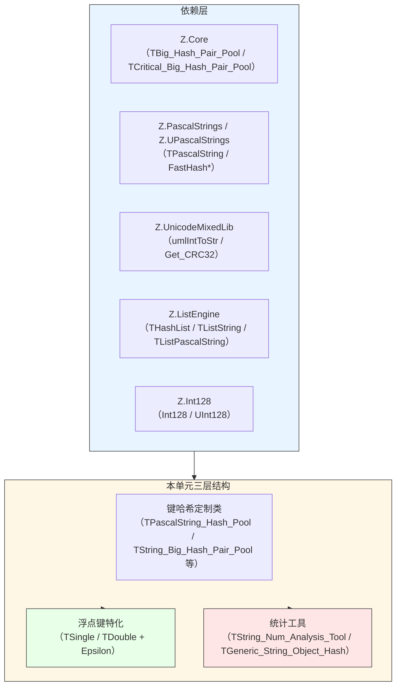
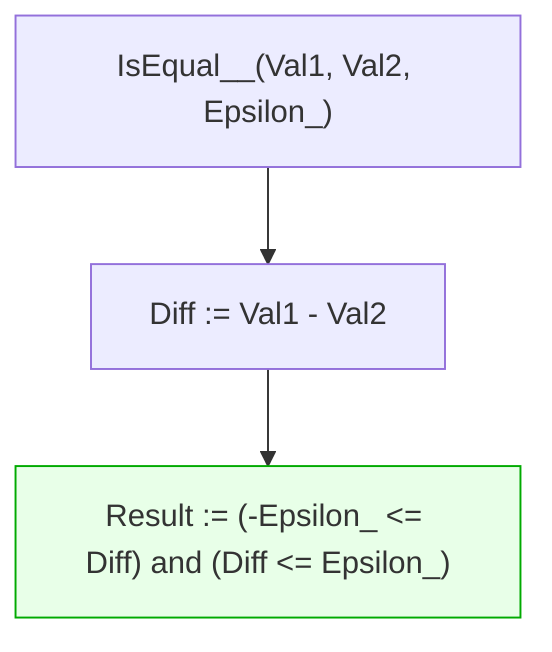
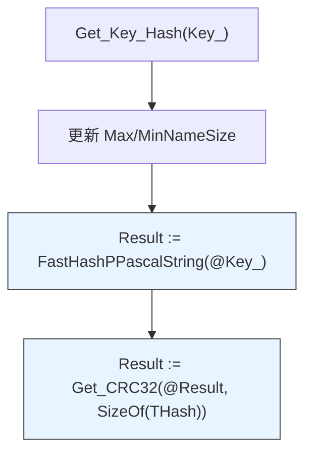
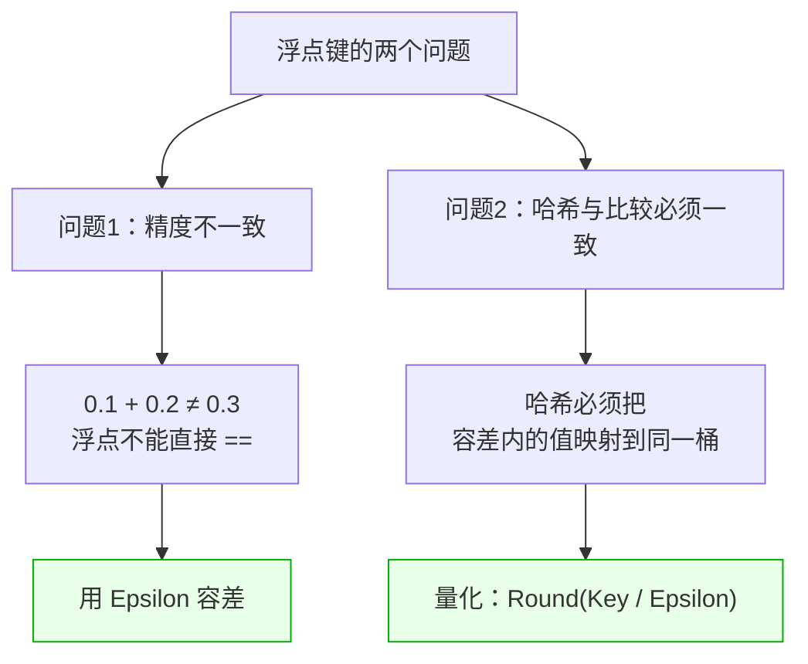
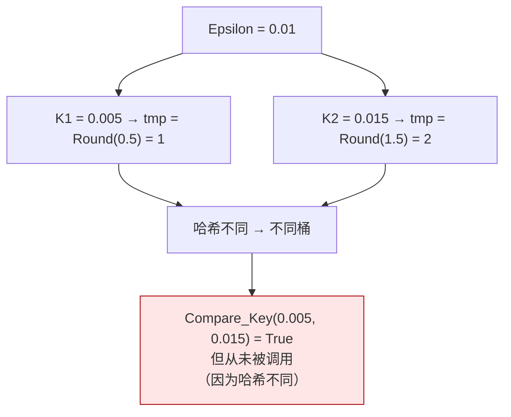
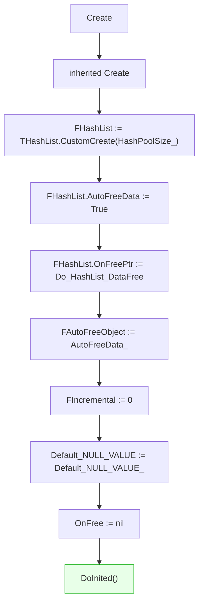
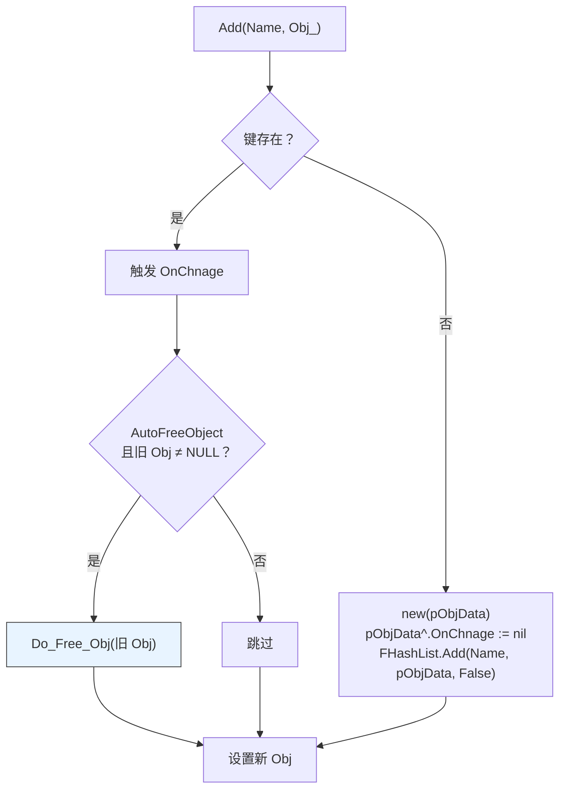
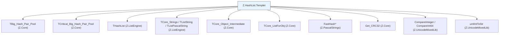

# Z.HashList.Templet 知识库（最终传承版）

> **定位**：面向 AI 与人类工程师的权威参考。目标是让读者**无需翻阅源码**即可安全、准确地使用 `Z.HashList.Templet`。
> **承诺**：所有描述均来自 `Z.HashList.Templet.pas` 的逐行核对。凡我无法从源码确定的，在文末「诚实的不确定清单」中明示。
> **制图约定**：全文流程图/架构图/决策树一律使用 Mermaid，不使用字符制图。

---

## 第 0 章 快速定位：这个单元是什么

`Z.HashList.Templet` 是 Z 框架的**泛型哈希表模板库**。它是 `Z.ListEngine`（遗留非泛型哈希表）的**现代化替代品**——基于 `Z.Core` 的 `TBig_Hash_Pair_Pool` 和 `TCritical_Big_Hash_Pair_Pool`，为常用键类型提供**开箱即用的特化**。



**核心价值**：
- **避免样板代码**：不需要为每种键类型手写哈希表和比较函数。
- **跨编译器统一**：FPC 与 Delphi 使用同一套 API。
- **性能**：基于 `TBig_Hash_Pair_Pool`（链式哈希 + 全局队列 + LRU）。
- **线程安全变体**：`TCritical_*` 前缀提供内置锁。

**命名约定**：
- **`*_Hash_Pool`**：基于**非线程安全** `TBig_Hash_Pair_Pool`。
- **`TCritical_*`**：基于**线程安全** `TCritical_Big_Hash_Pair_Pool`。
- **`T*_Big_Hash_Pair_Pool`**：泛型包装，泛型参数是 **Value 类型**（Key 类型已固定）。
- **`TGeneric_String_Object_Hash<T_>`**：泛型键值包装（Key 是 `SystemString`，Value 是 `T_`）。

---

## 第 1 章 全局函数

```pascal
function IsEqual__(const Val1, Val2, Epsilon_: Single): Boolean; overload;
function IsEqual__(const Val1, Val2, Epsilon_: Double): Boolean; overload;
```

**契约**：



**关键事实**：
- **闭区间比较**：`[-Epsilon_, Epsilon_]`。
- **两个重载实现相同**，都声明 `Diff: Single`（**Double 版本的 Diff 实际是 Single 精度**）。
- **⚠️ `Double` 版本的精度陷阱**：`Diff: Single` 会丢失 `Double` 的精度。

---

## 第 2 章 `TPascalString_Hash_Pool` —— 字符串 → 字符串哈希池

### 2.1 定义

```pascal
TPascalString_Hash_Pool__ = TBig_Hash_Pair_Pool<TPascalString, TPascalString>;

TPascalString_Hash_Pool = class(TPascalString_Hash_Pool__)
private
  FMaxNameSize: Integer;
  FMinNameSize: Integer;
public
  procedure CreateAfter; override;
  function Get_Key_Hash(const Key_: TPascalString): THash; override;
  function Compare_Key(const Key_1, Key_2: TPascalString): Boolean; override;
  procedure DoFree(var Key: TPascalString; var Value: TPascalString); override;
  function Compare_Value(const Value_1, Value_2: TPascalString): Boolean; override;
  property MaxKeySize: Integer read FMaxNameSize;
  property MinKeySize: Integer read FMinNameSize;
end;
```

### 2.2 契约

**`CreateAfter`**：初始化 `FMaxNameSize := 0`、`FMinNameSize := 0`。

**`Get_Key_Hash(Key_)`**：



- **哈希算法**：`FastHashPPascalString`（来自 `Z.PascalStrings`，ASCII 大小写不敏感），再 `Get_CRC32`。
- **副作用**：**更新 `FMaxNameSize` / `FMinNameSize`**。
- **⚠️ 副作用副作用**：`Get_Key_Hash` **不是纯函数**——每次调用都修改统计。

**`Compare_Key(K1, K2)`**：`K1.Same(@K2)`（**大小写不敏感**）。

**`DoFree(Key, Value)`**：`Key := ''; Value := '';`（**清空字符串，让 GC 释放**）。

**`Compare_Value(V1, V2)`**：`V1.Same(@V2)`。

**`MaxKeySize` / `MinKeySize`**：只读属性。

---

## 第 3 章 `TString_Big_Hash_Pair_Pool<T_>` —— 原生字符串键

### 3.1 定义

```pascal
TString_Big_Hash_Pair_Pool<T_> = class(TBig_Hash_Pair_Pool<SystemString, T_>)
private
  FMaxNameSize, FMinNameSize: Integer;
public
  procedure CreateAfter; override;
  function Get_Key_Hash(const Key_: SystemString): THash; override;
  function Compare_Key(const Key_1, Key_2: SystemString): Boolean; override;
  procedure DoFree(var Key: SystemString; var Value: T_); override;
  property MaxKeySize: Integer read FMaxNameSize;
  property MinKeySize: Integer read FMinNameSize;
end;
```

### 3.2 与 `TPascalString_Hash_Pool` 的差异

| 维度 | `TPascalString_Hash_Pool` | `TString_Big_Hash_Pair_Pool<T_>` |
|------|--------------------------|----------------------------------|
| Key 类型 | `TPascalString` | `SystemString` |
| Value 类型 | `TPascalString` | 泛型 `T_` |
| 哈希 | `FastHashPPascalString` | `FastHashSystemString` |
| 比较 | `Key.Same(@Key2)` | `SameText(Key1, Key2)` |
| `DoFree` | 清空 Key + Value | **只清空 Key**，不处理 Value（由 `inherited DoFree` 决定） |

**⚠️ `DoFree` 的差异**：
- `TPascalString_Hash_Pool.DoFree`：清空 Key **和** Value。
- `TString_Big_Hash_Pair_Pool.DoFree`：只清空 Key，**`Value` 的处理交给 `TBig_Hash_Pair_Pool.DoFree`**（可能调用 `FOnFree`）。

### 3.3 契约

**`Get_Key_Hash`**：`FastHashSystemString(Key_)` + `Get_CRC32`，并更新 Max/Min。

**`Compare_Key`**：`SameText(Key1, Key2)`（**大小写不敏感**）。

---

## 第 4 章 `TPascalString_Big_Hash_Pair_Pool<T_>` —— Pascal 字符串键

**与 `TString_Big_Hash_Pair_Pool<T_>` 结构镜像**，只是 Key 用 `TPascalString`。

**契约**：
- `Get_Key_Hash`：`FastHashPPascalString(@Key_)` + `Get_CRC32`。
- `Compare_Key`：`Key1.Same(@Key2)`（大小写不敏感）。
- `DoFree`：只清空 Key。

---

## 第 5 章 数值键特化（无自定义）

```pascal
TPointer_Big_Hash_Pair_Pool<T_>  = class(TBig_Hash_Pair_Pool<Pointer, T_>);    // 无扩展
TInt32_Big_Hash_Pair_Pool<T_>    = class(TBig_Hash_Pair_Pool<Integer, T_>);    // 无扩展
TInt64_Big_Hash_Pair_Pool<T_>    = class(TBig_Hash_Pair_Pool<Int64, T_>);      // 无扩展
TUInt32_Big_Hash_Pair_Pool<T_>   = class(TBig_Hash_Pair_Pool<Cardinal, T_>);   // 无扩展
TUInt64_Big_Hash_Pair_Pool<T_>   = class(TBig_Hash_Pair_Pool<UInt64, T_>);     // 无扩展
TMD5_Big_Hash_Pair_Pool<T_>      = class(TBig_Hash_Pair_Pool<TMD5, T_>);       // 无扩展
```

**契约**：
- **只提供类型别名**，不重写任何方法。
- 哈希 / 比较 / 释放**使用 `TBig_Hash_Pair_Pool` 的默认实现**：
  - 哈希：`Get_CRC32(@Key, SizeOf(Key))`。
  - 比较：`CompareMemory(@K1, @K2, SizeOf(Key))`。
  - 释放：无操作（除非设置 `OnFree`）。

**⚠️ 用途**：
- `TPointer_Big_Hash_Pair_Pool<T_>`：Key 是 `Pointer`，Value 是 `T_`。
- `TInt32_Big_Hash_Pair_Pool<T_>`：Key 是 `Integer`。
- 等等。

**⚠️ 无自动类型检查**：用户可以传任何 `Pointer` / `Integer` 作为键，无范围校验。

---

## 第 6 章 浮点键特化 —— `TSingle` / `TDouble`

### 6.1 定义

```pascal
TSingle_Big_Hash_Pair_Pool<T_> = class(TBig_Hash_Pair_Pool<Single, T_>)
public
  Epsilon: Single;
  constructor Create(const HashSize_: Integer; const NULL_VALUE_: T_; const Epsilon_: Single);
  function Get_Key_Hash(const Key_: Single): THash; override;
  function Compare_Key(const Key_1, Key_2: Single): Boolean; override;
end;

TDouble_Big_Hash_Pair_Pool<T_> = class(TBig_Hash_Pair_Pool<Double, T_>)
public
  Epsilon: Double;
  constructor Create(const HashSize_: Integer; const NULL_VALUE_: T_; const Epsilon_: Double);
  function Get_Key_Hash(const Key_: Double): THash; override;
  function Compare_Key(const Key_1, Key_2: Double): Boolean; override;
end;
```

### 6.2 浮点键的两个关键问题



### 6.3 契约

**`Get_Key_Hash(Key_)`**：

```pascal
var
  tmp: Int64;
begin
  tmp := Round(Key_ * (1.0 / Epsilon));    // 量化
  Result := Get_CRC32(@tmp, 8);
end;
```

- **量化**：把 `Key` 除以 `Epsilon` 并四舍五入为 `Int64`。
- **同一容差内的值会被量化到同一 `Int64`**——哈希相同。
- **⚠️ 量化边界问题**：`0.005` 和 `0.004` 在 `Epsilon=0.01` 下量化到 `0` 和 `0`（`Round(0.5)=1`? `Round(0.4)=0`），但 `0.005` 和 `0.015` 量化到 `1` 和 `2`——**与 `IsEqual__(0.005, 0.015, 0.01)` 返回 True 矛盾**。
- **`1.0 / Epsilon` 是编译期优化还是运行期计算**：源码是运行期。
- **⚠️ `Epsilon = 0` 时 `1.0 / 0 = Inf`**，`Round(Inf)` 未定义。

**`Compare_Key`**：`IsEqual__(Key1, Key2, Epsilon)`。

### 6.4 陷阱

**哈希-比较不一致**：



**结论**：**哈希量化使用 `Round`，比较使用容差**——两者边界不严格对齐。**同一"相等"的两个值可能落在不同桶**，导致 `Get_Key_Value` 找不到。

**建议**：
- 使用**足够大的 `Epsilon`**（远大于浮点误差），且**键值分布不与容差边界对齐**。
- 或直接用 `TBig_Hash_Pair_Pool<Double, T_>` 的自定义 `On_Get_Key` / `On_Compare_Key`。

---

## 第 7 章 `TCritical_*` —— 线程安全变体

```pascal
TCritical_PascalString_Hash_Pool = class(TCritical_Big_Hash_Pair_Pool<TPascalString, TPascalString>)
public
  function Get_Key_Hash(...): THash; override;
  function Compare_Key(...): Boolean; override;
  procedure DoFree(...); override;
  function Compare_Value(...): Boolean; override;
end;

TCritical_String_Big_Hash_Pair_Pool<T_> = class(TCritical_Big_Hash_Pair_Pool<SystemString, T_>)
public
  function Get_Key_Hash(...): THash; override;
  function Compare_Key(...): Boolean; override;
  procedure DoFree(...); override;
end;

TCritical_PascalString_Big_Hash_Pair_Pool<T_> = class(TCritical_Big_Hash_Pair_Pool<TPascalString, T_>)
  // 同上
end;

TCritical_Single_Big_Hash_Pair_Pool<T_> = class(TCritical_Big_Hash_Pair_Pool<Single, T_>)
  // 浮点特化（同 TSingle_*）
end;

TCritical_Double_Big_Hash_Pair_Pool<T_> = class(TCritical_Big_Hash_Pair_Pool<Double, T_>)
  // 浮点特化（同 TDouble_*）
end;

TCritical_MD5_Big_Hash_Pair_Pool<T_>   = class(TCritical_Big_Hash_Pair_Pool<TMD5, T_>);
TCritical_Pointer_Big_Hash_Pair_Pool<T_> = class(TCritical_Big_Hash_Pair_Pool<Pointer, T_>);
TCritical_Int32_Big_Hash_Pair_Pool<T_> = class(TCritical_Big_Hash_Pair_Pool<Integer, T_>);
TCritical_Int64_Big_Hash_Pair_Pool<T_> = class(TCritical_Big_Hash_Pair_Pool<Int64, T_>);
TCritical_UInt32_Big_Hash_Pair_Pool<T_> = class(TCritical_Big_Hash_Pair_Pool<Cardinal, T_>);
TCritical_UInt64_Big_Hash_Pair_Pool<T_> = class(TCritical_Big_Hash_Pair_Pool<UInt64, T_>);
```

### 7.1 契约

**与 `T*_Big_Hash_Pair_Pool` 相同**（哈希、比较、释放），只是基于线程安全的基类。

**区别**：
- **基类**：`TCritical_Big_Hash_Pair_Pool` 而非 `TBig_Hash_Pair_Pool`。
- **所有公共方法内部加锁**。
- **迭代器不自动加锁**（见 Z.Core 知识库 §5.5）。
- **`For_C/M/P` 回调全程持锁**——回调里不能调用哈希表自身的加锁方法。

### 7.2 `TCritical_PascalString_Hash_Pool` 的特殊性

**它继承自 `TCritical_Big_Hash_Pair_Pool<TPascalString, TPascalString>`**，Key 和 Value 都是 `TPascalString`。

**没有 `MaxKeySize` / `MinKeySize`**——与 `TPascalString_Hash_Pool` 不同（那是非线程安全的）。

---

## 第 8 章 统计工具 —— `TString_Num_Analysis_Tool`

### 8.1 定义

```pascal
TString_Num_Analysis_Tool_ = TString_Big_Hash_Pair_Pool<Integer>;

TString_Num_Analysis_Tool = class(TString_Num_Analysis_Tool_)
public
  procedure IncValue(Key_: SystemString; Value_: Integer); overload;
  procedure IncValue(source: TString_Num_Analysis_Tool); overload;
  function Get_Max_Key_And_Value(var k: SystemString; var v: Integer): Boolean;
  function Get_Max_Key(): SystemString;
  function Get_Min_Key(): SystemString;
  function Do_Sort_By_Num(var L, R: Integer): Integer;
  procedure Sort_By_Num();
end;
```

### 8.2 契约

**`IncValue(Key_, Value_)`**：
- `Value_ = 0` 时**直接返回**（不创建条目）。
- 否则 `p := Get_Value_Ptr(Key_); p^ := p^ + Value_;`。
- **⚠️ `Get_Value_Ptr` 在键不存在时会插入 `FNULL_VALUE`**（默认 0）。

**`IncValue(source)`**：遍历 `source` 的所有条目，逐个 `IncValue`。

**`Get_Max_Key_And_Value(k, v)`**：
- 遍历全局队列找**最大 Value**。
- 返回 `Result := True`（非空时）。
- 空表返回 False，`k` / `v` 不变。

**`Get_Max_Key` / `Get_Min_Key`**：
- 同样遍历全局队列。
- **⚠️ 空表时 `Get_Max_Key` 不设置 `Result`**（未初始化）。**这可能返回垃圾字符串**。
- `Get_Min_Key` 显式 `Result := ''`。

**`Do_Sort_By_Num(L, R)`**：调用 `CompareInteger(L, R)`（来自 `Z.UnicodeMixedLib`）。

**`Sort_By_Num`**：`Sort_Value_M(Do_Sort_By_Num)`——**按 Value 排序全局队列**。

### 8.3 `TString_Num64_Analysis_Tool`

**与 `TString_Num_Analysis_Tool` 结构镜像**，只是 Value 是 `Int64`。

---

## 第 9 章 `TGeneric_String_Object_Hash<T_>` —— 泛型对象哈希

### 9.1 定义

```pascal
TGeneric_String_Object_Hash<T_: class> = class(TCore_Object_Intermediate)
public type
  TRefClass_ = TGeneric_String_Object_Hash<T_>;
  TGebnericHashChangeEvent = procedure(Sender: TCore_Object; Name: SystemString; OLD_, New_: T_) of object;
  PGebnericHashListData = ^TGebnericHashListData;
  TGebnericHashListData = record
    Obj: T_;
    OnChnage: TGebnericHashChangeEvent;
  end;
  TGebnericHashListLoop_C = procedure(const Name_: PSystemString; Obj_: T_);
  TGebnericHashListLoop_M = procedure(const Name_: PSystemString; Obj_: T_) of object;
{$IFDEF FPC}
  TGebnericHashListLoop_P = procedure(const Name_: PSystemString; Obj_: T_) is nested;
{$ELSE FPC}
  TGebnericHashListLoop_P = reference to procedure(const Name_: PSystemString; Obj_: T_);
{$ENDIF FPC}
  TOnFree = procedure(var Obj_: T_) of object;
private
  FAutoFreeObject: Boolean;
  FHashList: THashList;
  FIncremental: NativeInt;
  Default_NULL_VALUE: T_;
  // ... getters/setters
protected
public
  OnFree: TOnFree;
  procedure DoInited; virtual;
  constructor Create(AutoFreeData_: Boolean; HashPoolSize_: Integer; Default_NULL_VALUE_: T_);
  destructor Destroy; override;
  // ... 大量方法
end;
```

### 9.2 关键契约

**`Create(AutoFreeData_, HashPoolSize_, Default_NULL_VALUE_)`**：



**`AutoFreeData` 的语义**：
- `FHashList.AutoFreeData := True` **始终**——`FHashList` 会释放 `PGebnericHashListData`。
- `FAutoFreeObject := AutoFreeData_`——决定是否释放 `Obj`。

**`GetKeyValue(Name)` 契约**：
- 键不存在：返回 `Default_NULL_VALUE`。
- 键存在：返回 `pObjData^.Obj as T_`。
- **⚠️ `as` 类型转换**：如果 `Obj` 不是 `T_` 类型，会抛异常。

**`Add(Name, Obj_)` 契约**：



**`Do_Free_Obj(Obj_)`**：
- 若有 `OnFree` 回调：调用它。
- **然后 `DisposeObject(Obj_)`**——**无条件释放**。

**`FastAdd(Name, Obj_)`**：
- **不检查重复**，直接创建。
- **不触发 `OnChnage`**。
- **不释放旧 Obj**。

**`Delete(Name)`**：
- `AutoFreeObject=True` 时先 `Do_Free_Obj`。
- 然后 `FHashList.Delete(Name)`。

**`Clear`**：
- `AutoFreeObject=True` 时遍历所有条目，`Do_Free_Obj`。
- 然后 `FHashList.Clear`。

**`Find(Name)`**：通配符匹配（`THashList.Find`）。

**`GetObjAsName(Obj)`**：O(N) 线性扫描。

**`ReName(OLD_, New_)`**：仅当 `OLD_ <> New_`、`OLD_` 存在、`New_` 不存在时成功。

**`MakeName` / `MakeRefName`**：生成不冲突的名字。

### 9.3 与 `THashObjectList` 的差异

| 维度 | `THashObjectList`（Z.ListEngine） | `TGeneric_String_Object_Hash<T_>` |
|------|-----------------------------------|------------------------------------|
| 泛型 | ❌ 非泛型，Value 固定 `TCore_Object` | ✅ 泛型 `T_: class` |
| `Default_NULL_VALUE` | 无（用 `nil`） | 有（用户指定） |
| `OnChange` 事件 | 有 | 有 |
| `OnFree` 回调 | 无 | 有 |
| `DoInited` 虚方法 | 无 | 有 |

**`TGeneric_String_Object_Hash<T_>` 更灵活**，但**更复杂**。

---

## 第 10 章 完整使用范式

### 10.1 字符串 → 字符串哈希

```pascal
var
  H: TPascalString_Hash_Pool;
begin
  H := TPascalString_Hash_Pool.Create(100);   // 100 个桶
  try
    H.Add('name', 'Alice', True);
    H.Add('age', '30', True);

    WriteLn(H.Get_Key_Value('name').Text);   // 'Alice'
    WriteLn(H.MaxKeySize);                    // 4（'name'）

    // 遍历
    if H.Num > 0 then
      with H.Repeat_ do
        repeat
          // Queue^.Data^.Data.Primary 是 Key
          // Queue^.Data^.Data.Second  是 Value
        until not Next;
  finally
    H.Free;
  end;
end;
```

### 10.2 自定义 Key/Value 类型

```pascal
var
  H: TString_Big_Hash_Pair_Pool<Integer>;
begin
  H := TString_Big_Hash_Pair_Pool<Integer>.Create(100, 0);
  try
    H.Add('count', 42, True);
    WriteLn(H.Get_Key_Value('count'));   // 42
  finally
    H.Free;
  end;
end;
```

### 10.3 线程安全哈希

```pascal
var
  H: TCritical_String_Big_Hash_Pair_Pool<Integer>;
begin
  H := TCritical_String_Big_Hash_Pair_Pool<Integer>.Create(100, 0);
  try
    H.Add('k', 1, True);
    // 多线程访问安全（内部加锁）
    // 但迭代时需手动加锁
    H.Lock;
    try
      with H.Repeat_ do
        repeat
          // 处理条目
        until not Next;
    finally
      H.UnLock;
    end;
  finally
    H.Free;
  end;
end;
```

### 10.4 浮点键

```pascal
var
  H: TSingle_Big_Hash_Pair_Pool<Integer>;
begin
  H := TSingle_Big_Hash_Pair_Pool<Integer>.Create(100, 0, 0.01);
  try
    H[1.0] := 100;
    H[1.005] := 200;   // ⚠️ 可能覆盖或不覆盖（见 §6.4）
  finally
    H.Free;
  end;
end;
```

### 10.5 字符串统计

```pascal
var
  T: TString_Num_Analysis_Tool;
  k: SystemString;
  v: Integer;
begin
  T := TString_Num_Analysis_Tool.Create(100, 0);
  try
    T.IncValue('apple', 1);
    T.IncValue('banana', 2);
    T.IncValue('apple', 3);   // apple = 4

    if T.Get_Max_Key_And_Value(k, v) then
      WriteLn(k, ' = ', v);   // 'apple = 4'

    T.Sort_By_Num;   // 按 Value 排序
  finally
    T.Free;
  end;
end;
```

### 10.6 泛型对象哈希

```pascal
type
  TStringObjHash = TGeneric_String_Object_Hash<TStringList>;

var
  H: TStringObjHash;
begin
  H := TStringObjHash.Create(True, 100, nil);
  try
    H.Add('key1', TStringList.Create).Text := 'a'#10'b';
    H.Add('key2', TStringList.Create).Text := 'c'#10'd';

    WriteLn(H['key1'][0]);   // 'a'

    // 触发 OnFree 时自定义释放
    H.OnFree := procedure(var Obj_: TStringList)
      begin
        // 自定义清理
      end;
  finally
    H.Free;   // AutoFreeObject=True → 释放所有 TStringList
  end;
end;
```

---

## 第 11 章 反例集

### 11.1 `TPascalString_Hash_Pool.Get_Key_Hash` 的副作用

```pascal
// ❌ 错误：在迭代中调用 Get_Key_Hash
with H.Repeat_ do
  repeat
    H.Get_Key_Hash(SomeKey);   // 修改 FMaxNameSize / FMinNameSize
  until not Next;
```

**✅ 正确**：直接读 `MaxKeySize` / `MinKeySize`，不要手动调 `Get_Key_Hash`。

### 11.2 浮点键的哈希-比较不一致

```pascal
// ❌ 错误：Epsilon=0.01 时 0.005 和 0.015 被认为相等（比较），但哈希不同
H := TSingle_Big_Hash_Pair_Pool<Integer>.Create(100, 0, 0.01);
H[0.005] := 1;
WriteLn(H[0.015]);   // 可能返回 0（因为哈希不同，找不到）
```

**✅ 正确**：Epsilon 与键分布要错开。

### 11.3 `IsEqual__(Double)` 的精度陷阱

```pascal
// ⚠️ Double 版本内部 Diff 是 Single
IsEqual__(1.0, 1.0000001, 1e-10);
// Diff 损失精度后可能误判
```

**✅ 正确**：对 Double 精度要求高时自己实现。

### 11.4 `Get_Max_Key` 空表返回垃圾

```pascal
// ⚠️ 空表调用 Get_Max_Key
T := TString_Num_Analysis_Tool.Create(100, 0);
WriteLn(T.Get_Max_Key);   // 未初始化，可能返回随机字符串
```

**✅ 正确**：先检查 `T.Num > 0`。

### 11.5 `TGeneric_String_Object_Hash` 的 `as` 转换

```pascal
// ❌ 错误：Obj 不是 T_ 类型
H := TGeneric_String_Object_Hash<TStringList>.Create(True, 100, nil);
H.Add('k', TStringList.Create);
// 后续误存入非 TStringList 对象
```

**✅ 正确**：泛型类型约束保证编译期检查，但运行时 `Add` 不检查。

### 11.6 `TGeneric_String_Object_Hash.Add` 中的 OnChnage 异常

```pascal
// ⚠️ OnChnage 抛异常被吞
H.OnChange['k'] := procedure(...) begin raise Exception.Create('err'); end;
H.Add('k', Obj);   // 异常被 try...except 吞掉
```

**✅ 正确**：回调内不要抛异常。

### 11.7 `TCritical_*` 迭代器不加锁

```pascal
// ❌ 错误：迭代时未加锁
H := TCritical_String_Big_Hash_Pair_Pool<Integer>.Create(100, 0);
with H.Repeat_ do   // 未加锁！
  repeat
    // 其他线程可能修改
  until not Next;
```

**✅ 正确**：

```pascal
H.Lock;
try
  with H.Repeat_ do
    repeat ... until not Next;
finally
  H.UnLock;
end;
```

### 11.8 `TString_Num_Analysis_Tool.Sort_By_Num` 的全局影响

```pascal
// ⚠️ Sort_By_Num 排序全局队列，影响后续遍历顺序
T.Sort_By_Num;
// 之后的 Repeat_ 遍历是排序后的顺序
```

### 11.9 `IncValue(Key_, 0)` 不创建条目

```pascal
// ⚠️ Value_ = 0 时直接返回
T.IncValue('k', 0);
if not T.Exists('k') then
  WriteLn('不存在');   // 输出：不存在
```

### 11.10 `AutoFreeObject=False` 的泄漏

```pascal
// ❌ AutoFreeObject=False 时析构不释放
H := TGeneric_String_Object_Hash<TStringList>.Create(False, 100, nil);
H.Add('k', TStringList.Create);
H.Free;   // TStringList 泄漏！
```

**✅ 正确**：用 `True` 或手动 `Clear`。

---

## 第 12 章 常见错误对照表

| 现象 | 根因 | 修正 |
|------|------|------|
| `MaxKeySize` 意外变化 | `Get_Key_Hash` 有副作用 | 不要手动调 `Get_Key_Hash` |
| 浮点键找不到 | 哈希量化与比较容差不一致 | 用非边界对齐的键值 |
| `IsEqual__(Double)` 精度差 | 内部 `Diff: Single` | 自实现 Double 比较 |
| 空表 `Get_Max_Key` 垃圾 | 未初始化 `Result` | 先检查 `Num > 0` |
| 迭代时崩 | `TCritical_*` 迭代器不加锁 | 手动 `Lock` / `UnLock` |
| `AutoFreeObject=False` 泄漏 | 析构不释放 | 用 `True` 或 `Clear` |
| `IncValue(_, 0)` 不生效 | 源码短路 | 用非 0 值 |
| `Sort_By_Num` 后遍历顺序变 | 排序全局队列 | 不影响功能 |
| `OnChnage` 异常被吞 | 源码 `try...except` | 回调内不抛异常 |
| `TGeneric_String_Object_Hash` 类型转换崩 | `as T_` 失败 | 确保存入类型正确 |

---

## 第 13 章 与 Z.Core 的衔接

### 13.1 类型依赖



### 13.2 与 `Z.ListEngine` 的对比

| 场景 | `Z.ListEngine` | `Z.HashList.Templet` |
|------|----------------|----------------------|
| 字符串键哈希 | `THashList` / `THashObjectList` / `THashStringList` | `TString_Big_Hash_Pair_Pool<T_>` / `TGeneric_String_Object_Hash<T_>` |
| Int64 键 | `TInt64Hash*` | `TInt64_Big_Hash_Pair_Pool<T_>` |
| UInt32 键 | `TUInt32Hash*` | `TUInt32_Big_Hash_Pair_Pool<T_>` |
| Pointer 键 | 无 | `TPointer_Big_Hash_Pair_Pool<T_>` |
| 线程安全 | 无 | `TCritical_*` |

**迁移建议**：
- **新代码**用 `Z.HashList.Templet`。
- **旧代码**可以保留 `Z.ListEngine`（仍可用）。

### 13.3 线程安全

| 组件 | 线程安全 |
|------|---------|
| `TPascalString_Hash_Pool` | ❌ 否 |
| `TString_Big_Hash_Pair_Pool<T_>` | ❌ 否 |
| `TPascalString_Big_Hash_Pair_Pool<T_>` | ❌ 否 |
| `TSingle_Big_Hash_Pair_Pool<T_>` | ❌ 否 |
| `TDouble_Big_Hash_Pair_Pool<T_>` | ❌ 否 |
| `T*_Big_Hash_Pair_Pool<T_>`（数值） | ❌ 否 |
| `TCritical_*` | ⚠️ 部分（迭代器不自动加锁） |
| `TString_Num_Analysis_Tool` | ❌ 否 |
| `TGeneric_String_Object_Hash<T_>` | ❌ 否（但底层 `THashList` 部分加锁） |

---

## 第 14 章 诚实的不确定清单

> 以下是我从源码**无法完全确定**的点。若 AI 需要在这些场景下工作，**必须回查源码或询问人类**。

1. **`IsEqual__(Double)` 内部 `Diff: Single` 的意图**
   - 源码：`var Diff: Single`，然后 `Diff := Val1 - Val2`。
   - **不确定**：这是有意（承认精度损失）还是笔误（应为 `Double`）。
   - **推测**：**笔误**。**建议**：Double 比较时用 `1e-10` 之类的容差。

2. **浮点键的哈希-比较一致性**
   - 哈希：`Round(Key / Epsilon)`。
   - 比较：`|K1 - K2| <= Epsilon`。
   - **不确定**：量化边界（`Round(0.5)` 是 0 还是 1）是否与容差边界严格对齐。
   - **推测**：**不严格对齐**。**建议**：避免容差边界附近的键。

3. **`TPascalString_Hash_Pool.Get_Key_Hash` 的副作用是否线程安全**
   - `FMaxNameSize` / `FMinNameSize` 无锁。
   - **不确定**：多线程调用时是否崩溃（理论上不会崩，但统计不准）。
   - **推测**：统计不准。

4. **`TSingle_Big_Hash_Pair_Pool` 的 `Epsilon` 为 0**
   - 源码：`Round(Key_ * (1.0 / Epsilon))`。
   - **不确定**：`1.0 / 0` 在 FPC / Delphi 下的行为（Inf / 异常）。
   - **推测**：`Inf`，`Round(Inf)` 未定义。**建议**：`Epsilon > 0`。

5. **`TString_Num_Analysis_Tool.Get_Max_Key` 空表返回**
   - 源码：不设置 `Result`。
   - **不确定**：返回未初始化的 `SystemString`（随机）。
   - **推测**：**空字符串**（因为 `SystemString` 默认空）。

6. **`TString_Num_Analysis_Tool.Sort_By_Num` 的排序稳定性**
   - 用 `Sort_Value_M`（快速排序）。
   - **不确定**：相等元素的相对顺序是否保持。
   - **推测**：**不保持**（快速排序不稳定）。

7. **`TGeneric_String_Object_Hash.GetKeyValue` 的 `as` 转换**
   - 源码：`pObjData^.Obj as T_`。
   - **不确定**：`Obj` 是 nil 时 `nil as T_` 的行为。
   - **推测**：返回 nil（安全）。

8. **`TGeneric_String_Object_Hash.Default_NULL_VALUE` 的比较**
   - 源码：`pObjData^.Obj <> Default_NULL_VALUE`。
   - **不确定**：对 class 类型的 `<>` 比较是否正确（应该是 `not Same`）。
   - **推测**：Delphi 默认 `<>` 对 class 是引用比较。

9. **`TGeneric_String_Object_Hash.Do_Free_Obj` 的 `DisposeObject` 无条件调用**
   - 源码：`if Assigned(OnFree) then OnFree(Obj_); DisposeObject(Obj_);`。
   - **不确定**：用户想自定义释放（不放 `DisposeObject`）时如何处理。
   - **推测**：**无法自定义**——`DisposeObject` 总会调用。**建议**：用 `AutoFreeObject=False`。

10. **`TGeneric_String_Object_Hash` 的 `OnChange` 属性拼写**
    - 内部字段 `OnChnage`（拼写错误），属性 `OnChange`（正确）。
    - **不确定**：是否有意（兼容 `THashObjectList`）。

11. **`TString_Big_Hash_Pair_Pool.DoFree` 与基类的交互**
    - 源码：`Key := ''; inherited DoFree(Key, Value);`。
    - **不确定**：`inherited DoFree` 是否触发 `FOnFree`。
    - **推测**：`TBig_Hash_Pair_Pool.DoFree` 会调用 `FOnFree`（若设置）。

12. **`Test_Generic_String_Object_Hash` 的 `L['abc'][0]` 访问**
    - `TGeneric_String_Object_Hash<TCore_StringList>` 的 `KeyValue` 返回 `TCore_StringList`。
    - **不确定**：`L['abc'][0]` 是否会因 `Default_NULL_VALUE=nil` 而崩。
    - **推测**：若 'abc' 存在则正常，否则崩。

13. **`Test_Single_Big_Hash_Pair_Pool` 的浮点键**
    - 循环 `i * 0.01`，`i` 从 1 到 10000。
    - **不确定**：`i * 0.01` 的浮点误差累积是否导致冲突。
    - **推测**：因为是 `i * 0.01`（每次独立计算），误差累积有限。

14. **`TString_Num64_Analysis_Tool` 的 `IncValue` 溢出**
    - Value_ 是 `Int64`，累加可能溢出。
    - **不确定**：溢出时行为。
    - **推测**：环绕（除非有 `OverflowCheck`）。

15. **`TGeneric_String_Object_Hash.MakeRefName` 的 `FIncremental`**
    - 源码：`repeat inc(FIncremental); Result := RefrenceName + umlIntToStr(FIncremental); until not Exists(Result);`。
    - **不确定**：首次无冲突时是否会 `inc(FIncremental)`。
    - **推测**：会——`MakeRefName` 总是递增。

16. **`TString_Num_Analysis_Tool.IncValue(source)` 的顺序**
    - 源码：`source.Repeat_` 遍历。
    - **不确定**：是否保证与 `source` 的插入顺序一致。
    - **推测**：是（`TBigList` 的 `Repeat_` 按链表顺序）。

17. **`TString_Big_Hash_Pair_Pool.Get_Key_Hash` 的 `FastHashSystemString`**
    - 来自 `Z.PascalStrings`。
    - **不确定**：对 Unicode 字符的行为。
    - **推测**：ASCII 大小写不敏感，Unicode 字符直接哈希。

18. **`TGeneric_String_Object_Hash.Clear` 的 `Do_Free_Obj` 异常**
    - 源码：`try Do_Free_Obj(...) except end`。
    - **不确定**：异常后 `Obj_` 是否已被释放。
    - **推测**：部分释放。

19. **`TGeneric_String_Object_Hash.ReName` 的原子性**
    - 源码：先 `Add(New_, Obj_)` 再 `FHashList.Delete(OLD_)`。
    - **不确定**：`Add` 抛异常时状态。
    - **推测**：`New_` 已添加但 `OLD_` 未删除，导致重复。

20. **`TCritical_PascalString_Hash_Pool` 缺少 `MaxKeySize` / `MinKeySize`**
    - 非线程安全版有，线程安全版没有。
    - **不确定**：是否有意（性能考虑）。
    - **推测**：是——线程安全版不跟踪统计。

---

## 第 15 章 结语

### 15.1 本知识库覆盖范围

- **已精确描述**：
  - `TPascalString_Hash_Pool` 及所有字符串键特化类。
  - 数值键特化（`Pointer` / `Integer` / `Int64` / `Cardinal` / `UInt64` / `TMD5`）。
  - 浮点键特化（`Single` / `Double`）及其陷阱。
  - `TCritical_*` 线程安全变体。
  - `TString_Num_Analysis_Tool` / `TString_Num64_Analysis_Tool` 统计工具。
  - `TGeneric_String_Object_Hash<T_>` 泛型对象哈希。

- **已纠正的常见幻觉**：
  - **`IsEqual__(Double)` 内部 `Diff: Single`**——精度损失。
  - **浮点键的哈希-比较不严格对齐**——同一"相等"值可能落在不同桶。
  - **`Get_Key_Hash` 有副作用**——修改 Max/Min 统计。
  - **`TString_Num_Analysis_Tool.Get_Max_Key` 空表返回未初始化值**。
  - **`TGeneric_String_Object_Hash.FastAdd` 不去重**。
  - **`TGeneric_String_Object_Hash.Do_Free_Obj` 无条件 `DisposeObject`**——无法完全自定义释放。
  - **`TCritical_*` 迭代器不自动加锁**。
  - **`TGeneric_String_Object_Hash` 的 `OnChange` 与内部字段 `OnChnage` 拼写不同**。
  - **`TString_Num_Analysis_Tool.Sort_By_Num` 排全局队列**——影响后续遍历。

- **未覆盖**：
  - 源码中的 20 个不确定点。
  - `TBig_Hash_Pair_Pool` / `TCritical_Big_Hash_Pair_Pool` 的内部实现。
  - `Z.ListEngine` / `Z.PascalStrings` / `Z.UnicodeMixedLib` 的内部实现。
  - 除 `Z.HashList.Templet` 之外的单元。

### 15.2 给 AI 的使用规则

1. **字符串键用 `TPascalString_Hash_Pool` 或 `TString_Big_Hash_Pair_Pool<T_>`**。
2. **线程安全用 `TCritical_*`**，但**迭代时手动 `Lock` / `UnLock`**。
3. **浮点键慎用**——哈希量化与比较容差不严格对齐。
4. **`IsEqual__(Double)` 精度差**——高精度场景自己实现。
5. **`Get_Key_Hash` 不纯**——不要手动调。
6. **`TString_Num_Analysis_Tool` 空表查询先检查 `Num > 0`**。
7. **`TGeneric_String_Object_Hash.FastAdd` 不去重**。
8. **`TGeneric_String_Object_Hash.AutoFreeObject=False` 会泄漏**——用 `True` 或 `Clear`。
9. **`TGeneric_String_Object_Hash` 的 `Do_Free_Obj` 总会 `DisposeObject`**——无法完全自定义。
10. **多线程访问共享哈希表**用 `TCritical_*` 版本。
11. **遇到不确定清单里的场景，请查源码或问人**。

### 15.3 与 Z.Core 知识库的衔接

- 使用本单元前，请先读 Z.Core 知识库第 1、2、5 章（了解 `TBig_Hash_Pair_Pool` 与 `TCritical_Big_Hash_Pair_Pool`）。
- 本单元的**哈希算法**基于 `Z.PascalStrings` 的 `FastHash*` 与 `Z.Core` 的 `Get_CRC32`。
- 本单元的 **`TBig_Hash_Pair_Pool` 迭代器**遵循 Z.Core 知识库 §5.5 的所有规则。
- **迁移建议**：
  - 从 `Z.ListEngine` 的 `THashList` 迁移到 `Z.HashList.Templet` 的 `TString_Big_Hash_Pair_Pool<T_>`。
  - 从 `Z.ListEngine` 的 `THashObjectList` 迁移到 `TGeneric_String_Object_Hash<T_>`。

---

**本知识库的定位**：一份**准确的、有边界的、可操作的** `Z.HashList.Templet` 参考。它不假装能替代源码，但能让你在 90% 的场景下正确使用，并在剩下 10% 的场景下知道该停下来问人。