# Z.Json 知识库修正版（v2）

> **修正说明**：本次修正补入了 **P10-1 / P10-2 / P10-3** 三个来自 `LingoFuse_LLM_Pitfalls_For_AI.md` 的致命坑点，并对若干原有描述做了**精确化**。所有新增内容均标注来源；原文档正确的部分全部保留。
>
> **定位**：面向 AI 与人类工程师的权威参考。目标是让读者**无需翻阅源码**即可安全、准确地使用 `Z.Json`。
> **承诺**：所有描述均来自 `Z.Json.pas` 与两个 `.inc` 文件的逐行核对。凡我无法从源码确定的，在文末「诚实的不确定清单」中明示。
> **制图约定**：全文流程图/架构图/决策树一律使用 Mermaid，不使用字符制图。
> **优先级标识**：
> - 🔴 **致命**：不修必崩
> - 🟠 **严重**：逻辑错误 / 静默失败
> - 🟡 **一般**：体验 / 可维护性

---

## 本版修正摘要

| 编号 | 修正内容 | 来源 |
|:----:|---------|------|
| P10-1 | 补入「子对象调 parse 类方法会破坏父树」的核心坑点 | `LingoFuse_LLM_Pitfalls_For_AI.md` §12 |
| P10-2 | 补入「JSON 经 AnsiString 中转会丢非 ASCII 字符」的坑点 | 同上 |
| P10-3 | 补入「GBK 回退必须用 `USystemString`」的坑点 | 同上 |
| — | 新增「🔴 P10 系列致命坑速查」 | 第 0 章 |
| — | 新增「根对象原则」专章 | §4.0 |
| — | 新增「Parse 类方法只能在 root 上调用」专章 | §4.9 |
| — | 新增 6.11 / 6.12 正确范式 | 第 6 章 |
| — | 新增 7.16 / 7.17 / 7.18 / 7.19 反例 | 第 7 章 |
| — | 新增「🔴 审计清单」章节 | 第 10 章 |
| — | 更新不确定清单（删除已确定的项） | 第 11 章 |

---

## 目录

- [1. 类型系统](#1-类型系统)
- [2. `TZ_JsonBase` —— 生命周期基础](#2-tz_jsonbase--生命周期基础)
- [3. `TZ_JsonArray` —— 数组](#3-tz_jsonarray--数组)
- [4. `TZ_JsonObject` —— 对象](#4-tz_jsonobject--对象)
  - [4.0 🔴 根对象原则（核心）](#40--根对象原则核心)
  - [4.1 字段与构造](#41-字段与构造)
  - [4.2 交换与复制](#42-交换与复制)
  - [4.3 清空与查询](#43-清空与查询)
  - [4.4 读写（按名称）](#44-读写按名称)
  - [4.5 默认值辅助](#45-默认值辅助)
  - [4.6 序列化](#46-序列化)
  - [4.7 MD5](#47-md5)
  - [4.8 测试与调试](#48-测试与调试)
  - [4.9 🔴 Parse 类方法只能在 root 上调用](#49--parse-类方法只能在-root-上调用)
- [5. `TZ_JsonObject_List` —— 对象列表](#5-tz_jsonobject_list--对象列表)
- [6. 完整使用范式](#6-完整使用范式)
- [7. 反例集](#7-反例集)
- [8. 常见错误对照表](#8-常见错误对照表)
- [9. 与 Z.Core / Z.PascalStrings / Z.MemoryStream 的衔接](#9-与-zcore--zpascalstrings--zmemorystream-的衔接)
- [10. 🔴 审计清单](#10--审计清单)
- [11. 诚实的不确定清单](#11-诚实的不确定清单)
- [12. 结语](#12-结语)

---

## 第 0 章 快速定位：这个单元是什么

`Z.Json` 是 Z 框架的 **JSON 包装器**。它**不实现自己的 JSON 解析器**，而是为 FPC 和 Delphi 分别提供统一接口。

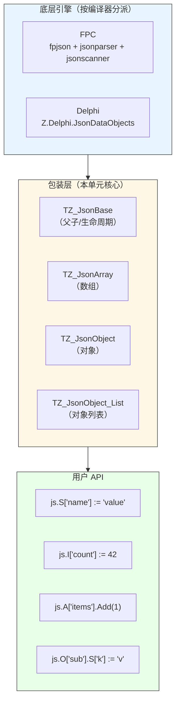

**核心能力**：

| 能力 | 说明 |
|------|------|
| 类型化访问 | `S`（字符串）、`I`/`I32`、`L`/`I64`、`U`/`U64`、`I128`/`U128`、`F`、`D`（日期）、`B`（布尔） |
| 嵌套 | `A['arr']` 取数组，`O['obj']` 取对象，自动创建 |
| 生命周期 | 子对象自动注册到父对象，由父对象统一释放 |
| 序列化 | `ToJSONString(Formated_)` / `ToBytes` / `SaveToStream` / `SaveToFile` |
| 反序列化 | `ParseText` / `LoadFromStream` / `LoadFromFile` / `Parae(TBytes)` |
| MD5 | 直接计算整个 JSON 的 MD5 |
| 别名 | `TZJ` = `TZ_JsonObject`，`TZJArry` = `TZ_JsonArray`，`TZJList` = `TZ_JsonObject_List` |

### 0.1 关键事实

- **`TZ_JsonString` 在两个编译器下类型不同**：
  - FPC：`TUPascalString`（UTF-16）
  - Delphi：`TPascalString`（UnicodeString 或 UTF-16，取决于编译选项）
- **根对象的 `FInstance` 由根对象持有**，子对象的 `FInstance` 由底层库持有，`TZ_JsonObject.Destroy` 中通过 `Parent = nil` 判断。
- **`GetArray` / `GetObject` 会自动创建不存在的成员**——这是最重要的使用陷阱之一。

### 0.2 🔴 P10 系列致命坑速查

> **来源**：`LingoFuse_LLM_Pitfalls_For_AI.md` §12（v3.11 新增 · P10 系列）
> **优先级**：🔴 致命
> **不修必崩**

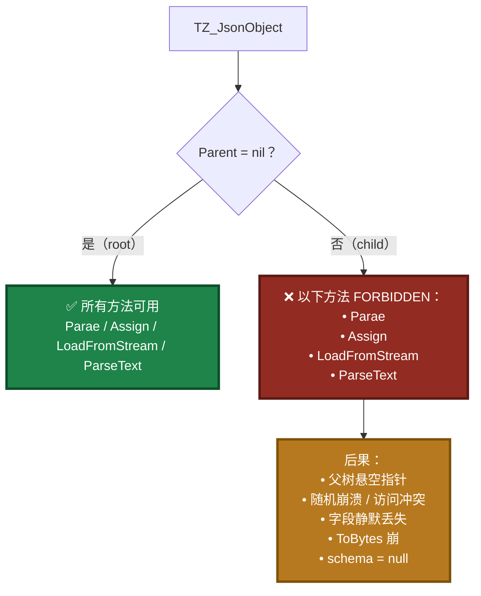

| 编号 | 一句话说明 | 正确做法 |
|:----:|-----------|---------|
| **P10-1** | **`TZ_JsonObject` 是树。子对象调 `Parae` / `Assign` / `LoadFromStream` / `ParseText` 会破坏父树** | 只在 **root** 上 parse；要注入子对象时，用「独立 root 解析 → 取紧凑 JSON 字符串 → `TZ_JsonString` 拼接 → 最后 `.Bytes`」 |
| **P10-2** | **JSON 组装经 `string`（AnsiString）中转会丢非 ASCII 字符**（emoji / 韩文 / 生僻字变 `?`） | 中间容器一律用 `TZ_JsonString`；`.Bytes` 只在最后一步调 |
| **P10-3** | **GBK / Latin-1 回退必须用 `USystemString`**，不能混用 `AnsiString` + `SetLength` + `Move` | 目标变量声明为 `USystemString`，逐字节 `WideChar(...)` 映射 |

**🔴 遇到以上三个坑之一，先停下来。** 详见：
- 第 0 章（本节）
- §4.0「根对象原则」
- §4.9「Parse 类方法只能在 root 上调用」
- 第 6.11 / 6.12 节「正确范式」
- 第 7.16–7.19 节「反例」
- 第 10 章「审计清单」

---

## 第 1 章 类型系统

### 1.1 跨编译器别名

```pascal
type
  TZ_JsonObject = class;   // 前向声明

{$IFDEF DELPHI}
  TZ_Instance_JsonArray  = TJsonArray;      // Z.Delphi.JsonDataObjects
  TZ_Instance_JsonObject = TJsonObject;     // Z.Delphi.JsonDataObjects
  TZ_JsonString          = TPascalString;
{$ELSE DELPHI}
  TZ_Instance_JsonArray  = TJsonArray;      // fpjson
  TZ_Instance_JsonObject = TJsonObject;     // fpjson
  TZ_JsonString          = TUPascalString;
{$ENDIF DELPHI}
```

**关键差异**：

| 维度 | FPC | Delphi |
|------|-----|--------|
| 底层库 | `fpjson` / `jsonparser` / `jsonscanner` | `Z.Delphi.JsonDataObjects` |
| `TZ_JsonString` | `TUPascalString` | `TPascalString` |
| 数组/对象类型 | `fpjson.TJsonArray` / `TJsonObject` | `JsonDataObjects.TJsonArray` / `TJsonObject` |
| 元素访问 | `Integers[]` / `Int64s[]` / `QWords[]` / `Floats[]` / `Strings[]` / `Booleans[]` / `Arrays[]` / `Objects[]` | `I[]` / `I64[]` / `U64[]` / `F[]` / `S[]` / `B[]` / `A[]` / `O[]` |

**🟠 `TZ_JsonString` 的 `.Text` 与 `.Bytes`（P10-2 相关）**：

| 属性 | 语义 | 用途 |
|------|------|------|
| `.Text` | `SystemString` / `USystemString` —— 受**系统代码页**影响 | 面向 UI 显示 |
| `.Bytes` | `TBytes` —— **直接是 UTF-8 字节** | 面向网络传输、文件、MD5 |

**⚠️ 规则**：JSON 组装时**中间容器用 `TZ_JsonString`**，最终转字节时用 `.Bytes`（不是 `.Text`）。

### 1.2 类层次

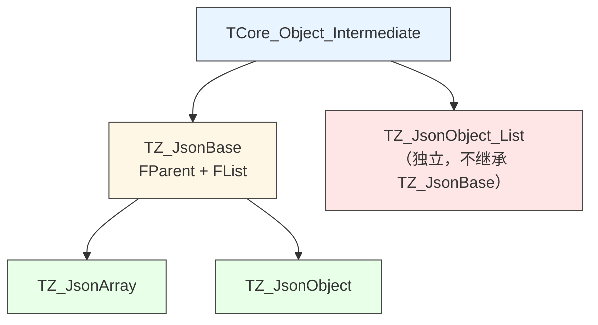

### 1.3 别名

```pascal
TZJArry = TZ_JsonArray;
TZJ     = TZ_JsonObject;
TZJList = TZ_JsonObject_List;
TZJL    = TZ_JsonObject_List;
```

---

## 第 2 章 `TZ_JsonBase` —— 生命周期基础

```pascal
TZ_JsonBase = class(TCore_Object_Intermediate)
protected
  FParent: TZ_JsonBase;    // 父对象
  FList: TCore_ObjectList; // 子对象列表（AutoFreeObj=True）
public
  property Parent: TZ_JsonBase read FParent;
  constructor Create(Parent_: TZ_JsonBase); virtual;
  destructor Destroy; override;
end;
```

### 2.1 构造与析构契约

**`Create(Parent_)` 行为**：

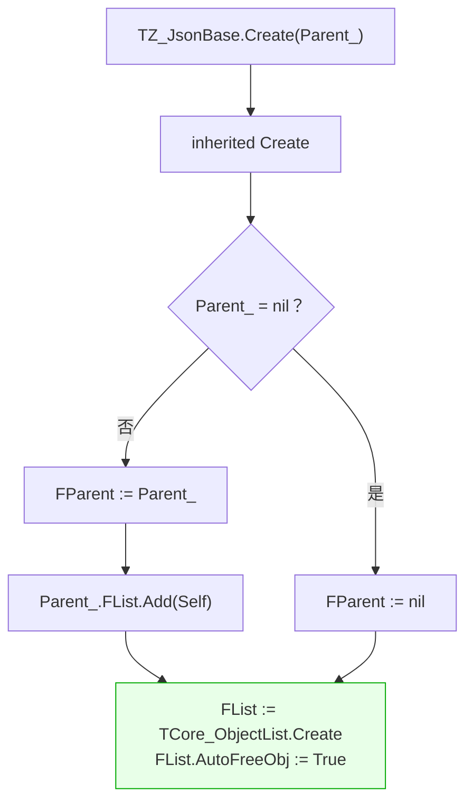

**关键契约**：
1. **子对象自动注册到父对象的 `FList`**（`AutoFreeObj=True`）。
2. **父对象析构时会自动释放所有子对象**（包括 `TZ_JsonObject` / `TZ_JsonArray` 包装器）。
3. **`FList` 自身由本对象析构时释放**。

**`Destroy` 行为**：
- `FList.Free`（释放所有子对象）。
- `inherited Destroy`。

**⚠️ 循环引用陷阱**：
- **不要**把根对象赋给子对象的父对象。
- **不要**让子对象持有父对象的强引用（除了 `FParent`）。
- **不要**手动 Free 一个已有 parent 的子对象——父对象会 Free，双 Free。

---

## 第 3 章 `TZ_JsonArray` —— 数组

### 3.1 字段与构造

```pascal
TZ_JsonArray = class(TZ_JsonBase)
private
  FInstance: TZ_Instance_JsonArray;   // 底层数组
public
  property Instance: TZ_Instance_JsonArray read FInstance;
  constructor Create(Parent_: TZ_JsonBase); override;
  destructor Destroy; override;
end;
```

**⚠️ `TZ_JsonArray.Create(Parent_)` 不创建 `FInstance`**！
- `FInstance` 由外部（`AddArray` / `InsertArray` / `GetArray`）赋值。
- 若手动 `TZ_JsonArray.Create(nil)`，`FInstance` 为 nil，所有方法会**崩溃**。

### 3.2 增删

```pascal
procedure Clear;
procedure Delete(Index: integer);

procedure Add(const v_: string); overload;
procedure Add(const v_: TZ_JsonString); overload;
procedure Add(const v_: integer); overload;
procedure Add(const v_: int64); overload;
procedure Add(const v_: uint64); overload;
procedure Add(const v_: Int128); overload;
procedure Add(const v_: UInt128); overload;
procedure AddF(const v_: double); overload;
procedure Add(const v_: TDateTime); overload;
procedure Add(const v_: boolean); overload;
function  AddArray: TZ_JsonArray;
function  AddObject: TZ_JsonObject;

procedure Insert(Index: integer; const v_: string); overload;
// ... 类似 Add 的多种类型
function  InsertArray(Index: integer): TZ_JsonArray;
function  InsertObject(Index: integer): TZ_JsonObject;
```

**契约**：

| 方法 | 底层行为（FPC / Delphi 一致） |
|------|-------------------------------|
| `Add(string)` | 直接添加字符串 |
| `Add(TZ_JsonString)` | `FInstance.Add(v_.Text)` |
| `Add(integer)` | 直接添加 |
| `Add(int64)` | 直接添加 |
| `Add(uint64)` | 直接添加 |
| `Add(Int128)` | **转为字符串**（`v_.ToLString.Text`） |
| `Add(UInt128)` | **转为字符串** |
| `AddF(double)` | 直接添加浮点 |
| `Add(TDateTime)` | **转为字符串**（`umlDateTimeToStr(v_).Text`） |
| `Add(boolean)` | 直接添加 |
| `AddArray` | 创建新 `TZ_JsonArray`（`Parent=Self`），底层数组添加到当前数组 |
| `AddObject` | 创建新 `TZ_JsonObject`（`Parent=Self`），底层对象添加到当前数组 |

**⚠️ 重大陷阱**：
1. **`Add(Int128)` / `Add(UInt128)` / `Add(TDateTime)` 存的是字符串**，读取时也是字符串 → 需要手动 `Int128(...)` / `umlStrToDateTime(...)`。
2. **没有 `AddF(Single)`**——`Single` 会自动提升为 `Double`。
3. **没有 `Add(Currency)`**——需要用 `AddF(Currency)` 手动转换。

### 3.3 读写（按索引）

```pascal
function GetString(Index: integer): string;  procedure SetString(...);
function GetInt(Index: integer): integer;    procedure SetInt(...);
function GetLong(Index: integer): int64;     procedure SetLong(...);
function GetULong(Index: integer): uint64;   procedure SetULong(...);
function GetInt128(Index: integer): Int128;  procedure SetInt128(...);
function GetUInt128(Index: integer): UInt128; procedure SetUInt128(...);
function GetFloat(Index: integer): double;   procedure SetFloat(...);
function GetDateTime(Index: integer): TDateTime; procedure SetDateTime(...);
function GetBool(Index: integer): boolean;   procedure SetBool(...);
function GetArray(Index: integer): TZ_JsonArray;
function GetObject(Index: integer): TZ_JsonObject;
```

**属性访问**：

```pascal
property S[Index: integer]: string read GetString write SetString;
property I[Index: integer]: integer read GetInt write SetInt;
property I32[Index: integer]: integer read GetInt write SetInt;
property L[Index: integer]: int64 read GetLong write SetLong;
property I64[Index: integer]: int64 read GetLong write SetLong;
property I128[Index: integer]: Int128 read GetInt128 write SetInt128;
property U[Index: integer]: uint64 read GetULong write SetULong;
property U64[Index: integer]: uint64 read GetULong write SetULong;
property U128[Index: integer]: UInt128 read GetUInt128 write SetUInt128;
property F[Index: integer]: double read GetFloat write SetFloat;
property D[Index: integer]: TDateTime read GetDateTime write SetDateTime;
property B[Index: integer]: boolean read GetBool write SetBool;
property A[Index: integer]: TZ_JsonArray read GetArray;
property O[Index: integer]: TZ_JsonObject read GetObject;
property Count: integer read GetCount;
```

**`GetArray(Index)` 契约**：

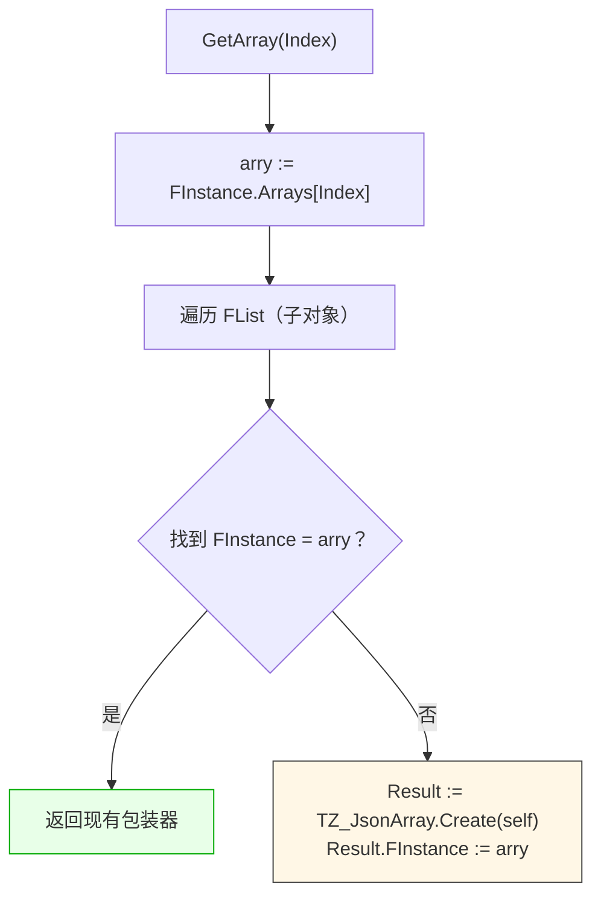

**缓存机制**：同一个底层数组对象只会有一个包装器。

**⚠️ `GetArray` / `GetObject` 不检查类型**：
- 如果 `FInstance.Arrays[Index]` 抛异常（如该位置不是数组），**异常向上传播**。
- **没有 `AsArray` 类型检查**，用错类型会崩。

### 3.4 `Count` 契约

- 返回底层数组的元素个数。
- **无缓存**，每次访问底层库。

---

## 第 4 章 `TZ_JsonObject` —— 对象

### 4.0 🔴 根对象原则（核心）

> **这一节是理解 `Z.Json` 所有陷阱的总钥匙。请务必先读。**

`TZ_JsonObject` **不是一个扁平的键值容器，而是一棵树**。每个 `TZ_JsonObject` 实例在树中的位置由 `FParent` 决定：

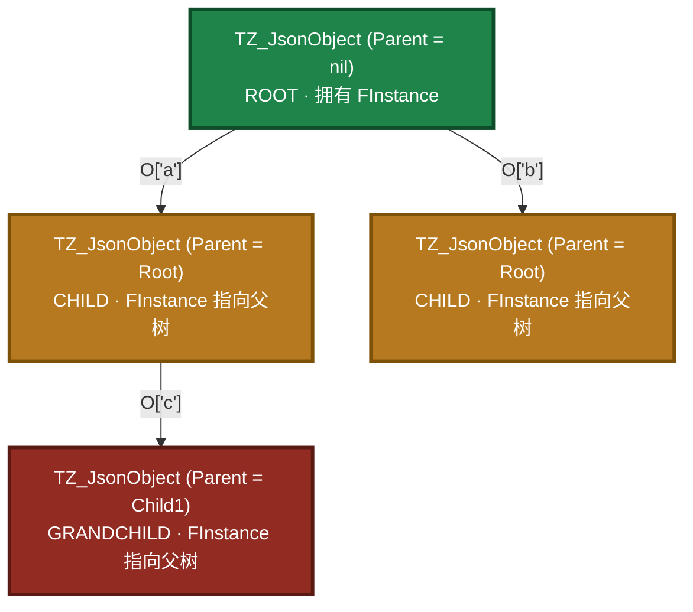

**核心规则**：

| 方法 | ROOT (`Parent = nil`) | CHILD (`Parent <> nil`) |
|------|:---------------------:|:-----------------------:|
| `Parae(TBytes)` | ✅ 允许 | ❌ **禁止**（P10-1） |
| `Assign(source)` | ✅ 允许 | ❌ **禁止**（P10-1） |
| `LoadFromStream(stream)` | ✅ 允许 | ❌ **禁止**（P10-1） |
| `ParseText(text)` | ✅ 允许 | ❌ **禁止**（P10-1） |
| `S[...]` / `I[...]` / `B[...]` 读写 | ✅ | ✅ |
| `O[...]` / `A[...]` 写字段 | ✅ | ✅ |
| `GetArray` / `GetObject` | ✅ | ✅ |
| `SwapInstance` | ✅ | ❌ 抛 `'error.'` |
| `Clone` | ✅ | ✅（返回新的 root） |

**为什么**：`Parae` / `Assign` / `LoadFromStream` / `ParseText` 内部都会 `DisposeObjectAndNil(FInstance)` 后创建**新实例**，但**新实例不会挂回父树**。于是：

- 父树的对应节点变成**悬空指针**
- 后续 `ToBytes` / `SaveToStream` 访问到**已释放内存** → **随机崩溃 / 访问冲突**
- 或者字段**静默丢失**（例如 `options.response_format` 直接消失）
- 或者 `schema` 字段变成 `null`

**正确做法**（P10-1 的标准配方）：

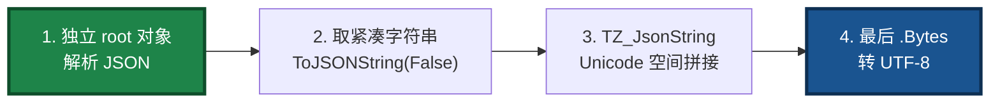

**审计方法**（grep 检查）：

```
搜索 "<obj>.Parae("           → 左侧必须是 ROOT
搜索 "<obj>.Assign("          → 左侧必须是 ROOT
搜索 "<obj>.LoadFromStream("  → 左侧必须是 ROOT
搜索 "<obj>.ParseText("       → 左侧必须是 ROOT
```

详见 §4.9、§6.11、§7.16–7.19、第 10 章。

---

### 4.1 字段与构造

```pascal
TZ_JsonObject = class(TZ_JsonBase)
private
  FInstance: TZ_Instance_JsonObject;
  FTag: integer;
public
  property Tag: integer read FTag write FTag;
  property Instance: TZ_Instance_JsonObject read FInstance;

  constructor Create(); overload;
  constructor Create(Parent_: TZ_JsonBase); overload; override;
  destructor Destroy; override;
end;
```

**构造函数契约**：

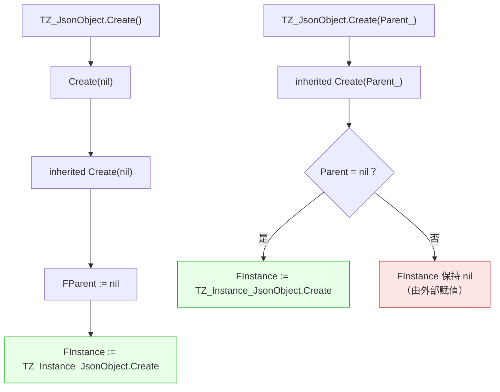

**⚠️ 关键事实**：
- **根对象（`Parent=nil`）自己创建 `FInstance`**。
- **子对象（`Parent<>nil`）不创建 `FInstance`**，必须由 `GetObject` / `AddObject` / `InsertObject` 赋值。
- 手动 `TZ_JsonObject.Create(SomeParent)` 后**必须**手动赋 `FInstance`，否则所有方法崩。

**`Destroy` 契约**：
- **仅当 `Parent = nil` 时才 `FInstance.Free`**（根对象负责）。
- 子对象的 `FInstance` 由父对象的底层库释放。

### 4.2 交换与复制

```pascal
procedure SwapInstance(source_: TZ_JsonObject);
procedure Assign(source_: TZ_JsonObject);
function  Clone: TZ_JsonObject;
```

**`SwapInstance` 契约**：

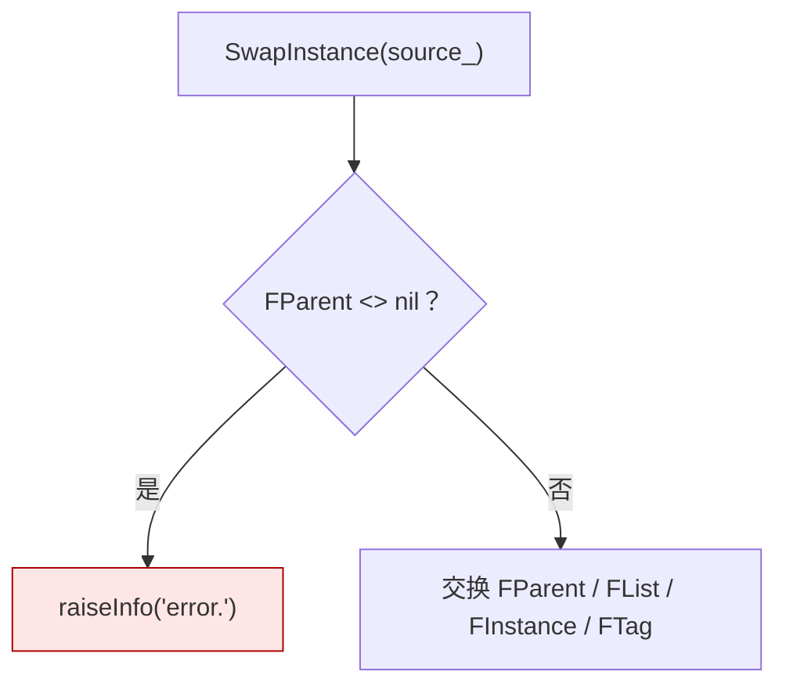

**⚠️ 仅根对象可调用**。子对象调用会**抛异常**。

**`Assign` 契约**：

- 用 `TMS64` 中转：`source_.SaveToStream(m64)` → `LoadFromStream(m64)`。
- **会覆盖当前对象的内容**。
- **`Assign` 保留当前对象的 `Parent` 和 `FTag`**（因为 `LoadFromStream` 只更新 `FInstance`）。

**🔴 P10-1 警告**：

> `Assign` 内部调用 `LoadFromStream`，而 `LoadFromStream` 会 `DisposeObjectAndNil(FInstance)` 后重建。**当目标对象是 child 时，这会破坏父树的对应节点**。
>
> **只能在 ROOT 上调用 `Assign`**。

**`Clone` 契约**：创建新的**根对象**并 `Assign`。因为结果是 root，所以 `Clone` 可以安全地在任何对象上调用。

### 4.3 清空与查询

```pascal
procedure Clear;
function  IndexOf(const Name: string): integer;
function  Exists(const Name: string): boolean;
```

**`IndexOf` 契约**：
- FPC：`FInstance.IndexOfName(Name)`
- Delphi：`FInstance.IndexOf(Name)`

**`Exists` 契约**：`IndexOf(Name) >= 0`。

**`GetName(Index)` / `Names[Index]` 契约**：按索引返回键名。

**`Count` 契约**：返回键值对数量。

### 4.4 读写（按名称）

```pascal
function GetString(const Name: string): string;  procedure SetString(...);
function GetInt(const Name: string): integer;    procedure SetInt(...);
function GetLong(const Name: string): int64;     procedure SetLong(...);
function GetULong(const Name: string): uint64;   procedure SetULong(...);
function GetInt128(const Name: string): Int128;  procedure SetInt128(...);
function GetUInt128(const Name: string): UInt128; procedure SetUInt128(...);
function GetFloat(const Name: string): double;   procedure SetFloat(...);
function GetDateTime(const Name: string): TDateTime; procedure SetDateTime(...);
function GetBool(const Name: string): boolean;   procedure SetBool(...);
function GetArray(const Name: string): TZ_JsonArray;
function GetObject(const Name: string): TZ_JsonObject;
```

**属性**：

```pascal
property S[const Name: string]: string read GetString write SetString;
property I[const Name: string]: integer read GetInt write SetInt;
property I32[const Name: string]: integer read GetInt write SetInt;
property L[const Name: string]: int64 read GetLong write SetLong;
property I64[const Name: string]: int64 read GetLong write SetLong;
property I128[const Name: string]: Int128 read GetInt128 write SetInt128;
property U[const Name: string]: uint64 read GetULong write SetULong;
property U64[const Name: string]: uint64 read GetULong write SetULong;
property U128[const Name: string]: UInt128 read GetUInt128 write SetUInt128;
property F[const Name: string]: double read GetFloat write SetFloat;
property D[const Name: string]: TDateTime read GetDateTime write SetDateTime;
property B[const Name: string]: boolean read GetBool write SetBool;
property A[const Name: string]: TZ_JsonArray read GetArray;
property O[const Name: string]: TZ_JsonObject read GetObject;
property Names[Index: integer]: string read GetName; default;
property Count: integer read GetCount;
```

**⚠️ `S[Name]` 的读写陷阱**：
- **读取不存在的键**：
  - FPC：`FInstance.Strings[Name]` 返回**空字符串**（不抛异常）。
  - Delphi：`FInstance.S[Name]` 返回**空字符串**（不抛异常）。
- **写入会创建新键或覆盖**。

**⚠️ `I[Name]` / `L[Name]` / `F[Name]` / `B[Name]` 的读取**：
- 读取不存在的键：底层库返回默认值（0 / 0.0 / False），**不抛异常**。
- **但类型不匹配时行为不同**（如 `I['s']` 读取字符串键，行为依赖底层库）。

**`GetArray(Name)` 契约**（**关键陷阱区**）：

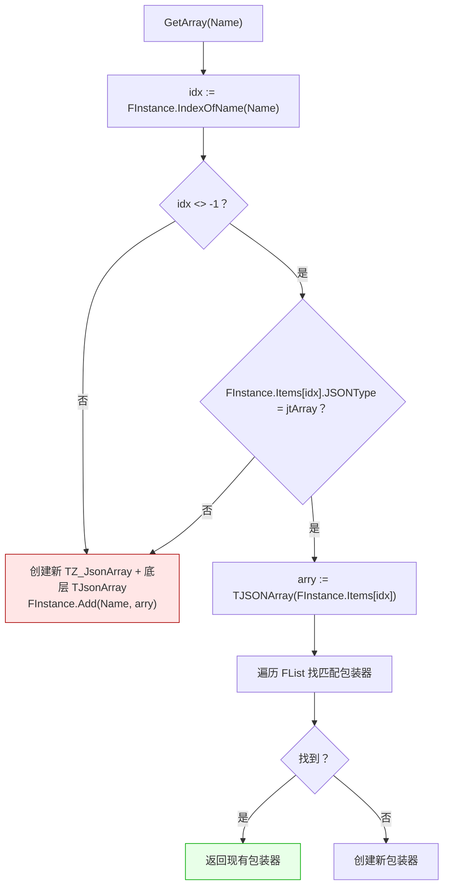

**⚠️ 关键行为**：
- **`GetArray` 在键不存在时会自动创建**！`js.A['new_arr']` 会立即在 JSON 中插入一个空数组。
- **键存在但不是数组类型时**：FPC 下会创建新数组覆盖旧值？**不确定**（见不确定清单）。
- **`GetObject` 同理**。

**这就是为什么 `js.A['arry'].Add(1)` 能工作**：`A['arry']` 会自动创建数组，然后 `.Add(1)` 添加元素。

### 4.5 默认值辅助

```pascal
function Get_Default_S(const Name, Value: string): string;
procedure Set_Default_S(const Name, Value: string);
function GetDefault_S(const Name, Value: string): string;
procedure SetDefault_S(const Name, Value: string);
```

**契约**：
- `Get_Default_S` 和 `GetDefault_S` **功能完全相同**（都先 `Exists` 检查，存在返回实际值，否则返回默认值）。
- `Set_Default_S` 和 `SetDefault_S` **完全相同**（都调用 `S[Name] := Value`）。
- **命名冗余**：两组命名是历史遗留，实际无差异。

**⚠️ `Set_Default_S` 的命名误导**：
- 名字暗示"设置默认值"，实际是**直接写入键值**。
- 若键已存在，会**覆盖**。

### 4.6 序列化

```pascal
function ToJSONString(Formated_: boolean): TZ_JsonString; overload;
function ToJSONString: TZ_JsonString; overload;    // = ToJSONString(True)
property ToJson: TZ_JsonString read ToJSONString;

procedure SaveToStream(stream: TCore_Stream; Formated_: boolean); overload;
procedure SaveToStream(stream: TCore_Stream); overload;   // = SaveToStream(stream, True)
procedure LoadFromStream(stream: TCore_Stream);
procedure SaveToFile(FileName: SystemString);
procedure LoadFromFile(FileName: SystemString);

function ToBytes: TBytes;
function Parae(buff: TBytes): boolean;    // ⚠️ 拼写错误，应为 Parse
function ParseText(Text_: TZ_JsonString; UseUTF8: boolean): boolean; overload;
function ParseText(Text_: TZ_JsonString): boolean; overload;
```

**`ToJSONString(Formated_)` 契约**：

| 编译器 | Formated_=True | Formated_=False |
|--------|----------------|-----------------|
| FPC | `FInstance.FormatJSON([], 2)` | `FInstance.AsJSON` |
| Delphi | `FInstance.ToJson(not Formated_)` | 同上 |

**⚠️ Delphi 的 `ToJson` 参数是 `not Formated_`**——注意是取反！

**`ToJSONString`（无参）返回格式化 JSON**（`Formated_=True`）。

**🔴 P10-2 警告（编码）**：

> `ToJSONString` 返回 `TZ_JsonString`（FPC 下是 `TUPascalString`，Delphi 下是 `TPascalString`）。
>
> **绝不能**把返回值赋给一个 `string` 变量再转换：
>
> ```pascal
> (* ❌ 错误：经 AnsiString 中转 *)
> var s: string;
> s := js.ToJSONString(False).Text;         (* CP936 下非 ASCII 丢失 *)
> reqBytes := TEncoding.UTF8.GetBytes(s);   (* 再转一次，双重损失 *)
> ```
>
> **正确**：
>
> ```pascal
> (* ✅ 正确：全程 TZ_JsonString，最后 .Bytes *)
> var s: TZ_JsonString;
> s := js.ToJSONString(False);
> reqBytes := s.Bytes;                       (* 直接 UTF-8 *)
> ```

**`SaveToStream` 契约**：

| 编译器 | 行为 |
|--------|------|
| FPC | 手动将 `TZ_JsonString` 的 UTF-8 字节写入流 |
| Delphi | `FInstance.SaveToStream(stream, not Formated_, TEncoding.UTF8, True)` |

**🔴 `LoadFromStream` 的 P10-1 警告**：

> `LoadFromStream` **会替换 `FInstance`**（FPC 下明确 `DisposeObjectAndNil(FInstance)` 后重建）。
>
> **只能在 ROOT 上调用。** 在 child 上调用会破坏父树。
>
> **FPC 与 Delphi 的差异**：
> - FPC：`DisposeObjectAndNil(FInstance)` → `GetJSON(stream)` → 类型检查
> - Delphi：`FInstance.LoadFromStream(stream, TEncoding.UTF8, True)`

**`LoadFromFile` 契约**：
- 用 `TMS64` 加载文件。
- 文件不存在或解析失败时**静默返回**（`except` 分支）。

**`ToBytes` 契约**：`SaveToStream` 到 `TMS64`，再 `ToBytes`。

**`Parae(buff)` 契约**：

- **拼写错误**（应为 Parse）。
- 内部用 `TMS64.Mapping(@buff[0], length(buff))` 映射字节，再调用 **`LoadFromStream`**。
- **`buff` 为空时 `@buff[0]` 越界**（详见反例 7.1）。

**🔴 `Parae` 的 P10-1 警告**：

> `Parae` 是 `LoadFromStream` 的薄包装，因此**继承了 P10-1 的所有问题**。
>
> **只能在 ROOT 上调用。** 在 child / grandchild 上调用会破坏父树，导致随机崩溃、字段丢失、`ToBytes` 访问冲突。

**`ParseText` 契约**：

**🔴 `ParseText` 的 P10-1 警告**：

> FPC 分支明确 `DisposeObjectAndNil(FInstance)` 后重建。**在 child 上调用会破坏父树**。
>
> **只能在 ROOT 上调用。** Delphi 分支委托 `FromJSON` / `FromUtf8JSON`，行为类似。
>
> **失败时状态未定义**：
> - FPC：`FInstance` 被替换为空对象
> - Delphi：`FInstance` 可能部分修改
>
> **建议**：`ParseText` 失败后重新创建对象。

### 4.7 MD5

```pascal
function GetMD5: TMD5;
property MD5: TMD5 read GetMD5;
```

**契约**：
- 用 `SaveToStream(m64, False)`（**未格式化**）序列化。
- 然后 `umlStreamMD5(m64)`。

**⚠️ 同一对象两次 `GetMD5` 结果相同**——因为底层键序稳定。

**⚠️ 跨编译器一致性**：FPC 与 Delphi 的 `SaveToStream(False)` 字节可能不同（键序、空白、编码），因此 `GetMD5` 跨编译器**可能不同**。

### 4.8 测试与调试

```pascal
class procedure Test;
```

**契约**：内部用 `DoStatus` 输出测试信息，用于验证底层库正常工作。

**⚠️ `Test` 内部含 P10-1 反面教材**：`js.O['obj'].LoadFromStream(m64)` 是**错误的写法**（对 child 调 `LoadFromStream`），仅作历史演示保留，**新代码不得复制**。

**`Test` 的副作用**：会创建临时对象并释放。仅用于调试。

---

### 4.9 🔴 Parse 类方法只能在 root 上调用

> **本节是 P10-1 的正面清单。** 请与 §4.0「根对象原则」对照阅读。

**四个方法**：

| 方法 | 内部动作 | 对 child 的危害 |
|------|---------|----------------|
| `Parae(TBytes)` | `LoadFromStream` 包装 | 破坏父树 |
| `Assign(source)` | `SaveToStream` + `LoadFromStream` | 破坏父树 |
| `LoadFromStream(stream)` | `DisposeObjectAndNil(FInstance)` 后重建 | 破坏父树 |
| `ParseText(text)` | FPC 下 `DisposeObjectAndNil(FInstance)` 后重建 | 破坏父树 |

**判定"当前对象是否是 root"**：

```pascal
if js.Parent = nil then
  (* root，可以 parse *)
else
  (* child，禁止 parse *)
```

**正确注入 JSON 到 child 的标准配方**（P10-1 官方推荐）：

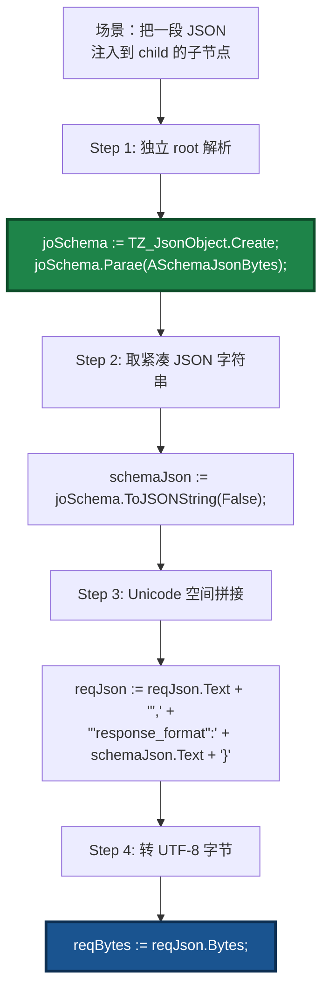

**关键原则**：
1. **独立 root 解析**——parse 只在新建 root 上做。
2. **取紧凑 JSON 字符串**——用 `ToJSONString(False)` 得到单行字符串。
3. **Unicode 空间拼接**——中间容器一律 `TZ_JsonString`。
4. **最后 `.Bytes` 转字节**——不要用 `.Text` 中转。

---

## 第 5 章 `TZ_JsonObject_List` —— 对象列表

### 5.1 字段与构造

```pascal
TZ_JsonObject_List_Decl = TGenericsList<TZ_JsonObject>;

TZ_JsonObject_List = class(TZ_JsonObject_List_Decl)
public
  AutoFreeObj: boolean;
  constructor Create(AutoFreeObj_: boolean);
  destructor Destroy; override;
  function AddFromText(Text_: TZ_JsonString): TZ_JsonObject;
  function AddFromStream(stream: TCore_Stream): TZ_JsonObject;
  function AddFromFile(FileName: U_String): TZ_JsonObject;
  procedure Remove(obj: TZ_JsonObject);
  procedure Delete(Index: integer);
  procedure Clear;
  procedure Clean;
end;
```

### 5.2 契约

**`AutoFreeObj` 的语义**：
- `True` 时：`Remove` / `Delete` / `Clear` 会 `DisposeObject`。
- `False` 时：只移除引用，不释放。

**`Clean` 契约**：
- **无论 `AutoFreeObj` 如何都会释放**所有元素。
- 用于强制清理。

**`AddFromText` / `AddFromStream` / `AddFromFile`**：
- 创建新 `TZ_JsonObject`（**`Parent=nil`，即新的 root**）——符合 §4.0 的 root 原则。
- 用 `ParseText` / `LoadFromStream` / `LoadFromFile` 加载。
- 添加到列表。
- **失败时仍添加**（对象为空）。

**⚠️ `Destroy` 会调用 `Clear`**：
- `Clear` 遵循 `AutoFreeObj`。
- 所以 `AutoFreeObj=False` 时，析构后元素**泄漏**。

---

## 第 6 章 完整使用范式

### 6.1 基本读写

```pascal
var
  js: TZ_JsonObject;
begin
  js := TZ_JsonObject.Create;
  try
    // 写
    js.S['name'] := 'Alice';
    js.I['age'] := 30;
    js.F['score'] := 95.5;
    js.B['active'] := True;
    js.L['big'] := Int64(9223372036854775807);
    js.U64['huge'] := UInt64(18446744073709551615);

    // 读
    WriteLn(js.S['name']);        // 'Alice'
    WriteLn(js.I['age']);         // 30
    WriteLn(js.F['score']);       // 95.5

    // 不存在时读
    WriteLn(js.S['missing']);     // ''
    WriteLn(js.I['missing']);     // 0

    // 输出
    WriteLn(js.ToJSONString(True));
  finally
    js.Free;
  end;
end;
```

### 6.2 嵌套数组

```pascal
var
  js: TZ_JsonObject;
  i: Integer;
begin
  js := TZ_JsonObject.Create;
  try
    // 添加数组（第一次访问 A['items'] 时自动创建）
    js.A['items'].Add('a');
    js.A['items'].Add('b');
    js.A['items'].Add(42);

    // 遍历
    for i := 0 to js.A['items'].Count - 1 do
      WriteLn(js.A['items'].S[i]);   // 索引访问

    // 数组元素是对象
    js.A['items'].AddObject.S['type'] := 'user';
    js.A['items'].O[3].S['name'] := 'Bob';

    WriteLn(js.ToJSONString(True));
  finally
    js.Free;
  end;
end;
```

### 6.3 嵌套对象

```pascal
var
  js: TZ_JsonObject;
begin
  js := TZ_JsonObject.Create;
  try
    // 自动创建子对象
    js.O['user'].S['name'] := 'Alice';
    js.O['user'].I['age'] := 30;
    js.O['config'].B['debug'] := True;

    // 访问子对象
    WriteLn(js.O['user'].S['name']);
  finally
    js.Free;
  end;
end;
```

### 6.4 序列化与反序列化

```pascal
var
  js, js2: TZ_JsonObject;
  text: TZ_JsonString;
begin
  js := TZ_JsonObject.Create;
  try
    js.S['k'] := 'v';
    text := js.ToJSONString(True);

    js2 := TZ_JsonObject.Create;   (* root *)
    try
      js2.ParseText(text);          (* OK: js2 是 root *)
      WriteLn(js2.S['k']);          // 'v'
    finally
      js2.Free;
    end;
  finally
    js.Free;
  end;
end;
```

### 6.5 文件 I/O

```pascal
js.SaveToFile('data.json');
js.LoadFromFile('data.json');
```

### 6.6 Int128 / UInt128

```pascal
var
  js: TZ_JsonObject;
  big: Int128;
begin
  js := TZ_JsonObject.Create;
  try
    big := Int128('123456789012345678901234567890');
    js.I128['big'] := big;

    WriteLn(js.I128['big'].ToString);
  finally
    js.Free;
  end;
end;
```

**注意**：Int128 存的是**字符串**，JSON 中表现为 `"123456789012345678901234567890"`（带引号）。

### 6.7 日期时间

```pascal
js.D['created'] := Now;
// JSON 中是字符串 "2024-01-15 10:30:00.000"
```

### 6.8 对象列表

```pascal
var
  list: TZ_JsonObject_List;
begin
  list := TZ_JsonObject_List.Create(True);   // AutoFree
  try
    list.AddFromText('{"a": 1}');
    list.AddFromText('{"b": 2}');

    WriteLn(list[0].I['a']);   // 1
    WriteLn(list[1].I['b']);   // 2
  finally
    list.Free;   // AutoFree 释放所有
  end;
end;
```

### 6.9 克隆

```pascal
var
  original, copy: TZ_JsonObject;
begin
  original := TZ_JsonObject.Create;
  try
    original.S['k'] := 'v';
    copy := original.Clone;      (* 返回新的 root *)
    try
      copy.S['k'] := 'modified';
      WriteLn(original.S['k']);   // 'v'（原对象不变）
    finally
      copy.Free;
    end;
  finally
    original.Free;
  end;
end;
```

### 6.10 MD5

```pascal
var
  digest: TMD5;
begin
  digest := js.GetMD5;
  // 或
  WriteLn(umlMD5ToStr(js.MD5).Text);
end;
```

### 6.11 🔴 正确注入 JSON 到子对象（P10-1 标准范式）

**场景**：你有一段 JSON 字符串（例如从外部传入的 schema），需要把它作为一个字段注入到 `joReq` 的 `options.response_format`。

**❌ 错误做法**（P10-1 违规）：

```pascal
(* ❌ 错误：对孙对象调 ParseText / Parae *)
joJsonSchema := joReq.O['options'].O['response_format'];
joJsonSchema.O['schema'].ParseText(ASchemaJson);  (* 破坏 joReq 的底层树 *)
reqBytes := joReq.ToBytes;                        (* 崩 / 丢字段 *)
```

**✅ 正确做法**（三步走）：

```pascal
(* Step 1: 在独立 root 对象上解析 *)
joSchema := TZ_JsonObject.Create;
try
  if not joSchema.ParseText(ASchemaJson) then
  begin
    AError := 'Schema JSON is not valid';
    Exit;
  end;
  schemaJson := joSchema.ToJSONString(False);   (* 紧凑 JSON *)
finally
  DisposeObject(joSchema);
end;

(* Step 2: 用 TZ_JsonObject 生成 name/strict 片段 *)
joNameStrict := TZ_JsonObject.Create;
try
  joNameStrict.S['name'] := ASchemaName;
  joNameStrict.B['strict'] := AStrict;
  nameStrictJson := joNameStrict.ToJSONString(False);
finally
  DisposeObject(joNameStrict);
end;

(* Step 3: 在 Unicode 空间拼接 *)
reqJson := joReq.ToJSONString(False);            (* TZ_JsonString *)
tmpReq := reqJson.Text;
SetLength(tmpReq, Length(tmpReq) - 1);           (* 去掉尾 '}' *)
reqJson.Text := tmpReq +
  ',"options":{"response_format":{' +
  '"type":"json_schema","json_schema":{' +
  nameStrictJson.Text + ',' +
  '"schema":' + schemaJson.Text +
  '}}}';

(* Step 4: 最后一步 .Bytes 转 UTF-8 *)
reqBytes := reqJson.Bytes;
```

**关键点**：
1. **只对独立 root 调 `ParseText` / `Parae`**。
2. **`ToJSONString(False)` 得到紧凑字符串**。
3. **中间容器用 `TZ_JsonString`，不用 `string`**（P10-2）。
4. **最后才 `.Bytes`**。

### 6.12 🔴 Unicode 空间拼接（P10-2 标准范式）

**错误写法**：

```pascal
(* ❌ 错误：中间变量用 string（AnsiString） *)
var
  schemaJson, reqJsonStr: string;
begin
  schemaJson := joSchema.ToJSONString(False).Text;  (* CP936 下非 ASCII 丢失 *)
  reqJsonStr := reqJsonStr + '...' + schemaJson + '...';
  reqBytes := TEncoding.UTF8.GetBytes(reqJsonStr);  (* 再转一次 *)
end;
```

**正确写法**：

```pascal
(* ✅ 正确：全程 TZ_JsonString *)
var
  schemaJson, reqJson: TZ_JsonString;
  tmpReq: USystemString;
begin
  schemaJson := joSchema.ToJSONString(False);
  reqJson    := joReq.ToJSONString(False);

  tmpReq := reqJson.Text;                          (* 在 Unicode 空间 *)
  SetLength(tmpReq, Length(tmpReq) - 1);
  reqJson.Text := tmpReq +
    ',"options":{"response_format":' + schemaJson.Text + '}}';

  reqBytes := reqJson.Bytes;                       (* 最后一步转 UTF-8 *)
end;
```

**命名约定**：

| 用途 | 推荐类型 | 避免类型 |
|------|---------|---------|
| JSON 中间容器 | `TZ_JsonString` | `string` |
| 短 ASCII 字段 | `string` 可接受 | — |
| 面向 UI 的显示字符串 | `string` 可接受 | — |
| 字节流 | `TBytes` | — |

---

## 第 7 章 反例集

### 7.1 `Parae` 空缓冲越界

```pascal
// ❌ 错误：空 TBytes
var empty: TBytes;
js.Parae(empty);   // @buff[0] 越界！
```

**✅ 正确**：先检查 `Length(buff) > 0`。

### 7.2 `TZ_JsonArray.Create(nil)` 后直接使用

```pascal
// ❌ 错误：FInstance 为 nil
var arr: TZ_JsonArray;
begin
  arr := TZ_JsonArray.Create(nil);
  arr.Add(1);   // 崩溃（FInstance = nil）
end;
```

**✅ 正确**：用 `TZ_JsonArray.Create(Parent_)` 或通过 `js.A['name']` / `AddArray` 获取。

### 7.3 `TZ_JsonObject.Create(Parent)` 后直接使用

```pascal
// ❌ 错误：子对象的 FInstance 为 nil
var parent, child: TZ_JsonObject;
begin
  parent := TZ_JsonObject.Create;
  child := TZ_JsonObject.Create(parent);
  child.S['k'] := 'v';   // 崩溃（FInstance = nil）
end;
```

**✅ 正确**：用 `parent.O['child']` 或 `AddObject`。

### 7.4 子对象上调用 `SwapInstance`

```pascal
// ❌ 错误：子对象 SwapInstance 抛异常
parent.O['child'].SwapInstance(other);   // raiseInfo('error.')
```

**✅ 正确**：只对根对象调用。

### 7.5 `GetArray` 类型不匹配

```pascal
// ❌ 错误：'k' 已经是字符串，当作数组读
js.S['k'] := 'string';
js.A['k'].Add(1);   // 行为依赖底层库（FPC/Delphi 不同）
```

**✅ 正确**：用 `Exists` + 手动类型检查，或直接覆盖。

### 7.6 `A['x']` 的隐式创建

```pascal
// ⚠️ 读操作会创建键
if js.A['maybe_exists'].Count > 0 then   // ⚠️ 创建了 'maybe_exists' 空数组！
  ...;
```

**✅ 正确**：先 `Exists` 检查。

### 7.7 `Set_Default_S` 的命名误导

```pascal
// ⚠️ 名字暗示"设置默认值"，实际是"写入"
js.Set_Default_S('k', 'v1');   // js['k'] = 'v1'
js.Set_Default_S('k', 'v2');   // js['k'] = 'v2'（覆盖！）
```

**✅ 正确**：`Get_Default_S` 才是"读或默认"，`Set_Default_S` 是"写"。

### 7.8 `AutoFreeObj=False` 的泄漏

```pascal
// ❌ AutoFreeObj=False 时析构不释放
var list := TZ_JsonObject_List.Create(False);
list.AddFromText('{"a": 1}');
list.Free;   // 元素泄漏！
```

**✅ 正确**：显式 `Clean` 或 `AutoFreeObj=True`。

### 7.9 `Clear` 后子对象悬空

```pascal
// ❌ 错误：子对象包装器在 Clear 后失效
var sub: TZ_JsonObject;
begin
  sub := js.O['sub'];
  js.Clear;
  sub.S['k'] := 'v';   // 崩溃（底层对象已释放）
end;
```

**✅ 正确**：`Clear` 后重新获取。

### 7.10 `LoadFromFile` 静默失败

```pascal
// ⚠️ 文件不存在时静默
js.LoadFromFile('/no/such/file.json');
// js 保持为空对象，无异常
```

**✅ 正确**：手动检查文件存在或 `ParseText` 的返回值。

### 7.11 `ParseText` 的返回值

```pascal
// ⚠️ ParseText 返回 False 时 js 状态未定义
if not js.ParseText('invalid json') then
  // js 可能保留旧内容或部分内容
  ...;
```

**✅ 正确**：`ParseText` 失败后重新创建对象。

### 7.12 `Add(TDateTime)` 的字符串存储

```pascal
// ⚠️ 存的是字符串，不是 ISO8601
js.A['times'].Add(Now);
// JSON 中是 "2024-01-15 10:30:00.000"，不是 "2024-01-15T10:30:00Z"
```

### 7.13 Int128 的字符串存储

```pascal
// ⚠️ 存的是字符串，不是数字
js.I128['big'] := Int128('123456789012345678901234567890');
// JSON 中是 "123456789012345678901234567890"（带引号）
// 与外部系统互操作时可能不被识别为数字
```

### 7.14 `SaveToStream` 的默认格式化

```pascal
// ⚠️ SaveToStream(stream) 是格式化版本
js.SaveToStream(stream);
// 等价于 SaveToStream(stream, True)
```

**建议**：需要紧凑格式时显式传 `False`。

### 7.15 Delphi 下 `Add(Int128)` 走 .pas 实现

```pascal
// Delphi 下 Add(Int128) 由 .pas 实现（通过 string 转换）
js.A['arr'].Add(Int128('123'));
// FPC 下也是 .pas 实现
```

**结论**：两个编译器下 `Add(Int128)` 行为一致（走字符串）。

---

### 7.16 🔴 子对象调 `Parae` 导致父树悬空（P10-1）

```pascal
(* ❌ 错误：对孙对象调用 Parae *)
var
  joRoot: TZ_JsonObject;
  joJsonSchema: TZ_JsonObject;
begin
  joRoot := TZ_JsonObject.Create;
  try
    joRoot.S['k'] := 'v';

    (* 下面这行是致命的 *)
    joJsonSchema := joRoot.O['json_schema'];
    joJsonSchema.O['schema'].Parae(ASchemaJsonBytes);   (* ❌ 破坏 joRoot 的底层树 *)

    (* 到这里可能已经崩了，或者下面这句崩 *)
    reqBytes := joRoot.ToBytes;                          (* ❌ 访问冲突 / 字段丢失 *)
  finally
    joRoot.Free;
  end;
end;
```

**症状**：

- 调用 `BuildSchemaResponseFormatJson` / `GenerateStructured` / `SendGenerateCombined` 时**随机崩溃**（访问冲突）
- 或返回的 JSON 里 `options.response_format` **字段丢失**，服务端收到 `{}`
- 或不崩溃但 `schema` 字段内容是 `null`
- 错误可能延迟出现——在 `ToBytes` 序列化时才崩

**根因**：

- `TZ_JsonObject` 是**树形容器**
- 子对象的 `FInstance` 指向父对象底层 `TJSONObject` 树中某个节点
- `Parae` 内部执行 `DisposeObjectAndNil(FInstance)` 后创建全新对象
- 父对象底层树中留下**悬空指针**
- 新 `FInstance` **没有挂接回父树**

**✅ 正确**：见 §6.11 的标准范式。

**审计**：grep `<obj>.Parae(`，确认 `.` 左侧对象是 root。

---

### 7.17 🔴 子对象调 `Assign` / `LoadFromStream` / `ParseText`（P10-1）

```pascal
(* ❌ 错误：对子对象调用 Assign *)
parent.O['child'].Assign(other);              (* 破坏 parent 的底层树 *)

(* ❌ 错误：对子对象调用 LoadFromStream *)
parent.O['child'].LoadFromStream(stream);     (* 破坏 parent 的底层树 *)

(* ❌ 错误：对子对象调用 ParseText *)
parent.O['child'].ParseText('{"k": "v"}');    (* 破坏 parent 的底层树 *)
```

**根因**：三者内部都会 `DisposeObjectAndNil(FInstance)` 后重建，导致父树悬空。

**✅ 正确**：只在 root 上调用；要注入内容到 child，用 §6.11 的拼接范式。

**审计**：

```
grep "<obj>.Assign("          → 左侧必须是 ROOT
grep "<obj>.LoadFromStream("  → 左侧必须是 ROOT
grep "<obj>.ParseText("       → 左侧必须是 ROOT
```

---

### 7.18 🔴 JSON 经 AnsiString 中转丢字符（P10-2）

```pascal
(* ❌ 错误：中间变量用 string（AnsiString） *)
var
  schemaJson, reqJsonStr: string;
begin
  schemaJson  := joSchema.ToJSONString(False).Text;   (* CP936 下 emoji/韩文/生僻字变 '?' *)
  reqJsonStr  := '...' + schemaJson + '...';
  reqBytes    := TEncoding.UTF8.GetBytes(reqJsonStr); (* 再走一遍系统代码页 *)
end;
```

**症状**：

- Schema 里含 emoji / 韩文 / 生僻字 → 到达服务端时变成 `?` 或乱码
- **只在 Windows + FPC** 下出错，Linux / macOS 下正常
- 只在 `DefaultSystemCodePage ≠ CP_UTF8` 时出错

**✅ 正确**：见 §6.12 的标准范式。

**审计**：grep `:= ...ToJSONString(...).Text;` 后赋给 `string` 的位置，改为 `TZ_JsonString`。

---

### 7.19 🔴 GBK / Latin-1 回退用错单位（P10-3）

> **关联坑点**：本坑点在 `Z.Json` 的直接源码中不出现，但它揭示了 `TZ_JsonString` / `USystemString` 与 `AnsiString` 的字节单位差异——**处理 JSON 附带的文本文件**时会踩到。

```pascal
(* ❌ 错误：GBK / Latin-1 回退时用 AnsiString 加 SetLength *)
var
  Decoded: AnsiString;
  i: integer;
begin
  try
    Decoded := TEncoding.UTF8.GetString(rawBytes);
  except
    try
      Decoded := TEncoding.GetEncoding(936).GetString(rawBytes);
    except
      SetLength(Decoded, Length(rawBytes));      (* ❌ 单位混乱 *)
      for i := 0 to Length(rawBytes) - 1 do
        Decoded[i + 1] := AnsiChar(rawBytes[i]); (* ❌ 高位丢失 *)
    end;
  end;
end;
```

**✅ 正确**：

```pascal
(* ✅ 正确：目标用 USystemString，逐字节映射为 WideChar *)
var
  Decoded: USystemString;
  i: integer;
begin
  try
    Decoded := TEncoding.UTF8.GetString(rawBytes);
  except
    try
      Decoded := TEncoding.GetEncoding(936).GetString(rawBytes);
    except
      SetLength(Decoded, Length(rawBytes));
      for i := 0 to Length(rawBytes) - 1 do
        Decoded[i + 1] := WideChar(rawBytes[i]);   (* ✅ Unicode 空间 *)
    end;
  end;
end;
```

**审计**：搜索 GBK / Latin-1 回退分支，确认 `SetLength` 单位与索引语义一致。

---

## 第 8 章 常见错误对照表

| 现象 | 根因 | 修正 |
|------|------|------|
| `FInstance` 为 nil 崩溃 | `Create(nil)` 后未赋 `FInstance` | 用 `A['x']` / `O['x']` 获取 |
| 子对象 `SwapInstance` 抛异常 | 仅根对象可交换 | 用根对象交换 |
| `A['x']` 意外创建键 | `GetArray` 自动创建 | 先 `Exists` 检查 |
| `ParseText` 失败后状态未定义 | 底层库可能部分修改 | 重新创建对象 |
| 数字键存为字符串 | `Add(TDateTime)` / `Add(Int128)` 走字符串 | 读取时手动转换 |
| `AutoFreeObj=False` 泄漏 | 析构不释放 | 显式 `Clean` 或设 `True` |
| 日期格式与外部不兼容 | `umlDateTimeToStr` 输出 `YYYY-MM-DD HH:MM:SS.ZZZ` | 手动转换 |
| `Parae` 空缓冲崩 | `@buff[0]` 越界 | 先检查长度 |
| `LoadFromFile` 静默失败 | `except` 吞掉异常 | 手动检查或先 `Exists` |
| `Set_Default_S` 覆盖已有值 | 名字误导，实际是写 | 用 `Get_Default_S` 才是读或默认 |
| `MD5` 与 `ToJSONString(False)` 不一致 | `GetMD5` 用未格式化版本 | 用 `SaveToStream(False)` 自行计算 |
| **🔴 使用 Schema 时随机崩溃 / 丢字段** | **P10-1：子对象调 `Parae`** | **用 §6.11 的独立 root 范式** |
| **🔴 `options.response_format` 字段丢失** | **P10-1：子对象调 `Parae` / `ParseText`** | **同上** |
| **🔴 `ToBytes` 访问冲突** | **P10-1：子对象调 `Parae`** | **同上** |
| **🔴 `FInstance` 悬空指针** | **P10-1：子对象调 `Assign` / `LoadFromStream`** | **同上** |
| **🟠 JSON 里 emoji / 韩文变 `?`** | **P10-2：经 `string` 中转** | **用 `TZ_JsonString` + `.Bytes`** |
| **🟠 Windows 下 JSON 非 ASCII 丢失** | **P10-2：CP936 环境** | **同上** |
| **🟠 CP936 环境下 schema 损坏** | **P10-2：AnsiString 中转** | **同上** |
| **🟡 GBK 回退输出乱码 / 截断** | **P10-3：`SetLength` 单位错** | **用 `USystemString` + `WideChar`** |

---

## 第 9 章 与 Z.Core / Z.PascalStrings / Z.MemoryStream 的衔接

### 9.1 类型依赖

```mermaid
flowchart TD
    A["Z.Json"] --> B["TCore_Object_Intermediate (Z.Core)"]
    A --> C["TCore_ObjectList (Z.Core)"]
    A --> D["TCore_Stream (Z.Core)"]
    A --> E["TGenericsList<T> (Z.Core)"]
    A --> F["TPascalString (Z.PascalStrings)"]
    A --> G["TUPascalString (Z.UPascalStrings)"]
    A --> H["Int128 / UInt128 (Z.Int128)"]
    A --> I["TMS64 (Z.MemoryStream)"]
    A --> J["umlDateTimeToStr / umlStrToDateTime (Z.UnicodeMixedLib)"]
    A --> K["umlStreamMD5 (Z.UnicodeMixedLib)"]
    A --> L["DoStatus (Z.Status)"]
    A --> M["fpjson / jsonparser (FPC 标准库)"]
    A --> N["Z.Delphi.JsonDataObjects (Delphi)"]

    style A fill:#e8f4ff,stroke:#444
```

### 9.2 线程安全

| 组件 | 线程安全 |
|------|---------|
| `TZ_JsonObject` / `TZ_JsonArray` | ❌ 否 |
| `TZ_JsonObject_List` | ❌ 否 |
| `Test` 类方法 | ❌ 否（创建临时对象） |

**建议**：多线程访问同一 `TZ_JsonObject` 必须外部加锁（`TCritical`）。

### 9.3 与 Z.PascalStrings 的约定

- `TZ_JsonString` 在 FPC 下是 `TUPascalString`（UTF-16），在 Delphi 下是 `TPascalString`。
- **`S[Name]` 返回 `string`**（系统字符串），不是 `TZ_JsonString`。
- 需要 `TPascalString` 时手动构造。
- **🟠 面向 JSON 组装时用 `TZ_JsonString`，不要用 `string`**（P10-2）。

### 9.4 与 `Z.MemoryStream` 的衔接

- `LoadFromStream` / `SaveToStream` 接受 `TCore_Stream`（`TMS64` 是子类）。
- `Parae` 内部用 `TMS64.Mapping(@buff[0], length(buff))` 映射字节。
- **`TMS64.Mapping` 是零拷贝**，所以 `buff` 的生命周期必须覆盖整个 `Parae` 调用。

### 9.5 与 `Z.Int128` 的衔接

- `Int128` / `UInt128` 在 JSON 中以**字符串**形式存储。
- 序列化用 `Value.ToLString.Text`。
- 反序列化用 `Int128(TZ_JsonString(GetString(Name)).Text)`。
- **跨系统互操作时注意**：外部系统可能不识别这种带引号的"数字"。

---

## 第 10 章 🔴 审计清单

> **用途**：每次代码提交前按此清单 grep 检查，防止 P10 系列坑点混入。
> **来源**：`LingoFuse_LLM_Pitfalls_For_AI.md` §18.6。

### 10.1 P10-1 审计（根对象原则）

- [ ] 搜索 `<对象>.Parae(`，确认 `.` 左侧对象是 **root**（`Parent = nil`）
- [ ] 搜索 `<对象>.Assign(`，确认 `.` 左侧对象是 **root**
- [ ] 搜索 `<对象>.LoadFromStream(`，确认 `.` 左侧对象是 **root**
- [ ] 搜索 `<对象>.ParseText(`，确认 `.` 左侧对象是 **root**

**推荐检查方式**：

```pascal
(* 通过封装函数的参数名提示 root 约束 *)
procedure Safe_Parse_Into_Root(var ARoot: TZ_JsonObject;
                               const ABytes: TBytes);
begin
  if ARoot.Parent <> nil then
    raiseInfo('P10-1 violation: Parse target must be a root object');
  if Length(ABytes) = 0 then
    raiseInfo('P10-1: empty byte buffer');
  ARoot.Parae(ABytes);
end;
```

### 10.2 P10-2 审计（Unicode 空间）

- [ ] 搜索 `:= ...ToJSONString(...).Text;` 后赋给 `string` 的位置，改为 `TZ_JsonString`
- [ ] 搜索 `TEncoding.UTF8.GetBytes(<非字面量 string>)`，确认其来源不受代码页影响
- [ ] 所有 JSON 组装的中间变量声明为 `TZ_JsonString`
- [ ] `.Bytes` 只在最后一步调用

### 10.3 P10-3 审计（编码回退）

- [ ] 搜索 GBK / Latin-1 回退分支，确认 `SetLength` 单位与索引语义一致
- [ ] 目标变量声明为 `USystemString`，不是 `AnsiString`

### 10.4 通用 JSON 审计

- [ ] `Exists` 检查先于 `A['x']` / `O['x']` 读操作（避免隐式创建）
- [ ] `AutoFreeObj` 为 `True`，或显式 `Clean`
- [ ] `SaveToStream` 需要紧凑格式时显式传 `False`
- [ ] `Parae` 前检查 `Length(buff) > 0`
- [ ] 跨编译器一致性要求高的场景避免依赖 `GetMD5`

---

## 第 11 章 诚实的不确定清单

> 以下是我从源码**无法完全确定**的点。若 AI 需要在这些场景下工作，**必须回查源码或询问人类**。
>
> **本版更新**：删除已经确定的项（例如 `Parae` 空 buffer 越界——已确定会崩）；保留真正不确定的项。

1. **`TZ_JsonObject.GetArray(Name)` 当键已存在但类型不是数组时的行为**
   - FPC：源码检查 `JSONType = jtArray`，若否则创建新数组（覆盖旧值？还是 `FInstance.Add` 追加？）。
   - Delphi：源码直接 `FInstance.A[Name]`（**若类型不对可能崩**）。
   - **不确定**：两个编译器的行为是否一致。
   - **建议**：先 `Exists` + 手动类型检查。

2. **`TZ_JsonObject.GetObject(Name)` 同样问题**
   - 与 `GetArray` 类似。
   - **不确定**：Delphi 下 `FInstance.O[Name]` 对非对象键的行为。

3. **`TZ_JsonObject.LoadFromStream` 的异常恢复**
   - FPC：`DisposeObjectAndNil(FInstance)` 后 `GetJSON`，若失败 `FInstance` 为 nil，随后创建空对象。
   - Delphi：`FInstance.LoadFromStream` 可能抛异常，`FInstance` 状态未定义。
   - **不确定**：异常后对象是否可用。

4. **`TZ_JsonObject.ParseText` 的 `UseUTF8=True` 语义**
   - FPC：`GetJSON(Text_.Text, UseUTF8)`。
   - Delphi：`FromUtf8JSON` / `FromJSON`。
   - **不确定**：Delphi 下 `UseUTF8=False` 时是否真的是 ANSI。

5. **`TZ_JsonObject.ToJSONString(Formated_)` 的格式细节**
   - FPC：`FormatJSON([], 2)`（2 空格缩进）。
   - Delphi：`ToJson(not Formated_)`（JsonDataObjects 默认格式）。
   - **不确定**：两个编译器的输出格式是否一致。

6. **`TZ_JsonObject.SaveToStream` 的 Formated_ 与 ToJSONString 的一致性**
   - FPC：`SaveToStream` 手动写字节。
   - Delphi：`FInstance.SaveToStream` 有额外参数（`TEncoding.UTF8, True`）。
   - **不确定**：两者输出的字节是否完全一致。

7. **`TZ_JsonObject.GetMD5` 的跨编译器一致性**
   - `SaveToStream(m64, False)` 底层输出可能不同。
   - **不确定**：同一 JSON 在 FPC 和 Delphi 下 `GetMD5` 是否相同。
   - **推测**：**不同**（因为键序、空白、编码可能不同）。

8. **`TZ_JsonObject.Create(Parent_)` 中子对象 `FInstance` 的赋值时机**
   - 源码：仅根对象创建 `FInstance`。
   - 子对象的 `FInstance` 由 `GetArray` / `GetObject` / `AddArray` / `AddObject` 赋值。
   - **不确定**：是否有其他路径（如直接 `TZ_JsonObject.Create(parent)` 后用户手动赋 `FInstance`）。

9. **`TZ_JsonObject.SwapInstance` 的 `FList` 交换**
   - 源码交换 `FParent` / `FList` / `FInstance` / `FTag`。
   - **不确定**：子对象的 `FParent.FList` 中记录的指针是否仍指向正确的对象。
   - **推测**：交换后，`FList` 指向的列表包含对方的子对象——这可能是设计意图。

10. **`TZ_JsonObject.Assign` 的 Self 赋值**
    - `js.Assign(js)` 会怎样？
    - **不确定**：`SaveToStream(m64)` + `LoadFromStream(m64)` 是否安全。
    - **推测**：安全（序列化 + 反序列化），但会覆盖自身内容。

11. **`TZ_JsonObject.Clear` 后 `FTag` 是否重置**
    - 源码：`FInstance.Clear`。
    - **不确定**：`FTag` 保持不变（应该）。
    - **推测**：不变。

12. **`TZ_JsonObject.GetName(Index)` 的键序**
    - FPC：`FInstance.Names[Index]`（插入序）。
    - Delphi：`FInstance.Names[Index]`（JsonDataObjects 的插入序）。
    - **不确定**：两者是否一致。

13. **`TZ_JsonObject.Count` 的语义**
    - 是键值对数量。
    - **不确定**：嵌套对象是否计算在内（应该不计算）。

14. **`TZ_JsonArray.GetString(Index)` 的类型转换**
    - FPC：`FInstance.Strings[Index]`。
    - Delphi：`FInstance.S[Index]`。
    - **不确定**：数字元素通过 `S[]` 读取时的行为（是否转字符串）。

15. **`TZ_JsonArray.GetInt(Index)` 对非整数元素的行为**
    - FPC：`FInstance.Integers[Index]`。
    - Delphi：`FInstance.I[Index]`。
    - **不确定**：字符串元素通过 `I[]` 读取时的行为。
    - **建议**：显式 `Exists` + 类型检查。

16. **`TZ_JsonArray.GetDateTime(Index)` 的解析**
    - FPC：`umlStrToDateTime(FInstance.Strings[Index])`。
    - Delphi：`umlStrToDateTime(FInstance.S[Index])`。
    - **不确定**：无效字符串（如 `'abc'`）的行为。
    - **推测**：`umlStrToDateTime` 可能抛异常或返回默认值。

17. **`TZ_JsonObject.GetInt128(Name)` 的空字符串行为**
    - 源码：`Int128(TZ_JsonString(GetString(Name)).Text)`。
    - **不确定**：`GetString` 返回空字符串时 `Int128('')` 的行为。
    - **推测**：可能抛异常或返回 0。

18. **`TZ_JsonObject.SetInt128(Name, Value)` 的序列化**
    - 源码：`SetString(Name, Value.ToLString)`。
    - **不确定**：`Value.ToLString` 是 `TPascalString` 还是 `SystemString`。
    - **推测**：是 `TPascalString`（隐式转换）。

19. **`TZ_JsonObject_List.AddFromText` 的失败处理**
    - 源码：`Result.ParseText(Text_)`（未检查返回值），然后 `Add(Result)`。
    - **不确定**：`ParseText` 失败时是否仍添加空对象。
    - **推测**：是（添加空对象）。

20. **`TZ_JsonObject_List.Destroy` 调用 `Clear` 的时机**
    - 源码：`Clear` 然后 `inherited Destroy`。
    - **不确定**：`Clear` 时 `AutoFreeObj=True` 释放对象；若 `AutoFreeObj=False`，元素引用被移除但不释放。
    - **建议**：始终用 `AutoFreeObj=True` 或显式 `Clean`。

21. **`TZ_JsonBase.FList` 的 `AutoFreeObj=True` 与子对象双重释放**
    - 父对象析构时 `FList.Free` 释放所有子对象。
    - 子对象析构时 `FList.Free`（自己的子对象）。
    - **不确定**：子对象被父对象释放时，子对象的 `FParent` 指针是否被清空。
    - **推测**：不清理（因为不需要）。

22. **`TZ_JsonObject.S` 属性读写不存在的键的详细行为**
    - 读：返回 `''`。
    - 写：创建键。
    - **不确定**：FPC 与 Delphi 是否完全一致。

23. **`TZ_JsonObject.ParseText` 在 Delphi 下是否也有 P10-1 语义**
    - 源码：Delphi 分支委托 `FromUtf8JSON` / `FromJSON`。
    - **不确定**：这两个方法是否也会替换 `FInstance` 内部的树。
    - **推测**：**是**（否则 P10-1 不会同时列 `ParseText`）。
    - **建议**：保守起见，把 `ParseText` 也当作 root-only。

24. **P10-2 在不同 FPC 版本下的具体表现**
    - 文档说"只在 Windows + FPC 下出错"。
    - **不确定**：具体从哪个 FPC 版本开始引入代码页问题。
    - **建议**：无论如何都用 `TZ_JsonString` + `.Bytes`。

---

## 第 12 章 结语

### 12.1 本知识库覆盖范围

**已精确描述**：
- `TZ_JsonBase` / `TZ_JsonArray` / `TZ_JsonObject` / `TZ_JsonObject_List` 的所有公开 API。
- 父子生命周期、`FInstance` 所有权。
- 跨编译器（FPC / Delphi）差异。
- 序列化 / 反序列化 / 文件 I/O / MD5。
- 类型化访问器与索引器。
- **🔴 P10-1：子对象调 parse 类方法会破坏父树**。
- **🔴 P10-2：JSON 组装必须停在 Unicode 空间**。
- **🟠 P10-3：GBK / Latin-1 回退必须用 `USystemString`**。

**已纠正的常见幻觉**：
- **`TZ_JsonArray.Create(nil)` 后 `FInstance` 为 nil**（不能直接用）。
- **`TZ_JsonObject.Create(Parent)` 后 `FInstance` 为 nil**（子对象由父对象管理）。
- **`SwapInstance` 仅对根对象有效**。
- **`A['x']` / `O['x']` 读操作会隐式创建**。
- **`Add(Int128)` / `Add(UInt128)` / `Add(TDateTime)` 存字符串**。
- **`Set_Default_S` 是"写"不是"设默认"**。
- **`SaveToStream(stream)` 默认是格式化版本**。
- **`Parae` 是 `Parse` 的拼写错误**。
- **`LoadFromFile` 静默失败**。
- **`ParseText` 失败后状态未定义**。
- **FPC 与 Delphi 的 `SaveToStream` / `LoadFromStream` 实现不同**。
- **`GetMD5` 的跨编译器一致性无保证**。
- **🔴 `Parae` / `Assign` / `LoadFromStream` / `ParseText` 只能在 root 上调用**（P10-1）。
- **🔴 `ToJSONString().Text` 赋给 `string` 会丢非 ASCII 字符**（P10-2）。
- **🟠 编码回退用 `AnsiString` + `SetLength` 单位错**（P10-3）。

**未覆盖**：
- 源码中的 24 个不确定点。
- `fpjson` / `Z.Delphi.JsonDataObjects` 的内部实现。
- `Z.Core` / `Z.PascalStrings` / `Z.MemoryStream` / `Z.UnicodeMixedLib` 的内部实现。
- 除 `Z.Json` 之外的单元。

### 12.2 给 AI 的使用规则

**基础规则**：

1. **根对象用 `TZ_JsonObject.Create`**，不要手动传 `Parent`。
2. **访问子数组/子对象用 `js.A['x']` / `js.O['x']`**，它们会自动创建。
3. **读操作可能创建键**——先 `Exists` 检查。
4. **`GetArray` / `GetObject` 不检查类型**——用错类型会崩。
5. **`Int128` / `UInt128` / `TDateTime` 存字符串**——读取时手动转换。
6. **`Set_Default_S` 是"写"**，`Get_Default_S` 才是"读或默认"。
7. **`SaveToStream(stream)` 是格式化版本**。
8. **`Parae` 是 `Parse`**（拼写错误）。
9. **`LoadFromFile` 静默失败**——手动检查。
10. **`ParseText` 失败后对象状态未定义**——重新创建。
11. **`AutoFreeObj=False` 时对象列表会泄漏**——用 `True` 或 `Clean`。
12. **多线程访问同一 `TZ_JsonObject` 必须加锁**。

**🔴 P10 系列规则**：

13. **🔴 P10-1**：**`Parae` / `Assign` / `LoadFromStream` / `ParseText` 只在 root 上调用**。对 child 调用会破坏父树。
14. **🔴 P10-1 正确配方**：要在 child 上注入 JSON 时，用「独立 root 解析 → 取紧凑 JSON 字符串 → `TZ_JsonString` 拼接 → 最后 `.Bytes`」。
15. **🔴 P10-2**：**JSON 组装中间容器必须是 `TZ_JsonString`**，不能是 `string`。`.Bytes` 只在最后一步。
16. **🟠 P10-3**：**GBK / Latin-1 回退目标变量必须是 `USystemString`**。

17. **遇到不确定清单里的场景，请查源码或问人**。

### 12.3 与 Z.Core / Z.PascalStrings 的衔接

- 使用本单元前，请先读 Z.Core 知识库第 1、2、5 章。
- `TZ_JsonObject` 继承自 `TCore_Object_Intermediate`（支持实例跟踪）。
- `TZ_JsonString` 在 FPC 下是 `TUPascalString`（UTF-16），在 Delphi 下是 `TPascalString`。
- `umlDateTimeToStr` / `umlStrToDateTime` / `umlStreamMD5` 来自 `Z.UnicodeMixedLib`。
- `TMS64` 来自 `Z.MemoryStream`。
- **🟠 跨库 JSON 组装时**，请对照 `LingoFuse_LLM_Pitfalls_For_AI.md` 第 12 章的 P10 系列完整说明。

### 12.4 与 `LingoFuse_LLM_Pitfalls_For_AI.md` 的对应关系

| 本文档章节 | 对应 Pitfalls 文档章节 |
|-----------|---------------------|
| §0.2 P10 系列速查 | §12 P10-1 / P10-2 / P10-3 |
| §4.0 根对象原则 | §12 P10-1 |
| §4.9 Parse 类方法只能在 root 上调用 | §12 P10-1 |
| §6.11 正确注入 JSON 到子对象 | §12 P10-1 正确做法 |
| §6.12 Unicode 空间拼接 | §12 P10-2 正确做法 |
| §7.16 子对象调 Parae 反例 | §12 P10-1 反面示例 |
| §7.17 子对象调 Assign / LoadFromStream / ParseText | §12 P10-1 |
| §7.18 JSON 经 AnsiString 中转丢字符 | §12 P10-2 反面示例 |
| §7.19 GBK / Latin-1 回退 | §12 P10-3 |
| §10 审计清单 | §18.6 审计清单 |

---

**本知识库的定位**：一份**准确的、有边界的、可操作的** `Z.Json` 参考。它不假装能替代源码，但能让你在 90% 的场景下正确使用，并在剩下 10% 的场景下知道该停下来问人。

**v2 修正摘要**：本版补入了 P10-1 / P10-2 / P10-3 三个致命坑点，新增「根对象原则」专章、「Parse 类方法只能在 root 上调用」专章、「审计清单」章节、「P10 正确范式」两节、「P10 反例」四节。原文档正确的部分全部保留。