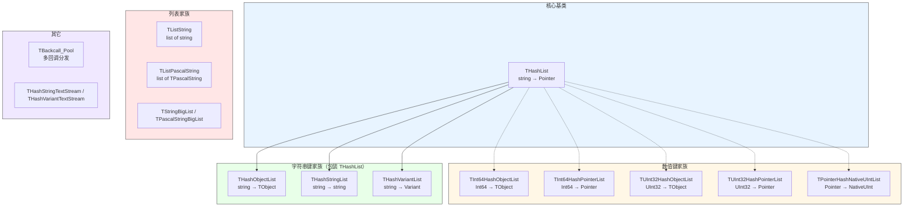
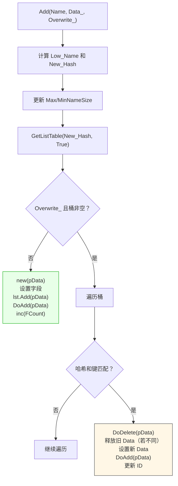
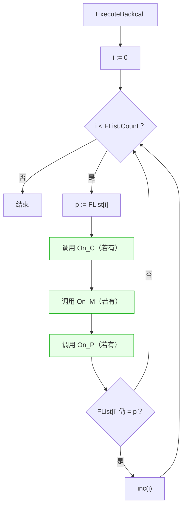

# Z.ListEngine 知识库（最终传承版）

> **定位**：面向 AI 与人类工程师的权威参考。目标是让读者**无需翻阅源码**即可安全、准确地使用 `Z.ListEngine`。
> **承诺**：所有描述均来自 `Z.ListEngine.pas` 的逐行核对。凡我无法从源码确定的，在文末「诚实的不确定清单」中明示。
> **制图约定**：全文流程图/架构图/决策树一律使用 Mermaid，不使用字符制图。
> **历史定位**：本单元**已标记为 LEGACY**，是为向后兼容保留的 pre-generics 时代遗留代码。**新代码不应使用**，请改用 `TDictionary` / `TGenericsList` / `Z.Core` 的现代容器。

---

## 第 0 章 快速定位：这个单元是什么

`Z.ListEngine` 是 Z 框架的**遗留集合框架**。它为每一种 `(KeyType, ValueType)` 组合手工实现一个哈希表类，这是 pre-generics 时代的典型做法。



**共同设计模式**：
1. **桶数组**：`FListBuffer: array of TCore_List`，每个桶是一个 `TCore_List`（存储指针）。
2. **双向链表**：维护插入顺序的 `FFirst` / `FLast`。
3. **LRU ID**：每个条目有一个 `ID` 字段，用于近似 LRU 优化。
4. **三种回调风格**：所有 `Progress*` 方法都提供 `_C` / `_M` / `_P` 三种。
5. **自动释放**：`AutoFreeData` 为 True 时释放存储的值。

**关键警告**：
- **FPC 下 `THashList.DefaultDataFreeProc` 是空实现**（不 `Dispose`），用户必须自己设置 `OnFreePtr`。
- **`if FIDSeed > FIDSeed + 1` 永远为 False**，疑似 bug（应为溢出检查）。
- **`THashStringList.Exists` 使用 `VarIsEmpty`**，但 `V` 是 `SystemString`，行为可疑。

---

## 第 1 章 类型与常量

### 1.1 类型别名

```pascal
type
  TSeedCounter = NativeUInt;
  TListBuffer  = array of TCore_List;
  PListBuffer  = ^TListBuffer;
  TOnPtr       = procedure(p: Pointer) of object;
  TObjectFreeProc = procedure(Obj: TCore_Object) of object;

  // 遗留别名
  TPascalStringList     = TListPascalString;
  TPascalStrings        = TListPascalString;
  TPascalStringHashList = THashStringList;
  TPascalStringHash     = THashStringList;
  PHashList             = ^THashList;
  PHashStringList       = ^THashStringList;
  PHashVariantList      = ^THashVariantList;
```

### 1.2 哈希函数

```pascal
function HashMod(const h: THash; const m: Integer): Integer;
function MakeHashS(const S: SystemString): THash;
function MakeHashPas(const S: PPascalString): THash;
function MakeHashI64(const i64: Int64): THash;
function MakeHashU32(const c32: Cardinal): THash;
function MakeHashP(const p: Pointer): THash;
```

**契约**：
- `HashMod(h, m)`：`m > 0` 且 `h > 0` 时返回 `umlMax(0, umlMin(h mod m, m - 1))`；否则返回 0。
- `MakeHashS`：先 `FastHashSystemString`（来自 Z.PascalStrings，ASCII 大小写不敏感），再 `Get_CRC32`。
- `MakeHashPas`：先 `FastHashPPascalString`，再 `Get_CRC32`。
- `MakeHashI64` / `MakeHashU32` / `MakeHashP`：直接 `Get_CRC32`。

**关键事实**：
- **所有 `MakeHash*` 对字符串都是 ASCII 大小写不敏感的**（折叠 `A-Z` 为 `a-z`）。
- `HashMod` 需要 `Length(FListBuffer) > 0`；否则 `FListBuffer[0]` 越界。

### 1.3 泛型别名（现代部分）

```pascal
TUInt8List  = TGenericsList<Byte>;
TByteList   = TUInt8List;
TInt8List   = TGenericsList<ShortInt>;
TUInt16List = TGenericsList<Word>;
TWordList   = TUInt16List;
TInt16List  = TGenericsList<SmallInt>;
TUInt32List = TGenericsList<Cardinal>;
TInt32List  = TGenericsList<Integer>;
TUInt64List = TGenericsList<UInt64>;
TInt64List  = TGenericsList<Int64>;
TSingleList = TGenericsList<Single>;
TFloatList  = TGenericsList<Single>;
TDoubleList = TGenericsList<Double>;
TVariantList = TGenericsList<Variant>;
```

**这些不是遗留类**——只是 `TGenericsList` 的类型别名。

---

## 第 2 章 `THashList` —— 字符串 → 指针哈希表

### 2.1 节点结构

```pascal
PHashListData = ^THashListData;
THashListData = record
  qHash: THash;                  // 缓存的哈希值（小写键）
  LowerCaseName: SystemString;   // 小写键（用于大小写不敏感查找）
  OriginName: SystemString;      // 原始键
  Data: Pointer;                 // 存储的值
  ID: TSeedCounter;              // LRU 排序 ID
  Prev, Next: PHashListData;     // 双向链表指针
end;
```

### 2.2 字段

```pascal
THashList = class(TCore_Object_Intermediate)
private
  FListBuffer: TListBuffer;      // 桶数组
  FAutoFreeData: Boolean;        // 删除时是否释放 Data
  FCount: NativeInt;             // 条目数
  FIDSeed: TSeedCounter;         // LRU 计数器
  FIgnoreCase: Boolean;          // 默认 True
  FAccessOptimization: Boolean;  // 默认 False
  FOnFreePtr: TOnPtr;            // Data 释放回调
  FFirst, FLast: PHashListData;  // 双向链表头尾
  FMaxNameSize, FMinNameSize: NativeInt;  // 键长统计
end;
```

### 2.3 构造与生命周期

```pascal
constructor Create;                              // HashPoolSize = 64
constructor CustomCreate(HashPoolSize_: Integer);
destructor  Destroy; override;
procedure   Clear;
```

**`Clear` 契约**：
- 遍历每个桶，对每个条目：
  - 若 `FAutoFreeData` 且 `Data <> nil`：调用 `DoDataFreeProc(Data)`。
  - `Dispose(pData)`。
- 释放每个桶的 `TCore_List`。
- 重置 `FCount := 0`、`FIDSeed := 0`、`FFirst/Last := nil`、`FMaxNameSize/Min := -1`。
- **桶数组本身不清空**（只把每个元素置 nil）。

**`CustomCreate` 契约**：
- `FIgnoreCase := True`、`FAccessOptimization := False`、`FAutoFreeData := False`。
- `FOnFreePtr := DefaultDataFreeProc`。
- 调用 `SetHashBlockCount(HashPoolSize_)` 初始化桶数组。
- **`HashPoolSize_` 必须 > 0**（否则 `HashMod` 会返回 0，`FListBuffer[0]` 越界）。

**⚠️ `DefaultDataFreeProc` 的 FPC 差异**：

```pascal
procedure THashList.DefaultDataFreeProc(p: Pointer);
begin
{$IFDEF FPC}
{$ELSE}
  Dispose(p);
{$ENDIF}
end;
```

- **Delphi 下**：`Dispose(p)`（释放 Data）。
- **FPC 下**：**什么都不做**（空实现）。

**含义**：FPC 下 `AutoFreeData=True` 且 `OnFreePtr` 未改变时，**Data 不会被释放**——必须手动设置 `OnFreePtr`。

### 2.4 增删改

```pascal
function  Add(const Name: SystemString; Data_: Pointer; const Overwrite_: Boolean): PHashListData; overload;
procedure Add(const Name: SystemString; Data_: Pointer); overload;
procedure SetValue(const Name: SystemString; const Data_: Pointer);
function  Insert(Name, InsertToBefore_: SystemString; Data_: Pointer; const Overwrite_: Boolean): PHashListData;
procedure Delete(const Name: SystemString);
```

**`Add(Name, Data_, Overwrite_)` 契约**：



**⚠️ `Add` 的关键陷阱**：
- `Overwrite_=False` 时**不检查重复**，会产生重复条目。
- `Overwrite_=True` 时**只覆盖第一个匹配**，不会删除后续重复（若有）。
- 覆盖时**保留原 `OriginName`**（不会更新为新传入的 `Name`）。

**`SetValue(Name, Data_)` 契约**：
- 存在时：更新 `Data`（若旧 Data 不同且 `AutoFreeData`，释放旧的），**不更新 LRU / 链表**。
- 不存在时：等同于 `Add`。

**`Delete(Name)` 契约**：
- 匹配哈希和小写键的所有条目都会被删除。
- 删除时释放 Data（若 `AutoFreeData`）。
- 若 `FCount` 归零，重置 `FIDSeed := 1`、`FMaxNameSize/Min := -1`。

**`Insert` 契约**：
- 若 `InsertToBefore_` 不存在，回退到 `Add`。
- 否则插入到目标之前。

### 2.5 查询

```pascal
function  GetKeyData(const Name: SystemString): PHashListData;
function  GetKeyValue(const Name: SystemString): Pointer;
function  Find(const Name: SystemString): Pointer;      // 通配符匹配
function  Exists(const Name: SystemString): Boolean;
function  First: Pointer;
function  Last: Pointer;
function  GetNext(const Name: SystemString): Pointer;
function  GetPrev(const Name: SystemString): Pointer;
```

**`Find` 与 `GetKeyValue` 的差异**：

| 方法 | 匹配方式 | 复杂度 |
|------|----------|--------|
| `GetKeyValue` | 哈希 + 精确匹配 | O(1) 平均 |
| `Find` | **通配符匹配**（`umlMultipleMatch`），**遍历所有桶** | O(N) |

**⚠️ `Find` 性能陷阱**：`Find` **遍历所有桶的所有条目**，即使查找的是一个精确键。

**`GetKeyData` 的 LRU 优化**（源码）：

```pascal
if (FAccessOptimization) and (pData^.ID < FIDSeed - 1) then
  begin
    DoDelete(pData);            // 从双向链表移除
    if i < lst.Count - 1 then   // 若不在桶末尾
      begin
        lst.Delete(i);
        lst.Add(pData);
      end;
    pData^.ID := FIDSeed;
    DoAdd(pData);               // 加到双向链表末尾
    if FIDSeed > FIDSeed + 1 then   // ⚠️ 永远 False！
      RebuildIDSeedCounter
    else
      inc(FIDSeed);
  end;
```

**关键观察**：
- `FIDSeed > FIDSeed + 1` **永远为 False**（除非溢出到 `MaxUInt` 附近），所以实际总是执行 `inc(FIDSeed)`。
- 疑似源码 bug——原意可能是 `FIDSeed = MaxUInt` 之类的溢出检查。

**`Exists` 契约**：哈希 + 小写键精确匹配。

### 2.6 属性

```pascal
property KeyValue[const Name: SystemString]: Pointer read GetKeyValue write SetValue; default;
property NameValue[const Name: SystemString]: Pointer read GetKeyValue write SetValue;
property KeyData[const Name: SystemString]: PHashListData read GetKeyData;
property NameData[const Name: SystemString]: PHashListData read GetKeyData;

property AutoFreeData: Boolean read FAutoFreeData write FAutoFreeData;
property IgnoreCase: Boolean read FIgnoreCase write FIgnoreCase;
property AccessOptimization: Boolean read FAccessOptimization write FAccessOptimization;
property Count: NativeInt read FCount write FCount;  // ⚠️ 可写！
property FirstPtr: PHashListData read FFirst write FFirst;
property LastPtr: PHashListData read FLast write FLast;
property OnFreePtr: TOnPtr read FOnFreePtr write FOnFreePtr;
property MaxKeySize / MinKeySize / MaxNameSize / MinNameSize / MaxKeyLen / MinKeyLen / MaxNameLen / MinNameLen: NativeInt read FMaxNameSize/FMinNameSize;
```

**⚠️ `Count` 可写**——用户误改会导致不一致。源码里是 `read FCount write FCount`。

### 2.7 迭代

```pascal
procedure ProgressC(const OnProgress: THashListLoop_C);   // procedure(Name_: PSystemString; hData: PHashListData)
procedure ProgressM(const OnProgress: THashListLoop_M);   // of object
procedure ProgressP(const OnProgress: THashListLoop_P);   // 嵌套/引用
```

**契约**：
- 按**插入顺序**遍历双向链表。
- 回调异常被 `try...except` 吞掉。
- 回调**不应修改哈希表结构**（可能导致遍历错乱）。

### 2.8 工具

```pascal
procedure MergeTo(dest: THashList);
procedure Assign(Source: THashList);
procedure GetNameList(var Output_: TArrayPascalString); overload;
procedure GetNameList(OutputList: TListString); overload;
procedure GetNameList(OutputList: TListPascalString); overload;
procedure GetNameList(OutputList: TCore_Strings); overload;
procedure GetListData(OutputList: TCore_List);
function  GetHashDataArray(): THashDataArray;
procedure SetHashBlockCount(HashPoolSize_: Integer);
procedure PrintHashReport;
function  ListBuffer: PListBuffer;
```

**`GetHashDataArray` 契约**：
- 返回 `PHashListData` 的**数组**（快照）。
- 用户可用它安全迭代（即使之后修改哈希表，只要不释放条目）。

**`SetHashBlockCount` 契约**：
- **先 `Clear`**（释放所有条目）。
- 重新分配桶数组。

**`PrintHashReport` 契约**：用 `DoStatus` 输出桶使用统计（`usaged container: X item total: Y Max: Z min: W`）。

---

## 第 3 章 `TInt64HashObjectList` / `TInt64HashPointerList`

### 3.1 与 `THashList` 的差异

| 方面 | `THashList` | `TInt64HashObjectList` | `TInt64HashPointerList` |
|------|-------------|------------------------|--------------------------|
| Key 类型 | `SystemString` | `Int64` | `Int64` |
| Value 类型 | `Pointer` | `TCore_Object` | `Pointer` |
| 释放回调 | `TOnPtr` | `TObjectFreeProc` | `TOnPtr` |
| `Add` 通知 | 无 | 无 | `OnAddPtr` |
| `IgnoreCase` | 有 | **无** | **无** |
| `AutoFreeData` | 有 | 有 | 有 |
| `DeleteFirst/Last` | 无 | 有 | 无 |

### 3.2 `TInt64HashObjectList` 特有

```pascal
property i64Val[i64: Int64]: TCore_Object read Geti64Val write SetValue; default;
property i64Data[i64: Int64]: PInt64HashListObjectStruct read Geti64Data;
property OnObjectFreeProc: TObjectFreeProc read FOnObjectFreeProc write FOnObjectFreeProc;
procedure DeleteFirst;
procedure DeleteLast;
```

**`DefaultObjectFreeProc` 契约**：
- `DisposeObject(Obj)`（无条件释放）。
- 设置 `AutoFreeData=True` 后，删除条目会调用这个默认实现。

**`DeleteFirst` / `DeleteLast` 契约**：
- 通过 `FFirst^.i64` / `FLast^.i64` 调用 `Delete`。

### 3.3 `TInt64HashPointerList` 特有

```pascal
property i64Val[i64: Int64]: Pointer read Geti64Val write SetValue; default;
property i64Data[i64: Int64]: PInt64HashListPointerStruct read Geti64Data;
property OnFreePtr: TOnPtr read FOnFreePtr write FOnFreePtr;
property OnAddPtr: TOnPtr read FOnAddPtr write FOnAddPtr;
```

**`OnAddPtr` 契约**：
- **在 `Add` / `SetValue` / `Insert` 成功时触发**。
- 传入 `Data_` 指针。
- **不检查 `AutoFreeData`**——总是触发。
- **`Clear` 和 `Delete` 不触发**。

**⚠️ `DefaultDataFreeProc` 在 FPC 下也是空实现**（与 `THashList` 相同）。

---

## 第 4 章 `TUInt32HashObjectList` / `TUInt32HashPointerList`

**与 `TInt64Hash*` 结构完全镜像**，只是 Key 从 `Int64` 换成 `UInt32`。

**特有方法**：
- `TUInt32HashObjectList.ExistsObject(Obj: TCore_Object): Boolean`——**O(N) 线性扫描**。
- `TUInt32HashPointerList.Delete(u32): Boolean`——**返回是否删除成功**（`TInt64HashPointerList.Delete` 无返回值）。
- `TUInt32HashPointerList.ExistsPointer(pData: Pointer): Boolean`——**O(N) 线性扫描**。

---

## 第 5 章 `TPointerHashNativeUIntList`

**Key 是 `Pointer`，Value 是 `NativeUInt`**。追踪 `FTotal`（总和）和 `FMinimizePtr` / `FMaximumPtr`（键的极值）。

### 5.1 特有字段

```pascal
FTotal: UInt64;                    // 所有值的和
FMinimizePtr, FMaximumPtr: Pointer;  // 最小/最大键
```

### 5.2 特有属性

```pascal
const NullValue = 0;

property Total: UInt64 read FTotal;
property MinimizePtr: Pointer read FMinimizePtr;
property MaximumPtr: Pointer read FMaximumPtr;
property NPtrVal[NPtr: Pointer]: NativeUInt read GetNPtrVal write SetValue; default;
property NPtrData[NPtr: Pointer]: PPointerHashListNativeUIntStruct read GetNPtrData;
```

### 5.3 特有方法

```pascal
procedure FastClear;
function  ExistsNaviveUInt(Obj: NativeUInt): Boolean;   // ⚠️ 拼写错误（应为 Native）
```

**`Total` 的维护**：
- `Add` / `SetValue` / `Insert` / `Delete` 都会更新 `FTotal`。
- `Clear` 重置为 0。

**`FMinimizePtr` / `FMaximumPtr` 的维护**：
- **只在 `Add` / `SetValue` / `Insert` 中更新**（新条目时）。
- **`Delete` 不会重算**——删除最小/最大指针后，属性会指向已删除的值。
- `Clear` 会重置为 nil。

**⚠️ 重大缺陷**：`FMinimizePtr` / `FMaximumPtr` 是**只增不减**的——删除后不重算。

**`FastClear` 与 `Clear` 的差异**：
- `Clear`：`Dispose(pData)` 并释放桶的 `TCore_List`。
- `FastClear`：`Dispose(pData)` 并 `lst.Clear`（**保留桶对象**）。
- 两者都重置状态。

### 5.4 特有方法族

- `ExistsNaviveUInt(Obj)`：**O(N) 线性扫描**所有值。

---

## 第 6 章 `THashObjectList` —— 字符串 → TObject

**包装 `THashList`，Value 存 `PHashObjectListData`（含 `Obj` 和 `OnChnage`）**。

### 6.1 内部数据

```pascal
THashObjectListData = record
  Obj: TCore_Object;
  OnChnage: THashObjectChangeEvent;
end;
PHashObjectListData = ^THashObjectListData;

THashObjectChangeEvent = procedure(Sender: THashObjectList; Name: SystemString; OLD_, New_: TCore_Object) of object;
```

### 6.2 构造

```pascal
constructor Create(AutoFreeData_: Boolean);                    // HashPoolSize = 64
constructor CustomCreate(AutoFreeData_: Boolean; HashPoolSize_: Integer);
```

**契约**：
- `AutoFreeObject := AutoFreeData_`。
- `FHashList.FAutoFreeData := True`（让 `THashList` 自动释放 `PHashObjectListData`）。
- `FHashList.OnFreePtr := DefaultDataFreeProc`（Dispose `PHashObjectListData`）。

**⚠️ 双重释放风险**：`AutoFreeObject=True` 时，`Clear` / `Delete` **先释放 `Obj`**，再让 `THashList` 释放 `PHashObjectListData`——顺序正确。

### 6.3 增删

```pascal
function Add(const Name: SystemString; Obj_: TCore_Object): TCore_Object;
function FastAdd(const Name: SystemString; Obj_: TCore_Object): TCore_Object;
procedure Delete(const Name: SystemString);
procedure Clear;
```

**`Add` 契约**：
- 若键已存在：
  - 触发 `OnChnage` 回调（`OLD_` / `New_`）。
  - 若 `AutoFreeObject` 且旧 `Obj <> nil`：`DisposeObject` 旧的。
- 若键不存在：创建新条目（`OnChnage := nil`）。
- 设置 `pObjData^.Obj := Obj_`。

**`FastAdd` 契约**：
- **不检查重复**，直接 `FHashList.Add(Name, pObjData, False)`。
- **不触发 `OnChnage`**。
- **不释放旧 Obj**（因为不覆盖）。
- 用于性能优先场景，但**可能产生重复键**。

**`Delete` 契约**：
- `AutoFreeObject=True` 时先 `DisposeObject(Obj)`。
- 再 `FHashList.Delete(Name)`（触发 `PHashObjectListData` 的 `Dispose`）。

### 6.4 查询

```pascal
function  Find(const Name: SystemString): TCore_Object;      // 通配符
function  Exists(const Name: SystemString): Boolean;
function  ExistsObject(Obj: TCore_Object): Boolean;           // O(N)
function  GetObjAsName(Obj: TCore_Object): SystemString;      // O(N)
```

### 6.5 重命名与生成名

```pascal
function ReName(_OLDName, _NewName: SystemString): Boolean;
function MakeName: SystemString;
function MakeRefName(RefrenceName: SystemString): SystemString;
```

**`ReName` 契约**：
- 若 `_OLDName = _NewName` 或 `_OLDName` 不存在或 `_NewName` 已存在，返回 False。
- 否则：`Add(_NewName, Obj)`（会触发 `OnChnage`）+ `Delete(_OLDName)`。

**`MakeName` 契约**：
- 递增 `FIncremental`，返回 `IntToStr(FIncremental)`，直到不冲突。

**`MakeRefName` 契约**：
- 若 `RefrenceName` 不存在，直接返回。
- 否则返回 `RefrenceName + IntToStr(FIncremental)`（递增直到不冲突）。

### 6.6 列表化

```pascal
procedure GetNameList(OutputList: TCore_Strings);
procedure GetNameList(OutputList: TListString);
procedure GetNameList(OutputList: TListPascalString);
procedure GetListData(OutputList: TCore_Strings);      // 使用 AddObject
procedure GetListData(OutputList: TListString);
procedure GetListData(OutputList: TListPascalString);
procedure GetAsList(OutputList: TCore_ListForObj);
```

**`GetNameList` vs `GetListData`**：
- `GetNameList`：只添加 Name（`Add`）。
- `GetListData`：添加 Name + Obj（`AddObject`）。

### 6.7 属性

```pascal
property AccessOptimization: Boolean read GetAccessOptimization write SetAccessOptimization;
property IgnoreCase: Boolean read GetIgnoreCase write SetIgnoreCase;
property AutoFreeObject: Boolean read FAutoFreeObject write FAutoFreeObject;
property Count: NativeInt read GetCount;
property KeyValue[const Name: SystemString]: TCore_Object read GetKeyValue write SetKeyValue; default;
property NameValue[const Name: SystemString]: TCore_Object read GetKeyValue write SetKeyValue;
property OnChange[const Name: SystemString]: THashObjectChangeEvent read GetOnChange write SetOnChange;
property HashList: THashList read FHashList;
```

**`OnChange[Name]` 设置契约**：
- 若键不存在：创建新条目（`Obj := nil`，`OnChnage := Value_`）。
- 若键存在：只改 `OnChnage`。

**⚠️ `OnChange` 属性名拼写**：内部字段是 `OnChnage`（拼写错误），属性是 `OnChange`（正确）。

---

## 第 7 章 `THashStringList` —— 字符串 → 字符串

**包装 `THashList`，Value 存 `PHashStringListData`（含 `V: SystemString` 和 `OnChnage`）**。

### 7.1 内部数据

```pascal
THashStringListData = record
  V: SystemString;
  OnChnage: THashStringChangeEvent;
end;
PHashStringListData = ^THashStringListData;

THashStringChangeEvent = procedure(Sender: THashStringList; Name_, OLD_, New_: SystemString) of object;
```

### 7.2 构造

```pascal
constructor Create;                            // HashPoolSize = 64
constructor CustomCreate(HashPoolSize_: Integer);
```

### 7.3 增删

```pascal
function Add(const Name: SystemString; V: SystemString): SystemString;
function FastAdd(const Name: SystemString; V: SystemString): SystemString;
function IncValue(const Name: SystemString; V: SystemString): SystemString; overload;
procedure IncValue(const vl: THashStringList); overload;
procedure Delete(const Name: SystemString);
procedure Clear;
```

**`Add` 契约**：与 `THashObjectList.Add` 类似，但 Value 是 `SystemString`。

**`IncValue` 契约**：
- 若键存在且 `V <> ''`：`Result := pVarData^.V + ',' + V`。
- 若键不存在：`Result := V`。
- **用逗号连接**——不是数字自增。

### 7.4 查询

```pascal
function Find(const Name: SystemString): SystemString;      // 通配符
function FindValue(const Value_: SystemString): SystemString;  // O(N)，返回第一个匹配的键
function Exists(const Name: SystemString): Boolean;
function FirstName: SystemString;
function LastName: SystemString;
function FirstData: PHashStringListData;
function LastData: PHashStringListData;
```

**⚠️ `Exists` 的怪异实现**：

```pascal
function THashStringList.Exists(const Name: SystemString): Boolean;
var
  pVarData: PHashStringListData;
begin
  pVarData := FHashList.NameValue[Name];
  if pVarData = nil then
    Result := False
  else
    Result := not VarIsEmpty(pVarData^.V);   // ⚠️ V 是 SystemString，不是 Variant
end;
```

- `V` 是 `SystemString`，`VarIsEmpty` 期望 `Variant`——隐式转换。
- 空字符串 `''` 转为 `Variant` 时是 `varString('')` 或 `varUString('')`，`VarIsEmpty` 返回 False。
- 所以 `not VarIsEmpty('')` = **True**。
- **结论**：只要键存在（无论值是否为空），`Exists` 都返回 True。
- **这可能是 bug**——用户可能期望空值算不存在。

### 7.5 默认值与类型快捷

```pascal
function GetDefaultValue(const Name: SystemString; Value_: SystemString): SystemString;
procedure SetDefaultValue(const Name: SystemString; Value_: SystemString);
function GetDefaultText(const Name: SystemString; Value_: SystemString): SystemString;
function GetDefaultText_I32(const Name: SystemString; const Value: Integer): Integer;
function GetDefaultText_U32(...): Cardinal;
function GetDefaultText_I64(...): Int64;
function GetDefaultText_I128(...): Int128;
function GetDefaultText_Float(...): Double;
function GetDefaultText_Bool(...): Boolean;
function GetDefaultText_DT(...): TDateTime;
// 对应的 SetDefaultText_*
```

**`GetDefaultValue` 契约**：
- 若 `Name = ''`：直接返回 `Value_`。
- 若键存在：返回 `pVarData^.V`。
- 若键不存在：返回 `Value_`，且 `AutoUpdateDefaultValue=True` 时插入。

**类型快捷**：用 `umlStrToInt` / `umlStrToInt64` / `umlStrToFloat` / `umlStrToBool` / `umlDT` 转换。

### 7.6 宏展开与替换

```pascal
function ProcessMacro(const Text_, Before__, After__: SystemString; var Output_: SystemString): Boolean;
function Replace(const Text_: SystemString; OnlyWord, IgnoreCase: Boolean; bPos, ePos: Integer): SystemString;
function UReplace(const Text_: USystemString; OnlyWord, IgnoreCase: Boolean; bPos, ePos: Integer): USystemString;
```

**`ProcessMacro` 契约**：
- 用 `Before__` / `After__` 标记宏，如 `${KEY}`。
- 遍历 `Text_`，找到 `Before__...After__` 的内容，用对应键的值替换。
- 若键不存在，`Result := False`（但仍继续处理）。
- **用 `TPascalString` 逐字符处理**。

**`Replace` / `UReplace` 契约**：
- 构建 `TArrayBatch`（从当前所有键值对）。
- 排序（长键优先）。
- 用 `umlBatchReplace` 批量替换。

### 7.7 I/O

```pascal
procedure LoadFromStream(stream: TCore_Stream);
procedure SaveToStream(stream: TCore_Stream);
procedure LoadFromFile(FileName: SystemString);
procedure SaveToFile(FileName: SystemString);
procedure ExportAsStrings(Output_: TListPascalString); overload;
procedure ExportAsStrings(Output_: TCore_Strings); overload;
procedure ImportFromStrings(input: TListPascalString); overload;
procedure ImportFromStrings(input: TCore_Strings); overload;
function  GetAsText: SystemString;
procedure SetAsText(const Value: SystemString);
property  AsText: SystemString read GetAsText write SetAsText;
```

**文件格式**（`key=value` 每行一个）：
- **值含控制字符（`#10#13#9#8#0`）时**：Base64 编码，前缀 `___base64:`。
- **值含表达式标记（`expression(...)` / `exp(...)` / `e(...)`）时**：求值后保存。
- **其他**：原样保存。

**`AsText` 契约**：使用 `THashStringTextStream` 中转。

### 7.8 属性

```pascal
property AutoUpdateDefaultValue: Boolean read FAutoUpdateDefaultValue write FAutoUpdateDefaultValue;
property AccessOptimization: Boolean read GetAccessOptimization write SetAccessOptimization;
property IgnoreCase: Boolean read GetIgnoreCase write SetIgnoreCase;
property Count: NativeInt read GetCount;
property KeyValue[const Name: SystemString]: SystemString read GetKeyValue write SetKeyValue; default;
property NameValue[const Name: SystemString]: SystemString read GetKeyValue write SetKeyValue;
property OnChange[const Name: SystemString]: THashStringChangeEvent read GetOnChange write SetOnChange;
property OnValueChangeNotify: THashStringChangeEvent read FOnValueChangeNotify write FOnValueChangeNotify;
property HashList: THashList read FHashList;
```

**`OnValueChangeNotify` 契约**：**全局变更通知**，任何键变化都触发。

**`Trim_Value_Space_And_Semicolon_Comment` 契约**：
- **原地修改**：截断 `;` 后面的内容，去掉首尾空白。
- **返回 Self** 以便链式调用。

---

## 第 8 章 `THashVariantList` —— 字符串 → Variant

**与 `THashStringList` 高度相似**，Value 是 `Variant`。

### 8.1 特有属性

```pascal
property i64[const Name: SystemString]: Int64 read GetI64 write SetI64;
property i32[const Name: SystemString]: Integer read GetI32 write SetI32;
property F[const Name: SystemString]: Double read GetF write SetF;
property S[const Name: SystemString]: SystemString read GetS write SetS;
```

**⚠️ 这些属性使用 `GetDefaultValue(Name, 0)`**：
- 键不存在时返回 `0` / `0.0` / `''`。
- **`GetDefaultValue` 内部会先看 `AutoUpdateDefaultValue`**——若为 True，会自动插入默认值。

### 8.2 特有方法

```pascal
function GetType(const Name: SystemString): Word;    // 返回 VarType
function SetMax(const Name: SystemString; V: Variant): Variant; overload;
procedure SetMax(const vl: THashVariantList); overload;
function SetMin(const Name: SystemString; V: Variant): Variant; overload;
procedure SetMin(const vl: THashVariantList); overload;
function GetDefaultValue_Str(const Name: SystemString; Value_: SystemString): SystemString;
procedure SetDefaultValue_Str(const Name: SystemString; Value_: SystemString);
```

**`SetMax` / `SetMin` 契约**：
- 若 `V > 当前值`（或 `<`）：更新并触发 `OnChnage`。
- 若比较抛异常：视为 True（更新）。
- **若键不存在**：插入 `V`。

**`IncValue` 契约**：
- **若当前值和 V 都是字符串**：用逗号连接。
- **否则**：尝试数值加法 `pVarData^.V + V`。
- 加法失败：回退到字符串连接。

### 8.3 `THashVariantTextStream` 的特殊格式

**`VToStr` 的 Variant → String 规则**：
- 整型：`IntToStr`。
- 浮点：`FloatToStr`。
- 字符串：含控制字符时 Base64 编码，前缀 `___base64:`。
- 布尔：`BoolToStr(V, True)`（输出 `'True'` / `'False'`）。

**`StrToV` 的 String → Variant 规则**：
- `___base64:` 前缀：Base64 解码。
- `expression(...)` / `exp(...)` 等：调用 `EvaluateExpressionValue` 求值。
- `e(...)` / `e[...]` 等：同上。
- **其他**：用 `umlGetNumTextType` 判断类型后转换。
  - `ntBool` → Boolean
  - `ntInt` → Integer
  - `ntInt64` → Int64
  - `ntSingle` / `ntDouble` / `ntCurrency` → Double
  - `ntUnknow` → String

---

## 第 9 章 `TListString` / `TListPascalString`

### 9.1 节点结构

```pascal
TListStringData = record
  Data: SystemString;
  Obj: TCore_Object;
  hash: THash;               // 缓存的哈希
end;
PListStringData = ^TListStringData;

TListPascalStringData = record
  Data: TPascalString;
  Obj: TCore_Object;
  hash: THash;
end;
PListPascalStringData = ^TListPascalStringData;
```

### 9.2 `TListString` 契约

```pascal
constructor Create;
destructor  Destroy; override;
procedure Swap_Instance(Source: TListString);

function Add(Value: SystemString): Integer; overload;
function Add(Value: SystemString; Obj: TCore_Object): Integer; overload;
function Delete(idx: Integer): Integer;
function DeleteString(Value: SystemString): Integer;
procedure Clear;
function Count: Integer;
function ExistsValue(Value: SystemString): Integer;
procedure Assign(SameObj: TListString);

procedure LoadFromStream(stream: TCore_Stream);
procedure SaveToStream(stream: TCore_Stream);
procedure LoadFromFile(fn: SystemString);
procedure SaveToFile(fn: SystemString);

property Items[idx: Integer]: SystemString read GetItems write SetItems; default;
property Objects[idx: Integer]: TCore_Object read GetObjects write SetObjects;
```

**`ExistsValue` 契约**：
- 用缓存的 `hash` 加速，**先比 hash 再用 `SameText`**（大小写不敏感）。
- 返回第一个匹配的索引，找不到返回 -1。

**`Add` 契约**：`FList.Add(p)` 返回**新索引**。

**`Delete` 契约**：`FList.Delete(idx)` 后返回**新的 Count**。

**`DeleteString` 契约**：删除所有匹配 `Value` 的条目（大小写不敏感），返回 Count。

**I/O 格式**：每行一个字符串 + `#13#10`，UTF-8 编码。

**⚠️ `LoadFromStream` 的 FPC / Delphi 差异**：
- FPC：`TStreamReader.Create(stream)`（默认编码）。
- Delphi：先试 UTF-8，失败回退 ANSI。

### 9.3 `TListPascalString` 契约

```pascal
constructor Create;
destructor  Destroy; override;
procedure Swap_Instance(Source: TListPascalString);

function Add(const Fmt: SystemString; const Args: array of const): Integer; overload;
function Add(Value: SystemString): Integer; overload;
function Add(Value: TPascalString): Integer; overload;
function Add(Value: TUPascalString): Integer; overload;
function Add(Value: SystemString; Obj: TCore_Object): Integer; overload;
function Add(Value: TPascalString; Obj: TCore_Object): Integer; overload;
function Add(Value: TUPascalString; Obj: TCore_Object): Integer; overload;
function Append(Value: SystemString): Integer;
function Delete(idx: Integer): Integer;
function DeleteString(Value: TPascalString): Integer;
procedure Clear;
function Count: Integer;
function ExistsValue(Value: TPascalString): Integer;
function IndexOf(Value: TPascalString): Integer;
procedure Exchange(const idx1, idx2: Integer);
function ReplaceSum(Pattern: TPascalString; OnlyWord, IgnoreCase: Boolean; bPos, ePos: Integer): Integer;
procedure Sort();
procedure Sort_C(OnSort: TPascalString_Sort_C);
procedure Sort_M(OnSort: TPascalString_Sort_M);
procedure Sort_P(OnSort: TPascalString_Sort_P);

procedure Assign(SameObj: TListPascalString); overload;
procedure Assign(sour: TCore_Strings); overload;
procedure AssignTo(dest: TCore_Strings); overload;
procedure AssignTo(dest: TListPascalString); overload;
procedure AddStrings(sour: TListPascalString); overload;
procedure AddStrings(sour: TCore_Strings); overload;
procedure FillTo(var Output_: TArrayPascalString);
procedure FillFrom(const InData: TArrayPascalString);

procedure LoadFromStream(stream: TCore_Stream);
procedure SaveToStream(stream: TCore_Stream);
procedure LoadFromFile(fn: SystemString);
procedure SaveToFile(fn: SystemString);

property AsText: SystemString read GetText write SetText;
property Items[idx: Integer]: TPascalString read GetItems write SetItems; default;
property Items_PPascalString[idx: Integer]: PPascalString read GetItems_PPascalString;
property Objects[idx: Integer]: TCore_Object read GetObjects write SetObjects;
property List: TListPascalStringData_List read FList;
```

**`AsText` 读写契约**：
- **读**：`Result := Items[0]; for i := 1 to Count-1 do Result := Result + #13#10 + Items[i];`（**用 CRLF 拼接**）。
- **写**：用 `TMS64` + `LoadFromStream` 中转。

**`Sort` 契约**：默认用 `CompareText`（**大小写不敏感**，见 `Do_Sort`）。

**`Sort_C/M/P` 契约**：快速排序，**交换指针**（不复制数据）。

**`FillTo` / `FillFrom` 契约**：与 `TArrayPascalString` 互转。

**`ReplaceSum` 契约**：对每个元素调用 `umlReplaceSum`，累加匹配数。

**`Items_PPascalString` 契约**：返回 `@FList[idx]^.Data`——**修改会直接影响列表**。

---

## 第 10 章 `TBackcall_Pool` —— 多回调分发

### 10.1 结构

```pascal
TOn_Backcall_C = procedure(Sender: TBackcall_Pool; TriggerObject: TCore_Object; Param1, Param2, Param3: Variant);
TOn_Backcall_M = procedure(...) of object;
TOn_Backcall_P = procedure(...) is nested / reference;

TOn_Backcall_ = record
  Obj_: TCore_Object;         // 注册对象（唯一键）
  On_C, On_M, On_P: ...;      // 三种回调
  procedure Init;
end;
POn_Backcall_ = ^TOn_Backcall_;
```

### 10.2 字段

```pascal
TBackcall_Pool = class(TCore_Object_Intermediate)
private
  FList: TBackcall_List_Decl;      // TGenericsList<POn_Backcall_>
  FVariantList: THashVariantList;  // 惰性创建
  FObjectList: THashObjectList;    // 惰性创建
  FOwner: TCore_Object;
end;
```

### 10.3 注册与注销

```pascal
procedure RegisterBackcallC(Obj_: TCore_Object; On_C_: TOn_Backcall_C);
procedure RegisterBackcallM(Obj_: TCore_Object; On_M_: TOn_Backcall_M);
procedure RegisterBackcallP(Obj_: TCore_Object; On_P_: TOn_Backcall_P);
procedure UnRegisterBackcall(Obj_: TCore_Object);
procedure Clear;
```

**契约**：
- **每个 `Obj_` 只能注册一次**（源码检查已有则 Exit，**不会添加新回调**）。
- **`RegisterBackcallC/M/P` 是互斥的**——注册一个后再注册另一个类型的会被忽略。
- `UnRegisterBackcall` 删除所有 `Obj_` 匹配的条目。
- `Clear` 删除所有条目。

**⚠️ 陷阱**：`RegisterBackcallC(M)` 后想再注册 M 回调**不会生效**——需要先 `UnRegisterBackcall`。

### 10.4 执行

```pascal
procedure ExecuteBackcall(TriggerObject: TCore_Object; Param1, Param2, Param3: Variant);
```

**契约**：



**关键设计**：
- **回调异常被吞掉**（`try...except`）。
- **允许回调删除自己**：通过 `UnRegisterBackcall` 删掉当前条目后，`FList[i] <> p`，所以 `i` 不递增——新占位的条目也会被处理。
- **不重入保护**：若回调里再次调用 `ExecuteBackcall`，会递归执行全部。

**⚠️ 性能**：每次 `ExecuteBackcall` 遍历全部条目，无短路。

### 10.5 惰性属性

```pascal
property VariantList: THashVariantList read GetVariantList;   // 惰性创建
property ObjectList: THashObjectList read GetObjectList;      // 惰性创建（AutoFreeData=False）
property Owner: TCore_Object read FOwner write FOwner;
```

---

## 第 11 章 反例集

### 11.1 `THashList.Add(Overwrite_=False)` 产生重复

```pascal
// ❌ 错误：期望去重
Hash.Add('key', Data1, False);
Hash.Add('key', Data2, False);   // 现在桶里有两个 'key' 条目
Hash.GetKeyValue('key');         // 返回第一个匹配的
```

**✅ 正确**：用 `Overwrite_=True` 或先 `Exists`。

### 11.2 FPC 下 `AutoFreeData=True` 不释放

```pascal
// ❌ FPC 下会泄漏
var H := THashList.Create;
H.AutoFreeData := True;
H.Add('k', SomePointer, False);
H.Delete('k');   // SomePointer 不会被释放！
```

**✅ 正确**：手动设置 `OnFreePtr`：

```pascal
H.OnFreePtr := procedure(p: Pointer) begin Dispose(p); end;
```

### 11.3 `Count` 属性可写导致不一致

```pascal
// ❌ 错误：误改 Count
Hash.Count := 100;   // 内部分配的条目数没变
```

**✅ 正确**：只读，不要赋值。

### 11.4 `Find` 性能陷阱

```pascal
// ❌ 错误：在热循环中使用 Find
for i := 1 to 100000 do
  Hash.Find(Key);   // O(N) 遍历所有桶
```

**✅ 正确**：用 `GetKeyValue`（O(1)）或 `Exists`。

### 11.5 `TPointerHashNativeUIntList` 的极值不更新

```pascal
// ❌ 错误：期望删除后 MinimizePtr 更新
List.Add(P1, 100, False);
List.Add(P2, 200, False);
List.Delete(P1);
List.MinimizePtr;   // 仍指向 P1（已删除）！
```

**✅ 正确**：手动跟踪或遍历重算。

### 11.6 `THashStringList.Exists` 的怪异语义

```pascal
// ⚠️ 空值也被认为存在
Hash['key'] := '';
if Hash.Exists('key') then   // True！
  // 用户可能期望 False
```

**✅ 正确**：用 `Hash['key'] <> ''` 判断非空。

### 11.7 `THashObjectList.FastAdd` 产生重复

```pascal
// ❌ 错误：FastAdd 不去重
Hash.FastAdd('k', Obj1);
Hash.FastAdd('k', Obj2);   // 两个 'k' 条目
```

**✅ 正确**：用 `Add`。

### 11.8 `TBackcall_Pool` 注册多个回调失败

```pascal
// ❌ 错误：RegisterBackcallC 后再 RegisterBackcallM 会失败
Pool.RegisterBackcallC(Obj, MyProcC);
Pool.RegisterBackcallM(Obj, MyMethod);   // 静默忽略！
```

**✅ 正确**：每个 `Obj_` 只用一种风格，或先 `UnRegisterBackcall`。

### 11.9 `TListPascalString.AsText` 的 O(n²)

```pascal
// ❌ 错误：大量元素时 AsText 慢
List.AsText;   // Result + #13#10 + Items[i] 累积
```

**✅ 正确**：直接迭代 `Items[i]` 或 `SaveToStream`。

### 11.10 `TListPascalString.Sort` 的默认大小写

```pascal
// ⚠️ Sort 是大小写不敏感（CompareText）
List.Add('apple');
List.Add('Banana');
List.Sort;   // 'apple', 'Banana'（不区分大小写）
```

**✅ 正确**：需要大小写敏感时用 `Sort_C` 自定义。

### 11.11 `THashVariantList.Exists` 与 `THashStringList.Exists` 语义不同

```pascal
// THashStringList.Exists('k') —— V 是 SystemString
// THashVariantList.Exists('k') —— V 是 Variant
// 两者都调 VarIsEmpty(V)
// - SystemString 空字符串转为 Variant 是 varString('')，VarIsEmpty=False
// - Variant 的 Null/Empty 才是 VarIsEmpty=True
```

**结论**：`THashStringList.Exists` 只要键存在就返回 True（无论值）；`THashVariantList.Exists` 对 Null 值返回 False。

### 11.12 `THashList` 的 `ID` 溢出判断

```pascal
// 源码
if FIDSeed > FIDSeed + 1 then   // ⚠️ 永远 False
  RebuildIDSeedCounter
else
  inc(FIDSeed);
```

**结论**：`FIDSeed` 会一直 `inc` 直到 `MaxUInt` 溢出。**长时间运行的进程**会有风险。

### 11.13 `THashObjectList.Add` 中 `OnChnage` 的触发

```pascal
// Add 已存在键时触发 OnChnage
pObjData^.OnChnage(Self, Name, pObjData^.Obj, Obj_);
// OLD_ = 旧对象，New_ = 新对象
```

**✅ 正确**：在 `OnChnage` 中处理旧对象。

### 11.14 `THashList.GetNameList(var Output_: TArrayPascalString)`

```pascal
// ⚠️ 用 SetLength 后填充，不 trim
SetLength(Output_, Count);
// ... 每个条目赋值
// 若条目为空字符串（如 OriginName 为空），Output_ 中会有空元素
```

**✅ 正确**：用户自行检查。

---

## 第 12 章 常见错误对照表

| 现象 | 根因 | 修正 |
|------|------|------|
| FPC 下 `AutoFreeData=True` 不释放 Data | `DefaultDataFreeProc` 在 FPC 下为空 | 手动设置 `OnFreePtr` |
| 覆盖时旧数据未释放 | `Data_` 与旧 `Data` 相同 | 使用不同指针 |
| `Find` 慢 | 遍历所有桶（O(N)） | 用 `GetKeyValue` |
| `FastAdd` 产生重复 | 不检查存在 | 用 `Add` |
| `TBackcall_Pool` 只注册了一个回调 | 每个 `Obj_` 只接受一种风格 | 每种风格用一个 `Obj_` |
| `Count` 被误改 | `Count` 属性可写 | 不要写 |
| `TPointerHashNativeUIntList.MinimizePtr` 失效 | 删除后不重算 | 手动跟踪 |
| `THashStringList.Exists` 返回 True 但值为空 | `VarIsEmpty(SystemString(''))` 为 False | 检查 `Hash['k'] <> ''` |
| `THashVariantList.Exists` 对 Null 返回 False | 与 `THashStringList` 不同 | 检查语义 |
| `AsText` 慢 | O(n²) 字符串拼接 | 直接迭代 |
| 遍历中修改哈希表崩溃 | 双向链表结构被破坏 | 先快照（`GetHashDataArray`） |
| `ID` 溢出风险 | `FIDSeed` 只增不减 | 长时间运行时定期重建 |

---

## 第 13 章 与 Z.Core 的衔接

### 13.1 类型依赖

```mermaid
flowchart TD
    A["Z.ListEngine"] --> B["TCore_Object_Intermediate (Z.Core)"]
    A --> C["TCore_List (Z.Core)"]
    A --> D["TGenericsList<T> (Z.Core)"]
    A --> E["TBigList<T> (Z.Core)"]
    A --> F["TPascalString (Z.PascalStrings)"]
    A --> G["TUPascalString (Z.UPascalStrings)"]
    A --> H["Int128 / UInt128 (Z.Int128)"]
    A --> I["THash / Get_CRC32 (Z.Core)"]
    A --> J["FastHashSystemString / FastHashPPascalString (Z.PascalStrings)"]
    A --> K["TMS64 (Z.MemoryStream)"]
    A --> L["TArrayBatch / umlBatchReplace (Z.UnicodeMixedLib)"]
    A --> M["EvaluateExpressionValue (Z.Expression)"]
    A --> N["TStreamReader / TStreamWriter (RTL)"]

    style A fill:#e8f4ff,stroke:#444
```



### 13.2 线程安全

| 组件 | 线程安全 |
|------|---------|
| `THashList` 及其子类 | ❌ 否 |
| `THashObjectList` / `THashStringList` / `THashVariantList` | ❌ 否 |
| `TListString` / `TListPascalString` | ❌ 否 |
| `TBackcall_Pool` | ❌ 否 |
| 哈希函数 `MakeHash*` | ✅ 是 |
| `HashMod` | ✅ 是 |

**建议**：多线程访问时用 `TCritical` 手动保护。

### 13.3 与 Z.Core 现代容器的对比

| 遗留类 | 现代替代 |
|--------|----------|
| `THashList` | `TBig_Hash_Pair_Pool<string, Pointer>` |
| `THashObjectList` | `TBig_Hash_Object_Pool<string, TObject>` |
| `THashStringList` | `TBig_Hash_Pair_Pool<string, string>` |
| `THashVariantList` | `TBig_Hash_Pair_Pool<string, Variant>` |
| `TListString` | `TBigList<string>` |
| `TListPascalString` | `TBigList<TPascalString>` |
| `TInt64HashObjectList` | `TBig_Hash_Pair_Pool<Int64, TObject>` |

**迁移建议**：
- `TBig_Hash_Pair_Pool` 支持 `On_Get_Key` / `On_Compare_Key` 自定义。
- `TBigList` 的迭代器用 `repeat...until not Next`（参见 Z.Core 知识库）。
- 新代码**不要**用 `Z.ListEngine`。

---

## 第 14 章 诚实的不确定清单

> 以下是我从源码**无法完全确定**的点。若 AI 需要在这些场景下工作，**必须回查源码或询问人类**。

1. **`if FIDSeed > FIDSeed + 1` 的语义**
   - 源码在 `GetKeyData` / `Add` / `Insert` 中都有这个判断。
   - **不确定**：是否是 `if FIDSeed = MaxUInt` 之类的溢出检查的笔误。
   - **推测**：是 bug，实际永远走 `else` 分支（`inc(FIDSeed)`）。

2. **`THashList.GetKeyData` 的 LRU 优化正确性**
   - 源码：`DoDelete(pData); if i < lst.Count - 1 then (lst.Delete(i); lst.Add(pData)); DoAdd(pData);`
   - **不确定**：`DoDelete` 后再 `lst.Delete(i)` 时 `i` 是否仍指向 `pData`。
   - **推测**：因为 `DoDelete` 只操作双向链表，不动桶的 `TCore_List`，所以 `i` 仍有效。

3. **`THashStringList.Exists` 的 `VarIsEmpty(pVarData^.V)` 语义**
   - `V` 是 `SystemString`，不是 `Variant`。
   - **不确定**：空字符串转 `Variant` 后 `VarIsEmpty` 是否返回 True。
   - **推测**：Delphi 下 `VarIsEmpty('')` 返回 False（因为类型是 `varString`），所以 `Exists` 对空值返回 True。
   - **建议**：用 `Hash['k'] <> ''` 判断。

4. **`THashStringList.SetOnChange` 中 `pVarData^.V := Null` 的行为**
   - `Null` 是 `Variant` 的 Null。
   - **不确定**：赋给 `SystemString` 会变成什么。
   - **推测**：空字符串 `''`。

5. **`THashList.DefaultDataFreeProc` 在 FPC 下为空**
   - **不确定**：这是有意（让用户自己处理）还是 bug。
   - **推测**：可能因为 FPC 的 `Dispose` 语义不同。**建议**：FPC 下始终自定义 `OnFreePtr`。

6. **`THashObjectList.DefaultDataFreeProc` 只释放 `PHashObjectListData`**
   - 源码：`Dispose(PHashObjectListData(p))`。
   - **不确定**：为什么不释放 `p^.Obj`。
   - **推测**：`Obj` 的释放由 `THashObjectList.Clear` / `Delete` 单独处理（当 `AutoFreeObject=True`）。

7. **`THashVariantList.GetDefaultValue` 的空值判断**
   - 源码：`if (VarIsNull(V)) or (VarIsEmpty(V)) or ((VarIsStr(V)) and (VarToStr(V) = '')) then`
   - **不确定**：为什么要检查三种情况。
   - **推测**：兼容不同的空值表示。

8. **`TBackcall_Pool.ExecuteBackcall` 的重入**
   - 源码无重入保护。
   - **不确定**：回调中调用 `ExecuteBackcall` 会怎样。
   - **推测**：递归执行全部条目。

9. **`THashList.ProgressC/M/P` 的回调中修改结构**
   - 源码遍历双向链表。
   - **不确定**：回调中 `Delete` / `Add` 会怎样。
   - **推测**：可能导致遍历错乱或崩溃。**建议**：先快照。

10. **`TListPascalString.GetText` 的性能**
    - 源码：`Result := Items[0]; for i := 1 to Count-1 do Result := Result + #13#10 + Items[i];`
    - **不确定**：`SystemString` 拼接是否有 COW 优化。
    - **推测**：Delphi 下有 COW，但 FPC 下没有，可能 O(n²)。

11. **`TListPascalString.Sort` 用 `CompareText` 还是 `CompareStr`**
    - 源码 `Do_Sort` 用 `CompareText`（大小写不敏感）。
    - **不确定**：是否有意。

12. **`THashVariantTextStream.StrToV` 的表达式求值**
    - 调用 `EvaluateExpressionValue(False, body)`（来自 `Z.Expression`）。
    - **不确定**：`False` 参数的含义。
    - **推测**：可能是"不抛出异常"或"不缓存"。

13. **`THashVariantTextStream.VToStr` 的 `varUInt64` 处理**
    - 源码：`{$IFDEF FPC} IntToStr(UInt64(V)) {$ELSE} UIntToStr(UInt64(V)) {$ENDIF}`。
    - **不确定**：FPC 下 `IntToStr(UInt64)` 是否会因范围超限而出错。
    - **推测**：可能对超过 `MaxInt64` 的值出错。

14. **`THashList.SetHashBlockCount` 的二次调用**
    - 源码：先 `Clear`，再分配桶数组。
    - **不确定**：是否所有子类的 `Clear` 都会正确释放。

15. **`THashObjectList.ReName` 的原子性**
    - 源码：`Add(_NewName, pObjData^.Obj); FHashList.Delete(_OLDName);`
    - **不确定**：`Add` 抛异常时状态。
    - **推测**：`_NewName` 已添加但 `_OLDName` 未删除，导致重复。

16. **`THashObjectList.Add` 中的顺序**
    - 源码：先触发 `OnChnage`，再释放旧 `Obj`，最后设置新 `Obj`。
    - **不确定**：`OnChnage` 抛出异常时的状态。
    - **推测**：异常被 `try...except` 吞掉，旧 `Obj` 会被释放，新 `Obj` 会被设置。

17. **`THashList.GetListData(OutputList: TCore_List)` 的 `OutputList.Count := FCount`**
    - 源码：先设 Count，再逐个赋值。
    - **不确定**：`TCore_List.Count` 可写时是否调整容量。
    - **推测**：是（`TList.Count` 的 setter 会调整）。

18. **`THashList.RebuildIDSeedCounter` 的调用时机**
    - 源码：只在 `if FIDSeed > FIDSeed + 1` 时调用（永不触发）。
    - **不确定**：是否有其他路径调用。
    - **推测**：只在 `Clear` 后重置 `FIDSeed := 0`。

19. **`THashVariantList.SetMax/Min` 对不可比较类型的行为**
    - 源码：`try R := V > pVarData^.V except R := True end`。
    - **不确定**：比较失败时是否应覆盖。
    - **推测**：默认覆盖（`R := True`）。

20. **`THashStringList.Trim_Value_Space_And_Semicolon_Comment` 的原地修改**
    - 源码：直接修改 `PHashStringListData(p^.Data)^.V`。
    - **不确定**：是否触发 `OnChnage`。
    - **推测**：不触发（直接赋值）。

21. **`TListPascalString.SetText` 使用 `TMS64.SetPointerWithProtectedMode` 的意图**
    - 源码：把 `Value` 转成 `TBytes`，用 `TMS64` 映射，再 `LoadFromStream`。
    - **不确定**：为什么不直接用 `TStringReader`。
    - **推测**：为了兼容 `LoadFromStream` 的接口。

22. **`THashList` 的 `FMaxNameSize` / `FMinNameSize` 语义**
    - 源码：`L := Length(Low_Name)`，然后更新 Max/Min。
    - **不确定**：是字节数还是字符数。
    - **推测**：字符数（`Length(SystemString)`）。

23. **`THashObjectList.OnChange[Name]` 读时的行为**
    - 源码：`if pObjData <> nil then Result := pObjData^.OnChnage else Result := nil`。
    - **不确定**：不存在的键返回 nil 是否符合预期。
    - **推测**：是。

24. **`TBackcall_Pool` 的 `Clear` 与 `Destroy` 的关系**
    - 源码：`Destroy` 先释放 `FVariantList` / `FObjectList`，再 `Clear`（释放回调条目），再 `DisposeObject(FList)`。
    - **不确定**：`FList` 是 `TGenericsList`（不拥有元素），为什么还要 `DisposeObject`。
    - **推测**：`TGenericsList` 本身是对象，需要释放。

---

## 第 15 章 结语

### 15.1 本知识库覆盖范围

- **已精确描述**：
  - `THashList` 及所有子类（`TInt64Hash*` / `TUInt32Hash*` / `TPointerHash*`）的字段、方法、契约。
  - 包装类 `THashObjectList` / `THashStringList` / `THashVariantList` 的语义。
  - `TListString` / `TListPascalString` 的列表操作与 I/O。
  - `TBackcall_Pool` 的注册/执行逻辑。
  - 哈希函数与泛型别名。

- **已纠正的常见幻觉**：
  - **`THashList.DefaultDataFreeProc` 在 FPC 下为空实现**（不 `Dispose`）。
  - **`if FIDSeed > FIDSeed + 1` 永远为 False**，疑似 bug。
  - **`Find` 是通配符匹配**，O(N)。
  - **`FastAdd` 不去重**，会产生重复。
  - **`TBackcall_Pool` 每个 `Obj_` 只接受一种回调风格**。
  - **`TPointerHashNativeUIntList.MinimizePtr` 删除后不重算**。
  - **`THashStringList.Exists` 用 `VarIsEmpty` 判断 `SystemString`**，行为可疑。
  - **`THashObjectList.OnChange` 与内部字段 `OnChnage` 拼写不同**。
  - **`THashList.Count` 属性可写**。
  - **`TListPascalString.Sort` 默认大小写不敏感**。

- **未覆盖**：
  - 源码中的 24 个不确定点。
  - `Z.PascalStrings` / `Z.UPascalStrings` / `Z.MemoryStream` / `Z.UnicodeMixedLib` / `Z.Expression` 的内部实现。
  - 除 `Z.ListEngine` 之外的单元。

### 15.2 给 AI 的使用规则

1. **本单元是 LEGACY**：新代码用 `TDictionary` / `TGenericsList` / `Z.Core` 的现代容器。
2. **FPC 下必须自定义 `OnFreePtr`**（`DefaultDataFreeProc` 为空）。
3. **`Add(Overwrite_=False)` 不检查重复**。
4. **`Find` 是通配符匹配，O(N)**。
5. **`FastAdd` 不去重**。
6. **`Count` 属性不要写**。
7. **`TBackcall_Pool` 每个 `Obj_` 只用一种回调风格**。
8. **`TPointerHashNativeUIntList` 的极值属性不会自动更新**。
9. **`THashStringList.Exists` 对空字符串返回 True**。
10. **`THashList.Progress*` 的回调不要修改结构**。
11. **多线程访问必须外部加锁**。
12. **遇到不确定清单里的场景，请查源码或问人**。

### 15.3 与 Z.Core 知识库的衔接

- 使用本单元前，请先读 Z.Core 知识库第 1、2、5 章（了解 `TCore_Object` / `TGenericsList` / `TBigList`）。
- 本单元的 `THashList` 与 Z.Core 的 `TBig_Hash_Pair_Pool` 在概念上类似，但实现不同：
  - `THashList` 用 `TCore_List` 做桶，`TBig_Hash_Pair_Pool` 用 `TBigList`。
  - `THashList` 有 LRU ID 优化，`TBig_Hash_Pair_Pool` 有 LRU MoveToFirst。
  - `THashList` 的 `AutoFreeData` 是可选，`TBig_Hash_Object_Pool` 的 `AutoFree` 也是可选。
- **迁移建议**：新代码用 `TBig_Hash_Pair_Pool` 系列，性能更好、维护更活跃。

---

**本知识库的定位**：一份**准确的、有边界的、可操作的** `Z.ListEngine` 参考。它不假装能替代源码，但能让你在 90% 的场景下正确使用，并在剩下 10% 的场景下知道该停下来问人。