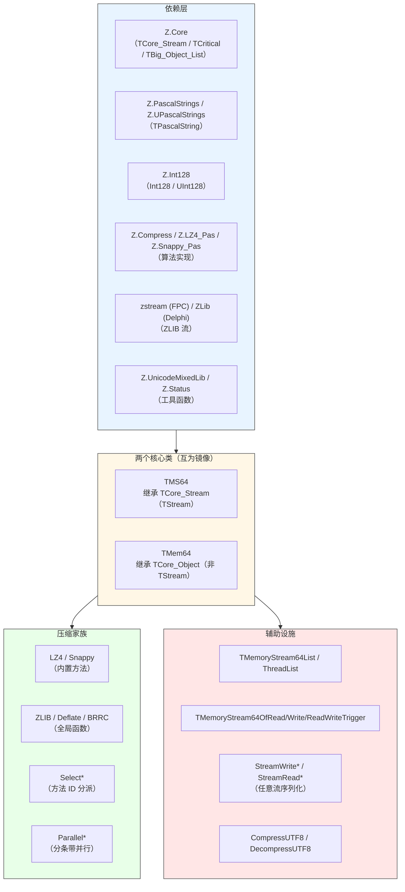
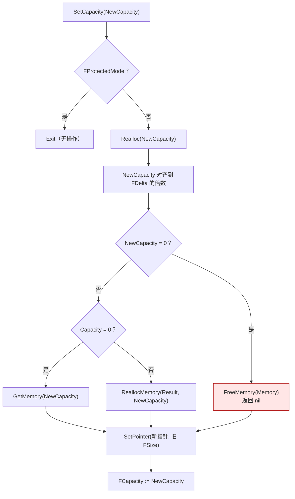
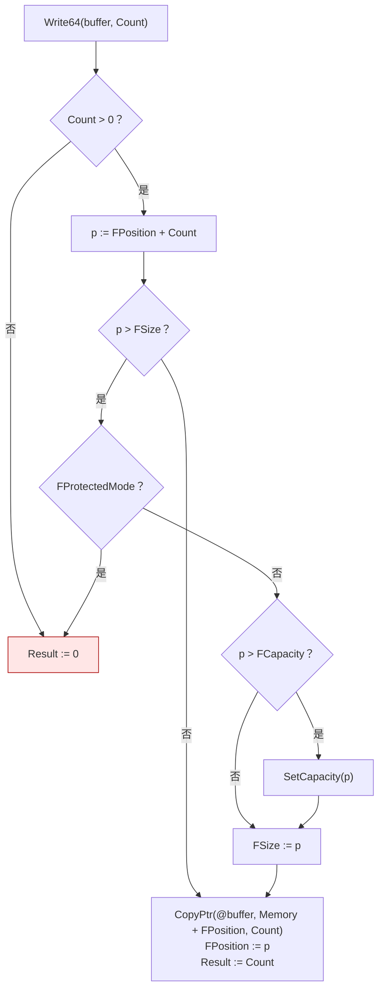
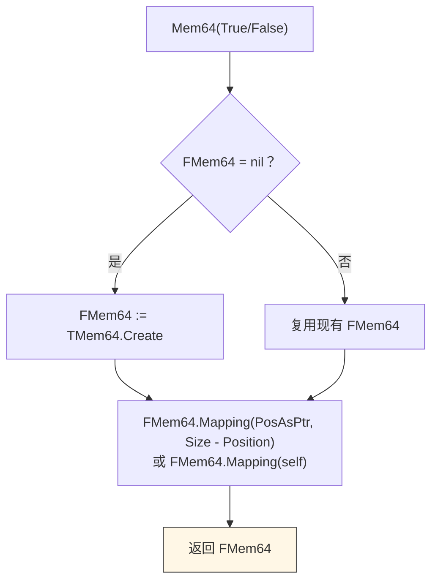
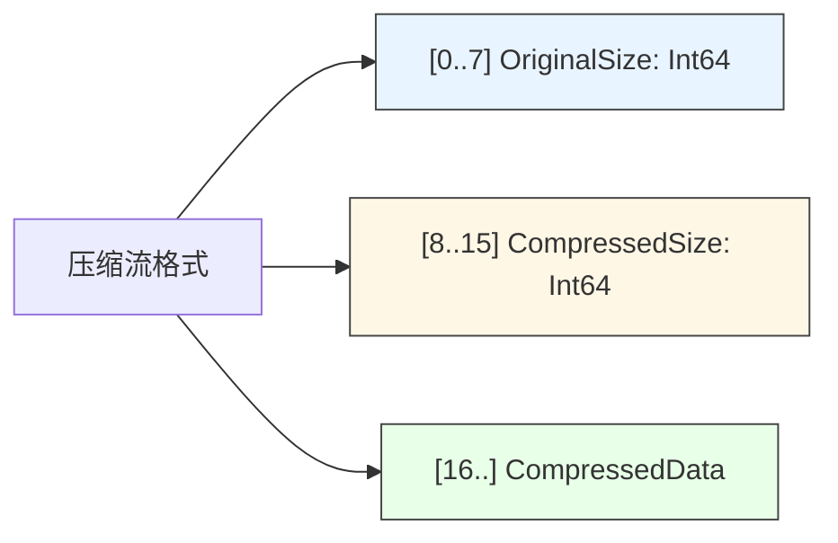
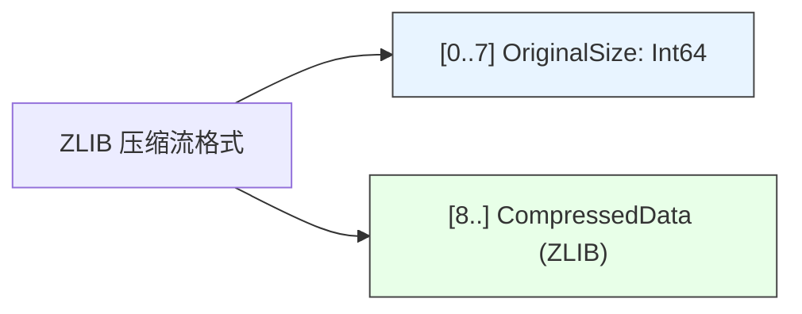
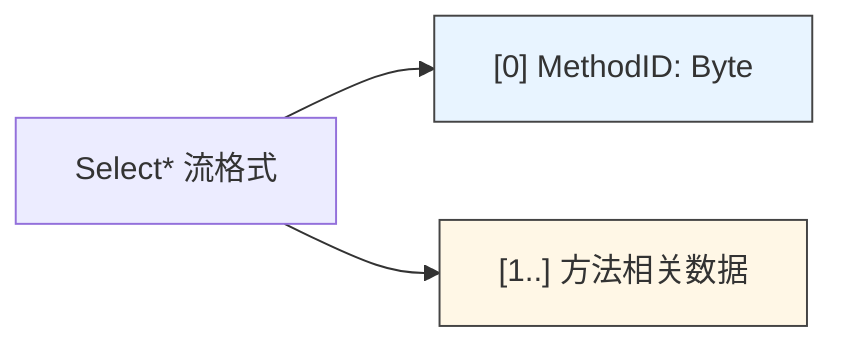
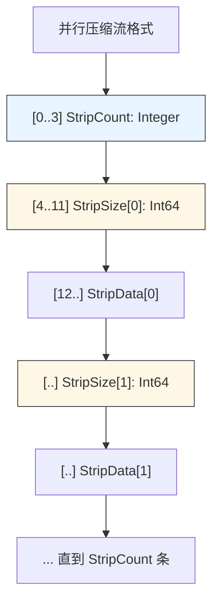
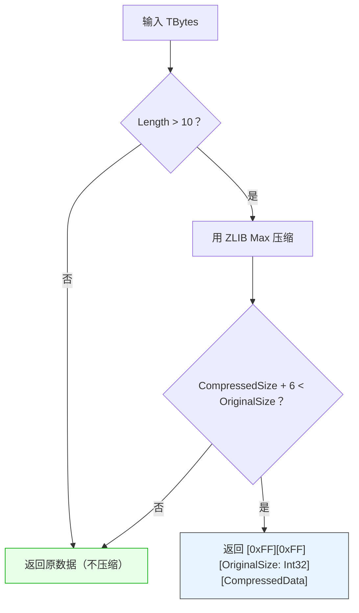
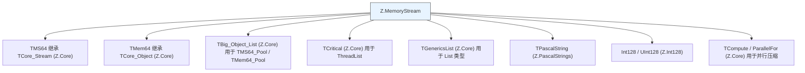

# Z.MemoryStream 知识库（最终传承版）

> **定位**：面向 AI 与人类工程师的权威参考。目标是让读者**无需翻阅源码**即可安全、准确地使用 `Z.MemoryStream`。
> **承诺**：所有描述均来自 `Z.MemoryStream.pas` 的逐行核对。凡我无法从源码确定的，在文末「诚实的不确定清单」中明示。
> **制图约定**：全文流程图/架构图/决策树一律使用 Mermaid，不使用字符制图。

---

## 第 0 章 快速定位：这个单元是什么

`Z.MemoryStream` 是 Z 框架的 **64 位内存流 + 压缩库**。它提供两个核心类（互为镜像），以及一整套压缩/序列化全局函数。



**核心能力**：

| 能力 | 说明 |
|------|------|
| 64 位寻址 | `NativeUInt`（`TMS64`）/ `Int64`（`TMem64`） |
| Delta 增量扩展 | 每次扩容按 `Delta` 对齐（64 到 1MB），减少 realloc 次数 |
| 零拷贝映射 | `Mapping` / `SetPointerWithProtectedMode` / `Create_Mapping_Instance` |
| 保护模式 | 映射后只读，写入静默失败 |
| 内置压缩 | `LZ4` / `UnLZ4` / `Snappy_Pas` / `UnSnappy_Pas` |
| 方法 ID 分派 | `SelectCompressStream` / `SelectDecompressStream` |
| 并行压缩 | 按条带切分，用 `TCompute` 并行处理 |
| 类型化序列化 | 30+ 种基本类型读写 |
| 触发接口 | `IMemoryStream64WriteTrigger` 等 |

---

## 第 1 章 常量与字段

### 1.1 关键字段（`TMS64` 与 `TMem64` 共享）

| 字段 | `TMS64` 类型 | `TMem64` 类型 | 语义 |
|------|--------------|---------------|------|
| `FDelta` | `NativeInt` | `NativeInt` | 扩容步长（clamp 到 `[64, 1MB]`） |
| `FMemory` | `Pointer` | `Pointer` | 缓冲区指针 |
| `FSize` | `NativeUInt` | `Int64` | 已使用字节数 |
| `FPosition` | `NativeUInt` | `Int64` | 当前位置 |
| `FCapacity` | `NativeUInt` | `Int64` | 已分配容量 |
| `FProtectedMode` | `Boolean` | `Boolean` | 是否只读映射 |
| `FMem64` / `FStream64` | `TMem64` / `TMS64` | 反向 | 缓存的映射对象 |

**⚠️ 关键差异**：`TMS64` 用 `NativeUInt`（无符号），`TMem64` 用 `Int64`（有符号）。两者都是 64 位，但符号性不同。

### 1.2 构造函数

```pascal
constructor TMS64.Create;                          // Delta = 256
constructor TMS64.CustomCreate(const customDelta: NativeInt);
constructor TMem64.Create;                          // Delta = 256
constructor TMem64.CustomCreate(const customDelta: NativeInt);
```

**契约**：
- `Create` 是 `CustomCreate(256)` 的别名。
- `SetDelta` 会 `umlClamp(Value, 64, 1024*1024)`——**传入值小于 64 会被提升到 64，大于 1MB 会被压到 1MB**。

---

## 第 2 章 `TMS64` 精确 API

### 2.1 内存管理

```pascal
procedure SetPointer(buffPtr: Pointer; const BuffSize: NativeUInt);   // protected
procedure SetCapacity(NewCapacity: NativeUInt);                       // protected
function  Realloc(var NewCapacity: NativeUInt): Pointer;              // protected virtual
procedure SetDelta(const Value: NativeInt);                           // protected
procedure DiscardMemory;
procedure Clear;
```

**`SetCapacity` 的执行链**：



**契约**：
- **`Realloc` 是 `virtual`**，子类可覆盖。
- **`Realloc` 会将 `NewCapacity` 对齐到 `FDelta` 倍数**（`DeltaStep`）。
- **`Realloc` 失败时 `RaiseInfo`**，不返回 nil（除 `NewCapacity=0`）。
- **`SetCapacity` 不改变 `FSize`**（只改容量）。

**`DiscardMemory` 契约**：
- **不调用 `FreeMemory`**！只是清空字段。
- 适用于：**外部拥有内存**，流只是引用它。
- **⚠️ 若内存是流自己分配的**，调用 `DiscardMemory` **会泄漏**。

**`Clear` 契约**：
- `SetCapacity(0)` + `FSize := 0` + `FPosition := 0`。
- **`FProtectedMode=True` 时无操作**。

### 2.2 流操作

```pascal
procedure LoadFromStream(stream: TCore_Stream); virtual;
procedure LoadFromFile(FileName: SystemString);
procedure SaveToStream(stream: TCore_Stream); virtual;
procedure SaveToFile(FileName: SystemString);
```

**`SaveToStream` 的特殊行为**：
- **目标若是 `TMS64`**：先 `Clear`，然后 `WritePtr(Memory, Size)`，再 `Position := 0`。
- **其他目标**：按 **64MB** 分块 `WriteBuffer`。

**`LoadFromStream` 契约**：
- `FProtectedMode` 时**静默退出**。
- `stream.Position := 0`（强制从头读）。
- 读取不匹配 `stream.Size` 时 `RaiseInfo`。

### 2.3 读写

```pascal
function Write64(const buffer; Count: Int64): Int64; virtual;
function WritePtr(const p: Pointer; Count: Int64): Int64;
function write(const buffer; Count: longint): longint; override;
procedure WriteBytes(const buff: TBytes);

function Read64(var buffer; Count: Int64): Int64; virtual;
function ReadPtr(const p: Pointer; Count: Int64): Int64;
function read(var buffer; Count: longint): longint; override;

function Seek(const Offset: Int64; origin: TSeekOrigin): Int64; override;
```

**`Write64` 的执行流程**：



**契约**：
- **`FProtectedMode` 时若需扩容，返回 0**；若不需扩容（写在已用区域内），**仍可写**。
- **`Seek` 不钳制**：`Position` 可以超过 `Size`，后续写入会创建间隙。

**`Read64` 契约**：
- 返回**实际读取字节数**（可能小于 `Count`）。
- 若 `FPosition > FSize`，返回 0（源码 `FSize - FPosition` 变为负数，`Result > 0` 为 False）。

### 2.4 克隆与映射

```pascal
function Mem64(Mapping_Begin_As_Position_: Boolean): TMem64;
function Mem64: TMem64;
function NewClone: TMS64;
function Create_Mapping_Instance: TMS64;
function Create_Mapping_Instance_Mem64: TMem64;
function Swap_To_New_Instance: TMS64;
```

**`Mem64` 缓存机制**：



**⚠️ 重大陷阱**：
- **返回的 `TMem64` 是缓存并复用的**。多次调用 `Mem64(True)` 与 `Mem64(False)` 会**覆盖**同一个 `TMem64`。
- **`TMS64` 析构时会释放 `FMem64`**，所以 `TMem64` 生命周期不超过 `TMS64`。

**`NewClone` 契约**：
- 深拷贝：`Result.Size := Size; CopyPtr(Memory, Result.Memory, Size);`
- **`Result.Position := Position`**（保留原位置）。

**`Create_Mapping_Instance` 契约**：
- **零拷贝**：新 `TMS64` 映射到同一缓冲区。
- 新实例为 `FProtectedMode=True`（只读）。
- **调用方必须保证原 `TMS64` 生命周期覆盖映射实例**。

**`Swap_To_New_Instance` 契约**：
- 创建一个空 `TMS64`，`SwapInstance` 后返回。
- 调用后 `Self` 变空，新实例持有原数据。

### 2.5 参数交换与复制

```pascal
procedure NewParam(source: TMS64); overload;
procedure NewParam(source: TMem64); overload;
procedure SwapInstance(source: TMS64); overload;
procedure SwapInstance(source: TMem64); overload;
```

**`NewParam` 契约**：
- **先 `Clear` 自己**（释放旧缓冲）。
- 复制 `FDelta / FMemory / FSize / FPosition / FCapacity / FProtectedMode`。
- **不复制**源的内容，只复制指针（浅拷贝 + 共享所有权）。

**⚠️ 注意**：`NewParam` 之后，两个对象指向同一内存。**两者都析构时 double-free**。

**`SwapInstance` 契约**：
- O(1) 交换所有字段（不含 `FMem64` / `FStream64` 缓存）。
- **不交换** `FMem64` / `FStream64`。

### 2.6 转换与比较

```pascal
function ToBytes: TBytes;
function ToMD5: TMD5;
function Same(source: TMem64): Boolean;
```

**`ToBytes`**：`SetLength(Result, Size); CopyPtr(Memory, @Result[0], Size);`

**`ToMD5`**：`umlMD5(Memory, Size)`（来自 `Z.UnicodeMixedLib`）。

**`Same` 契约**：
- **只接受 `TMem64` 参数**（不接受 `TMS64`）。
- 长度不同立即返回 False。
- 长度相同用 `CompareMemory` 比较。

### 2.7 压缩

```pascal
function LZ4: TMS64;
function UnLZ4: TMS64;
function Snappy_Pas: TMS64;
function UnSnappy_Pas: TMS64;
```

**压缩格式**（LZ4 / Snappy 共用）：



**`LZ4` 契约**：
- **`Result.Size` 先设为最坏情况 `LZ4_compressBound64(Size) + 16`**。
- 写入头（OriginalSize + CompressedSize）。
- 压缩后 `Result.Size := comp_size + 16`（收缩）。

**⚠️ 陷阱**：
- **空流调用 `LZ4`**：`Size=0`，压缩产生 16 字节头（OriginalSize=0）。
- **`UnLZ4` 未检查头部有效性**，若输入格式错误可能崩。

**`Snappy_Pas`**：纯 Pascal 实现（无 C 依赖），格式与 LZ4 相同。

### 2.8 映射

```pascal
procedure SetPointerWithProtectedMode(buffPtr: Pointer; const BuffSize: Int64);
procedure Mapping(buffPtr: Pointer; const BuffSize: Int64); overload;
procedure Mapping(m64: TMS64); overload;
procedure Mapping(m64: TMem64); overload;
```

**`Mapping` 契约**：
- **先 `Clear`**（释放旧缓冲，若不在保护模式）。
- 设置 `FMemory / FSize / FPosition=0 / FProtectedMode=True`。
- **不设置 `FCapacity`**——保留旧值。

**⚠️ 陷阱**：`Clear` 在保护模式下不释放。若在保护模式下调用 `Mapping`，旧缓冲**不会被释放**（这是正确行为，因为不属于你）。但 `FCapacity` 保留旧值，逻辑上不一致。

### 2.9 位置指针

```pascal
function PositionAsPtr(const Position_: Int64): Pointer; overload;
function PositionAsPtr: Pointer; overload;
function PosAsPtr(const Position_: Int64): Pointer; overload;
function PosAsPtr: Pointer; overload;
```

**契约**：全部是 `GetOffset(FMemory, Position)` 的别名。

### 2.10 类型化读写

**写入方法**（每个都调用 `WritePtr`）：

```pascal
procedure WriteBool(const buff: Boolean);        // 1 字节
procedure WriteInt8(const buff: ShortInt);       // 1 字节
procedure WriteInt16(const buff: SmallInt);      // 2 字节
procedure WriteInt32(const buff: Integer);       // 4 字节
procedure WriteInt64(const buff: Int64);         // 8 字节
procedure WriteInt128(const buff: Int128);       // 16 字节
procedure WriteUInt8(const buff: Byte);          // 1 字节
procedure WriteUInt16(const buff: Word);         // 2 字节
procedure WriteUInt32(const buff: Cardinal);     // 4 字节
procedure WriteUInt64(const buff: UInt64);       // 8 字节
procedure WriteUInt128(const buff: UInt128);     // 16 字节
procedure WriteSingle(const buff: Single);       // 4 字节
procedure WriteDouble(const buff: Double);       // 8 字节
procedure WriteCurrency(const buff: Currency);   // ⚠️ 见下
procedure WriteString(const buff: TPascalString); // ⚠️ 见下
procedure WriteANSI(const buff: TPascalString);          // ⚠️ 见下
procedure WriteANSI(const buff: TPascalString; const L: Integer);  // ⚠️ 见下
procedure WriteMD5(const buff: TMD5);            // 16 字节
```

**⚠️ `WriteCurrency` 的陷阱**：

```pascal
procedure TMS64.WriteCurrency(const buff: Currency);
begin
  WriteDouble(buff);   // 隐式 Currency → Double
end;

function TMS64.ReadCurrency: Currency;
begin
  Result := ReadDouble();   // 隐式 Double → Currency
end;
```

- **`Currency` 的二进制格式不是 IEEE 754**（是 Int64 × 10000 的定点数）。
- **写入时隐式转换为 `Double`**，读取时又转回。**往返兼容**但字节表示非标准。
- **与外部系统互操作时需注意**。

**`WriteString` 契约**：


**格式**：`[4 字节长度（UInt32）] + [UTF-8 字节]`。

**`WriteANSI` 契约**：
- **无长度前缀**（与 `WriteString` 不同）。
- `WriteANSI(buff)`：写全部 ANSI 字节。
- `WriteANSI(buff, L)`：**只写前 L 字节**。

**⚠️ `WriteANSI(buff, L)` 的陷阱**：

```pascal
procedure TMS64.WriteANSI(const buff: TPascalString; const L: Integer);
var
  b: TBytes;
begin
  b := buff.ANSI;
  if L > 0 then
    begin
      WritePtr(@b[0], L);   // ⚠️ 若 L > Length(b)，越界读取
      SetLength(b, 0);
    end;
end;
```

- **如果 `L > Length(b)`**，会读取 `b` 缓冲区之外的内存。
- **如果 `Length(b) = 0` 且 `L > 0`**，`@b[0]` 访问空数组的首地址，**未定义**。

**读取方法**：

```pascal
function ReadBool: Boolean;
function ReadInt8: ShortInt;
// ... 对称的 16 个基本类型
function PrepareReadString: Boolean;
function ReadString: TPascalString;
function ReadStringAsBuff: TBytes;
procedure IgnoreReadString;
function ReadANSI(L: Integer): TPascalString;
function ReadMD5: TMD5;
```

**⚠️ 类型化读取的静默失败**：
- **每个 `Read*` 不检查读取字节数**。
- 若流不足以提供字节，`ReadPtr` 会**部分读取**，返回值未被检查。
- **结果可能是垃圾值**。

**`PrepareReadString` 契约**：

```pascal
Result := (Position + 4 <= Size) and (Position + 4 + PCardinal(PositionAsPtr())^ <= Size);
```

- 先检查 4 字节长度头是否可读。
- 再检查字符串内容是否可读。

**`ReadString` 契约**：
- 读 4 字节长度。
- **`L = 0` 时返回空字符串**（不读内容）。
- **异常时返回 `''`**（`try...except`）。

**⚠️ 异常安全性**：`ReadString` 的 `except` 会吞掉异常，但**流位置可能已部分推进**。

**`ReadStringAsBuff`**：读长度 + 原始 UTF-8 字节，**不进行 UTF-8 解码**。

**`IgnoreReadString`**：读长度 + 跳过 L 字节内容（**仍读取**，只是丢弃）。

**`ReadANSI(L)`**：读 L 字节，按 `ANSI` 编码解释。

### 2.11 CopyFrom 与 CopyMem64

```pascal
function CopyMem64(const source: TMem64; Count: Int64): Int64;
function CopyFrom(const source: TCore_Stream; Count: Int64): Int64; overload;
function CopyFrom(const source: TMem64; Count: Int64): Int64; overload;
```

**`CopyFrom` 契约**：
- `Count < 0`：**先 `source.Position := 0`，然后 `Count := source.Size`**（从头发全量）。
- `Count = 0`：返回 0。
- **`source is TMS64`** 时**零拷贝**（`WritePtr(TMS64(source).PositionAsPtr, Count)`）。
- **其他流**：按 `$F000`（61440 字节）分块读取。
- **`FProtectedMode` 时 `RaiseInfo('protected mode')`**。

**⚠️ `CopyFrom(source, -1)` 会重置 `source.Position := 0`**——这一副作用必须知道。

### 2.12 属性

```pascal
property Delta: NativeInt read FDelta write SetDelta;
property ProtectedMode: Boolean read FProtectedMode;
property Memory: Pointer read FMemory;
property Capacity: NativeUInt read FCapacity write SetCapacity;   // protected
```

**⚠️ 无 `Size` / `Position` / `Position` 属性**！

`TMS64` 继承自 `TStream`，`Size` / `Position` 是 `TStream` 的属性（由 `Seek` 实现）：

```pascal
// TStream 内部
property Size: Int64 read GetSize write SetSize;
property Position: Int64 read GetPosition write SetPosition;
```

**`TMS64` 只重写了 `SetSize` 和 `Seek`**，`GetSize` / `GetPosition` 使用 `TStream` 的默认实现（通过 `Seek`）。

**推论**：
- `TMS64.Size` 通过 `Seek(0, soEnd)` 获得。
- `TMS64.Position` 通过 `Seek(0, soCurrent)` 获得。
- **每次读 `Size` 或 `Position` 都是一次 `Seek` 调用**。

---

## 第 3 章 `TMem64` 精确 API

**`TMem64` 是 `TMS64` 的镜像**，主要差异：

| 方面 | `TMS64` | `TMem64` |
|------|---------|----------|
| 基类 | `TCore_Stream`（TStream） | `TCore_Object` |
| `Size` / `Position` | 继承自 `TStream`（Int64） | 显式属性（Int64） |
| 内部字段 | `NativeUInt` | `Int64` |
| 缓存映射 | `FMem64: TMem64` | `FStream64: TMS64` |
| 映射方法 | `Mem64` | `Stream64` |
| 是否可作流参数 | ✅ 是 | ❌ 否（需 `Stream64` 包装） |

**`TMem64.GetSize` 契约**（源码）：

```pascal
function TMem64.GetSize: Int64;
var
  Pos_: Int64;
begin
  Pos_ := Seek(0, TSeekOrigin.soCurrent);
  Result := Seek(0, TSeekOrigin.soEnd);
  Seek(Pos_, TSeekOrigin.soBeginning);
end;
```

- **每次读 `Size` 都会：保存位置 → seek 到末尾 → 恢复位置**。

**`TMem64.Stream64` 契约**：
- 与 `TMS64.Mem64` 对称：**缓存并复用** `FStream64`。
- `Mapping_Begin_As_Position_=True` 时映射从当前位置开始。

**`TMem64` 没有 `Capacity` 公共属性**（只有 protected）。

---

## 第 4 章 辅助类

### 4.1 `TMemoryStream64List`

```pascal
TMemoryStream64List = class(TMemoryStream64List_Decl)   // TGenericsList<TMS64>
public
  procedure Clean;              // 释放所有流 + 清空
  function  To_Array: TMS64_Array;
end;
```

**契约**：
- **`Clean` 会 `DisposeObject` 每个流**，然后 `Clear`。
- **`To_Array` 返回动态数组，不影响列表**。

### 4.2 `TMemoryStream64ThreadList`

```pascal
TMemoryStream64ThreadList = class(TMemoryStream64List_Decl)
private
  FCritical: TCritical;
public
  AutoFree_Stream: Boolean;     // 默认 False
  constructor Create;
  destructor  Destroy; override;
  procedure Lock;
  procedure UnLock;
  procedure Remove(obj: TMS64);
  procedure Delete(index: Integer);
  procedure Clear;
  procedure Clean;
  function  To_Array: TMS64_Array;
end;
```

**契约**：
- `Create` 创建 `FCritical`，`AutoFree_Stream := False`。
- `AutoFree_Stream=True` 时：`Remove` / `Delete` / `Clear` 会 `DisposeObject`。
- **`Clean` 无论 `AutoFree_Stream` 如何都会释放**。
- **`Lock` / `UnLock` 手动控制**——`Add` / `Remove` 等**不会自动加锁**（继承自 `TGenericsList`）。

**⚠️ 使用方式**：

```pascal
List.Lock;
try
  List.Add(stream);
finally
  List.UnLock;
end;
```

### 4.3 触发接口

```pascal
IMemoryStream64WriteTrigger = interface
  procedure TriggerWrite64(Count: Int64);
end;

IMemoryStream64ReadTrigger = interface
  procedure TriggerRead64(Count: Int64);
end;

IMemoryStream64ReadWriteTrigger = interface
  procedure TriggerWrite64(Count: Int64);
  procedure TriggerRead64(Count: Int64);
end;

TMemoryStream64OfWriteTrigger     = class(TMS64)  ...;
TMemoryStream64OfReadTrigger      = class(TMS64)  ...;
TMemoryStream64OfReadWriteTrigger = class(TMS64)  ...;
```

**契约**：
- 触发在**读写后**调用。
- **若 `Trigger = nil`，跳过**（`if Assigned(Trigger) then`）。
- **不对 `WritePtr` / `ReadPtr` 自动触发**——只覆盖了 `Write64` / `Read64`。

### 4.4 流序列化辅助

```pascal
procedure StreamWriteBool(const stream: TCore_Stream; const buff: Boolean);
procedure StreamWriteInt8(const stream: TCore_Stream; const buff: ShortInt);
// ... 16 个基本类型 + Currency
procedure StreamWriteString(const stream: TCore_Stream; const buff: TPascalString);
procedure StreamWriteMD5(const stream: TCore_Stream; const buff: TMD5);
function  ComputeStreamWriteStringSize(buff: TPascalString): Integer;

function StreamReadBool(const stream: TCore_Stream): Boolean;
// ... 对称的读函数
function StreamReadString(const stream: TCore_Stream): TPascalString;
function StreamReadStringAsBuff(const stream: TCore_Stream): TBytes;
procedure StreamIgnoreReadString(const stream: TCore_Stream);
function StreamReadMD5(const stream: TCore_Stream): TMD5;
```

**契约**：
- 直接用 `stream.write` / `stream.read`（**32 位版**）。
- **`StreamWriteString` 格式与 `WriteString` 一致**（4 字节长度 + UTF-8）。
- **`StreamReadString` 有 `try...except`**。

**`ComputeStreamWriteStringSize`**：`4 + Length(buff.Bytes)`。

---

## 第 5 章 压缩全局函数

### 5.1 压缩方法枚举

```pascal
type
  TSelectCompressionMethod = (
    scmNone,           // 无压缩（仅存原始大小 + 数据）
    scmZLIB,           // ZLIB 默认压缩
    scmZLIB_Fast,      // ZLIB 最快
    scmZLIB_Max,       // ZLIB 最大
    scmDeflate,        // Deflate（来自 Z.Compress）
    scmBRRC,           // BRRC（来自 Z.Compress）
    scmLZ4,            // LZ4
    scmSnappy_Pas      // Snappy（纯 Pascal）
  );
```

### 5.2 基础压缩函数

```pascal
function MaxCompressStream(sour, dest: TCore_Stream): Boolean;
function FastCompressStream(sour, dest: TCore_Stream): Boolean;
function CompressStream(sour, dest: TCore_Stream): Boolean;
function DecompressStream(DataPtr: Pointer; siz: NativeInt; dest: TCore_Stream): Boolean; overload;
function DecompressStream(sour: TCore_Stream; dest: TCore_Stream): Boolean; overload;
function DecompressStreamToPtr(sour: TCore_Stream; var dest: Pointer): Boolean;
function CompressFile(sour, dest: SystemString): Boolean;
function DecompressFile(sour, dest: SystemString): Boolean;
```

**压缩格式**（ZLIB / Deflate / BRRC 共用）：



**契约**：
- **所有 ZLIB 系列函数写 8 字节原始大小到头部**。
- **空源时只写头部**（8 字节 0），不写压缩数据。
- **`DecompressStream` 从 `sour` 读 8 字节大小**，然后按此大小分配 `dest`。
- **`DecompressStreamToPtr` 分配的内存由调用方 `FreeMemory`**。
- **异常被 `try...except` 吞掉**，返回 False。

**⚠️ `CompressFile` / `DecompressFile` 的异常处理**：

```pascal
function CompressFile(sour, dest: SystemString): Boolean;
var
  s_fs, d_fs: TCore_FileStream;
begin
  s_fs := TCore_FileStream.Create(sour, fmOpenRead or fmShareDenyNone);   // ⚠️ 可能抛异常
  d_fs := TCore_FileStream.Create(dest, fmCreate);                        // ⚠️ 可能抛异常
  Result := CompressStream(s_fs, d_fs);
  DisposeObject(s_fs);
  DisposeObject(d_fs);
end;
```

- **文件打开失败会抛异常**，而不是返回 False。
- **`s_fs` 打开成功但 `d_fs` 打开失败**时，`s_fs` 会泄漏（因为 `d_fs := ...` 抛异常后 `s_fs` 未被释放）。

### 5.3 方法 ID 分派

```pascal
function SelectCompressStream(const scm: TSelectCompressionMethod; const sour, dest: TCore_Stream): Boolean;
function SelectDecompressStream(const sour, dest: TCore_Stream): Boolean; overload;
function SelectDecompressStream(const sour, dest: TCore_Stream; var scm: TSelectCompressionMethod): Boolean; overload;
```

**格式**：



**`SelectCompressStream` 契约**：
- 先写 1 字节方法 ID。
- 然后调用对应方法。
- **`scmNone` 时**：写 8 字节大小 + 原始数据。
- **`scmLZ4` / `scmSnappy_Pas` 时**：把 `sour` 映射/加载到临时 `TMS64`，压缩后写入 `dest`。

**`SelectDecompressStream` 契约**：
- 读 1 字节方法 ID。
- 分发到对应解压函数。
- **`scmNone` 时**：读 8 字节大小 + 复制数据。
- **`scmLZ4` / `scmSnappy_Pas` 时**：临时 `TMS64` 映射源，解压后写入 `dest`。

### 5.4 并行压缩

```pascal
procedure ParallelCompressMemory(const ThNum: Integer; const scm: TSelectCompressionMethod;
  const StripNum_: Integer; const sour: TMS64; const dest: TCore_Stream); overload;
procedure ParallelCompressMemory(const scm: TSelectCompressionMethod;
  const StripNum_: Integer; const sour: TMS64; const dest: TCore_Stream); overload;
procedure ParallelCompressMemory(const scm: TSelectCompressionMethod;
  const sour: TMS64; const dest: TCore_Stream); overload;
procedure ParallelCompressMemory(const sour: TMS64; const dest: TCore_Stream); overload;

procedure ParallelDecompressStream(const ThNum: Integer; const sour_, dest_: TCore_Stream); overload;
procedure ParallelDecompressStream(const sour_, dest_: TCore_Stream); overload;

procedure ParallelCompressFile(const sour, dest: SystemString);
procedure ParallelDecompressFile(const sour, dest: SystemString);
```

**输出格式**：



**`ParallelCompressMemory` 契约**：
- **`StripNum_ <= 0` 时 `StripNum := 1`**。
- 每条约 `sour.Size div StripNum` 字节（最后一条可能更短）。
- **条带用 `SetPointerWithProtectedMode` 映射源**（零拷贝）。
- **`ThNum < Length(StripArry)` 时串行**（源码 `if Length(StripArry) < ThNum` 判断，**逻辑看起来反了**）。

**⚠️ 源码可能的 bug**：

```pascal
if Length(StripArry) < ThNum then
  DoFor;   // 串行
else
  // 并行
```

**直觉上应该是 `Length(StripArry) >= ThNum` 才并行**（条带数多于线程数才有意义）。源码看起来相反。

**`ParallelCompressMemory(const scm, sour, dest)`**：`StripNum := sour.Size div (16 * 1024)`（16KB 一条）。
- **`sour.Size < 16KB` 时 `StripNum = 0`** → `ParallelCompressMemory` 内部 `StripNum := 1`。

**`ParallelCompressMemory(const sour, dest)`**：`scm = scmZLIB`。

**`ParallelDecompressStream` 契约**：
- **`sour_ is TMS64`**：用 `PositionAsPtr` 直接解析（零拷贝）。
- **其他流**：逐字节读。
- **`dest_` 是 `TMS64` 或普通流**：用 `write` 逐条写出。

### 5.5 UTF8 压缩

```pascal
function CompressUTF8(const sour_: TBytes): TBytes;
function DecompressUTF8(const sour_: TBytes): TBytes;
```

**格式**（有条件）：



**契约**：
- **压缩后若不比原始小，返回原始数据**（无头）。
- **有头时头部是 `$FF $FF` + 4 字节原始大小**。
- **`DecompressUTF8` 检查 `$FF $FF` 头**：有则解压，无则原样返回。

**⚠️ `CompressUTF8` 的 `Length > 10` 阈值**：
- 小于等于 10 字节的数据**永不压缩**。
- **这是有意为之**（压缩头开销大于收益）。

---

## 第 6 章 反例集

### 6.1 `DiscardMemory` 内存泄漏

```pascal
// ❌ 错误：用 DiscardMemory 释放自己分配的内存
var ms := TMS64.Create;
ms.WriteString('Hello');
ms.DiscardMemory;   // 内存泄漏！FMemory 置 nil 但未 FreeMemory
```

**✅ 正确**：用 `Clear` 或 `Free`。

**✅ `DiscardMemory` 的正确用法**：内存由外部拥有：

```pascal
var ms := TMS64.Create;
ms.SetPointerWithProtectedMode(ExternalBuffer, ExternalSize);
// ...
ms.DiscardMemory;   // 放弃引用，不释放外部内存（正确）
```

### 6.2 `NewParam` 双重释放

```pascal
// ❌ 错误：NewParam 后两个对象指向同一内存
var a, b: TMS64;
begin
  a := TMS64.Create;
  a.WriteString('data');
  b := TMS64.Create;
  b.NewParam(a);          // b 现在指向 a 的内存
  // ...
  a.Free;                 // 释放内存
  b.Free;                 // ❌ double-free
end;
```

**✅ 正确**：用 `SwapInstance`（交换所有权）或 `NewClone`（深拷贝）。

### 6.3 `WriteANSI(buff, L)` 越界

```pascal
// ❌ 错误：L 大于实际 ANSI 字节数
var s := TPascalString('AB');   // ANSI 2 字节
ms.WriteANSI(s, 10);            // 越界读取 8 字节！
```

**✅ 正确**：先检查 `Length(s.ANSI) >= L`。

### 6.4 `TMem64.GetSize` 的 O(1) 假设

```pascal
// ❌ 错误：在热循环中频繁读 Size
for i := 1 to N do
  Process(mem.Size);   // 每次都 seek 到末尾 + 恢复
```

**✅ 正确**：一次读入局部变量。

### 6.5 `TMS64.Mem64` 的缓存复用

```pascal
// ❌ 错误：持有 Mem64 返回值，稍后发现被覆盖
m1 := ms.Mem64(True);    // 从当前位置映射
m2 := ms.Mem64(False);   // 映射整个流
// m1 和 m2 指向同一个 TMem64 对象！
// m1 的内容已被 m2 覆盖
```

**✅ 正确**：不用 `Mem64`，用 `Create_Mapping_Instance_Mem64`（每次新对象）。

### 6.6 `CopyFrom(source, -1)` 重置位置

```pascal
// ❌ 错误：期望保留 source.Position
source.Position := 100;
ms.CopyFrom(source, -1);   // source.Position 被重置为 0！
```

**✅ 正确**：用 `source.Size` 显式指定，或复制后手动恢复。

### 6.7 `LZ4` / `UnLZ4` 格式不匹配

```pascal
// ❌ 错误：把外部 LZ4 数据当本库格式解压
ms.LoadFromFile('external.lz4');    // 外部 LZ4 无 16 字节头
ms.UnLZ4;                            // 崩或错乱
```

**✅ 正确**：本库 LZ4 格式有 **16 字节头**（OriginalSize + CompressedSize），不能与裸 LZ4 互换。

### 6.8 `SelectDecompressStream` 方法 ID 不匹配

```pascal
// ❌ 错误：用 SelectCompressStream 压缩，然后用 DecompressStream（不带方法 ID）解压
SelectCompressStream(scmLZ4, sour, dest);
// ...
DecompressStream(dest, output);   // ❌ DecompressStream 期望 ZLIB 格式
```

**✅ 正确**：`Select*` 与 `Select*` 配对使用。

### 6.9 `ParallelCompressMemory` 空输入

```pascal
// ⚠️ 空输入
var empty: TMS64;
ParallelCompressMemory(empty, dest);
// 内部：StripNum = 0 div (16*1024) = 0
// 然后 ParallelCompressMemory 内部把 StripNum 设为 1
// 再 BuildBuff 时 sour.Size = 0，strip_siz = 0
// while 循环会立即 break（因为 p + 0 < 0 为 False）
// 所以 StripArry 长度为 0
// 输出 StripCount = 0
```

**结论**：**空输入可正常工作**，输出 `StripCount = 0`。

### 6.10 `TMemoryStream64ThreadList` 未加锁访问

```pascal
// ❌ 错误：直接 Add 未加锁
ThreadList.Add(ms);   // 多线程下崩溃
```

**✅ 正确**：

```pascal
ThreadList.Lock;
try
  ThreadList.Add(ms);
finally
  ThreadList.UnLock;
end;
```

### 6.11 `TStream.Size` 对 `TMS64` 的隐式 `Seek`

```pascal
// ❌ 错误：期望 O(1)
while ms.Position < ms.Size do   // 每次比较都 Seek
  ms.ReadByte;
```

**✅ 正确**：缓存 `ms.Size`。

### 6.12 `WriteCurrency` 与 `WriteDouble` 的语义差异

```pascal
// ⚠️ 两者字节表示不同
ms.WriteCurrency(1.23);   // 隐式转换 1.23 → Double → 8 字节 IEEE 754
ms.WriteDouble(1.23);     // 8 字节 IEEE 754
// 上面两次写入字节相同！Currency 在写入时被转成 Double
```

**推论**：**`WriteCurrency` 只是 `WriteDouble` 的类型包装**，字节上无区别。读取同理。

### 6.13 `CompressFile` / `DecompressFile` 的异常与泄漏

```pascal
// ❌ 错误：源文件存在但目标路径不可写
CompressFile('src.dat', '/no/such/dir/dst.dat');
// s_fs 成功打开；d_fs := TCore_FileStream.Create(...) 抛异常
// s_fs 未被释放 → 文件句柄泄漏
```

**✅ 正确**：手动管理：

```pascal
s_fs := nil; d_fs := nil;
try
  s_fs := TCore_FileStream.Create(sour, fmOpenRead or fmShareDenyNone);
  d_fs := TCore_FileStream.Create(dest, fmCreate);
  Result := CompressStream(s_fs, d_fs);
finally
  DisposeObject(s_fs);
  DisposeObject(d_fs);
end;
```

### 6.14 `ReadString` 的静默失败

```pascal
// ⚠️ 流被截断
ms.Size := 3;   // 只有 3 字节，但 ReadString 期望 4 字节长度头
s := ms.ReadString;   // 返回 ''（异常被吞）
// 但流位置可能已部分推进
```

### 6.15 `Seek` 不钳制

```pascal
ms.Seek(1000000, soBeginning);   // Position = 1000000
ms.WriteString('x');             // 在位置 1000000 处写，创建大间隙
// Size 变成 1000005（间隙未初始化）
```

**✅ 正确**：确保 `Seek` 不越界，或手动填充间隙。

---

## 第 7 章 常见错误对照表

| 现象 | 根因 | 修正 |
|------|------|------|
| 内存泄漏 | 用 `DiscardMemory` 替代 `Clear` | 自分配内存用 `Clear` |
| Double-free | `NewParam` 后两对象共享内存 | 用 `SwapInstance` 或 `NewClone` |
| `WriteANSI` 越界崩 | `L > Length(buff.ANSI)` | 先检查长度 |
| `Mem64` 返回内容被覆盖 | `Mem64` 缓存并复用 | 用 `Create_Mapping_Instance_Mem64` |
| `CopyFrom(-1)` 后源位置变了 | 源码显式重置 `source.Position := 0` | 用显式 `Count` |
| `UnLZ4` 崩 | 数据无 16 字节头 | 确认是本库 LZ4 格式 |
| `SelectDecompressStream` 解压失败 | 与 `DecompressStream` 混用 | 用 `SelectCompressStream` 配对 |
| 多线程崩溃 | `TMemoryStream64ThreadList` 未加锁 | 显式 `Lock` / `UnLock` |
| `TMS64.Size` 慢 | `Size` 通过 `Seek` 实现 | 缓存到局部变量 |
| `Currency` 字节非标准 | 实际写的是 `Double` | 需精确格式时手动写入 |
| `CompressFile` 句柄泄漏 | `d_fs` 打开失败时未释放 `s_fs` | 用 `try...finally` |
| `ReadString` 返回空 | 流被截断或格式错 | 用 `PrepareReadString` 预检 |
| `ParallelCompress*` 性能差 | 源码 `if Length < ThNum` 分支疑似反了 | 手动指定 `ThNum` 调优 |
| `ParallelCompressMemory` 条带过小 | `Size < 16KB` 时 `StripNum = 0` | 手动指定 `StripNum_` |
| 空 `TMS64` 压缩后巨大 | LZ4/Snappy 仍写 16 字节头 | 已知行为 |
| `DoStatus` 输出十进制 | 源码 `IntToStr` 而非 `IntToHex` | 已知行为（注释误导） |

---

## 第 8 章 与 Z.Core 的衔接

### 8.1 类型依赖



### 8.2 类型别名速查

```pascal
TMS64_Array = array of TMS64;
TStream64_Array = TMS64_Array;
TMemoryStream64_Array = TMS64_Array;
TStream64 = TMS64;
TMemoryStream64 = TMS64;

TMemoryStream64List = TMemoryStream64List;   // 同上
TStream64List = TMemoryStream64List;
TMS64List = TMemoryStream64List;

TMS64_Pool = TBig_Object_List<TMS64>;

TStream64CriticalList = TMemoryStream64ThreadList;
TMS64CriticalList = TMemoryStream64ThreadList;
TStream64ThreadList = TMemoryStream64ThreadList;
TMS64ThreadList = TMemoryStream64ThreadList;

TMem64_Array = array of TMem64;
TM64 = TMem64;
TMem64List = TMem64List;
TM64List = TMem64List;
TMem64_Pool = TBig_Object_List<TMem64>;
```

### 8.3 线程安全

| 组件 | 线程安全 |
|------|---------|
| `TMS64` / `TMem64` 自身 | ❌ 否 |
| `TMemoryStream64List` | ❌ 否 |
| `TMemoryStream64ThreadList` | ⚠️ 部分（需手动 `Lock` / `UnLock`） |
| 压缩全局函数 | ✅ 是（无状态） |
| `Parallel*` 系列 | ✅ 是（内部并行） |
| `StreamWrite*` / `StreamRead*` | ❌ 否（依赖底层流） |

**建议**：**每个线程用独立的 `TMS64`**。若必须共享，用 `TCritical` 手动保护。

---

## 第 9 章 诚实的不确定清单

> 以下是我从源码**无法完全确定**的点。若 AI 需要在这些场景下工作，**必须回查源码或询问人类**。

1. **`ParallelCompressMemory` 的 `if Length(StripArry) < ThNum then DoFor` 语义**
   - 直觉上应该是 `Length(StripArry) >= ThNum` 时并行。
   - **不确定**：是否源码有 bug，还是我对"条带数 vs 线程数"的直觉错了。
   - **推测**：**可能是 bug**。当条带数 < 线程数时，串行反而浪费并行机会。

2. **`DoStatus` 重载的函数名与实现不一致**
   - 源码注释说"print as hex bytes"。
   - 实际用 `IntToStr(p^)`，是**十进制**。
   - **不确定**：是有意还是遗留 bug。
   - **推测**：可能是早期版本用十六进制，后来改成十进制但注释未更新。

3. **`WriteANSI(buff, L)` 的 `L > Length(b)` 行为**
   - 源码无边界检查。
   - **不确定**：是否会越界读取（推测是）。
   - **建议**：调用前自行检查。

4. **`TMS64.Mapping` 后 `FCapacity` 的值**
   - `Mapping` 不重置 `FCapacity`，保留旧值。
   - **不确定**：这是有意（保留分配信息）还是 bug。
   - **推测**：`FProtectedMode=True` 后 `SetCapacity` 无操作，所以 `FCapacity` 的实际值无所谓。

5. **`TMS64.DiscardMemory` 是否只用于外部内存**
   - 源码注释："Typically used when the buffer is owned externally"。
   - **不确定**：是否有其他用途。
   - **建议**：仅在明确外部拥有内存时使用。

6. **`WriteCurrency` 与 `WriteDouble` 的字节等价性**
   - 源码 `WriteCurrency` 调用 `WriteDouble(buff)`。
   - **不确定**：`Currency → Double → 8 字节` 是否总能往返。
   - **推测**：小数值可以，极大值可能精度损失。

7. **`TMS64.NewParam` 的所有权**
   - 源码复制 `FMemory` 指针，不复制内容。
   - **不确定**：谁负责释放 `FMemory`。
   - **推测**：**不明确**——两个 `TMS64` 都析构时会 double-free。**建议避免使用**。

8. **`TMemoryStream64ThreadList.Remove` 的行为**
   - 源码：`if AutoFree_Stream then DisposeObject(obj); inherited Remove(obj);`
   - **不确定**：`inherited Remove` 是 `TGenericsList.Remove`，它移除指定对象（不释放）。已确认。
   - **但注意**：**未加锁**。调用方必须自己 `Lock` / `UnLock`。

9. **`SelectCompressStream` 的异常处理**
   - `try...except` 吞掉异常。
   - **不确定**：`scmNone` 时 `dest.write` 失败返回 False，但 `sour.Position := 0` 是否执行。
   - **推测**：会执行（在 try 内）。

10. **`CompressFile` / `DecompressFile` 的句柄泄漏**
    - `d_fs := ...` 抛异常时 `s_fs` 未释放。
    - **不确定**：是否有意依赖 `TCore_FileStream` 的自动清理。
    - **推测**：**会泄漏**（`TCore_FileStream` 不自动释放）。

11. **`SelectDecompressStream` 的 `scmLZ4` 分支**
    - `tmpSour.Mapping(TMS64(sour).PosAsPtr, TMS64(sour).Size - TMS64(sour).Position)`。
    - **不确定**：若 `sour` 不是 `TMS64`，`CopyFrom(sour, sour.Size - sour.Position)` 是否会读入全部剩余数据。
    - **推测**：会，`CopyFrom` 从当前位置拷贝指定大小。

12. **`TMS64.SetSize(NewSize: longint)` 的截断行为**
    - 源码：`SetSize(Int64(NewSize))`。
    - **不确定**：在 32 位平台上，`longint` 是 32 位，转换成 `Int64` 时负数会被符号扩展。
    - **推测**：负数会传给 `SetSize(Int64)`，导致异常或未定义。

13. **`TMS64.PrepareReadString` 的短路求值**
    - `(Position + 4 <= Size) and (Position + 4 + PCardinal(PositionAsPtr())^ <= Size)`
    - **不确定**：FPC / Delphi 是否保证短路求值。
    - **推测**：默认开启（`$B-` 状态下短路）。

14. **`StreamReadString` 的异常吞掉**
    - `try...except` 吞异常。
    - **不确定**：`SetLength(b, L)` 抛 EOutOfMemory 时是否被正确捕获。
    - **推测**：会，但流位置可能已部分推进。

15. **`TMS64.ReadStringAsBuff` 与 `ReadString` 的等价性**
    - `ReadStringAsBuff` 读原始字节。
    - `ReadString` 读原始字节后 `Result.Bytes := b`。
    - **不确定**：`TPascalString.Bytes` 的赋值是否会改变流位置。
    - **推测**：不会（只是字节赋值）。

16. **`ParallelDecompressStream` 对 `TMS64` 源的位置影响**
    - `BuildBuff_Stream64` 解析后 `stream.Position := p`。
    - **不确定**：解析失败时 `stream.Position` 是否已改变。
    - **推测**：会（部分推进）。

17. **`TMS64.Write64` 对 `Count = 0` 的处理**
    - 源码：`if (Count > 0) then ...`。
    - **不确定**：`Count = 0` 时 `Result := 0` 是否是期望行为。
    - **推测**：是（不写任何东西）。

18. **`TMS64.Write64` 的 `p > 0` 检查**
    - `p := FPosition + Count; if p > 0 then ...`
    - **不确定**：`p <= 0` 的情况（`FPosition` 为巨大值 + 小 Count 溢出）。
    - **推测**：实际中不会触发（`NativeUInt` 溢出需极端情况）。

19. **`TMem64.Stream64` 与 `TMS64.Mem64` 的循环引用**
    - `A.Stream64` 返回 M，M 映射到 A。
    - `A.Mem64` 返回 M2，M2 映射到 A。
    - **不确定**：销毁顺序。
    - **推测**：`TMS64` 析构先释放 `FMem64`，`TMem64` 析构先释放 `FStream64`。无循环。

20. **`TMS64.LZ4` 对超大流的行为**
    - `LZ4_compressBound64(Size)` 对 `Size > 2GB` 是否有效。
    - **不确定**：`LZ4_compressBound64` 的 64 位支持。
    - **推测**：`LZ4_Pas` 是纯 Pascal 实现，支持 64 位。

21. **`TMS64.UnLZ4` 对损坏数据的鲁棒性**
    - 源码无校验。
    - **不确定**：损坏数据是否崩。
    - **推测**：**会崩**。使用前应校验数据完整性（如加 CRC）。

22. **`TMS64.SaveToStream` 对 `TMS64` 目标的特殊处理**
    - 源码：`TMS64(stream).Clear; ... TMS64(stream).Position := 0;`
    - **不确定**：若目标 `TMS64` 处于 `FProtectedMode`，`Clear` 无操作，但 `WritePtr` 会失败。
    - **推测**：会失败（`WritePtr` 在保护模式下返回 0）。

23. **`TMS64.SetPointer` 是否应该更新 `FCapacity`**
    - 源码不更新。
    - **不确定**：是否是设计缺陷。
    - **推测**：可能是为了方便 `Mapping` 时保留旧 `FCapacity` 值。

24. **`TMem64.GetSize` 的 `Seek` 是否影响 `FProtectedMode`**
    - `Seek` 不检查 `FProtectedMode`。
    - **不确定**：只读流是否能 `Seek`。
    - **推测**：能（`Seek` 只改 `FPosition`）。

---

## 第 10 章 结语

### 10.1 本知识库覆盖范围

- **已精确描述**：
  - `TMS64` / `TMem64` 的所有公开 API。
  - 字段布局、`SetCapacity` / `Realloc` / `SetDelta` 的执行链。
  - `Write64` / `Read64` / `Seek` 的边界行为。
  - `LZ4` / `Snappy` 的 16 字节头格式。
  - `Select*` 的方法 ID 分派。
  - `Parallel*` 的分条带格式。
  - `CompressUTF8` / `DecompressUTF8` 的 `$FF $FF` 头。
  - 触发接口、列表类、序列化辅助。

- **已纠正的常见幻觉**：
  - **`TMS64` 不定义 `Size` / `Position` 属性**，它们来自 `TStream`，通过 `Seek` 实现。
  - **`DiscardMemory` 不释放内存**（只是弃引用）。
  - **`NewParam` 是浅拷贝**，会导致 double-free。
  - **`Mem64` / `Stream64` 返回缓存并复用的对象**。
  - **`CopyFrom(source, -1)` 会重置 `source.Position := 0`**。
  - **`WriteCurrency` 实际写 `Double`**（字节等价）。
  - **`WriteANSI(buff, L)` 无边界检查**。
  - **`PrepareReadString` 存在短路求值依赖**。
  - **`ParallelCompressMemory` 的 `if Length < ThNum` 分支疑似反了**。
  - **`DoStatus` 实际输出十进制**（注释说十六进制）。
  - **`CompressFile` / `DecompressFile` 文件句柄可能泄漏**。
  - **`LZ4` 格式带 16 字节头**，与裸 LZ4 不兼容。

- **未覆盖**：
  - 源码中的 24 个不确定点。
  - `Z.Compress` / `Z.LZ4_Pas` / `Z.Snappy_Pas` 的内部实现。
  - 除 `Z.MemoryStream` 之外的单元。

### 10.2 给 AI 的使用规则

1. **`DiscardMemory` 只用于外部内存**；自分配用 `Clear` 或 `Free`。
2. **`NewParam` 危险**：两对象共享内存，会 double-free。用 `SwapInstance` 或 `NewClone`。
3. **`Mem64` / `Stream64` 返回缓存对象**：多次调用会覆盖。
4. **`CopyFrom(source, -1)` 会重置 `source.Position := 0`**。
5. **`WriteANSI(buff, L)` 前检查 `L <= Length(buff.ANSI)`**。
6. **`LZ4` / `Snappy` 格式带 16 字节头**，与外部格式不兼容。
7. **`Select*` 与 `Select*` 配对**；不要与 `CompressStream` / `DecompressStream` 混用。
8. **`TMS64.Size` / `Position` 每次访问都 `Seek`**；缓存到局部变量。
9. **`ReadString` 返回 `''` 时可能是流截断**；用 `PrepareReadString` 预检。
10. **`CompressFile` / `DecompressFile` 有句柄泄漏风险**；关键路径手动管理。
11. **多线程共享 `TMemoryStream64ThreadList` 需手动 `Lock` / `UnLock`**。
12. **遇到不确定清单里的场景，请查源码或问人**。

### 10.3 与 Z.Core / Z.PascalStrings / Z.Int128 的衔接

- `TMS64` 继承 `TCore_Stream`，可作任何流参数使用。
- `WriteString` / `ReadString` 使用 `TPascalString.Bytes`（UTF-8）。
- `Int128` / `UInt128` 使用 `.b[]` 数组（`Z.Int128`）。
- 压缩算法来自 `Z.Compress` / `Z.LZ4_Pas` / `Z.Snappy_Pas`。
- 使用本单元前，请先读 Z.Core 知识库第 1、2、5 章。

---

**本知识库的定位**：一份**准确的、有边界的、可操作的** `Z.MemoryStream` 参考。它不假装能替代源码，但能让你在 90% 的场景下正确使用，并在剩下 10% 的场景下知道该停下来问人。