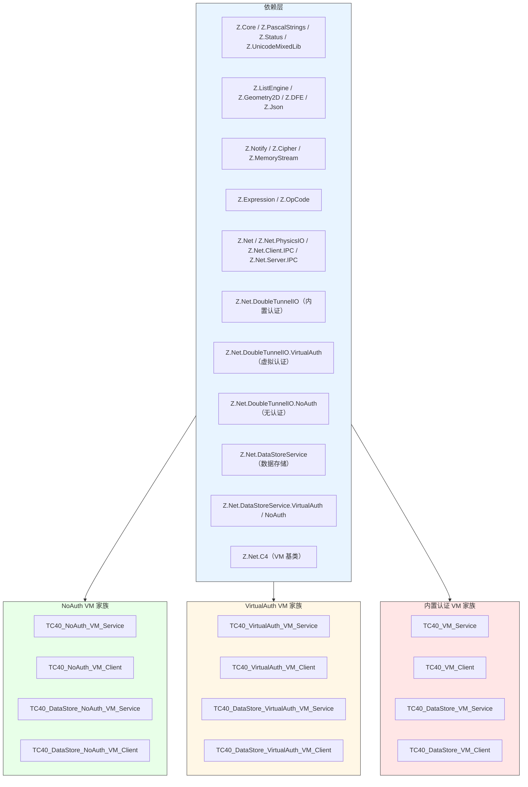
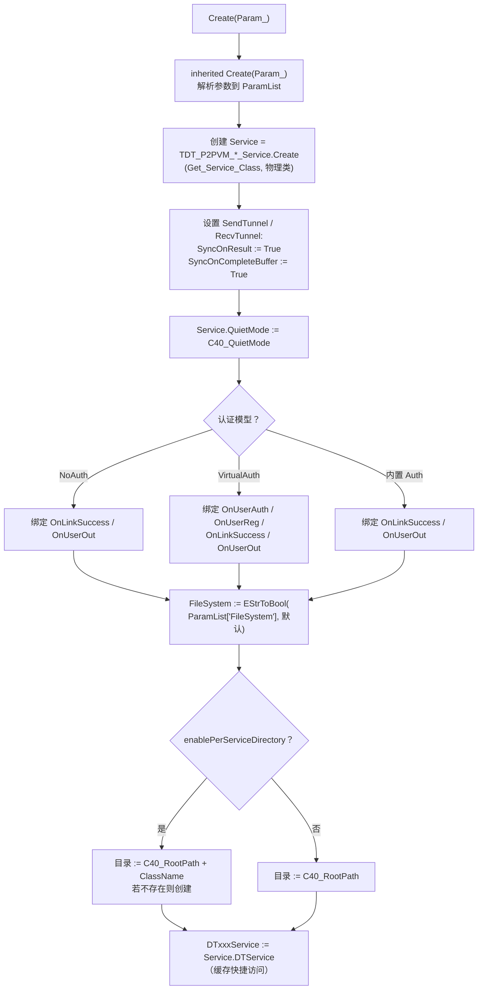
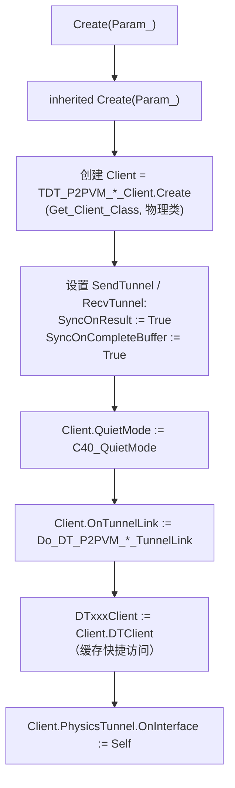
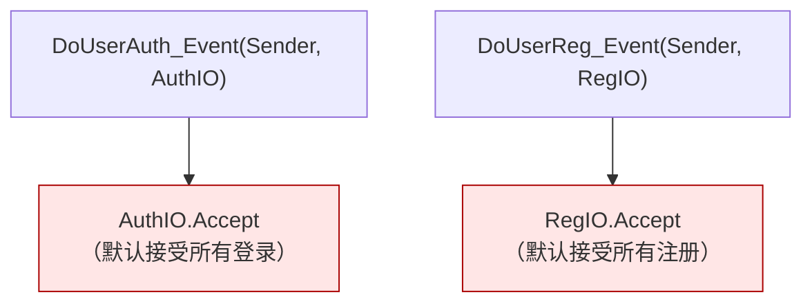
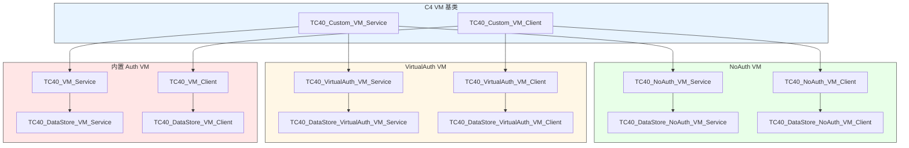
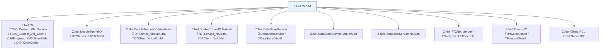

# Z.Net.C4.VM 知识库（最终传承版）

> **定位**：面向 AI 与人类工程师的权威参考。目标是让读者**无需翻阅源码**即可安全、准确地使用 `Z.Net.C4.VM`。
> **承诺**：所有描述均来自 `Z.Net.C4.VM.pas` 的逐行核对。凡我无法从源码确定的，在文末「诚实的不确定清单」中明示。
> **制图约定**：全文流程图/架构图/决策树一律使用 Mermaid，不使用字符制图。

---

## 第 0 章 快速定位：这个单元是什么

`Z.Net.C4.VM` 是 Z 框架中 **C4 分布式服务框架**的**"虚拟机"（VM）风格封装层**。它把 `Z.Net.C4` 中物理服务/隧道与逻辑服务/客户端的复杂装配过程，包装成**可直接 Start/Stop 的独立 VM 组件**，让开发者只需关注"启动一个 VM 服务/连接一个 VM 客户端"。



**核心价值**：

| 价值 | 说明 |
|------|------|
| 简化 C4 装配 | 把 `PhysicsTunnel` + `RecvTunnel` + `SendTunnel` + `DTService` + `P2PVM` 一体化封装 |
| 统一 Start/Stop 接口 | `StartService(ListenAddr, ListenPort, Auth)` 一键启动 |
| 三套认证模型 | NoAuth / VirtualAuth / 内置 Auth 一应俱全 |
| DataStore 扩展 | 每个认证模型都有对应的 DataStore 版本，直接获得 ZDB 远程数据库能力 |
| 目录自动管理 | `enablePerServiceDirectory=True` 时，每个服务独立目录 |
| 与 C4 全局池集成 | 自动加入 `C40_ServicePool` / `C40_ClientPool` 等 |

**它不是**：
- **不是**替代 `Z.Net.C4` 的东西——它是 `Z.Net.C4` 的**高层封装**，底层仍依赖 C4 的物理服务/隧道与逻辑服务/客户端。
- **不是**线程安全的（所有操作在主线程）。
- **不是**自带 UI 的——它只是服务端/客户端的封装，需要外部驱动 `Progress`。

**三大认证模型对照**：

| 模型 | 基类 | 服务端类 | 客户端类 | 认证方式 |
|------|------|---------|---------|---------|
| **NoAuth** | `TDTService_NoAuth` | `TC40_NoAuth_VM_Service` | `TC40_NoAuth_VM_Client` | 无认证 |
| **VirtualAuth** | `TDTService_VirtualAuth` | `TC40_VirtualAuth_VM_Service` | `TC40_VirtualAuth_VM_Client` | 应用层回调 |
| **内置 Auth** | `TDTService` | `TC40_VM_Service` | `TC40_VM_Client` | 内置用户数据库 |

每个模型都有对应的 **DataStore 版本**（`TC40_DataStore_*_VM_*`），底层使用 `TDataStore*` 类，直接获得 ZDB 数据库远程访问能力。

---

## 第 1 章 共享基础设施

### 1.1 从 `TC40_Custom_VM_Service` 继承的字段

所有 VM 服务类都继承自 `TC40_Custom_VM_Service`，共享以下字段（来自 `Z.Net.C4`）：

| 字段 | 类型 | 语义 |
|------|------|------|
| `Param` | `U_String` | 原始参数字符串 |
| `ParamList` | `THashStringList` | 参数键值表（自动解析） |
| `Param_File` | `U_String` | 参数文件名 |
| `SafeCheckTime` | `TTimeTick` | SafeCheck 间隔 |
| `Tag` | `Integer` | 用户标签 |
| `ServiceInfo` | `TC40_Info` | 服务元数据 |
| `C40PhysicsService` | `TC40_PhysicsService` | 所属物理服务 |
| `ConsoleCommand` | `TC4_Help_Console_Command` | 控制台命令 |
| `enablePerServiceDirectory` | `Boolean` | 是否使用独立目录 |
| `Alias_or_Hash___` | `U_String` | 别名或 Hash |

**虚方法**：`DoLinkSuccess` / `DoUserOut` 由基类调用，子类重写以通知。

### 1.2 从 `TC40_Custom_VM_Client` 继承的字段

所有 VM 客户端类都继承自 `TC40_Custom_VM_Client`，共享以下字段：

| 字段 | 类型 | 语义 |
|------|------|------|
| `Param` / `ParamList` | `U_String` / `THashStringList` | 参数 |
| `Tag` | `Integer` | 用户标签 |
| `ClientInfo` | `TC40_Info` | 客户端元数据 |
| `C40PhysicsTunnel` | `TC40_PhysicsTunnel` | 所属物理隧道 |
| `ConsoleCommand` | `TC4_Help_Console_Command` | 控制台命令 |
| `On_Client_Offline` | `TOn_Client_Offline` | 离线回调 |

**虚方法**：`DoNetworkOnline` / `DoNetworkOffline` 由子类调用。

### 1.3 全局变量引用

| 变量 | 类型 | 用途 |
|------|------|------|
| `C40_QuietMode` | `Boolean` | 是否安静模式 |
| `C40_RootPath` | `U_String` | C4 根目录 |
| `C40_PhysicsClientClass` | `TZNet_ClientClass` | 默认物理客户端类（`TPhysicsClient`） |
| `IPC_Mode` | `Boolean` | 是否使用 IPC 模式 |

### 1.4 物理隧道类选择

```pascal
TIF<TZNet_ServerClass>.Do_(IPC_Mode, TZNet_Server_IPC, TPhysicsServer)
TIF<TZNet_ClientClass>.Do_(IPC_Mode, TZNet_Client_IPC, C40_PhysicsClientClass)
```

**契约**：
- `IPC_Mode=True`：使用 `TZNet_Server_IPC` / `TZNet_Client_IPC`（进程内 IPC）。
- `IPC_Mode=False`：使用 `TPhysicsServer` / `C40_PhysicsClientClass`（TCP/IP）。

### 1.5 通用构造流程（所有 VM 服务）



### 1.6 通用构造流程（所有 VM 客户端）



**关键契约**：
- **`Client.PhysicsTunnel.OnInterface := Self`** 使物理客户端的连接/断开事件回调到 VM 客户端的 `ClientConnected` / `ClientDisconnect`。
- **`OnTunnelLink` 回调触发 `DoNetworkOnline`**（P2PVM 双隧道链接建立后）。
- **`ClientDisconnect` 触发 `DoNetworkOffline`**（物理断开时）。

---

## 第 2 章 NoAuth VM 家族

### 2.1 `TC40_NoAuth_VM_Service`

```pascal
TC40_NoAuth_VM_Service = class(TC40_Custom_VM_Service)
protected
  procedure DoLinkSuccess_Event(Sender: TDTService_NoAuth; UserDefineIO: TService_RecvTunnel_UserDefine_NoAuth); virtual;
  procedure DoUserOut_Event(Sender: TDTService_NoAuth; UserDefineIO: TService_RecvTunnel_UserDefine_NoAuth); virtual;
public
  Service: TDT_P2PVM_NoAuth_Service;
  DTNoAuthService: TDTService_NoAuth;
  property DTNoAuth: TDTService_NoAuth read DTNoAuthService;
  class function Get_Service_Class: TDTService_NoAuthClass; virtual;
  constructor Create(Param_: U_String); override;
  destructor Destroy; override;
  procedure Progress; override;
  procedure StartService(ListenAddr, ListenPort, Auth: SystemString); override;
  procedure StopService; override;
end;
```

**`Get_Service_Class` 契约**：返回 `TDTService_NoAuth`。子类可重写为 DataStore 版本。

**`DoLinkSuccess_Event` / `DoUserOut_Event`**：转发到 `DoLinkSuccess(UserDefineIO)` / `DoUserOut(UserDefineIO)`（基类方法）。

**`Create` 契约**：
- 创建 `TDT_P2PVM_NoAuth_Service`。
- 设置 `SyncOnResult` / `SyncOnCompleteBuffer`。
- **只绑定 `OnLinkSuccess` / `OnUserOut`**（无认证回调）。
- `FileSystem` 从 `ParamList` 读，默认继承 `Service.DTService.FileSystem`。
- 目录：`enablePerServiceDirectory=True` → `C40_RootPath\ClassName`，否则 `C40_RootPath`。

**`StartService`**：直接转发到 `Service.StartService`。

**`StopService`**：直接转发到 `Service.StopService`。

**`Progress`**：`inherited Progress` → `Service.Progress`。

**`Destroy`**：`StopService` → `disposeObject(Service)` → `inherited Destroy`。

### 2.2 `TC40_NoAuth_VM_Client`

```pascal
TC40_NoAuth_VM_Client = class(TC40_Custom_VM_Client, IZNet_ClientInterface)
protected
  procedure ClientConnected(Sender: TZNet_Client); virtual;   // 空实现
  procedure ClientDisconnect(Sender: TZNet_Client); virtual;  // → DoNetworkOffline
  procedure Do_DT_P2PVM_NoAuth_Custom_Client_TunnelLink(Sender: TDT_P2PVM_NoAuth_Client); virtual;  // → DoNetworkOnline
public
  Client: TDT_P2PVM_NoAuth_Client;
  DTNoAuthClient: TDTClient_NoAuth;
  property DTNoAuth: TDTClient_NoAuth read DTNoAuthClient;
  class function Get_Client_Class: TDTClient_NoAuthClass; virtual;
  constructor Create(Param_: U_String); override;
  destructor Destroy; override;
  procedure Progress; override;
  procedure Connect(addr, Port, Auth: SystemString);
  procedure Connect_C/M/P(addr, Port, Auth: SystemString; OnResult: TOnState_C/M/P);
  function Connected: Boolean; override;
  procedure Disconnect; override;
end;
```

**`Connected`**：`Result := Client.DTClient.LinkOk`。

**`Create` 契约**：
- 创建 `TDT_P2PVM_NoAuth_Client`。
- 绑定 `OnTunnelLink` → `Do_DT_P2PVM_NoAuth_Custom_Client_TunnelLink`。
- `Client.PhysicsTunnel.OnInterface := Self`。
- **客户端不设置 `FileSystem`**（由服务端在 `TunnelLink` 响应中告知）。

**`Destroy`**：
- `Client.PhysicsTunnel.OnInterface := nil`。
- `Client.Disconnect`。
- `disposeObject(Client)`。

### 2.3 `TC40_DataStore_NoAuth_VM_Service` / `Client`

**服务端**：
- 重写 `Get_Service_Class` 为 `TDataStoreService_NoAuth`。
- `DT_DataStore_NoAuth` 属性返回 `DTNoAuthService as TDataStoreService_NoAuth`。

**客户端**：
- 重写 `Get_Client_Class` 为 `TDataStoreClient_NoAuth`。
- `DT_DataStore_NoAuth` 属性返回 `DTNoAuthClient as TDataStoreClient_NoAuth`。

**使用方式**：不需要额外代码，直接实例化 `TC40_DataStore_NoAuth_VM_Service` 即可获得 DataStore 能力。

---

## 第 3 章 VirtualAuth VM 家族

### 3.1 `TC40_VirtualAuth_VM_Service`

```pascal
TC40_VirtualAuth_VM_Service = class(TC40_Custom_VM_Service)
protected
  procedure DoUserReg_Event(Sender: TDTService_VirtualAuth; RegIO: TVirtualRegIO); virtual;   // 默认 Accept
  procedure DoUserAuth_Event(Sender: TDTService_VirtualAuth; AuthIO: TVirtualAuthIO); virtual; // 默认 Accept
  procedure DoLinkSuccess_Event(Sender: TDTService_VirtualAuth; UserDefineIO: TService_RecvTunnel_UserDefine_VirtualAuth); virtual;
  procedure DoUserOut_Event(Sender: TDTService_VirtualAuth; UserDefineIO: TService_RecvTunnel_UserDefine_VirtualAuth); virtual;
public
  Service: TDT_P2PVM_VirtualAuth_Service;
  DTVirtualAuthService: TDTService_VirtualAuth;
  property DTVirtualAuth: TDTService_VirtualAuth read DTVirtualAuthService;
  class function Get_Service_Class: TDTService_VirtualAuthClass; virtual;
  ...
end;
```

**默认认证行为**：



**⚠️ 关键警告**：
- **默认实现是无条件 `Accept`**——任何客户端都可以登录/注册。
- **生产环境必须重写 `DoUserAuth_Event` / `DoUserReg_Event`**，加入真实认证逻辑。
- 重写方式：
  - **子类化** `TC40_VirtualAuth_VM_Service`，覆盖 `DoUserAuth_Event` / `DoUserReg_Event`。
  - 或直接操作 `Service.DTService.OnUserAuth`（但会覆盖 VM 层的绑定）。

**`Create` 契约**：
- 创建 `TDT_P2PVM_VirtualAuth_Service`。
- 绑定 `OnUserAuth := DoUserAuth_Event` / `OnUserReg := DoUserReg_Event` / `OnLinkSuccess` / `OnUserOut`。
- `FileSystem` / 目录逻辑与 NoAuth 相同。

**认证覆盖建议**：

```pascal
type
  TMyAuthVMService = class(TC40_VirtualAuth_VM_Service)
  protected
    procedure DoUserAuth_Event(Sender: TDTService_VirtualAuth; AuthIO: TVirtualAuthIO); override;
  end;

procedure TMyAuthVMService.DoUserAuth_Event(Sender: TDTService_VirtualAuth; AuthIO: TVirtualAuthIO);
begin
  if CheckUserInDatabase(AuthIO.UserID, AuthIO.Passwd) then
    AuthIO.Accept
  else
    AuthIO.Reject;
end;
```

### 3.2 `TC40_VirtualAuth_VM_Client`

**与 `TC40_NoAuth_VM_Client` 结构相同**，但 `Connect` 系列多两个参数（`User` / `Passwd`）：

```pascal
procedure Connect(addr, Port, Auth, User, Passwd: SystemString);
procedure Connect_C/M/P(addr, Port, Auth, User, Passwd: SystemString; OnResult);
```

**`Connected`**：`Client.DTClient.LinkOk`。

### 3.3 `TC40_DataStore_VirtualAuth_VM_Service` / `Client`

**服务端**：`Get_Service_Class` 返回 `TDataStoreService_VirtualAuth`；`DT_DataStore_VirtualAuth` 属性返回 `DTVirtualAuthService as TDataStoreService_VirtualAuth`。

**客户端**：`Get_Client_Class` 返回 `TDataStoreClient_VirtualAuth`；`DT_DataStore_VirtualAuth` 属性返回 `DTVirtualAuthClient as TDataStoreClient_VirtualAuth`。

---

## 第 4 章 内置认证 VM 家族

### 4.1 `TC40_VM_Service`

```pascal
TC40_VM_Service = class(TC40_Custom_VM_Service)
protected
  procedure DoLinkSuccess_Event(Sender: TDTService; UserDefineIO: TService_RecvTunnel_UserDefine); virtual;
  procedure DoUserOut_Event(Sender: TDTService; UserDefineIO: TService_RecvTunnel_UserDefine); virtual;
public
  Service: TDT_P2PVM_Service;
  DTVirtualAuthService: TDTService;    // ⚠️ 命名有歧义
  property DTVirtualAuth: TDTService read DTVirtualAuthService;
  class function Get_Service_Class: TDTServiceClass; virtual;
  ...
end;
```

**⚠️ 命名陷阱**：
- **`DTVirtualAuthService` 字段名是 `DTVirtualAuth`，但类型是 `TDTService`（内置认证）**，不是 `TDTService_VirtualAuth`。
- 这是**源码中的命名 bug**（历史遗留），用户需注意。
- **属性 `DTVirtualAuth` 实际访问的是内置认证服务**。

**`Create` 契约**：
- 创建 `TDT_P2PVM_Service`。
- 绑定 `OnLinkSuccess` / `OnUserOut`（无自定义认证回调）。
- **`enablePerServiceDirectory=True` 时**：
  - `RootPath := C40_RootPath + ClassName`
  - `PublicPath := RootPath`
- **否则**：
  - `RootPath := C40_RootPath`
  - `PublicPath := RootPath`

**内置认证逻辑**：由 `TDTService` 内部实现（用户数据库 `User.Config` + `User.DB`），无需应用层回调。

### 4.2 `TC40_VM_Client`

```pascal
TC40_VM_Client = class(TC40_Custom_VM_Client, IZNet_ClientInterface)
public
  Client: TDT_P2PVM_Client;
  DTVirtualAuthClient: TDTClient;    // ⚠️ 命名有歧义
  property DTVirtualAuth: TDTClient read DTVirtualAuthClient;
  ...
  procedure Connect(addr, Port, Auth, User, Passwd: SystemString);
  procedure Connect_C/M/P(...);
end;
```

**`Connect`**：与 VirtualAuth 客户端相同（需提供 User/Passwd）。

### 4.3 `TC40_DataStore_VM_Service` / `Client`

**服务端**：`Get_Service_Class` 返回 `TDataStoreService`；`DT_DataStore` 属性返回 `DTVirtualAuthService as TDataStoreService`。

**客户端**：`Get_Client_Class` 返回 `TDataStoreClient`；`DT_DataStore` 属性返回 `DTVirtualAuthClient as TDataStoreClient`。

---

## 第 5 章 完整类层次



---

## 第 6 章 完整使用范式

### 6.1 最小 NoAuth VM 服务

```pascal
uses Z.Net.C4.VM, Z.Net.C4, Z.Net.PhysicsIO;

var
  VMService: TC40_NoAuth_VM_Service;
begin
  VMService := TC40_NoAuth_VM_Service.Create('FileSystem=True');
  try
    VMService.StartService('0.0.0.0', '9810', '');
    while True do
      begin
        C40Progress(10);
        VMService.Progress;
        Sleep(1);
      end;
  finally
    VMService.Free;
  end;
end;
```

### 6.2 最小 NoAuth VM 客户端

```pascal
var
  VMClient: TC40_NoAuth_VM_Client;
begin
  VMClient := TC40_NoAuth_VM_Client.Create('');
  try
    VMClient.Connect_M('127.0.0.1', '9810', '',
      procedure(State: Boolean)
      begin
        if State then
          WriteLn('已连接');
      end);
    while True do
      begin
        C40Progress(10);
        VMClient.Progress;
        Sleep(1);
      end;
  finally
    VMClient.Free;
  end;
end;
```

### 6.3 VirtualAuth VM 服务（自定义认证）

```pascal
type
  TMyAuthVMService = class(TC40_VirtualAuth_VM_Service)
  protected
    procedure DoUserAuth_Event(Sender: TDTService_VirtualAuth; AuthIO: TVirtualAuthIO); override;
  end;

procedure TMyAuthVMService.DoUserAuth_Event(Sender: TDTService_VirtualAuth; AuthIO: TVirtualAuthIO);
begin
  // 自定义认证逻辑
  if (AuthIO.UserID = 'admin') and (AuthIO.Passwd = 'secret') then
    AuthIO.Accept
  else
    AuthIO.Reject;
end;

var
  VMService: TMyAuthVMService;
begin
  VMService := TMyAuthVMService.Create('');
  VMService.StartService('0.0.0.0', '9810', 'p2pAuthToken');
end;
```

### 6.4 VirtualAuth VM 客户端

```pascal
var
  VMClient: TC40_VirtualAuth_VM_Client;
begin
  VMClient := TC40_VirtualAuth_VM_Client.Create('');
  VMClient.Connect_M('127.0.0.1', '9810', 'p2pAuthToken', 'admin', 'secret',
    procedure(State: Boolean)
    begin
      if State then WriteLn('登录成功');
    end);
end;
```

### 6.5 DataStore NoAuth VM（远程数据库）

```pascal
// 服务端
var
  VMService: TC40_DataStore_NoAuth_VM_Service;
begin
  VMService := TC40_DataStore_NoAuth_VM_Service.Create('');
  VMService.StartService('0.0.0.0', '9810', '');
end;

// 客户端
var
  VMClient: TC40_DataStore_NoAuth_VM_Client;
begin
  VMClient := TC40_DataStore_NoAuth_VM_Client.Create('');
  VMClient.Connect_M('127.0.0.1', '9810', '',
    procedure(State: Boolean)
    begin
      if State then
        begin
          // 使用 DataStore 客户端
          VMClient.DT_DataStore_NoAuth.InitDB(True, 'MyDB');
          // ... 更多操作
        end;
    end);
end;
```

### 6.6 DataStore 内置认证 VM

```pascal
var
  VMService: TC40_DataStore_VM_Service;
  VMClient: TC40_DataStore_VM_Client;
begin
  // 服务端
  VMService := TC40_DataStore_VM_Service.Create('');
  VMService.DTVirtualAuth.AllowRegisterNewUser := True;
  VMService.DTVirtualAuth.AllowSaveUserInfo := True;
  VMService.StartService('0.0.0.0', '9810', 'p2pAuthToken');

  // 客户端
  VMClient := TC40_DataStore_VM_Client.Create('');
  VMClient.Connect_M('127.0.0.1', '9810', 'p2pAuthToken', 'alice', 'password',
    procedure(State: Boolean)
    begin
      if State then
        begin
          VMClient.DT_DataStore.InitDB(True, 'MyDB');
        end;
    end);
end;
```

### 6.7 与 C4 全局池的集成

所有 VM 服务/客户端**自动加入 C4 全局池**（由基类 `TC40_Custom_VM_Service` / `TC40_Custom_VM_Client` 实现）：

```pascal
// 服务端在 C40_VM_Service_Pool 中
// 客户端在 C40_VM_Client_Pool 中
```

**可以通过 `TC40_Console_Help` 的 `service` / `client` 命令查看**。

---

## 第 7 章 反例集

### 7.1 依赖默认 VirtualAuth 认证

```pascal
// ❌ 错误：使用默认 TC40_VirtualAuth_VM_Service
VMService := TC40_VirtualAuth_VM_Service.Create('');
// DoUserAuth_Event 默认 Accept 所有登录
```

**✅ 正确**：子类化并重写 `DoUserAuth_Event` / `DoUserReg_Event`。

### 7.2 混淆 `DTVirtualAuth` 的语义

```pascal
// ❌ 错误：以为 TC40_VM_Service.DTVirtualAuth 是 VirtualAuth
VMService := TC40_VM_Service.Create('');
VMService.DTVirtualAuth.OnUserAuth := MyAuthHandler;   // ❌ TDTService 没有 OnUserAuth！
```

**✅ 正确**：`TC40_VM_Service.DTVirtualAuth` 是**内置认证** `TDTService`，使用 `AllowRegisterNewUser` / `UserLogin` 等 API。

**真正的 VirtualAuth 服务是 `TC40_VirtualAuth_VM_Service`**。

### 7.3 忘记 `Progress`

```pascal
// ❌ 错误：不调用 Progress
VMService.StartService('0.0.0.0', '9810', '');
Sleep(10000);   // 服务不响应任何请求
```

**✅ 正确**：定期调用 `C40Progress` + `VMService.Progress`。

### 7.4 `enablePerServiceDirectory` 的目录冲突

```pascal
// ⚠️ 两个同 ClassName 的服务同时启用独立目录
VMService1 := TC40_NoAuth_VM_Service.Create('');  // 目录: C40_RootPath\TC40_NoAuth_VM_Service
VMService2 := TC40_NoAuth_VM_Service.Create('');  // 使用相同目录！
```

**✅ 正确**：为不同实例设置不同 `Alias` 或继承不同的子类。

### 7.5 客户端未设置 `PhysicsTunnel.OnInterface`

```pascal
// ❌ 如果子类重写 Create 但未调用 inherited
// Client.PhysicsTunnel.OnInterface 未设置 → 无法收到 OnTunnelLink 回调
```

**✅ 正确**：调用 `inherited Create(Param_)`。

### 7.6 DataStore 客户端未等待登录完成

```pascal
// ❌ 错误：Connect 返回后立即使用 DataStore
VMClient.Connect('127.0.0.1', '9810', 'auth', 'alice', 'password');
VMClient.DT_DataStore.InitDB(True, 'MyDB');  // ❌ 可能未登录
```

**✅ 正确**：在 `Connect_*` 回调中或等待 `VMClient.Connected` 后使用。

### 7.7 在生产环境使用默认认证

```pascal
// ❌ 严重错误：NoAuth / 默认 VirtualAuth 允许任何人访问
VMService := TC40_DataStore_NoAuth_VM_Service.Create('');
VMService.StartService('0.0.0.0', '9810', '');
// 任何人都能访问数据库！
```

**✅ 正确**：生产环境必须使用内置认证或重写 VirtualAuth 回调。

---

## 第 8 章 常见错误对照表

| 现象 | 根因 | 修正 |
|------|------|------|
| 服务不响应 | 未调用 `Progress` | 定期调用 `C40Progress` + `VMService.Progress` |
| 默认 VirtualAuth 认证绕过 | `DoUserAuth_Event` 默认 `Accept` | 子类化并重写 |
| `TC40_VM_Service.DTVirtualAuth` 属性行为错误 | 命名误导（实为内置认证） | 明确类型，使用 `AllowRegisterNewUser` 等 |
| 目录冲突 | 多个同 ClassName 实例 | 设置不同 `Alias` 或子类化 |
| 客户端无 `OnTunnelLink` 回调 | `PhysicsTunnel.OnInterface` 未设置 | 调用 `inherited Create` |
| DataStore 客户端操作失败 | 未等待登录完成 | 在回调中或 `Connected` 后使用 |
| 客户端 `Connected` 始终 False | P2PVM 未建立或认证失败 | 检查 `Auth` token / 用户名密码 |
| 服务端 `FileSystem` 未启用 | 参数未设置 | `Create('FileSystem=True')` |
| 独立目录未创建 | `enablePerServiceDirectory=False` | 参数设置或手动创建 |
| 控制台看不到 VM 服务 | C4 全局池未初始化 | 检查 `Z.Net.C4` 初始化 |

---

## 第 9 章 诚实的不确定清单

> 以下是我从源码**无法完全确定**的点。若 AI 需要在这些场景下工作，**必须回查源码或询问人类**。

1. **`TC40_VM_Service.DTVirtualAuthService` 的命名含义**
   - 源码：`DTVirtualAuthService: TDTService`，属性名 `DTVirtualAuth`。
   - **不确定**：为什么内置认证服务叫 `DTVirtualAuth`（可能是历史遗留命名）。
   - **推测**：早期版本可能用 `TDTService` 做了 "virtual auth" 的实现，后来才拆分出 `TDTService_VirtualAuth`，命名未更新。

2. **`TC40_VM_Client.DTVirtualAuthClient` 的类型**
   - 源码：`DTVirtualAuthClient: TDTClient`。
   - **不确定**：属性名 `DTVirtualAuth` 实际返回 `TDTClient`（内置认证）。
   - **推测**：同命名 bug。

3. **`DoUserAuth_Event` / `DoUserReg_Event` 默认 `Accept` 的安全性**
   - 源码：无条件 `AuthIO.Accept` / `RegIO.Accept`。
   - **不确定**：是否有意（方便开发期调试）还是 bug。
   - **推测**：**有意**——开发期快速搭建，生产环境需重写。

4. **`enablePerServiceDirectory` 在多实例下的目录冲突**
   - 源码：目录为 `C40_RootPath + ClassName`。
   - **不确定**：两个同 ClassName 实例是否共享目录。
   - **推测**：**是**——需要设置不同 `Alias` 或子类化。

5. **`TC40_DataStore_*_VM_Service` 的 `Get_Service_Class` 返回值**
   - 源码：返回 `TDataStoreService_NoAuth` / `TDataStoreService_VirtualAuth` / `TDataStoreService`。
   - **不确定**：这些类与基类 `TDTService_*` 的层次关系（已知 `TDataStoreService_*` 继承自 `TDTService_*`）。
   - **推测**：正确。

6. **`Service.SendTunnel.SyncOnResult := True` 的副作用**
   - 源码：所有 VM 服务/客户端都设置。
   - **不确定**：是否与其他 C4 组件冲突。
   - **推测**：VM 场景需要同步响应，故设置。

7. **`Client.PhysicsTunnel.OnInterface := Self` 的生命周期**
   - 源码：`Create` 中设置，`Destroy` 中置 nil。
   - **不确定**：`OnInterface` 是否会与 `Client` 内部的其他接口冲突。
   - **推测**：VM 客户端是物理隧道的**唯一**接口，设置后覆盖默认。

8. **`TC40_NoAuth_VM_Client.Connected` 的语义**
   - 源码：`Result := Client.DTClient.LinkOk`。
   - **不确定**：物理连接建立但未 TunnelLink 时返回 False。
   - **推测**：正确——只有双隧道链接建立后才算 "Connected"。

9. **`Do_DT_P2PVM_*_TunnelLink` 的触发时机**
   - 源码：由 `Client.OnTunnelLink` 触发。
   - **不确定**：`OnTunnelLink` 在 `TDT_P2PVM_*_Client` 中何时触发。
   - **推测**：在 `DoTunnelLinkResult(True)` 时触发。

10. **`ClientDisconnect` 的触发时机**
    - 源码：由物理客户端的 `ClientDisconnect` 触发。
    - **不确定**：是否所有断开场景都会触发（如物理断开、逻辑断开）。
    - **推测**：物理断开时触发。

11. **`TC40_DataStore_VirtualAuth_VM_Service.Get_DT_DataStore_VirtualAuth` 的类型转换**
    - 源码：`Result := DTVirtualAuthService as TDataStoreService_VirtualAuth`。
    - **不确定**：`as` 转换失败时（非 DataStore 类）会抛异常。
    - **推测**：正确——`Get_Service_Class` 保证是 DataStore 类。

12. **`TC40_DataStore_VM_Service.Get_DT_DataStore` 同样**
    - 同上。

13. **`Service.Progress` 与 `C40Progress` 的关系**
    - 源码：`TC40_NoAuth_VM_Service.Progress` 调用 `inherited Progress` 和 `Service.Progress`。
    - **不确定**：`inherited Progress` 做什么（基类 `TC40_Custom_VM_Service`）。
    - **推测**：处理 C4 层的进度（如 `SafeCheck`）。

14. **`TC40_VirtualAuth_VM_Client.Connect` 的 `Auth` 参数用途**
    - 源码：转发到 `Client.Connect(addr, Port, Auth, User, Passwd)`。
    - **不确定**：`Auth` 是 P2PVM 认证 token 还是其他。
    - **推测**：P2PVM 认证 token（`AutomatedP2PVMAuthToken`）。

15. **`TC40_NoAuth_VM_Service` 的 `Auth` 参数**
    - 源码：`Service.StartService(ListenAddr, ListenPort, Auth)`。
    - **不确定**：NoAuth 模式下 `Auth` 是否被忽略。
    - **推测**：是——`TDT_P2PVM_NoAuth_Service.StartService` 会把 `Auth` 传给 `PhysicsTunnel.AutomatedP2PVMAuthToken`。

16. **`TC40_VirtualAuth_VM_Service` 的 `DoUserAuth_Event` 异步支持**
    - 源码：`AuthIO.Accept` 同步调用。
    - **不确定**：用户能否在 `DoUserAuth_Event` 中异步 `Accept`。
    - **推测**：能——`TVirtualAuthIO` 支持异步，只需保存 `AuthIO` 稍后调用。

17. **`TC40_VM_Service` 的 `RootPath` 与 `PublicPath` 设置**
    - 源码：`enablePerServiceDirectory=True` 时两者都设为 `C40_RootPath + ClassName`。
    - **不确定**：`RootPath` 和 `PublicPath` 在 `TDTService` 中的语义。
    - **推测**：`RootPath` 是用户私有存储根目录，`PublicPath` 是公共文件根目录。

18. **`TC40_VM_Service` 的用户数据库文件名**
    - 源码：未在本单元中指定，由 `TDTService.LoadUserDB` 使用 `C_UserDB`（在 `Z.Net.DoubleTunnelIO` 中定义）。
    - **不确定**：`LoadUserDB` 何时被调用。
    - **推测**：用户需手动调用 `VMService.DTVirtualAuth.LoadUserDB`。

19. **`TC40_VM_Client` 的 `DTVirtualAuthClient` 缓存**
    - 源码：`DTVirtualAuthClient := Client.DTClient`。
    - **不确定**：`Client.DTClient` 是否在 `Create` 后立即可用。
    - **推测**：是——`TDT_P2PVM_Client.Create` 同步创建 `DTClient`。

20. **`TC40_DataStore_*_VM_Client` 的 `DT_DataStore_*` 属性转换**
    - 源码：`as TDataStoreClient_*`。
    - **不确定**：`DTClient` 类型是否一定是 `TDataStoreClient_*`。
    - **推测**：是——由 `Get_Client_Class` 保证。

---

## 第 10 章 与 Z.Net.C4 / Z.Net.DoubleTunnelIO 的衔接

### 10.1 类型依赖



### 10.2 与 C4 全局池的集成

所有 VM 服务/客户端**自动加入 C4 全局池**：
- 服务端 → `C40_VM_Service_Pool`
- 客户端 → `C40_VM_Client_Pool`

通过 `C40Progress` 自动驱动。

### 10.3 线程安全矩阵

| 组件 | 线程安全 |
|------|---------|
| `TC40_NoAuth_VM_Service` | ❌ 否 |
| `TC40_NoAuth_VM_Client` | ❌ 否 |
| `TC40_VirtualAuth_VM_Service` | ❌ 否 |
| `TC40_VirtualAuth_VM_Client` | ❌ 否 |
| `TC40_VM_Service` | ❌ 否 |
| `TC40_VM_Client` | ❌ 否 |
| DataStore VM 系列 | ❌ 否 |

**建议**：**所有操作在主线程**，`Progress` 定期调用。

### 10.4 使用场景选择

| 场景 | 推荐类 |
|------|--------|
| 开发期快速搭建，无认证需求 | `TC40_NoAuth_VM_Service` / `TC40_NoAuth_VM_Client` |
| 需要自定义认证逻辑（数据库 / LDAP / OAuth） | `TC40_VirtualAuth_VM_Service`（子类化并重写 `DoUserAuth_Event`） |
| 需要内置用户数据库 + 文件系统 | `TC40_VM_Service` / `TC40_VM_Client` |
| 需要远程 ZDB 数据库（无认证） | `TC40_DataStore_NoAuth_VM_Service` / `TC40_DataStore_NoAuth_VM_Client` |
| 需要远程 ZDB 数据库 + 自定义认证 | `TC40_DataStore_VirtualAuth_VM_Service` / `TC40_DataStore_VirtualAuth_VM_Client` |
| 需要远程 ZDB 数据库 + 内置认证 | `TC40_DataStore_VM_Service` / `TC40_DataStore_VM_Client` |

---

## 第 11 章 结语

### 11.1 本知识库覆盖范围

- **已精确描述**：
  - 12 个 VM 服务/客户端类（3 种认证模型 × 2 层 × 2 端）。
  - 共享基础设施（从 `TC40_Custom_VM_Service` / `TC40_Custom_VM_Client` 继承）。
  - 通用构造流程（服务端/客户端）。
  - 物理隧道类选择（IPC vs TCP）。
  - 认证模型差异（NoAuth / VirtualAuth / 内置 Auth）。
  - DataStore 扩展。
  - 目录管理（`enablePerServiceDirectory`）。
  - 完整使用范式与反例。

- **已纠正的常见幻觉**：
  - **`TC40_VM_Service.DTVirtualAuth` 实际是内置认证 `TDTService`**（命名误导）。
  - **`TC40_VM_Client.DTVirtualAuth` 实际是 `TDTClient`**。
  - **`TC40_VirtualAuth_VM_Service.DoUserAuth_Event` 默认无条件 `Accept`**——生产环境必须重写。
  - **`enablePerServiceDirectory=True` 时目录为 `C40_RootPath\ClassName`**。
  - **`Client.PhysicsTunnel.OnInterface := Self` 必须设置**（否则无 `OnTunnelLink` 回调）。
  - **`Connected` 返回 `Client.DTClient.LinkOk`**（不是物理连接状态）。
  - **DataStore VM 客户端需等待登录完成后再操作**。
  - **两个同 ClassName 的 VM 服务实例共享独立目录**。

- **未覆盖**：
  - 源码中的 20 个不确定点。
  - `TC40_Custom_VM_Service` / `TC40_Custom_VM_Client` 的内部实现（见 `Z.Net.C4` 知识库）。
  - `TDT_P2PVM_*_Service` / `TDT_P2PVM_*_Client` 的内部实现。
  - `TDataStore*` 的详细 API。
  - `TIF<T>.Do_` 的泛型实现。

### 11.2 给 AI 的使用规则

1. **开发期快速搭建**用 `TC40_NoAuth_VM_*`。
2. **生产环境必须使用内置认证或重写 VirtualAuth 回调**。
3. **`TC40_VirtualAuth_VM_Service` 默认 `Accept` 所有登录**——子类化并重写 `DoUserAuth_Event`。
4. **`TC40_VM_Service.DTVirtualAuth` 是内置认证**，不是 VirtualAuth。
5. **`Progress` 必须定期调用**（`C40Progress` + `VMService.Progress`）。
6. **DataStore 客户端需等待 `Connected` 后再操作**。
7. **`enablePerServiceDirectory` 在多实例下需注意目录冲突**。
8. **`Client.PhysicsTunnel.OnInterface := Self` 由基类设置**，子类不要覆盖。
9. **VM 服务/客户端自动加入 C4 全局池**。
10. **所有操作在主线程**。
11. **遇到不确定清单里的场景，请查源码或问人**。

### 11.3 与 Z.Net.C4 / Z.Net.DoubleTunnelIO 的衔接

- 使用本单元前，请先读 `Z.Net.C4` 知识库（了解 `TC40_Custom_VM_Service` / `TC40_Custom_VM_Client` / `C40Progress` / `C40_RootPath` 等）。
- 底层认证/文件系统/DataStore 逻辑见 `Z.Net.DoubleTunnelIO` / `Z.Net.DoubleTunnelIO.VirtualAuth` / `Z.Net.DoubleTunnelIO.NoAuth` 知识库。
- P2PVM 集成见 `Z.Net` 知识库（`TZNet_WithP2PVM_Server` / `TZNet_WithP2PVM_Client`）。
- DataStore 见 `Z.Net.DataStoreService` 系列知识库。

---

**本知识库的定位**：一份**准确的、有边界的、可操作的** `Z.Net.C4.VM` 参考。它不假装能替代源码，但能让你在 90% 的场景下正确使用，并在剩下 10% 的场景下知道该停下来问人。