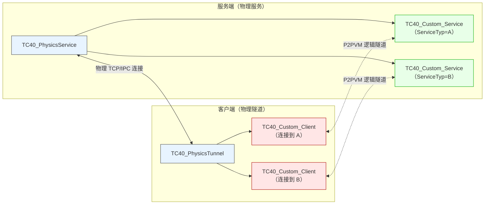
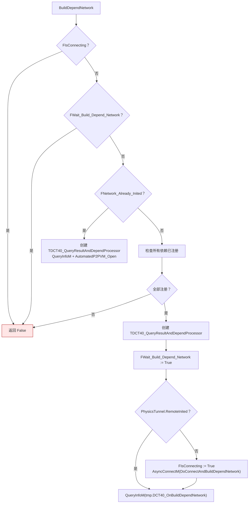
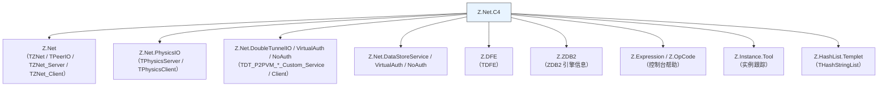

# Z.Net.C4 知识库（最终传承版）

> **定位**：面向 AI 与人类工程师的权威参考。目标是让读者**无需翻阅源码**即可安全、准确地使用 `Z.Net.C4`。
> **承诺**：所有描述均来自 `Z.Net.C4.pas` 的逐行核对。凡我无法从源码确定的，在文末「诚实的不确定清单」中明示。
> **制图约定**：全文流程图/架构图/决策树一律使用 Mermaid，不使用字符制图。
> **规模警告**：本单元约 **6000 行**，是 Z 框架的**分布式服务框架**（C4 = Cloud For? / Communication For?）。它建立在 `Z.Net` 之上，提供物理服务/隧道、逻辑服务/客户端、分发注册表、自动部署、稳定会话、P2PVM 隧道等完整能力。

---

## 第 0 章 快速定位：这个单元是什么

`Z.Net.C4` 是 Z 框架的**分布式服务框架**。它在 `Z.Net`（物理网络层）之上构建了**逻辑服务层**，让开发者可以按"服务类型"（ServiceTyp）组织业务，并通过**分发服务（Dispatch）** 实现服务发现与负载均衡。

```mermaid
flowchart TD
    subgraph L0["依赖层"]
        C1["Z.Core / Z.PascalStrings / Z.UPascalStrings"]
        C2["Z.Status / Z.UnicodeMixedLib / Z.ListEngine / Z.Parsing"]
        C3["Z.Geometry2D / Z.DFE / Z.Json / Z.Notify / Z.Cipher / Z.MemoryStream"]
        C4["Z.HashList.Templet / Z.Int128"]
        C5["Z.Expression / Z.OpCode"]
        C6["Z.ZDB2 / Z.ZDB2.Thread.Queue / Z.ZDB2.Thread"]
        C7["Z.Net<br/>（TZNet / TPeerIO / TZNet_Server / TZNet_Client）"]
        C8["Z.Net.PhysicsIO<br/>（TPhysicsServer / TPhysicsClient）"]
        C9["Z.Net.DoubleTunnelIO / VirtualAuth / NoAuth<br/>（TDTService / TDTClient 系列）"]
        C10["Z.Net.DataStoreService / VirtualAuth / NoAuth"]
        C11["Z.Net.Client.IPC / Z.Net.Server.IPC"]
        C12["Z.Instance.Tool"]
    end

    subgraph L1["物理层"]
        P1["TC40_PhysicsService<br/>（服务端，包装 TZNet_Server）"]
        P2["TC40_PhysicsTunnel<br/>（客户端，包装 TZNet_Client）"]
        P3["TC40_PhysicsServicePool"]
        P4["TC40_PhysicsTunnelPool"]
    end

    subgraph L2["元数据层"]
        M1["TC40_Info<br/>（服务元数据）"]
        M2["TC40_InfoList"]
        M3["TC40_DependNetworkInfo<br/>（依赖描述）"]
    end

    subgraph L3["逻辑层"]
        L1A["TC40_Custom_Service<br/>（逻辑服务基类）"]
        L1B["TC40_Custom_Client<br/>（逻辑客户端基类）"]
        L1C["TC40_Custom_ServicePool"]
        L1D["TC40_Custom_ClientPool"]
    end

    subgraph L4["具体模型"]
        A1["NULL / NoAuth / VirtualAuth / DataStore / 内置认证"]
        A2["TC40_Base_*_Service / Client"]
        A3["TC40_Dispatch_Service / Client"]
    end

    subgraph L5["工具层"]
        T1["TC40_Auto_Deployment_Client&lt;T&gt;"]
        T2["TC40_Console_Help"]
        T3["TSearchServiceAndBuildConnection_Bridge"]
        T4["TC40_Custom_VM_Service / Client"]
    end

    L0 --> L1
    L1 --> L2
    L2 --> L3
    L3 --> L4
    L4 --> L5

    style L0 fill:#e8f4ff,stroke:#444
    style L1 fill:#fff7e6,stroke:#444
    style L2 fill:#e8ffe8,stroke:#444
    style L3 fill:#ffe6e6,stroke:#444
    style L4 fill:#f0e8ff,stroke:#444
    style L5 fill:#fff0f0,stroke:#444
```



**核心思想**：

| 概念 | 说明 |
|------|------|
| **物理服务（Physics Service）** | 监听某个地址/端口，是所有逻辑服务的物理载体 |
| **物理隧道（Physics Tunnel）** | 连接到某个物理服务，是所有逻辑客户端的物理载体 |
| **逻辑服务（Custom Service）** | 用户定义的服务，注册在某个物理服务上，有 ServiceTyp / Param / 工作负载 |
| **逻辑客户端（Custom Client）** | 用户定义的客户端，连接到某个逻辑服务，按 ServiceTyp 匹配 |
| **依赖网络（Depend Network）** | 客户端声明需要哪些 ServiceTyp，框架自动连接 |
| **分发服务（Dispatch）** | 全局服务注册表，收集所有物理服务上的逻辑服务信息 |
| **服务发现** | 客户端通过分发服务发现其他物理节点上的服务 |
| **负载均衡** | 通过 `Workload` / `MaxWorkload` 和 `Cycle_Anchor` 实现 |
| **P2PVM 隧道** | 逻辑服务/客户端通过 `TDT_P2PVM_*` 在 P2P 虚拟网络上通信 |
| **双隧道（Double Tunnel）** | 收发使用不同物理连接，提升吞吐 |
| **稳定会话（StableIO）** | 物理重连后恢复逻辑 IO |

**C4 的完整数据流**：



---

## 第 1 章 全局变量与配置

### 1.1 全局变量

```pascal
var
  C40_QuietMode: Boolean;                          // 全局安静模式
  C40_SafeCheckTime: TTimeTick;                    // SafeCheck 默认间隔（45 秒）
  C40_PhysicsReconnectionDelayTime: Double;        // 重连延迟（5.0 秒）
  C40_UpdateServiceInfoDelayTime: TTimeTick;       // 服务信息更新延迟（1 秒）
  C40_PhysicsServiceTimeout: TTimeTick;            // 物理服务空闲超时（15 分钟）
  C40_PhysicsTunnelTimeout: TTimeTick;             // 物理隧道空闲超时（15 分钟）
  C40_KillDeadPhysicsConnectionTimeout: TTimeTick; // 死连接清理超时（60 秒）
  C40_KillIDCFaultTimeout: TTimeTick;              // IDC 故障清理超时（7 天）
  C40_EnablePerServiceDirectory: Boolean;          // 每个服务独立目录（True）
  C40_RootPath: U_String;                          // C4 根目录
  C40_Password: SystemString;                      // P2PVM 认证密码（'DTC40@ZSERVER'）
  C40_PhysicsClientClass: TZNet_ClientClass;       // 物理客户端类（TPhysicsClient）
  C40_Registed: TC40_RegistedDataList;             // 全局注册表
  C40_PhysicsServicePool: TC40_PhysicsServicePool; // 全局物理服务池
  C40_ServicePool: TC40_Custom_ServicePool;        // 全局逻辑服务池
  C40_PhysicsTunnelPool: TC40_PhysicsTunnelPool;   // 全局物理隧道池
  C40_ClientPool: TC40_Custom_ClientPool;          // 全局逻辑客户端池
  C40_VM_Service_Pool: TC40_Custom_VM_Service_Pool; // 全局 VM 服务池
  C40_VM_Client_Pool: TC40_Custom_VM_Client_Pool;  // 全局 VM 客户端池
  C40_Cycle_Order_Seed: Int64 = 0;                 // Cycle Anchor 种子
  C40_DefaultConfig: THashStringList;              // 默认配置快照
  Ignore_Command_Line: TPascalStringList;          // 忽略的命令行
```

### 1.2 默认值一览

| 变量 | 默认值 | 语义 |
|------|--------|------|
| `C40_QuietMode` | `False` | 打印所有日志 |
| `C40_SafeCheckTime` | `45 秒` | 每个服务的 SafeCheck 间隔 |
| `C40_PhysicsReconnectionDelayTime` | `5.0 秒` | 物理隧道重连延迟 |
| `C40_UpdateServiceInfoDelayTime` | `1 秒` | 分发服务更新间隔 |
| `C40_PhysicsServiceTimeout` | `15 分钟` | 服务端空闲超时 |
| `C40_PhysicsTunnelTimeout` | `15 分钟` | 客户端空闲超时 |
| `C40_KillDeadPhysicsConnectionTimeout` | `60 秒` | 清理未初始化连接 |
| `C40_KillIDCFaultTimeout` | `7 天` | 清理已初始化但失联的隧道 |
| `C40_EnablePerServiceDirectory` | `True` | 服务使用独立目录 |
| `C40_RootPath` | FPC: `umlCurrentPath`；Delphi: `TPath.GetLibraryPath` | C4 根目录 |
| `C40_Password` | `'DTC40@ZSERVER'` | P2PVM 认证密码 |
| `C40_PhysicsClientClass` | `TPhysicsClient` | 默认物理客户端 |

### 1.3 初始化与终结

**`initialization`**：
1. 设置所有全局变量默认值。
2. 创建 `C40_Registed` / `C40_PhysicsServicePool` / `C40_ServicePool` / `C40_PhysicsTunnelPool` / `C40_ClientPool` / `C40_VM_Service_Pool` / `C40_VM_Client_Pool`。
3. **自动注册 8 种内置模型**：
   - `'DP'` → `TC40_Dispatch_Service` / `TC40_Dispatch_Client`
   - `'NULL'` → `TC40_Base_NULL_Service` / `TC40_Base_NULL_Client`
   - `'NA'` → `TC40_Base_NoAuth_Service` / `TC40_Base_NoAuth_Client`
   - `'DNA'` → `TC40_Base_DataStoreNoAuth_Service` / `TC40_Base_DataStoreNoAuth_Client`
   - `'VA'` → `TC40_Base_VirtualAuth_Service` / `TC40_Base_VirtualAuth_Client`
   - `'DVA'` → `TC40_Base_DataStoreVirtualAuth_Service` / `TC40_Base_DataStoreVirtualAuth_Client`
   - `'D'` → `TC40_Base_Service` / `TC40_Base_Client`
   - `'DD'` → `TC40_Base_DataStore_Service` / `TC40_Base_DataStore_Client`
4. 创建 `C40_DefaultConfig` 并写入默认配置快照。
5. **挂钩 `Z.Core.OnCheckThreadSynchronize`**：每次主线程检查同步时自动调用 `C40Progress`。

**`finalization`**：
1. 关闭 `Print_Intermediate_Instance_Status` 和 `Print_Tracking_Delay_Free`。
2. 调用 `C40Clean` 清理所有 C4 对象。
3. 释放所有全局池。
4. **恢复原始 `OnCheckThreadSynchronize`**。

**关键契约**：
- **`DoCheckThreadSynchronize` 会链式调用原钩子**，不会破坏其他单元的钩子。
- **`C40Progress` 有防重入**（`C40Progress_Working`）。
- **`C40Progress` 临时禁用 `Enabled_Check_Thread_Synchronize_System`**，避免递归。

---

## 第 2 章 依赖描述与解析

### 2.1 类型定义

```pascal
TC40_DependNetworkString = U_StringArray;              // 字符串数组

TC40_DependNetworkInfo = record
  Typ: U_String;     // 服务类型（如 'FileServer'）
  Param: U_String;   // 参数（如 'RootPath=/data'）
end;

TC40_DependNetworkInfoArray = array of TC40_DependNetworkInfo;
TC40_DependNetworkInfoList = class(TGenericsList<TC40_DependNetworkInfo>);
```

### 2.2 依赖字符串格式

**语法**：`Typ1@Param1|Typ2@Param2|Typ3@Param3`

**分隔符**：`|` 或 `<>`（用于分隔多个依赖）；`@`（用于分隔类型和参数）。

**示例**：
```
'DP@|FileServer@RootPath=/data|LogServer@Level=Info'
```

### 2.3 解析函数

```pascal
function ExtractDependInfo(info: TC40_DependNetworkInfoList): TC40_DependNetworkInfoArray; overload;
function ExtractDependInfo(info: U_String): TC40_DependNetworkInfoArray; overload;
function ExtractDependInfo(arry: TC40_DependNetworkString): TC40_DependNetworkInfoArray; overload;

function ExtractDependInfoToL(info: U_String): TC40_DependNetworkInfoList; overload;
function ExtractDependInfoToL(arry: TC40_DependNetworkString): TC40_DependNetworkInfoList; overload;

procedure ResetDependInfoBuff(var arry: TC40_DependNetworkInfoArray);

function Compare_C40_ServiceTyp(typ1, typ2: U_String): Boolean; overload;
function Compare_C40_ServiceTyp(typ1, typ2, typ3: U_String): Boolean; overload;
```

**契约**：
- **`ExtractDependInfo` 用 `umlTrimSpace` 去空格**。
- **`Compare_C40_ServiceTyp` 检查两个依赖字符串是否有共同的 ServiceTyp**。
- **`ResetDependInfoBuff` 清空所有字段并 `SetLength(arry, 0)`**。

### 2.4 IPC 地址判定

```pascal
function Is_IPC_Addr(ListenAddr_Or_PhysicsAddr: U_String): Boolean;
function Get_Physics_Server_Class(ListenAddr, PhysicsAddr: U_String): TZNet_ServerClass;
function Get_Physics_Client_Class(PhysicsAddr: U_String): TZNet_ClientClass;
```

**契约**：
- **`Is_IPC_Addr` 用 `umlMultipleMatch('ipc:*', ...)`**。
- **`Get_Physics_Server_Class`**：任一地址为 IPC → `TZNet_Server_IPC`，否则 `TPhysicsServer`。
- **`Get_Physics_Client_Class`**：IPC → `TZNet_Client_IPC`，否则 `C40_PhysicsClientClass`。

---

## 第 3 章 物理服务 `TC40_PhysicsService`

### 3.1 定位

`TC40_PhysicsService` 代表一个**物理网络服务端**。它包装 `TZNet_Server`，管理 `TC40_Custom_Service` 实例的生命周期。

### 3.2 字段

```pascal
TC40_PhysicsService = class(TCore_InterfacedObject_Intermediate)
private
  FActivted: Boolean;                          // 是否已启动
  FLastDeadConnectionCheckTime_: TTimeTick;    // 上次死连接检查时间
  procedure cmd_QueryInfo(Sender: TPeerIO; InData, OutData: TDFE);
public
  ListeningAddr: U_String;                     // 本地监听地址
  PhysicsAddr: U_String;                       // 对外通告地址
  PhysicsPort: Word;                           // 端口
  PhysicsTunnel: TZNet_Server;                 // 底层服务端
  AutoFreePhysicsTunnel: Boolean;              // 是否自动释放底层
  DependNetworkServicePool: TC40_Custom_ServicePool;  // 本服务上的逻辑服务池
  OnEvent: IC40_PhysicsService_Event;          // 生命周期事件
end;
```

### 3.3 事件接口 `IC40_PhysicsService_Event`

```pascal
IC40_PhysicsService_Event = interface
  procedure C40_PhysicsService_Build_Network(Sender: TC40_PhysicsService; Custom_Service_: TC40_Custom_Service);
  procedure C40_PhysicsService_Start(Sender: TC40_PhysicsService);
  procedure C40_PhysicsService_Stop(Sender: TC40_PhysicsService);
  procedure C40_PhysicsService_LinkSuccess(Sender: TC40_PhysicsService; Custom_Service_: TC40_Custom_Service; Trigger_: TCore_Object);
  procedure C40_PhysicsService_UserOut(Sender: TC40_PhysicsService; Custom_Service_: TC40_Custom_Service; Trigger_: TCore_Object);
end;
```

| 事件 | 触发时机 |
|------|---------|
| `Build_Network` | `BuildDependNetwork` 创建新逻辑服务后 |
| `Start` | `StartService` 成功后 |
| `Stop` | `StopService` 后 |
| `LinkSuccess` | 逻辑服务的 `DoLinkSuccess` 被调用 |
| `UserOut` | 逻辑服务的 `DoUserOut` 被调用 |

### 3.4 构造函数

```pascal
constructor Create(ListeningAddr_, PhysicsAddr_: U_String; PhysicsPort_: Word; PhysicsTunnel_: TZNet_Server); overload;
constructor Create(PhysicsAddr_: U_String; PhysicsPort_: Word; PhysicsTunnel_: TZNet_Server); overload;
destructor  Destroy; override;
```

**构造流程**：
1. 解析 `ListeningAddr_` / `PhysicsAddr_` / `PhysicsPort_`。
2. **若两个地址都不是 IPC**，调用 `ExtractHostAddress` 分离地址和端口。
3. 设置 `PhysicsTunnel.AutomatedP2PVMAuthToken := C40_Password`。
4. 设置 `PhysicsTunnel.TimeOutKeepAlive := True`。
5. **非 IPC 模式**时设置 `IdleTimeOut := C40_PhysicsServiceTimeout`。
6. **注册 `QueryInfo` Stream 命令**（`cmd_QueryInfo`）。
7. `PhysicsTunnel.PrintParams['QueryInfo'] := False`（不打印此命令的日志）。
8. `PhysicsTunnel.QuietMode := C40_QuietMode`。
9. 创建 `DependNetworkServicePool`。
10. **加入 `C40_PhysicsServicePool`**。

**⚠️ 关键陷阱**：
- **`PhysicsTunnel_` 由调用方创建并传入**。`AutoFreePhysicsTunnel` 默认 False，即析构时**不释放**底层服务端。
- **`ExtractHostAddress` 仅在非 IPC 模式调用**，IPC 模式地址原样保留。

### 3.5 启动/停止

```pascal
procedure StartService; virtual;
procedure StopService; virtual;

property Activted: Boolean read FActivted;
```

**`StartService`**：
1. `FActivted := PhysicsTunnel.StartService(ListeningAddr, PhysicsPort)`。
2. 成功则打印日志并触发 `OnEvent.C40_PhysicsService_Start`。
3. 失败则打印错误。

**`StopService`**：
1. 若未激活直接返回。
2. `PhysicsTunnel.StopService`。
3. `FActivted := False`。
4. 触发 `OnEvent.C40_PhysicsService_Stop`。

### 3.6 Progress

```pascal
procedure Progress; virtual;
```

**执行流程**：
1. **每 1 秒检查一次死连接**：
   - `PhysicsTunnel.GetIO_Array` 获取所有 IO。
   - 对每个 IO：若 `not IO.p2pVMTunnelReadyOk` 且 `GetTimeTick - IO.IO_Create_TimeTick > C40_KillDeadPhysicsConnectionTimeout`，则 `IO.Disconnect`。
2. `PhysicsTunnel.Progress`。

**契约**：
- **只清理未完成 P2PVM 认证且超过 60 秒的连接**。
- **正常连接不受影响**。

### 3.7 `QueryInfo` 命令

```pascal
procedure cmd_QueryInfo(Sender: TPeerIO; InData, OutData: TDFE);
```

**契约**：
- **输入**：可选 `r_physics_addr: U_String` / `r_physics_port: Word`。
- **输出**：`TC40_InfoList` 序列化的 DFE。
- **收集来源**：
  1. 遍历 `C40_ServicePool`，所有 `C40PhysicsService.Activted` 的逻辑服务。
  2. 若逻辑服务是 `TC40_Dispatch_Service`，合并其 `Service_Info_Pool`。
  3. 遍历 `C40_ClientPool`，若为 `TC40_Dispatch_Client`，合并其 `Service_Info_Pool`。
- **地址重写**：若 `r_physics_addr <> PhysicsAddr`，则：
  - 将 `SamePhysicsAddr([PhysicsAddr, '0.0.0.0', 'localhost', '127.0.0.1', '::', '::1', ''])` 的条目 `PhysicsAddr := r_physics_addr`。
  - 删除其他不匹配的条目。

**⚠️ 关键陷阱**：**`r_physics_addr` 为空时用 `PhysicsAddr`**，此时不会重写。

### 3.8 依赖网络构建

```pascal
function BuildDependNetwork(const Depend_: TC40_DependNetworkInfoArray): Boolean; overload;
function BuildDependNetwork(const Depend_: TC40_DependNetworkString): Boolean; overload;
function BuildDependNetwork(const Depend_: U_String): Boolean; overload;
```

**契约**：
- 遍历 `Depend_`，对每个 `Typ`：
  1. `FindRegistedC40(Typ)` 查找注册信息。
  2. 若未注册，打印错误并返回 False。
  3. 用 `ServiceClass.Create(Self, ServiceTyp, Param)` 创建逻辑服务实例。
  4. 打印服务信息。
  5. 触发 `OnEvent.C40_PhysicsService_Build_Network`。
- 全部成功返回 True。

### 3.9 物理服务池 `TC40_PhysicsServicePool`

```pascal
TC40_PhysicsServicePool = class(TGenericsList<TC40_PhysicsService>)
public
  procedure Progress;
  procedure Enabled_Progress;
  procedure Disable_Progress;
  function  ExistsPhysicsAddr(PhysicsAddr: U_String; PhysicsPort: Word): Boolean;
  function  ExistsListenAddr(ListenAddr: U_String; Port: Word): Boolean;
  procedure GetRS(var recv, send: Int64);
end;
```

**契约**：
- **`Progress` 倒序遍历**（`for i := Count - 1 downto 0`），允许回调中删除元素。
- **`GetRS` 汇总所有服务的 `stReceiveSize` / `stSendSize`**。

---

## 第 4 章 物理隧道 `TC40_PhysicsTunnel`

### 4.1 定位

`TC40_PhysicsTunnel` 代表一个**物理网络客户端**。它包装 `TZNet_Client`，管理 `TC40_Custom_Client` 实例。

### 4.2 字段

```pascal
TC40_PhysicsTunnel = class(TCore_InterfacedObject_Intermediate, IZNet_ClientInterface)
private
  FLast_Delay_Connecting_Time: TTimeTick;      // 上次延迟连接时间
  FIsConnecting: Boolean;                       // 是否正在连接
  FWait_Build_Depend_Network: Boolean;          // 是否等待构建依赖网络
  FNetwork_Already_Inited: Boolean;             // 网络是否已初始化
  FOfflineTime: TTimeTick;                      // 离线时间
public
  PhysicsAddr: U_String;
  PhysicsPort: Word;
  PhysicsTunnel: TZNet_Client;
  DependNetworkInfoArray: TC40_DependNetworkInfoArray;
  DependNetworkClientPool: TC40_Custom_ClientPool;
  OnEvent: IC40_PhysicsTunnel_Event;
end;
```

### 4.3 事件接口 `IC40_PhysicsTunnel_Event`

```pascal
IC40_PhysicsTunnel_Event = interface
  procedure C40_PhysicsTunnel_Connected(Sender: TC40_PhysicsTunnel);
  procedure C40_PhysicsTunnel_Disconnect(Sender: TC40_PhysicsTunnel);
  procedure C40_PhysicsTunnel_Build_Network(Sender: TC40_PhysicsTunnel; Custom_Client_: TC40_Custom_Client);
  procedure C40_PhysicsTunnel_Client_Connected(Sender: TC40_PhysicsTunnel; Custom_Client_: TC40_Custom_Client);
end;
```

### 4.4 构造

```pascal
constructor Create(Addr_: U_String; Port_: Word);
```

**构造流程**：
1. 设置字段默认值。
2. `PhysicsTunnel := Get_Physics_Client_Class(Addr_).Create`。
3. `PhysicsTunnel.AutomatedP2PVMAuthToken := C40_Password`。
4. `PhysicsTunnel.SyncOnResult := False` / `SyncOnCompleteBuffer := True`。
5. `PhysicsTunnel.TimeOutKeepAlive := True`。
6. **非 IPC 模式**：`IdleTimeOut := C40_PhysicsTunnelTimeout` 且 `SwitchDefaultPerformance`。
7. `PhysicsTunnel.OnInterface := Self`（实现 `IZNet_ClientInterface`）。
8. `PhysicsTunnel.PrintParams['QueryInfo'] := False`。
9. `PhysicsTunnel.QuietMode := C40_QuietMode`。
10. 创建 `DependNetworkClientPool`。
11. **加入 `C40_PhysicsTunnelPool`**。

### 4.5 Progress 与自动重连

```pascal
procedure Progress; virtual;
```

**执行流程**：
1. `PhysicsTunnel.Progress`。
2. 若 `FIsConnecting` 且超过 `C40_PhysicsTunnelTimeout`：重置 `FIsConnecting := False`。
3. **自动重连逻辑**：
   - 若 `FNetwork_Already_Inited` 且未连接且 `not FIsConnecting`：
     - `FIsConnecting := True`。
     - `PhysicsTunnel.PostProgress.PostExecuteM_NP(C40_PhysicsReconnectionDelayTime, DoDelayConnect)`。
   - 若已连接：更新 `FOfflineTime := GetTimeTick`。
4. 若 `FOfflineTime = 0` 且未连接：`FOfflineTime := GetTimeTick`。

**`DoDelayConnect`**：
- 若 `PhysicsTunnel.RemoteInited`，重置 `FIsConnecting := False`。
- 否则 `PhysicsTunnel.AsyncConnectM(PhysicsAddr, PhysicsPort, DoConnectOnResult)`。

**关键契约**：
- **重连延迟由 `C40_PhysicsReconnectionDelayTime` 控制**（默认 5 秒）。
- **`FIsConnecting` 在 `RemoteInited` 时重置为 False**。
- **`FOfflineTime` 用于死连接清理**（见 `C40CheckAndKillDeadPhysicsTunnel`）。

### 4.6 依赖网络重置

```pascal
function ResetDepend(const Depend_: TC40_DependNetworkInfoArray): Boolean; overload;
function ResetDepend(const Depend_: TC40_DependNetworkString): Boolean; overload;
function ResetDepend(const Depend_: U_String): Boolean; overload;
```

**契约**：
- 复制 `Depend_` 到 `DependNetworkInfoArray`。
- **对每个 `Typ` 检查 `FindRegistedC40(Typ)`**，任一未注册返回 False。

### 4.7 构建依赖网络

```pascal
function BuildDependNetwork(): Boolean;
function BuildDependNetworkC(OnResult: TOnState_C): Boolean;
function BuildDependNetworkM(OnResult: TOnState_M): Boolean;
function BuildDependNetworkP(OnResult: TOnState_P): Boolean;
```

**执行流程**：



**`DCT40_OnBuildDependNetwork` 流程**：
1. 统计 `DependNetworkInfoArray` 中已注册的数量。
2. 若为 0，`DoRun(False)`。
3. 遍历 `L`（服务信息列表）：
   - 若 `L[j].SamePhysicsAddr(Sender)` 且 `L[j].ServiceTyp` 匹配某个依赖，且 `DependNetworkClientPool` 中不存在：
     - `L[j].GetOrCreateC40Client(Sender, Param)` 创建客户端。
     - 打印服务信息。
     - 触发 `OnEvent.C40_PhysicsTunnel_Build_Network`。
4. 若找到客户端，设置 `OnAutomatedP2PVMClientConnectionDone_M := DCT40_OnAutoP2PVMConnectionDone` 并 `AutomatedP2PVM_Open(ClientIO)`。

**`DCT40_OnAutoP2PVMConnectionDone`**：
1. `Sender.AutomatedP2PVMClient := True`。
2. 遍历 `DependNetworkClientPool`，对未连接的客户端调用 `Connect`。
3. `FWait_Build_Depend_Network := False` / `FNetwork_Already_Inited := True` / `FOfflineTime := 0`。
4. `DoRun(True)`。

### 4.8 查询服务信息

```pascal
procedure QueryInfoC(OnResult: TDCT40_OnQueryResultC);
procedure QueryInfoM(OnResult: TDCT40_OnQueryResultM);
procedure QueryInfoP(OnResult: TDCT40_OnQueryResultP);
```

**契约**：
- **若 `PhysicsTunnel.RemoteInited`**：直接发送 `QueryInfo` Stream 命令。
- **否则**：`FIsConnecting := True`，禁用自动 P2PVM，`AsyncConnectM(DoConnectAndQuery)`。

**`TDCT40_QueryResultData`** 封装回调：
- `DoStreamParam`：`L.MergeFromDF(Result_)` 后 `DoRun`。
- `DoStreamFailed`：直接 `DoRun`。
- `DoRun`：依次调用 C/M/P 回调，`DelayFreeObj(1.0, Self)`。

### 4.9 检查依赖

```pascal
function CheckDepend(): Boolean;
function CheckDependC(OnResult: TOnState_C): Boolean;
function CheckDependM(OnResult: TOnState_M): Boolean;
function CheckDependP(OnResult: TOnState_P): Boolean;
```

**契约**：
- **对每个依赖，`L.ExistsService(Typ)` 检查服务是否存在**。
- 全部存在返回 True。

### 4.10 状态查询

```pascal
function IPC_Mode: Boolean;
function IsLocalNetwork: Boolean;
function IsLoopbackNetwork: Boolean;
function DependNetworkIsConnected: Boolean;
```

**`IsLocalNetwork`**：`Z.Net.IsLocalNetworkIPV4(PhysicsAddr)`。
**`IsLoopbackNetwork`**：`Z.Net.IsLoopbackIPV4` 或 `IsLoopbackIPV6`。
**`DependNetworkIsConnected`**：所有依赖客户端都连接。

### 4.11 物理隧道池 `TC40_PhysicsTunnelPool`

```pascal
TC40_PhysicsTunnelPool = class(TGenericsList<TC40_PhysicsTunnel>)
public
  Auto_Repair_First_BuildDependNetwork_Fault: Boolean;
  constructor Create;
  procedure GetRS(var recv, send: Int64);
  function  ExistsPhysicsAddr(PhysicsAddr: U_String; PhysicsPort: Word): Boolean;
  function  CreatePhysicsTunnel(...): TC40_PhysicsTunnel;
  function  GetPhysicsTunnel(...): TC40_PhysicsTunnel;
  function  GetOrCreatePhysicsTunnel(...): TC40_PhysicsTunnel;  // 5 个重载
  procedure Progress;
  procedure Enabled_Progress;
  procedure Disable_Progress;
  function  SearchServiceAndBuildConnection(...): TSearchServiceAndBuildConnection_Bridge;  // 3 个重载
  function  SearchServiceAndOptimizeConnection(...): TSearchServiceAndBuildConnection_Bridge;
end;
```

**`Auto_Repair_First_BuildDependNetwork_Fault`**：由宏 `ZNet_C4_Auto_Repair_First_BuildDependNetwork_Fault` 决定。

**`GetOrCreatePhysicsTunnel` 契约**：
- 若找到已存在的隧道：
  - **若 `not FIsConnecting` 且 `not FNetwork_Already_Inited`**：更新 `OnEvent` / `ResetDepend` 并重新 `BuildDependNetwork`。
  - 否则直接返回。
- 若未找到：创建新隧道。
- **`Auto_Repair_First_BuildDependNetwork_Fault=True` 时**用 `TC40_First_BuildDependNetwork_Fault_Fixed_Bridge` 包装。

### 4.12 首次构建依赖故障修复 `TC40_First_BuildDependNetwork_Fault_Fixed_Bridge`

```pascal
TC40_First_BuildDependNetwork_Fault_Fixed_Bridge = class(TCore_Object_Intermediate)
public
  Fault_Fixed_Bridge_Begin_Time: TTimeTick;
  Tunnel: TC40_PhysicsTunnel;
  constructor Create(Tunnel_: TC40_PhysicsTunnel);
  procedure Do_Delay_Next_BuildDependNetwork();
  procedure Do_First_BuildDependNetwork(const state: Boolean);
end;
```

**契约**：
- **5 秒后重试**，直到 `C40_KillIDCFaultTimeout`（7 天）超时。
- **每次重试前检查 `Tunnel` 是否仍在池中**。
- **成功或超时后 `DelayFreeObj(1.0, Self)`**。

### 4.13 搜索服务并建立连接

```pascal
TSearchServiceAndBuildConnection_Bridge = class(TCore_Object_Intermediate)
public
  PhysicsPool_: TC40_PhysicsTunnelPool;
  FullConnection_: Boolean;
  ServiceTyp: U_String;
  OnEvent_: IC40_PhysicsTunnel_Event;
  Done_ClientPool: TC40_Custom_ClientPool;
  TaskNum: Integer;
  OnDone_C: TOnSearchServiceAndBuildConnection_C;
  OnDone_M: TOnSearchServiceAndBuildConnection_M;
  OnDone_P: TOnSearchServiceAndBuildConnection_P;
  constructor Create;
  destructor Destroy; override;
  procedure Do_SearchService_Event(Sender: TC40_PhysicsTunnel; L: TC40_InfoList);
  procedure Do_Done_Client(States_: TC40_Custom_ClientPool_Wait_States);
end;
```

**`Do_SearchService_Event`**：
- `FullConnection_=True`：`L.SearchService(ServiceTyp)`（全部匹配）。
- `FullConnection_=False`：`L.SearchMinWorkload(ServiceTyp)`（每个依赖选负载最小的）。

**契约**：
- **`TaskNum` 统计未完成的客户端连接数**。
- **所有连接完成后触发 `OnDone_C/M/P` 并 `DelayFreeObj(1.0, Self)`**。

### 4.14 等待客户端连接 `TC40_Custom_ClientPool_Wait`

```pascal
TC40_Custom_ClientPool_Wait = class(TCore_Object_Intermediate)
public
  States_: TC40_Custom_ClientPool_Wait_States;
  Pool_: TC40_Custom_ClientPool;
  On_C: TOn_C40_Custom_Client_EventC;
  On_M: TOn_C40_Custom_Client_EventM;
  On_P: TOn_C40_Custom_Client_EventP;
  constructor Create(dependNetwork_: U_String);
  destructor Destroy; override;
end;
```

**`DoRun` 流程**：
1. 对每个 `States_[i]`，调用 `MatchServiceTypForPool` 从池中找已连接的客户端。
2. 若 `error_`：打印错误并释放。
3. 若 `IsAllDone`：触发回调并释放。
4. 否则：`SystemPostProgress.PostExecuteM_NP(0.1, DoRun)` 继续轮询。

**契约**：
- **每 0.1 秒轮询一次**。
- **`ExistsClientFromStatesDone` 防止重复分配同一个客户端**。

---

## 第 5 章 服务信息 `TC40_Info`

### 5.1 定义

```pascal
TC40_Info = class(TCore_Object_Intermediate)
private
  Ignored: Boolean;                     // 是否被分发系统忽略
  procedure MakeHash;                   // 计算唯一 Hash
public
  OnlyInstance: Boolean;                // 是否唯一实例
  ServiceTyp: U_String;                 // 逻辑服务类型
  PhysicsAddr: U_String;                // 物理地址
  PhysicsPort: Word;                    // 物理端口
  p2pVM_RecvTunnel_Addr: U_String;      // P2PVM 接收隧道地址
  p2pVM_RecvTunnel_Port: Word;
  p2pVM_SendTunnel_Addr: U_String;      // P2PVM 发送隧道地址
  p2pVM_SendTunnel_Port: Word;
  Workload: Integer;                    // 当前负载
  MaxWorkload: Integer;                 // 最大负载
  Hash: TMD5;                           // 唯一 Hash

  property p2pVM_ClientRecvTunnel_Addr: U_String read p2pVM_SendTunnel_Addr;
  property p2pVM_ClientRecvTunnel_Port: Word read p2pVM_SendTunnel_Port;
  property p2pVM_ClientSendTunnel_Addr: U_String read p2pVM_RecvTunnel_Addr;
  property p2pVM_ClientSendTunnel_Port: Word read p2pVM_RecvTunnel_Port;
end;
```

### 5.2 Hash 计算

```pascal
procedure MakeHash;
var
  n: U_String;
  buff: TBytes;
begin
  n := umlTrimSpace(PhysicsAddr) + '_' + umlIntToStr(PhysicsPort) + '_' + umlTrimSpace(p2pVM_RecvTunnel_Addr) + '_' + umlTrimSpace(p2pVM_SendTunnel_Addr);
  n := n.LowerText;
  buff := n.Bytes;
  n := '';
  Hash := umlMD5(@buff[0], length(buff));
  SetLength(buff, 0);
end;
```

**契约**：
- **Hash 由 4 个字段拼接后 MD5**：`PhysicsAddr_PhysicsPort_p2pVM_RecvTunnel_Addr_p2pVM_SendTunnel_Addr`。
- **全部小写**。
- **不包含 ServiceTyp**。

**⚠️ 关键陷阱**：**`Hash` 不包含 ServiceTyp**，所以同一物理地址上的不同 ServiceTyp 有不同的 P2PVM 地址，Hash 才能区分。

### 5.3 序列化

```pascal
procedure Load(stream: TCore_Stream);   // 从流反序列化
procedure Save(stream: TCore_Stream);   // 序列化到流
```

**`Save` 格式**（TDFE 编码）：
```
[OnlyInstance: Bool]
[ServiceTyp: String]
[PhysicsAddr: String]
[PhysicsPort: Word]
[p2pVM_RecvTunnel_Addr: String]
[p2pVM_RecvTunnel_Port: Word]
[p2pVM_SendTunnel_Addr: String]
[p2pVM_SendTunnel_Port: Word]
[Workload: Integer]
[MaxWorkload: Integer]
[Hash: MD5]
```

**`Save` 用 `D.FastEncodeTo(stream)`**，`Load` 用 `D.LoadFromStream(stream)`。

### 5.4 比较 API

```pascal
function Same(Data_: TC40_Info): Boolean;                          // 所有字段匹配
function SameServiceTyp(Data_: TC40_Info): Boolean;                // ServiceTyp 匹配
function SamePhysicsAddr(PhysicsAddr_: U_String): Boolean; overload;
function SamePhysicsAddr(Arry_: TArrayPascalString): Boolean; overload;
function SamePhysicsAddr(PhysicsAddr_: U_String; PhysicsPort_: Word): Boolean; overload;
function SamePhysicsAddr(Data_: TC40_Info): Boolean; overload;
function SamePhysicsAddr(Data_: TC40_PhysicsTunnel): Boolean; overload;
function SamePhysicsAddr(Data_: TC40_PhysicsService): Boolean; overload;
function SameP2PVMAddr(Data_: TC40_Info): Boolean;
function FoundServiceTyp(Arry_: TC40_DependNetworkInfoArray): Boolean; overload;
function FoundServiceTyp(servTyp_: U_String): Boolean; overload;
function ReadyC40Client: Boolean;
function GetOrCreateC40Client(PhysicsTunnel_: TC40_PhysicsTunnel; Param_: U_String): TC40_Custom_Client;
```

**`Same` 契约**：`ServiceTyp` / `PhysicsAddr` / `PhysicsPort` / `p2pVM_RecvTunnel_Addr` / `p2pVM_RecvTunnel_Port` / `p2pVM_SendTunnel_Addr` / `p2pVM_SendTunnel_Port` 全部相同才返回 True。

**`SamePhysicsAddr(Arry_)`**：`PhysicsAddr` 匹配数组中任一元素。

**`ReadyC40Client`**：`FindRegistedC40(ServiceTyp)` 存在且 `ClientClass <> nil`。

**`GetOrCreateC40Client`**：
1. 在 `PhysicsTunnel_.DependNetworkClientPool` 中查找 `Same(Self)` 的客户端。
2. 若找到，返回（**⚠️ 源码 bug：`Result := C40_ClientPool[i]`，用了错误的索引 `i`**）。
3. 否则用 `p^.ClientClass.Create(PhysicsTunnel_, Self, Param_)` 创建。

### 5.5 `TC40_InfoList`

```pascal
TC40_InfoList = class(TGenericsList<TC40_Info>)
public
  AutoFree: Boolean;
  constructor Create(AutoFree_: Boolean);
  destructor  Destroy; override;
  procedure Remove(obj: TC40_Info);
  procedure Delete(index: Integer);
  procedure Clear;

  class procedure SortWorkLoad(L_: TC40_InfoList);
  function  GetInfoArray: TC40_Info_Array;
  function  IsOnlyInstance(ServiceTyp: U_String): Boolean;
  function  GetServiceTypNum(ServiceTyp: U_String): Integer;
  function  SearchMinWorkload(arry: TC40_DependNetworkInfoArray): TC40_Info_Array; overload;
  function  SearchMinWorkload(ServiceTyp: U_String): TC40_Info_Array; overload;
  function  SearchService(arry: TC40_DependNetworkInfoArray; full_: Boolean): TC40_Info_Array; overload;
  function  SearchService(arry: TC40_DependNetworkInfoArray): TC40_Info_Array; overload;
  function  SearchService(ServiceTyp: U_String): TC40_Info_Array; overload;
  function  ExistsService(arry: TC40_DependNetworkInfoArray): Boolean; overload;
  function  ExistsService(ServiceTyp: U_String): Boolean; overload;
  function  FindSame(Data_: TC40_Info): TC40_Info;
  function  FindHash(Hash: TMD5): TC40_Info;
  function  ExistsPhysicsAddr(PhysicsAddr: U_String; PhysicsPort: Word): Boolean;
  procedure RemovePhysicsAddr(PhysicsAddr: U_String; PhysicsPort: Word);
  function  OverwriteInfo(Data_: TC40_Info): Boolean;
  function  MergeAndUpdateWorkload(source: TC40_InfoList): Boolean;
  function  MergeFromDF(D: TDFE): Boolean;
  procedure SaveToDF(D: TDFE);
end;
```

**`AutoFree=True` 时，`Remove` / `Delete` / `Clear` 会释放元素**。

**`SortWorkLoad`**：按 `Workload / MaxWorkload` 升序排序；相等时按 `MaxWorkload` 降序。

**`SearchMinWorkload`**：对每个依赖，取 `Workload/MaxWorkload` 最小的服务。

**`SearchService(arry, full_)`**：
- `full_=True`：返回所有匹配。
- `full_=False`：每个依赖只返回第一个匹配。

**`SearchService(arry)`**：`full_=True` 的包装。

**`OverwriteInfo`**：
- 若找到相同 `Same` 的条目，`Assign` 覆盖。
- 否则 `Add(Data_.Clone)`（**`AutoFree=False` 时打印警告**）。

**`MergeAndUpdateWorkload`**：
- 若 `FindSame` 不存在：`Add`（AutoFree 时 Clone）。
- 若存在：更新 `Workload` / `MaxWorkload` 为较大值。

**`MergeFromDF`**：
- 循环读取 Stream。
- 解析 `TC40_Info`。
- **若 `FindSame` 存在**：丢弃。
- **若 `OnlyInstance=True` 且已存在同 ServiceTyp**：丢弃。
- 否则 `Add`。

**`SaveToDF`**：只序列化 `not Ignored` 的条目。

---

## 第 6 章 逻辑服务 `TC40_Custom_Service`

### 6.1 定位

`TC40_Custom_Service` 是所有用户定义服务的**基类**。每个实例注册在某个 `TC40_PhysicsService` 上，并有唯一的 `ServiceTyp` 和 `ServiceInfo`。

### 6.2 字段

```pascal
TC40_Custom_Service = class(TCore_InterfacedObject_Intermediate)
private
  FLastSafeCheckTime: TTimeTick;
  FCycle_Order_Default: Int64;
  FCycle_Anchor: TString_Num64_Analysis_Tool;
  FCycle_Anchor_Temp: Int64;
public
  Param: U_String;
  Param_File: U_String;
  ParamList: THashStringList;
  SafeCheckTime: TTimeTick;
  Alias_or_Hash___: U_String;
  enablePerServiceDirectory: Boolean;
  Tag: Integer;
  ServiceInfo: TC40_Info;
  C40PhysicsService: TC40_PhysicsService;
  ConsoleCommand: TC4_Help_Console_Command;
  property PhysicsService: TC40_PhysicsService read C40PhysicsService;
end;
```

### 6.3 构造

```pascal
constructor Create(PhysicsService_: TC40_PhysicsService; ServiceTyp, Param_: U_String); virtual;
```

**构造流程**：
1. 保存 `Param`。
2. 创建 `ParamList`（`AutoUpdateDefaultValue := True`）。
3. `umlSeparatorText(Param, tmp, ',;' + #13#10)` 解析参数（支持 `,` `;` `\r` `\n` 分隔）。
4. 从 `ParamList` 读 `Param_File`，默认 `S_<ServiceTyp>.conf`。
5. **若文件存在**，从文件加载参数。
6. 读 `SafeCheckTime`（默认 `C40_SafeCheckTime`）。
7. 读 `Alias`（默认 `C40_ServicePool.MakeAlias(ServiceTyp)`）。
8. 读 `enablePerServiceDirectory`（默认 `C40_EnablePerServiceDirectory`）。
9. 读 `Tag`（默认 0）。
10. **生成 P2PVM 接收/发送隧道地址**：
    - `P2PVM_Recv_Name_ := ServiceTyp + 'R'`。
    - `C40_ServicePool.MakeP2PVM_IPv6_Port(P2PVM_Recv_IP6_, P2PVM_Recv_Port_)`。
    - 发送隧道同理（`S` 后缀）。
11. 创建 `ServiceInfo` 并填充所有字段。
12. 读 `Ignored` / `OnlyInstance`。
13. `SetWorkload(0, 100)`。
14. `ServiceInfo.MakeHash`。
15. **加入 `C40_ServicePool` 和 `C40PhysicsService.DependNetworkServicePool`**。
16. 创建 `ConsoleCommand`。
17. `Init_Cycle_Anchor`。

**`MakeP2PVM_IPv6_Port`**：
```pascal
procedure TC40_Custom_ServicePool.MakeP2PVM_IPv6_Port(var ip6, Port: U_String);
var
  tmp: TIPV6;
  i: Integer;
begin
  for i := 0 to 7 do
      tmp[i] := FIPV6_Seed;
  Port := umlIntToStr(FIPV6_Seed);
  inc(FIPV6_Seed);
  ip6 := IPV6ToStr(tmp);
end;
```

**契约**：
- **IPv6 地址 = 8 个 Word 都是 `FIPV6_Seed`**。
- **端口 = `FIPV6_Seed`**。
- **`FIPV6_Seed` 从 1 开始递增**。

### 6.4 工作负载

```pascal
procedure SetWorkload(Workload_, MaxWorkload_: Integer);

function GetHash: TMD5;
property Hash: TMD5 read GetHash;
function GetAliasOrHash: U_String;
property AliasOrHash: U_String read GetAliasOrHash write Alias_or_Hash___;
```

**`SetWorkload`**：直接设置 `ServiceInfo.Workload` 和 `MaxWorkload`。

**`GetAliasOrHash`**：
- 若 `Alias_or_Hash___` 非空，返回它。
- 否则返回 `umlMD5ToStr(Hash)`。

### 6.5 P2PVM 服务查询

```pascal
function Get_P2PVM_Service(var recv_, send_: TZNet_WithP2PVM_Server): Boolean;
```

**契约**：根据具体类型（`TC40_Dispatch_Service` / `TC40_Base_NoAuth_Service` 等）返回对应的 `RecvTunnel` / `SendTunnel`。

**⚠️ 源码 bug**：`Self is TC40_Base_NoAuth_Service` 分支中，`send_ := TC40_Base_NoAuth_Service(Self).Service.DTService.SendTunnel` 应该是 `Service.SendTunnel`。

### 6.6 文件定位

```pascal
function Get_DB_FileName_Config(source_: U_String): U_String;
function Where_C4_File(fileName, ServiceTyp: U_String): U_String; overload;
function Where_C4_File(fileName: U_String): U_String; overload;
```

**`Where_C4_File` 搜索顺序**：
1. `umlCombineFileName(umlCurrentPath, fileName)`。
2. `umlCombineFileName(umlCombinePath(C40_RootPath, ServiceTyp), fileName)`。
3. `umlCombineFileName(C40_RootPath, fileName)`。

**契约**：**文件不存在时返回空字符串**。

### 6.7 控制台命令

```pascal
function Register_ConsoleCommand(Cmd, Desc: SystemString): TC4_Help_Console_Command_Data;
```

**契约**：创建 `TC4_Help_Console_Command_Data` 并加入 `ConsoleCommand`。

### 6.8 事件转发

```pascal
procedure DoLinkSuccess(Trigger_: TCore_Object);
procedure DoUserOut(Trigger_: TCore_Object);
```

**契约**：转发到 `C40PhysicsService.DoLinkSuccess` / `DoUserOut`。

### 6.9 逻辑服务池 `TC40_Custom_ServicePool`

```pascal
TC40_Custom_ServicePool = class(TGenericsList<TC40_Custom_Service>)
private
  FIPV6_Seed: Word;
public
  Enabled_Auto_Sort_for_Select_And_Next_Cycle_Anchor: Boolean;
  constructor Create;
  procedure Progress;
  procedure Sort_Cycle_Anchor(TaskName: U_String);
  function  Select_And_Next_Cycle_Anchor(TaskName: U_String): TC40_Custom_Service;
  procedure MakeP2PVM_IPv6_Port(var ip6, Port: U_String);
  function  MakeAlias(preset_: U_String): U_String;
  function  ExistsPhysicsAddr(PhysicsAddr: U_String; PhysicsPort: Word): Boolean;
  function  ExistsOnlyInstance(ServiceTyp: U_String): Boolean;
  function  FindHash(hash_: TMD5): TC40_Custom_Service;
  function  FindAliasOrHash(AliasOrhash_: U_String): TC40_Custom_Service;
  function  FindTag(Tag: Integer): TC40_Custom_Service;
  function  GetServiceFromHash(Hash: TMD5): TC40_Custom_Service;
  function  GetServiceFromAliasOrHash(AliasOrhash_: U_String): TC40_Custom_Service;
  function  GetC40Array(is_ipc_mode: Boolean): TC40_Custom_Service_Array; overload;
  function  GetC40Array: TC40_Custom_Service_Array; overload;
  function  GetFromServiceTyp(ServiceTyp: U_String; is_ipc_mode: Boolean): TC40_Custom_Service_Array; overload;
  // ... 更多 GetFrom*
end;
```

**`Sort_Cycle_Anchor`**：按 `FCycle_Anchor_Temp` 升序排序（`CompareInt64`）。

**`Select_And_Next_Cycle_Anchor`**：
- 若 `Count > 1`：`Sort_Cycle_Anchor` 后 `Result.Inc_Cycle_Anchor(TaskName)`。
- 返回 `Items[0]`。

**⚠️ 源码 bug**：`Result` 在 `if Count > 1 then` 块内使用，但 `Result` 尚未赋值。实际逻辑应该是先 `Result := Items[0]` 再 `Inc_Cycle_Anchor`。

**`GetC40Array(is_ipc_mode)`**：
- `is_ipc_mode=False`：返回所有。
- `is_ipc_mode=True`：只返回 `C40PhysicsService.IPC_Mode = True` 的。

**⚠️ 源码 bug**：`L.Select_And_Next_Cycle_Anchor('GetC40Array')` 调用了但没用返回值。

**`FindHash` / `FindAliasOrHash` / `FindTag` / `GetServiceFrom*`**：都用临时 `TC40_Custom_ServicePool` 收集匹配项，然后 `Select_And_Next_Cycle_Anchor` 选一个。

### 6.10 控制台命令数据

```pascal
TC4_Help_Console_Command_Data = class(TCore_Object_Intermediate)
public
  Cmd: SystemString;
  Desc: SystemString;
  OnEvent_C: TOn_C4_Help_Console_Command_C;
  OnEvent_M: TOn_C4_Help_Console_Command_M;
  OnEvent_P: TOn_C4_Help_Console_Command_P;
  constructor Create;
  destructor  Destroy; override;
  procedure DoExecute(var OP_Param: TOpParam);
end;

TC4_Help_Console_Command_Decl = class(TBigList<TC4_Help_Console_Command_Data>);

TC4_Help_Console_Command = class(TC4_Help_Console_Command_Decl)
public
  procedure DoFree(var Data: TC4_Help_Console_Command_Data); override;
end;
```

**契约**：
- **`DoExecute` 依次调用 C/M/P 中第一个已赋值的回调**。
- **异常被吞掉**。
- **`DoFree` 中 `DisposeObjectAndNil(Data)`**。

---

## 第 7 章 逻辑客户端 `TC40_Custom_Client`

### 7.1 定位

`TC40_Custom_Client` 是所有用户定义客户端的**基类**。每个实例属于某个 `TC40_PhysicsTunnel`，并连接到某个 `TC40_Custom_Service`。

### 7.2 字段

```pascal
TC40_Custom_Client = class(TCore_InterfacedObject_Intermediate)
private
  FLastSafeCheckTime: TTimeTick;
  FCycle_Order_Default: Int64;
  FCycle_Anchor: TString_Num64_Analysis_Tool;
  FCycle_Anchor_Temp: Int64;
public
  Param: U_String;
  Param_File: U_String;
  ParamList: THashStringList;
  SafeCheckTime: TTimeTick;
  Alias_or_Hash___: U_String;
  Tag: Integer;
  ClientInfo: TC40_Info;
  C40PhysicsTunnel: TC40_PhysicsTunnel;
  ConsoleCommand: TC4_Help_Console_Command;
  On_Client_Offline: TOn_Client_Offline;
  property PhysicsTunnel: TC40_PhysicsTunnel read C40PhysicsTunnel;
end;
```

### 7.3 构造

```pascal
constructor Create(PhysicsTunnel_: TC40_PhysicsTunnel; source_: TC40_Info; Param_: U_String); virtual;
```

**构造流程**：
1. `ClientInfo := TC40_Info.Create` 并 `Assign(source_)`。
2. 创建 `ParamList` 并解析 `Param`。
3. 从 `ParamList` 读 `Param_File`，默认 `C_<ServiceTyp>.conf`。
4. **若文件存在**，加载参数。
5. 读 `SafeCheckTime` / `Alias` / `Tag`。
6. **`PhysicsTunnel_` 为 nil 时**，用 `C40_PhysicsTunnelPool.GetOrCreatePhysicsTunnel(ClientInfo)` 获取。
7. **加入 `C40PhysicsTunnel.DependNetworkClientPool` 和 `C40_ClientPool`**。
8. 创建 `ConsoleCommand`。
9. `Init_Cycle_Anchor`。

### 7.4 生命周期方法

```pascal
procedure SafeCheck; virtual;                 // 默认空实现
procedure Progress; virtual;                  // 定期 SafeCheck
procedure Connect; virtual;                   // 默认空实现
function  Connected: Boolean; virtual;        // 默认 False
procedure Disconnect; virtual;                // 默认空实现
```

**`Progress` 契约**：**每次调用时检查 `GetTimeTick - FLastSafeCheckTime > SafeCheckTime`**，超时则 `SafeCheck`。

### 7.5 P2PVM 客户端查询

```pascal
function Get_P2PVM_Tunnel(var recv_, send_: TZNet_WithP2PVM_Client): Boolean;
```

**契约**：根据具体类型返回对应的 `RecvTunnel` / `SendTunnel`。

### 7.6 网络事件

```pascal
procedure DoNetworkOnline; virtual;
procedure DoNetworkOffline; virtual;
```

**`DoNetworkOnline`**：转发到 `C40PhysicsTunnel.DoNetworkOnline(Self)`。

**`DoNetworkOffline`**：调用 `On_Client_Offline(Self)`（若已赋值）。

### 7.7 逻辑客户端池 `TC40_Custom_ClientPool`

```pascal
TC40_Custom_ClientPool = class(TGenericsList<TC40_Custom_Client>)
public
  Enabled_Auto_Sort_for_Select_And_Next_Cycle_Anchor: Boolean;
  constructor Create;
  procedure Progress;
  procedure Sort_Cycle_Anchor(TaskName: U_String);
  function  Select_And_Next_Cycle_Anchor(TaskName: U_String): TC40_Custom_Client;

  function  MakeAlias(preset_: U_String): U_String;
  function  ExistsPhysicsAddr(...): Boolean;
  function  ExistsServiceInfo(info_: TC40_Info): Boolean;
  function  ExistsServiceTyp(ServiceTyp: U_String): Boolean;
  function  FindPhysicsAddr(...): Boolean;
  function  FindServiceInfo(info_: TC40_Info): Boolean;
  function  FindServiceTyp(ServiceTyp: U_String): Boolean;

  function  FindHash(hash_: TMD5; isConnected: Boolean): TC40_Custom_Client; overload;
  function  FindHash(hash_: TMD5): TC40_Custom_Client; overload;
  function  FindAliasOrHash(...): TC40_Custom_Client; overload;
  function  FindTag(Tag: Integer): TC40_Custom_Client;
  function  ExistsClass(Class_: TC40_Custom_Client_Class): TC40_Custom_Client;
  function  ExistsConnectedClass(...): TC40_Custom_Client;
  function  ExistsConnectedServiceTyp(...): TC40_Custom_Client;
  function  ExistsConnectedServiceTypAndClass(...): TC40_Custom_Client;
  function  FindClass(Class_): TC40_Custom_Client;
  function  FindConnectedClass(...): TC40_Custom_Client;
  function  FindConnectedServiceTyp(...): TC40_Custom_Client;
  function  FindConnectedServiceTypAndClass(...): TC40_Custom_Client;
  function  GetClientFromHash(Hash: TMD5): TC40_Custom_Client;

  function  GetC40Array(is_ipc_mode: Boolean): TC40_Custom_Client_Array; overload;
  function  GetC40Array: TC40_Custom_Client_Array; overload;
  function  SearchServiceTyp(...): TC40_Custom_Client_Array;
  function  SearchPhysicsAddr(...): TC40_Custom_Client_Array;
  function  SearchClass(...): TC40_Custom_Client_Array;  // 4 个重载
  function  FastFindClass(...): TC40_Custom_Client;
  function  FastSearchClass(...): TC40_Custom_Client_Array;  // 4 个重载

  procedure WaitConnectedDoneC(dependNetwork_: U_String; OnResult: TOn_C40_Custom_Client_EventC);
  procedure WaitConnectedDoneM(dependNetwork_: U_String; OnResult: TOn_C40_Custom_Client_EventM);
  procedure WaitConnectedDoneP(dependNetwork_: U_String; OnResult: TOn_C40_Custom_Client_EventP);
end;
```

**`SearchClass` vs `FastSearchClass`**：
- `SearchClass` 使用 `Select_And_Next_Cycle_Anchor` 负载均衡，较慢。
- `FastSearchClass` 直接返回所有匹配，不做负载均衡。

**`WaitConnectedDone*`**：创建 `TC40_Custom_ClientPool_Wait` 并 `PostExecuteM_NP(0.1, DoRun)` 轮询。

---

## 第 8 章 具体模型

### 8.1 模型总览

| 注册名 | Service 类 | Client 类 | 认证 | 数据存储 | 用途 |
|--------|-----------|----------|------|---------|------|
| `'DP'` | `TC40_Dispatch_Service` | `TC40_Dispatch_Client` | NoAuth | 否 | 分发服务 |
| `'NULL'` | `TC40_Base_NULL_Service` | `TC40_Base_NULL_Client` | NoAuth | 否 | 空模型 |
| `'NA'` | `TC40_Base_NoAuth_Service` | `TC40_Base_NoAuth_Client` | NoAuth | 否 | 无认证 |
| `'DNA'` | `TC40_Base_DataStoreNoAuth_Service` | `TC40_Base_DataStoreNoAuth_Client` | NoAuth | 是 | 无认证数据存储 |
| `'VA'` | `TC40_Base_VirtualAuth_Service` | `TC40_Base_VirtualAuth_Client` | VirtualAuth | 否 | 虚拟认证 |
| `'DVA'` | `TC40_Base_DataStoreVirtualAuth_Service` | `TC40_Base_DataStoreVirtualAuth_Client` | VirtualAuth | 是 | 虚拟认证数据存储 |
| `'D'` | `TC40_Base_Service` | `TC40_Base_Client` | 内置 | 否 | 内置认证 |
| `'DD'` | `TC40_Base_DataStore_Service` | `TC40_Base_DataStore_Client` | 内置 | 是 | 内置认证数据存储 |

### 8.2 `TC40_Base_NULL_Service` / `Client`

**Service**：
```pascal
Service: TDT_P2PVM_NoAuth_Custom_Service;
DTNoAuthService: TDTService_NoAuth;
property DTNoAuth: TDTService_NoAuth read DTNoAuthService;
```

**Client**：
```pascal
Client: TDT_P2PVM_NoAuth_Custom_Client;
DTNoAuthClient: TDTClient_NoAuth;
property DTNoAuth: TDTClient_NoAuth read DTNoAuthClient;
```

**特征**：与 `NoAuth` 相同，但**不重写任何行为**，仅作为占位符。

### 8.3 `TC40_Base_NoAuth_Service` / `Client`

**与 `NULL` 的差异**：
- **Service 的 `DoLinkSuccess_Event` / `DoUserOut_Event` 是 virtual 的**，子类可重写。
- **Client 的 `Do_DT_P2PVM_NoAuth_Custom_Client_TunnelLink` 是 virtual 的**，子类可重写。

### 8.4 `TC40_Base_DataStoreNoAuth_Service` / `Client`

**Service**：
```pascal
Service: TDT_P2PVM_NoAuth_Custom_Service;
DTNoAuthService: TDataStoreService_NoAuth;
```

**Client**：
```pascal
Client: TDT_P2PVM_NoAuth_Custom_Client;
DTNoAuthClient: TDataStoreClient_NoAuth;
```

**特征**：底层使用 `TDataStoreService_NoAuth` / `TDataStoreClient_NoAuth`，支持用户认证、用户数据库、文件系统等。

### 8.5 `TC40_Base_VirtualAuth_Service` / `Client`

**Service**：
```pascal
Service: TDT_P2PVM_VirtualAuth_Custom_Service;
DTVirtualAuthService: TDTService_VirtualAuth;
protected
  procedure DoUserReg_Event(Sender: TDTService_VirtualAuth; RegIO: TVirtualRegIO); virtual;
  procedure DoUserAuth_Event(Sender: TDTService_VirtualAuth; AuthIO: TVirtualAuthIO); virtual;
  procedure DoLinkSuccess_Event(...); virtual;
  procedure DoUserOut_Event(...); virtual;
```

**Client**：
```pascal
Client: TDT_P2PVM_VirtualAuth_Custom_Client;
DTVirtualAuthClient: TDTClient_VirtualAuth;
UserName: U_String;
Password: U_String;
NoDTLink: Boolean;
function LoginIsSuccessed: Boolean;
```

**契约**：
- **`DoUserReg_Event` 默认 `RegIO.Accept`**。
- **`DoUserAuth_Event` 默认 `AuthIO.Accept`**。
- **`NoDTLink=True`**：不主动登录，等待 `LoginIsSuccessed`。
- **`Connect` 中 `NoDTLink=False` 时**调用 `Client.Connect(UserName, Password)`。

### 8.6 `TC40_Base_DataStoreVirtualAuth_Service` / `Client`

与 `VirtualAuth` 类似，但底层是 `TDataStoreService_VirtualAuth` / `TDataStoreClient_VirtualAuth`。

### 8.7 `TC40_Base_Service` / `Client`

**Service**：
```pascal
Service: TDT_P2PVM_Custom_Service;
DTService: TDTService;
property DT: TDTService read DTService;
```

**Client**：
```pascal
Client: TDT_P2PVM_Custom_Client;
DTClient: TDTClient;
UserName: U_String;
Password: U_String;
NoDTLink: Boolean;
```

**契约**：
- **`Service.DTService.AllowRegisterNewUser := True` / `AllowSaveUserInfo := True`**。
- **`SafeCheck` 中调用 `Service.DTService.SaveUserDB`**。
- **非 IPC 模式使用独立目录**。

### 8.8 `TC40_Base_DataStore_Service` / `Client`

与 `Base` 类似，但底层是 `TDataStoreService` / `TDataStoreClient`。

### 8.9 分发服务 `TC40_Dispatch_Service`

**字段**：
```pascal
Service: TDT_P2PVM_NoAuth_Custom_Service;
Service_Info_Pool: TC40_InfoList;
property OnServiceInfoChange: TOnServiceInfoChange;
```

**私有字段**：
```pascal
FOnServiceInfoChange: TOnServiceInfoChange;
FWaiting_UpdateServerInfoToAllClient: Boolean;
FWaiting_UpdateServerInfoToAllClient_TimeTick: TTimeTick;
DelayCheck_Working: Boolean;
```

**命令注册**：
```pascal
Service.RecvTunnel.RegisterStreamNotify('UpdateServiceInfo').OnExecute := cmd_UpdateServiceInfo;
Service.RecvTunnel.RegisterStreamNotify('UpdateServiceState').OnExecute := cmd_UpdateServiceState;
Service.RecvTunnel.RegisterStreamNotify('IgnoreChange').OnExecute := cmd_IgnoreChange;
Service.RecvTunnel.RegisterStreamNotify('RequestUpdate').OnExecute := cmd_RequestUpdate;
Service.RecvTunnel.RegisterStreamNotify('RemovePhysicsNetwork').OnExecute := cmd_RemovePhysicsNetwork;
```

**`cmd_UpdateServiceInfo`**：
- `Service_Info_Pool.MergeFromDF(InData)`。
- 若有变化，`Prepare_UpdateServerInfoToAllClient`。
- 触发 `FOnServiceInfoChange`。

**`cmd_UpdateServiceState`**：
- 解析每个 DFE，读取 `Hash__` / `Workload` / `MaxWorkload`。
- 只把变化的条目加入 `ND`。
- 更新本地 `Service_Info_Pool`。
- 把 `ND` 广播给所有其他客户端。

**`cmd_IgnoreChange`**：
- 解析 `Hash__` / `Ignored`。
- 若 `info_.Ignored <> Ignored`：更新并 `IgnoreChangeToAllClient`。

**`cmd_RequestUpdate`**：`Prepare_UpdateServerInfoToAllClient`。

**`cmd_RemovePhysicsNetwork`**：
- 创建 `TOnRemovePhysicsNetwork` 并 `PostExecuteM_NP(2.0, DoRun)`。
- 若 `C40ExistsPhysicsNetwork`：广播给所有其他客户端。

**`UpdateServerInfoToAllClient`**：
- `Service_Info_Pool.SaveToDF(D)`。
- 广播 `UpdateServiceInfo`。

**`IgnoreChangeToAllClient`**：广播 `IgnoreChange`。

**`UpdateServiceStateToAllClient`**：广播 `UpdateServiceState`。

**`DoDelayCheckLocalServiceInfo`**：
- 遍历 `C40_ServicePool`，合并本地服务信息到 `Service_Info_Pool`。
- 若有变化，`Prepare_UpdateServerInfoToAllClient`。
- 否则 `UpdateServiceStateToAllClient`。

**`Progress`**：
- `inherited Progress`。
- `Service.Progress`。
- 若 `FWaiting_UpdateServerInfoToAllClient` 且超时：`UpdateServerInfoToAllClient`。
- 更新 `ServiceInfo.Workload`。
- 若 `not DelayCheck_Working`：`PostExecuteM_NP(2.0, DoDelayCheckLocalServiceInfo)`。

### 8.10 分发客户端 `TC40_Dispatch_Client`

**字段**：
```pascal
Client: TDT_P2PVM_NoAuth_Custom_Client;
Service_Info_Pool: TC40_InfoList;
property OnServiceInfoChange: TOnServiceInfoChange;
```

**命令注册**：
```pascal
Client.RecvTunnel.RegisterStreamNotify('UpdateServiceInfo').OnExecute := cmd_UpdateServiceInfo;
Client.RecvTunnel.RegisterStreamNotify('UpdateServiceState').OnExecute := cmd_UpdateServiceState;
Client.RecvTunnel.RegisterStreamNotify('IgnoreChange').OnExecute := cmd_IgnoreChange;
Client.RecvTunnel.RegisterStreamNotify('RemovePhysicsNetwork').OnExecute := cmd_RemovePhysicsNetwork;
```

**`cmd_UpdateServiceInfo`**：
- `Service_Info_Pool.MergeFromDF(InData)`。
- 触发 `FOnServiceInfoChange`。
- 转发给其他 `TC40_Dispatch_Client`。

**`cmd_UpdateServiceState`**：更新本地 `Service_Info_Pool` 和所有相关 `C40_ClientPool`。

**`cmd_IgnoreChange`**：更新本地并转发给其他 `TC40_Dispatch_Client`。

**`cmd_RemovePhysicsNetwork`**：`PostExecuteM_NP(2.0, ...)` 并转发。

**`Do_DT_P2PVM_NoAuth_Custom_Client_TunnelLink`**：`PostLocalServiceInfo(True)` + `RequestUpdate` + `DoNetworkOnline`。

**`DoDelayCheckLocalServiceInfo`**：
- `PostLocalServiceInfo(False)`。
- `UpdateLocalServiceState`。
- 根据 `Service_Info_Pool` 创建新的 `TC40_PhysicsTunnel`。

**`PostLocalServiceInfo(forcePost_)`**：合并本地服务信息并广播。

**`RequestUpdate`**：`Client.SendTunnel.SendStreamNotifyCmd('RequestUpdate')`。

**`IgnoreChangeToService`**：广播 `IgnoreChange`。

**`UpdateLocalServiceState`**：广播本地 `Workload` / `MaxWorkload`。

**`RemovePhysicsNetwork`**：广播 `RemovePhysicsNetwork`。

---

## 第 9 章 注册表

### 9.1 类型

```pascal
TC40_RegistedData = record
  ServiceTyp: U_String;
  ServiceClass: TC40_Custom_Service_Class;
  ClientClass: TC40_Custom_Client_Class;
end;
PC40_RegistedData = ^TC40_RegistedData;

TC40_RegistedDataList = class(TGenericsList<PC40_RegistedData>)
public
  destructor Destroy; override;
  procedure Clean;
  procedure Print;
end;
```

### 9.2 全局注册函数

```pascal
function RegisterC40(ServiceTyp: U_String; ServiceClass: TC40_Custom_Service_Class; ClientClass: TC40_Custom_Client_Class): Boolean;
function FindRegistedC40(ServiceTyp: U_String): PC40_RegistedData;
function GetRegisterClientTypFromClass(ClientClass: TC40_Custom_Client_Class): U_String;
function GetRegisterServiceTypFromClass(ClientClass: TC40_Custom_Client_Class): U_String;
function GetRegisterServiceTypFromClass(ServiceClass: TC40_Custom_Service_Class): U_String;
```

**`RegisterC40` 契约**：
- 若 `ServiceTyp` 已存在，复用该条目。
- `ServiceClass` 和 `ClientClass` 为 nil 时不覆盖。
- **总是返回 True**。

**`GetRegisterClientTypFromClass`**：遍历 `C40_Registed`，若 `p^.ClientClass.InheritsFrom(ClientClass)`，拼接 `ServiceTyp`（用 `|` 分隔）。

**⚠️ 源码 bug**：`p^.ClientClass` 可能为 nil，调用 `InheritsFrom` 会崩。

---

## 第 10 章 自动部署

### 10.1 `TC40_Auto_Deployment_Client<T_>`

```pascal
TC40_Auto_Deployment_Client<T_: class> = class(TCore_Object_Intermediate)
public type
  PT_ = ^T_;
  TOn_Ready_C = procedure(var Sender: T_);
  TOn_Ready_M = procedure(var Sender: T_) of object;
{$IFDEF FPC}
  TOn_Ready_P = procedure(var Sender: T_) is nested;
{$ELSE FPC}
  TOn_Ready_P = reference to procedure(var Sender: T_);
{$ENDIF FPC}
private
  FClient_Second: T_;
  FClient_Ptr: PT_;
  FDependNetwork: U_String;
  FOn_Ready_C / FOn_Ready_M / FOn_Ready_P;
  procedure Do_Deployment_Ready(States: TC40_Custom_ClientPool_Wait_States);
public
  constructor Create_Ptr(dependNetwork_: U_String; Client_: PT_);
  constructor Create(dependNetwork_: U_String; var Client: T_); overload;
  constructor Create(var Client: T_); overload;
  constructor Create_C(OnReady: TOn_Ready_C);
  constructor Create_M(OnReady: TOn_Ready_M);
  constructor Create_P(OnReady: TOn_Ready_P);
  constructor Create_C2(dependNetwork_: U_String; OnReady: TOn_Ready_C);
  constructor Create_M2(dependNetwork_: U_String; OnReady: TOn_Ready_M);
  constructor Create_P2(dependNetwork_: U_String; OnReady: TOn_Ready_P);
  destructor Destroy; override;
  property On_Ready / On_Ready_C / On_Ready_M / On_Ready_P;
end;
```

**别名**：
```pascal
TC40_Auto_Deploy_Client<T_> = TC40_Auto_Deployment_Client<T_>;
TC40_Auto_Deploy<T_> = TC40_Auto_Deployment_Client<T_>;
TC40_Deploy<T_> = TC40_Auto_Deployment_Client<T_>;
```

### 10.2 `Do_Deployment_Ready` 流程

1. `FClient_Ptr^ := nil`。
2. 遍历 `C40_ClientPool`，若 `cc is T_`，`FClient_Ptr^ := cc as T_`。
3. **若 `FClient_Ptr^ <> nil`**：
   - 若已连接：调用 `FOn_Ready_M` / `FOn_Ready_C` / `FOn_Ready_P`，打印成功信息。
   - 否则：打印失败信息。
   - `DelayFreeObj(1.0, Self)`。

**⚠️ 源码 bug**：`FOn_Ready_M` / `FOn_Ready_C` / `FOn_Ready_P` 的调用顺序与赋值顺序无关，**只调用第一个已赋值的**。

### 10.3 使用范式

```pascal
// 场景 1：有变量指针
var
  MyClient: TMyClient;
begin
  TC40_Auto_Deployment_Client<TMyClient>.Create('NA@|FileServer@', MyClient);
  // ... 稍后 MyClient 被赋值
end;

// 场景 2：无变量指针（回调风格）
TC40_Auto_Deployment_Client<TMyClient>.Create_M2('NA@|FileServer@',
  procedure(var Client: TMyClient)
  begin
    // Client 已就绪
  end);

// 场景 3：自动检测依赖
TC40_Auto_Deployment_Client<TMyClient>.Create_M(
  procedure(var Client: TMyClient)
  begin
    // ...
  end);
```

---

## 第 11 章 控制台帮助 `TC40_Console_Help`

### 11.1 定义

```pascal
TC40_Console_Help = class(TCore_Object_Intermediate)
public
  opRT: TOpCustomRunTime;
  HelpTextStyle: TTextStyle;
  IsExit: Boolean;
  constructor Create; virtual;
  destructor  Destroy; override;
  procedure Update_opRT; virtual;
  procedure Run_HelpCmd(exp_: U_String);
end;
```

### 11.2 内置命令

| 命令 | 说明 |
|------|------|
| `Help` | 显示帮助 |
| `Exit` / `Close` | 退出控制台 |
| `service` / `server` / `serv` | 显示服务信息 |
| `tunnel` / `client` / `cli` | 显示隧道信息 |
| `RegInfo` | 显示注册信息 |
| `KillNet` | 移除物理网络 |
| `C4_Clean` | 清理所有 C4 对象 |
| `Quiet` / `SetQuiet` | 设置安静模式 |
| `Save_All_C4Service_Config` | 保存服务配置 |
| `Save_All_C4Client_Config` | 保存客户端配置 |
| `Instance_Info` / `Inst_Info` | 显示实例信息 |
| `Instance_Info_Sort_Update` / `Inst_Info_Sort_Update` | 按更新次数排序 |
| `Instance_Info_Sort_Time` / `Inst_Info_Sort_Time` | 按更新时间排序 |
| `Build_Instance_State` | 保存实例状态快照 |
| `Compare_Instance_State` | 比较实例状态 |
| `HPC_Thread_Info` | 显示 HPC 线程信息 |
| `ZNet_Instance_Info` / `ZNet_Info` | 显示 ZNet 实例池 |
| `Delay_Free_Info` / `Enabled_Delay_Info` | 启用延迟释放跟踪 |
| `Intermediate_Instance_Info` / `Enabled_Intermediate_Instance_Info` | 启用实例跟踪 |
| `Service_CMD_Info` / `Server_CMD_Info` | 服务端命令统计 |
| `Client_CMD_Info` / `Cli_CMD_Info` | 客户端命令统计 |
| `Service_Statistics_Info` / `Server_Statistics_Info` | 服务端统计 |
| `Client_Statistics_Info` / `Cli_Statistics_Info` | 客户端统计 |
| `ZDB2_Info` | 显示 ZDB2 线程引擎 |
| `ZDB2_Flush` | 刷新所有 ZDB2 引擎 |

### 11.3 自定义命令

**`Update_opRT` 中**：遍历 `C40_ServicePool` / `C40_ClientPool` / `C40_VM_Service_Pool` / `C40_VM_Client_Pool`，对每个 `ConsoleCommand` 注册 `Do_Custom_Console_Cmd`。

**`Do_Custom_Console_Cmd`**：
- 遍历所有池，匹配 `LName.Same(rData.Cmd)`。
- `rData.DoExecute(OP_Param)`。
- 打印执行日志。

### 11.4 使用范式

```pascal
var
  Help: TC40_Console_Help;
begin
  Help := TC40_Console_Help.Create;
  try
    while not Help.IsExit do
      begin
        C40Progress(10);
        // 从 stdin 读取命令并调用 Help.Run_HelpCmd
      end;
  finally
    Help.Free;
  end;
end;
```

---

## 第 12 章 全局 API

### 12.1 进度驱动

```pascal
procedure C40Progress(sleep_: TTimeTick); overload;
procedure C40Progress; overload;  // = C40Progress(1)
```

**`C40Progress` 执行流程**：
1. **防重入**：`C40Progress_Working` 为 True 时直接返回。
2. `Check_Soft_Thread_Synchronize(sleep_, True)`。
3. 临时禁用 `Enabled_Check_Thread_Synchronize_System`。
4. 依次调用：
   - `C40_PhysicsServicePool.Progress`
   - `C40_PhysicsServicePool.Disable_Progress`
   - `C40_ServicePool.Progress`
   - `C40_PhysicsTunnelPool.Progress`
   - `C40_PhysicsTunnelPool.Disable_Progress`
   - `C40_ClientPool.Progress`
   - `C40_VM_Service_Pool.Progress`
   - `C40_VM_Client_Pool.Progress`
   - `C40_PhysicsServicePool.Enabled_Progress`
   - `C40_PhysicsTunnelPool.Enabled_Progress`
   - `C40CheckAndKillDeadPhysicsTunnel`
5. 恢复 `Enabled_Check_Thread_Synchronize_System`。
6. `C40Progress_Working := False`。

**契约**：
- **必须先 Progress 物理服务/隧道，再 Progress 逻辑服务/客户端**。
- **禁用物理 Progress 避免递归**。
- **`OnCheckThreadSynchronize` 钩子自动调用 `C40Progress`**。

### 12.2 安静模式

```pascal
procedure C40SetQuietMode(QuietMode_: Boolean);
```

**契约**：
- 设置 `C40_QuietMode`。
- **遍历所有客户端和服务**，对支持的类调用 `Set_Instance_QuietMode`。
- **遍历所有物理隧道和服务**，设置 `QuietMode`。
- **不支持的类打印警告**。

### 12.3 配置读写

```pascal
procedure C40WriteConfig(HS: THashStringList);
procedure C40ReadConfig(HS: THashStringList);
procedure C40ResetDefaultConfig;
```

**配置项**：
- `Quiet` / `SafeCheckTime` / `PhysicsReconnectionDelayTime` / `UpdateServiceInfoDelayTime` / `PhysicsServiceTimeout` / `PhysicsTunnelTimeout` / `KillIDCFaultTimeout` / `EnablePerServiceDirectory`。

**`C40ReadConfig` 用 `EStrTo*` 解析**（来自 `Z.Expression`，支持表达式求值）。

### 12.4 清理

```pascal
procedure C40Clean;
procedure C40Clean_Service;
procedure C40Clean_Client;
```

**`C40Clean` 流程**：
1. 备份 `OnCheckThreadSynchronize` 并置 nil（**防止递归**）。
2. 断开所有物理隧道。
3. 停止所有物理服务。
4. 断开所有 VM 客户端。
5. 停止所有 VM 服务。
6. 释放所有客户端、服务、隧道、服务。
7. **重置 `C40_ServicePool.FIPV6_Seed := 1`**。
8. 恢复 `OnCheckThreadSynchronize`。

**⚠️ 关键陷阱**：**`C40_ServicePool` 不被释放，只清空**（因为它可能被再次使用）。

### 12.5 物理网络查询

```pascal
function C40ExistsPhysicsNetwork(PhysicsAddr: U_String; PhysicsPort: Word): Boolean;
function C40_Get_Physics_Connected_Num(): Integer;
function C40_Get_Physics_Netowork_Is_Inited_Num(): Integer;
procedure C40RemovePhysics(...); overload;  // 3 个重载
procedure C40CheckAndKillDeadPhysicsTunnel();
```

**`C40RemovePhysics(PhysicsAddr, PhysicsPort, Remove_P2PVM_Client_, Remove_Physics_Client_, RemoveP2PVM_Service_, Remove_Physcis_Service_)`**：
- 按标志依次删除：
  1. `C40_ClientPool` 中匹配的客户端。
  2. `TC40_Dispatch_Client` 的 `Service_Info_Pool` 移除对应条目。
  3. `C40_PhysicsTunnelPool` 中匹配的隧道。
  4. `C40_ServicePool` 中匹配的服务。
  5. `TC40_Dispatch_Service` 的 `Service_Info_Pool` 移除对应条目。
  6. `C40_PhysicsServicePool` 中匹配的服务。

**`C40CheckAndKillDeadPhysicsTunnel`**：
- 遍历 `C40_PhysicsTunnelPool`。
- **条件 1**：`not RemoteInited` 且 `not FNetwork_Already_Inited` 且 `FOfflineTime > 0` 且超过 `C40_KillDeadPhysicsConnectionTimeout`（60 秒）。
- **条件 2**：`not RemoteInited` 且 `FNetwork_Already_Inited` 且 `FOfflineTime > 0` 且超过 `C40_KillIDCFaultTimeout`（7 天）。
- **命中则 `C40RemovePhysics` 并重置索引 `i := 0`**。

### 12.6 注册

```pascal
function RegisterC40(...): Boolean;
function FindRegistedC40(...): PC40_RegistedData;
function GetRegisterClientTypFromClass(...): U_String; overload;
function GetRegisterServiceTypFromClass(...): U_String; overload;
procedure C40PrintRegistation;
```

### 12.7 其他

```pascal
function C40_Online_DP: TC40_Dispatch_Client;
```

**契约**：返回第一个已连接的 `TC40_Dispatch_Client`。

---

## 第 13 章 完整使用范式

### 13.1 最小服务端

```pascal
uses Z.Net.C4, Z.Net.PhysicsIO;

procedure RunServer;
var
  PhysicsService: TC40_PhysicsService;
begin
  PhysicsService := TC40_PhysicsService.Create('0.0.0.0', '127.0.0.1', 9810, TPhysicsServer.Create);
  PhysicsService.StartService;
  while True do
    begin
      C40Progress(10);
      Sleep(1);
    end;
end;
```

### 13.2 最小客户端

```pascal
procedure RunClient;
var
  PhysicsTunnel: TC40_PhysicsTunnel;
begin
  PhysicsTunnel := TC40_PhysicsTunnel.Create('127.0.0.1', 9810);
  PhysicsTunnel.ResetDepend('NA@');
  PhysicsTunnel.BuildDependNetworkM(
    procedure(state: Boolean)
    begin
      WriteLn('构建完成: ', state);
    end);
  while True do
    begin
      C40Progress(10);
      Sleep(1);
    end;
end;
```

### 13.3 自定义服务

```pascal
type
  TMyService = class(TC40_Base_NoAuth_Service)
  protected
    procedure cmd_Hello(Sender: TPeerIO; InData: TDFE; OutData: TDFE);
  public
    constructor Create(PhysicsService_: TC40_PhysicsService; ServiceTyp, Param_: U_String); override;
  end;

constructor TMyService.Create(PhysicsService_: TC40_PhysicsService; ServiceTyp, Param_: U_String);
begin
  inherited Create(PhysicsService_, ServiceTyp, Param_);
  Service.RecvTunnel.RegisterStream('Hello').OnExecute := cmd_Hello;
end;

procedure TMyService.cmd_Hello(Sender: TPeerIO; InData: TDFE; OutData: TDFE);
begin
  OutData.WriteString('Hello, ' + InData.Reader.ReadString);
end;

// 注册
RegisterC40('MyService', TMyService, TMyClient);
```

### 13.4 自定义客户端

```pascal
type
  TMyClient = class(TC40_Base_NoAuth_Client)
  public
    function Hello(const Name: string): string;
  end;

function TMyClient.Hello(const Name: string): string;
var
  D, ResultD: TDFE;
begin
  D := TDFE.Create;
  try
    D.WriteString(Name);
    ResultD := TDFE.Create;
    try
      Client.DTNoAuth.RecvTunnel.WaitSendStreamCmd('Hello', D, ResultD, 5000);
      Result := ResultD.Reader.ReadString;
    finally
      ResultD.Free;
    end;
  finally
    D.Free;
  end;
end;
```

### 13.5 分发服务

```pascal
// 服务端
PhysicsService.BuildDependNetwork('DP@');

// 客户端
PhysicsTunnel.ResetDepend('DP@');
PhysicsTunnel.BuildDependNetworkM(
  procedure(state: Boolean)
  begin
    if state then
      WriteLn('已连接到分发服务');
  end);

// 使用
var
  DP: TC40_Dispatch_Client;
  InfoArry: TC40_Info_Array;
begin
  DP := C40_Online_DP;
  if DP <> nil then
    begin
      InfoArry := DP.Service_Info_Pool.SearchService('FileServer@');
      for i := 0 to High(InfoArry) do
        WriteLn('FileServer: ', InfoArry[i].PhysicsAddr.Text, ':', InfoArry[i].PhysicsPort);
    end;
end;
```

### 13.6 自动部署

```pascal
var
  MyClient: TMyClient;
begin
  TC40_Auto_Deployment_Client<TMyClient>.Create('MyService@', MyClient);
  while MyClient = nil do
    C40Progress(10);
  WriteLn(MyClient.Hello('World'));
end;
```

### 13.7 控制台帮助

```pascal
var
  Help: TC40_Console_Help;
  Cmd: string;
begin
  Help := TC40_Console_Help.Create;
  try
    while not Help.IsExit do
      begin
        C40Progress(10);
        ReadLn(Cmd);
        Help.Run_HelpCmd(Cmd);
      end;
  finally
    Help.Free;
  end;
end;
```

---

## 第 14 章 反例集

### 14.1 在 `OnCheckThreadSynchronize` 中直接 `C40Progress`

```pascal
// ❌ 错误：递归调用
procedure MyHook;
begin
  C40Progress;   // C40Progress 内部会调用 Check_Soft_Thread_Synchronize → 递归
end;
```

**✅ 正确**：C4 已在 `initialization` 中挂钩，无需手动调用。

### 14.2 服务端未 `BuildDependNetwork`

```pascal
// ❌ 错误：客户端依赖了服务端的逻辑服务，但服务端未构建
PhysicsService.StartService;
// 客户端 BuildDependNetwork 会失败（无服务可选）
```

**✅ 正确**：
```pascal
PhysicsService.BuildDependNetwork('NA@|MyService@');
PhysicsService.StartService;
```

### 14.3 客户端未 `ResetDepend` 就 `BuildDependNetwork`

```pascal
// ❌ 错误：依赖为空
PhysicsTunnel.BuildDependNetwork;  // DependNetworkInfoArray 为空
```

**✅ 正确**：
```pascal
PhysicsTunnel.ResetDepend('NA@|MyService@');
PhysicsTunnel.BuildDependNetwork;
```

### 14.4 `GetOrCreateC40Client` 的索引 bug

```pascal
// ⚠️ 源码 bug：
for i := 0 to PhysicsTunnel_.DependNetworkClientPool.Count - 1 do
  if Same(PhysicsTunnel_.DependNetworkClientPool[i].ClientInfo) then
    begin
      Result := C40_ClientPool[i];   // ❌ 用了 C40_ClientPool 而非 DependNetworkClientPool
      exit;
    end;
```

**✅ 正确**：手动实现或等待修复。

### 14.5 `ServicePool.Select_And_Next_Cycle_Anchor` 的 Result 未初始化

```pascal
// ⚠️ 源码 bug：
if Enabled_Auto_Sort_for_Select_And_Next_Cycle_Anchor then
  if Count > 1 then
    begin
      Sort_Cycle_Anchor(TaskName);
      Result.Inc_Cycle_Anchor(TaskName);   // ❌ Result 未赋值
    end;
if Count > 0 then
    Result := Items[0]   // 正确的赋值在此
  else
    Result := nil;
```

**结论**：`Result` 最终正确，但中间的 `Inc_Cycle_Anchor` 是无效的（作用于未初始化的对象）。

### 14.6 `C40Clean` 后继续使用旧指针

```pascal
// ❌ 错误
C40Clean;
MyService.DoSomething;   // MyService 已被释放
```

**✅ 正确**：`C40Clean` 后重新创建对象。

### 14.7 未释放 `C40_PhysicsService`

```pascal
// ❌ 错误：创建后不释放
PhysicsService := TC40_PhysicsService.Create(...);
PhysicsService.StartService;
// ... 程序退出，PhysicsService 泄漏
```

**✅ 正确**：`C40Clean` 或手动 `DisposeObject(PhysicsService)`。

### 14.8 在 `SafeCheck` 中做耗时操作

```pascal
// ❌ 错误：SafeCheck 在主线程调用
procedure TMyService.SafeCheck;
begin
  inherited;
  Sleep(10000);   // ❌ 阻塞主线程
end;
```

**✅ 正确**：`SafeCheck` 只做轻量检查。

### 14.9 `Alias_or_Hash___` 冲突

```pascal
// ⚠️ 若多个服务有相同的 Alias，MakeAlias 会自动加后缀
// 但用户手动设置相同 Alias 会冲突
Service1.AliasOrHash := 'myAlias';
Service2.AliasOrHash := 'myAlias';   // 冲突！
```

**✅ 正确**：让 `MakeAlias` 自动生成。

### 14.10 `C40_ServicePool.FIPV6_Seed` 重置

```pascal
// ⚠️ C40Clean 会重置 FIPV6_Seed := 1
// 若之前已创建服务，新服务可能复用旧 IPv6 地址
```

**✅ 正确**：`C40Clean` 后重新创建所有服务。

### 14.11 未等待 `DependNetworkIsConnected` 就用客户端

```pascal
// ❌ 错误
PhysicsTunnel.BuildDependNetwork;
MyClient.Hello('World');   // MyClient 可能还没连接
```

**✅ 正确**：
```pascal
PhysicsTunnel.BuildDependNetworkM(
  procedure(state: Boolean)
  begin
    if state then
      MyClient.Hello('World');
  end);
```

### 14.12 `C40RemovePhysics` 在回调中调用

```pascal
// ❌ 错误：在服务/客户端的回调中调用 C40RemovePhysics
procedure TMyService.Progress;
begin
  C40RemovePhysics(...);   // 可能导致池遍历崩溃
end;
```

**✅ 正确**：用 `PostExecuteM_NP` 延迟执行。

### 14.13 `TOnRemovePhysicsNetwork` 延迟释放

```pascal
// ⚠️ C40RemovePhysics 内部会遍历多个池
// 直接调用可能导致其他线程/回调访问已释放对象
// 框架用 TOnRemovePhysicsNetwork + PostExecuteM_NP(2.0, DoRun) 延迟 2 秒
```

---

## 第 15 章 常见错误对照表

| 现象 | 根因 | 修正 |
|------|------|------|
| 客户端 `BuildDependNetwork` 失败 | 服务端未构建依赖 | `PhysicsService.BuildDependNetwork` |
| `no registed "X"` | 未调用 `RegisterC40` | 注册服务类型 |
| `no found Registed service "X"` | 依赖中的 ServiceTyp 未注册 | 检查 `RegisterC40` |
| 服务端不响应 `QueryInfo` | `cmd_QueryInfo` 未注册 | 框架自动注册，检查 `PhysicsTunnel` 是否正确 |
| `DependNetworkIsConnected` 始终 False | 依赖客户端未全部连接 | 用 `BuildDependNetworkM` 等待 |
| 客户端连接 P2PVM 失败 | P2PVM 认证失败 | 检查 `C40_Password` |
| `C40Progress` 卡住 | `C40Progress_Working` 未重置 | 检查异常是否逃逸 |
| 服务/客户端泄漏 | `C40Clean` 未调用 | 程序退出前调用 |
| 实例池崩溃 | `OnCheckThreadSynchronize` 被覆盖 | 不要覆盖 C4 的钩子 |
| `FIPV6_Seed` 溢出 | 创建过多服务 | 不会实际溢出（Word 65536 个） |
| `GetOrCreateC40Client` 返回错误客户端 | 源码 bug | 手动查找 |
| 分发服务信息不更新 | `UpdateServiceInfoDelayTime` 未到 | 等待或减小延迟 |
| `KillDeadPhysicsConnectionTimeout` 太短 | 连接被误杀 | 增大值 |
| `KillIDCFaultTimeout` 太短 | 长期离线被误杀 | 增大值 |
| `TC40_Console_Help` 命令不识别 | 自定义命令未注册 | 用 `Register_ConsoleCommand` |
| `HPC_Thread_Info` 为空 | 无 HPC 任务 | 正常 |
| `ZDB2_Info` 崩溃 | ZDB2 未启用 | 正常 |

---

## 第 16 章 与 Z.Net / Z.DFE 的衔接

### 16.1 类型依赖



### 16.2 线程安全矩阵

| 组件 | 线程安全 |
|------|---------|
| `TC40_PhysicsService` | ❌ 否（Progress 必须在主线程） |
| `TC40_PhysicsTunnel` | ❌ 否 |
| `TC40_Custom_Service` | ❌ 否 |
| `TC40_Custom_Client` | ❌ 否 |
| `TC40_Dispatch_Service` | ❌ 否 |
| `TC40_Dispatch_Client` | ❌ 否 |
| `TC40_Info` / `TC40_InfoList` | ❌ 否 |
| `TC40_Console_Help` | ❌ 否 |
| 全局池 | ⚠️ 部分（`TCritical_BigList` 内部加锁） |

**建议**：**所有 C4 操作都在主线程进行**。

### 16.3 与 Z.Net 的衔接

- **`TC40_PhysicsService.PhysicsTunnel`** 是 `TZNet_Server` 实例。
- **`TC40_PhysicsTunnel.PhysicsTunnel`** 是 `TZNet_Client` 实例。
- **`QueryInfo` 命令**通过 `RegisterStream` 注册。
- **P2PVM 隧道**通过 `OpenP2PVMTunnel` 建立。

### 16.4 与 Z.DFE 的衔接

- **`TC40_Info.Save` / `Load`** 用 `TDFE`。
- **`TC40_InfoList.SaveToDF` / `MergeFromDF`** 用 `TDFE`。
- **`QueryInfo` 命令**的 `InData` / `OutData` 是 `TDFE`。

---

## 第 17 章 诚实的不确定清单

> 以下是我从源码**无法完全确定**的点。若 AI 需要在这些场景下工作，**必须回查源码或询问人类**。

1. **`C40_Custom_ServicePool.Select_And_Next_Cycle_Anchor` 的 `Result.Inc_Cycle_Anchor` 是否有效**
   - 源码：`if Count > 1 then begin Sort_Cycle_Anchor(TaskName); Result.Inc_Cycle_Anchor(TaskName); end;`。
   - **不确定**：`Result` 在 `Inc_Cycle_Anchor` 前未赋值。
   - **推测**：**bug**，`Inc_Cycle_Anchor` 无效。正确逻辑可能是 `Items[0].Inc_Cycle_Anchor`。

2. **`TC40_Custom_ClientPool.GetOrCreateC40Client` 的索引 bug**
   - 源码：`Result := C40_ClientPool[i];`。
   - **不确定**：是否应该用 `PhysicsTunnel_.DependNetworkClientPool[i]`。
   - **推测**：**bug**，应该用 `DependNetworkClientPool`。

3. **`TC40_Custom_ServicePool.GetC40Array` 中 `L.Select_And_Next_Cycle_Anchor` 的副作用**
   - 源码：调用但未使用返回值。
   - **不确定**：是否故意（副作用是递增 anchor）。
   - **推测**：可能是为了复用 cycle anchor。

4. **`TC40_Custom_Service.Get_P2PVM_Service` 的 `send_` 赋值**
   - 源码：`send_ := TC40_Base_NoAuth_Service(Self).Service.DTService.SendTunnel;`。
   - **不确定**：是否应该是 `Service.SendTunnel`。
   - **推测**：`Service.DTService` 和 `Service` 都暴露 `SendTunnel`，可能等价。

5. **`RegisterC40` 是否线程安全**
   - 源码：直接操作 `C40_Registed`，无锁。
   - **不确定**：多线程注册是否安全。
   - **推测**：**不安全**，应在初始化阶段完成。

6. **`TC40_PhysicsService.cmd_QueryInfo` 的 `r_physics_addr` 重写逻辑**
   - 源码：若 `not r_physics_addr.Same(PhysicsAddr)`，则替换或删除。
   - **不确定**：替换后是否会影响其他客户端。
   - **推测**：只影响本次响应的内容。

7. **`C40SetQuietMode` 的 `DoStatus('C40SetQuietMode no support')`**
   - 源码：对不支持的类打印警告。
   - **不确定**：是否影响未注册的自定义类。
   - **推测**：自定义类需要自己处理 QuietMode。

8. **`C40Clean` 中 `C40_ServicePool.FIPV6_Seed := 1` 的意图**
   - 源码：`C40Clean` 最后重置 `FIPV6_Seed`。
   - **不确定**：是否为了避免 IPv6 冲突。
   - **推测**：是的，但若服务未清理可能导致端口冲突。

9. **`C40_First_BuildDependNetwork_Fault_Fixed_Bridge` 的 5 秒重试**
   - 源码：`SystemPostProgress.PostExecuteM_NP(5.0, Do_Delay_Next_BuildDependNetwork)`。
   - **不确定**：为何是 5 秒。
   - **推测**：经验值。

10. **`TC40_Console_Help.Do_Custom_Console_Cmd` 的匹配逻辑**
    - 源码：遍历所有池，匹配 `LName.Same(rData.Cmd)`。
    - **不确定**：若多个服务注册同名命令会怎样。
    - **推测**：都会执行。

11. **`TC40_Auto_Deployment_Client<T_>.Do_Deployment_Ready` 的 `FClient_Ptr^ := cc as T_`**
    - 源码：遍历所有客户端，找第一个 `cc is T_`。
    - **不确定**：若有多个匹配会选哪个。
    - **推测**：**最后一个匹配的**。

12. **`TC40_Custom_Client.IsLocal` 的语义**
    - 源码：`IPC_Mode or IsLoopbackNetwork or IsLocalNetwork`。
    - **不确定**：`IsLocalNetwork` 是否包含 `IsLoopbackNetwork`。
    - **推测**：`IsLocalNetwork` 包含 192.168/10/172.16-31 网段，不包含 127.0.0.1。

13. **`C40Progress` 中临时禁用 `Enabled_Check_Thread_Synchronize_System` 的意图**
    - 源码：`state_ := Enabled_Check_Thread_Synchronize_System; Enabled_Check_Thread_Synchronize_System := False; try ... finally Enabled_Check_Thread_Synchronize_System := state_; end`。
    - **不确定**：是否为了避免递归。
    - **推测**：是的。

14. **`TC40_Info.MakeHash` 为何不包含 ServiceTyp**
    - 源码：Hash 只用 `PhysicsAddr` / `PhysicsPort` / `p2pVM_RecvTunnel_Addr` / `p2pVM_SendTunnel_Addr`。
    - **不确定**：是否因为 P2PVM 地址已经唯一标识服务。
    - **推测**：是的，因为 P2PVM 地址由 ServiceTyp 派生。

15. **`TC40_Dispatch_Service.cmd_UpdateServiceState` 的 `ND` 构建**
    - 源码：只把变化的条目加入 `ND`。
    - **不确定**：若 `ND.Count = 0`，是否发送。
    - **推测**：不发送。

16. **`C40RemovePhysics` 的 6 个参数语义**
    - 源码：`Remove_P2PVM_Client_` / `Remove_Physics_Client_` / `RemoveP2PVM_Service_` / `Remove_Physcis_Service_`。
    - **不确定**：为什么用 `Physcis` 而非 `Physics`（拼写错误）。
    - **推测**：历史遗留拼写错误。

17. **`C40_DefaultConfig` 的用途**
    - 源码：`initialization` 中创建并写入默认值，`C40ResetDefaultConfig` 用它重置。
    - **不确定**：是否用户可修改。
    - **推测**：可以，但需要理解语义。

18. **`TC40_PhysicsTunnel.BuildDependNetworkM` 的 `FNetwork_Already_Inited=True` 分支**
    - 源码：若已初始化，`FWait_Build_Depend_Network := True` 并 `QueryInfoM`。
    - **不确定**：是否会重复创建客户端。
    - **推测**：`GetOrCreateC40Client` 会去重。

19. **`TC40_Dispatch_Client.Progress` 的 `PostExecuteM_NP(2.0, DoDelayCheckLocalServiceInfo)`**
    - 源码：每 2 秒检查一次。
    - **不确定**：是否与 `C40_UpdateServiceInfoDelayTime` 冲突。
    - **推测**：两个不同的更新机制。

20. **`TC40_Custom_VM_Service.StartService` 的默认空实现**
    - 源码：`procedure StartService(ListenAddr, ListenPort, Auth: SystemString); begin end;`。
    - **不确定**：子类必须重写。
    - **推测**：是的，VM 服务是抽象类。

21. **`C40WriteConfig` / `C40ReadConfig` 的键名**
    - 源码：使用 `'Quiet'` / `'SafeCheckTime'` 等短名。
    - **不确定**：是否有命名规范。
    - **推测**：无。

22. **`TC40_Info.GetOrCreateC40Client` 的参数 `Param_`**
    - 源码：传给 `p^.ClientClass.Create(PhysicsTunnel_, Self, Param_)`。
    - **不确定**：`Param_` 来自哪里。
    - **推测**：来自 `DependNetworkInfoArray[i].Param`。

---

## 第 18 章 结语

### 18.1 本知识库覆盖范围

- **已精确描述**：
  - 全局变量与默认配置。
  - 依赖描述与解析。
  - `TC40_PhysicsService` / `TC40_PhysicsTunnel` 物理层。
  - `TC40_Info` / `TC40_InfoList` 元数据层。
  - `TC40_Custom_Service` / `TC40_Custom_Client` 逻辑层。
  - 8 种具体模型（NULL / NoAuth / DataStoreNoAuth / VirtualAuth / DataStoreVirtualAuth / Base / DataStore / Dispatch）。
  - 注册表 `TC40_RegistedDataList`。
  - 自动部署 `TC40_Auto_Deployment_Client<T_>`。
  - 控制台帮助 `TC40_Console_Help`。
  - 全局 API（`C40Progress` / `C40Clean` / `C40SetQuietMode` / `RegisterC40` / `C40RemovePhysics` 等）。
  - 完整使用范式。
  - 反例集与错误对照表。

- **已纠正的常见幻觉**：
  - **C4 自动挂钩 `Z.Core.OnCheckThreadSynchronize`**，无需手动调用 `C40Progress`。
  - **`C40Progress` 有防重入**。
  - **`TC40_Info.Hash` 不包含 ServiceTyp**。
  - **`GetOrCreateC40Client` 有索引 bug**。
  - **`Select_And_Next_Cycle_Anchor` 的 `Result.Inc_Cycle_Anchor` 无效**。
  - **`C40Clean` 会重置 `C40_ServicePool.FIPV6_Seed`**。
  - **`C40RemovePhysics` 有 6 个参数**（含拼写错误 `Physcis`）。
  - **`TC40_PhysicsService` 默认不释放 `PhysicsTunnel`**（`AutoFreePhysicsTunnel=False`）。
  - **`TC40_PhysicsTunnel` 默认 `SyncOnResult=False`**。
  - **`TC40_InfoList` 的 `AutoFree=True` 时会释放元素**。
  - **`TC40_Auto_Deployment_Client<T_>` 的 `FClient_Ptr^ := cc as T_` 选最后一个匹配**。

- **未覆盖**：
  - 源码中的 22 个不确定点。
  - `Z.Net.DoubleTunnelIO` / `Z.Net.DataStoreService` 的详细 API。
  - `Z.Net.PhysicsIO` / `Z.Net.Server.IPC` / `Z.Net.Client.IPC` 的实现。
  - `Z.Expression` / `Z.OpCode` 的控制台求值细节。
  - `Z.ZDB2.Thread` 的内部实现。

### 18.2 给 AI 的使用规则

1. **C4 自动挂钩 `Z.Core.OnCheckThreadSynchronize`**，无需手动 `C40Progress`。
2. **服务端必须先 `BuildDependNetwork`**，客户端才能发现服务。
3. **客户端必须先 `ResetDepend`**，再 `BuildDependNetwork`。
4. **所有 C4 操作在主线程进行**。
5. **`GetOrCreateC40Client` 有 bug**，必要时手动实现。
6. **`Select_And_Next_Cycle_Anchor` 的 `Inc_Cycle_Anchor` 无效**。
7. **`C40RemovePhysics` 用 `PostExecuteM_NP` 延迟执行**，避免池遍历崩溃。
8. **`C40Clean` 会重置 `C40_ServicePool.FIPV6_Seed`**。
9. **P2PVM 认证密码由 `C40_Password` 控制**（默认 `'DTC40@ZSERVER'`）。
10. **`C40_PhysicsServiceTimeout` / `C40_PhysicsTunnelTimeout` 控制空闲超时**。
11. **`C40_KillDeadPhysicsConnectionTimeout` 控制死连接清理**。
12. **遇到不确定清单里的场景，请查源码或问人**。

### 18.3 与 Z.Net / Z.DFE / Z.Expression 的衔接

- 使用本单元前，请先读 `Z.Net` 知识库（了解 `TZNet` / `TPeerIO` / `TZNet_Server` / `TZNet_Client` / `TZNet_P2PVM`）。
- 本单元的 `TC40_PhysicsService` / `TC40_PhysicsTunnel` 包装了 `TZNet_Server` / `TZNet_Client`。
- 逻辑服务/客户端通过 `TDT_P2PVM_*_Custom_Service` / `Client` 使用 P2PVM 隧道。
- `QueryInfo` 命令用 `TDFE` 序列化服务信息。
- 控制台帮助用 `Z.Expression` 求值命令表达式。

---

**本知识库的定位**：一份**准确的、有边界的、可操作的** `Z.Net.C4` 参考。它不假装能替代源码，但能让你在 90% 的场景下正确使用 C4 分布式服务框架，并在剩下 10% 的场景下知道该停下来问人。