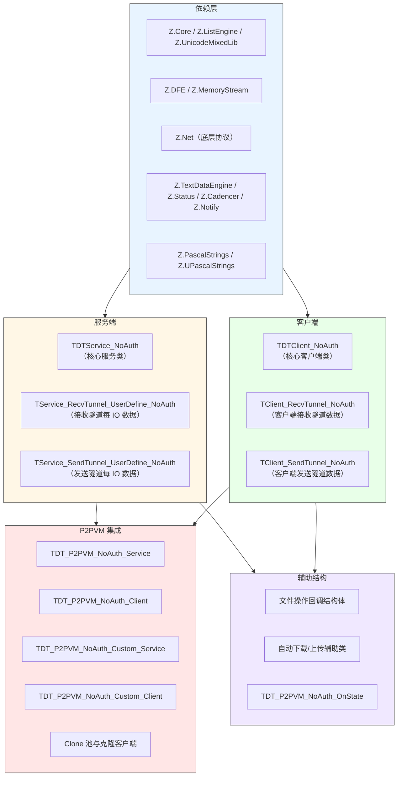
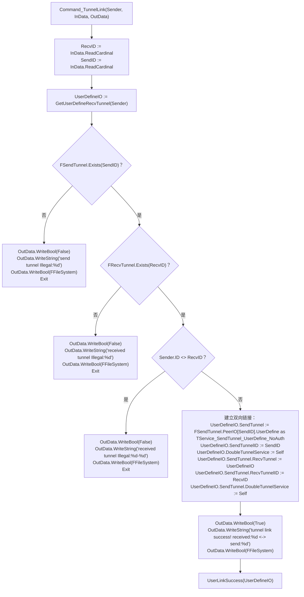
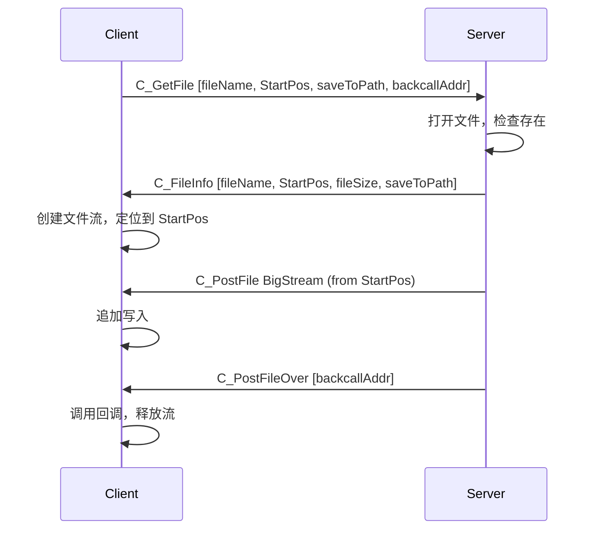
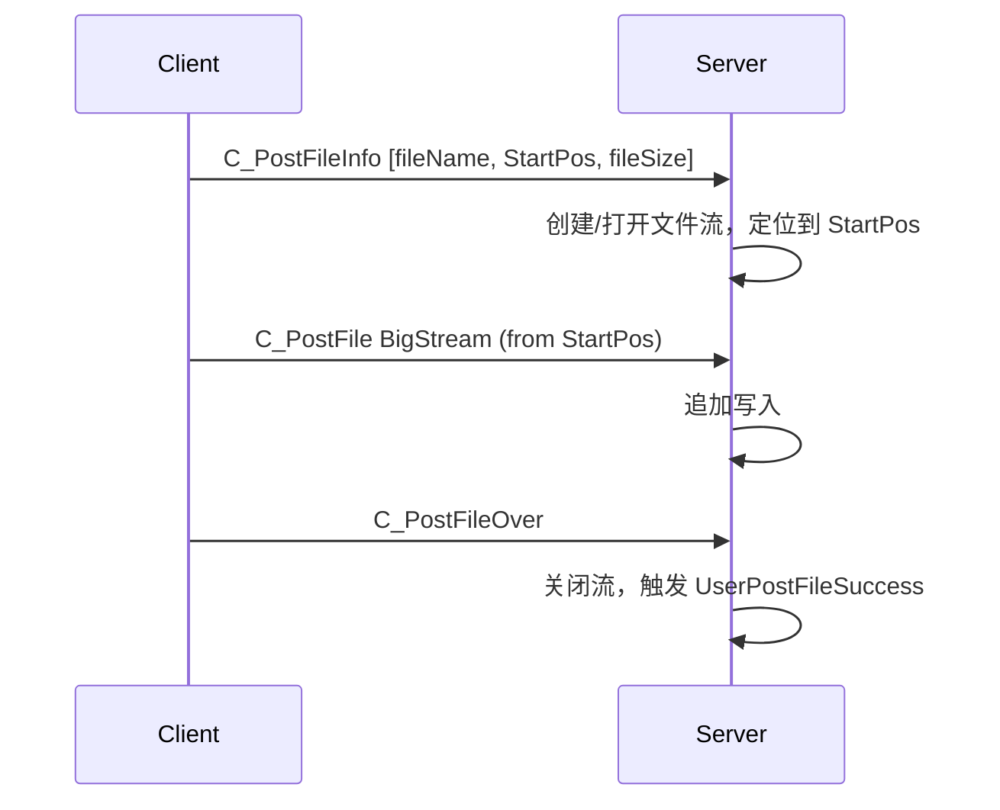

# Z.Net.DoubleTunnelIO.NoAuth 知识库（最终传承版）

> **定位**：面向 AI 与人类工程师的权威参考。目标是让读者**无需翻阅源码**即可安全、准确地使用 `Z.Net.DoubleTunnelIO.NoAuth`。
> **承诺**：所有描述均来自 `Z.Net.DoubleTunnelIO.NoAuth.pas` 的逐行核对。凡我无法从源码确定的，在文末「诚实的不确定清单」中明示。
> **制图约定**：全文流程图/架构图/决策树一律使用 Mermaid，不使用字符制图。

---

## 第 0 章 快速定位：这个单元是什么

`Z.Net.DoubleTunnelIO.NoAuth` 是 Z 框架的**无认证双隧道通信框架**。它提供一对服务端/客户端类，管理**两条独立的物理隧道**（Recv 接收隧道 + Send 发送隧道），实现双向数据流、文件传输、批量流处理，并与 P2PVM（P2P 虚拟网络）集成。



**核心能力**：

| 能力 | 说明 |
|------|------|
| 双隧道管理 | Recv 和 Send 使用不同物理连接，可独立配置 |
| 隧道链接 | `TunnelLink` 交换双方隧道 ID，建立逻辑绑定 |
| 文件传输 | 上传、下载、断点续传、MD5 校验、片段获取 |
| 批量流 | `PostBatchStream` 发送带 MD5 验证的流，支持完成回调 |
| P2PVM | 自动在 P2P 虚拟网络上建立双隧道 |
| 自定义嵌入 | `Custom_Service` / `Custom_Client` 可嵌入现有物理隧道 |
| 克隆技术 | `Create_Clone` 共享物理隧道创建多个逻辑客户端 |
| 定时器同步 | `SyncCadencer` 同步客户端与服务端时间 |

**它不是**：
- **不是**线程安全的（所有操作必须在主线程）。
- **不是**自带认证的（认证由 `VirtualAuth` 等版本提供）。
- **不是**自动重连的（`AutomatedConnection` 需显式开启）。
- **不是**跨进程安全的（批量流回调指针在跨网络时无效）。

---

## 第 1 章 类型与常量

### 1.1 核心类型别名

```pascal
TZNet_DoubleTunnelService_NoAuth = TDTService_NoAuth;
TZNet_DoubleTunnelClient_NoAuth  = TDTClient_NoAuth;
```

### 1.2 命令常量（继承自 Z.Net）

| 常量 | 用途 |
|------|------|
| `C_TunnelLink` | 隧道链接请求 |
| `C_GetCurrentCadencer` | 获取服务端 cadencer 时间 |
| `C_GetFileTime` | 获取文件修改时间 |
| `C_GetFileInfo` | 获取文件存在性与大小 |
| `C_GetFileMD5` | 获取文件 MD5 |
| `C_GetFile` | 下载文件 |
| `C_GetFileAs` | 下载文件并另存 |
| `C_PostFileInfo` | 上传文件元数据 |
| `C_PostFile` | 上传文件数据（BigStream） |
| `C_PostFileOver` | 上传完成标记 |
| `C_GetFileFragmentData` | 获取文件片段 |
| `C_NewBatchStream` | 开始批量流 |
| `C_PostBatchStream` | 批量流数据（BigStream） |
| `C_ClearBatchStream` | 清空批量流 |
| `C_PostBatchStreamDone` | 批量流完成 |
| `C_GetBatchStreamState` | 获取批量流状态 |
| `C_FileInfo` | 服务端发送文件信息给客户端 |
| `C_PostFileFragmentData` | 服务端发送文件片段给客户端 |

### 1.3 回调类型

#### 服务端事件
```pascal
TNoAuth_OnLinkSuccess = procedure(Sender: TDTService_NoAuth; UserDefineIO: TService_RecvTunnel_UserDefine_NoAuth) of object;
TNoAuth_OnUserOut     = procedure(Sender: TDTService_NoAuth; UserDefineIO: TService_RecvTunnel_UserDefine_NoAuth) of object;
```

#### 文件操作回调
| 类型 | 签名 |
|------|------|
| `TGetFileInfo_C_NoAuth` | `procedure(const UserData: Pointer; const UserObject: TCore_Object; const fileName: SystemString; const Existed: Boolean; const fSiz: Int64)` |
| `TFileMD5_C_NoAuth` | `procedure(..., const StartPos, EndPos: Int64; const MD5: TMD5)` |
| `TFileComplete_C_NoAuth` | `procedure(..., stream: TCore_Stream; const fileName: SystemString)` |
| `TFileFragmentData_C_NoAuth` | `procedure(..., const DataPtr: Pointer; const DataSize: Int64; const MD5: TMD5)` |

（M / P 版本类似，分别为 `of object` 和 `reference to` / `is nested`。）

### 1.4 结构体

#### `TDT_P2PVM_NoAuth_OnState`
```pascal
TDT_P2PVM_NoAuth_OnState = record
  On_C: TOnState_C;
  On_M: TOnState_M;
  On_P: TOnState_P;
  procedure Init; // 全部置 nil
end;
```

#### 文件回调结构体
```pascal
PGetFileInfoStruct_NoAuth = ^TGetFileInfoStruct_NoAuth;
TGetFileInfoStruct_NoAuth = record
  UserData: Pointer;
  UserObject: TCore_Object;
  fileName: SystemString;
  OnComplete_C: TGetFileInfo_C_NoAuth;
  OnComplete_M: TGetFileInfo_M_NoAuth;
  OnComplete_P: TGetFileInfo_P_NoAuth;
end;

PFileMD5Struct_NoAuth = ^TFileMD5Struct_NoAuth;
TFileMD5Struct_NoAuth = record
  UserData: Pointer;
  UserObject: TCore_Object;
  fileName: SystemString;
  StartPos, EndPos: Int64;
  OnComplete_C: TFileMD5_C_NoAuth;
  OnComplete_M: TFileMD5_M_NoAuth;
  OnComplete_P: TFileMD5_P_NoAuth;
end;

PRemoteFileBackcall_NoAuth = ^TRemoteFileBackcall_NoAuth;
TRemoteFileBackcall_NoAuth = record
  UserData: Pointer;
  UserObject: TCore_Object;
  OnComplete_C: TFileComplete_C_NoAuth;
  OnComplete_M: TFileComplete_M_NoAuth;
  OnComplete_P: TFileComplete_P_NoAuth;
end;

PFileFragmentDataBackcall_NoAuth = ^TFileFragmentDataBackcall_NoAuth;
TFileFragmentDataBackcall_NoAuth = record
  UserData: Pointer;
  UserObject: TCore_Object;
  fileName: SystemString;
  StartPos, EndPos: Int64;
  OnComplete_C: TFileFragmentData_C_NoAuth;
  OnComplete_M: TFileFragmentData_M_NoAuth;
  OnComplete_P: TFileFragmentData_P_NoAuth;
end;
```

---

## 第 2 章 服务端 `TDTService_NoAuth`

### 2.1 字段

```pascal
TDTService_NoAuth = class(TCore_InterfacedObject_Intermediate)
protected
  FRecvTunnel: TZNet_Server;          // 接收隧道服务端
  FSendTunnel: TZNet_Server;          // 发送隧道服务端
  FCadencerEngine: TCadencer;         // 时间驱动器
  FProgressEngine: TN_Progress_Tool;  // 延迟任务调度器
  FFileSystem: Boolean;               // 是否启用文件系统
  FFileShareDirectory: SystemString;  // 文件共享根目录
  FOnLinkSuccess: TNoAuth_OnLinkSuccess;
  FOnUserOut: TNoAuth_OnUserOut;
public
  property CadencerEngine: TCadencer read FCadencerEngine;
  property ProgressEngine: TN_Progress_Tool read FProgressEngine;
  property FileSystem: Boolean read FFileSystem write FFileSystem;
  property FileReceiveDirectory: SystemString read FFileShareDirectory write FFileShareDirectory;
  property PublicFileDirectory: SystemString read FFileShareDirectory write FFileShareDirectory;
  property FileShareDirectory: SystemString read FFileShareDirectory write FFileShareDirectory;
  property RecvTunnel: TZNet_Server read FRecvTunnel;
  property SendTunnel: TZNet_Server read FSendTunnel;
  property OnLinkSuccess: TNoAuth_OnLinkSuccess read FOnLinkSuccess write FOnLinkSuccess;
  property OnUserOut: TNoAuth_OnUserOut read FOnUserOut write FOnUserOut;
end;
```

### 2.2 构造与析构

```pascal
constructor Create(RecvTunnel_, SendTunnel_: TZNet_Server); virtual;
destructor Destroy; override;
```

**构造流程**：
1. `inherited Create`。
2. `FRecvTunnel := RecvTunnel_`，并设置 `PeerClientUserDefineClass := TService_RecvTunnel_UserDefine_NoAuth`。
3. `FSendTunnel := SendTunnel_`，并设置 `PeerClientUserDefineClass := TService_SendTunnel_UserDefine_NoAuth`。
4. `FRecvTunnel.DoubleChannelFramework := Self`，`FSendTunnel.DoubleChannelFramework := Self`。
5. 创建 `FCadencerEngine`，绑定 `OnProgress := CadencerProgress`。
6. 创建 `FProgressEngine`。
7. `FFileSystem` 由宏 `DoubleIOFileSystem` 决定（默认 False，见不确定清单）。
8. `FFileShareDirectory := umlCurrentPath`，若目录不存在则创建。
9. 调用 `SwitchAsDefaultPerformance`。
10. 事件置 nil。

**析构**：释放 `FCadencerEngine` 和 `FProgressEngine`。

### 2.3 命令注册

```pascal
procedure RegisterCommand; virtual;
procedure UnRegisterCommand; virtual;
```

**注册的命令**：

| 命令 | 注册类型 | 处理器 |
|------|---------|--------|
| `C_TunnelLink` | Stream | `Command_TunnelLink` |
| `C_GetCurrentCadencer` | Stream | `Command_GetCurrentCadencer` |
| `C_GetFileTime` | Stream | `Command_GetFileTime` |
| `C_GetFileInfo` | Stream | `Command_GetFileInfo` |
| `C_GetFileMD5` | Stream | `Command_GetFileMD5` |
| `C_GetFile` | Stream | `Command_GetFile` |
| `C_GetFileAs` | Stream | `Command_GetFileAs` |
| `C_PostFileInfo` | StreamNotify | `Command_PostFileInfo` |
| `C_PostFile` | BigStream | `Command_PostFile` |
| `C_PostFileOver` | StreamNotify | `Command_PostFileOver` |
| `C_GetFileFragmentData` | Stream | `Command_GetFileFragmentData` |
| `C_NewBatchStream` | StreamNotify | `Command_NewBatchStream` |
| `C_PostBatchStream` | BigStream | `Command_PostBatchStream` |
| `C_ClearBatchStream` | StreamNotify | `Command_ClearBatchStream` |
| `C_PostBatchStreamDone` | StreamNotify | `Command_PostBatchStreamDone` |
| `C_GetBatchStreamState` | Stream | `Command_GetBatchStreamState` |

### 2.4 隧道链接 `Command_TunnelLink`

**流程**：



**契约**：
- `RecvID` 必须等于 `Sender.ID`，否则链接失败。
- 成功后，双方 `UserDefine` 互相引用。
- `UserLinkSuccess` 触发 `FOnLinkSuccess` 事件。

### 2.5 文件系统命令

#### `Command_GetFileTime`
- 读取文件名，检查 `umlCombineFileName(FFileShareDirectory, fileName)` 是否存在。
- 存在则返回 `True` + 文件名 + 修改时间；否则返回 `False`。

#### `Command_GetFileInfo`
- 读取文件名，返回 `Existed` + `fSiz`。

#### `Command_GetFileMD5`
- 使用 `RunHPC_StreamM` 在工作线程中计算 MD5。
- `Do_Th_Command_GetFileMD5` 读取文件名、StartPos、EndPos，打开文件，调用 `umlFileMD5` 或 `umlStreamMD5`。
- 返回 `True` + MD5，或 `False`。

#### `Command_GetFile` / `Command_GetFileAs`
- 读取文件名（或另存名）、StartPos、remoteinfo（保存路径）、RemoteBackcallAddr。
- 检查文件存在，打开文件流。
- 通过 `SendTunnel` 发送 `C_FileInfo` 通知（包含文件名、StartPos、文件大小、remoteinfo）。
- 发送 `C_PostFile` BigStream（从 StartPos 开始，`DoneAutoFree=True`）。
- 发送 `C_PostFileOver` 通知（包含 `RemoteBackcallAddr`）。
- 返回成功/失败。

#### `Command_PostFileInfo`
- 接收客户端上传的文件元数据（文件名、StartPos、FSize）。
- 若 StartPos > 0 且文件存在，以读写模式打开并定位到 StartPos；否则创建新文件。
- 保存到 `UserDefineIO.FCurrentFileStream` 和 `FCurrentReceiveFileName`。

#### `Command_PostFile`
- 接收 BigStream 数据块，追加写入 `FCurrentFileStream`。

#### `Command_PostFileOver`
- 关闭并释放 `FCurrentFileStream`，触发 `UserPostFileSuccess`。

#### `Command_GetFileFragmentData`
- 读取文件名、StartPos、EndPos、RemoteBackcallAddr。
- 打开文件，计算片段大小，构建 `TMS64`：写入回调地址、StartPos、EndPos、大小、数据、MD5。
- 通过 `SendCompleteBuffer(C_PostFileFragmentData, ...)` 发送。

### 2.6 批量流命令

#### `Command_NewBatchStream`
- 创建新的 `PBigStreamBatchPostData`。
- 读取远程 MD5 和完成回调指针。

#### `Command_PostBatchStream`
- 追加数据到 `BigStreamBatchList.Last^.Source`。
- 当 `Source.Size >= BigStreamTotal` 时，计算 `SourceMD5`。
- 若有完成回调指针，通过 `SendTunnel` 发送 `C_PostBatchStreamDone`（包含远程 MD5、源 MD5、回调指针）。

#### `Command_ClearBatchStream`
- 清空 `BigStreamBatchList`。

#### `Command_PostBatchStreamDone`
- 读取远程 MD5、源 MD5、回调指针。
- 比较 MD5，根据结果调用回调（C/M/P 第一个已赋值的）。
- 释放回调指针。

#### `Command_GetBatchStreamState`
- 遍历 `BigStreamBatchList`，编码每个 `PBigStreamBatchPostData` 到 `OutData`。

### 2.7 服务端主动发送批量流

```pascal
procedure PostBatchStream(cli: TPeerIO; stream: TCore_Stream; doneFreeStream: Boolean);
procedure PostBatchStreamC(cli: TPeerIO; stream: TCore_Stream; doneFreeStream: Boolean; OnCompletedBackcall: TOnState_C);
procedure PostBatchStreamM(...);
procedure PostBatchStreamP(...);
procedure ClearBatchStream(cli: TPeerIO);
procedure GetBatchStreamStateM(cli: TPeerIO; OnResult: TOnStream_M); overload;
procedure GetBatchStreamStateM(cli: TPeerIO; Param1, Param2; OnResult: TOnStreamParam_M); overload;
procedure GetBatchStreamStateP(cli: TPeerIO; OnResult: TOnStream_P); overload;
procedure GetBatchStreamStateP(cli: TPeerIO; Param1, Param2; OnResult: TOnStreamParam_P); overload;
```

**`PostBatchStream` 流程**：
1. 创建 `TDFE`，写入 `umlStreamMD5(stream)` 和 `nil` 回调指针。
2. 发送 `C_NewBatchStream` 通知。
3. 发送 `C_PostBatchStream` BigStream。

**`PostBatchStreamC/M/P` 流程**：与 `PostBatchStream` 类似，但若 `OnCompletedBackcall` 已赋值，则 `new(p)` 填充回调，写入 DFE。

### 2.8 进度与事件

```pascal
procedure Progress; virtual;
procedure CadencerProgress(Sender: TObject; const deltaTime, newTime: Double); virtual;
```

**`Progress`**：`FCadencerEngine.Progress` → `FRecvTunnel.Progress` → `FSendTunnel.Progress`。

**`CadencerProgress`**：`FProgressEngine.Progress(deltaTime)`。

### 2.9 性能模式切换

```pascal
procedure SwitchAsMaxPerformance;
procedure SwitchAsMaxSecurity;
procedure SwitchAsDefaultPerformance;
```

分别调用两个隧道的对应方法。

---

## 第 3 章 客户端 `TDTClient_NoAuth`

### 3.1 字段

```pascal
TDTClient_NoAuth = class(TCore_InterfacedObject_Intermediate, IZNet_ClientInterface)
protected
  FSendTunnel: TZNet_Client;          // 发送隧道客户端
  FRecvTunnel: TZNet_Client;          // 接收隧道客户端
  FFileSystem: Boolean;               // 是否启用文件系统（由服务端告知）
  FAutoFreeTunnel: Boolean;           // 析构时是否释放隧道
  FLinkOk: Boolean;                   // 双隧道链接是否建立
  FWaitCommandTimeout: Cardinal;      // 同步命令超时（默认 5000ms）
  FCurrentStream: TCore_Stream;       // 当前接收文件流
  FCurrentReceiveStreamFileName: SystemString;
  FCadencerEngine: TCadencer;
  FProgressEngine: TN_Progress_Tool;
  FLastCadencerTime: Double;
  FServerDelay: Double;
  // 异步连接状态
  FAsyncConnectAddr: SystemString;
  FAsyncConnRecvPort: Word;
  FAsyncConnSendPort: Word;
  FAsyncOnResult_C: TOnState_C;
  FAsyncOnResult_M: TOnState_M;
  FAsyncOnResult_P: TOnState_P;
public
  property FileSystem: Boolean read FFileSystem;
  property AutoFreeTunnel: Boolean read FAutoFreeTunnel write FAutoFreeTunnel;
  property LinkOk: Boolean read FLinkOk;
  property BindOk: Boolean read FLinkOk;
  property WaitCommandTimeout: Cardinal read FWaitCommandTimeout write FWaitCommandTimeout;
  property CadencerEngine: TCadencer read FCadencerEngine;
  property ProgressEngine: TN_Progress_Tool read FProgressEngine;
  property ServerDelay: Double read FServerDelay;
  property RecvTunnel: TZNet_Client read FRecvTunnel;
  property SendTunnel: TZNet_Client read FSendTunnel;
end;
```

### 3.2 构造与析构

```pascal
constructor Create(RecvTunnel_, SendTunnel_: TZNet_Client); virtual;
destructor Destroy; override;
```

**构造流程**：
1. `inherited Create`。
2. 设置 `FRecvTunnel` / `FSendTunnel`，`NotyifyInterface := Self`，`PeerClientUserDefineClass` 分别为 `TClient_RecvTunnel_NoAuth` 和 `TClient_SendTunnel_NoAuth`。
3. 设置 `DoubleChannelFramework := Self`。
4. `FFileSystem := False`，`FAutoFreeTunnel := False`，`FLinkOk := False`。
5. `FWaitCommandTimeout := 5000`。
6. 创建 `FCadencerEngine` 和 `FProgressEngine`。
7. 初始化异步连接字段。
8. 调用 `SwitchAsDefaultPerformance`。

**析构**：释放 `FCurrentStream`，清除 `NotyifyInterface`，若 `AutoFreeTunnel` 则释放隧道，释放 `FCadencerEngine` 和 `FProgressEngine`。

### 3.3 连接与链接

#### 同步连接 `Connect`
```pascal
function Connect(addr: SystemString; const RecvPort, SendPort: Word): Boolean;
```
- 先 `Disconnect`。
- 连接 `SendTunnel` 和 `RecvTunnel`。
- 等待最多 10 秒直到 `RemoteInited`。
- 返回 `Connected`。

#### 异步连接 `AsyncConnectC/M/P`
```pascal
procedure AsyncConnectC(addr: SystemString; const RecvPort, SendPort: Word; OnResult: TOnState_C);
procedure AsyncConnectM(...);
procedure AsyncConnectP(...);
// 带参数的版本
procedure AsyncConnectC(addr; RecvPort, SendPort; Param1, Param2; OnResult: TOnParamState_C);
...
```
- 先 `Disconnect`。
- 保存地址、端口、回调。
- 调用 `SendTunnel.AsyncConnectM(addr, SendPort, AsyncSendConnectResult)`。
- 发送隧道连接成功后，`AsyncSendConnectResult` 会连接接收隧道，然后调用用户回调。

#### 隧道链接
```pascal
function TunnelLink: Boolean; virtual;   // 同步
procedure TunnelLinkC(On_C: TOnState_C); virtual;
procedure TunnelLinkM(On_M: TOnState_M); virtual;
procedure TunnelLinkP(On_P: TOnState_P); virtual;
```
- 同步版本发送 `C_TunnelLink`，等待响应。
- 响应成功时设置 `FLinkOk := True`，并建立 `TClient_SendTunnel_NoAuth` 和 `TClient_RecvTunnel_NoAuth` 的互相引用。
- `FFileSystem` 从响应中读取（若存在）。

#### 断开 `Disconnect`
- 断开两个隧道，清空异步连接状态。

### 3.4 文件操作 API

#### 获取文件信息
```pascal
procedure GetFileInfoC(fileName: SystemString; UserData: Pointer; UserObject: TCore_Object; OnComplete: TGetFileInfo_C_NoAuth);
procedure GetFileInfoM(...);
procedure GetFileInfoP(...);
```

#### 获取文件 MD5
```pascal
procedure GetFileMD5C(fileName: SystemString; StartPos, EndPos: Int64; UserData; UserObject; OnComplete: TFileMD5_C_NoAuth);
procedure GetFileMD5M(...);
procedure GetFileMD5P(...);
```

#### 下载文件（异步）
```pascal
procedure GetFileC(fileName, saveToPath: SystemString; UserData; UserObject; OnComplete_C: TFileComplete_C_NoAuth); overload;
procedure GetFileC(fileName: SystemString; StartPos: Int64; saveToPath: SystemString; ...); overload; // 断点续传
procedure GetFileAsC(fileName, saveFileName, saveToPath: SystemString; ...); overload;
procedure GetFileAsC(fileName, saveFileName: SystemString; StartPos: Int64; saveToPath: SystemString; ...); overload;
// M / P 版本类似
```

#### 下载文件（同步）
```pascal
function GetFile(fileName, saveToPath: SystemString): Boolean; overload;
function GetFile(fileName: SystemString; StartPos: Int64; saveToPath: SystemString): Boolean; overload;
```

#### 获取文件片段
```pascal
procedure GetFileFragmentDataC(fileName: SystemString; StartPos, EndPos: Int64; UserData; UserObject; OnComplete_C: TFileFragmentData_C_NoAuth);
procedure GetFileFragmentDataM(...);
procedure GetFileFragmentDataP(...);
```

#### 自动下载并校验
```pascal
procedure AutomatedDownloadFileC(remoteFile, localFile: U_String; OnDownloadDone: TFileComplete_C_NoAuth);
procedure AutomatedDownloadFileM(...);
procedure AutomatedDownloadFileP(...);
```
内部使用 `TAutomatedDownloadFile_Struct_NoAuth`：
1. 获取远程文件信息。
2. 若本地不存在，直接下载。
3. 若本地存在，获取远程 MD5（从 0 到本地文件大小），在线程中计算本地 MD5，比较。
4. 若 MD5 相同且大小一致，完成；否则从本地大小处续传或重新下载。

#### 上传文件
```pascal
procedure PostFile(fileName: SystemString); overload;
procedure PostFile(l_fileName, r_fileName: SystemString); overload;
procedure PostFile(fileName: SystemString; StartPos: Int64); overload;
procedure PostFile(l_fileName, r_fileName: SystemString; StartPos: Int64); overload;
procedure PostFile(fn: SystemString; stream: TCore_Stream; doneFreeStream: Boolean); overload;
procedure PostFile(fn: SystemString; stream: TCore_Stream; StartPos: Int64; doneFreeStream: Boolean); overload;
```
- 发送 `C_PostFileInfo`、`C_PostFile` BigStream、`C_PostFileOver`。
- 服务端接收后写入 `FileShareDirectory`。

#### 自动上传
```pascal
procedure AutomatedUploadFile(localFile: U_String);
```
内部使用 `TAutomatedUploadFile_Struct_NoAuth`：
1. 获取远程文件信息。
2. 若远程不存在或比本地小，直接上传。
3. 若远程存在且大小 >= 本地，获取远程 MD5（从 0 到本地大小），在线程中计算本地 MD5，比较。
4. 若 MD5 不同，从 0 重新上传；若相同且本地更大，从远程大小续传。

### 3.5 批量流 API

```pascal
procedure PostBatchStream(stream: TCore_Stream; doneFreeStream: Boolean); overload;
procedure PostBatchStreamC(stream: TCore_Stream; doneFreeStream: Boolean; OnCompletedBackcall: TOnState_C); overload;
procedure PostBatchStreamM(...);
procedure PostBatchStreamP(...);
procedure ClearBatchStream;
procedure GetBatchStreamStateM(OnResult: TOnStream_M); overload;
procedure GetBatchStreamStateM(Param1, Param2; OnResult: TOnStreamParam_M); overload;
procedure GetBatchStreamStateP(OnResult: TOnStream_P); overload;
procedure GetBatchStreamStateP(Param1, Param2; OnResult: TOnStreamParam_P); overload;
function GetBatchStreamState(Result_: TDFE; TimeOut_: TTimeTick): Boolean; overload;
```

### 3.6 定时器同步

```pascal
procedure SyncCadencer;
```
- 发送 `C_GetCurrentCadencer` 并带上本地 cadencer 时间。
- 收到响应后计算 `FServerDelay := 本地时间 - 服务端时间`，并调整本地 cadencer 的 `CurrentTime`。

### 3.7 客户端命令注册

```pascal
procedure RegisterCommand; virtual;
procedure UnRegisterCommand; virtual;
```

**注册的命令**：

| 命令 | 注册类型 | 处理器 |
|------|---------|--------|
| `C_FileInfo` | StreamNotify | `Command_FileInfo` |
| `C_PostFile` | BigStream | `Command_PostFile` |
| `C_PostFileOver` | StreamNotify | `Command_PostFileOver` |
| `C_PostFileFragmentData` | CompleteBuffer | `Command_PostFileFragmentData` |
| `C_NewBatchStream` | StreamNotify | `Command_NewBatchStream` |
| `C_PostBatchStream` | BigStream | `Command_PostBatchStream` |
| `C_ClearBatchStream` | StreamNotify | `Command_ClearBatchStream` |
| `C_PostBatchStreamDone` | StreamNotify | `Command_PostBatchStreamDone` |
| `C_GetBatchStreamState` | Stream | `Command_GetBatchStreamState` |

### 3.8 客户端接收处理器

#### `Command_FileInfo`
- 读取文件名、StartPos、FSize、remoteinfo（保存路径）。
- 创建目录，打开文件流（`fmCreate` 或 `fmOpenReadWrite` + 定位）。
- 保存到 `FCurrentStream` 和 `FCurrentReceiveStreamFileName`。

#### `Command_PostFile`
- 追加数据到 `FCurrentStream`。

#### `Command_PostFileOver`
- 读取 `RemoteBackcallAddr`。
- 若有回调，调用（C/M/P 第一个已赋值的），并 `Dispose` 回调指针。
- 释放 `FCurrentStream`。

#### `Command_PostFileFragmentData`
- 解析 `TMS64`：回调地址、StartPos、EndPos、大小、数据、MD5。
- 调用回调（C/M/P），传入数据指针、大小、MD5。
- `Dispose` 回调指针。

#### `Command_NewBatchStream`
- 创建新的 `PBigStreamBatchPostData`，读取远程 MD5 和完成回调指针。

#### `Command_PostBatchStream`
- 追加数据到 `BigStreamBatchList.Last^.Source`。
- 当 `Source.Size >= BigStreamTotal` 时，计算 `SourceMD5`。
- 若有完成回调指针，通过 `SendTunnel` 发送 `C_PostBatchStreamDone`。

#### `Command_ClearBatchStream`
- 清空 `BigStreamBatchList`。

#### `Command_PostBatchStreamDone`
- 读取远程 MD5、源 MD5、回调指针。
- 比较 MD5，调用回调（C/M/P），`Dispose` 回调指针。

#### `Command_GetBatchStreamState`
- 遍历 `BigStreamBatchList`，编码到 `OutData`。

### 3.9 客户端状态查询

```pascal
function Connected: Boolean; virtual;
function IOBusy: Boolean;
function RemoteInited: Boolean;
```

**`Connected`**：`FSendTunnel.Connected and FRecvTunnel.Connected`。
**`IOBusy`**：`FSendTunnel.IOBusy and FRecvTunnel.IOBusy`（注意是 `and`，实际可能应为 `or`？见不确定清单）。
**`RemoteInited`**：`FSendTunnel.RemoteInited and FRecvTunnel.RemoteInited`。

---

## 第 4 章 文件传输

### 4.1 下载流程



### 4.2 上传流程



### 4.3 文件片段获取

- 客户端发送 `C_GetFileFragmentData`，包含文件名、StartPos、EndPos、回调地址。
- 服务端读取片段，构建 `TMS64`（回调地址、StartPos、EndPos、大小、数据、MD5）。
- 通过 `SendCompleteBuffer(C_PostFileFragmentData, ...)` 发送。
- 客户端 `Command_PostFileFragmentData` 解析并调用回调。

### 4.4 自动下载/上传

**自动下载**：
1. 获取远程文件信息。
2. 本地不存在 → 直接下载。
3. 本地存在 → 获取远程 MD5（0 到本地文件大小），线程计算本地 MD5。
4. MD5 相同且大小一致 → 完成；否则从本地大小续传或重新下载。

**自动上传**：
1. 获取远程文件信息。
2. 远程不存在或比本地小 → 直接上传。
3. 远程存在且大小 >= 本地 → 获取远程 MD5（0 到本地大小），线程计算本地 MD5。
4. MD5 不同 → 从头上传；相同且本地更大 → 从远程大小续传。

---

## 第 5 章 批量流

### 5.1 设计

批量流用于发送一组带 MD5 校验的数据块。发送方发送 `C_NewBatchStream`（包含远程 MD5 和完成回调指针），然后发送 `C_PostBatchStream` BigStream。接收方累积数据，当大小达到 `BigStreamTotal` 时计算源 MD5，若提供回调指针，则发送 `C_PostBatchStreamDone` 通知发送方。发送方比较 MD5，调用回调。

### 5.2 关键陷阱

- **回调指针跨网络无效**：`WritePointer` 写入的是发送进程内的地址，接收方 `ReadPointer` 读出的地址在接收进程内无效。除非双方在同一进程（IPC 模式），否则会崩溃。**跨网络使用时禁止依赖完成回调**。

---

## 第 6 章 P2PVM 集成

### 6.1 `TDT_P2PVM_NoAuth_Service`

```pascal
constructor Create(ServiceClass_: TDTService_NoAuthClass; Physics_Class: TZNet_ServerClass);
destructor Destroy; override;
procedure Progress; virtual;
function StartService(ListenAddr, ListenPort, Auth: SystemString): Boolean;
procedure StopService;
property QuietMode: Boolean read GetQuietMode write SetQuietMode;
```

**构造**：
- 创建 `RecvTunnel` / `SendTunnel`（`TZNet_WithP2PVM_Server`）。
- 创建 `DTService`（`ServiceClass_.Create`），注册命令，设置默认性能。
- 创建 `PhysicsTunnel`（`Physics_Class.Create`）。
- 将 `RecvTunnel` / `SendTunnel` 添加到 `PhysicsTunnel.AutomatedP2PVMBindService`。
- 设置 `AutomatedP2PVMService := True`。
- 设置名称前缀。

**`StartService`**：
- `RecvTunnel.StartService('::', 1)`，`SendTunnel.StartService('::', 2)`。
- `PhysicsTunnel.AutomatedP2PVMAuthToken := Auth`。
- `PhysicsTunnel.StartService(ListenAddr, umlStrToInt(ListenPort))`。

### 6.2 `TDT_P2PVM_NoAuth_Client`

```pascal
constructor Create(ClientClass_: TDTClient_NoAuthClass; Physics_Class: TZNet_ClientClass);
destructor Destroy; override;
procedure Progress; virtual;
procedure Connect(addr, Port, Auth: SystemString);
procedure Connect_C/M/P(addr, Port, Auth; OnResult);
procedure Disconnect;
property QuietMode: Boolean read GetQuietMode write SetQuietMode;
```

**构造**：
- 创建 `RecvTunnel` / `SendTunnel`（`TZNet_WithP2PVM_Client`）。
- 创建 `DTClient`（`ClientClass_.Create`），注册命令，设置默认性能。
- 创建 `PhysicsTunnel`（`Physics_Class.Create`）。
- 将 `SendTunnel` / `RecvTunnel` 添加到 `PhysicsTunnel.AutomatedP2PVMBindClient`。
- 设置 `AutomatedP2PVMClient := True`，`AutomatedP2PVMClientDelayBoot := 0`。
- 设置 `AutomatedConnection := True`。

**`Connect`**：
- 保存地址、端口、认证。
- 设置 `PhysicsTunnel.AutomatedP2PVMAuthToken := Auth`。
- 设置 `PhysicsTunnel.OnAutomatedP2PVMClientConnectionDone_M := DoAutomatedP2PVMClientConnectionDone`。
- `PhysicsTunnel.AsyncConnectM(addr, Port, DoConnectionResult)`。

**`DoAutomatedP2PVMClientConnectionDone`**：调用 `DTClient.TunnelLinkM(DoTunnelLinkResult)`。

**`DoTunnelLinkResult`**：若成功，设置 `Reconnection := True`，触发 `OnTunnelLink`。

**`Progress`**：若 `AutomatedConnection` 且未连接且未在连接中且 `Reconnection`，自动重连。

### 6.3 `TDT_P2PVM_NoAuth_Custom_Service`

用于嵌入现有物理隧道服务端。

```pascal
constructor Create(ServiceClass_: TDTService_NoAuthClass; PhysicsTunnel_: TZNet_Server;
  P2PVM_Recv_Name_, P2PVM_Recv_IP6_, P2PVM_Recv_Port_,
  P2PVM_Send_Name_, P2PVM_Send_IP6_, P2PVM_Send_Port_: SystemString);
procedure StartService(); virtual;
procedure StopService(); virtual;
```

**注意**：`StopService` 源码中两次调用 `RecvTunnel.StopService`，疑似 bug（应为 `SendTunnel.StopService`）。

### 6.4 `TDT_P2PVM_NoAuth_Custom_Client`

用于嵌入现有物理隧道客户端，支持克隆。

```pascal
constructor Create(ClientClass_: TDTClient_NoAuthClass; PhysicsTunnel_: TZNet_Client;
  P2PVM_Recv_Name_, P2PVM_Recv_IP6_, P2PVM_Recv_Port_,
  P2PVM_Send_Name_, P2PVM_Send_IP6_, P2PVM_Send_Port_: SystemString);
constructor Create_Clone(Parent_Client_: TDT_P2PVM_NoAuth_Custom_Client);
procedure Progress;
procedure Connect();
procedure Connect_C/M/P(OnResult);
procedure Disconnect;
```

**克隆机制**：
- `Create_Clone` 要求父客户端已连接（`DTClient.LinkOk`）。
- 克隆共享 `Bind_PhysicsTunnel`，创建新的 `RecvTunnel` / `SendTunnel`（前缀 'DT'）。
- 安装到 P2PVM，并异步连接。
- 父客户端的 `Clone_Pool` 管理所有克隆，`Progress` 中会遍历克隆并调用其 `Progress`。

### 6.5 P2PVM 状态记录 `TDT_P2PVM_NoAuth_OnState`

```pascal
TDT_P2PVM_NoAuth_OnState = record
  On_C: TOnState_C;
  On_M: TOnState_M;
  On_P: TOnState_P;
  procedure Init;
end;
```

**`Init`** 将所有回调置 nil。

---

## 第 7 章 完整使用范式

### 7.1 最小服务端与客户端

```pascal
// 服务端
var
  RecvTunnel, SendTunnel: TZNet_Server;
  Service: TDTService_NoAuth;
begin
  RecvTunnel := TZNet_Server.Create;
  SendTunnel := TZNet_Server.Create;
  Service := TDTService_NoAuth.Create(RecvTunnel, SendTunnel);
  Service.RegisterCommand;
  Service.FileSystem := True;
  Service.FileShareDirectory := 'C:\Share';
  RecvTunnel.StartService('0.0.0.0', 9810);
  SendTunnel.StartService('0.0.0.0', 9811);
  while True do
    begin
      Service.Progress;
      Sleep(10);
    end;
end;

// 客户端
var
  Client: TDTClient_NoAuth;
begin
  Client := TDTClient_NoAuth.Create(RecvClient, SendClient);
  Client.RegisterCommand;
  if Client.Connect('127.0.0.1', 9810, 9811) then
    begin
      Client.TunnelLink; // 建立逻辑链接
      // 使用 API
    end;
  while True do
    begin
      Client.Progress;
      Sleep(10);
    end;
end;
```

### 7.2 上传文件

```pascal
Client.PostFile('C:\local\file.dat');
```

### 7.3 下载文件（异步）

```pascal
Client.GetFileM('remote.dat', 'C:\download',
  procedure(const UserData: Pointer; const UserObject: TCore_Object; stream: TCore_Stream; const fileName: SystemString)
  begin
    // 文件已下载到 stream，可保存或处理
  end);
```

### 7.4 下载文件（同步）

```pascal
if Client.GetFile('remote.dat', 'C:\download') then
  WriteLn('下载成功');
```

### 7.5 获取文件 MD5

```pascal
Client.GetFileMD5M('remote.dat', 0, 0,
  procedure(const UserData: Pointer; const UserObject: TCore_Object; const fileName: SystemString; const StartPos, EndPos: Int64; const MD5: TMD5)
  begin
    WriteLn(umlMD5ToStr(MD5).Text);
  end);
```

### 7.6 自动下载

```pascal
Client.AutomatedDownloadFileM('remote.dat', 'C:\local.dat',
  procedure(const UserData: Pointer; const UserObject: TCore_Object; stream: TCore_Stream; const fileName: SystemString)
  begin
    // 完成
  end);
```

### 7.7 批量流

```pascal
var
  stream: TMS64;
begin
  stream := TMS64.Create;
  stream.WriteString('batch data');
  Client.PostBatchStreamM(stream, True,
    procedure(State: Boolean)
    begin
      WriteLn('批量流完成，MD5 验证: ', State);
    end);
end;
```

### 7.8 P2PVM 服务

```pascal
var
  P2PService: TDT_P2PVM_NoAuth_Service;
begin
  P2PService := TDT_P2PVM_NoAuth_Service.Create(TDTService_NoAuth, TZNet_Server);
  P2PService.StartService('0.0.0.0', '9810', 'myAuthToken');
  while True do
    begin
      P2PService.Progress;
      Sleep(10);
    end;
end;
```

### 7.9 P2PVM 客户端

```pascal
var
  P2PClient: TDT_P2PVM_NoAuth_Client;
begin
  P2PClient := TDT_P2PVM_NoAuth_Client.Create(TDTClient_NoAuth, TZNet_Client);
  P2PClient.Connect_M('127.0.0.1', '9810', 'myAuthToken',
    procedure(State: Boolean)
    begin
      if State then
        WriteLn('P2PVM 连接成功');
    end);
  while True do
    begin
      P2PClient.Progress;
      Sleep(10);
    end;
end;
```

---

## 第 8 章 反例集

### 8.1 未调用 `TunnelLink` 就使用文件系统

```pascal
Client.Connect(...); // 仅物理连接
Client.PostFile(...); // ❌ FFileSystem 仍为 False，直接退出
```

**✅ 正确**：`Client.TunnelLink;` 后再使用。

### 8.2 跨网络使用批量流回调指针

```pascal
// ❌ 客户端 A 发送回调指针，服务端 B 尝试调用
Client.PostBatchStreamM(stream, True, MyCallback);
// 服务端 B 的 Command_PostBatchStreamDone 会尝试执行该指针 → 崩溃
```

**✅ 正确**：跨网络时不要使用带完成回调的批量流，或改用其他通知机制。

### 8.3 在 `OnUserOut` 中释放资源后继续使用

```pascal
Service.OnUserOut :=
  procedure(Sender: TDTService_NoAuth; UserDefineIO: TService_RecvTunnel_UserDefine_NoAuth)
  begin
    UserDefineIO.Free; // ❌ 框架还会访问
  end;
```

**✅ 正确**：仅做清理通知，不要释放框架管理的对象。

### 8.4 客户端同时使用 `GetFile` 同步和异步版本

```pascal
Client.GetFileM(...); // 异步
Client.GetFile(...);  // 同步，会阻塞
```

**注意**：同步版本会忙等，可能阻塞 UI。建议在非 UI 线程使用。

### 8.5 `AutomatedDownloadFile` 未处理本地文件不存在的情况

```pascal
// 内部逻辑已处理，但若远程文件不存在，会调用 DoStatus 并释放结构体
```

### 8.6 `TDT_P2PVM_NoAuth_Custom_Service.StopService` 的 bug

```pascal
// ❌ 源码中两次 RecvTunnel.StopService，SendTunnel 未停止
// 需手动调用 SendTunnel.StopService
```

**✅ 正确**：调用后手动停止 SendTunnel。

### 8.7 克隆客户端未等待父客户端链接

```pascal
Parent := TDT_P2PVM_NoAuth_Custom_Client.Create(...);
Clone := TDT_P2PVM_NoAuth_Custom_Client.Create_Clone(Parent); // ❌ 父未 LinkOk，抛异常
```

**✅ 正确**：等待父客户端 `DTClient.LinkOk` 后再克隆。

### 8.8 忽略 `RemoteInited`

```pascal
Client.Connect(...); // 返回 True 表示物理连接
Client.SendTunnel.SendStreamCmd(...); // ❌ RemoteInited 可能仍为 False
```

**✅ 正确**：等待 `RemoteInited` 或使用 `TunnelLink`。

---

## 第 9 章 常见错误对照表

| 现象 | 根因 | 修正 |
|------|------|------|
| 文件上传/下载无反应 | `FFileSystem=False` | 服务端设置 `FileSystem=True`，客户端等待 `TunnelLink` |
| `TunnelLink` 失败 | RecvID 与 Sender.ID 不匹配 | 检查客户端发送的 ID |
| 批量流完成回调崩溃 | 跨网络指针无效 | 避免跨网络使用完成回调 |
| `PostFile` 后文件不完整 | 未发送 `C_PostFileOver` | 框架自动发送，检查是否异常中断 |
| 自动下载 MD5 不一致 | 本地文件在计算 MD5 时被修改 | 确保文件稳定 |
| P2PVM 连接失败 | 认证 token 错误 | 检查 `Auth` 参数 |
| 克隆客户端连接失败 | 父客户端未 `LinkOk` | 等待父客户端链接成功 |
| `StopService` 后 SendTunnel 仍在监听 | `TDT_P2PVM_NoAuth_Custom_Service` bug | 手动停止 SendTunnel |
| 同步 `GetFile` 超时 | `WaitCommandTimeout` 太小 | 增大 `WaitCommandTimeout` |
| `IOBusy` 始终 False | 源码用 `and` 而非 `or` | 注意其语义，可能需自行判断 |

---

## 第 10 章 诚实的不确定清单

> 以下是我从源码**无法完全确定**的点。若 AI 需要在这些场景下工作，**必须回查源码或询问人类**。

1. **`FFileSystem` 默认值**
   - 源码：`FFileSystem := {$IFDEF DoubleIOFileSystem}True{$ELSE DoubleIOFileSystem}False{$ENDIF DoubleIOFileSystem};`
   - **不确定**：`DoubleIOFileSystem` 宏是否在默认编译中定义。
   - **推测**：默认未定义，因此 `FFileSystem=False`。

2. **`TDT_P2PVM_NoAuth_Custom_Service.StopService` 的两次 `RecvTunnel.StopService`**
   - 源码：`RecvTunnel.StopService; RecvTunnel.StopService;`
   - **不确定**：是否应为 `SendTunnel.StopService`。
   - **推测**：**是 bug**，第二个应为 `SendTunnel`。

3. **`TDTClient_NoAuth.IOBusy` 使用 `and` 而非 `or`**
   - 源码：`Result := FSendTunnel.IOBusy and FRecvTunnel.IOBusy;`
   - **不确定**：是否有意（仅当两者都忙才认为忙）。
   - **推测**：可能应为 `or`，表示任一忙即忙。

4. **批量流完成回调的指针传递**
   - 源码：`de.WritePointer(p)` 写入进程内地址，对端 `ReadPointer` 读出后直接调用。
   - **不确定**：是否仅在 IPC 模式下有效。
   - **推测**：**跨网络无效，会崩溃**。

5. **`TDT_P2PVM_NoAuth_Custom_Client.Progress` 中 `AutomatedP2PVMClientConnectionDone` 的调用**
   - 源码：`Bind_PhysicsTunnel.AutomatedP2PVMClientConnectionDone(Bind_PhysicsTunnel.ClientIO)`
   - **不确定**：`AutomatedP2PVMClientConnectionDone` 的签名和返回值。
   - **推测**：是 `Z.Net` 中的函数，判断 P2PVM 是否完成。

6. **`Command_GetFile` 中 `SendBigStream` 的 `StartPos` 参数**
   - 源码：`fs.Position := 0; UserDefineIO.SendTunnel.Owner.SendBigStream(C_PostFile, fs, StartPos, True);`
   - **不确定**：`SendBigStream` 是否内部会 seek 到 `StartPos`。
   - **推测**：是，否则 `fs.Position := 0` 与 `StartPos` 矛盾。

7. **`Command_GetFileFragmentData` 中 `mem_.DiscardMemory` 后 `DisposeObject(mem_)`**
   - 源码：`mem_.DiscardMemory; DisposeObject(mem_);`
   - **不确定**：`DiscardMemory` 后 `DisposeObject` 是否安全（内存已置 nil）。
   - **推测**：安全，`DiscardMemory` 仅清空字段，不释放内存。

8. **`TDTClient_NoAuth.Command_PostFileOver` 中 `Dispose(p)` 的所有权**
   - 源码：`Dispose(p);` 但 `p` 是客户端 `GetFileC` 中 `new` 分配的。
   - **不确定**：若服务端从未响应，`p` 是否泄漏。
   - **推测**：可能泄漏，除非客户端超时处理。

9. **`TDTClient_NoAuth.GetFile_StreamParamResult` 中 `Dispose(p)`**
   - 源码：`p := Param1; Dispose(p);`
   - **不确定**：`p` 是 `PRemoteFileBackcall_NoAuth`，在 `GetFileC` 中 `new`。
   - **推测**：正常释放。

10. **`TDT_P2PVM_NoAuth_Client.Connect` 中 `Reconnection` 标志**
    - 源码：`if not Reconnection then` 保存地址。
    - **不确定**：首次连接时 `Reconnection=False`，保存地址；重连时 `Reconnection=True`，不保存。正确。

11. **`TDT_P2PVM_NoAuth_Custom_Client.Create_Clone` 中 `RaiseInfo`**
    - 源码：`if not Parent_Client_.AutomatedConnection then RaiseInfo('Host not established');`
    - **不确定**：`AutomatedConnection` 是否表示已连接。
    - **推测**：`AutomatedConnection=True` 表示启用了自动连接，但未必已连接。

12. **`TDTService_NoAuth.UserPostFileSuccess` 空实现**
    - 源码：空。
    - **不确定**：是否应被子类重写。
    - **推测**：是，用于通知文件接收完成。

13. **`TClient_RecvTunnel_NoAuth` / `TClient_SendTunnel_NoAuth` 的 `Client` / `SendTunnel` / `RecvTunnel` 字段**
    - 在 `TunnelLink_OnResult` 中设置。
    - **不确定**：若未调用 `TunnelLink`，这些字段为 nil。
    - **推测**：是，使用前需确保 `LinkOk`。

14. **`TDTService_NoAuth.Command_TunnelLink` 中 `Sender.ID <> RecvID` 的检查**
    - 源码：`if Sender.ID <> RecvID then` 失败。
    - **不确定**：`Sender.ID` 是接收隧道的 ID，`RecvID` 是客户端发送的接收隧道 ID。客户端发送 `FSendTunnel.RemoteID` 和 `FRecvTunnel.RemoteID`。`Sender` 是接收隧道的 PeerIO，其 ID 应等于 `FRecvTunnel.RemoteID`。正确。

15. **`TDTClient_NoAuth.TunnelLink` 中 `SyncCadencer` 的调用时机**
    - 源码：在发送 `C_TunnelLink` 之前调用 `SyncCadencer`。
    - **不确定**：`SyncCadencer` 是异步的，是否会干扰。
    - **推测**：正常。

16. **`TAutomatedDownloadFile_Struct_NoAuth.DoResult_GetFileInfo` 中 `umlCacheFileMD5(localFile)`**
    - 源码：`umlCacheFileMD5(localFile);` 异步缓存 MD5，但随后立即 `Client.GetFileMD5M(..., DoResult_GetFileMD5)`。
    - **不确定**：是否等待缓存完成。
    - **推测**：不等待，后续在线程中计算本地 MD5。

17. **`TAutomatedUploadFile_Struct_NoAuth` 中 `r_fileMD5` 的比较**
    - 源码：`umlMD5Compare(r_fileMD5, l_fileMD5)`。
    - **不确定**：`r_fileMD5` 是远程文件从 0 到本地大小的 MD5。
    - **推测**：正确。

18. **`TDT_P2PVM_NoAuth_Service.StartService` 中 `umlStrToInt(ListenPort)`**
    - 源码：`PhysicsTunnel.StartService(ListenAddr, umlStrToInt(ListenPort))`。
    - **不确定**：`ListenPort` 是字符串，转换失败时行为。
    - **推测**：返回 0，启动失败。

19. **`TDT_P2PVM_NoAuth_Client.Connect` 中 `umlStrToInt(Port)`**
    - 同上。

20. **`TDTClient_NoAuth.Command_PostFileFragmentData` 中 `mem_.SetPointerWithProtectedMode(InData, DataSize)`**
    - 源码：用保护模式映射 `InData`，然后读取。
    - **不确定**：`InData` 是否在回调返回后失效。
    - **推测**：`InData` 是 CompleteBuffer 的数据，在回调期间有效。

21. **`TDTService_NoAuth.Command_GetFileFragmentData` 中 `mem_.WriteMD5(MD5)` 后 `mem_.DiscardMemory`**
    - 源码：`UserDefineIO.SendTunnel.Owner.SendCompleteBuffer(C_PostFileFragmentData, mem_.Memory, mem_.Size, True); mem_.DiscardMemory; DisposeObject(mem_);`
    - **不确定**：`SendCompleteBuffer` 是否复制数据。
    - **推测**：`SendCompleteBuffer` 的 `DoneAutoFree=True` 表示会接管 `mem_.Memory`，但随后 `DiscardMemory` 会清空 `mem_`，可能导致双重释放？需谨慎。

22. **`TDTClient_NoAuth.PostFile` 中 `stream.Position := 0`**
    - 源码：发送前设置 `stream.Position := 0`，但 `SendBigStream` 有 `StartPos` 参数。
    - **不确定**：`SendBigStream` 是否忽略 `Position` 而使用 `StartPos`。
    - **推测**：`SendBigStream` 从 `StartPos` 开始发送。

23. **`TDT_P2PVM_NoAuth_Custom_Client.Progress` 中 `Clone_Pool.Invert_Repeat_`**
    - 源码：遍历克隆池调用 `Progress`。
    - **不确定**：若克隆在 `Progress` 中删除自己，是否安全。
    - **推测**：使用 `Invert_Repeat_` 可能安全，但需验证。

24. **`TDTService_NoAuth.Command_GetBatchStreamState` 中 `OutData.WriteDataFrame(de)`**
    - 源码：每个批处理数据编码为 DFE 并写入 `OutData`。
    - **不确定**：客户端如何解析。
    - **推测**：客户端 `Command_GetBatchStreamState` 未实现？查看客户端注册了 `C_GetBatchStreamState` 为 Stream，但客户端也有 `Command_GetBatchStreamState` 处理器？源码中客户端 `Command_GetBatchStreamState` 是注册给 `FRecvTunnel` 的，但服务端也会调用？实际上服务端 `Command_GetBatchStreamState` 是响应客户端的请求。客户端也注册了 `C_GetBatchStreamState` 用于接收服务端的响应？但 `GetBatchStreamStateM` 是客户端主动发送 `SendStreamCmdM(C_GetBatchStreamState, ...)`，服务端处理并返回。客户端的 `Command_GetBatchStreamState` 可能用于服务端主动查询客户端？源码中客户端 `RegisterCommand` 注册了 `C_GetBatchStreamState` 为 Stream，处理器 `Command_GetBatchStreamState`，这是用于服务端向客户端查询批量流状态。客户端也提供了 `GetBatchStreamState` 方法向服务端查询。双向支持。

---

## 第 11 章 结语

### 11.1 本知识库覆盖范围

- **已精确描述**：
  - `TDTService_NoAuth` 服务端全部 API、命令注册、文件系统、批量流、事件。
  - `TDTClient_NoAuth` 客户端全部 API、连接、链接、文件操作、批量流、命令注册。
  - P2PVM 集成：`Service` / `Client` / `Custom_Service` / `Custom_Client` / Clone。
  - 文件回调结构体、自动下载/上传辅助类。
  - 完整使用范式与反例。

- **已纠正的常见幻觉**：
  - **`FFileSystem` 默认 False**（除非定义宏）。
  - **批量流完成回调指针跨网络无效**。
  - **`TDT_P2PVM_NoAuth_Custom_Service.StopService` 有 bug**（两次 `RecvTunnel`）。
  - **`TDTClient_NoAuth.IOBusy` 使用 `and`**。
  - **`GetFile` 同步版本会忙等**。
  - **`TunnelLink` 后才设置 `FFileSystem`**。
  - **克隆客户端需要父客户端已 `LinkOk`**。
  - **`SendBigStream` 的 `StartPos` 参数会内部 seek**。

- **未覆盖**：
  - 源码中的 24 个不确定点。
  - `Z.Net` 底层协议细节。
  - `Z.ZDB` / `Z.DFE` / `Z.Cipher` 的内部实现。
  - 除 `Z.Net.DoubleTunnelIO.NoAuth` 之外的单元。

### 11.2 给 AI 的使用规则

1. **服务端设置 `FileSystem=True`** 以启用文件功能。
2. **客户端 `Connect` 后必须调用 `TunnelLink`** 才能使用文件系统。
3. **跨网络时不要使用批量流的完成回调**（指针无效）。
4. **同步 `GetFile` 会阻塞**，建议在非 UI 线程使用。
5. **P2PVM `Custom_Service.StopService` 后手动停止 `SendTunnel`**。
6. **克隆客户端前确保父客户端 `DTClient.LinkOk`**。
7. **`GetFileMD5` 使用 HPC 线程**，不阻塞主线程。
8. **`PostFile` 支持断点续传**（通过 `StartPos`）。
9. **`AutomatedDownloadFile` / `AutomatedUploadFile` 自动校验 MD5**。
10. **所有操作在主线程**，`Progress` 定期调用。
11. **遇到不确定清单里的场景，请查源码或问人**。

### 11.3 与 Z.Net / Z.DFE / Z.Cipher 的衔接

- 使用本单元前，请先读 `Z.Net` 知识库。
- 命令载荷使用 `Z.DFE`（`TDFE`）。
- 文件传输使用 `Z.Net` 的 BigStream 和 CompleteBuffer。
- P2PVM 集成依赖 `Z.Net` 的 `TZNet_WithP2PVM_Server/Client`。
- 时间同步使用 `Z.Cadencer`。
- 延迟任务使用 `Z.Notify`。

---

**本知识库的定位**：一份**准确的、有边界的、可操作的** `Z.Net.DoubleTunnelIO.NoAuth` 参考。它不假装能替代源码，但能让你在 90% 的场景下正确使用，并在剩下 10% 的场景下知道该停下来问人。