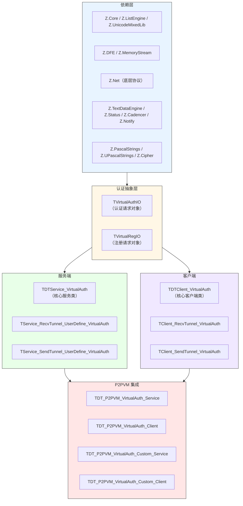
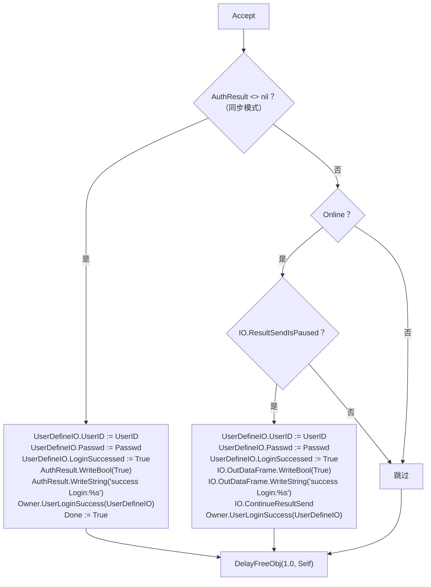
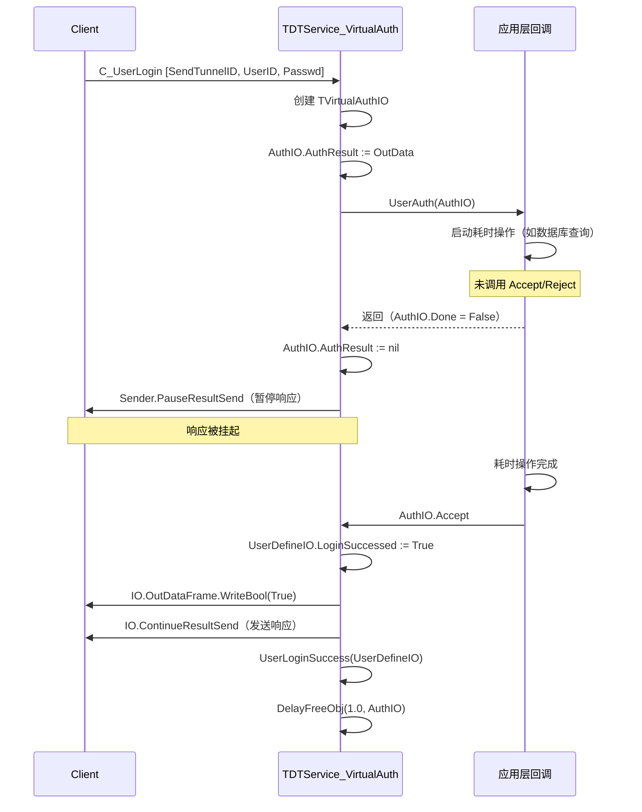
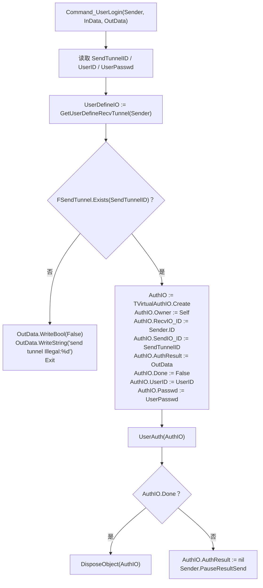
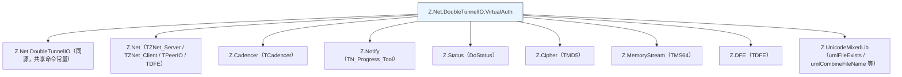

# Z.Net.DoubleTunnelIO.VirtualAuth 知识库（最终传承版）

> **定位**：面向 AI 与人类工程师的权威参考。目标是让读者**无需翻阅源码**即可安全、准确地使用 `Z.Net.DoubleTunnelIO.VirtualAuth`。
> **承诺**：所有描述均来自 `Z.Net.DoubleTunnelIO.VirtualAuth.pas` 的逐行核对。凡我无法从源码确定的，在文末「诚实的不确定清单」中明示。
> **制图约定**：全文流程图/架构图/决策树一律使用 Mermaid，不使用字符制图。

---

## 第 0 章 快速定位：这个单元是什么

`Z.Net.DoubleTunnelIO.VirtualAuth` 是 Z 框架的**虚拟认证双隧道通信框架**。它与 `Z.Net.DoubleTunnelIO`（内置认证）的关键区别是：**认证/注册完全由应用层回调决定**，框架本身不维护用户数据库，只负责把认证请求封装成 `TVirtualAuthIO` / `TVirtualRegIO` 交给应用层，由应用层调用 `Accept` 或 `Reject`（同步或异步）决定结果。



**核心能力**：

| 能力 | 说明 |
|------|------|
| 虚拟认证 | 认证由 `OnUserAuth` 回调决定，应用层完全掌控 |
| 虚拟注册 | 注册由 `OnUserReg` 回调决定 |
| 同步/异步认证 | `Accept` / `Reject` 可在回调内同步调用，或保存 `AuthIO` 稍后异步调用 |
| 双隧道管理 | Recv + Send 独立物理连接 |
| 文件传输 | 上传/下载/断点续传/MD5/片段 |
| 批量流 | `PostBatchStream` 带 MD5 验证 |
| P2PVM | 自动在 P2P 虚拟网络上建立双隧道 |
| 克隆技术 | `Create_Clone` 共享物理隧道创建多个逻辑客户端 |

**它不是**：
- **不是**线程安全的（所有操作在主线程）。
- **不是**自带用户数据库的（`TDTService` 才有，本单元没有）。
- **不是**自动重连的（`AutomatedConnection` 需显式开启）。

**与 `Z.Net.DoubleTunnelIO` 的核心差异**：

| 方面 | `Z.Net.DoubleTunnelIO` | `Z.Net.DoubleTunnelIO.VirtualAuth` |
|------|----------------------|----------------------------------|
| 认证方式 | 内置用户数据库 + 量子密码哈希 | 应用层回调 |
| 用户存储 | `FUserDB: THashTextEngine` | 无 |
| 认证对象 | 无（框架内部处理） | `TVirtualAuthIO` / `TVirtualRegIO` |
| 登录/注册 | `UserLogin` / `RegisterUser` 同步/异步 | 同样有，但结果由回调决定 |
| 公共/私有文件 | 支持 | **不支持**（只有单一共享目录） |
| 离线队列 | 支持 | **不支持** |
| 用户打包 | 支持 | **不支持** |
| 密码修改 | 支持 | **不支持** |

---

## 第 1 章 认证抽象层

### 1.1 `TVirtualAuthIO` —— 认证请求对象

```pascal
TVirtualAuthIO = class(TCore_Object_Intermediate)
private
  RecvIO_ID: Cardinal;    // 接收隧道客户端 ID
  SendIO_ID: Cardinal;    // 发送隧道客户端 ID
  AuthResult: TDFE;       // 响应 DFE（同步模式）；异步时为 nil
  Done: Boolean;          // 是否已 Accept/Reject
public
  Owner: TDTService_VirtualAuth;
  UserID: SystemString;   // 客户端提供的用户 ID
  Passwd: SystemString;   // 客户端提供的密码
  function Online: Boolean;
  function UserDefineIO: TService_RecvTunnel_UserDefine_VirtualAuth;
  procedure Accept;
  procedure Reject;
  procedure Bye;
end;
```

**`Accept` 的精确行为**：



**契约**：
- **同步模式**：`AuthResult` 非 nil（框架传入 `OutData`），`Accept` 直接写入响应。
- **异步模式**：框架调用 `Sender.PauseResultSend` 暂停响应，`AuthResult := nil`，稍后调用 `Accept` 通过 `IO.OutDataFrame` + `ContinueResultSend` 发送。
- **`Done=True` 后框架会 `DisposeObject(AuthIO)`**。
- **未调用 `Accept`/`Reject` 时**，框架保持 `PauseResultSend` 状态。

**`Reject`**：类似但写 `False` + `'Reject user:%s'`。

**`Bye`**：`r_IO := Owner.RecvTunnel.PeerIO[RecvIO_ID]; if r_IO <> nil then r_IO.delayClose(1.0);`，然后 `DelayFreeObj(1.0, Self)`。

**`UserDefineIO`**：若 `Online=False` 返回 nil；否则返回 `Owner.RecvTunnel[RecvIO_ID].UserDefine as TService_RecvTunnel_UserDefine_VirtualAuth`。

### 1.2 `TVirtualRegIO` —— 注册请求对象

结构完全镜像 `TVirtualAuthIO`，只是 `Accept` / `Reject` 的文本不同（`'success Reg:%s'` / `'Reject Reg:%s'`），且**不设置 `UserDefineIO.LoginSuccessed`**（注册成功不自动登录）。

### 1.3 异步认证流程



**关键契约**：
- **异步模式下 `AuthIO` 的生命周期由应用层掌控**，直到 `Accept`/`Reject` 后 1 秒由框架释放。
- **`AuthResult := nil` 后，`Accept` 走 `IO.OutDataFrame` 路径**。
- **`Owner.RecvTunnel` 可能已断开**，`Online` 检查保障安全。

---

## 第 2 章 `TService_RecvTunnel_UserDefine_VirtualAuth`

### 2.1 字段

```pascal
TService_RecvTunnel_UserDefine_VirtualAuth = class(TPeer_IO_User_Define)
private
  FCurrentFileStream: TCore_Stream;
  FCurrentReceiveFileName: SystemString;
public
  SendTunnel: TService_SendTunnel_UserDefine_VirtualAuth;
  SendTunnelID: Cardinal;
  DoubleTunnelService: TDTService_VirtualAuth;
  UserID: SystemString;
  Passwd: SystemString;
  LoginSuccessed: Boolean;
  function LinkOk: Boolean;
  property BindOk: Boolean read LinkOk;
  property CurrentFileStream: TCore_Stream read FCurrentFileStream write FCurrentFileStream;
  property CurrentReceiveFileName: SystemString read FCurrentReceiveFileName write FCurrentReceiveFileName;
end;
```

**`LinkOk`**：`Result := DoubleTunnelService <> nil`。

**析构**：若 `DoubleTunnelService <> nil`，调用 `UserOut(Self)` 并断开 `SendTunnel`。

**与 `Z.Net.DoubleTunnelIO` 的 `TService_RecvTunnel_UserDefine` 差异**：
- **无 `UserFlag` / `UserPath` / `UserConfigFile` / `UserDBIntf` / `WaitLink` / `WaitLinkSendID`**。
- 只有 `UserID` / `Passwd` / `LoginSuccessed`。

---

## 第 3 章 服务端 `TDTService_VirtualAuth`

### 3.1 字段

```pascal
TDTService_VirtualAuth = class(TCore_InterfacedObject_Intermediate)
protected
  FRecvTunnel: TZNet_Server;
  FSendTunnel: TZNet_Server;
  FCadencerEngine: TCadencer;
  FProgressEngine: TN_Progress_Tool;
  FFileSystem: Boolean;
  FFileShareDirectory: SystemString;
  FOnUserAuth: TVirtualAuth_OnAuth;      // 认证回调（必须实现）
  FOnUserReg: TVirtualAuth_OnReg;        // 注册回调（可选）
  FOnLinkSuccess: TVirtualAuth_OnLinkSuccess;
  FOnUserOut: TVirtualAuth_OnUserOut;
public
  property FileSystem: Boolean read FFileSystem write FFileSystem;
  property FileReceiveDirectory: SystemString read FFileShareDirectory write FFileShareDirectory;
  property PublicFileDirectory: SystemString read FFileShareDirectory write FFileShareDirectory;
  property FileShareDirectory: SystemString read FFileShareDirectory write FFileShareDirectory;
  property RecvTunnel: TZNet_Server read FRecvTunnel;
  property SendTunnel: TZNet_Server read FSendTunnel;
  property CadencerEngine: TCadencer read FCadencerEngine;
  property ProgressEngine: TN_Progress_Tool read FProgressEngine;
  property OnUserAuth: TVirtualAuth_OnAuth read FOnUserAuth write FOnUserAuth;
  property OnUserReg: TVirtualAuth_OnReg read FOnUserReg write FOnUserReg;
  property OnLinkSuccess: TVirtualAuth_OnLinkSuccess read FOnLinkSuccess write FOnLinkSuccess;
  property OnUserOut: TVirtualAuth_OnUserOut read FOnUserOut write FOnUserOut;
end;
```

**回调类型**：
```pascal
TVirtualAuth_OnAuth = procedure(Sender: TDTService_VirtualAuth; AuthIO: TVirtualAuthIO) of object;
TVirtualAuth_OnReg = procedure(Sender: TDTService_VirtualAuth; RegIO: TVirtualRegIO) of object;
TVirtualAuth_OnLinkSuccess = procedure(Sender: TDTService_VirtualAuth; UserDefineIO: TService_RecvTunnel_UserDefine_VirtualAuth) of object;
TVirtualAuth_OnUserOut = procedure(Sender: TDTService_VirtualAuth; UserDefineIO: TService_RecvTunnel_UserDefine_VirtualAuth) of object;
```

### 3.2 构造流程

1. `inherited Create`。
2. 设置 `PeerClientUserDefineClass`。
3. 设置 `DoubleChannelFramework := Self`。
4. 创建 `FCadencerEngine` 和 `FProgressEngine`。
5. `FFileSystem` 由宏 `DoubleIOFileSystem` 决定（默认 False）。
6. `FFileShareDirectory := umlCurrentPath`，不存在则创建。
7. `SwitchAsDefaultPerformance`。
8. 回调置 nil。

### 3.3 命令注册

**注册的命令**（全部在 `FRecvTunnel` 上）：

| 命令 | 注册类型 | 处理器 |
|------|---------|--------|
| `C_UserLogin` | Stream | `Command_UserLogin` |
| `C_RegisterUser` | Stream | `Command_RegisterUser` |
| `C_TunnelLink` | Stream | `Command_TunnelLink` |
| `C_GetCurrentCadencer` | Stream | `Command_GetCurrentCadencer` |
| `C_GetFileTime` | Stream | `Command_GetFileTime` |
| `C_GetFileInfo` | Stream | `Command_GetFileInfo` |
| `C_GetFileMD5` | Stream | `Command_GetFileMD5` |
| `C_GetFile` | Stream | `Command_GetFile` |
| `C_GetFileAs` | Stream | `Command_GetFileAs` |
| `C_PostFileInfo` | StreamNotify | `Command_PostFileInfo` |
| `C_PostFile` | BigStream | `Command_PostFile` |
| `C_PostFileOver` | StreamNotify | `Command_PostFileOver` |
| `C_GetFileFragmentData` | Stream | `Command_GetFileFragmentData` |
| `C_NewBatchStream` | StreamNotify | `Command_NewBatchStream` |
| `C_PostBatchStream` | BigStream | `Command_PostBatchStream` |
| `C_ClearBatchStream` | StreamNotify | `Command_ClearBatchStream` |
| `C_PostBatchStreamDone` | StreamNotify | `Command_PostBatchStreamDone` |
| `C_GetBatchStreamState` | Stream | `Command_GetBatchStreamState` |

**注意**：**注册命令比 `Z.Net.DoubleTunnelIO` 少了很多**（没有公共/私有文件、用户管理、离线队列等）。

### 3.4 `Command_UserLogin` 的核心逻辑



**契约**：
- **`UserAuth` 回调异常被吞掉**。
- **应用层必须实现 `OnUserAuth`**（否则 `UserAuth` 空实现，`AuthIO.Done` 始终 False，连接被挂起，最终超时）。
- **`AuthIO.RecvIO_ID` 是 `Sender.ID`**，`SendIO_ID` 是客户端传来的。

### 3.5 `Command_RegisterUser`

结构与 `Command_UserLogin` 相同，只是创建 `TVirtualRegIO` 并调用 `UserReg`。

### 3.6 `Command_TunnelLink`

与 `Z.Net.DoubleTunnelIO` 的版本相比：
- **无 `UserDefineIO.LoginSuccessed` 检查**！
- **无 `Sender.ID <> RecvID` 的严格检查**（但源码中仍有该检查）。

**关键事实**：**`Z.Net.DoubleTunnelIO.VirtualAuth` 的 `Command_TunnelLink` 不强制要求用户先登录**。这与 `Z.Net.DoubleTunnelIO` 不同。用户可在未登录状态下建立隧道链接，若需要登录检查，必须在 `OnUserAuth` 中自己实现。

### 3.7 文件系统命令

与 `Z.Net.DoubleTunnelIO` 的**公共文件**命令逻辑相同（单一共享目录 `FFileShareDirectory`），但**没有私有/其他用户文件**。

**所有文件命令要求 `UserDefineIO.LinkOk`（即 `DoubleTunnelService <> nil`），但不要求 `LoginSuccessed`**。

### 3.8 服务端主动发送批量流

```pascal
procedure PostBatchStream(cli: TPeerIO; stream: TCore_Stream; doneFreeStream: Boolean);
procedure PostBatchStreamC/M/P(cli; stream; doneFreeStream; OnCompletedBackcall);
procedure ClearBatchStream(cli: TPeerIO);
procedure GetBatchStreamStateM/P(cli; ...);
```

### 3.9 `Progress`

```pascal
procedure Progress;
begin
  FCadencerEngine.Progress;
  FRecvTunnel.Progress;
  FSendTunnel.Progress;
end;
```

---

## 第 4 章 客户端 `TDTClient_VirtualAuth`

### 4.1 字段

```pascal
TDTClient_VirtualAuth = class(TCore_InterfacedObject_Intermediate, IZNet_ClientInterface)
protected
  FSendTunnel: TZNet_Client;
  FRecvTunnel: TZNet_Client;
  FFileSystem: Boolean;
  FAutoFreeTunnel: Boolean;
  FLinkOk: Boolean;
  FWaitCommandTimeout: Cardinal;  // 默认 5000ms
  FCurrentStream: TCore_Stream;
  FCurrentReceiveStreamFileName: SystemString;
  FCadencerEngine: TCadencer;
  FProgressEngine: TN_Progress_Tool;
  FLastCadencerTime: Double;
  FServerDelay: Double;
  // 异步连接字段
  FAsyncConnectAddr / FAsyncConnRecvPort / FAsyncConnSendPort;
  FAsyncOnResult_C / FAsyncOnResult_M / FAsyncOnResult_P;
end;
```

**与 `TDTClient` 的差异**：
- **无 `FRecvFileing` / `FRecvFileOfBatching` / `FRecvFileName`**。
- **`FWaitCommandTimeout` 默认 5000ms**（`TDTClient` 是 8000ms）。

### 4.2 连接与链接

#### 同步连接 `Connect`
- 先 `Disconnect`。
- 连接 `SendTunnel` 和 `RecvTunnel`。
- 等待最多 10 秒直到 `RemoteInited`。
- 返回 `Connected`。

#### 异步连接 `AsyncConnectC/M/P`
- 与 `TDTClient` 相同。

#### 同步登录/注册
```pascal
function UserLogin(UserID, Passwd: SystemString): Boolean;
function RegisterUser(UserID, Passwd: SystemString): Boolean;
```
- 发送对应命令，等待响应。
- **`FWaitCommandTimeout * 2`** 超时。

#### 异步登录/注册
```pascal
procedure UserLoginC/M/P(UserID, Passwd: SystemString; On_C/M/P);
procedure RegisterUserC/M/P(UserID, Passwd: SystemString; On_C/M/P);
```
- 通过 `SendStreamCmdM` 发送，回调处理结果。

#### 隧道链接
```pascal
function TunnelLink: Boolean;
procedure TunnelLinkC/M/P(On_C/M/P);
```
- 与 `TDTClient` 相同，发送 `C_TunnelLink`。
- 响应中读取 `FFileSystem`，设置 `FLinkOk := True`。

#### `SyncCadencer`
- 发送 `C_GetCurrentCadencer` 并同步时间。

### 4.3 文件操作 API

**只有"公共文件"概念**（无私有/其他用户文件）：

#### 获取文件信息
```pascal
procedure GetFileInfoC/M/P(fileName; UserData; UserObject; OnComplete);
```

#### 获取文件 MD5
```pascal
procedure GetFileMD5C/M/P(fileName; StartPos, EndPos; UserData; UserObject; OnComplete);
```

#### 下载文件（同步/异步）
```pascal
function GetFile(fileName, saveToPath): Boolean; overload;
function GetFile(fileName: SystemString; StartPos: Int64; saveToPath): Boolean; overload;
procedure GetFileC/M/P(fileName, saveToPath; ...); overload;
procedure GetFileC/M/P(fileName; StartPos; saveToPath; ...); overload;
procedure GetFileAsC/M/P(fileName, saveFileName; StartPos; saveToPath; ...); overload;
```

#### 获取文件片段
```pascal
procedure GetFileFragmentDataC/M/P(fileName; StartPos, EndPos; ...);
```

#### 自动下载并校验
```pascal
procedure AutomatedDownloadFileC/M/P(remoteFile, localFile: U_String; OnDownloadDone);
```

#### 上传文件
```pascal
procedure PostFile(fileName: SystemString); overload;
procedure PostFile(l_fileName, r_fileName: SystemString); overload;
procedure PostFile(fileName: SystemString; StartPos: Int64); overload;
procedure PostFile(l_fileName, r_fileName: SystemString; StartPos: Int64); overload;
procedure PostFile(fn: SystemString; stream: TCore_Stream; doneFreeStream: Boolean); overload;
procedure PostFile(fn: SystemString; stream: TCore_Stream; StartPos: Int64; doneFreeStream: Boolean); overload;
```

#### 自动上传
```pascal
procedure AutomatedUploadFile(localFile: U_String);
```

### 4.4 批量流 API

```pascal
procedure PostBatchStream(stream: TCore_Stream; doneFreeStream: Boolean);
procedure PostBatchStreamC/M/P(stream; doneFreeStream; OnCompletedBackcall);
procedure ClearBatchStream;
procedure GetBatchStreamStateM/P(...);
function GetBatchStreamState(Result_: TDFE; TimeOut_: TTimeTick): Boolean;
```

### 4.5 其他

```pascal
procedure GetFileTimeM/P(RemoteFilename; On_CResult);
function Connected: Boolean;
function IOBusy: Boolean;
function RemoteInited: Boolean;
procedure RegisterCommand;
procedure UnRegisterCommand;
```

**`IOBusy` 与 `TDTClient` 一样用 `and`**（见不确定清单）。

---

## 第 5 章 P2PVM 集成

### 5.1 `TDT_P2PVM_VirtualAuth_Service`

**与 `TDT_P2PVM_Service` 完全相同**，只是前缀使用 `'VA'` 而非 `'DT'`。

```pascal
constructor Create(ServiceClass_: TDTService_VirtualAuthClass; Physics_Class: TZNet_ServerClass);
function StartService(ListenAddr, ListenPort, Auth: SystemString): Boolean;
```

### 5.2 `TDT_P2PVM_VirtualAuth_Client`

**与 `TDT_P2PVM_Client` 相同**，但增加了对**空用户名/密码**的处理：

**`DoAutomatedP2PVMClientConnectionDone`**：
```pascal
if (LastUser = '') or (LastPasswd = '') then
    DTClient.TunnelLinkM(DoTunnelLinkResult)   // 无凭据时直接 TunnelLink
else if RegisterUserAndLogin then
    DTClient.RegisterUserM(LastUser, LastPasswd, DoLoginResult)
else
    DTClient.UserLoginM(LastUser, LastPasswd, DoLoginResult);
```

**含义**：**虚拟认证框架允许匿名连接**（不传用户名密码时直接 TunnelLink，服务端的 `OnUserAuth` 不会被调用）。

### 5.3 `TDT_P2PVM_VirtualAuth_Custom_Service`

**与 `TDT_P2PVM_Custom_Service` 相同**，但前缀使用 `'VA'`。

**⚠️ 同样存在 bug**：`StopService` 中两次调用 `RecvTunnel.StopService`。

### 5.4 `TDT_P2PVM_VirtualAuth_Custom_Client`

**与 `TDT_P2PVM_Custom_Client` 相同**，但增加了**匿名连接支持**：

```pascal
procedure Connect(User, Passwd: SystemString);
begin
  // ...
  if (LastUser = '') or (LastPasswd = '') then
      DTClient.TunnelLinkM(DoTunnelLinkResult)
  else if RegisterUserAndLogin then
      DTClient.RegisterUserM(LastUser, LastPasswd, DoRegisterResult)
  else
      DTClient.UserLoginM(LastUser, LastPasswd, DoLoginResult);
end;

procedure Connect; overload;  // = Connect('', '')
procedure Connect_C(OnResult: TOnState_C);  // = Connect_C('', '', OnResult)
procedure Connect_M(OnResult: TOnState_M);  // = Connect_M('', '', OnResult)
procedure Connect_P(OnResult: TOnState_P);  // = Connect_P('', '', OnResult)
```

**`LoginIsSuccessed`**：若 `LastUser` 或 `LastPasswd` 为空，返回 False；否则返回 `DTClient.LinkOk`。

**克隆**：`Create_Clone` 会检查父客户端的 `LastUser` / `LastPasswd` 非空，否则抛异常。**匿名连接不能克隆**。

---

## 第 6 章 完整使用范式

### 6.1 最小服务端与客户端（同步认证）

```pascal
// 服务端
var
  RecvTunnel, SendTunnel: TZNet_Server;
  Service: TDTService_VirtualAuth;
begin
  RecvTunnel := TZNet_Server.Create;
  SendTunnel := TZNet_Server.Create;
  Service := TDTService_VirtualAuth.Create(RecvTunnel, SendTunnel);
  Service.RegisterCommand;
  Service.FileSystem := True;
  Service.FileShareDirectory := 'C:\Share';

  // 认证回调（同步）
  Service.OnUserAuth :=
    procedure(Sender: TDTService_VirtualAuth; AuthIO: TVirtualAuthIO)
    begin
      if (AuthIO.UserID = 'admin') and (AuthIO.Passwd = '123456') then
        AuthIO.Accept
      else
        AuthIO.Reject;
    end;

  // 注册回调
  Service.OnUserReg :=
    procedure(Sender: TDTService_VirtualAuth; RegIO: TVirtualRegIO)
    begin
      RegIO.Accept;  // 或根据业务逻辑判断
    end;

  RecvTunnel.StartService('0.0.0.0', 9810);
  SendTunnel.StartService('0.0.0.0', 9811);
  while True do
    begin
      Service.Progress;
      Sleep(10);
    end;
end;

// 客户端
var
  Client: TDTClient_VirtualAuth;
begin
  Client := TDTClient_VirtualAuth.Create(RecvClient, SendClient);
  Client.RegisterCommand;
  if Client.Connect('127.0.0.1', 9810, 9811) then
    begin
      if Client.UserLogin('admin', '123456') then
        begin
          Client.TunnelLink;
          // 使用 API
        end;
    end;
  while True do
    begin
      Client.Progress;
      Sleep(10);
    end;
end;
```

### 6.2 异步认证

```pascal
type
  TAuthContext = class
    AuthIO: TVirtualAuthIO;
  end;

Service.OnUserAuth :=
  procedure(Sender: TDTService_VirtualAuth; AuthIO: TVirtualAuthIO)
  var
    ctx: TAuthContext;
  begin
    ctx := TAuthContext.Create;
    ctx.AuthIO := AuthIO;
    // 后台查询数据库
    TCompute.RunC_NP(procedure
      begin
        Sleep(1000);  // 模拟耗时操作
        SysPost.PostExecuteM_NP(0, procedure
          begin
            if AuthIO.Online and (AuthIO.UserID = 'admin') then
                AuthIO.Accept
            else
                AuthIO.Reject;
            ctx.Free;
          end);
      end);
  end;
```

### 6.3 匿名连接（不认证直接链接）

```pascal
// 服务端：OnUserAuth 不赋值（或赋值为始终 Accept）
// 客户端：直接 TunnelLink
Client.Connect('127.0.0.1', 9810, 9811);
Client.TunnelLink;   // 不调用 UserLogin
```

**注意**：服务端的 `Command_TunnelLink` **不检查 `LoginSuccessed`**，所以匿名连接可以成功。若需要禁止匿名访问，必须在 `OnUserAuth` 中强制要求。

### 6.4 P2PVM 虚拟认证

```pascal
// 服务端
var
  P2PService: TDT_P2PVM_VirtualAuth_Service;
begin
  P2PService := TDT_P2PVM_VirtualAuth_Service.Create(TDTService_VirtualAuth, TZNet_Server);
  P2PService.DTService.OnUserAuth :=
    procedure(Sender: TDTService_VirtualAuth; AuthIO: TVirtualAuthIO)
    begin
      AuthIO.Accept;
    end;
  P2PService.StartService('0.0.0.0', '9810', 'myAuthToken');
  while True do
    begin
      P2PService.Progress;
      Sleep(10);
    end;
end;

// 客户端
var
  P2PClient: TDT_P2PVM_VirtualAuth_Client;
begin
  P2PClient := TDT_P2PVM_VirtualAuth_Client.Create(TDTClient_VirtualAuth, TZNet_Client);
  P2PClient.Connect_M('127.0.0.1', '9810', 'myAuthToken', 'admin', '123456',
    procedure(State: Boolean)
    begin
      if State then WriteLn('P2PVM 连接成功');
    end);
  while True do
    begin
      P2PClient.Progress;
      Sleep(10);
    end;
end;
```

### 6.5 文件上传下载

```pascal
// 上传到共享目录
Client.PostFile('C:\local\data.bin');

// 下载（异步）
Client.GetFileM('data.bin', 'C:\download',
  procedure(const UserData: Pointer; const UserObject: TCore_Object;
    stream: TCore_Stream; const fileName: SystemString)
  begin
    // 处理文件
  end);

// 自动校验下载
Client.AutomatedDownloadFileM('remote.dat', 'C:\local.dat',
  procedure(const UserData: Pointer; const UserObject: TCore_Object;
    stream: TCore_Stream; const fileName: SystemString)
  begin
    // 完成
  end);
```

---

## 第 7 章 反例集

### 7.1 未实现 `OnUserAuth`

```pascal
// ❌ 服务端未赋值 OnUserAuth
Service := TDTService_VirtualAuth.Create(RecvTunnel, SendTunnel);
Service.RegisterCommand;
// Service.OnUserAuth 未赋值 → UserAuth 空实现 → AuthIO.Done 始终 False → 连接挂起
```

**✅ 正确**：必须实现 `OnUserAuth`。

### 7.2 异步认证中访问已断开的连接

```pascal
Service.OnUserAuth :=
  procedure(Sender: TDTService_VirtualAuth; AuthIO: TVirtualAuthIO)
  begin
    TCompute.RunC_NP(procedure
      begin
        Sleep(10000);
        AuthIO.Accept;   // ❌ 客户端可能已断开
      end);
  end;
```

**✅ 正确**：检查 `AuthIO.Online` 再 `Accept`。

### 7.3 依赖 `Command_TunnelLink` 的登录检查

```pascal
// ❌ 错误：以为 TunnelLink 会拒绝未登录用户
Client.Connect(...);
Client.TunnelLink;   // ✅ 会成功（VirtualAuth 不检查 LoginSuccessed）
```

**✅ 正确**：若需要登录检查，在 `OnUserAuth` 中处理，或子类覆盖 `Command_TunnelLink`。

### 7.4 匿名克隆

```pascal
// ❌ 错误：匿名客户端克隆
Parent := TDT_P2PVM_VirtualAuth_Custom_Client.Create(...);
Parent.Connect;   // 匿名连接（LastUser=''）
Clone := TDT_P2PVM_VirtualAuth_Custom_Client.Create_Clone(Parent);  // ❌ RaiseInfo
```

**✅ 正确**：克隆要求父客户端有用户名密码。

### 7.5 `TDT_P2PVM_VirtualAuth_Custom_Service.StopService` 的 bug

```pascal
// ❌ 源码中两次 RecvTunnel.StopService，SendTunnel 未停止
```

**✅ 正确**：调用后手动停止 SendTunnel。

### 7.6 跨网络使用批量流回调指针

与 `Z.Net.DoubleTunnelIO` 一样，**跨网络使用完成回调会崩溃**。

### 7.7 同步 `GetFile` 阻塞 UI

```pascal
Client.GetFile('remote.dat', 'C:\download');  // 同步忙等
```

**✅ 正确**：在非 UI 线程使用，或用异步版本。

---

## 第 8 章 常见错误对照表

| 现象 | 根因 | 修正 |
|------|------|------|
| 登录请求永远无响应 | 未实现 `OnUserAuth` | 赋值 `OnUserAuth` 并调用 `Accept`/`Reject` |
| 异步认证后连接挂起 | 未调用 `Accept`/`Reject` | 确保 `AuthIO.Done := True` |
| 异步认证崩溃 | 客户端已断开 | 检查 `AuthIO.Online` |
| `TunnelLink` 未登录也成功 | VirtualAuth 不检查 `LoginSuccessed` | 在 `OnUserAuth` 中自行处理 |
| 匿名客户端克隆失败 | `Create_Clone` 要求非空凭据 | 提供用户名密码 |
| 批量流完成回调崩溃 | 跨网络指针无效 | 避免跨网络使用完成回调 |
| 文件上传/下载无反应 | `FFileSystem=False` | 服务端设置 `FileSystem=True` |
| `StopService` 后 SendTunnel 仍在监听 | `TDT_P2PVM_VirtualAuth_Custom_Service` bug | 手动停止 SendTunnel |
| 同步 `GetFile` 超时 | `WaitCommandTimeout` 太小 | 增大 `WaitCommandTimeout` |
| `IOBusy` 始终 False | 源码用 `and` 而非 `or` | 注意其语义 |

---

## 第 9 章 诚实的不确定清单

> 以下是我从源码**无法完全确定**的点。若 AI 需要在这些场景下工作，**必须回查源码或询问人类**。

1. **`Command_TunnelLink` 不检查 `LoginSuccessed` 是否有意**
   - 源码：无 `UserDefineIO.LoginSuccessed` 检查，与 `Z.Net.DoubleTunnelIO` 不同。
   - **不确定**：这是设计决定还是遗漏。
   - **推测**：**可能是设计决定**——VirtualAuth 将认证决策完全交给应用层，框架不强制登录。

2. **`TDT_P2PVM_VirtualAuth_Custom_Service.StopService` 的两次 `RecvTunnel.StopService`**
   - 源码：`RecvTunnel.StopService; RecvTunnel.StopService;`
   - **不确定**：是否应为 `SendTunnel.StopService`。
   - **推测**：**是 bug**，与 `TDT_P2PVM_Custom_Service` 相同。

3. **`TDTClient_VirtualAuth.IOBusy` 使用 `and`**
   - 源码：`Result := FSendTunnel.IOBusy and FRecvTunnel.IOBusy;`
   - **不确定**：是否有意。
   - **推测**：可能应为 `or`。

4. **`Command_UserLogin` 中 `AuthIO.RecvIO_ID := Sender.ID`**
   - 源码：`AuthIO.RecvIO_ID := Sender.ID;`
   - **不确定**：`Sender.ID` 是否等于接收隧道客户端的 ID。
   - **推测**：是。

5. **`TVirtualAuthIO.Accept` 同步模式下不检查 `Online`**
   - 源码：`if AuthResult <> nil then` 直接写入响应。
   - **不确定**：同步模式下 `Accept` 由框架调用（在 `UserAuth` 回调内），此时连接必然在线。
   - **推测**：安全。

6. **`TVirtualAuthIO.Accept` 异步模式下 `IO.ResultSendIsPaused` 检查**
   - 源码：`if (IO.ResultSendIsPaused) then` 才写入 `OutDataFrame`。
   - **不确定**：若 `ResultSendIsPaused=False`（理论上不会），`Accept` 静默失败。
   - **推测**：框架在 `Done=False` 时已 `PauseResultSend`，所以此检查成立。

7. **`TVirtualAuthIO.Accept` 异步模式下不 `DelayFreeObj` 的条件**
   - 源码：`else if Online then ...` 分支中，若 `ResultSendIsPaused=False`，则跳过写入但仍然 `DelayFreeObj(1.0, Self)`。
   - **不确定**：是否有意。
   - **推测**：防御性。

8. **`TVirtualAuthIO.Bye` 中 `r_IO` / `s_IO` 变量的声明**
   - 源码：`var r_IO, s_IO: TPeerIO;` 但 `s_IO` 未使用。
   - **不确定**：是否有意。
   - **推测**：可能是遗留代码。

9. **`Command_UserLogin` 的 `AuthResult := OutData` 所有权**
   - 源码：`AuthIO.AuthResult := OutData;`，同步模式下 `Accept` 直接写入 `OutData`。
   - **不确定**：`Accept` 写入后，框架是否还会修改 `OutData`。
   - **推测**：不会，`Done=True` 时框架立即 `DisposeObject(AuthIO)`。

10. **`TDT_P2PVM_VirtualAuth_Client` 的匿名连接**
    - 源码：`if (LastUser = '') or (LastPasswd = '') then DTClient.TunnelLinkM(...)`。
    - **不确定**：这是否是预期用法（匿名 P2PVM 连接）。
    - **推测**：是，允许无需认证即可连接。

11. **`TDT_P2PVM_VirtualAuth_Custom_Client.Connect` 的匿名版本**
    - 源码：`Connect;` = `Connect('', '')`。
    - **不确定**：匿名连接时是否调用 `OnTunnelLink`。
    - **推测**：是。

12. **`TDT_P2PVM_VirtualAuth_Custom_Client.LoginIsSuccessed` 空凭据返回 False**
    - 源码：`if (LastUser = '') or (LastPasswd = '') then exit; Result := DTClient.LinkOk;`
    - **不确定**：匿名连接时 `LoginIsSuccessed` 应返回什么。
    - **推测**：返回 False（因为无凭据）。

13. **`Command_GetFileFragmentData` 中 `mem_.DiscardMemory` 后 `DisposeObject(mem_)`**
    - 源码：与 `Z.Net.DoubleTunnelIO` 相同。
    - **不确定**：`DiscardMemory` 后 `DisposeObject` 是否安全。
    - **推测**：安全。

14. **`TDTClient_VirtualAuth.Command_PostFileOver` 中 `Dispose(p)` 的所有权**
    - 源码：`Dispose(p);` 但 `p` 是客户端 `GetFileC` 中 `new` 分配的。
    - **不确定**：若服务端从未响应，`p` 是否泄漏。
    - **推测**：可能泄漏，除非客户端超时处理。

15. **`TDT_P2PVM_VirtualAuth_Client.DoRegisterResult` 不检查 `state`**
    - 源码：`DTClient.UserLoginM(LastUser, LastPasswd, DoLoginResult);`
    - **不确定**：注册失败后直接尝试登录是否是预期行为。
    - **推测**：可能是**有意**——注册失败（如用户已存在）时尝试登录。

16. **`TDT_P2PVM_VirtualAuth_Custom_Client.DoRegisterResult` 同样不检查 `state`**
    - 同上。

17. **`TVirtualRegIO.Accept` 不设置 `UserDefineIO.LoginSuccessed`**
    - 源码：`RegResult.WriteBool(True); RegResult.WriteString(...); Done := True;` 仅此。
    - **不确定**：注册成功后是否需要自动登录。
    - **推测**：不需要——注册和登录是两个独立操作。客户端需显式调用 `UserLogin`。

18. **`Command_RegisterUser` 中 `UserDefineIO` 变量的使用**
    - 源码：`UserDefineIO := GetUserDefineRecvTunnel(Sender);` 但后续未使用（除了不存在时的隐式检查）。
    - **不确定**：是否遗漏了某些检查。
    - **推测**：可能只是防御性获取。

19. **`TDTService_VirtualAuth.UserLoginSuccess` 空实现**
    - 源码：空。
    - **不确定**：是否应被子类重写。
    - **推测**：是，用于通知。

20. **`TDT_P2PVM_VirtualAuth_Service` 与 `TDT_P2PVM_Service` 的差异**
    - 源码：仅前缀名 `'VA'` vs `'DT'`。
    - **不确定**：前缀名是否影响 P2PVM 逻辑。
    - **推测**：是，用于区分不同的逻辑框架。

21. **`TDT_P2PVM_VirtualAuth_Custom_Client.DoTunnelLinkResult` 中 `RegisterUserAndLogin := False`**
    - 源码：成功链接后重置。
    - **不确定**：这是否意味着下次连接需要重新指定注册标志。
    - **推测**：是，与 `TDT_P2PVM_Custom_Client` 相同。

22. **`TDT_P2PVM_VirtualAuth_Client.DoLoginResult` 中登录成功后的处理**
    - 源码：`DTClient.TunnelLinkM(DoTunnelLinkResult);`
    - **不确定**：登录成功后必须立即 TunnelLink 吗？
    - **推测**：是，标准流程。

23. **`TDT_P2PVM_VirtualAuth_Client.Connect` 中 `LastUser` / `LastPasswd` 的重连保留**
    - 源码：`LastUser := User; LastPasswd := Passwd;` 在 `if not Reconnection` 块外。
    - **不确定**：重连时是否应该重用旧的 User/Passwd（因为 `Connect` 参数可能为空）。
    - **推测**：重连时调用者应传入相同参数，或依赖 `Progress` 中的自动重连（使用 `LastAddr` 等）。

24. **`TDT_P2PVM_VirtualAuth_Custom_Client.Connect` 空 User/Passwd 时的行为**
    - 源码：`if (LastUser = '') or (LastPasswd = '') then DTClient.TunnelLinkM(...)`。
    - **不确定**：匿名连接是否意味着永远不认证。
    - **推测**：是，除非后续手动调用 `UserLogin`。

---

## 第 10 章 与 Z.Net.DoubleTunnelIO / Z.Net 的衔接

### 10.1 类型依赖



### 10.2 与 `Z.Net.DoubleTunnelIO` 的共享

- **命令常量相同**（`C_UserLogin` / `C_RegisterUser` / `C_TunnelLink` / `C_GetFile*` / `C_PostFile*` / `C_*BatchStream*` 等）。
- **协议格式相同**（DFE 编码）。
- **`TDTClient_VirtualAuth` 与 `TDTClient` 的 API 高度相似**，但缺少私有文件、用户管理等。
- **`TDTService_VirtualAuth` 与 `TDTService` 的 API 高度相似**，但缺少用户数据库、公共/私有文件、离线队列、用户打包等。

### 10.3 线程安全矩阵

| 组件 | 线程安全 |
|------|---------|
| `TDTService_VirtualAuth` | ❌ 否 |
| `TDTClient_VirtualAuth` | ❌ 否 |
| `TVirtualAuthIO` / `TVirtualRegIO` | ❌ 否 |
| `TService_RecvTunnel_UserDefine_VirtualAuth` | ❌ 否 |
| P2PVM 集成类 | ❌ 否 |

**建议**：所有操作在主线程；异步认证回调中访问 `AuthIO` 也应在主线程（用 `SysPost.PostExecuteM_NP` 投递）。

### 10.4 使用场景选择

| 场景 | 推荐单元 |
|------|---------|
| 需要内置用户数据库 + 私有文件 | `Z.Net.DoubleTunnelIO` |
| 需要自定义认证逻辑（LDAP / OAuth / 数据库） | **`Z.Net.DoubleTunnelIO.VirtualAuth`** |
| 需要匿名访问 | **`Z.Net.DoubleTunnelIO.VirtualAuth`**（不实现 `OnUserAuth` 或始终 `Accept`） |
| 需要简单文件共享 | 两者都可 |
| 需要离线队列 / 用户打包 | `Z.Net.DoubleTunnelIO` |
| P2PVM + 自定义认证 | **`Z.Net.DoubleTunnelIO.VirtualAuth`** |

---

## 第 11 章 结语

### 11.1 本知识库覆盖范围

- **已精确描述**：
  - `TVirtualAuthIO` / `TVirtualRegIO` 认证抽象层（同步/异步 `Accept`/`Reject`/`Bye`）。
  - `TDTService_VirtualAuth` 服务端全部 API、命令注册、认证流程、文件系统、批量流。
  - `TDTClient_VirtualAuth` 客户端全部 API、连接、登录/注册、链接、文件操作、批量流。
  - P2PVM 集成：`Service` / `Client` / `Custom_Service` / `Custom_Client` / Clone。
  - 匿名连接支持。
  - 完整使用范式与反例。

- **已纠正的常见幻觉**：
  - **`Command_TunnelLink` 不检查 `LoginSuccessed`**——可匿名链接。
  - **`OnUserAuth` 必须实现**，否则连接挂起。
  - **异步认证需检查 `AuthIO.Online`**。
  - **匿名客户端不能克隆**（`Create_Clone` 要求非空凭据）。
  - **`TDT_P2PVM_VirtualAuth_Custom_Service.StopService` 有 bug**（两次 `RecvTunnel`）。
  - **`DoRegisterResult` 不检查 `state`**——注册失败后尝试登录。
  - **`TVirtualRegIO.Accept` 不设置 `LoginSuccessed`**。
  - **`TDTClient_VirtualAuth.IOBusy` 使用 `and`**。
  - **`TDTClient_VirtualAuth.FWaitCommandTimeout` 默认 5000ms**。

- **未覆盖**：
  - 源码中的 24 个不确定点。
  - `Z.Net` 底层协议细节。
  - `Z.DFE` / `Z.Cipher` / `Z.MemoryStream` 的内部实现。
  - `Z.Net.DoubleTunnelIO` 的详细 API（见其知识库）。

### 11.2 给 AI 的使用规则

1. **必须实现 `OnUserAuth`**，否则连接挂起。
2. **`Accept` / `Reject` 可同步或异步调用**，异步时保存 `AuthIO` 并检查 `Online`。
3. **`Command_TunnelLink` 不检查登录**——需要登录检查时在 `OnUserAuth` 中处理。
4. **匿名连接合法**（不传用户名密码）。
5. **匿名客户端不能克隆**。
6. **`TDT_P2PVM_VirtualAuth_Custom_Service.StopService` 后手动停止 `SendTunnel`**。
7. **跨网络时不要使用批量流完成回调**。
8. **同步 `GetFile` 会阻塞**，建议在非 UI 线程使用。
9. **所有操作在主线程**，`Progress` 定期调用。
10. **`DoRegisterResult` 注册失败后会尝试登录**——需注意。
11. **遇到不确定清单里的场景，请查源码或问人**。

### 11.3 与 Z.Net.DoubleTunnelIO / Z.Net 的衔接

- 本单元与 `Z.Net.DoubleTunnelIO` **共享命令常量和协议格式**。
- `Z.Net.DoubleTunnelIO` 提供**内置认证**和**完整的文件系统/用户管理**。
- `Z.Net.DoubleTunnelIO.VirtualAuth` 提供**自定义认证**和**简化的文件系统**（无公共/私有区分）。
- 两者都依赖 `Z.Net` 的 `TZNet_Server` / `TZNet_Client` / `TPeerIO` / `TDFE`。

---

**本知识库的定位**：一份**准确的、有边界的、可操作的** `Z.Net.DoubleTunnelIO.VirtualAuth` 参考。它不假装能替代源码，但能让你在 90% 的场景下正确使用，并在剩下 10% 的场景下知道该停下来问人。