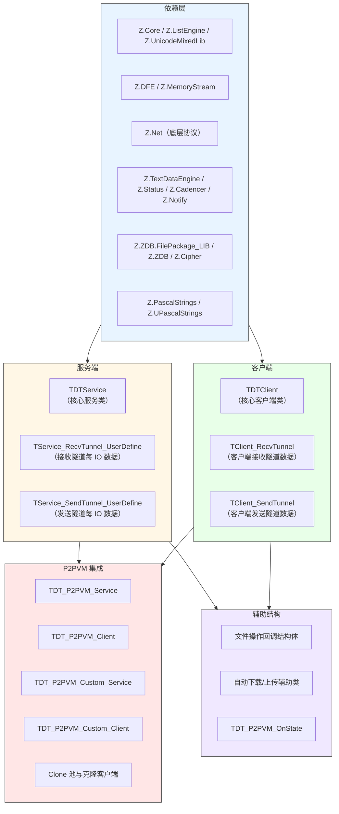
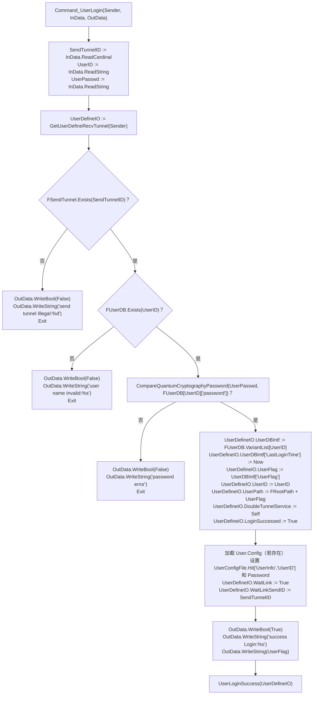
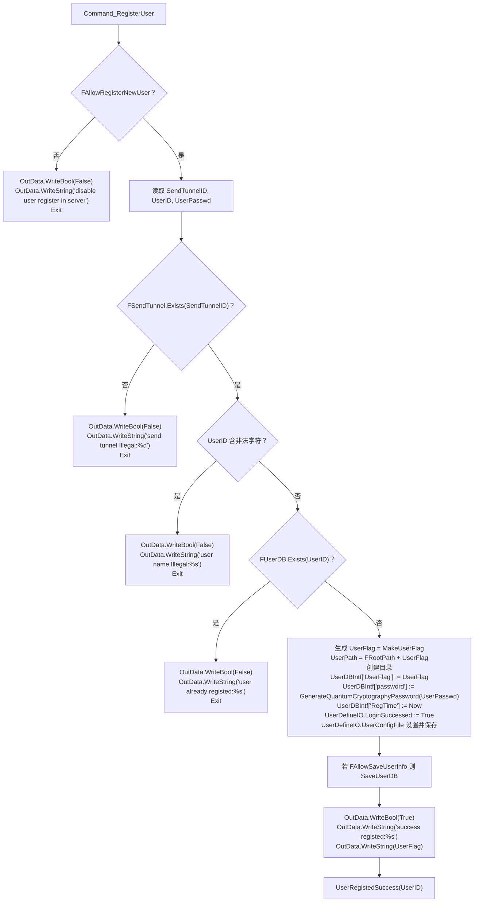
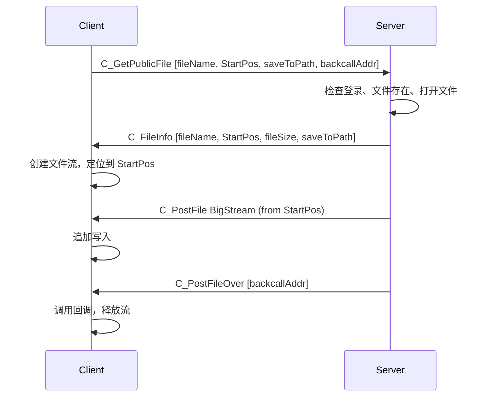
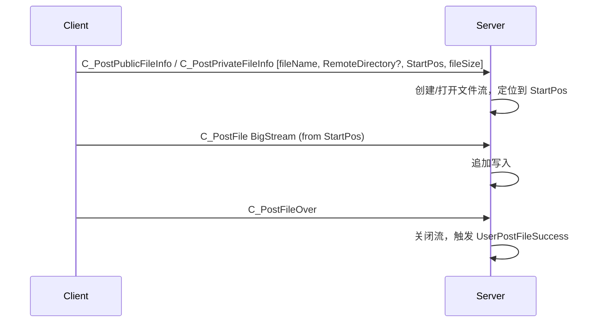

# Z.Net.DoubleTunnelIO 知识库（最终传承版）

> **定位**：面向 AI 与人类工程师的权威参考。目标是让读者**无需翻阅源码**即可安全、准确地使用 `Z.Net.DoubleTunnelIO`。
> **承诺**：所有描述均来自 `Z.Net.DoubleTunnelIO.pas` 的逐行核对。凡我无法从源码确定的，在文末「诚实的不确定清单」中明示。
> **制图约定**：全文流程图/架构图/决策树一律使用 Mermaid，不使用字符制图。
> **规模警告**：本单元约 **15000 行**，是 Z 框架的**带认证双隧道通信框架**。它建立在 `Z.Net` 之上，提供用户注册/登录、私有/公共文件存储、批量流、P2PVM 集成等完整能力。

---

## 第 0 章 快速定位：这个单元是什么

`Z.Net.DoubleTunnelIO` 是 Z 框架的**带认证双隧道通信框架**。它通过**两条独立的物理隧道**（Recv 接收隧道 + Send 发送隧道）实现双向数据流，并内置**用户认证、注册、私有/公共文件存储、批量流、P2PVM 集成**。



**核心能力**：

| 能力 | 说明 |
|------|------|
| 双隧道管理 | Recv 和 Send 使用不同物理连接，可独立配置 |
| 用户认证 | 注册、登录、密码修改、自定义新用户（管理员） |
| 私有/公共存储 | 每个用户独立目录；公共目录共享 |
| 文件传输 | 上传、下载、断点续传、MD5 校验、片段获取 |
| 批量流 | `PostBatchStream` 发送带 MD5 验证的流，支持完成回调 |
| P2PVM | 自动在 P2P 虚拟网络上建立双隧道 |
| 自定义嵌入 | `Custom_Service` / `Custom_Client` 可嵌入现有物理隧道 |
| 克隆技术 | `Create_Clone` 共享物理隧道创建多个逻辑客户端 |
| 离线队列 | `PostStoreQueueCMD` 用户离线时存储命令，上线后执行 |
| 用户打包 | `PackUserAsFile` / `UnPackFileAsUser` 用户数据打包迁移 |

**它不是**：
- **不是**线程安全的（所有操作必须在主线程）。
- **不是**自带 P2P 穿透的（P2PVM 需额外配置）。
- **不是**自动重连的（`AutomatedConnection` 需显式开启）。
- **不是**跨进程安全的（批量流回调指针在跨网络时无效）。

---

## 第 1 章 类型与常量

### 1.1 核心类型别名

```pascal
TZNet_DoubleTunnelService = TDTService;
TZNet_DoubleTunnelClient  = TDTClient;
```

### 1.2 命令常量（继承自 Z.Net）

| 常量 | 用途 |
|------|------|
| `C_UserLogin` | 用户登录 |
| `C_RegisterUser` | 用户注册 |
| `C_TunnelLink` | 隧道链接请求 |
| `C_ChangePasswd` | 修改密码 |
| `C_CustomNewUser` | 自定义新用户（管理员） |
| `C_ProcessStoreQueueCMD` | 处理离线队列命令 |
| `C_GetPublicFileList` | 获取公共文件列表 |
| `C_GetPrivateFileList` | 获取私有文件列表 |
| `C_GetPrivateDirectoryList` | 获取私有目录列表 |
| `C_CreatePrivateDirectory` | 创建私有目录 |
| `C_GetPublicFileInfo` | 获取公共文件信息 |
| `C_GetPrivateFileInfo` | 获取私有文件信息 |
| `C_GetPublicFileMD5` | 获取公共文件 MD5 |
| `C_GetPrivateFileMD5` | 获取私有文件 MD5 |
| `C_GetPublicFile` | 下载公共文件 |
| `C_GetPrivateFile` | 下载私有文件 |
| `C_GetUserPrivateFile` | 下载其他用户私有文件（管理员） |
| `C_GetPublicFileAs` | 下载公共文件并另存 |
| `C_GetPrivateFileAs` | 下载私有文件并另存 |
| `C_GetUserPrivateFileAs` | 下载其他用户私有文件并另存 |
| `C_PostPublicFileInfo` | 上传公共文件元数据 |
| `C_PostPrivateFileInfo` | 上传私有文件元数据 |
| `C_PostFile` | 上传文件数据（BigStream） |
| `C_PostFileOver` | 上传完成标记 |
| `C_GetPublicFileFragmentData` | 获取公共文件片段 |
| `C_GetPrivateFileFragmentData` | 获取私有文件片段 |
| `C_GetCurrentCadencer` | 获取服务端 cadencer 时间 |
| `C_NewBatchStream` | 开始批量流 |
| `C_PostBatchStream` | 批量流数据（BigStream） |
| `C_ClearBatchStream` | 清空批量流 |
| `C_PostBatchStreamDone` | 批量流完成 |
| `C_GetBatchStreamState` | 获取批量流状态 |
| `C_FileInfo` | 服务端发送文件信息给客户端 |
| `C_PostFileFragmentData` | 服务端发送文件片段给客户端 |
| `C_UserDB` | 用户数据库文件名 |

### 1.3 回调类型

#### 服务端事件
```pascal
TOnLinkSuccess = procedure(Sender: TDTService; UserDefineIO: TService_RecvTunnel_UserDefine) of object;
TOnUserOut     = procedure(Sender: TDTService; UserDefineIO: TService_RecvTunnel_UserDefine) of object;
```

#### 文件操作回调
| 类型 | 签名 |
|------|------|
| `TGetFileInfo_C` | `procedure(const UserData: Pointer; const UserObject: TCore_Object; const fileName: SystemString; const Existed: Boolean; const fSiz: Int64)` |
| `TFileMD5_C` | `procedure(..., const StartPos, EndPos: Int64; const MD5: TMD5)` |
| `TFileComplete_C` | `procedure(..., stream: TCore_Stream; const fileName: SystemString)` |
| `TFileFragmentData_C` | `procedure(..., const DataPtr: Pointer; const DataSize: Int64; const MD5: TMD5)` |

（M / P 版本类似，分别为 `of object` 和 `reference to` / `is nested`。）

### 1.4 结构体

#### `TDT_P2PVM_OnState`
```pascal
TDT_P2PVM_OnState = record
  On_C: TOnState_C;
  On_M: TOnState_M;
  On_P: TOnState_P;
  procedure Init; // 全部置 nil
end;
```

#### 文件回调结构体
```pascal
PGetFileInfoStruct = ^TGetFileInfoStruct;
TGetFileInfoStruct = record
  UserData: Pointer;
  UserObject: TCore_Object;
  fileName: SystemString;
  OnComplete_C: TGetFileInfo_C;
  OnComplete_M: TGetFileInfo_M;
  OnComplete_P: TGetFileInfo_P;
  procedure Init;
end;

PFileMD5Struct = ^TFileMD5Struct;
TFileMD5Struct = record
  UserData: Pointer;
  UserObject: TCore_Object;
  fileName: SystemString;
  StartPos, EndPos: Int64;
  OnComplete_C: TFileMD5_C;
  OnComplete_M: TFileMD5_M;
  OnComplete_P: TFileMD5_P;
  procedure Init;
end;

PRemoteFileBackcall = ^TRemoteFileBackcall;
TRemoteFileBackcall = record
  UserData: Pointer;
  UserObject: TCore_Object;
  OnComplete_C: TFileComplete_C;
  OnComplete_M: TFileComplete_M;
  OnComplete_P: TFileComplete_P;
  procedure Init;
end;

PFileFragmentDataBackcall = ^TFileFragmentDataBackcall;
TFileFragmentDataBackcall = record
  UserData: Pointer;
  UserObject: TCore_Object;
  fileName: SystemString;
  StartPos, EndPos: Int64;
  OnComplete_C: TFileFragmentData_C;
  OnComplete_M: TFileFragmentData_M;
  OnComplete_P: TFileFragmentData_P;
end;
```

---

## 第 2 章 服务端 `TDTService`

### 2.1 字段

```pascal
TDTService = class(TCore_InterfacedObject_Intermediate)
protected
  FRecvTunnel: TZNet_Server;          // 接收隧道服务端
  FSendTunnel: TZNet_Server;          // 发送隧道服务端
  FFileSystem: Boolean;               // 是否启用文件系统
  FRootPath: SystemString;            // 用户私有存储根目录
  FPublicPath: SystemString;          // 公共文件存储根目录
  FUserDB: THashTextEngine;           // 用户数据库（UserID -> UserFlag, password 等）
  FAllowRegisterNewUser: Boolean;     // 是否允许新用户注册
  FAllowSaveUserInfo: Boolean;        // 是否自动保存用户数据库
  FCadencerEngine: TCadencer;         // 时间驱动器
  FProgressEngine: TN_Progress_Tool;  // 延迟任务调度器
  FOnLinkSuccess: TOnLinkSuccess;
  FOnUserOut: TOnUserOut;
public
  property AllowRegisterNewUser: Boolean read FAllowRegisterNewUser write FAllowRegisterNewUser;
  property AllowSaveUserInfo: Boolean read FAllowSaveUserInfo write FAllowSaveUserInfo;
  property FileSystem: Boolean read FFileSystem write FFileSystem;
  property RootPath: SystemString read FRootPath write FRootPath;
  property PublicPath: SystemString read FPublicPath write FPublicPath;
  property CadencerEngine: TCadencer read FCadencerEngine;
  property ProgressEngine: TN_Progress_Tool read FProgressEngine;
  property RecvTunnel: TZNet_Server read FRecvTunnel;
  property SendTunnel: TZNet_Server read FSendTunnel;
  property OnLinkSuccess: TOnLinkSuccess read FOnLinkSuccess write FOnLinkSuccess;
  property OnUserOut: TOnUserOut read FOnUserOut write FOnUserOut;
end;
```

### 2.2 构造与析构

```pascal
constructor Create(RecvTunnel_, SendTunnel_: TZNet_Server); virtual;
destructor Destroy; override;
```

**构造流程**：
1. `inherited Create`。
2. `FRecvTunnel := RecvTunnel_`，设置 `PeerClientUserDefineClass := TService_RecvTunnel_UserDefine`。
3. `FSendTunnel := SendTunnel_`，设置 `PeerClientUserDefineClass := TService_SendTunnel_UserDefine`。
4. 设置 `DoubleChannelFramework := Self`。
5. `FFileSystem` 由宏 `DoubleIOFileSystem` 决定（默认 False，见不确定清单）。
6. `FRootPath := umlCurrentPath`，`FPublicPath := FRootPath`。
7. 创建 `FUserDB := THashTextEngine.Create(20 * 10000)`。
8. `FAllowRegisterNewUser := False`，`FAllowSaveUserInfo := False`。
9. 创建 `FCadencerEngine` 和 `FProgressEngine`。
10. 调用 `SwitchAsDefaultPerformance`。
11. 事件置 nil。

**析构**：释放 `FUserDB`、`FCadencerEngine`、`FProgressEngine`。

### 2.3 命令注册

```pascal
procedure RegisterCommand; virtual;
procedure UnRegisterCommand; virtual;
```

**注册的命令**（全部在 `FRecvTunnel` 上）：

| 命令 | 注册类型 | 处理器 |
|------|---------|--------|
| `C_UserLogin` | Stream | `Command_UserLogin` |
| `C_RegisterUser` | Stream | `Command_RegisterUser` |
| `C_TunnelLink` | Stream | `Command_TunnelLink` |
| `C_ChangePasswd` | Stream | `Command_ChangePasswd` |
| `C_CustomNewUser` | Stream | `Command_CustomNewUser` |
| `C_ProcessStoreQueueCMD` | StreamNotify | `Command_ProcessStoreQueueCMD` |
| `C_GetPublicFileList` | Stream | `Command_GetPublicFileList` |
| `C_GetPrivateFileList` | Stream | `Command_GetPrivateFileList` |
| `C_GetPrivateDirectoryList` | Stream | `Command_GetPrivateDirectoryList` |
| `C_CreatePrivateDirectory` | Stream | `Command_CreatePrivateDirectory` |
| `C_GetPublicFileInfo` | Stream | `Command_GetPublicFileInfo` |
| `C_GetPrivateFileInfo` | Stream | `Command_GetPrivateFileInfo` |
| `C_GetPublicFileMD5` | Stream | `Command_GetPublicFileMD5` |
| `C_GetPrivateFileMD5` | Stream | `Command_GetPrivateFileMD5` |
| `C_GetPublicFile` | Stream | `Command_GetPublicFile` |
| `C_GetPrivateFile` | Stream | `Command_GetPrivateFile` |
| `C_GetUserPrivateFile` | Stream | `Command_GetUserPrivateFile` |
| `C_GetPublicFileAs` | Stream | `Command_GetPublicFileAs` |
| `C_GetPrivateFileAs` | Stream | `Command_GetPrivateFileAs` |
| `C_GetUserPrivateFileAs` | Stream | `Command_GetUserPrivateFileAs` |
| `C_PostPublicFileInfo` | StreamNotify | `Command_PostPublicFileInfo` |
| `C_PostPrivateFileInfo` | StreamNotify | `Command_PostPrivateFileInfo` |
| `C_PostFile` | BigStream | `Command_PostFile` |
| `C_PostFileOver` | StreamNotify | `Command_PostFileOver` |
| `C_GetPublicFileFragmentData` | Stream | `Command_GetPublicFileFragmentData` |
| `C_GetPrivateFileFragmentData` | Stream | `Command_GetPrivateFileFragmentData` |
| `C_GetCurrentCadencer` | Stream | `Command_GetCurrentCadencer` |
| `C_NewBatchStream` | StreamNotify | `Command_NewBatchStream` |
| `C_PostBatchStream` | BigStream | `Command_PostBatchStream` |
| `C_ClearBatchStream` | StreamNotify | `Command_ClearBatchStream` |
| `C_PostBatchStreamDone` | StreamNotify | `Command_PostBatchStreamDone` |
| `C_GetBatchStreamState` | Stream | `Command_GetBatchStreamState` |

**⚠️ 关键陷阱**：
- `UnRegisterCommand` 中删除了一些在 `RegisterCommand` 中未注册的命令（如 `C_GetUserPrivateFileList`），可能导致删除失败但不报错。
- 所有文件操作命令都要求 `FFileSystem = True` 且用户已登录（`UserDefineIO.LoginSuccessed`）且隧道已链接（`UserDefineIO.SendTunnel <> nil`）。

### 2.4 用户认证

#### `Command_UserLogin`



**契约**：
- 密码使用 `CompareQuantumCryptographyPassword` 比较（量子密码学哈希）。
- 登录成功后，用户目录路径为 `FRootPath + UserFlag`。
- 用户配置文件 `User.Config` 自动加载。
- `WaitLink` 标记等待隧道链接。

#### `Command_RegisterUser`



**契约**：
- 用户名不能包含 `[]:`、`#13#10#9#8#0` 等字符。
- 注册成功后自动登录。
- 密码使用 `GenerateQuantumCryptographyPassword` 生成哈希。

#### `Command_TunnelLink`

**流程**与 NoAuth 版本类似，但增加了登录检查：

```pascal
UserDefineIO := GetUserDefineRecvTunnel(Sender);
if not UserDefineIO.LoginSuccessed then
  begin
    OutData.WriteBool(False);
    OutData.WriteString(PFormat('need login or register', []));
    OutData.WriteBool(FFileSystem);
    Exit;
  end;
// ... 检查 SendID/RecvID 合法性，Sender.ID = RecvID
// 建立双向链接
UserDefineIO.SendTunnel := FSendTunnel.PeerIO[SendID].UserDefine as TService_SendTunnel_UserDefine;
UserDefineIO.SendTunnelID := SendID;
UserDefineIO.SendTunnel.RecvTunnel := UserDefineIO;
UserDefineIO.SendTunnel.RecvTunnelID := RecvID;
UserDefineIO.SendTunnel.DoubleTunnelService := Self;
OutData.WriteBool(True);
OutData.WriteString('tunnel link success! received:%d <-> send:%d');
OutData.WriteBool(FFileSystem);
UserLinkSuccess(UserDefineIO);
```

**契约**：未登录用户无法链接隧道。

#### `Command_ChangePasswd`
- 需要已登录且已链接。
- 验证旧密码，更新 `UserDBIntf['password']`，保存用户数据库。

#### `Command_CustomNewUser`
- 需要已登录且已链接（管理员）。
- 读取 UserID、passwd、UserConfig（TSectionTextData）。
- 调用 `RegUser` 创建用户。

### 2.5 文件系统命令

#### 公共文件
- `Command_GetPublicFileList`：读取 Filter，列出 `FPublicPath` 下匹配的文件名。
- `Command_GetPublicFileInfo`：读取文件名，返回存在性和大小。
- `Command_GetPublicFileMD5`：使用 HPC 线程计算 MD5。
- `Command_GetPublicFile` / `Command_GetPublicFileAs`：发送文件到客户端（通过 SendTunnel 发送 `C_FileInfo`、`C_PostFile` BigStream、`C_PostFileOver`）。
- `Command_PostPublicFileInfo`：接收上传元数据，创建文件流。
- `Command_PostFile`：接收数据块，追加写入。
- `Command_PostFileOver`：关闭文件流，触发 `UserPostFileSuccess`。
- `Command_GetPublicFileFragmentData`：获取文件片段，通过 `SendCompleteBuffer` 发送。

#### 私有文件
- `Command_GetPrivateFileList` / `Command_GetPrivateDirectoryList` / `Command_CreatePrivateDirectory`：操作当前用户私有目录。
- `Command_GetPrivateFileInfo`：获取私有文件信息。
- `Command_GetPrivateFileMD5`：计算私有文件 MD5（HPC 线程）。
- `Command_GetPrivateFile` / `Command_GetPrivateFileAs`：下载私有文件。
- `Command_PostPrivateFileInfo`：接收上传元数据，创建私有文件流。
- `Command_GetPrivateFileFragmentData`：获取私有文件片段。

#### 其他用户私有文件（管理员）
- `Command_GetUserPrivateFile` / `Command_GetUserPrivateFileAs`：下载指定用户的私有文件。

### 2.6 批量流命令

与 NoAuth 版本结构相同，但要求用户已登录且已链接。

### 2.7 用户管理 API

```pascal
procedure LoadUserDB;                                   // 从磁盘加载用户数据库
procedure SaveUserDB;                                   // 保存用户数据库到磁盘
function RegUser(UsrID, UsrPasswd: SystemString; UserConfigFile_: THashTextEngine): Boolean; // 注册新用户（管理员）
function ExistsUser(UsrID: SystemString): Boolean;      // 检查用户是否存在
function GetUserPath(UsrID: SystemString): SystemString; // 获取用户目录
function GetUserFile(UsrID, UserFileName_: SystemString): SystemString; // 获取用户文件完整路径
function GetUserDefineIO(UsrID: SystemString): TService_RecvTunnel_UserDefine; // 获取在线用户 IO
function UserOnline(UsrID: SystemString): Boolean;      // 检查用户是否在线
function PackUserAsFile(UsrID, packageFile: SystemString): Boolean;   // 打包用户数据到文件
function PackUserAsStream(UsrID: SystemString; packageStream: TCore_Stream): Boolean; // 打包到流
function UnPackFileAsUser(packageFile: SystemString): Boolean;        // 从文件恢复用户
function UnPackStreamAsUser(packageStream: TCore_Stream): Boolean;    // 从流恢复用户
procedure PostStoreQueueCMD(ToUserID: SystemString; Cmd: SystemString; InData: TDFE); // 发送离线队列命令
function MakeUserFlag: SystemString;                    // 生成唯一用户标识
```

**关键契约**：
- `LoadUserDB` / `SaveUserDB` 使用 `C_UserDB` 文件（位于 `FRootPath`）。
- `GetUserDefineIO` 遍历所有接收隧道 IO，查找已登录且 `UserID` 匹配的用户。
- `PostStoreQueueCMD` 若用户在线则直接发送；否则将命令序列化为 `.queue` 文件存入用户目录，待用户上线时通过 `C_ProcessStoreQueueCMD` 处理。
- `MakeUserFlag` 使用当前时间的 `Int64` 十六进制表示，循环直到目录不存在。

### 2.8 服务端主动批量流

```pascal
procedure PostBatchStream(cli: TPeerIO; stream: TCore_Stream; doneFreeStream: Boolean);
procedure PostBatchStreamC(cli: TPeerIO; stream: TCore_Stream; doneFreeStream: Boolean; OnCompletedBackcall: TOnState_C);
procedure PostBatchStreamM(...);
procedure PostBatchStreamP(...);
procedure ClearBatchStream(cli: TPeerIO);
procedure GetBatchStreamStateM(cli: TPeerIO; OnResult: TOnStream_M); overload;
procedure GetBatchStreamStateM(cli: TPeerIO; Param1, Param2; OnResult: TOnStreamParam_M); overload;
procedure GetBatchStreamStateP(cli: TPeerIO; OnResult: TOnStream_P); overload;
procedure GetBatchStreamStateP(cli: TPeerIO; Param1, Param2; OnResult: TOnStreamParam_P); overload;
```

### 2.9 进度与事件

```pascal
procedure Progress; virtual;
procedure CadencerProgress(Sender: TObject; const deltaTime, newTime: Double); virtual;
```

**`Progress`**：`FCadencerEngine.Progress` → `FRecvTunnel.Progress` → `FSendTunnel.Progress`。

**`CadencerProgress`**：`FProgressEngine.Progress(deltaTime)`。

### 2.10 性能模式切换

```pascal
procedure SwitchAsMaxPerformance;
procedure SwitchAsMaxSecurity;
procedure SwitchAsDefaultPerformance;
```

分别调用两个隧道的对应方法。

---

## 第 3 章 客户端 `TDTClient`

### 3.1 字段

```pascal
TDTClient = class(TCore_InterfacedObject_Intermediate, IZNet_ClientInterface)
protected
  FSendTunnel: TZNet_Client;          // 发送隧道客户端
  FRecvTunnel: TZNet_Client;          // 接收隧道客户端
  FFileSystem: Boolean;               // 是否启用文件系统（由服务端告知）
  FCurrentStream: TCore_Stream;       // 当前接收文件流
  FCurrentReceiveStreamFileName: SystemString;
  FAutoFreeTunnel: Boolean;           // 析构时是否释放隧道
  FLinkOk: Boolean;                   // 双隧道链接是否建立
  FWaitCommandTimeout: Cardinal;      // 同步命令超时（默认 8000ms）
  FRecvFileing: Boolean;              // 是否正在接收文件
  FRecvFileOfBatching: Boolean;       // 是否批量接收
  FRecvFileName: SystemString;        // 接收文件名
  FCadencerEngine: TCadencer;
  FLastCadencerTime: Double;
  FServerDelay: Double;
  FProgressEngine: TN_Progress_Tool;
  // 异步连接状态
  FAsyncConnectAddr: SystemString;
  FAsyncConnRecvPort: Word;
  FAsyncConnSendPort: Word;
  FAsyncOnResult_C: TOnState_C;
  FAsyncOnResult_M: TOnState_M;
  FAsyncOnResult_P: TOnState_P;
public
  property AutoFreeTunnel: Boolean read FAutoFreeTunnel write FAutoFreeTunnel;
  property LinkOk: Boolean read FLinkOk;
  property BindOk: Boolean read FLinkOk;
  property WaitCommandTimeout: Cardinal read FWaitCommandTimeout write FWaitCommandTimeout;
  property RecvFileing: Boolean read FRecvFileing;
  property RecvFileOfBatching: Boolean read FRecvFileOfBatching;
  property RecvFileName: SystemString read FRecvFileName;
  property CadencerEngine: TCadencer read FCadencerEngine;
  property ServerDelay: Double read FServerDelay;
  property ProgressEngine: TN_Progress_Tool read FProgressEngine;
  property RecvTunnel: TZNet_Client read FRecvTunnel;
  property SendTunnel: TZNet_Client read FSendTunnel;
end;
```

### 3.2 构造与析构

```pascal
constructor Create(RecvTunnel_, SendTunnel_: TZNet_Client); virtual;
destructor Destroy; override;
```

**构造流程**：
1. `inherited Create`。
2. 设置 `FRecvTunnel` / `FSendTunnel`，`NotyifyInterface := Self`，`PeerClientUserDefineClass` 分别为 `TClient_RecvTunnel` 和 `TClient_SendTunnel`。
3. 设置 `DoubleChannelFramework := Self`。
4. `FFileSystem := False`，`FCurrentStream := nil`，`FAutoFreeTunnel := False`。
5. `FLinkOk := False`，`FWaitCommandTimeout := 8000`。
6. `FRecvFileing := False`，`FRecvFileOfBatching := False`，`FRecvFileName := ''`。
7. 创建 `FCadencerEngine` 和 `FProgressEngine`。
8. 初始化异步连接字段。
9. 调用 `SwitchAsDefaultPerformance`。

**析构**：释放 `FCurrentStream`，清除 `NotyifyInterface`，若 `AutoFreeTunnel` 则释放隧道，释放 `FCadencerEngine` 和 `FProgressEngine`。

### 3.3 连接与链接

#### 同步连接 `Connect`
```pascal
function Connect(addr: SystemString; const RecvPort, SendPort: Word): Boolean;
```
- 先 `Disconnect`。
- 连接 `SendTunnel` 和 `RecvTunnel`。
- 等待最多 10 秒直到 `RemoteInited`。
- 返回 `Connected`。

#### 异步连接 `AsyncConnectC/M/P`
```pascal
procedure AsyncConnectC(addr: SystemString; const RecvPort, SendPort: Word; OnResult: TOnState_C);
procedure AsyncConnectM(...);
procedure AsyncConnectP(...);
// 带参数的版本
procedure AsyncConnectC(addr; RecvPort, SendPort; Param1, Param2; OnResult: TOnParamState_C);
...
```
- 先 `Disconnect`。
- 保存地址、端口、回调。
- 调用 `SendTunnel.AsyncConnectM(addr, SendPort, AsyncSendConnectResult)`。
- 发送隧道连接成功后，`AsyncSendConnectResult` 会连接接收隧道，然后调用用户回调。

#### 用户登录/注册
```pascal
function UserLogin(UserID, passwd: SystemString): Boolean; virtual;          // 同步登录
function RegisterUser(UserID, passwd: SystemString): Boolean; virtual;       // 同步注册
procedure UserLoginC(UserID, passwd: SystemString; On_C: TOnState_C); virtual; // 异步登录
procedure UserLoginM(...);
procedure UserLoginP(...);
procedure RegisterUserC(...); // 异步注册
procedure RegisterUserM(...);
procedure RegisterUserP(...);
```

**同步登录**流程：
- 检查两个隧道已连接。
- 发送 `C_UserLogin`，包含 `FRecvTunnel.RemoteID`、UserID、passwd。
- 等待响应，成功返回 True。

**异步登录**：通过 `SendStreamCmdM` 发送，回调处理结果。

#### 隧道链接
```pascal
function TunnelLink: Boolean; virtual;   // 同步
procedure TunnelLinkC(On_C: TOnState_C); virtual;
procedure TunnelLinkM(On_M: TOnState_M); virtual;
procedure TunnelLinkP(On_P: TOnState_P); virtual;
```
- 同步版本发送 `C_TunnelLink`，等待响应。
- 响应成功时设置 `FLinkOk := True`，并建立 `TClient_SendTunnel` 和 `TClient_RecvTunnel` 的互相引用。
- `FFileSystem` 从响应中读取。

#### 断开 `Disconnect`
- 断开两个隧道，清空异步连接状态。

#### 定时器同步
```pascal
procedure SyncCadencer;
```
- 发送 `C_GetCurrentCadencer` 并带上本地 cadencer 时间。
- 收到响应后计算 `FServerDelay`，并调整本地 cadencer 的 `CurrentTime`。

### 3.4 文件操作 API

#### 获取公共文件信息
```pascal
procedure GetPublicFileInfoC(fileName: SystemString; UserData: Pointer; UserObject: TCore_Object; OnComplete: TGetFileInfo_C);
procedure GetPublicFileInfoM(...);
procedure GetPublicFileInfoP(...);
```

#### 获取私有文件信息
```pascal
procedure GetPrivateFileInfoC(fileName, RemoteDirectory: SystemString; ...);
procedure GetPrivateFileInfoM(...);
procedure GetPrivateFileInfoP(...);
```

#### 获取公共文件 MD5
```pascal
procedure GetPublicFileMD5C(fileName: SystemString; StartPos, EndPos: Int64; ...);
procedure GetPublicFileMD5M(...);
procedure GetPublicFileMD5P(...);
```

#### 获取私有文件 MD5
```pascal
procedure GetPrivateFileMD5C(fileName, RemoteDirectory: SystemString; StartPos, EndPos: Int64; ...);
procedure GetPrivateFileMD5M(...);
procedure GetPrivateFileMD5P(...);
```

#### 下载公共文件（异步）
```pascal
procedure GetPublicFileC(fileName, saveToPath: SystemString; ...); overload;
procedure GetPublicFileC(fileName: SystemString; StartPos: Int64; saveToPath: SystemString; ...); overload;
procedure GetPublicFileAsC(fileName, saveFileName: SystemString; StartPos: Int64; saveToPath: SystemString; ...); overload;
// M / P 版本类似
```

#### 下载公共文件（同步）
```pascal
function GetPublicFile(fileName, saveToPath: SystemString): Boolean; overload;
function GetPublicFile(fileName: SystemString; StartPos: Int64; saveToPath: SystemString): Boolean; overload;
```

#### 下载私有文件
```pascal
function GetPrivateFile(fileName, RemoteDirectory, saveToPath: SystemString): Boolean; overload;
function GetPrivateFile(fileName, saveToPath: SystemString): Boolean; overload;
function GetPrivateFile(fileName: SystemString; StartPos: Int64; RemoteDirectory, saveToPath: SystemString): Boolean; overload;
function GetPrivateFile(fileName: SystemString; StartPos: Int64; saveToPath: SystemString): Boolean; overload;
// 异步版本 C/M/P 类似
```

#### 下载其他用户私有文件（管理员）
```pascal
function GetUserPrivateFile(UserID, fileName, RemoteDirectory, saveToPath: SystemString): Boolean; overload;
function GetUserPrivateFile(UserID, fileName, saveToPath: SystemString): Boolean; overload;
function GetUserPrivateFile(UserID, fileName: SystemString; StartPos: Int64; RemoteDirectory, saveToPath: SystemString): Boolean; overload;
function GetUserPrivateFile(UserID, fileName: SystemString; StartPos: Int64; saveToPath: SystemString): Boolean; overload;
// 异步版本 C/M/P 类似
```

#### 获取文件片段
```pascal
procedure GetPublicFileFragmentDataC(fileName: SystemString; StartPos, EndPos: Int64; ...);
procedure GetPublicFileFragmentDataM(...);
procedure GetPublicFileFragmentDataP(...);
procedure GetPrivateFileFragmentDataC(...);
procedure GetPrivateFileFragmentDataM(...);
procedure GetPrivateFileFragmentDataP(...);
```

#### 自动下载并校验
```pascal
procedure AutomatedDownloadPublicFileC(remoteFile, localFile: U_String; OnDownloadDone: TFileComplete_C);
procedure AutomatedDownloadPublicFileM(...);
procedure AutomatedDownloadPublicFileP(...);
procedure AutomatedDownloadPrivateFileC(remoteFile, RemoteDirectory, localFile: U_String; ...);
procedure AutomatedDownloadPrivateFileM(...);
procedure AutomatedDownloadPrivateFileP(...);
```

#### 上传文件到公共空间
```pascal
procedure PostFileToPublic(fileName: SystemString); overload;
procedure PostFileToPublic(l_fileName, r_fileName: SystemString); overload;
procedure PostFileToPublic(fileName: SystemString; StartPos: Int64); overload;
procedure PostFileToPublic(l_fileName, r_fileName: SystemString; StartPos: Int64); overload;
```

#### 上传文件到私有空间
```pascal
procedure PostFileToPrivate(fileName, RemoteDirectory: SystemString); overload;
procedure PostFileToPrivate(fileName: SystemString); overload;
procedure PostFileToPrivate(fileName, RemoteDirectory: SystemString; StartPos: Int64); overload;
procedure PostFileToPrivate(fileName: SystemString; StartPos: Int64); overload;
procedure PostFileToPrivate(l_fileName, RemoteDirectory, r_fileName: SystemString; StartPos: Int64); overload;
```

#### 上传流到私有空间
```pascal
procedure PostStreamToPrivate(RemoteFileName, RemoteDirectory: SystemString; stream: TCore_Stream; doneFreeStream: Boolean); overload;
procedure PostStreamToPrivate(RemoteFileName, RemoteDirectory: SystemString; stream: TCore_Stream; StartPos: Int64; doneFreeStream: Boolean); overload;
```

#### 自动上传
```pascal
procedure AutomatedUploadFileToPublic(localFile: U_String);
procedure AutomatedUploadFileToPrivate(localFile, RemoteDirectory: U_String);
```

### 3.5 批量流 API

```pascal
procedure PostBatchStream(stream: TCore_Stream; doneFreeStream: Boolean); overload;
procedure PostBatchStreamC(stream: TCore_Stream; doneFreeStream: Boolean; OnCompletedBackcall: TOnState_C); overload;
procedure PostBatchStreamM(...);
procedure PostBatchStreamP(...);
procedure ClearBatchStream;
procedure GetBatchStreamStateM(OnResult: TOnStream_M); overload;
procedure GetBatchStreamStateM(Param1, Param2; OnResult: TOnStreamParam_M); overload;
procedure GetBatchStreamStateP(OnResult: TOnStream_P); overload;
procedure GetBatchStreamStateP(Param1, Param2; OnResult: TOnStreamParam_P); overload;
function GetBatchStreamState(Result_: TDFE; TimeOut_: TTimeTick): Boolean; overload;
```

### 3.6 其他客户端 API

```pascal
function ChangePassword(oldPasswd, newPasswd: SystemString): Boolean; // 修改密码
function CustomNewUser(UsrID, UsrPasswd: SystemString; UserConfigFile_: THashTextEngine): Boolean; // 自定义新用户（管理员）
procedure ProcessStoreQueueCMD; // 处理离线队列命令
procedure GetPublicFileList(Filter: SystemString; lst: TCore_Strings); // 获取公共文件列表
procedure GetPrivateFileList(Filter, RemoteDirectory: SystemString; lst: TCore_Strings); overload;
procedure GetPrivateFileList(Filter: SystemString; lst: TCore_Strings); overload;
procedure GetPrivateDirectoryList(Filter, RemoteDirectory: SystemString; lst: TCore_Strings); overload;
procedure GetPrivateDirectoryList(Filter: SystemString; lst: TCore_Strings); overload;
function CreatePrivateDirectory(RemoteDirectory: SystemString): Boolean; // 创建私有目录
```

### 3.7 客户端命令注册

```pascal
procedure RegisterCommand; virtual;
procedure UnRegisterCommand; virtual;
```

**注册的命令**（全部在 `FRecvTunnel` 上）：

| 命令 | 注册类型 | 处理器 |
|------|---------|--------|
| `C_FileInfo` | StreamNotify | `Command_FileInfo` |
| `C_PostFile` | BigStream | `Command_PostFile` |
| `C_PostFileOver` | StreamNotify | `Command_PostFileOver` |
| `C_PostFileFragmentData` | CompleteBuffer | `Command_PostFileFragmentData` |
| `C_NewBatchStream` | StreamNotify | `Command_NewBatchStream` |
| `C_PostBatchStream` | BigStream | `Command_PostBatchStream` |
| `C_ClearBatchStream` | StreamNotify | `Command_ClearBatchStream` |
| `C_PostBatchStreamDone` | StreamNotify | `Command_PostBatchStreamDone` |
| `C_GetBatchStreamState` | Stream | `Command_GetBatchStreamState` |

### 3.8 客户端接收处理器

- `Command_FileInfo`：接收文件元数据，创建文件流。
- `Command_PostFile`：追加数据到文件流。
- `Command_PostFileOver`：关闭文件流，调用回调。
- `Command_PostFileFragmentData`：解析片段数据，调用回调。
- `Command_NewBatchStream` / `Command_PostBatchStream` / `Command_ClearBatchStream` / `Command_PostBatchStreamDone` / `Command_GetBatchStreamState`：批量流处理，与 NoAuth 版本相同。

### 3.9 客户端状态查询

```pascal
function Connected: Boolean; virtual;
function IOBusy: Boolean;
function RemoteInited: Boolean;
```

**`Connected`**：`FSendTunnel.Connected and FRecvTunnel.Connected`。
**`IOBusy`**：`FSendTunnel.IOBusy and FRecvTunnel.IOBusy`（注意是 `and`，实际可能应为 `or`？见不确定清单）。
**`RemoteInited`**：`FSendTunnel.RemoteInited and FRecvTunnel.RemoteInited`。

---

## 第 4 章 文件传输

### 4.1 下载流程（公共/私有）



### 4.2 上传流程



### 4.3 文件片段获取

- 客户端发送 `C_GetPublicFileFragmentData` / `C_GetPrivateFileFragmentData`，包含文件名、StartPos、EndPos、回调地址。
- 服务端读取片段，构建 `TMS64`（回调地址、StartPos、EndPos、大小、数据、MD5）。
- 通过 `SendCompleteBuffer(C_PostFileFragmentData, ...)` 发送。
- 客户端 `Command_PostFileFragmentData` 解析并调用回调。

### 4.4 自动下载/上传

**自动下载**：
1. 获取远程文件信息。
2. 本地不存在 → 直接下载。
3. 本地存在 → 获取远程 MD5（0 到本地文件大小），线程计算本地 MD5。
4. MD5 相同且大小一致 → 完成；否则从本地大小续传或重新下载。

**自动上传**：
1. 获取远程文件信息。
2. 远程不存在或比本地小 → 直接上传。
3. 远程存在且大小 >= 本地 → 获取远程 MD5（0 到本地大小），线程计算本地 MD5。
4. MD5 不同 → 从头上传；相同且本地更大 → 从远程大小续传。

---

## 第 5 章 批量流

### 5.1 设计

批量流用于发送一组带 MD5 校验的数据块。发送方发送 `C_NewBatchStream`（包含远程 MD5 和完成回调指针），然后发送 `C_PostBatchStream` BigStream。接收方累积数据，当大小达到 `BigStreamTotal` 时计算源 MD5，若提供回调指针，则发送 `C_PostBatchStreamDone` 通知发送方。发送方比较 MD5，调用回调。

### 5.2 关键陷阱

- **回调指针跨网络无效**：`WritePointer` 写入的是发送进程内的地址，接收方 `ReadPointer` 读出的地址在接收进程内无效。除非双方在同一进程（IPC 模式），否则会崩溃。**跨网络使用时禁止依赖完成回调**。

---

## 第 6 章 P2PVM 集成

### 6.1 `TDT_P2PVM_Service`

```pascal
constructor Create(ServiceClass_: TDTServiceClass; Physics_Class: TZNet_ServerClass);
destructor Destroy; override;
procedure Progress; virtual;
function StartService(ListenAddr, ListenPort, Auth: SystemString): Boolean;
procedure StopService;
property QuietMode: Boolean read GetQuietMode write SetQuietMode;
```

**构造**：
- 创建 `RecvTunnel` / `SendTunnel`（`TZNet_WithP2PVM_Server`）。
- 创建 `DTService`（`ServiceClass_.Create`），注册命令，设置默认性能。
- 创建 `PhysicsTunnel`（`Physics_Class.Create`）。
- 将 `RecvTunnel` / `SendTunnel` 添加到 `PhysicsTunnel.AutomatedP2PVMBindService`。
- 设置 `AutomatedP2PVMService := True`。
- 设置名称前缀。

**`StartService`**：
- `RecvTunnel.StartService('::', 1)`，`SendTunnel.StartService('::', 2)`。
- `PhysicsTunnel.AutomatedP2PVMAuthToken := Auth`。
- `PhysicsTunnel.StartService(ListenAddr, umlStrToInt(ListenPort))`。

### 6.2 `TDT_P2PVM_Client`

```pascal
constructor Create(ClientClass_: TDTClientClass; Physics_Class: TZNet_ClientClass);
destructor Destroy; override;
procedure Progress; virtual;
procedure Connect(addr, Port, Auth, User, passwd: SystemString);
procedure Connect_C/M/P(addr, Port, Auth, User, passwd; OnResult);
procedure Disconnect;
property QuietMode: Boolean read GetQuietMode write SetQuietMode;
```

**构造**：
- 创建 `RecvTunnel` / `SendTunnel`（`TZNet_WithP2PVM_Client`）。
- 创建 `DTClient`（`ClientClass_.Create`），注册命令，设置默认性能。
- 创建 `PhysicsTunnel`（`Physics_Class.Create`）。
- 将 `SendTunnel` / `RecvTunnel` 添加到 `PhysicsTunnel.AutomatedP2PVMBindClient`。
- 设置 `AutomatedP2PVMClient := True`，`AutomatedP2PVMClientDelayBoot := 0`。
- 设置 `AutomatedConnection := True`。

**`Connect`**：
- 保存地址、端口、认证、用户名、密码。
- 设置 `PhysicsTunnel.AutomatedP2PVMAuthToken := Auth`。
- 设置 `PhysicsTunnel.OnAutomatedP2PVMClientConnectionDone_M := DoAutomatedP2PVMClientConnectionDone`。
- `PhysicsTunnel.AsyncConnectM(addr, Port, DoConnectionResult)`。

**`DoAutomatedP2PVMClientConnectionDone`**：
- 若 `RegisterUserAndLogin` 为 True，调用 `DTClient.RegisterUserM`，否则 `DTClient.UserLoginM`，回调 `DoLoginResult`。

**`DoLoginResult`**：若登录成功，调用 `DTClient.TunnelLinkM(DoTunnelLinkResult)`。

**`DoTunnelLinkResult`**：若成功，设置 `Reconnection := True`，触发 `OnTunnelLink`。

**`Progress`**：若 `AutomatedConnection` 且未连接且未在连接中且 `Reconnection`，自动重连。

### 6.3 `TDT_P2PVM_Custom_Service`

用于嵌入现有物理隧道服务端。

```pascal
constructor Create(ServiceClass_: TDTServiceClass; PhysicsTunnel_: TZNet_Server;
  P2PVM_Recv_Name_, P2PVM_Recv_IP6_, P2PVM_Recv_Port_,
  P2PVM_Send_Name_, P2PVM_Send_IP6_, P2PVM_Send_Port_: SystemString);
procedure StartService(); virtual;
procedure StopService(); virtual;
```

**注意**：`StopService` 源码中两次调用 `RecvTunnel.StopService`，疑似 bug（应为 `SendTunnel.StopService`）。

### 6.4 `TDT_P2PVM_Custom_Client`

用于嵌入现有物理隧道客户端，支持克隆。

```pascal
constructor Create(ClientClass_: TDTClientClass; PhysicsTunnel_: TZNet_Client;
  P2PVM_Recv_Name_, P2PVM_Recv_IP6_, P2PVM_Recv_Port_,
  P2PVM_Send_Name_, P2PVM_Send_IP6_, P2PVM_Send_Port_: SystemString);
constructor Create_Clone(Parent_Client_: TDT_P2PVM_Custom_Client);
procedure Progress;
function LoginIsSuccessed: Boolean;
procedure Connect(User, passwd: SystemString);
procedure Connect_C/M/P(User, passwd; OnResult);
procedure Disconnect;
```

**克隆机制**：
- `Create_Clone` 要求父客户端已连接（`DTClient.LinkOk`），且父客户端有用户名和密码。
- 克隆共享 `Bind_PhysicsTunnel`，创建新的 `RecvTunnel` / `SendTunnel`（前缀 'DT'）。
- 安装到 P2PVM，并异步连接。
- 父客户端的 `Clone_Pool` 管理所有克隆，`Progress` 中会遍历克隆并调用其 `Progress`。

### 6.5 P2PVM 状态记录 `TDT_P2PVM_OnState`

```pascal
TDT_P2PVM_OnState = record
  On_C: TOnState_C;
  On_M: TOnState_M;
  On_P: TOnState_P;
  procedure Init;
end;
```

**`Init`** 将所有回调置 nil。

---

## 第 7 章 完整使用范式

### 7.1 最小服务端与客户端（带认证）

```pascal
// 服务端
var
  RecvTunnel, SendTunnel: TZNet_Server;
  Service: TDTService;
begin
  RecvTunnel := TZNet_Server.Create;
  SendTunnel := TZNet_Server.Create;
  Service := TDTService.Create(RecvTunnel, SendTunnel);
  Service.RegisterCommand;
  Service.FileSystem := True;
  Service.RootPath := 'C:\C4Root';
  Service.PublicPath := 'C:\C4Public';
  Service.AllowRegisterNewUser := True;
  Service.AllowSaveUserInfo := True;
  Service.LoadUserDB;
  RecvTunnel.StartService('0.0.0.0', 9810);
  SendTunnel.StartService('0.0.0.0', 9811);
  while True do
    begin
      Service.Progress;
      Sleep(10);
    end;
end;

// 客户端
var
  Client: TDTClient;
begin
  Client := TDTClient.Create(RecvClient, SendClient);
  Client.RegisterCommand;
  if Client.Connect('127.0.0.1', 9810, 9811) then
    begin
      if Client.RegisterUser('alice', 'password') then
        begin
          Client.TunnelLink;
          // 使用 API
        end;
    end;
  while True do
    begin
      Client.Progress;
      Sleep(10);
    end;
end;
```

### 7.2 用户登录与文件操作

```pascal
Client.UserLogin('alice', 'password');
Client.TunnelLink;

// 上传到私有空间
Client.PostFileToPrivate('C:\local\file.dat', 'mydir');

// 下载私有文件
Client.GetPrivateFileM('file.dat', 'mydir', 'C:\download',
  procedure(const UserData: Pointer; const UserObject: TCore_Object; stream: TCore_Stream; const fileName: SystemString)
  begin
    // 处理文件
  end);

// 获取公共文件列表
var lst: TCore_Strings;
lst := TCore_StringList.Create;
Client.GetPublicFileList('*', lst);
```

### 7.3 批量流

```pascal
var
  stream: TMS64;
begin
  stream := TMS64.Create;
  stream.WriteString('batch data');
  Client.PostBatchStreamM(stream, True,
    procedure(State: Boolean)
    begin
      WriteLn('批量流完成，MD5 验证: ', State);
    end);
end;
```

### 7.4 P2PVM 服务

```pascal
var
  P2PService: TDT_P2PVM_Service;
begin
  P2PService := TDT_P2PVM_Service.Create(TDTService, TZNet_Server);
  P2PService.StartService('0.0.0.0', '9810', 'myAuthToken');
  while True do
    begin
      P2PService.Progress;
      Sleep(10);
    end;
end;
```

### 7.5 P2PVM 客户端

```pascal
var
  P2PClient: TDT_P2PVM_Client;
begin
  P2PClient := TDT_P2PVM_Client.Create(TDTClient, TZNet_Client);
  P2PClient.Connect_M('127.0.0.1', '9810', 'myAuthToken', 'alice', 'password',
    procedure(State: Boolean)
    begin
      if State then
        WriteLn('P2PVM 连接成功');
    end);
  while True do
    begin
      P2PClient.Progress;
      Sleep(10);
    end;
end;
```

### 7.6 离线队列命令

```pascal
// 服务端向离线用户发送命令
Service.PostStoreQueueCMD('bob', 'MyCmd', MyDFE);

// 用户上线后，客户端调用
Client.ProcessStoreQueueCMD; // 服务端会处理队列中的命令
```

---

## 第 8 章 反例集

### 8.1 未登录就进行文件操作

```pascal
Client.Connect(...); // 仅物理连接
Client.PostFileToPrivate(...); // ❌ 未登录，服务端拒绝
```

**✅ 正确**：`Client.UserLogin(...)` 并 `Client.TunnelLink` 后再操作。

### 8.2 跨网络使用批量流回调指针

```pascal
// ❌ 客户端 A 发送回调指针，服务端 B 尝试调用
Client.PostBatchStreamM(stream, True, MyCallback);
// 服务端 B 的 Command_PostBatchStreamDone 会尝试执行该指针 → 崩溃
```

**✅ 正确**：跨网络时不要使用带完成回调的批量流，或改用其他通知机制。

### 8.3 在 `OnUserOut` 中释放资源后继续使用

```pascal
Service.OnUserOut :=
  procedure(Sender: TDTService; UserDefineIO: TService_RecvTunnel_UserDefine)
  begin
    UserDefineIO.Free; // ❌ 框架还会访问
  end;
```

**✅ 正确**：仅做清理通知，不要释放框架管理的对象。

### 8.4 同步 `GetPublicFile` 阻塞 UI

```pascal
Client.GetPublicFile('remote.dat', 'C:\download'); // 同步，会忙等
```

**✅ 正确**：在非 UI 线程使用，或用异步版本 `GetPublicFileM`。

### 8.5 `TDT_P2PVM_Custom_Service.StopService` 的 bug

```pascal
// ❌ 源码中两次 RecvTunnel.StopService，SendTunnel 未停止
// 需手动调用 SendTunnel.StopService
```

**✅ 正确**：调用后手动停止 SendTunnel。

### 8.6 克隆客户端未等待父客户端链接

```pascal
Parent := TDT_P2PVM_Custom_Client.Create(...);
Clone := TDT_P2PVM_Custom_Client.Create_Clone(Parent); // ❌ 父未 LinkOk，抛异常
```

**✅ 正确**：等待父客户端 `DTClient.LinkOk` 后再克隆。

### 8.7 忽略 `RemoteInited`

```pascal
Client.Connect(...); // 返回 True 表示物理连接
Client.SendTunnel.SendStreamCmd(...); // ❌ RemoteInited 可能仍为 False
```

**✅ 正确**：等待 `RemoteInited` 或使用 `UserLogin` / `TunnelLink`。

---

## 第 9 章 常见错误对照表

| 现象 | 根因 | 修正 |
|------|------|------|
| 文件上传/下载无反应 | `FFileSystem=False` 或未登录 | 服务端 `FileSystem=True`，客户端登录并 `TunnelLink` |
| `TunnelLink` 失败 | 未登录 | 先 `UserLogin` 或 `RegisterUser` |
| 批量流完成回调崩溃 | 跨网络指针无效 | 避免跨网络使用完成回调 |
| 用户注册失败 | `AllowRegisterNewUser=False` | 服务端开启 |
| 用户登录失败 | 密码错误或用户不存在 | 检查用户名密码 |
| P2PVM 连接失败 | 认证 token 错误或未登录 | 检查 `Auth`、用户名、密码 |
| 克隆客户端连接失败 | 父客户端未 `LinkOk` | 等待父客户端链接成功 |
| `StopService` 后 SendTunnel 仍在监听 | `TDT_P2PVM_Custom_Service` bug | 手动停止 SendTunnel |
| 同步 `GetPublicFile` 超时 | `WaitCommandTimeout` 太小 | 增大 `WaitCommandTimeout` |
| `IOBusy` 始终 False | 源码用 `and` 而非 `or` | 注意其语义，可能需自行判断 |
| 离线队列命令不执行 | 用户未上线或未调用 `ProcessStoreQueueCMD` | 确保用户在线并调用 |
| 用户打包恢复失败 | 打包文件损坏或用户在线 | 检查打包文件，确保用户离线 |

---

## 第 10 章 诚实的不确定清单

> 以下是我从源码**无法完全确定**的点。若 AI 需要在这些场景下工作，**必须回查源码或询问人类**。

1. **`FFileSystem` 默认值**
   - 源码：`FFileSystem := {$IFDEF DoubleIOFileSystem}True{$ELSE DoubleIOFileSystem}False{$ENDIF DoubleIOFileSystem};`
   - **不确定**：`DoubleIOFileSystem` 宏是否在默认编译中定义。
   - **推测**：默认未定义，因此 `FFileSystem=False`。

2. **`TDT_P2PVM_Custom_Service.StopService` 的两次 `RecvTunnel.StopService`**
   - 源码：`RecvTunnel.StopService; RecvTunnel.StopService;`
   - **不确定**：是否应为 `SendTunnel.StopService`。
   - **推测**：**是 bug**，第二个应为 `SendTunnel`。

3. **`TDTClient.IOBusy` 使用 `and` 而非 `or`**
   - 源码：`Result := FSendTunnel.IOBusy and FRecvTunnel.IOBusy;`
   - **不确定**：是否有意（仅当两者都忙才认为忙）。
   - **推测**：可能应为 `or`，表示任一忙即忙。

4. **批量流完成回调的指针传递**
   - 源码：`de.WritePointer(p)` 写入进程内地址，对端 `ReadPointer` 读出后直接调用。
   - **不确定**：是否仅在 IPC 模式下有效。
   - **推测**：**跨网络无效，会崩溃**。

5. **`TDT_P2PVM_Custom_Client.Progress` 中 `AutomatedP2PVMClientConnectionDone` 的调用**
   - 源码：`Bind_PhysicsTunnel.AutomatedP2PVMClientConnectionDone(Bind_PhysicsTunnel.ClientIO)`
   - **不确定**：`AutomatedP2PVMClientConnectionDone` 的签名和返回值。
   - **推测**：是 `Z.Net` 中的函数，判断 P2PVM 是否完成。

6. **`Command_GetPublicFile` 中 `SendBigStream` 的 `StartPos` 参数**
   - 源码：`fs.Position := 0; UserDefineIO.SendTunnel.Owner.SendBigStream(C_PostFile, fs, StartPos, True);`
   - **不确定**：`SendBigStream` 是否内部会 seek 到 `StartPos`。
   - **推测**：是，否则 `fs.Position := 0` 与 `StartPos` 矛盾。

7. **`Command_GetPublicFileFragmentData` 中 `mem_.DiscardMemory` 后 `DisposeObject(mem_)`**
   - 源码：`mem_.DiscardMemory; DisposeObject(mem_);`
   - **不确定**：`DiscardMemory` 后 `DisposeObject` 是否安全（内存已置 nil）。
   - **推测**：安全，`DiscardMemory` 仅清空字段，不释放内存。

8. **`TDTClient.Command_PostFileOver` 中 `Dispose(p)` 的所有权**
   - 源码：`Dispose(p);` 但 `p` 是客户端 `GetPublicFileC` 中 `new` 分配的。
   - **不确定**：若服务端从未响应，`p` 是否泄漏。
   - **推测**：可能泄漏，除非客户端超时处理。

9. **`TDTClient.GetFile_StreamParamResult` 中 `Dispose(p)`**
   - 源码：`p := Param1; Dispose(p);`
   - **不确定**：`p` 是 `PRemoteFileBackcall`，在 `GetPublicFileC` 中 `new`。
   - **推测**：正常释放。

10. **`TDT_P2PVM_Client.Connect` 中 `Reconnection` 标志**
    - 源码：`if not Reconnection then` 保存地址。
    - **不确定**：首次连接时 `Reconnection=False`，保存地址；重连时 `Reconnection=True`，不保存。正确。

11. **`TDT_P2PVM_Custom_Client.Create_Clone` 中 `RaiseInfo`**
    - 源码：`if not Parent_Client_.AutomatedConnection then RaiseInfo('Host not established');`
    - **不确定**：`AutomatedConnection` 是否表示已连接。
    - **推测**：`AutomatedConnection=True` 表示启用了自动连接，但未必已连接。源码还检查了 `LastUser`、`LastPasswd` 和 `DTClient.LinkOk`。

12. **`TDTService.UserRegistedSuccess` / `UserLoginSuccess` 等空实现**
    - 源码：空。
    - **不确定**：是否应被子类重写。
    - **推测**：是，用于通知。

13. **`TClient_RecvTunnel` / `TClient_SendTunnel` 的 `Client` / `SendTunnel` / `RecvTunnel` 字段**
    - 在 `TunnelLink_OnResult` 中设置。
    - **不确定**：若未调用 `TunnelLink`，这些字段为 nil。
    - **推测**：是，使用前需确保 `LinkOk`。

14. **`TDTService.Command_TunnelLink` 中 `Sender.ID <> RecvID` 的检查**
    - 源码：`if Sender.ID <> RecvID then` 失败。
    - **不确定**：`Sender.ID` 是接收隧道的 ID，`RecvID` 是客户端发送的接收隧道 ID。客户端发送 `FSendTunnel.RemoteID` 和 `FRecvTunnel.RemoteID`。`Sender` 是接收隧道的 PeerIO，其 ID 应等于 `FRecvTunnel.RemoteID`。正确。

15. **`TDTClient.TunnelLink` 中 `SyncCadencer` 的调用时机**
    - 源码：在发送 `C_TunnelLink` 之前调用 `SyncCadencer`。
    - **不确定**：`SyncCadencer` 是异步的，是否会干扰。
    - **推测**：正常。

16. **`TAutomatedDownloadPublicFile_Struct.DoResult_GetFileInfo` 中 `umlCacheFileMD5(localFile)`**
    - 源码：`umlCacheFileMD5(localFile);` 异步缓存 MD5，但随后立即 `Client.GetPublicFileMD5M(..., DoResult_GetFileMD5)`。
    - **不确定**：是否等待缓存完成。
    - **推测**：不等待，后续在线程中计算本地 MD5。

17. **`TAutomatedUploadPublicFile_Struct` 中 `r_fileMD5` 的比较**
    - 源码：`umlMD5Compare(r_fileMD5, l_fileMD5)`。
    - **不确定**：`r_fileMD5` 是远程文件从 0 到本地大小的 MD5。
    - **推测**：正确。

18. **`TDT_P2PVM_Service.StartService` 中 `umlStrToInt(ListenPort)`**
    - 源码：`PhysicsTunnel.StartService(ListenAddr, umlStrToInt(ListenPort))`。
    - **不确定**：`ListenPort` 是字符串，转换失败时行为。
    - **推测**：返回 0，启动失败。

19. **`TDT_P2PVM_Client.Connect` 中 `umlStrToInt(Port)`**
    - 同上。

20. **`TDTClient.Command_PostFileFragmentData` 中 `mem_.SetPointerWithProtectedMode(InData, DataSize)`**
    - 源码：用保护模式映射 `InData`，然后读取。
    - **不确定**：`InData` 是否在回调返回后失效。
    - **推测**：`InData` 是 CompleteBuffer 的数据，在回调期间有效。

21. **`TDTService.Command_GetPublicFileFragmentData` 中 `mem_.WriteMD5(MD5)` 后 `mem_.DiscardMemory`**
    - 源码：`UserDefineIO.SendTunnel.Owner.SendCompleteBuffer(C_PostFileFragmentData, mem_.Memory, mem_.Size, True); mem_.DiscardMemory; DisposeObject(mem_);`
    - **不确定**：`SendCompleteBuffer` 是否复制数据。
    - **推测**：`SendCompleteBuffer` 的 `DoneAutoFree=True` 表示会接管 `mem_.Memory`，但随后 `DiscardMemory` 会清空 `mem_`，可能导致双重释放？需谨慎。

22. **`TDTClient.PostFileToPublic` 中 `stream.Position := 0`**
    - 源码：发送前设置 `stream.Position := 0`，但 `SendBigStream` 有 `StartPos` 参数。
    - **不确定**：`SendBigStream` 是否忽略 `Position` 而使用 `StartPos`。
    - **推测**：`SendBigStream` 从 `StartPos` 开始发送。

23. **`TDT_P2PVM_Custom_Client.Progress` 中 `Clone_Pool.Invert_Repeat_`**
    - 源码：遍历克隆池调用 `Progress`。
    - **不确定**：若克隆在 `Progress` 中删除自己，是否安全。
    - **推测**：使用 `Invert_Repeat_` 可能安全，但需验证。

24. **`TDTService.Command_GetBatchStreamState` 中 `OutData.WriteDataFrame(de)`**
    - 源码：每个批处理数据编码为 DFE 并写入 `OutData`。
    - **不确定**：客户端如何解析。
    - **推测**：客户端 `Command_GetBatchStreamState` 未实现？查看客户端注册了 `C_GetBatchStreamState` 为 Stream，但客户端也有 `Command_GetBatchStreamState` 处理器？源码中客户端 `Command_GetBatchStreamState` 是注册给 `FRecvTunnel` 的，但服务端也会调用？实际上服务端 `Command_GetBatchStreamState` 是响应客户端的请求。客户端也注册了 `C_GetBatchStreamState` 用于接收服务端的响应？但 `GetBatchStreamStateM` 是客户端主动发送 `SendStreamCmdM(C_GetBatchStreamState, ...)`，服务端处理并返回。客户端的 `Command_GetBatchStreamState` 可能用于服务端主动查询客户端？源码中客户端 `RegisterCommand` 注册了 `C_GetBatchStreamState` 为 Stream，处理器 `Command_GetBatchStreamState`，这是用于服务端向客户端查询批量流状态。客户端也提供了 `GetBatchStreamState` 方法向服务端查询。双向支持。

25. **`TDTService.UnRegisterCommand` 删除了未注册的命令**
    - 源码：删除了 `C_GetUserPrivateFileList` / `C_GetUserPrivateDirectoryList`，但 `RegisterCommand` 中未注册。
    - **不确定**：是否遗漏了注册，或有意为之。
    - **推测**：可能遗漏了注册，删除操作无害但无意义。

---

## 第 11 章 结语

### 11.1 本知识库覆盖范围

- **已精确描述**：
  - `TDTService` 服务端全部 API、命令注册、用户认证、文件系统、批量流、用户管理、离线队列。
  - `TDTClient` 客户端全部 API、连接、登录/注册、链接、文件操作、批量流、命令注册。
  - P2PVM 集成：`Service` / `Client` / `Custom_Service` / `Custom_Client` / Clone。
  - 文件回调结构体、自动下载/上传辅助类。
  - 完整使用范式与反例。

- **已纠正的常见幻觉**：
  - **`FFileSystem` 默认 False**（除非定义宏）。
  - **批量流完成回调指针跨网络无效**。
  - **`TDT_P2PVM_Custom_Service.StopService` 有 bug**（两次 `RecvTunnel`）。
  - **`TDTClient.IOBusy` 使用 `and`**。
  - **`GetPublicFile` 同步版本会忙等**。
  - **`TunnelLink` 前必须登录**。
  - **克隆客户端需要父客户端已 `LinkOk`**。
  - **`SendBigStream` 的 `StartPos` 参数会内部 seek**。
  - **用户离线时 `PostStoreQueueCMD` 存储命令，上线后需调用 `ProcessStoreQueueCMD` 处理**。

- **未覆盖**：
  - 源码中的 25 个不确定点。
  - `Z.Net` 底层协议细节。
  - `Z.ZDB` / `Z.DFE` / `Z.Cipher` 的内部实现。
  - 除 `Z.Net.DoubleTunnelIO` 之外的单元。

### 11.2 给 AI 的使用规则

1. **服务端设置 `FileSystem=True`** 以启用文件功能。
2. **客户端 `Connect` 后必须 `UserLogin` 或 `RegisterUser`，然后 `TunnelLink`**。
3. **跨网络时不要使用批量流的完成回调**（指针无效）。
4. **同步 `GetPublicFile` 会阻塞**，建议在非 UI 线程使用。
5. **P2PVM `Custom_Service.StopService` 后手动停止 `SendTunnel`**。
6. **克隆客户端前确保父客户端 `DTClient.LinkOk`**。
7. **`GetPublicFileMD5` 使用 HPC 线程**，不阻塞主线程。
8. **`PostFileToPrivate` / `PostFileToPublic` 支持断点续传**（通过 `StartPos`）。
9. **`AutomatedDownloadFile` / `AutomatedUploadFile` 自动校验 MD5**。
10. **所有操作在主线程**，`Progress` 定期调用。
11. **用户离线时用 `PostStoreQueueCMD` 存储命令，上线后调用 `ProcessStoreQueueCMD`**。
12. **遇到不确定清单里的场景，请查源码或问人**。

### 11.3 与 Z.Net / Z.DFE / Z.Cipher 的衔接

- 使用本单元前，请先读 `Z.Net` 知识库。
- 命令载荷使用 `Z.DFE`（`TDFE`）。
- 文件传输使用 `Z.Net` 的 BigStream 和 CompleteBuffer。
- P2PVM 集成依赖 `Z.Net` 的 `TZNet_WithP2PVM_Server/Client`。
- 时间同步使用 `Z.Cadencer`。
- 延迟任务使用 `Z.Notify`。
- 用户密码哈希使用 `Z.Cipher` 的量子密码学函数。
- 用户数据打包使用 `Z.ZDB.FilePackage_LIB`。

---

**本知识库的定位**：一份**准确的、有边界的、可操作的** `Z.Net.DoubleTunnelIO` 参考。它不假装能替代源码，但能让你在 90% 的场景下正确使用，并在剩下 10% 的场景下知道该停下来问人。