# Z.Net 知识库（最终传承版）

> **定位**：面向 AI 与人类工程师的权威参考。目标是让读者**无需翻阅源码**即可安全、准确地使用 `Z.Net`。
> **承诺**：所有描述均来自 `Z.Net.pas` 的逐行核对。凡我无法从源码确定的，在文末「诚实的不确定清单」中明示。
> **制图约定**：全文流程图/架构图/决策树一律使用 Mermaid，不使用字符制图。
> **规模警告**：本单元是整个 Z 框架中**最大、最复杂**的单元（约 15000 行），涉及网络协议栈的完整实现。本文档覆盖全部公开 API 与关键内部机制。

---

## 第 0 章 快速定位：这个单元是什么

`Z.Net` 是 Z 框架的**高性能、跨平台网络通信框架**。它提供基于命令的协议栈、可靠有序包层、P2P 虚拟网络、稳定会话层与 HPC 线程池执行。

```mermaid
flowchart TD
    subgraph L0["依赖层"]
        C1["Z.Core<br/>（TCritical / TCompute / TBigList / TBig_Hash_Pair_Pool）"]
        C2["Z.PascalStrings / Z.UPascalStrings"]
        C3["Z.HashList.Templet"]
        C4["Z.ListEngine<br/>（THashVariantList / TListPascalString）"]
        C5["Z.UnicodeMixedLib<br/>（umlMD5 / umlRandomRange64）"]
        C6["Z.Status<br/>（DoStatus / DoStatusNoLn）"]
        C7["Z.DFE<br/>（TDFE / TDF_ArrayInteger / TDF_ArrayByte）"]
        C8["Z.MemoryStream<br/>（TMS64 / TMem64）"]
        C9["Z.Cipher<br/>（TCipherSecurity / TCipherKeyBuffer / TCipher_Base）"]
        C10["Z.Notify<br/>（TN_Progress_ToolWithCadencer / TN_Post_Execute）"]
        C11["Z.Cadencer<br/>（TCadencer）"]
        C12["Z.ZDB2<br/>（TZDB2_Core_Space / TZDB2_Cipher）"]
    end

    subgraph L1["核心子系统"]
        S1["TPhysics_Fragment_Pool<br/>（物理分片队列）"]
        S2["TQueueData / 命令队列"]
        S3["TCommand_* 命令实例"]
        S4["TPeerIO<br/>单连接状态机"]
        S5["TZNet<br/>基础框架"]
        S6["TZNet_P2PVM<br/>P2P 虚拟网络"]
        S7["TZNet_StableServer / Client<br/>稳定会话层"]
        S8["THPC_*<br/>线程池任务"]
    end

    subgraph L2["具体实现"]
        I1["TZNet_Server"]
        I2["TZNet_Client"]
        I3["TZNet_WithP2PVM_Server"]
        I4["TZNet_WithP2PVM_Client"]
        I5["TZNet_CustomStableServer"]
        I6["TZNet_CustomStableClient"]
    end

    L0 --> L1
    L1 --> L2

    style L0 fill:#e8f4ff,stroke:#444
    style L1 fill:#fff7e6,stroke:#444
    style L2 fill:#e8ffe8,stroke:#444
```

**核心能力**：

| 能力 | 说明 |
|------|------|
| 命令协议 | Console（字符串）/ Stream（TDFE）/ BigStream（大流）/ CompleteBuffer（原子块） |
| 三种模式 | 同步请求-响应 / 异步回调 / 单向通知（Fire-and-Forget） |
| 多载体 | 6 种命令令牌：`FConsoleToken` / `FStreamToken` / `FConsoleNotifyToken` / `FStreamNotifyToken` / `FBigStreamToken` / `FCompleteBufferToken` |
| 加密 | `TCipherSecurity`（AES/Serpent/RC6/Mars/Twofish/...）+ `THashSecurity`（MD5/SHA1/...） |
| 压缩 | ZLIB（Stream/CompleteBuffer）/ LZ4 / Snappy（P2PVM 内部） |
| 可靠有序包 | Sequence Packet Model（UDP 之上的自动重传/确认） |
| P2P 虚拟网络 | `TZNet_P2PVM`（NAT 穿透 + 逻辑隧道） |
| 稳定会话 | `TZNet_StableServer` / `TZNet_StableClient`（物理重连后恢复状态） |
| HPC | `THPC_Stream` / `THPC_Console` / `THPC_CompleteBuffer` 等（线程池执行 CPU 密集任务） |
| 双隧道 | `DoubleChannelFramework`（分离收发通道） |
| 交换空间 | `TFile_Swap_Space_Pool` / `TZDB2_Swap_Space_Technology`（大流/大块落盘） |

**它不是**：
- **不是**线程安全的：`Progress` 必须在主线程调用。
- **不是**异步 IO：所有操作由 `Progress` 轮询驱动。
- **不是**开箱即用的序列化：需要配合 `Z.DFE` 使用。

---

## 第 1 章 常量与协议令牌

### 1.1 协议头尾令牌

```pascal
ZNet_Def_DataHeadToken: Cardinal = $F0F0F0F0;  // 每个包的开头
ZNet_Def_DataTailToken: Cardinal = $F1F1F1F1;  // 每个包的结尾
```

**契约**：
- 收到包时，首先检查 4 字节 head token。**不匹配则断开连接**。
- 包处理完毕后检查 4 字节 tail token。**不匹配则断开连接**。

### 1.2 命令类型令牌

```pascal
ZNet_Def_DefaultConsoleToken:            Byte = $F1;  // Console 请求-响应
ZNet_Def_DefaultStreamToken:             Byte = $2F;  // Stream 请求-响应
ZNet_Def_DefaultConsoleNotifyToken:      Byte = $F3;  // Console 单向
ZNet_Def_DefaultStreamNotifyToken:       Byte = $4F;  // Stream 单向
ZNet_Def_DefaultBigStreamToken:          Byte = $F5;  // BigStream
ZNet_Def_DefaultBigStreamReceiveFragmentSignal: Byte = $F6;  // 请求下一片
ZNet_Def_DefaultBigStreamReceiveDoneSignal:     Byte = $F7;  // 传输完成
ZNet_Def_DefaultCompleteBufferToken:     Byte = $6F;  // CompleteBuffer
```

### 1.3 Sequence Packet 令牌

```pascal
ZNet_Def_Sequence_QuietPacket:      Byte = $01;  // 安静包（不需确认）
ZNet_Def_Sequence_Packet:           Byte = $02;  // 普通包（需确认）
ZNet_Def_Sequence_EchoPacket:       Byte = $03;  // 确认包
ZNet_Def_Sequence_KeepAlive:        Byte = $04;  // 保活请求
ZNet_Def_Sequence_EchoKeepAlive:    Byte = $05;  // 保活响应
ZNet_Def_Sequence_RequestResend:    Byte = $06;  // 请求重发
ZNet_Def_Sequence_Packet_HeadSize:  Byte = $16;  // = 22 字节（不含类型字节）
```

**Sequence Packet 头部布局**（共 23 字节 = 1 类型 + 22 头）：


### 1.4 P2PVM 令牌

```pascal
ZNet_Def_p2pVM_echoing:          Byte = $01;  // 延迟探测请求
ZNet_Def_p2pVM_echo:             Byte = $02;  // 延迟探测响应
ZNet_Def_p2pVM_AuthSuccessed:    Byte = $09;  // 认证成功
ZNet_Def_p2pVM_Listen:           Byte = $10;  // 监听宣告
ZNet_Def_p2pVM_ListenState:      Byte = $11;  // 监听状态更新
ZNet_Def_p2pVM_Connecting:       Byte = $20;  // 连接请求
ZNet_Def_p2pVM_ConnectedReponse: Byte = $21;  // 连接响应
ZNet_Def_p2pVM_Disconnect:       Byte = $40;  // 断开
ZNet_Def_p2pVM_LogicFragmentData: Byte = $54;  // 逻辑分片数据
ZNet_Def_p2pVM_OwnerIOFragmentData: Byte = $64;  // 物理隧道数据
```

**P2PVM 分片包布局**（13 字节头 + payload）：


### 1.5 默认尺寸与阈值

```pascal
ZNet_Def_SendFlushSize:                     NativeInt = 32 * 1024;       // 32 KB
ZNet_Def_Extract_Physics_Fragment_Max_Size: Int64     = 1024 * 1024;    // 1 MB
ZNet_Def_Per_Progress_Loop_Limit:           Integer   = 500;
ZNet_Def_MaxCompleteBufferSize:             Cardinal  = 64 * 1024 * 1024;  // 64 MB
ZNet_Def_CompleteBufferCompressionCondition: Cardinal = 1024;           // 1 KB
ZNet_Def_SequencePacketMTU:                 Word      = 1536;
ZNet_Def_P2PVM_MaxVMFragmentSize:           Cardinal  = 1536;
ZNet_Def_P2PVM_Progress_Send_Size:          Int64     = 500 * 1024;     // 500 KB
ZNet_Def_DoStatusID:                        Integer   = $0FFFFFFF;
ZNet_Def_VMAuthSize:                        Integer   = 16;             // 16 * 4 = 64 字节 token
ZNet_Def_BigStream_ChunkSize:               NativeInt = 1024 * 1024;    // 1 MB
ZNet_Def_Swap_Space_Technology_Delta:       Int64     = 64 * 1024 * 1024;
ZNet_Def_Swap_Space_Technology_Block:       Word      = $FFFF;
ZNet_Progress_Max_Delay:                    TTimeTick = 1000;
```

### 1.6 系统命令名（内部）

```pascal
C_CipherModel:                        SystemString = '__@CipherModel';
C_Wait:                               SystemString = '__@Wait';
C_BuildP2PAuthToken:                  SystemString = '__@BuildP2PAuthToken';
C_InitP2PTunnel:                      SystemString = '__@InitP2PTunnel';
C_CloseP2PTunnel:                     SystemString = '__@CloseP2PTunnel';
C_NULL:                               SystemString = '__@NULL';
C_Complete_Buffer_Stream_Reponse:     SystemString = '__@Complete_Buffer_Stream_Reponse';
C_BuildStableIO:                      SystemString = '__@BuildStableIO';
C_OpenStableIO:                       SystemString = '__@OpenStableIO';
C_CloseStableIO:                      SystemString = '__@CloseStableIO';
```

**契约**：所有以 `__@` 开头的命令是**内部系统命令**，用户不应注册同名命令。`IsSystemCMD` 函数用于判定。

**Data Store / Double Tunnel 命令**（在 `Z.Net.DoubleTunnelIO` 等单元中定义，本单元仅声明常量）：
`C_FileInfo` / `C_PostFile` / `C_UserLogin` / `C_RegisterUser` / `C_TunnelLink` 等（共 60+ 个）。

---

## 第 2 章 回调类型总览

### 2.1 三种风格 × 多种语义

**命名规则**：
- `_C`：C 风格过程指针
- `_M`：对象方法（of object）
- `_P`：匿名 / 嵌套（FPC `is nested` / Delphi `reference to`）
- `_NP` 后缀：No Parameter（无 Sender）

### 2.2 命令结果回调

| 类型 | 语义 |
|------|------|
| `TOnConsole_M` | Console 命令成功响应，`Result_: SystemString` |
| `TOnConsoleParam_M` | 带 `Param1` / `Param2` / `SendData` |
| `TOnConsoleFailed_M` | Console 命令失败（超时/断开） |
| `TOnStream_M` | Stream 命令成功响应，`Result_: TDFE` |
| `TOnStreamParam_M` | 带参数 |
| `TOnStreamFailed_M` | Stream 命令失败 |
| `TOnCommandStream_C/M/P` | 服务端注册的 Stream 命令处理器：`InData, OutData: TDFE` |
| `TOnCommandConsole_C/M/P` | 服务端注册的 Console 命令处理器：`InData: string; var OutData: string` |
| `TOnCommandStreamNotify_C/M/P` | 单向 Stream 处理器（无响应） |
| `TOnCommandConsoleNotify_C/M/P` | 单向 Console 处理器 |
| `TOnCommandBigStream_C/M/P` | BigStream 处理器：`InData: TCore_Stream; BigStreamTotal, BigStreamCompleteSize: Int64` |
| `TOnCommandCompleteBuffer_C/M/P` | CompleteBuffer 处理器：`InData: PByte; DataSize: NativeInt` |

### 2.3 状态回调

| 类型 | 语义 |
|------|------|
| `TOnState_C/M/P` | 简单状态：`const State: Boolean` |
| `TOnIOState_C/M/P` | IO 状态：`P_IO: TPeerIO; State: Boolean` |
| `TOnParamState_C/M/P` | 参数化状态：`Param1, Param2, State` |
| `TOnNotify_C/M/P` | 无参通知 |
| `TOnDataNotify_C/M/P` | 数据通知：`data: TCore_Object` |
| `TOnIONotify_C/M/P` | IO 通知：`P_IO: TPeerIO` |
| `TOnProgressBackground_C/M` | 后台进度回调 |

### 2.4 桥接与 P2PVM 回调

| 类型 | 语义 |
|------|------|
| `TOnStream_Event_Bridge_Event_C/M/P` | Stream 桥接事件 |
| `TOnConsole_Event_Bridge_Event_C/M/P` | Console 桥接事件 |
| `TOnP2PVM_CloneConnectEvent_C/M/P` | P2PVM Clone 连接事件 |
| `TOnAutomatedP2PVMClientConnectionDone_C/M/P` | 自动 P2PVM 连接完成 |
| `TOnCommand_CompleteBuffer_NoWait_Bridge_Stream_C/M/P` | NoWait Bridge 命令 |
| `TOnCompleteBuffer_Stream_Event_Bridge_C/M/P` | CompleteBuffer 桥接完成 |

### 2.5 HPC 回调

| 类型 | 语义 |
|------|------|
| `TOnHPC_Stream_C/M/P` | HPC Stream 执行体：`thSender, ThInData, ThOutData: TDFE` |
| `TOnHPC_Stream_Done_C/M/P` | HPC Stream 完成回调（主线程） |
| `TOnHPC_StreamNotify_C/M/P` | HPC StreamNotify 执行体 |
| `TOnHPC_Console_C/M/P` | HPC Console 执行体 |
| `TOnHPC_Console_Done_C/M/P` | HPC Console 完成回调 |
| `TOnHPC_ConsoleNotify_C/M/P` | HPC ConsoleNotify 执行体 |
| `TOnHPC_CompleteBuffer_C/M/P` | HPC CompleteBuffer 执行体 |
| `TOnHPC_CompleteBuffer_Stream_C/M/P` | HPC CompleteBuffer Bridge 执行体 |

---

## 第 3 章 队列数据与命令实例

### 3.1 `TQueueState` 枚举

```pascal
TQueueState = (
  qsUnknow,
  qsSendConsoleCMD,          // Console 请求-响应
  qsSendStreamCMD,           // Stream 请求-响应
  qsSendConsoleNotifyCMD,    // Console 单向
  qsSendStreamNotifyCMD,     // Stream 单向
  qsSendBigStream,           // BigStream
  qsSendCompleteBuffer       // CompleteBuffer
);
```

### 3.2 `TQueueData` 记录

```pascal
TQueueData = record
  IP: SystemString;                            // 远端 IP（调试用）
  State: TQueueState;                          // 队列状态
  IO_ID: Cardinal;                             // 目标 IO ID
  Cmd: SystemString;                           // 命令名
  Cipher: TCipherSecurity;                     // 加密方式
  ConsoleData: SystemString;                   // Console 载荷
  OnConsoleM: TOnConsole_M;
  OnConsoleParamM: TOnConsoleParam_M;
  OnConsoleFailedM: TOnConsoleFailed_M;
  OnConsoleP: TOnConsole_P;
  OnConsoleParamP: TOnConsoleParam_P;
  OnConsoleFailedP: TOnConsoleFailed_P;
  StreamData: TMS64;                           // Stream 载荷（DFE 编码后）
  OnStreamM: TOnStream_M;
  OnStreamParamM: TOnStreamParam_M;
  OnStreamFailedM: TOnStreamFailed_M;
  OnStreamP: TOnStream_P;
  OnStreamParamP: TOnStreamParam_P;
  OnStreamFailedP: TOnStreamFailed_P;
  BigStreamStartPos: Int64;                    // BigStream 起始位置
  BigStream: TCore_Stream;                     // BigStream 流
  Buffer: PByte;                               // CompleteBuffer 指针
  BufferSize: NativeInt;                       // CompleteBuffer 大小
  Buffer_Swap_Memory: TZDB2_Swap_Space_Technology_Memory;  // 大块落盘
  DoneAutoFree: Boolean;                       // 是否自动释放载荷
  Param1: Pointer;                             // 用户参数 1
  Param2: TObject;                             // 用户参数 2
end;
PQueueData = ^TQueueData;
```

**生命周期 API**：
```pascal
procedure DisposeQueueData(const v: PQueueData);    // DoneAutoFree=True 时释放载荷
procedure InitQueueData(var v: TQueueData);
function  NewQueueData(IO: TPeerIO): PQueueData;    // 自动填充 IP / IO_ID
```

**`DisposeQueueData` 的释放顺序**：
1. `StreamData`（TMS64）
2. `BigStream`（TCore_Stream）
3. `Buffer`（PByte，`System.FreeMemory`）
4. `Buffer_Swap_Memory`（TZDB2_Swap_Space_Technology_Memory）
5. `Dispose(v)`

**⚠️ 陷阱**：`DoneAutoFree=False` 时**不释放载荷**，调用方必须自行管理。

### 3.3 命令实例基类

```mermaid
flowchart TD
    Base["TCommand_base<br/>（抽象基类）"]
    CS["TCommandStream<br/>（Stream 请求-响应）"]
    CC["TCommandConsole<br/>（Console 请求-响应）"]
    CSN["TCommandStreamNotify<br/>（Stream 单向）"]
    CCN["TCommandConsoleNotify<br/>（Console 单向）"]
    CBS["TCommandBigStream<br/>（BigStream）"]
    CCB["TCommandCompleteBuffer<br/>（CompleteBuffer）"]
    CCBSN["TCommandCompleteBuffer_StreamNotify<br/>（CompleteBuffer→DFE 同步/异步）"]
    CCBNS["TCommandCompleteBuffer_NoWait_Stream<br/>（无等待 Stream）"]
    CCBNBS["TCommandCompleteBuffer_NoWait_Bridge_Stream<br/>（带 Pause/Resume）"]

    Base --> CS
    Base --> CC
    Base --> CSN
    Base --> CCN
    Base --> CBS
    Base --> CCB
    Base --> CCBSN
    Base --> CCBNS
    Base --> CCBNBS

    style Base fill:#e8f4ff,stroke:#444
    style CS fill:#fff7e6,stroke:#444
    style CCBSN fill:#e8ffe8,stroke:#444
    style CCBNBS fill:#ffe6e6,stroke:#444
```

**每个命令实例都提供**：
- `OnExecute`（= `OnExecute_M`，默认方法风格）
- `OnExecute_C` / `OnExecute_M` / `OnExecute_P`（三种风格）
- `Execute(...)` 方法（由框架调用）

**关键契约**：
- **三个回调是互斥的**：`Execute` 只调用第一个已赋值的。若都未赋值，返回 False。
- **异常被吞掉**：`Execute` 内部 `try...except` 包裹，异常返回 False。

---

## 第 4 章 `TPeerIO` —— 单连接状态机

### 4.1 定位

`TPeerIO` 是**每个物理连接的核心状态机**。它管理：
- 发送/接收队列
- 命令解析与执行
- BigStream 与 CompleteBuffer 重组
- Sequence Packet 可靠性
- P2PVM 隧道
- 加密/解密
- 用户自定义数据

### 4.2 生命周期

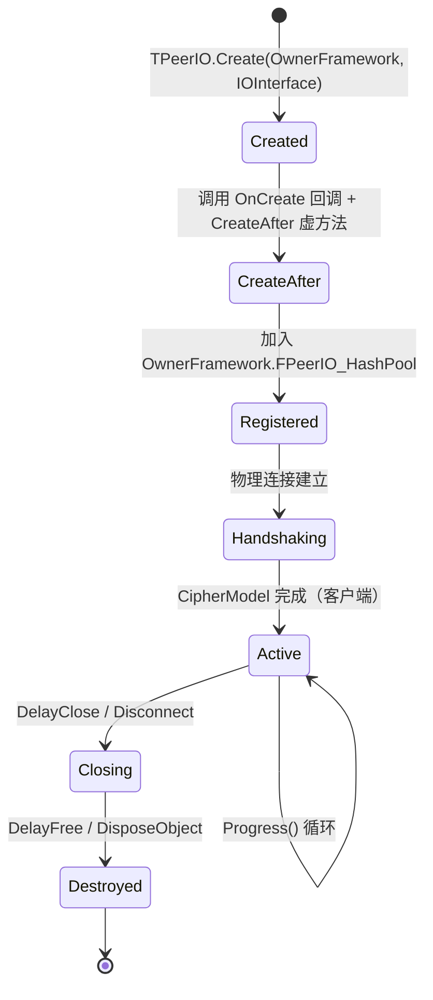

### 4.3 构造与析构

```pascal
constructor TPeerIO.Create(OwnerFramework_: TZNet; IOInterface_: TCore_Object);
procedure TPeerIO.CreateAfter; virtual;      // 子类钩子
destructor  TPeerIO.Destroy; override;
```

**构造流程**：
1. `inherited Create`
2. 锁定 `OwnerFramework.Lock_All_IO`（若 `EnabledAtomicLockAndMultiThread`）
3. 分配 `FID`（通过 `OwnerFramework.MakeID`）
4. 设置协议令牌（`FHeadToken` / `FTailToken` / 六个 `F*Token`）
5. 创建 `FReceived_Physics_Critical` / `FReceived_Physics_Fragment_Pool`
6. 创建 `FReceivedBuffer` / `FReceivedBuffer_Busy`（`TMS64.CustomCreate(8192)`）
7. 初始化 BigStream / CompleteBuffer 状态
8. 创建 `FSend_Queue_Critical` / `FSend_Queue_Pool`
9. 生成随机 `FCipherKey`（`TMISC.GenerateRandomKey` + `TCipher.GenerateKey`）
10. 创建 `FInDataFrame` / `FOutDataFrame` / `FResult_DFE`
11. 调用 `InitSequencePacketModel(64, $FFFF)`
12. 绑定内部回调：`On_Internal_*` / `OnCreate` / `OnDestroy`
13. 创建 `FUser_Define` / `FUser_Special`（通过工厂类）
14. **调用 `OnCreate(self)`**（回调）
15. **调用 `CreateAfter`**（虚方法）
16. 加入 `OwnerFramework.FPeerIO_HashPool`
17. 解锁 `OwnerFramework.UnLock_All_IO`

**⚠️ 关键陷阱**：
- **`FPeerIO_HashPool.Add` 时 `Overwrite_=False`**，若 ID 冲突会抛异常。
- **`MakeID` 用 `AtomInc(FIDSeed)` 生成**，若 ID 环回，可能冲突。

**析构流程**：
1. `CheckAndTriggerFailedWaitResult`（触发待响应的失败回调）
2. `OnDestroy(self)`（回调，异常被吞）
3. `FreeSequencePacketModel`
4. `Internal_Close_P2PVMTunnel`
5. 释放 `FBigStreamSending`（若 `FBigStreamSendDoneTimeFree`）
6. `OwnerFramework.Lock_All_IO` + `FPeerIO_HashPool.Delete(FID)` + `UnLock_All_IO`
7. 清空 `FSend_Queue_Pool`（逐个 `DisposeQueueData`）
8. **延迟释放 `FUser_Define` / `FUser_Special`**（若 `Busy` 或 `BusyNum > 0`，投递到 `TCompute.RunM_NP`）
9. 释放所有内部字段

**⚠️ 关键陷阱**：
- **`FUser_Define` / `FUser_Special` 的 `DelayFreeOnBusy` 会忙等**（`while FBusy or (FBusyNum > 0) do TCompute.Sleep(100)`）。
- **`IOBusy` 返回 True 时，`Disconnect` 只是标记**，真正释放由 `DelayClose`/`DelayFree` 完成。

### 4.4 状态查询

```pascal
function Connected: Boolean; virtual;                        // 子类实现
function IOBusy: Boolean;                                    // 是否忙
function Is_Double_Tunnel: Boolean;
function Is_Recveive_Tunnel: Boolean;
function Is_Send_Tunnel: Boolean;
function Is_Link_OK: Boolean;
function Get_Send_Tunnel_IO: TPeerIO;
function Get_Send_Tunnel(var Send_Tunnel: TZNet; var Send_Tunnel_ID: Cardinal): Boolean;
function Get_Recv_Tunnel_IO: TPeerIO;
function Get_Recv_Tunnel(var Recv_Tunnel: TZNet; var Recv_Tunnel_ID: Cardinal): Boolean;
function NoneCommunicationTime: TTimeTick;                   // 无通信时长
function Get_Last_IO_IDLE_Time: TTimeTick;
```

**`IOBusy` 的判定条件**（任一为 True 则 Busy）：
- `IOSendBuffer.Size > 0`
- `SendingSequencePacketHistory.Count > 0`
- `SequencePacketReceivedPool.Count > 0`
- `FSend_Queue_Pool.Num > 0`
- `FReceivedBuffer.Size > 0` 或 `FReceivedBuffer_Busy.Size > 0`
- `FWaitOnResult`
- `FBigStreamReceiveProcessing`
- `FCompleteBufferReceiveProcessing`
- `FPause_Result_Send`
- `FReceiveTriggerRuning`
- `FReceived_Physics_Fragment_Pool.Num > 0`
- **若 `OwnerFramework is TZNet_Client`**：`FSend_Queue_Swap_Pool.Num > 0`

**`IOBusy` 的副作用**：更新 `FLast_IO_Is_IDLE` 和 `FLast_IO_IDLE_Time`。

### 4.5 核心 Progress 流程

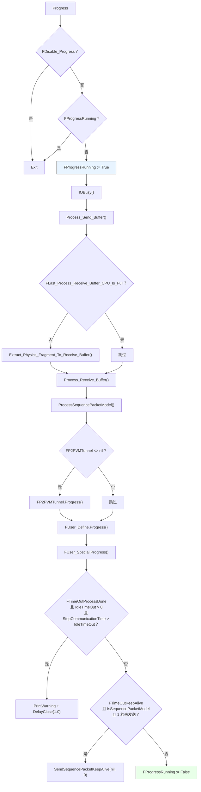

**关键契约**：
- **防重入**：`FProgressRunning` 保证同一 IO 不会嵌套 Progress。
- **优先级**：先发送、再接收、再 Sequence Packet、再 P2PVM、再用户钩子。
- **超时自动关闭**：`FIdleTimeOut > 0` 且 `StopCommunicationTime > FIdleTimeOut` 时，延迟 1 秒关闭。
- **保活**：`FTimeOutKeepAlive=True` 且 `IsSequencePacketModel` 且 1 秒未发送且 `WriteBuffer_is_NULL` 时，发送保活包。

### 4.6 发送路径

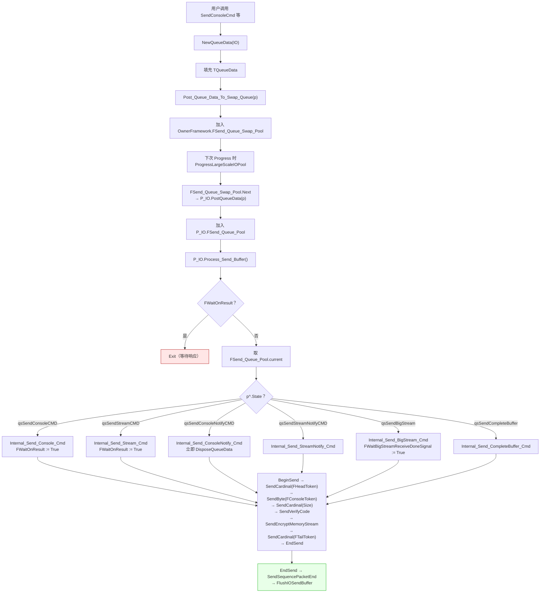

**`Internal_Process_Send_Buffer` 的互斥条件**（任一为 True 则退出）：
- `FAllSendProcessing`
- `FReceiveProcessing`
- `FWaitOnResult`
- `FBigStreamReceiveProcessing`
- `FBigStreamSending <> nil`
- `FReceiveTriggerRuning`
- `FWaitBigStreamReceiveDoneSignal`

### 4.7 接收路径

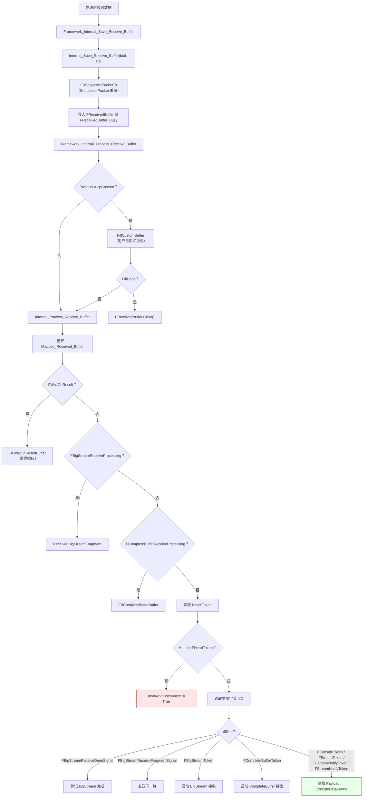

### 4.8 发送 API（按命令类型）

**Console 命令（请求-响应）**：
```pascal
procedure SendConsoleCmd(const Cmd, ConsoleData: SystemString);                          // 无回调
procedure SendConsoleCmdM(const Cmd, ConsoleData; OnResult: TOnConsole_M);
procedure SendConsoleCmdM(const Cmd, ConsoleData; Param1, Param2; OnResult: TOnConsoleParam_M);
procedure SendConsoleCmdM(const Cmd, ConsoleData; Param1, Param2; OnResult; OnFailed);
procedure SendConsoleCmdP(const Cmd, ConsoleData; OnResult: TOnConsole_P);
procedure SendConsoleCmdP(const Cmd, ConsoleData; Param1, Param2; OnResult: TOnConsoleParam_P);
procedure SendConsoleCmdP(const Cmd, ConsoleData; Param1, Param2; OnResult; OnFailed);
```

**Stream 命令（请求-响应）**：
```pascal
procedure SendStreamCmd(const Cmd; StreamData: TMS64; DoneAutoFree: Boolean);
procedure SendStreamCmd(const Cmd; StreamData: TDFE);
procedure SendStreamCmdM(const Cmd; StreamData: TMS64; OnResult: TOnStream_M; DoneAutoFree);
procedure SendStreamCmdM(const Cmd; StreamData: TDFE; OnResult: TOnStream_M);
procedure SendStreamCmdM(const Cmd; StreamData: TDFE; Param1, Param2; OnResult: TOnStreamParam_M);
procedure SendStreamCmdM(const Cmd; StreamData: TDFE; Param1, Param2; OnResult; OnFailed);
procedure SendStreamCmdP(...);  // 同 M 风格，P 回调
```

**单向命令**：
```pascal
procedure SendConsoleNotifyCmd(const Cmd, ConsoleData: SystemString);
procedure SendConsoleNotifyCmd(const Cmd: SystemString);
procedure SendStreamNotifyCmd(const Cmd; StreamData: TMS64; DoneAutoFree: Boolean);
procedure SendStreamNotifyCmd(const Cmd; StreamData: TDFE);
procedure SendStreamNotifyCmd(const Cmd: SystemString);
```

**BigStream**：
```pascal
procedure SendBigStream(const Cmd; BigStream: TCore_Stream; StartPos: Int64; DoneAutoFree: Boolean);
procedure SendBigStream(const Cmd; BigStream: TCore_Stream; DoneAutoFree: Boolean);
```

**CompleteBuffer**：
```pascal
procedure SendCompleteBuffer(const Cmd; buff: PByte; BuffSize: NativeInt; DoneAutoFree: Boolean);
procedure SendCompleteBuffer(const Cmd; buff: TMS64; DoneAutoFree: Boolean);
procedure SendCompleteBuffer(const Cmd; buff: TMem64; DoneAutoFree: Boolean);
procedure SendCompleteBuffer(const Cmd; buff: TDFE);                // 转 StreamNotify
procedure SendCompleteBuffer_StreamNotify(const Cmd; buff: TDFE);   // 优化版
procedure SendCompleteBuffer_NoWait_StreamM(const Cmd; buff: TDFE; OnResult: TOnStream_M);
procedure SendCompleteBuffer_NoWait_StreamP(const Cmd; buff: TDFE; OnResult: TOnStream_P);
```

**同步等待**：
```pascal
function WaitSendConsoleCmd(Cmd, ConsoleData: SystemString; TimeOut_: TTimeTick): SystemString;
procedure WaitSendStreamCmd(const Cmd; StreamData, Result_: TDFE; TimeOut_: TTimeTick);
```

**NULL（保活）**：
```pascal
procedure Send_NULL();
procedure SendNULL();
```

### 4.9 Pause / Resume 机制

```pascal
procedure Pause;                  // 暂停结果发送（FCanPauseResultSend 必须为 True）
procedure PauseResultSend;        // = Pause
procedure BreakResultSend;        // = Pause
procedure SkipResultSend;         // = Pause
procedure NoResultSend;           // = Pause
procedure StopResultSend;         // = Pause

procedure Resume;                 // 继续发送结果
procedure ContinueResultSend;     // = Resume
procedure Continue_Send_Result;   // = Resume
procedure ResumeResultSend;       // = Resume
procedure NowResultSend;          // = Resume

function ResultSendIsPaused: Boolean;
property ResultIsPaused: Boolean read ResultSendIsPaused;
```

**契约**：
- **`Pause` 只能在 `ExecuteDataFrame` 内调用**（`FCanPauseResultSend=True`）。
- **`Pause` 后，当前命令的响应延迟到 `Resume` 时发送**。
- **所有 `Break/Skip/No/Stop` 都是 `Pause` 的别名**（语义不同但行为相同）。
- **所有 `Continue/Resume/Now` 都是 `Resume` 的别名**。

**典型用法**（异步响应）：

```pascal
Net.RegisterConsole('slowQuery').OnExecute :=
  procedure(Sender: TPeerIO; InData: string; var OutData: string)
  begin
    Sender.Pause;                      // 暂停响应
    TCompute.RunC_NP(procedure
      begin
        Sleep(5000);                   // 后台耗时操作
        SysPost.PostExecuteC_NP(0, procedure
          begin
            OutData := 'done after 5s';
            Sender.Resume;             // 发送响应
          end);
      end);
  end;
```

### 4.10 Sequence Packet Model

**初始化**：
```pascal
procedure InitSequencePacketModel(const hashSize, MemoryDelta: Integer);
```

**生命周期**：
```pascal
procedure FreeSequencePacketModel;
procedure ResetSequencePacketBuffer;
procedure ProcessSequencePacketModel;      // 在 Progress 中调用
```

**核心字段**：
- `FSequencePacketActivted`：是否激活
- `FSequencePacketSignal`：True = 需确认，False = 安静模式
- `SequenceNumberOnSendCounter` / `SequenceNumberOnReceivedCounter`：发送/接收序号
- `SendingSequencePacketHistory: TSequence_Packet_Hash_Pool`：发送历史
- `SequencePacketReceivedPool: TSequence_Packet_Hash_Pool`：接收池
- `FSequencePacketMTU: Word`：每包最大负载（默认 1536）
- `FSequencePacketLimitPhysicsMemory: Int64`：内存限制（0 = 无限）
- `SequencePacketCloseDone: Boolean`：是否已触发关闭

**协议流程**：

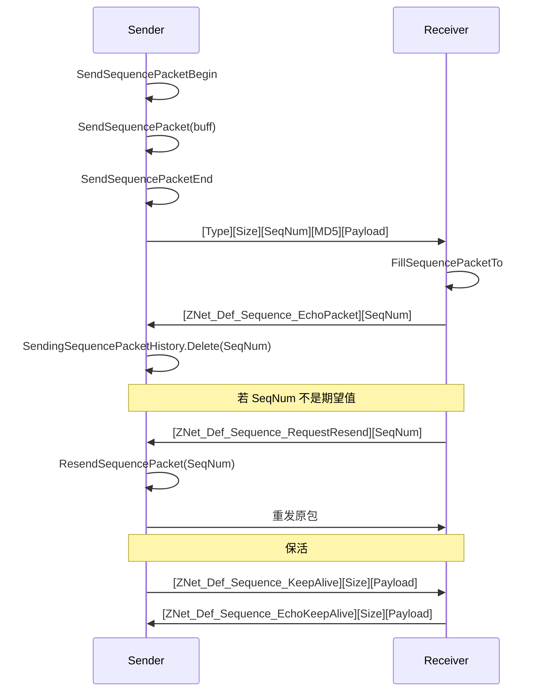

**内存限制**：
- `FSequencePacketLimitPhysicsMemory > 0` 且 `SendingSequencePacketHistoryMemory + SequencePacketReceivedPoolMemory > limit` 时，**打印错误并延迟关闭**。
- `FSequencePacketLimitPhysicsMemory = 0` 表示无限制。

**默认值**：
- `ZNet` 构造时 `FSequencePacketActivted := {$IFDEF UsedSequencePacket}True{$ELSE}False`。
- **大多数场景下默认关闭**，只有 P2PVM 和 StableIO 明确启用。

### 4.11 P2PVM 隧道管理

**OpenP2PVMTunnel 系列**（共 13 个重载）：
```pascal
procedure OpenP2PVMTunnel(vmHashPoolSize: Integer; SendRemoteRequest: Boolean; const AuthToken: SystemString);
procedure OpenP2PVMTunnel(SendRemoteRequest: Boolean; const AuthToken: SystemString);
procedure OpenP2PVMTunnelC(...);  // 带状态回调
procedure OpenP2PVMTunnelM(...);
procedure OpenP2PVMTunnelP(...);
procedure OpenP2PVMTunnelIO_C(...);  // 带 IO 状态回调
// 等等
```

**BuildP2PAuthToken 系列**：
```pascal
procedure BuildP2PAuthToken;                     // 触发认证
procedure BuildP2PAuthTokenC(const OnResult: TOnNotify_C);
procedure BuildP2PAuthTokenM(const OnResult: TOnNotify_M);
procedure BuildP2PAuthTokenP(const OnResult: TOnNotify_P);
procedure BuildP2PAuthTokenIO_C(const OnResult: TOnIONotify_C);
procedure BuildP2PAuthTokenIO_M(const OnResult: TOnIONotify_M);
procedure BuildP2PAuthTokenIO_P(const OnResult: TOnIONotify_P);
```

**CloseP2PVMTunnel**：
```pascal
procedure CloseP2PVMTunnel;
```

**契约**：
- **`OpenP2PVMTunnel` 前必须 `IOBusy=False`**，否则报错退出。
- **`SendRemoteRequest=True` 时主动发送 `C_InitP2PTunnel` 通知**。
- **`vmHashPoolSize`**：客户端默认 16384，服务端默认 64。
- **`AuthToken`** 会通过 `C_InitP2PTunnel` 发给远端，远端 `p2pVMTunnelAuth` 验证。

### 4.12 用户数据

```pascal
property UserData: Pointer;                      // 通用指针
property UserValue: Variant;                     // 通用 Variant
property UserVariants: THashVariantList;         // 懒创建键值 Variant
property UserObjects: THashObjectList;           // 懒创建对象（不自动释放）
property UserAutoFreeObjects: THashObjectList;   // 懒创建对象（自动释放）
property UserDefine: TPeer_IO_User_Define;       // 用户自定义对象
property UserSpecial: TPeer_IO_User_Special;     // 第二个用户对象
```

**`TPeer_IO_User_Define`**：
```pascal
TStableServer_OwnerIO_UserDefine.Create(Owner_: TPeerIO);
  FOwner: TPeerIO;
  FWorkPlatform: TExecutePlatform;
  FBigStreamBatch: TBigStreamBatch;
  FBusy: Boolean;
  FBusyNum: Integer;
  property BigStreamBatchList / BigStreamBatch / BatchStream / BatchList: TBigStreamBatch;
  function BusyNum: PInteger;
```

**`TPeer_IO_User_Special`**：与 `TPeer_IO_User_Define` 类似，但无 `BigStreamBatch`。

**工厂类设置**：
```pascal
Net.UserDefineClass := TMyDefine;    // 自定义 UserDefine
Net.UserSpecialClass := TMySpecial;
```

**⚠️ 陷阱**：
- **`UserVariants` / `UserObjects` / `UserAutoFreeObjects` 懒创建**。
- **`UserObjects` 不自动释放**，`UserAutoFreeObjects` 自动释放。
- **`UserDefine` 的 `DelayFreeOnBusy` 会忙等**（见 §4.3）。

### 4.13 自定义协议缓冲

```pascal
procedure BeginWriteCustomBuffer;
procedure EndWriteCustomBuffer;
procedure WriteCustomBuffer(const Buffer: PByte; const Size: NativeInt); overload; virtual;
procedure WriteCustomBuffer(const Buffer: TMS64); overload;
procedure WriteCustomBuffer(const Buffer: TMem64); overload;
procedure WriteCustomBuffer(const Buffer: TMS64; const doneFreeBuffer: Boolean); overload;
procedure WriteCustomBuffer(const Buffer: TMem64; const doneFreeBuffer: Boolean); overload;
```

**契约**：
- **`Protocol=cpCustom` 时使用**：绕过 ZServer 协议头，直接发送原始字节。
- **`WriteCustomBuffer` 会调用 `On_Internal_Send_Byte_Buffer`**（不经过 Sequence Packet）。

---

## 第 5 章 `TZNet` —— 基础框架

### 5.1 定位

`TZNet` 是**所有网络框架的基类**。它管理命令注册、IO 连接池、Progress 事件、统计、安全设置和 P2PVM 集成。

### 5.2 关键字段

| 字段 | 类型 | 语义 |
|------|------|------|
| `FCritical` / `FSend_Critical` | `TCritical` | 全局锁 / 发送锁 |
| `FZNet_Instance_Ptr__` | `TZNet_Instance_Pool.PQueueStruct` | 全局实例池指针 |
| `FCommand_Hash_Pool` | `TCommand_Hash_Pool` | 注册命令池 |
| `FPeerIO_HashPool` | `TPeer_IO_Hash_Pool` | IO 池（ID → TPeerIO） |
| `FIDSeed` | `Cardinal` | IO ID 生成器 |
| `FProgress_CPS` | `TCPS_Tool` | Progress 性能计数 |
| `FProgress_Pool` | `TZNet_Progress_Pool` | Progress 事件池 |
| `FPostProgress` | `TN_Progress_ToolWithCadencer` | 延迟任务调度器 |
| `FProtocol` | `TCommunicationProtocol` | `cpZServer` 或 `cpCustom` |
| `FSequencePacketActivted` | `Boolean` | 是否启用 Sequence Packet |
| `FCipherSecurityArray` | `TCipherSecurityArray` | 可用加密算法列表 |
| `FHashSecurity` | `THashSecurity` | 哈希算法 |
| `FIOInterface` | `IIOInterface` | IO 事件接口 |
| `FVMInterface` | `IZNet_VMInterface` | P2PVM 事件接口 |
| `FOnBigStreamInterface` | `IOnBigStreamInterface` | BigStream 进度接口 |

### 5.3 安全设置

```pascal
procedure SwitchMaxPerformance;      // 最大性能：不加密、不压缩、csNone
procedure SwitchMaxSecurity;         // 最大安全：并行加密、MD5、压缩
procedure SwitchDefaultPerformance;  // 默认：快速加密、不压缩
```

**三者差异**：

| 属性 | MaxPerformance | MaxSecurity | DefaultPerformance |
|------|---------------|-------------|-------------------|
| `FastEncrypt` | True | False | True |
| `UsedParallelEncrypt` | False | True | True |
| `HashSecurity` | hsNone | hsFastMD5 | hsNone |
| `SendDataCompressed` | False | True | False |
| `CompleteBufferCompressed` | False | False | False |
| `CipherSecurityArray` | `[csNone]` | `[RC6, Serpent, Mars, Rijndael, Twofish, AES128, AES192, AES256]` | `[DES64, DES128, DES192, Blowfish, LBC, LQC, XXTea512, RC6, Serpent, Mars, Rijndael, Twofish, AES128, AES192, AES256]` |

### 5.4 命令注册

```pascal
function RegisterConsole(const Cmd: SystemString): TCommandConsole;
function RegisterStream(const Cmd: SystemString): TCommandStream;
function RegisterStreamNotify(const Cmd: SystemString): TCommandStreamNotify;
function RegisterConsoleNotify(const Cmd: SystemString): TCommandConsoleNotify;
function RegisterBigStream(const Cmd: SystemString): TCommandBigStream;
function RegisterCompleteBuffer(const Cmd: SystemString): TCommandCompleteBuffer;
function RegisterCompleteBuffer_StreamNotify(const Cmd: SystemString): TCommandCompleteBuffer_StreamNotify;
function RegisterCompleteBuffer_Asynchronous_StreamNotify(const Cmd: SystemString): TCommandCompleteBuffer_StreamNotify;
function RegisterCompleteBuffer_NoWait_Stream(const Cmd: SystemString): TCommandCompleteBuffer_NoWait_Stream;
function RegisterCompleteBuffer_NoWait_Stream_Thread(const Cmd: SystemString): TCommandCompleteBuffer_NoWait_Stream;
function RegisterCompleteBuffer_NoWait_Bridge_Stream(const Cmd: SystemString): TCommandCompleteBuffer_NoWait_Bridge_Stream;

function RemoveRegistedCMD(const Cmd: SystemString): Boolean;
function DeleteRegistedCMD(const Cmd: SystemString): Boolean;
function UnRegisted(const Cmd: SystemString): Boolean;
function ExistsRegistedCmd(const Cmd: SystemString): Boolean;
```

**契约**：
- **重复注册会抛 `RaiseInfo`**（`exists cmd: xxx`）。
- **注册失败（`CanRegCommand` 返回 False）会抛 `RaiseInfo`**。
- **注册成功后，回调默认为 nil**，必须手动赋值 `OnExecute`。
- **注册命令会立即在 `CmdRecvStatistics` 和 `CmdMaxExecuteConsumeStatistics` 中创建条目**。

### 5.5 Progress 流程

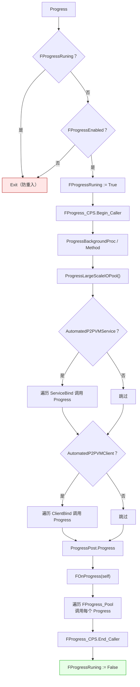

**`ProgressLargeScaleIOPool` 的行为**：
- **当 `FPeerIO_HashPool.Num <= 0`**：清理 `FSend_Queue_Swap_Pool` 中所有待发送队列（打印错误）。
- **当 `FProgress_LargeScale_IO_Pool.Num <= 0` 或 `FProgressMaxDelay = 0`**：
  - 将 `FSend_Queue_Swap_Pool` 中的队列分发到对应 IO（客户端用 `ClientIO`，服务端按 `IO_ID` 查找）。
  - 调用 `GetIO_Order(FProgress_LargeScale_IO_Pool)` 重新填充 IO 顺序。
- **遍历 `FProgress_LargeScale_IO_Pool`**：
  - 对每个 IO 调用 `Progress`。
  - **当 `GetTimeTick - tk > FProgressMaxDelay` 时中断**。

**关键契约**：
- **`ProgressMaxDelay` 控制单次 Progress 最多耗时**。
- **大连接数场景下，`ProgressLargeScaleIOPool` 会分批处理，避免阻塞**。
- **`Progress` 不可重入**：`FProgressRuning` 阻止嵌套调用。

### 5.6 IO 遍历

```pascal
procedure GetIO_Array(out IO_Array: TIO_Array);              // 快照数组
procedure GetIO_Order(Order_: TIO_Order);                    // FIFO 队列
procedure ProgressPeerIOC(const OnBackcall: TPeerIOList_C);  // 遍历（快照）
procedure ProgressPeerIOM(const OnBackcall: TPeerIOList_M);
procedure ProgressPeerIOP(const OnBackcall: TPeerIOList_P);
procedure FastProgressPeerIOC(const OnBackcall: TPeerIOList_C);  // 遍历（直接迭代）
procedure FastProgressPeerIOM(const OnBackcall: TPeerIOList_M);
procedure FastProgressPeerIOP(const OnBackcall: TPeerIOList_P);
```

**契约**：
- **`GetIO_Array` / `GetIO_Order` 会加 `Lock_All_IO`**。
- **`ProgressPeerIO*` 用快照，安全但慢**。
- **`FastProgressPeerIO*` 直接迭代 `FPeerIO_HashPool.Repeat_`，快但不允许在回调中修改 IO 池**。
- **`OnBackcall` 异常被吞掉**。

### 5.7 发送 API（服务端包装）

`TZNet` 本身**不直接提供** `SendConsoleCmd` 等方法（除 `TPeerIO` 的转发版本）。具体发送 API 在 `TZNet_Server` / `TZNet_Client` 中。

### 5.8 单例池与统计

```pascal
var
  ZNet_Instance_Pool: TZNet_Instance_Pool;     // 所有 TZNet 实例
  HPC_Instance_Pool: THPC_Instance_Pool;       // 所有 HPC 任务
```

**`TZNet_Instance_Pool`** 提供：
```pascal
procedure Print_Status;                       // 打印所有实例的状态
procedure Print_Service_Statistics_Info;      // 打印服务端统计
procedure Print_Service_CMD_Info;             // 打印服务端命令统计
procedure Print_Client_Statistics_Info;       // 打印客户端统计
procedure Print_Client_CMD_Info;              // 打印客户端命令统计
```

**`Statistics` 数组**：`array [TStatisticsType] of Int64`，共 40+ 种统计。

**命令统计**：
- `CmdRecvStatistics: TCommand_Num_Hash_Pool`：收到的命令计数
- `CmdSendStatistics: TCommand_Num_Hash_Pool`：发送的命令计数
- `CmdMaxExecuteConsumeStatistics: TCommand_Tick_Hash_Pool`：命令执行耗时峰值

### 5.9 复制参数

```pascal
procedure CopyParamFrom(Source: TZNet);
procedure CopyParamTo(Dest: TZNet);
```

**复制内容**（共 25 项）：
- FastEncrypt / UsedParallelEncrypt / HashSecurity
- SendDataCompressed / CompleteBufferCompressed
- SyncOnResult / SyncOnCompleteBuffer
- BigStreamMemorySwapSpace / BigStreamSwapSpaceTriggerSize
- EnabledAtomicLockAndMultiThread / TimeOutKeepAlive / QuietMode
- PhysicsFragmentSwapSpaceTechnology / PhysicsFragmentSwapSpaceTrigger
- Per_Progress_Loop_Limit / Extract_Physics_Fragment_Max_Size
- MaxCompleteBufferSize / CompleteBufferCompressionCondition
- CompleteBufferSwapSpace / CompleteBufferSwapSpaceTriggerSize
- AutomaticWaitRemoteReponse / Encrypt_P2PVM_Packet
- ProgressMaxDelay / SendFlushSize
- PrefixName / name

**典型用途**：`TZNet_WithP2PVM_Client.CloneConnect*` 创建 clone 时复制配置。

### 5.10 双隧道支持

```pascal
property DoubleChannelFramework: TCore_Object;
```

**用途**：当框架属于 `TDTService_*` / `TDTClient_*` 时，**收发使用不同的物理连接**。

**相关判定**（`TPeerIO` 上）：
- `Is_Double_Tunnel`：是否为双隧道
- `Is_Recveive_Tunnel`：是否为接收隧道
- `Is_Send_Tunnel`：是否为发送隧道
- `Is_Link_OK`：双隧道是否都已就绪

---

## 第 6 章 `TZNet_Server` —— 服务端实现

### 6.1 定位

`TZNet_Server` 是**服务端的具体实现**。它管理所有入站连接、命令执行、广播和每 IO 发送。

### 6.2 关键虚方法

```pascal
procedure StopService; virtual;
function  StartService(Host: SystemString; Port: Word): Boolean; virtual;
procedure DoIOConnectBefore(Sender: TPeerIO); virtual;
procedure DoIOConnectAfter(Sender: TPeerIO); virtual;
procedure DoIODisconnect(Sender: TPeerIO); virtual;
```

**契约**：
- **`StartService` 是虚方法**，子类必须实现实际监听逻辑。
- **`StopService` 是虚方法**，子类必须实现关闭逻辑。
- **`DoIOConnectBefore` 在新连接建立时、CipherModel 前调用**。
- **`DoIOConnectAfter` 在 CipherModel 后、P2PVM 初始化前调用**。
- **`DoIODisconnect` 在 IO 断开时调用**。

### 6.3 自定义协议

```pascal
property FOnServerCustomProtocolReceiveBufferNotify: TOnServerCustomProtocolReceiveBufferNotify;
procedure OnReceiveBuffer(Sender: TPeerIO; const Buffer: PByte; const Size: NativeInt; var FillDone: Boolean); virtual;
```

**契约**：
- **`Protocol=cpCustom` 时**，原始字节流进入 `FillCustomBuffer`。
- **`OnReceiveBuffer` 由用户重写**，处理自定义协议。
- **`FillDone=False` 时**，会调用默认的 `Internal_Process_Receive_Buffer`。

### 6.4 服务端发送 API

所有 `TZNet` 客户端版本都提供**两个版本**：
- **`P_IO: TPeerIO` 版本**：直接传 IO
- **`IO_ID: Cardinal` 版本**：传 IO ID

**Console**：
```pascal
procedure SendConsoleCmd(P_IO: TPeerIO; const Cmd, ConsoleData: SystemString);
procedure SendConsoleCmdM(P_IO: TPeerIO; const Cmd, ConsoleData; OnResult: TOnConsole_M);
procedure SendConsoleCmdM(P_IO: TPeerIO; const Cmd, ConsoleData; Param1, Param2; OnResult: TOnConsoleParam_M);
procedure SendConsoleCmdM(P_IO: TPeerIO; const Cmd, ConsoleData; Param1, Param2; OnResult; OnFailed);
procedure SendConsoleCmdP(...);
procedure SendConsoleCmd(IO_ID: Cardinal; const Cmd, ConsoleData);
// ... 相同重载
```

**Stream** / **ConsoleNotify** / **StreamNotify** / **BigStream** / **CompleteBuffer** 都提供 P_IO 和 IO_ID 两种版本。

### 6.5 广播 API

```pascal
procedure BroadcastConsoleNotifyCmd(const Cmd, ConsoleData: SystemString);
procedure BroadcastStreamNotifyCmd(const Cmd: SystemString; StreamData: TDFE);
procedure BroadcastCompleteBufferCmd(const Cmd: SystemString; buff: PByte; BuffSize: NativeInt);
procedure BroadcastCompleteBufferCmd(const Cmd: SystemString; StreamData: TDFE);
```

**契约**：
- **`Broadcast*` 只支持单向命令**（Notify / CompleteBuffer）。
- **不提供 Console / Stream 请求-响应的广播**（响应无法路由到正确的发起者）。
- **广播内部用 `GetIO_Array` 获取快照**，逐个发送。

### 6.6 IO 枚举

```pascal
function GetCount: Integer;
property Count: Integer read GetCount;
function Exists(P_IO: TPeerIO): Boolean;
function Exists(P_IO: TPeer_IO_User_Define): Boolean;
function Exists(P_IO: TPeer_IO_User_Special): Boolean;
function Exists(IO_ID: Cardinal): Boolean;
function GetPeerIO(ID: Cardinal): TPeerIO;
property IO[ID: Cardinal]: TPeerIO read GetPeerIO; default;
property PeerIO[ID: Cardinal]: TPeerIO read GetPeerIO;
```

### 6.7 服务端构造函数

```pascal
constructor TZNet_Server.Create;                                  // HashPoolSize = 100000
constructor TZNet_Server.CreateCustomHashPool(HashPoolSize: Integer);
destructor  TZNet_Server.Destroy; override;
```

**构造时**：
- 注册 `C_CipherModel`（Stream）和 `C_Wait`（Console）。
- `FFrameworkIsServer := True; FFrameworkIsClient := False`。

**析构时**：
- **等待所有 HPC 线程完成**（`FCMD_Thread_Runing_Num > 0`，最多 5 秒）。
- 删除 `C_CipherModel` / `C_Wait` 注册。

**⚠️ 陷阱**：`Destroy` 里的等待循环会调用 `Check_Soft_Thread_Synchronize(100, False)`，**依赖 Z.Core 的软同步机制**。

### 6.8 `Command_CipherModel` 握手

**服务端处理**：

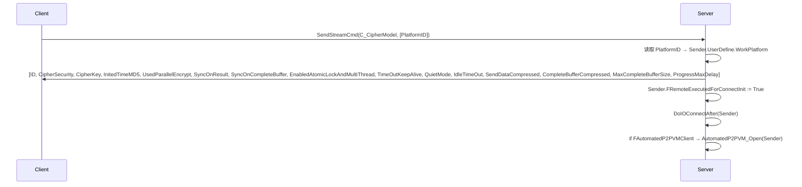

**关键契约**：
- **`C_CipherModel` 是服务端与客户端握手的第一条命令**。
- **`Sender.ID` 在客户端被服务端覆盖**（客户端用服务端分配的 ID）。
- **`Sender.FCipherKey` 被服务端覆盖**（新随机密钥）。
- **`FInitedTimeMD5`** 用于检测服务端重启（客户端收到不同的 MD5 说明服务端重启）。

---

## 第 7 章 `TZNet_Client` —— 客户端实现

### 7.1 定位

`TZNet_Client` 是**客户端的抽象实现**。它管理单连接、同步/异步连接、命令发送，并接收连接事件回调。

### 7.2 关键字段

```pascal
FOnInterface: IZNet_ClientInterface;         // 客户端事件接口
FConnectInitWaiting: Boolean;                 // 是否等待初始化
FConnectInitWaitingTimeout: TTimeTick;        // 初始化超时
FAsyncConnectTimeout: TTimeTick;              // 异步连接超时（默认 60000ms）
FOnCipherModelDone: TOnCipherModelDone;       // CipherModel 完成回调
FServerState: TZNet_ServerState;              // 服务端状态快照
FIgnoreProcessConnectedAndDisconnect: Boolean; // 是否忽略连接/断开事件
FLastConnectIsSuccessed: Boolean;             // 上次连接是否成功
FStableIO: TZNet_StableClient;                // 稳定会话层
FWaiting: Boolean;                            // 是否在 Wait 中
FWaitingTimeOut: TTimeTick;
FOnWaitResult_C/M/P;                          // Wait 回调
```

### 7.3 `TZNet_ServerState`

```pascal
TZNet_ServerState = record
  UsedParallelEncrypt, SyncOnResult, SyncOnCompleteBuffer,
  EnabledAtomicLockAndMultiThread, TimeOutKeepAlive, QuietMode: Boolean;
  IdleTimeOut: TTimeTick;
  SendDataCompressed, CompleteBufferCompressed: Boolean;
  MaxCompleteBufferSize: Cardinal;
  ProgressMaxDelay: TTimeTick;
  procedure Reset;
end;
```

**用途**：客户端在 `C_CipherModel` 响应中解析服务端配置，存储在 `FServerState`。

### 7.4 连接流程

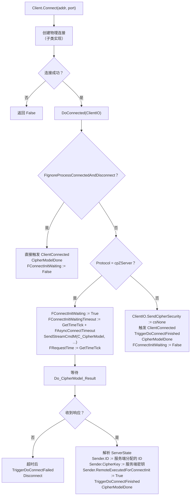

**关键契约**：
- **`FConnectInitWaitingTimeout`** 默认 60 秒（`FAsyncConnectTimeout`）。
- **超时后自动 `TriggerDoConnectFailed` 并 `Disconnect`**。
- **`FOnInterface.ClientConnected`** 在发送 `C_CipherModel` 时或 `Ignore` 模式时触发。
- **`FOnInterface.ClientDisconnect`** 在 `DoDisconnect` 时触发（仅当 `FLastConnectIsSuccessed=True`）。

### 7.5 异步连接 API

```pascal
procedure AsyncConnectC(addr: SystemString; Port: Word; const OnResult: TOnState_C); overload;
procedure AsyncConnectM(addr: SystemString; Port: Word; const OnResult: TOnState_M); overload;
procedure AsyncConnectP(addr: SystemString; Port: Word; const OnResult: TOnState_P); overload;
procedure AsyncConnectC(addr: SystemString; Port: Word; Param1, Param2; const OnResult: TOnParamState_C); overload;
procedure AsyncConnectM(...);  // 同上
procedure AsyncConnectP(...);
```

**契约**：
- **`TZNet_Client` 的 `AsyncConnect*` 默认是同步的**（内部调用 `Connect`，立即触发回调）。
- **`TZNet_WithP2PVM_Client` 的 `AsyncConnect*` 是真正的异步**（通过 P2PVM 隧道）。

### 7.6 Wait 系列（异步等待响应）

```pascal
function Wait(TimeOut_: TTimeTick): SystemString;                  // 同步阻塞
function WaitC(TimeOut_: TTimeTick; const OnResult: TOnState_C): Boolean;
function WaitM(TimeOut_: TTimeTick; const OnResult: TOnState_M): Boolean;
function WaitP(TimeOut_: TTimeTick; const OnResult: TOnState_P): Boolean;
```

**`Wait` 的实现**：
- 调用 `WaitSendConsoleCmd(C_Wait, '', GetWaitTimeout(TimeOut_))`。
- `C_Wait` 是服务端的内部命令，返回当前时间。
- **`GetWaitTimeout(0)` 返回 `1000 * 60 * 30`（30 分钟）**。

**`WaitC/M/P` 的实现**：
- 检查 `ClientIO` 和 `Connected`。
- 若 `FWaiting=True`，直接返回 False。
- 设置 `FWaiting := True` 和 `FWaitingTimeOut`。
- 发送 `C_Wait` 命令，回调 `ConsoleResult_Wait`。
- **`Progress` 中检查超时**，超时触发 `False` 回调。

### 7.7 客户端发送 API

`TZNet_Client` 提供与 `TPeerIO` 类似的方法，但**隐式使用 `ClientIO`**：

```pascal
procedure SendConsoleCmd(const Cmd, ConsoleData: SystemString);
procedure SendConsoleCmdM(const Cmd, ConsoleData; OnResult: TOnConsole_M);
procedure SendConsoleCmdM(const Cmd, ConsoleData; Param1, Param2; OnResult: TOnConsoleParam_M);
procedure SendConsoleCmdM(const Cmd, ConsoleData; Param1, Param2; OnResult; OnFailed);
procedure SendConsoleCmdP(...);
// ... 其他命令类型类似
```

**契约**：
- **ClientIO = nil 或未连接时直接返回**（不报错）。
- **所有发送走 `Post_Queue_Data_To_Swap_Queue`**，在下次 `Progress` 时真正发送。

### 7.8 客户端状态查询

```pascal
function Connected: Boolean; virtual;                  // 子类实现
function ClientIO: TPeerIO; virtual;                   // 子类实现
function ServerState: PZNet_ServerState;
property ReponseTime: TTimeTick;                       // 服务端响应延迟
function WaitSendBusy: Boolean;
function LastQueueData: PQueueData;
function LastQueueCmd: SystemString;
function QueueCmdCount: Integer;
function Last_IO_IDLE_Time: TTimeTick;
function Client_ID: Cardinal;
function RemoteID: Cardinal;
function RemoteKey: TCipherKeyBuffer;
function RemoteInited: Boolean;
```

### 7.9 客户端生命周期

```pascal
procedure TriggerDoDisconnect;                         // 触发断开
function  StableIO: TZNet_StableClient;                // 获取稳定会话层
procedure DelayFreeSelf;                               // 延迟释放自己
procedure IO_IDLE_TraceC/M/P;                          // IO 空闲跟踪
procedure IO_IDLE_Trace_And_FreeSelf;                  // IO 空闲后释放自己
procedure Disconnect; virtual;
procedure DelayCloseIO; overload;
procedure DelayCloseIO(const t: Double); overload;
```

---

## 第 8 章 `TZNet_P2PVM` —— P2P 虚拟网络

### 8.1 定位

`TZNet_P2PVM` 是 **P2P 虚拟网络覆盖层**。它在已有物理连接之上建立虚拟网络，提供：
- 认证（握手 + 加密密钥交换）
- 虚拟监听与连接（NAT 穿透）
- 分片加密数据传输
- 延迟探测/保活
- 多框架管理

### 8.2 核心字段

```pascal
FOwner_IO: TPeerIO;                    // 底层物理 IO
FAuthWaiting: Boolean;                 // 是否等待认证
FAuthed: Boolean;                      // 是否已认证
FAuthSending: Boolean;                 // 是否已发送认证 token
FFrameworkPool: TUInt32HashObjectList; // 已安装的逻辑框架
FFrameworkListenPool: TP2PVM_Listen_List; // 监听记录
FMaxVMFragmentSize: Cardinal;          // 最大分片大小（默认 1536）
FProgress_Send_Size: Int64;            // 单次 Progress 最大发送（默认 500KB）
FQuietMode: Boolean;                   // 安静模式
FReceiveStream: TMem64;                // 接收缓冲
FSendStream: TMem64;                   // 发送缓冲
FWaitEchoList: TP2PVM_ECHO_List;       // 延迟探测列表
FVMID: Cardinal;                       // 虚拟网络 ID（= Owner IO ID）
OnAuthSuccessOnesNotify: TP2PVMAuthSuccessMethod; // 认证成功一次性回调
```

### 8.3 生命周期

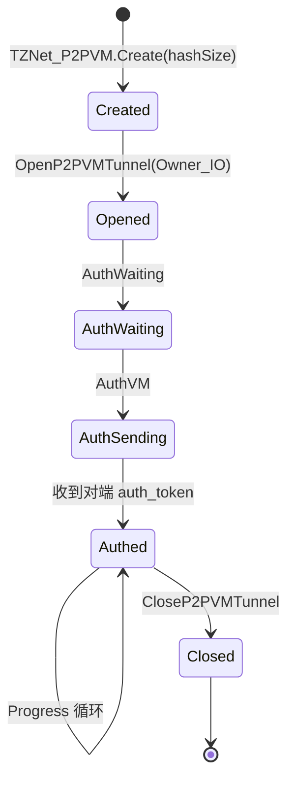

**`OpenP2PVMTunnel(c: TPeerIO)` 的行为**：
1. 设置 `FOwner_IO := c`。
2. 重置认证状态。
3. **劫持 IO 的内部回调**：
   - `On_Internal_Send_Byte_Buffer := Hook_SendByteBuffer`
   - `On_Internal_Save_Receive_Buffer := Hook_SaveReceiveBuffer`
   - `On_Internal_Process_Receive_Buffer := Hook_ProcessReceiveBuffer`
   - `OnDestroy := Hook_ClientDestroy`
4. 打印 `Open VM P2P Tunnel`。

**`CloseP2PVMTunnel` 的行为**：
1. 释放所有待处理 echo。
2. 遍历 `FFrameworkPool`：
   - `TZNet_WithP2PVM_Server`：调用 `ProgressPeerIOM(DoPerClientClose)` + `FLinkVMPool.Delete(FVMID)`
   - `TZNet_WithP2PVM_Client`：调用 `ProgressPeerIOM(DoPerClientClose)` + `FLinkVM := nil`
3. 重置认证状态。
4. **恢复 IO 的原始回调**。
5. `FOwner_IO := nil`。

### 8.4 认证流程

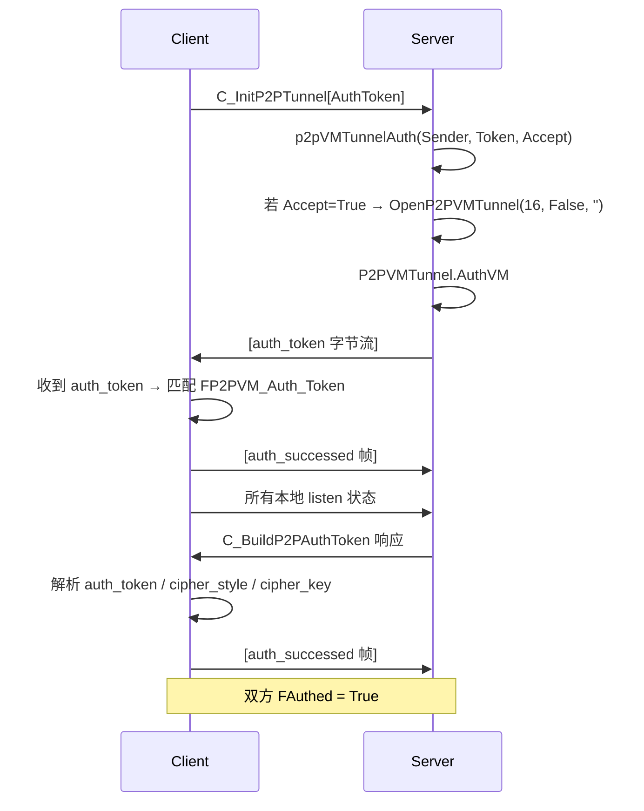

**关键契约**：
- **`FP2PVM_Auth_Token` 是服务端生成的随机 token**（16 × 4 = 64 字节）。
- **`FP2PVM_Cipher_Key` 是服务端生成的随机密钥**（256 字节）。
- **`FP2PVM_Cipher` 是加密实例**（由 `CreateCipherClassFromBuffer` 创建）。
- **`BuildP2PAuthToken`** 客户端先发起，服务端在 `CMD_BuildP2PAuthToken` 中生成 token。
- **`CMD_InitP2PTunnel`** 服务端收到后，调用 `p2pVMTunnelAuth` 验证，`Accept=True` 时打开隧道。
- **`AuthVM`** 发送 `FP2PVM_Auth_Token`。
- **`AuthSuccessed`** 发送成功标记帧。

**`ZNet_Def_VMAuthSize = 16`**：token 由 16 个 32 位整数组成。

### 8.5 虚拟连接流程

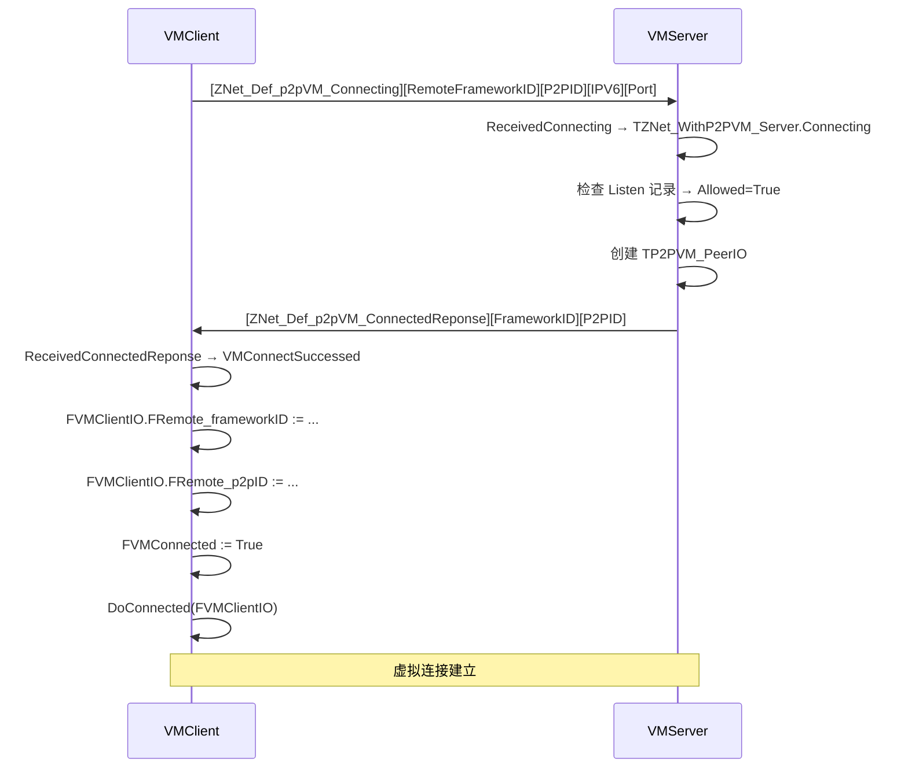

### 8.6 分片数据流

**发送**：
1. `TP2PVM_PeerIO.Write_IO_Buffer` → `FRealSendBuff`
2. `TP2PVM_PeerIO.WriteBufferFlush` → 按 `FMaxVMFragmentSize` 切片 → `FSendQueue.Push`
3. `TZNet_P2PVM.Progress` → `DoProcessPerClientFragmentSend` → `p^.Build_P2PVM_Send_Buffer(FSendStream)`
4. `SendVMBuffer(FSendStream.Memory, FSendStream.Size)` → `FOwner_IO.WriteBufferOpen/.../WriteBufferClose`

**接收**：
1. `Hook_SaveReceiveBuffer` → `FReceiveStream.WritePtr`
2. `Hook_ProcessReceiveBuffer` → 解析分片头 → 分派到 `Received*` 处理
3. `ReceivedLogicFragmentData` → `LocalVMc.Write_Physics_Fragment(buff, siz)`
4. `ReceivedOwnerIOFragmentData` → `FOwner_IO.OwnerFramework.Framework_Internal_Save_Receive_Buffer`

**关键契约**：
- **所有分片数据在发送前加密**（`FOwner_IO.FP2PVM_Cipher.Encrypt`），接收时解密。
- **`BuffSiz=0` 时 `buff=nil`**，不加密。
- **分片缓冲由 `Build_P2PVM_Packet` 分配**（`System.GetMemory`），由 `FreeP2PVMPacket` 释放。

### 8.7 延迟探测（echo）

```pascal
procedure echoingC(const OnResult: TOnState_C; TimeOut_: TTimeTick);
procedure echoingM(const OnResult: TOnState_M; TimeOut_: TTimeTick);
procedure echoingP(const OnResult: TOnState_P; TimeOut_: TTimeTick);
procedure echoBuffer(const buff: Pointer; const siz: NativeInt);
```

**契约**：
- **`echoing*` 发送 `ZNet_Def_p2pVM_echoing` 帧**，携带 `OnEchoPtr` 指针。
- **对方收到后调用 `echoBuffer` 回 `ZNet_Def_p2pVM_echo` 帧**。
- **`Progress` 中检查 `FWaitEchoList` 超时**，超时调用 `False` 回调并释放。
- **收到 echo 时调用 `True` 回调并释放**。

**⚠️ 关键陷阱**：`OnEchoPtr` 是**栈上指针**，通过 `echoing*` 内部 `New(p)` 分配。

### 8.8 监听管理

```pascal
procedure SendListen(const FrameworkID: Cardinal; const IPV6: TIPV6; const Port: Word; const Listening: Boolean);
procedure SendListenState(const FrameworkID: Cardinal; const IPV6: TIPV6; const Port: Word; const Listening: Boolean);
function  ListenCount: Integer;
function  GetListen(const index: Integer): PP2PVMListen;
function  FindListen(const IPV6: TIPV6; const Port: Word): PP2PVMListen;
function  FindListening(const IPV6: TIPV6; const Port: Word): PP2PVMListen;
procedure DeleteListen(const IPV6: TIPV6; const Port: Word);
procedure ClearListen;
```

**契约**：
- **`SendListen`** 广播监听宣告（`ZNet_Def_p2pVM_Listen`）。
- **`SendListenState`** 更新监听状态。
- **`FindListen`** 按 IPV6 + Port 查找。
- **`FindListening`** 只返回 `Listening=True` 的记录。

### 8.9 框架安装/卸载

```pascal
procedure InstallLogicFramework(Inst: TZNet);
procedure UninstallLogicFramework(Inst: TZNet);
```

**契约**：
- **`Inst` 必须是 `TZNet_WithP2PVM_Server` 或 `TZNet_WithP2PVM_Client`**。
- **若 `Inst is TZNet_CustomStableServer`**，递归安装 `OwnerIOServer`。
- **若 `Inst is TZNet_CustomStableClient`**，递归安装 `OwnerIOClient`。
- **`FFrameworkWithVM_ID` 在 0 时自动分配**（从 1 开始递增）。
- **`TZNet_WithP2PVM_Server`** 会注册到 `FLinkVMPool` 和 `FFrameworkPool`，并同步所有 listen。
- **`TZNet_WithP2PVM_Client`** 会设置 `FLinkVM` 并注册到 `FFrameworkPool`。

---

## 第 9 章 `TZNet_WithP2PVM_Server / Client`

### 9.1 `TZNet_WithP2PVM_Server`

**用途**：可在 P2PVM 上暴露的服务器。

**关键字段**：
- `FFrameworkListenPool: TCore_List`：监听记录
- `FLinkVMPool: TUInt32HashObjectList`：已安装的 P2PVM 实例
- `FFrameworkWithVM_ID: Cardinal`：本框架在 P2PVM 中的 ID

**关键虚方法**：
```pascal
procedure Connecting(SenderVM: TZNet_P2PVM;
  const Remote_frameworkID, FrameworkID: Cardinal;
  const IPV6: TIPV6; const Port: Word; var Allowed: Boolean); virtual;
procedure ListenState(SenderVM: TZNet_P2PVM;
  const IPV6: TIPV6; const Port: Word; const State: Boolean); virtual;
```

**`StartService`**：
1. **`Host_` 为空时生成随机 IPv6**（`MakeRandomIPV6`）。
2. **`Host_` 非空时解析为 IPv6**。
3. **添加到 `FFrameworkListenPool`**。
4. **若已安装到 P2PVM**：向所有 P2PVM 发送 `SendListen`。
5. **否则调用 `ListenState(nil, IPV6, Port, True)`**。

**`StopService`**：
1. 遍历 `FLinkVMPool`，对每个 P2PVM 调用 `ProgressStopServiceWithPerVM`。
2. 清空 `FFrameworkListenPool`。
3. 关闭所有客户端。

**`WaitSendConsoleCmd` / `WaitSendStreamCmd`**：**抛出 `RaiseInfo('WaitSend no Suppport VM server')`**。

### 9.2 `TZNet_WithP2PVM_Client`

**用途**：通过 P2PVM 连接到 P2PVM 服务器的客户端。

**关键字段**：
- `FLinkVM: TZNet_P2PVM`：父 P2PVM
- `FFrameworkWithVM_ID: Cardinal`：本框架在 P2PVM 中的 ID
- `FVMClientIO: TP2PVM_PeerIO`：虚拟 IO
- `FVMConnected: Boolean`：虚拟连接是否建立
- `FP2PVM_ClonePool: TZNet_WithP2PVM_Client_Clone_Pool`：克隆客户端池
- `FP2PVM_CloneOwner: TZNet_WithP2PVM_Client`：克隆的所有者
- `FP2PVM_Clone_NextProgressDoFreeSelf: Boolean`：是否在下次 Progress 释放自己

**`CloneConnect*`**（创建克隆客户端）：

```pascal
function CloneConnectC(OnResult: TOnP2PVM_CloneConnectEvent_C): TP2PVM_CloneConnectEventBridge;
function CloneConnectM(OnResult: TOnP2PVM_CloneConnectEvent_M): TP2PVM_CloneConnectEventBridge;
function CloneConnectP(OnResult: TOnP2PVM_CloneConnectEvent_P): TP2PVM_CloneConnectEventBridge;
```

**流程**：
1. 检查 `FLinkVM <> nil` 且 `Connected`。
2. 创建 `TP2PVM_CloneConnectEventBridge`。
3. **创建新 `TZNet_WithP2PVM_Client`**。
4. **`CopyParamFrom(self)`**：复制所有参数。
5. **`name := name + '.Clone'`**。
6. 设置 `NewClient.FP2PVM_CloneOwner := self`。
7. `LinkVM.InstallLogicFramework(NewClient)`。
8. `NewClient.FP2PVM_ClonePool_Ptr := FP2PVM_ClonePool.Add(NewClient)`。
9. **`NewClient.AsyncConnectM(IPv6ToStr(FVMClientIO.FIP), FVMClientIO.FPort, Bridge_.DoAsyncConnectState)`**。

**`Progress`**：
- 遍历 `FP2PVM_ClonePool`。
- **`FP2PVM_Clone_NextProgressDoFreeSelf=True` 时**：从池中移除并 `PostDelayFreeObject(0.1, ...)`。
- **否则调用 `Progress`**。

**`Disconnect`**：
- 遍历 `FP2PVM_ClonePool`，逐个 `Disconnect`。
- 调用 `FVMClientIO.Disconnect`。

**`ProgressWaitSend`**：
- `FP2PVM_ProgressWaitSend_Busy` 防重入。
- 调用 `FLinkVM.FOwner_IO.OwnerFramework.ProgressWaitSend(FLinkVM.FOwner_IO)`。
- 调用 `FLinkVM.Progress`。
- 调用 `FLinkVM.ProgressZNet_M(DoBackCall_Progress)`。

---

## 第 10 章 StableIO —— 稳定会话层

### 10.1 定位

StableIO 允许**客户端在物理断开后重连并恢复会话**。物理重连后，逻辑 IO（`TStableServer_PeerIO` / `TStableClient_PeerIO`）保持不变。

### 10.2 关键类

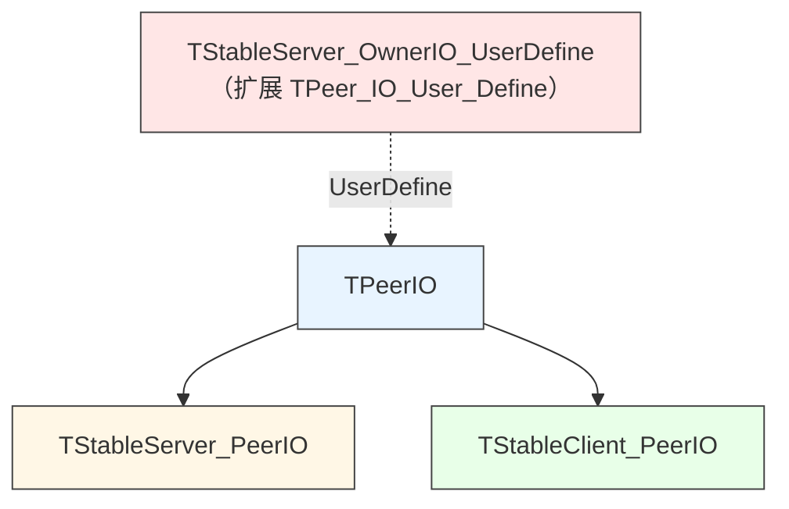

### 10.3 `TStableServer_PeerIO`

**关键字段**：
- `Activted: Boolean`：是否激活
- `DestroyRecycleOwnerIO: Boolean`：是否在销毁时回收物理 IO
- `Connection_Token: Cardinal`：连接令牌
- `Internal_Bind_Owner_IO: TPeerIO`：底层物理 IO
- `OfflineTick: TTimeTick`：离线时间戳

**`Write_IO_Buffer`**：
- **`BindOwnerIO = nil` 时**，`AtomDec(OwnerFramework.Statistics[stSendSize], Size)`。
- **否则**转发给 `BindOwnerIO.Write_IO_Buffer`。

**`Progress`**：
- **`Activted` 且 `BindOwnerIO = nil`**：检查 `OfflineTimeout`，超时调用 `DelayClose`。
- **`BindOwnerIO <> nil`**：更新 `OfflineTick`。

### 10.4 `TZNet_CustomStableServer`

**关键字段**：
- `Connection_Token_Counter: Cardinal`：令牌生成器
- `FOwnerIOServer: TZNet_Server`：底层物理服务端
- `FOfflineTimeout: TTimeTick`：离线超时（默认 5 分钟）
- `FLimitSequencePacketMemoryUsage: Int64`：Sequence Packet 内存限制
- `FAutoFreeOwnerIOServer: Boolean`：是否自动释放 OwnerIO
- `FAutoProgressOwnerIOServer: Boolean`：是否自动 Progress OwnerIO

**`SetOwnerIOServer`**：
- **旧 OwnerIO**：清空回调、恢复 `cpZServer`、注销 `C_BuildStableIO` / `C_OpenStableIO`。
- **新 OwnerIO**：
  - 绑定 `ServerCustomProtocolReceiveBufferNotify`。
  - `Protocol := cpCustom`。
  - `UserDefineClass := TStableServer_OwnerIO_UserDefine`。
  - `SyncOnResult := True` / `SyncOnCompleteBuffer := True`。
  - `TimeOutIDLE := 60 * 1000`。
  - 注册 `C_BuildStableIO` / `C_OpenStableIO`。

**`cmd_BuildStableIO`**：
1. 创建 `TStableServer_PeerIO`。
2. `Activted := True` / `FSequencePacketActivted := True` / `FSequencePacketSignal := True`。
3. `SequencePacketLimitOwnerIOMemory := FLimitSequencePacketMemoryUsage`。
4. `BindOwnerIO := Sender`。
5. `Connection_Token := Connection_Token_Counter`（自增）。
6. 返回 `Connection_Token` / `FID` / `CipherSecurity` / `CipherKey`。

**`cmd_OpenStableIO`**：
1. 读取 `connToken` / `connKey`。
2. 遍历所有 IO，找匹配 `Connection_Token` 和 `CipherKey` 的 `TStableServer_PeerIO`。
3. **若找不到**：返回 `False` 和错误消息（**服务端重启后无法恢复**）。
4. **若找到**：
   - `BindOwnerIO := Sender` / `Activted := True`。
   - `DestroyRecycleOwnerIO := True`。
   - `ResetSequencePacketBuffer` / `SequencePacketVerifyTick := GetTimeTick` / `OfflineTick := GetTimeTick`。
   - 返回 `Connection_Token` / `FID` / `CipherSecurity` / `CipherKey`。

### 10.5 `TStableClient_PeerIO`

**关键字段**：
- `Activted: Boolean`
- `WaitConnecting: Boolean`
- `OwnerIO_LastConnectTick: TTimeTick`
- `Connection_Token: Cardinal`
- `BindOwnerIO: TPeerIO`

**`Write_IO_Buffer`**：
- **`BindOwnerIO = nil` 或 `not Activted` 或 `WaitConnecting`**：`AtomDec(..., Size)`。
- **否则**转发。

### 10.6 `TZNet_CustomStableClient`

**关键字段**：
- `FOwnerIOClient: TZNet_Client`
- `FStableClientIO: TStableClient_PeerIO`
- `FConnection_Addr: SystemString` / `FConnection_Port: Word`
- `FAutomatedConnection: Boolean`：自动重连
- `FLimitSequencePacketMemoryUsage: Int64`
- `FAutoFreeOwnerIOClient: Boolean` / `FAutoProgressOwnerIOClient: Boolean`
- `KeepAliveChecking: Boolean`：保活检查状态
- `SaveLastCommunicationTick_Received: TTimeTick`

**`Connect(addr, port)`**：
1. `FOwnerIOClient.Connect(addr, port)`。
2. `AsyncConnectResult(True)`。
3. **循环 `Progress` 最多 5 秒**，直到 `FStableClientIO.Activted`。

**`BuildStableIO_Result`**：
1. 读取 `r_token` / `R_ID` / `cSec` / `k`。
2. `FStableClientIO.Connection_Token := r_token`。
3. `FStableClientIO.BindOwnerIO := Sender`。
4. `FStableClientIO.ID := R_ID`。
5. `FStableClientIO.FSendDataCipherSecurity := cSec`。
6. `FStableClientIO.FCipherKey := TCipher.CopyKey(k)`。
7. **替换物理 IO 的加密配置**：`Sender.FSendDataCipherSecurity := cSec` / `Sender.FCipherKey := TCipher.CopyKey(k)`。
8. `Activted := True` / `WaitConnecting := False`。
9. `TriggerDoConnectFinished` / `DoConnected(FStableClientIO)`。

**`OpenStableIO_Result`**：
- 同 `BuildStableIO_Result`，但额外设置 `FStableClientIO.RemoteExecutedForConnectInit := True`。
- **`ResetSequencePacketBuffer`** 和 **`SequencePacketVerifyTick := GetTimeTick`**。

**`Progress`**：
- 检查 `FStableClientIO.Activted` 和 `IsSequencePacketModel`。
- **`WaitConnecting` 且超过 5 秒**：断开 + `Reconnection`。
- **`not FOwnerIOClient.Connected`**：`Reconnection`。
- **`FSequencePacketSignal` 且 5 秒未收到**：
  - **第一次**：发送保活，`KeepAliveChecking := True`。
  - **第二次**（仍无响应）：`Reconnection`，`KeepAliveChecking := False`。

**`Reconnection`**：
- 检查 `Activted` / `FOwnerIOClient <> nil` / `not WaitConnecting`。
- `WaitConnecting := True`。
- `BindOwnerIO := nil`。
- `PostProgress.PostExecuteM(1.0, PostReconnection)`。

**`PostReconnection`**：
- 检查 `Activted` / `FOwnerIOClient <> nil` / `WaitConnecting`。
- `FOwnerIOClient.AsyncConnectM(FConnection_Addr, FConnection_Port, AsyncReconnectionResult)`。

**`AsyncReconnectionResult`**：
- **成功**：发送 `C_OpenStableIO`，回调 `OpenStableIO_Result`。
- **失败**：`WaitConnecting := False`。

**`Disconnect`**：
1. 若物理连接活跃且 StableIO 激活：
   - `FStableClientIO.FSequencePacketSignal := False`。
   - 等待 `IOBusy` 结束。
   - 发送 `C_CloseStableIO`。
   - 等待 `WriteBuffer_is_NULL`（最多 1 秒）。
   - `FStableClientIO.FSequencePacketSignal := True`。
2. `DisposeObject(FStableClientIO)`。
3. **重建 `TStableClient_PeerIO`**。

**⚠️ 关键陷阱**：
- **`Disconnect` 会重建 StableClientIO**，旧指针失效。
- **`FAutomatedConnection=True` 时**，物理重连自动发起。

---

## 第 11 章 HPC —— 线程池任务

### 11.1 定位

HPC（High-Performance Computing）提供**在线程池中执行命令**的能力，避免阻塞主线程。

### 11.2 类层次

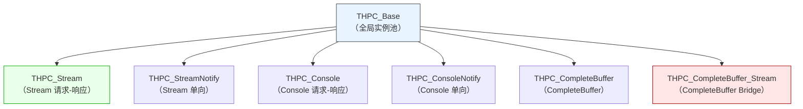

### 11.3 `THPC_Base`

```pascal
THPC_Base = class(TCore_Object_Intermediate)
public
  Instance_Ptr: THPC_Instance_Pool.PQueueStruct;
  constructor Create;
  procedure Do_Free_Instance_Ptr; virtual;
  destructor Destroy; override;
end;
```

**契约**：
- **构造时加入 `HPC_Instance_Pool`**（若池非空）。
- **析构时从池中移除**。

### 11.4 `THPC_Stream`

**公共字段**：
- `Thread: TCompute`：工作线程
- `Framework: TZNet`：父框架
- `Cmd: SystemString`：命令名
- `TriggerTime: TTimeTick`：创建时间
- `WorkID: Cardinal`：IO ID
- `Send_Tunnel: TZNet` / `Send_Tunnel_ID: Cardinal`：发送隧道
- `UserData: Pointer` / `UserObject: TCore_Object` / `UserVariant: Variant`：用户参数
- `InData, OutData: TDFE`：输入/输出
- `On_C` / `On_M` / `On_P`：执行体
- `OnDone_C` / `OnDone_M` / `OnDone_P`：完成回调

**执行流程**：

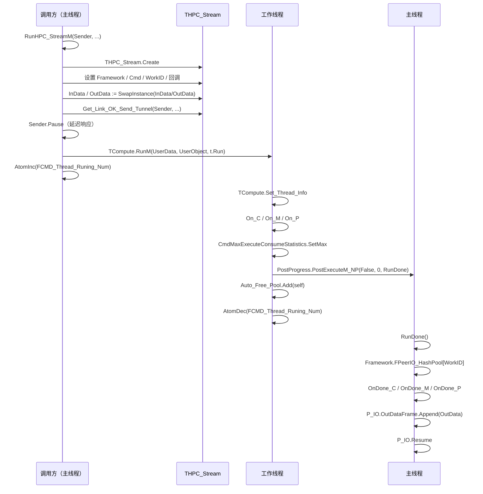

**契约**：
- **`RunHPC_Stream*` 会先 `Sender.Pause`**，阻止默认响应。
- **`t.Run` 在工作线程执行**，`t.RunDone` 在主线程执行。
- **`t.InData` / `t.OutData` 通过 `SwapInstance` 获取**，原 `InData` / `OutData` 被清空。
- **`RunDone` 里会 `P_IO.OutDataFrame.Append(OutData)` 并 `P_IO.Resume`**。
- **异常被吞掉**（工作线程和主线程都是 `try...except`）。

### 11.5 `RunHPC_Stream*` 全局函数

```pascal
procedure RunHPC_StreamC(Sender: TPeerIO; UserData, UserObject; InData, OutData: TDFE; OnRun: TOnHPC_Stream_C);
procedure RunHPC_StreamM(Sender: TPeerIO; UserData, UserObject; InData, OutData: TDFE; OnRun: TOnHPC_Stream_M);
procedure RunHPC_StreamP(Sender: TPeerIO; UserData, UserObject; InData, OutData: TDFE; OnRun: TOnHPC_Stream_P);
// 带 UserVariant 的重载
```

**契约**：
- **`Sender.Pause` 必须在 `RunHPC_Stream*` 内部调用**。
- **`TCompute.RunM(UserData, UserObject, t.Run)`** 用 `UserData` / `UserObject` 作为线程上下文。

### 11.6 `THPC_Console` 与 `THPC_ConsoleNotify`

结构与 `THPC_Stream` 类似，但：
- `THPC_Console`：输入/输出为 `SystemString`，`RunDone` 里 `P_IO.OutText := P_IO.OutText + OutData`。
- `THPC_ConsoleNotify`：无输出，`Run` 完成后立即 `DelayFreeObj(1.0, self)`。

### 11.7 `THPC_CompleteBuffer`

- **`InData: TMS64`**（通过 `Sender.CompleteBuffer_Current_Trigger.Swap_To_New_Instance` 获取）。
- **`Run` 中 `On_C/M/P(self, InData.Memory, InData.Size)`**。
- **`Run` 后 `DelayFreeObj(1.0, self)`**（无响应）。

### 11.8 `THPC_CompleteBuffer_Stream`

- **`Bridge: TCommandCompleteBuffer_NoWait_Bridge`**：关联的 Bridge。
- **`Run` 中 `On_C/M/P(self, InData, OutData)`**。
- **`Run` 后 `Bridge.OutData.SwapInstance(OutData)` + `Bridge.Resume`**。

---

## 第 12 章 桥接类

### 12.1 `TOnResult_Bridge_Templet` / `TOnResult_Bridge`

```pascal
TOnResult_Bridge_Templet = class(TCore_Object_Intermediate)
public
  procedure DoConsoleEvent(Sender: TPeerIO; Result_: SystemString); virtual;
  procedure DoConsoleParamEvent(...); virtual;
  procedure DoConsoleFailedEvent(...); virtual;
  procedure DoStreamEvent(Sender: TPeerIO; Result_: TDFE); virtual;
  procedure DoStreamParamEvent(...); virtual;
  procedure DoStreamFailedEvent(...); virtual;
  procedure DoCompleteBufferStreamEvent(Sender: TCommandCompleteBuffer_NoWait_Bridge; InData, OutData: TDFE); virtual;
end;

TOnResult_Bridge = class(TOnResult_Bridge_Templet)
  constructor Create;
  destructor Destroy; override;
end;
```

**契约**：所有 `Do*` 是**空实现**，子类按需重写。

### 12.2 `TProgress_Bridge`

```pascal
TProgress_Bridge = class(TCore_Object_Intermediate)
public
  Framework: TZNet;
  ProgressInstance: TZNet_Progress;
  constructor Create(Framework_: TZNet); virtual;
  destructor Destroy; override;
  procedure Progress(Sender: TZNet_Progress); virtual;
end;
```

**契约**：
- **构造时创建 `ProgressInstance` 并绑定 `OnProgress_M := Progress`**。
- **析构时 `ResetEvent` + `NextProgressDoFree := True`**。
- **`Progress` 默认空实现**，子类重写。

### 12.3 `TState_Param_Bridge`

```pascal
TState_Param_Bridge = class(TCore_Object_Intermediate)
public
  OnNotifyC: TOnParamState_C;
  OnNotifyM: TOnParamState_M;
  OnNotifyP: TOnParamState_P;
  Param1: Pointer;
  Param2: TObject;
  OnStateMethod: TOnState_M;
  constructor Create;
  destructor Destroy; override;
  procedure DoStateResult(const State: Boolean);
end;
```

**用途**：将 `TOnParamState_*` 回调适配为 `TOnState_M`。

**契约**：
- **`DoStateResult` 依次调用 C/M/P 中第一个已赋值的**。
- **调用后 `DelayFreeObj(1.0, self)`**。

### 12.4 `TCustom_Event_Bridge`

```pascal
TCustom_Event_Bridge = class(TCore_Object_Intermediate)
public
  Framework_: TZNet;
  ID_: Cardinal;
  ProgressInstance: TZNet_Progress;
  constructor Create(IO_: TPeerIO); virtual;
  destructor Destroy; override;
  function CheckIO: Boolean; virtual;
  function IO: TPeerIO; virtual;
  procedure Progress(Sender: TZNet_Progress); virtual;
end;
```

**契约**：
- **构造时绑定 `Framework_` 和 `ID_`，创建 `ProgressInstance`**。
- **`CheckIO` 检查 IO 是否仍存在**。
- **`IO` 返回 `Framework_.PeerIO_HashPool[ID_]`**。

### 12.5 `TStream_Event_Bridge`

```pascal
TStream_Event_Bridge = class(TCore_Object_Intermediate)
public
  Framework_: TZNet;
  ID_: Cardinal;
  LCMD_: SystemString;
  ProgressInstance: TZNet_Progress;
  OnResultC: TOnStream_Event_Bridge_Event_C;
  OnResultM: TOnStream_Event_Bridge_Event_M;
  OnResultP: TOnStream_Event_Bridge_Event_P;
  AutoPause: Boolean;
  AutoFree: Boolean;
  constructor Create(IO_: TPeerIO; AutoPause_: Boolean); overload;
  constructor Create(IO_: TPeerIO); overload;
  destructor Destroy; override;
  procedure Pause;
  procedure Play(ResultData_: TDFE);
  procedure DoStreamParamEvent(...); virtual;
  procedure DoStreamFailed(...); virtual;
  procedure DoStreamEvent(Sender_: TPeerIO; ResultData_: TDFE); virtual;
  procedure Progress(Sender: TZNet_Progress); virtual;
end;
```

**契约**：
- **构造时 `IO_.ReceiveCommandRuning` 必须为 True**，否则 `RaiseInfo('Need in Stream Event.')`。
- **`AutoPause=True` 时 `IO_.Pause`**。
- **`DoStreamEvent` 在 `AutoPause=True` 时自动 `IO_.OutDataFrame.Append(ResultData_)` + `IO_.Resume`**。
- **`AutoFree=True` 时 `DelayFreeObject(1.0, self)`**。

### 12.6 `TConsole_Event_Bridge`

与 `TStream_Event_Bridge` 类似，但处理 `SystemString`。

### 12.7 `TCustom_CompleteBuffer_Stream_Bridge`

```pascal
TCustom_CompleteBuffer_Stream_Bridge = class(TCore_Object_Intermediate)
public
  Bridge: TCommandCompleteBuffer_NoWait_Bridge;
  ProgressInstance: TZNet_Progress;
  constructor Create(Bridge_: TCommandCompleteBuffer_NoWait_Bridge); virtual;
  destructor Destroy; override;
  function CheckIO: Boolean; virtual;
  function IO: TPeerIO; virtual;
  procedure Progress(Sender: TZNet_Progress); virtual;
end;
```

### 12.8 `TCompleteBuffer_Stream_Event_Bridge`

与 `TStream_Event_Bridge` 类似，但关联 `TCommandCompleteBuffer_NoWait_Bridge`。

### 12.9 `TP2PVM_CloneConnectEventBridge`

```pascal
TP2PVM_CloneConnectEventBridge = class(TCore_Object_Intermediate)
public
  Source: TZNet_WithP2PVM_Client;
  NewClient: TZNet_WithP2PVM_Client;
  constructor Create(Source_: TZNet_WithP2PVM_Client);
  destructor Destroy; override;
  procedure DoAsyncConnectState(const State: Boolean);
end;
```

**契约**：
- **`DoAsyncConnectState` 在 `State=False` 时 `DisposeObjectAndNil(NewClient)`**。
- **依次调用 C/M/P 中第一个已赋值的回调**。
- **`DelayFreeObj(1.0, self)`**。

---

## 第 13 章 交换空间技术

### 13.1 `TFile_Swap_Space_Pool`

```pascal
TFile_Swap_Space_Pool = class(TCritical_BigList<TFile_Swap_Space_Stream>)
public
  WorkPath: U_String;
  constructor Create;
  destructor Destroy; override;
  procedure DoFree(var data: TFile_Swap_Space_Stream); override;
  function CompareData(...): Boolean; override;
  class function RunTime_Pool(): TFile_Swap_Space_Pool;
end;
```

**全局实例**：`BigStream_Swap_Space_Pool__`（在 `initialization` 中创建）。

### 13.2 `TFile_Swap_Space_Stream`

```pascal
TFile_Swap_Space_Stream = class(TCore_FileStream)
public
  class function Create_BigStream(stream_: TCore_Stream; OwnerSwapSpace_: TFile_Swap_Space_Pool): TFile_Swap_Space_Stream;
  destructor Destroy; override;
end;
```

**`Create_BigStream` 流程**：
1. 计算 `stream_` 的 MD5。
2. 生成临时文件名：`{WorkPath}/ZNet_{MD5}.~tmp`。
3. 若文件已存在，追加 `(N)` 后缀。
4. 创建 `TFile_Swap_Space_Stream`（`fmCreate`）。
5. `stream_.Position := 0`；`Result.CopyFrom(stream_, stream_.Size)`。
6. `Result.Position := 0`。
7. `Result.FOwnerSwapSpace := OwnerSwapSpace_`。
8. `Result.FPoolPtr := OwnerSwapSpace_.Add(Result)`。

**`Destroy`**：从池中移除并 `umlDeleteFile(tmpFileName)`。

### 13.3 `TZDB2_Swap_Space_Technology`

```pascal
TZDB2_Swap_Space_Technology = class(TZDB2_Core_Space)
public
  class var ZDB2_Swap_Space_Pool___: TZDB2_Swap_Space_Technology;
  class var ZDB2_Swap_Space_Pool_Cipher___: TZDB2_Cipher;
  Critical: TCritical;
  constructor Create();
  destructor Destroy; override;
  function Create_Memory(buff: PByte; BuffSiz: NativeInt; BuffProtected_: Boolean): TZDB2_Swap_Space_Technology_Memory;
  class function RunTime_Pool(): TZDB2_Swap_Space_Technology;
end;
```

**契约**：
- **单例（`RunTime_Pool` 懒创建）**。
- **使用 `TZDB2_Core_Space` 作为底层**，`Mode := smNormal`。
- **`OnNoSpace` 触发时调用 `AppendSpace(ZNet_Def_Swap_Space_Technology_Delta, Block)`**。

### 13.4 `TZDB2_Swap_Space_Technology_Memory`

```pascal
TZDB2_Swap_Space_Technology_Memory = class(TMem64)
public
  constructor Create();
  constructor Create(Owner_: TZDB2_Swap_Space_Technology; ID_: Integer);
  destructor Destroy; override;
  function Prepare: Boolean;
end;
```

**契约**：
- **`Prepare` 从数据库读取数据到内存**。
- **`Destroy` 时 `RemoveData(FID, True)`**。
- **若 `FreeSpace >= Physics`，释放整个单例**。

---

## 第 14 章 辅助类与工具

### 14.1 `TBigStreamBatch`

```pascal
TBigStreamBatch = class(TCore_Object_Intermediate)
protected
  FOwner: TPeerIO;
  FList: TBigStreamBatchPostData_List;
public
  constructor Create(Owner_: TPeerIO);
  destructor Destroy; override;
  procedure Clear;
  function  Count: Integer;
  property  Items[index]: PBigStreamBatchPostData read GetItems; default;
  function  NewPostData: PBigStreamBatchPostData;
  function  First: PBigStreamBatchPostData;
  function  Last: PBigStreamBatchPostData;
  procedure DeleteLast;
  procedure Delete(const index: Integer);
end;
```

**`TBigStreamBatchPostData`**：
```pascal
TBigStreamBatchPostData = record
  Source: TMS64;
  CompletedBackcallPtr: UInt64;
  RemoteMD5: TMD5;
  SourceMD5: TMD5;
  index: Integer;
  DBStorePos: Int64;
  procedure Init;
  procedure Encode(d: TDFE);
  procedure Decode(d: TDFE);
end;
```

### 14.2 `TAutomatedP2PVMServiceBind` / `TAutomatedP2PVMClientBind`

```pascal
TAutomatedP2PVMServiceBind = class(TGenericsList<PAutomatedP2PVMServiceData>)
public
  procedure AddService(Service: TZNet_WithP2PVM_Server; IPV6: SystemString; Port: Word); overload;
  procedure AddService(Service: TZNet_WithP2PVM_Server); overload;
  procedure RemoveService(Service: TZNet_WithP2PVM_Server);
  procedure Clean;
  function  FoundService(Service: TZNet_WithP2PVM_Server): PAutomatedP2PVMServiceData;
end;

TAutomatedP2PVMClientBind = class(TGenericsList<PAutomatedP2PVMClientData>)
public
  procedure AddClient(Client: TZNet_WithP2PVM_Client; IPV6: SystemString; Port: Word);
  procedure RemoveClient(Client: TZNet_WithP2PVM_Client);
  procedure Clean;
  function  FoundClient(Client: TZNet_WithP2PVM_Client): PAutomatedP2PVMClientData;
end;
```

**用途**：`TZNet` 自动暴露/连接 P2PVM 服务。

### 14.3 `TZNet_Progress`

```pascal
TZNet_Progress = class(TCore_Object_Intermediate)
public
  OnFree: TZNet_Progress_Free_OnEvent;
  OnProgress_C: TZNet_Progress_OnEvent_C;
  OnProgress_M: TZNet_Progress_OnEvent_M;
  OnProgress_P: TZNet_Progress_OnEvent_P;
  NextProgressDoFree: Boolean;
  property  OwnerFramework: TZNet read FOwnerFramework;
  constructor Create(OwnerFramework_: TZNet);
  destructor  Destroy; override;
  procedure Progress; virtual;
  procedure ResetEvent;
end;
```

**契约**：
- **`Progress` 依次调用 C/M/P 中第一个已赋值的回调**，异常被吞。
- **`NextProgressDoFree=True` 时**，下次 Progress 后从池中移除（`DelayFreeObject`）。
- **`ResetEvent` 清空所有回调**。

### 14.4 `TPhysics_Fragment_Pool`

```pascal
TPhysics_Fragment_Pool = class(TOrderStruct<TMem64>)
public
  procedure DoFree(var data: TMem64); override;
end;
```

**契约**：`DoFree` 中 `DisposeObjectAndNil(data)`。

### 14.5 IP 地址工具

```pascal
function StrToIPv4(const S: U_String; var Success: Boolean): TIPV4;
function IPv4ToStr(const IPv4Addr_: TIPV4): U_String;
function StrToIPv6(const S: U_String; var Success: Boolean; var ScopeID: Cardinal): TIPV6; overload;
function StrToIPv6(const S: U_String; var Success: Boolean): TIPV6; overload;
function IPv6ToStr(const IPv6Addr: TIPV6): U_String;
function IsIPv4(const S: U_String): Boolean;
function IsIPV6(const S: U_String): Boolean;
function MakeRandomIPV6(): TIPV6;
function IsLocalNetworkIPV4(const S: U_String): Boolean;
function IsLoopbackIPV4(const S: U_String): Boolean;
function IsLoopbackIPV6(const S: U_String): Boolean;
function CompareIPV4(const IP1, IP2: TIPV4): Boolean;
function CompareIPV6(const IP1, IP2: TIPV6): Boolean;
function TranslateBindAddr(addr: SystemString): SystemString;
procedure ExtractHostAddress(var Host: U_String; var Port: Word); overload;
procedure ExtractHostAddress(var Host, Port: U_String); overload;
function Build_Host_URL(Host, Port: SystemString): SystemString; overload;
function Build_Host_URL(Host: SystemString; Port: Word): SystemString; overload;
```

**`IsLocalNetworkIPV4` 的网段**：`192.168.*.*` / `10.*.*.*` / `172.16-19.*.*` / `172.2?.*.*` / `172.30-31.*.*`。

**`IsLoopbackIPV4`**：`127.0.0.1` / `localhost`。

**`IsLoopbackIPV6`**：`::1` / `::1/*`。

**`MakeRandomIPV6`**：用 `PTimeTick` + `MT19937Rand64` + `PDouble(umlNow)` + `ZNet_Def_IPV6_Seed` 混合生成 16 字节 MD5。

**`ExtractHostAddress`**：支持 `[IPv6]:Port` / `IPv6|Port` / `Host:Port`。

**`Build_Host_URL`**：IPv6 加 `[]`。

### 14.6 双隧道辅助

```pascal
function Get_Link_OK_Send_Tunnel(IO_: TPeerIO; var Send_Tunnel: TZNet; var Send_Tunnel_ID: Cardinal): Boolean; overload;
function Get_Link_OK_Send_Tunnel(Framework_: TZNet; ID_: Cardinal; var Send_Tunnel: TZNet; var Send_Tunnel_ID: Cardinal): Boolean; overload;
function Get_Link_OK_Recv_Tunnel(...): Boolean;
```

**契约**：检查 `IO_.UserDefine` 是否为以下类型之一：
- `TService_RecvTunnel_UserDefine_NoAuth`
- `TClient_RecvTunnel_NoAuth`
- `TService_RecvTunnel_UserDefine_VirtualAuth`
- `TClient_RecvTunnel_VirtualAuth`
- `TService_RecvTunnel_UserDefine`
- `TClient_RecvTunnel`

（这些类型定义在 `Z.Net.DoubleTunnelIO` 等单元中。）

### 14.7 其他工具

```pascal
procedure DoExecuteResult(IO: TPeerIO; const QueuePtr: PQueueData; const Result_Text: SystemString; Result_DF: TDFE);
procedure Set_Instance_QuietMode(Inst: TZNet; QuietMode_: Boolean);
```

**`DoExecuteResult`**：
- 依次检查 `OnConsoleM` / `OnConsoleParamM` / `OnConsoleP` / `OnConsoleParamP` / `OnStreamM` / `OnStreamParamM` / `OnStreamP` / `OnStreamParamP`。
- **只调用第一个已赋值的**。
- **`OnStream*` 前 `Result_DF.Reader.index := 0`**。
- **`OnStreamParam*` 会额外解码 `SendData` 为 `InData`**。

**`Set_Instance_QuietMode`**：
- 设置 `Inst.QuietMode`。
- **若 `Inst is TZNet_WithP2PVM_Client`**，递归设置所有 clone。

---

## 第 15 章 完整使用范式

### 15.1 最简单的服务端

```pascal
var
  Server: TZNet_Server;
begin
  Server := TZNet_Server.Create;
  Server.RegisterConsole('hello').OnExecute :=
    procedure(Sender: TPeerIO; InData: string; var OutData: string)
    begin
      OutData := 'Hello, ' + InData;
    end;
  Server.StartService('0.0.0.0', 8080);
  while True do
    begin
      Server.Progress;
      Sleep(10);
    end;
end;
```

### 15.2 最简单的客户端

```pascal
var
  Client: TZNet_Client;
begin
  Client := TZNet_Client.Create;
  Client.Connect('127.0.0.1', 8080);
  Client.SendConsoleCmdM('hello', 'world',
    procedure(Sender: TPeerIO; Result_: string)
    begin
      WriteLn(Result_);  // 'Hello, world'
    end);
  while Client.Connected do
    begin
      Client.Progress;
      Sleep(10);
    end;
end;
```

### 15.3 Stream 命令（DFE）

```pascal
// 服务端
Server.RegisterStream('getData').OnExecute :=
  procedure(Sender: TPeerIO; InData, OutData: TDFE)
  begin
    OutData.WriteString('key');
    OutData.WriteInteger(42);
  end;

// 客户端
var
  d: TDFE;
begin
  d := TDFE.Create;
  d.WriteString('query');
  Client.SendStreamCmdM('getData', d,
    procedure(Sender: TPeerIO; Result_: TDFE)
    begin
      WriteLn(Result_.Reader.ReadString);
      WriteLn(Result_.Reader.ReadInteger);
    end);
end;
```

### 15.4 大文件传输（BigStream）

```pascal
// 发送端
var
  fs: TCore_FileStream;
begin
  fs := TCore_FileStream.Create('big.dat', fmOpenRead);
  Client.SendBigStream('upload', fs, True);  // 完成后自动释放
end;

// 接收端
Server.RegisterBigStream('upload').OnExecute :=
  procedure(Sender: TPeerIO; InData: TCore_Stream; Total, Complete: Int64)
  begin
    // 每片调用一次，Complete 是当前进度
    WriteLn(Format('%d / %d', [Complete, Total]));
    if Complete = Total then
      SaveToFile(InData);
  end;
```

### 15.5 原子块（CompleteBuffer）

```pascal
// 发送端
var
  d: TDFE;
begin
  d := TDFE.Create;
  d.WriteString('data');
  Client.SendCompleteBuffer('blob', d);
end;

// 接收端（同步）
Server.RegisterCompleteBuffer('blob').OnExecute :=
  procedure(Sender: TPeerIO; InData: PByte; DataSize: NativeInt)
  begin
    ProcessRawData(InData, DataSize);
  end;

// 接收端（异步，DFE）
Server.RegisterCompleteBuffer_StreamNotify('blob').OnExecute :=
  procedure(Sender: TPeerIO; InData: TDFE)
  begin
    WriteLn(InData.Reader.ReadString);
  end;
```

### 15.6 HPC 线程池执行

```pascal
// 在 Stream 命令中
Server.RegisterStream('slowQuery').OnExecute :=
  procedure(Sender: TPeerIO; InData, OutData: TDFE)
  begin
    RunHPC_StreamM(Sender, nil, nil, InData, OutData,
      procedure(thSender: THPC_Stream; ThInData, ThOutData: TDFE)
      begin
        Sleep(5000);  // 耗时操作（在工作线程）
        ThOutData.WriteString('done');
      end);
  end;
```

### 15.7 P2PVM 隧道

```pascal
// 服务端
Server.RegisterConsoleNotify('initP2P').OnExecute :=
  procedure(Sender: TPeerIO; InData: string)
  begin
    Sender.OpenP2PVMTunnel(True, InData);
  end;

// 客户端
Client.SendConsoleNotifyCmd('initP2P', 'myAuthToken');
// 等待隧道建立
while not Client.ClientIO.p2pVMTunnelReadyOk do
  Client.Progress;
```

### 15.8 StableIO 稳定会话

```pascal
// 服务端
var
  StableServer: TZNet_CustomStableServer;
begin
  StableServer := TZNet_CustomStableServer.Create;
  StableServer.OwnerIOServer := PhysicalServer;
  StableServer.StartService('0.0.0.0', 8080);
  // 注册命令到 StableServer（逻辑层）
  StableServer.RegisterConsole('hello').OnExecute := ...;
end;

// 客户端
var
  StableClient: TZNet_CustomStableClient;
begin
  StableClient := TZNet_CustomStableClient.Create;
  StableClient.OwnerIOClient := PhysicalClient;
  StableClient.Connect('127.0.0.1', 8080);
  // 物理断开后，StableClient 自动重连
  StableClient.SendConsoleCmd('hello', 'world');
end;
```

### 15.9 自动 P2PVM

```pascal
// 服务端
Server.AutomatedP2PVMService := True;
Server.AutomatedP2PVMServiceBind.AddService(SubServer);
Server.AutomatedP2PVMAuthToken := 'myToken';

// 客户端
Client.AutomatedP2PVMClient := True;
Client.AutomatedP2PVMClientBind.AddClient(SubClient, '::1', 12345);
Client.AutomatedP2PVMAuthToken := 'myToken';
Client.OnAutomatedP2PVMClientConnectionDone_M := MyHandler;
```

---

## 第 16 章 反例集

### 16.1 在回调中直接 `Free` 任务

```pascal
// ❌ 错误：在 HPC 回调中直接 Free 任务
RunHPC_StreamM(Sender, nil, nil, InData, OutData,
  procedure(thSender: THPC_Stream; ThInData, ThOutData: TDFE)
  begin
    thSender.Free;   // 危险！Run 返回后还会访问 thSender
  end);
```

**✅ 正确**：用 `DelayFreeObj(1.0, thSender)` 或什么都不做。

### 16.2 在 `Progress` 回调中修改 IO 池

```pascal
// ❌ 错误：FastProgressPeerIOC 中删除 IO
Server.FastProgressPeerIOC(
  procedure(P_IO: TPeerIO)
  begin
    if 删除条件 then
      Server.Disconnect(P_IO.ID);   // ❌ 破坏迭代器
  end);
```

**✅ 正确**：用 `ProgressPeerIOC`（快照版本）。

### 16.3 StableIO 断开后继续用旧指针

```pascal
// ❌ 错误
var
  oldIO := StableClient.StableClientIO;
StableClient.Disconnect;
oldIO.SendConsoleCmd(...);   // ❌ oldIO 已被 Dispose
```

**✅ 正确**：`Disconnect` 后重新获取 `StableClient.StableClientIO`。

### 16.4 P2PVM 隧道未建立就发送

```pascal
// ❌ 错误
Client.SendConsoleNotifyCmd('initP2P', 'token');
Client.SendConsoleCmd('data', 'xxx');   // ❌ 隧道可能还没建立
```

**✅ 正确**：等待 `Client.ClientIO.p2pVMTunnelReadyOk`。

### 16.5 未注册命令就发送

```pascal
// ❌ 错误
Client.SendConsoleCmd('unknownCmd', 'data');   // 服务端报 'no exists console cmd'

// ✅ 正确：先注册
Server.RegisterConsole('unknownCmd').OnExecute := ...;
```

### 16.6 BigStream 未清理

```pascal
// ❌ 错误：接收端不处理 Total = Complete 的情况
Server.RegisterBigStream('upload').OnExecute :=
  procedure(Sender: TPeerIO; InData: TCore_Stream; Total, Complete: Int64)
  begin
    WriteToFile(InData);   // 每次片段都写，会重复
  end;
```

**✅ 正确**：只在 `Complete = Total` 时保存。

### 16.7 多线程共享 `TZNet`

```pascal
// ❌ 错误：工作线程直接调用 SendConsoleCmd
TCompute.RunC_NP(procedure
  begin
    Client.SendConsoleCmd('data', 'xxx');   // ❌ 非线程安全
  end);
```

**✅ 正确**：用 `TCompute.Sync` 或 `Post` 投递到主线程。

### 16.8 `CommandCompleteBuffer_NoWait_Stream` 未用双隧道

```pascal
// ❌ 错误
Client.SendCompleteBuffer_NoWait_StreamM('cmd', d, handler);
// 若未启用双隧道 → 打印 'cmd only work in double tunnel'
```

**✅ 正确**：启用 `DoubleChannelFramework` 并检查 `Is_Send_Tunnel`。

### 16.9 P2PVM Client 未安装到 LinkVM

```pascal
// ❌ 错误
Client := TZNet_WithP2PVM_Client.Create;
Client.AsyncConnect('::1', 12345, handler);   // ❌ FLinkVM = nil
```

**✅ 正确**：
```pascal
P2PVM.InstallLogicFramework(Client);
Client.AsyncConnect('::1', 12345, handler);
```

### 16.10 StableIO 服务端重启后无法恢复

```pascal
// ⚠️ 服务端重启后，Connection_Token_Counter 从 1 重新开始
// 旧客户端的 Token 与新的冲突
// cmd_OpenStableIO 会返回 False + 错误消息
```

**✅ 正确处理**：客户端捕获失败，重新连接。

### 16.11 Sequence Packet 内存超限

```pascal
// ⚠️ FSequencePacketLimitPhysicsMemory > 0 且超限时
// 打印 'memory exceeds security limit for Sequence Packet signal buffer.'
// 然后 DelayClose
```

**✅ 正确**：设置合理的 `FSequencePacketLimitPhysicsMemory`。

### 16.12 忘记 `Progress`

```pascal
// ❌ 错误：不调用 Progress
Client.Connect(...);
Client.SendConsoleCmd('hello', 'world');
Sleep(10000);
// 永远不会收到响应
```

**✅ 正确**：定期 `Progress`。

### 16.13 在 `Progress` 中 `Sleep`

```pascal
// ❌ 错误：阻塞 Progress
while True do
  begin
    Server.Progress;
    Sleep(1000);   // ❌ 1 秒一次，延迟高
  end;
```

**✅ 正确**：`Sleep(1)` 或 `Sleep(10)`。

### 16.14 未处理 `C_CipherModel`

```pascal
// ⚠️ 若子类覆盖 StartService 但未调用 inherited
// C_CipherModel 未注册，客户端握手失败
```

**✅ 正确**：子类 `StartService` 中调用 `inherited`。

---

## 第 17 章 常见错误对照表

| 现象 | 根因 | 修正 |
|------|------|------|
| 客户端连接后立即断开 | 服务端未注册 `C_CipherModel` | 调用 `inherited StartService` |
| 收不到响应 | 未调用 `Progress` | 定期驱动 |
| `no exists console cmd` | 命令未注册 | `RegisterConsole(...)` |
| `exists cmd: xxx` | 命令重复注册 | 先 `DeleteRegistedCMD` |
| HPC 任务崩溃 | 在回调中 `Free` 任务 | `DelayFreeObj` |
| P2PVM 连接失败 | 未 `InstallLogicFramework` | 先安装 |
| StableIO 断开后崩溃 | 旧 `StableClientIO` 指针失效 | 重新获取 |
| `BigStream` 重复写入 | 未判断 `Complete = Total` | 条件保存 |
| `CompleteBuffer` 报 `only work in double tunnel` | 未启用双隧道 | 配置 `DoubleChannelFramework` |
| `no remote listen` | P2PVM 监听未宣告 | 等待 `SendListen` 广播 |
| `VM no auth` | P2PVM 未认证 | 调用 `AuthVM` |
| `IO Busy` | IO 忙时打开隧道 | 等待 `IOBusy=False` |
| `verify data error` | 加密密钥不匹配 | 检查 `FCipherKey` |
| `tail token error` | 数据损坏 | 重连 |
| `memory exceeds security limit` | Sequence Packet 内存超限 | 调整 `Limit` |
| 命令超时 | 未处理 `OnFailed` | 提供失败回调 |
| 多线程崩溃 | 跨线程调用发送 | 用 `Sync`/`Post` |

---

## 第 18 章 诚实的不确定清单

> 以下是我从源码**无法完全确定**的点。若 AI 需要在这些场景下工作，**必须回查源码或询问人类**。

1. **`FSequencePacketSignal=False` 的具体语义**
   - 源码：`WriteSequencePacket` 根据 `FSequencePacketSignal` 写入 `ZNet_Def_Sequence_Packet` 或 `ZNet_Def_Sequence_QuietPacket`。
   - **不确定**：`False` 时是否完全跳过确认机制。
   - **推测**：`False` = 安静模式，跳过重传和确认。

2. **`SequenceNumberOnSendCounter` 溢出处理**
   - 源码：`inc(SequenceNumberOnSendCounter)`，无溢出检查。
   - **不确定**：`Cardinal` 环回时行为。
   - **推测**：依赖 `$7FFFFFFF` 比较技巧，但长期运行可能有问题。

3. **`FillSequencePacketTo` 的 `fastSwap` 重新分配**
   - 源码：每次循环 `n := TMS64.Create; n.SetPointerWithProtectedMode(...); DisposeObject(fastSwap); fastSwap := n;`。
   - **不确定**：这种模式是否会造成内存碎片。
   - **推测**：依赖 `TMS64` 的零拷贝映射。

4. **`GetIO_Array` 的索引变量 `I__`**
   - 源码：`IO_Array[I__] := Queue^.data^.data.Primary;`。
   - **不确定**：`I__` 是 `TRepeat___.I___` 的别名还是独立字段。
   - **推测**：是 `TRepeat___` 的内部索引。

5. **`ProgressWaitSend` 的防重入**
   - 源码：`FProgressWaitRuning` 阻止重入，但退出路径中也有检查。
   - **不确定**：是否有死锁风险。
   - **推测**：设计上防死锁。

6. **`TZNet_Server.Destroy` 中 5 秒等待**
   - 源码：`while (FCMD_Thread_Runing_Num > 0) and (GetTimeTick() - tk < 5000) do Check_Soft_Thread_Synchronize(100, False);`。
   - **不确定**：为何是 5000ms。
   - **推测**：经验值。

7. **`TQueueData.DoneAutoFree` 的默认值**
   - 源码：`InitQueueData` 中 `v.DoneAutoFree := True`。
   - **不确定**：是否所有发送函数都尊重这个标志。
   - **推测**：是。

8. **`SendCompleteBuffer` 的 `buff.DiscardMemory` 时机**
   - 源码：`TZNet_Server.SendCompleteBuffer(P_IO, Cmd, buff: TMS64, DoneAutoFree)` 中：
     ```pascal
     SendCompleteBuffer(P_IO, Cmd, buff.Memory, buff.Size, DoneAutoFree);
     if DoneAutoFree then
       begin
         buff.DiscardMemory;
         DisposeObject(buff);
       end;
     ```
   - **不确定**：`DiscardMemory` 是否在 `SendCompleteBuffer` 内部已经处理过 `buff.Memory`。
   - **推测**：是安全的，因为 `SendCompleteBuffer(P_IO, Cmd, buff: PByte, ...)` 只处理 `PByte` 指针，不释放它。

9. **`TZNet_Client.CanExecuteCommand` 与 Server 的差异**
   - 源码：Client 直接调用 `inherited`，Server 额外检查 `IsSystemCMD`。
   - **不确定**：为何 Client 不检查 `IsSystemCMD`。
   - **推测**：Client 应能执行所有命令。

10. **`TZNet_WithP2PVM_Client.Connected` 的含义**
    - 源码：`Result := (FVMConnected) and (FVMClientIO <> nil)`。
    - **不确定**：是否包含 `RemoteInited`。
    - **推测**：不包含，`RemoteInited` 需要单独检查。

11. **`TP2PVM_PeerIO.WriteBufferFlush` 的线程安全**
    - 源码：直接操作 `FRealSendBuff` 和 `FSendQueue`。
    - **不确定**：是否需要锁。
    - **推测**：在单线程 Progress 下安全。

12. **`TZNet_P2PVM.Progress` 的 `FProgress_Send_Size` 检查**
    - 源码：`until (FSendStream.Size = lsiz) or (FSendStream.Size >= lsiz + FProgress_Send_Size);`。
    - **不确定**：若 `FProgress_Send_Size = 0` 时的行为。
    - **推测**：可能死循环。

13. **`TZNet_CustomStableServer.cmd_OpenStableIO` 的 `connKey` 比较**
    - 源码：`TCipher.CompareKey(connKey, io_temp.FCipherKey)`。
    - **不确定**：`CompareKey` 是否对所有 cipher 都有效。
    - **推测**：是。

14. **`TZNet_CustomStableClient.Disconnect` 中 `while FStableClientIO.IOBusy do ProgressWaitSend`**
    - 源码：忙等直到 `IOBusy=False`。
    - **不确定**：若网络卡住，是否会死循环。
    - **推测**：有 1 秒超时保护。

15. **`THPC_Stream.RunDone` 中 `P_IO.OutDataFrame.Append(OutData)` 的行为**
    - 源码：`P_IO.OutDataFrame.Append(OutData); P_IO.Resume;`。
    - **不确定**：`OutData` 在 `Append` 后是否被清空。
    - **推测**：`Append` 复制内容，`OutData` 保持。

16. **`TStream_Event_Bridge.DoStreamFailed` 的 `de` 释放**
    - 源码：`de := TDFE.Create; DoStreamEvent(Sender_, de); DisposeObject(de);`。
    - **不确定**：`DoStreamEvent` 是否持有 `de`。
    - **推测**：不持有，同步调用。

17. **`TCompleteBuffer_Stream_Event_Bridge.Play` 的 `SwapInstance`**
    - 源码：`Bridge.OutData.SwapInstance(ResultData_); Bridge.Resume;`。
    - **不确定**：`ResultData_` 在 `SwapInstance` 后是否被清空。
    - **推测**：是（`SwapInstance` 交换所有权）。

18. **`TZNet_WithP2PVM_Client.Progress` 中 `Push_To_Recycle_Pool` 的时机**
    - 源码：遍历 `FP2PVM_ClonePool`，若 `FP2PVM_Clone_NextProgressDoFreeSelf` 则 `Push_To_Recycle_Pool`。
    - **不确定**：`Push_To_Recycle_Pool` 后立即 `Next` 是否正确。
    - **推测**：是（延迟删除机制）。

19. **`TZNet.ClientIO.Print` 在 `Progress` 中的线程安全**
    - 源码：`Print` 内部调用 `OwnerFramework.DoPrint`。
    - **不确定**：`DoPrint` 是否线程安全。
    - **推测**：依赖 `DoStatus` 的线程安全。

20. **`TPeerIO.FCanPauseResultSend` 的重置时机**
    - 源码：`ExecuteDataFrame` 中设置 `FCanPauseResultSend := True`，执行后 `False`。
    - **不确定**：若用户命令处理函数异步执行，此时 `FCanPauseResultSend` 是否还是 True。
    - **推测**：是（因为是同步执行）。

21. **`TZNet_Server.Destroy` 中 `FStableIO` 的释放**
    - 源码：`if (FStableIO <> nil) and (not FStableIO.AutoFreeOwnerIOServer) then ...`。
    - **不确定**：`AutoFreeOwnerIOServer=False` 时为何要释放。
    - **推测**：断开 StableIO 与物理 Server 的连接。

22. **`TZNet_P2PVM.CloseP2PVMTunnel` 中 `FOwner_IO := nil` 的时机**
    - 源码：在恢复回调之后。
    - **不确定**：若 `FOwner_IO` 在恢复回调时已被释放。
    - **推测**：安全（`FOwner_IO` 是外部传入的）。

23. **`SendBigStream` 的 `FBigStreamSendDoneTimeFree` 释放时机**
    - 源码：`if BigStream_SendDone then begin ...; if FBigStreamSendDoneTimeFree then DisposeObject(FBigStreamSending); FBigStreamSending := nil; ...`。
    - **不确定**：`DisposeObject` 后为何还要 `FBigStreamSending := nil`。
    - **推测**：防御性编程。

24. **`TCommand_Tick_Hash_Pool.SetMax` 的原子性**
    - 源码：`p := Get_Value_Ptr(Key_, 0); if Value_ > p^ then p^ := Value_;`。
    - **不确定**：并发调用是否安全。
    - **推测**：`TCommand_Tick_Hash_Pool` 是 `TCritical_String_Big_Hash_Pair_Pool`，安全。

---

## 第 19 章 与 Z.Core / Z.DFE / Z.Cipher 的衔接

### 19.1 类型依赖

```mermaid
flowchart TD
    A["Z.Net"] --> B["TCritical / TCompute (Z.Core)"]
    A --> C["TBigList / TBig_Hash_Pair_Pool (Z.Core)"]
    A --> D["TDFE / TDF_ArrayInteger / TDF_ArrayByte (Z.DFE)"]
    A --> E["TMS64 / TMem64 (Z.MemoryStream)"]
    A --> F["TCipherSecurity / TCipherKeyBuffer / TCipher_Base (Z.Cipher)"]
    A --> G["TN_Progress_ToolWithCadencer / TN_Post_Execute (Z.Notify)"]
    A --> H["TCadencer (Z.Cadencer)"]
    A --> I["TZDB2_Core_Space / TZDB2_Cipher (Z.ZDB2)"]
    A --> J["THashVariantList / TListPascalString (Z.ListEngine)"]
    A --> K["TPascalString / TUPascalString (Z.PascalStrings)"]
    A --> L["umlMD5 / umlRandomRange64 / umlNow (Z.UnicodeMixedLib)"]
    A --> M["DoStatus / DoStatusNoLn (Z.Status)"]

    style A fill:#e8f4ff,stroke:#444
```

### 19.2 线程安全矩阵

| 组件 | 线程安全 |
|------|---------|
| `TPeerIO` | ❌ 否（Progress 必须在主线程） |
| `TZNet` | ❌ 否 |
| `TZNet_Server` / `TZNet_Client` | ❌ 否 |
| `TZNet_P2PVM` | ❌ 否 |
| `TP2PVM_PeerIO` | ❌ 否 |
| `TCommand_*` | ⚠️ 部分（回调可能在工作线程） |
| `THPC_*` | ✅ 是（专门用于工作线程） |
| `TQueueData_Pool` | ❌ 否（但用 `TCritical_QueueData_Pool` 可安全） |
| `TPeer_IO_Hash_Pool` | ✅ 是（`TCritical_Big_Hash_Pair_Pool`） |
| `TCommand_Hash_Pool` | ✅ 是 |
| `TZNet_Instance_Pool` | ✅ 是 |
| `HPC_Instance_Pool` | ✅ 是 |

### 19.3 与 Z.DFE 的衔接

**发送 Stream 命令时**：
- `TZNet_Server.SendStreamCmd(P_IO, Cmd, StreamData: TDFE)` 内部调用 `StreamData.FastEncodeTo(p^.StreamData)` 编码为 `TMS64`。
- 服务端收到后 `d.DecodeFrom(tmpStream, True)` 解码为 `TDFE`。

**`TDFE.BuildEmptyStream(p^.StreamData)`**：生成最小合法 DFE。

**`TDF_ArrayInteger` / `TDF_ArrayByte`**：用于 `C_CipherModel` / `C_BuildP2PAuthToken` 的数组编解码。

### 19.4 与 Z.Cipher 的衔接

**加密流程**：
1. `TCipher.GenerateKey(CS, @kref, C_Int64_Size, FCipherKey)` 生成密钥。
2. `CreateCipherClassFromBuffer(CS, k)` 创建加密实例。
3. `FEncryptInstance.Encrypt(DataPtr, Size)` / `FDecryptInstance.Decrypt(DataPtr, Size)`。

**哈希流程**：
1. `TCipher.GenerateHashByte(hs, buff, siz, output)` 生成哈希。
2. `TCipher.CompareHash(buffCode, Code)` 比较哈希。

**`TCipher.Random_Select_Cipher`**：从数组中随机选一个加密算法。

### 19.5 与 Z.Notify 的衔接

**`TN_Progress_ToolWithCadencer`** 用于延迟任务：
- `FPostProgress.PostExecuteM(False, Delay, Callback)` 创建延迟任务。
- `FPostProgress.Progress` 在 `TZNet.Progress` 中调用。

**`TN_Post_Execute`** 用于传递数据：
- `with FPostProgress.PostExecuteM(False, 0, Callback) do begin Data3 := ...; Ready(); end`。

---

## 第 20 章 结语

### 20.1 本知识库覆盖范围

- **已精确描述**：
  - 所有协议令牌与常量。
  - 所有回调类型（~60 种）。
  - `TQueueData` / `TCommand_*` 命令实例。
  - `TPeerIO` 单连接状态机（发送/接收/Sequence Packet/P2PVM/用户数据）。
  - `TZNet` 基础框架（命令注册/Progress/统计/安全/双隧道）。
  - `TZNet_Server` / `TZNet_Client` 实现。
  - `TZNet_P2PVM` P2P 虚拟网络（认证/连接/分片/echo/监听）。
  - `TZNet_WithP2PVM_Server` / `Client`。
  - StableIO（稳定会话层）。
  - HPC 线程池任务（6 种）。
  - 桥接类（7 种）。
  - 交换空间技术（文件/ZDB2）。
  - 辅助类与工具函数。
  - 完整使用范式与反例。

- **已纠正的常见幻觉**：
  - **`TQueueData.DoneAutoFree` 是构造时默认 True**。
  - **`TZNet_Server.Destroy` 会等待 5 秒 HPC 线程**。
  - **P2PVM 隧道劫持 IO 的内部回调**（`On_Internal_Send_Byte_Buffer` 等）。
  - **StableIO 的 `Disconnect` 会重建 `StableClientIO`**。
  - **`TStream_Event_Bridge` 构造时 `IO_.ReceiveCommandRuning` 必须为 True**。
  - **`ProgressPeerIO*` 用快照，`FastProgressPeerIO*` 直接迭代**。
  - **`TZNet_WithP2PVM_Server.WaitSendConsoleCmd` 抛异常**。
  - **`TZNet_WithP2PVM_Client.CloneConnect*` 通过 `CopyParamFrom` 复制配置**。
  - **`Sequence Packet` 默认关闭**（除 P2PVM/StableIO 明确启用）。
  - **`HPC 回调异常被吞掉`**。

- **未覆盖**：
  - 源码中的 24 个不确定点。
  - `Z.DFE` / `Z.Cipher` / `Z.ZDB2` / `Z.Notify` 的内部实现。
  - `Z.Net.DoubleTunnelIO*` 等子单元的详细 API。
  - DataStore 相关命令（`C_FileInfo` 等）的具体实现。

### 20.2 给 AI 的使用规则

1. **`Progress` 必须在主线程调用**，定期 `Sleep(1~10)`。
2. **命令必须先注册**（`Register*`），重复注册会抛异常。
3. **`Pause` / `Resume` 只在 `FCanPauseResultSend=True` 时有效**。
4. **HPC 任务中不要 `Free` 任务**，用 `DelayFreeObj`。
5. **P2PVM 连接前必须 `InstallLogicFramework`**。
6. **StableIO 断开后重新获取 `StableClientIO`**。
7. **BigStream 只在 `Complete = Total` 时保存**。
8. **CompleteBuffer_NoWait_Stream 需要双隧道**。
9. **跨线程发送用 `Sync` / `Post`**。
10. **大块数据用交换空间**（`BigStreamSwapSpace` / `CompleteBufferSwapSpace`）。
11. **`Sequence Packet` 内存限制要合理设置**。
12. **遇到不确定清单里的场景，请查源码或问人**。

### 20.3 与 Z.Core / Z.DFE / Z.Cipher 的衔接

- 使用本单元前，请先读 Z.Core 知识库第 1、2、5 章。
- 命令载荷用 `Z.DFE`（`TDFE`）。
- 加密/哈希用 `Z.Cipher`（`TCipherSecurity` / `THashSecurity`）。
- 大流/大块落盘用 `Z.ZDB2`。
- 延迟任务用 `Z.Notify`。
- 内存流用 `Z.MemoryStream`（`TMS64` / `TMem64`）。

---

**本知识库的定位**：一份**准确的、有边界的、可操作的** `Z.Net` 参考。它不假装能替代源码，但能让你在 90% 的场景下正确使用，并在剩下 10% 的场景下知道该停下来问人。