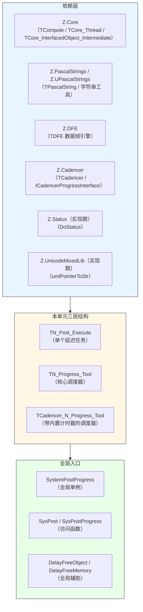
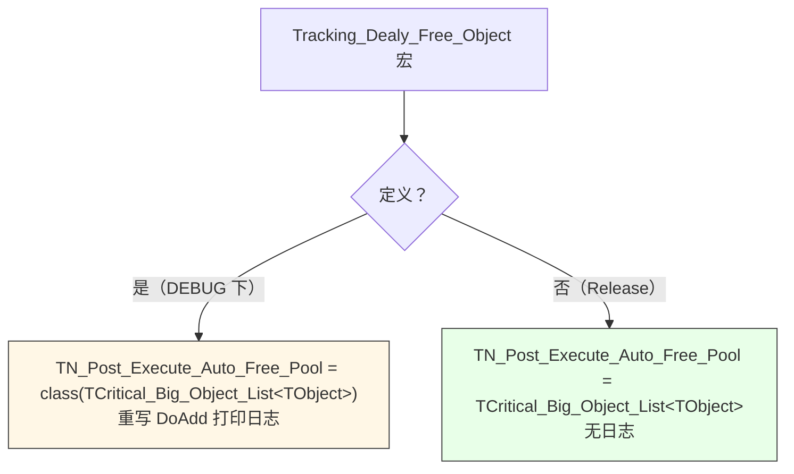
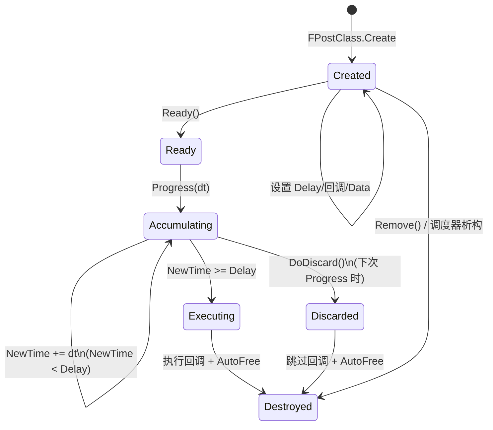
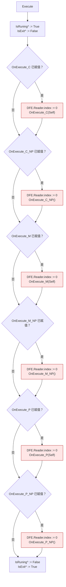
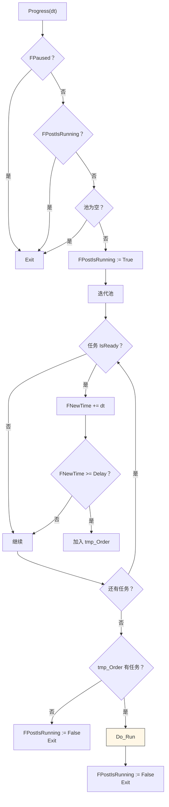
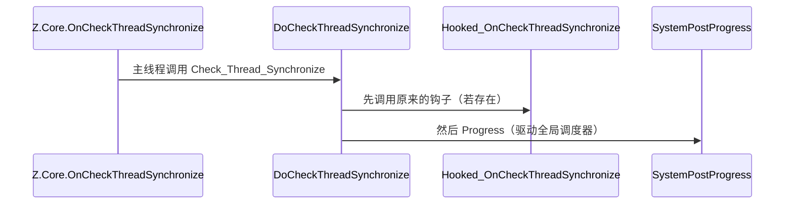
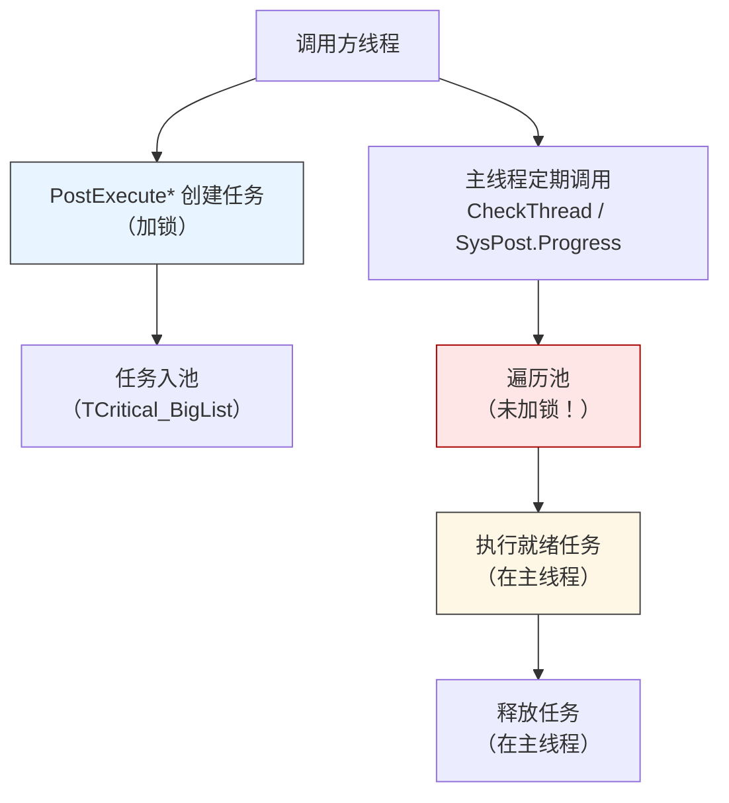

# Z.Notify 知识库（最终传承版）

> **定位**：面向 AI 与人类工程师的权威参考。目标是让读者**无需翻阅源码**即可安全、准确地使用 `Z.Notify`。
> **承诺**：所有描述均来自 `Z.Notify.pas` 的逐行核对。凡我无法从源码确定的，在文末「诚实的不确定清单」中明示。
> **制图约定**：全文流程图/架构图/决策树一律使用 Mermaid，不使用字符制图。

---

## 第 0 章 快速定位：这个单元是什么

`Z.Notify` 是 Z 框架的**轻量级时间驱动任务调度器**。它让你"延迟 N 秒后执行某个回调"，支持六种回调风格，并可选地携带数据容器与自动释放对象池。



**核心能力**：

| 能力 | 说明 |
|------|------|
| 延迟执行 | `Delay` 秒后执行回调，支持浮点精度 |
| 六种回调 | C / M / P × 带 sender / 无 sender（NP） |
| 数据容器 | 每个任务内嵌 `TDFE` 实例 |
| 自动释放 | `Auto_Free_Pool`（对象）、`Auto_Free_Memory`（内存指针） |
| 全局调度器 | `SystemPostProgress`，挂钩到 Z.Core 的同步钩子 |
| 暂停 | `Paused` 属性可临时挂起所有任务 |

---

## 第 1 章 核心类型

### 1.1 回调类型

```pascal
type
  // C 风格（过程）
  TN_Post_Execute_C    = procedure(Sender: TN_Post_Execute);
  TN_Post_Execute_C_NP = procedure();

  // M 风格（对象方法）
  TN_Post_Execute_M    = procedure(Sender: TN_Post_Execute) of object;
  TN_Post_Execute_M_NP = procedure() of object;

{$IFDEF FPC}
  TN_Post_Execute_P    = procedure(Sender: TN_Post_Execute) is nested;
  TN_Post_Execute_P_NP = procedure() is nested;
{$ELSE FPC}
  TN_Post_Execute_P    = reference to procedure(Sender: TN_Post_Execute);
  TN_Post_Execute_P_NP = reference to procedure();
{$ENDIF FPC}
```

**命名规则**：
- `_C` / `_M` / `_P`：回调风格。
- `_NP` 后缀：**No Parameter**，无 `Sender` 参数。

### 1.2 内部数据结构

```pascal
TN_Post_Execute_List_Struct        = TCritical_BigList<TN_Post_Execute>;
TN_Post_Execute_Temp_Order_Struct  = TOrderStruct<TN_Post_Execute>;
TN_Post_ExecuteClass               = class of TN_Post_Execute;
TNProgressPost                     = TN_Progress_Tool;       // 别名
TNPostExecute                      = TN_Post_Execute;        // 别名
```

**⚠️ 注意**：`TN_Post_Execute_List_Struct` 是 **`TCritical_BigList`**（线程安全版），但**迭代时需外部加锁**（参见 Z.Core 知识库 §5.5）。

### 1.3 `TN_FreeMemory_Pool`（内存释放队列）

```pascal
TN_FreeMemory_Pool = class(TOrderStruct<Pointer>)
public
  procedure DoFree(var Data: Pointer); override;
end;
```

**`DoFree` 行为**（源码）：`FreeMemory(Data); Data := nil;`。**用 `try...except` 包裹**，永不抛出。

### 1.4 `TN_Post_Execute_Auto_Free_Pool`（对象释放池）

**两种编译分支**：



**日志条件**：`Print_Tracking_Delay_Free = True` 时才输出。

---

## 第 2 章 `TN_Post_Execute` —— 单个延迟任务

### 2.1 字段总览

```pascal
TN_Post_Execute = class(TCore_Object_Intermediate)
private
  FOwner: TN_Progress_Tool;
  FPool_Data_Ptr: TN_Post_Execute_List_Struct.PQueueStruct;
  FDFE_Inst: TDFE;
  FNewTime: Double;
  FIsRuning, FIsExit: PBoolean;
  FIsReady: Boolean;
  FDiscard: Boolean;
public
  Info: SystemString;
  Data1: TCore_Object;
  Data2: TCore_Object;
  Data3: Variant;
  Data4: Variant;
  Data5: Pointer;
  Delay: Double;
  Auto_Free_Pool: TN_Post_Execute_Auto_Free_Pool;
  Auto_Free_Memory: TN_FreeMemory_Pool;

  OnExecute_C, OnExecute_C_NP: ...;
  OnExecute_M, OnExecute_M_NP: ...;
  OnExecute_P, OnExecute_P_NP: ...;
end;
```

### 2.2 属性

| 属性 | 类型 | 读/写 | 语义 |
|------|------|-------|------|
| `DataEng` / `DFE_Inst` | `TDFE` | 只读 | 内嵌数据容器 |
| `Owner` | `TN_Progress_Tool` | 只读 | 所属调度器 |
| `IsReady` | `Boolean` | 只读 | `Ready()` 是否已调用 |
| `NewTime` | `Double` | 只读 | 已累积的时间 |
| `IsRuning` | `PBoolean` | 读/写 | **写会立即把指向的布尔值置 True** |
| `IsExit` | `PBoolean` | 读/写 | **写会立即把指向的布尔值置 False** |

**`IsRuning` / `IsExit` 的 setter 陷阱**：

```pascal
procedure TN_Post_Execute.SetIsRuning(const Value: PBoolean);
begin
  FIsRuning := Value;
  if FIsRuning <> nil then FIsRuning^ := True;   // ⚠️ 立即置 True
end;

procedure TN_Post_Execute.SetIsExit(const Value: PBoolean);
begin
  FIsExit := Value;
  if FIsExit <> nil then FIsExit^ := False;      // ⚠️ 立即置 False
end;
```

**含义**：
- 赋值 `Task.IsRuning := @MyBool` 后，`MyBool` 立即变 True。
- 赋值 `Task.IsExit := @MyBool2` 后，`MyBool2` 立即变 False。

### 2.3 生命周期



### 2.4 `Ready` / `Execute` / `DoDiscard`

```pascal
procedure TN_Post_Execute.Ready;       // FIsReady := True
procedure TN_Post_Execute.Execute;     // 执行回调
procedure TN_Post_Execute.DoDiscard;   // FDiscard := True
```

**`Execute` 的精确行为**（**关键陷阱区**）：



**⚠️ 重大陷阱**：**六个回调是独立的 `if` 检查，不是 `else if` 链**。若用户赋值了多个回调，**它们都会被执行**。类注释说"只应赋值其中之一"，但源码没有强制。

### 2.5 `Auto_Free_Pool` 与 `Auto_Free_Memory` 的释放时机

**释放发生在 `TN_Post_Execute.Destroy` 中**：

```pascal
destructor TN_Post_Execute.Destroy;
begin
  if FOwner <> nil then
    begin
      if FOwner.FCurrentExecute = Self then
        FOwner.FCurrentExecute := nil;
      if FPool_Data_Ptr <> nil then
        begin
          FPool_Data_Ptr^.Data := nil;                          // 先置 nil
          FOwner.FPostExecute_Pool.Remove_P(FPool_Data_Ptr);    // 再移除
        end;
      FOwner := nil;
    end;
  DisposeObject(FDFE_Inst);
  DisposeObject(Auto_Free_Pool);      // ⚠️ 释放所有 AutoFree 对象
  DisposeObject(Auto_Free_Memory);    // ⚠️ 释放所有内存
  inherited Destroy;
end;
```

**重要顺序**：
1. **先从 owner 池移除自己**（避免迭代器失效）。
2. 释放 DFE。
3. 释放 Auto_Free_Pool（`TCritical_Big_Object_List<TObject>`，逐个 `DisposeObject`）。
4. 释放 Auto_Free_Memory（`TOrderStruct<Pointer>`，逐个 `FreeMemory`）。

**所以**：**对象/内存在任务执行完后立即释放**，无论任务是否真的执行了回调（例如被 `DoDiscard`）。

### 2.6 构造函数初始化

```pascal
constructor TN_Post_Execute.Create;
begin
  inherited Create;
  FOwner := nil;
  FPool_Data_Ptr := nil;
  FDFE_Inst := TDFE.Create;                              // 自动创建
  FNewTime := 0;
  Info := '';
  Data1 := nil;
  Data2 := nil;
  Data3 := Null;
  Data4 := Null;
  Data5 := nil;
  Delay := 0;
  Auto_Free_Pool := TN_Post_Execute_Auto_Free_Pool.Create(True);  // AutoFree=True
  Auto_Free_Memory := TN_FreeMemory_Pool.Create;
  FIsRuning := nil;
  FIsExit := nil;
  FIsReady := False;
  FDiscard := False;

  OnExecute_C := nil;
  OnExecute_C_NP := nil;
  OnExecute_M := nil;
  OnExecute_M_NP := nil;
  OnExecute_P := nil;
  OnExecute_P_NP := nil;
end;
```

**要点**：
- `Auto_Free_Pool` 是 `TCritical_Big_Object_List<TObject>`，`AutoFreeObject=True`。
- `FDFE_Inst` 一定非 nil。
- `Data3` / `Data4` 初始化为 `Null`（不是 0）。

---

## 第 3 章 `TN_Progress_Tool` —— 核心调度器

### 3.1 状态字段

```pascal
TN_Progress_Tool = class(TCore_InterfacedObject_Intermediate)
protected
  FPostIsRunning: Boolean;                            // 防重入
  FPostExecute_Pool: TN_Post_Execute_List_Struct;     // 任务池
  FPostClass: TN_Post_ExecuteClass;                   // 默认 TN_Post_Execute
  FBusy: Boolean;                                     // 正在执行回调
  FCurrentExecute: TN_Post_Execute;                   // 当前任务
  FPaused: Boolean;                                   // 暂停开关
end;
```

### 3.2 公共属性

| 属性 | 读/写 | 语义 |
|------|-------|------|
| `Paused` | 读/写 | True 时 `Progress` 立即返回 |
| `Busy` | 只读 | True 表示正在执行某个回调 |
| `CurrentExecute` | 只读 | 当前正在执行的任务（可为 nil） |
| `PostClass` | 读/写 | 用于创建新任务的类（可替换为子类） |

### 3.3 任务创建（`PostExecute` 家族）

#### 3.3.1 基础重载

```pascal
function PostExecute(ready_: Boolean): TN_Post_Execute;
function PostExecute(ready_: Boolean; DataEng: TDFE): TN_Post_Execute;
function PostExecute(ready_: Boolean; Delay: Double): TN_Post_Execute;
function PostExecute(ready_: Boolean; Delay: Double; DataEng: TDFE): TN_Post_Execute;
```

**通用契约**：
- 返回**新创建的任务**，已加入池。
- `ready_=True` 时立即调用 `Ready`。
- `DataEng` 非 nil 时 `Result.FDFE_Inst.Assign(DataEng)`。
- **返回后任务已进入待执行队列**（但若 `ready_=False` 则不会被累积时间）。

#### 3.3.2 C 风格重载（8 个）

```pascal
function PostExecuteC(DataEng: TDFE; OnExecute_C: TN_Post_Execute_C): TN_Post_Execute;
function PostExecuteC(Delay: Double; DataEng: TDFE; OnExecute_C: TN_Post_Execute_C): TN_Post_Execute;
function PostExecuteC(Delay: Double; OnExecute_C: TN_Post_Execute_C): TN_Post_Execute;
function PostExecuteC_NP(Delay: Double; OnExecute_C: TN_Post_Execute_C_NP): TN_Post_Execute;
function PostExecuteC(ready_: Boolean; DataEng: TDFE; OnExecute_C: TN_Post_Execute_C): TN_Post_Execute;
function PostExecuteC(ready_: Boolean; Delay: Double; DataEng: TDFE; OnExecute_C: TN_Post_Execute_C): TN_Post_Execute;
function PostExecuteC(ready_: Boolean; Delay: Double; OnExecute_C: TN_Post_Execute_C): TN_Post_Execute;
function PostExecuteC_NP(ready_: Boolean; Delay: Double; OnExecute_C: TN_Post_Execute_C_NP): TN_Post_Execute;
```

**行为**：设置 `Result.OnExecute_C := OnExecute_C`，如果 `ready_` 为 True 则 `Ready`。

**注意**：**没有 `ready_=False` 的 C 风格重载**（源码里只要 `ready_` 参数，所有对应重载都按参数值处理）。但注意：**无 `ready_` 参数的重载（如 `PostExecuteC(Delay, OnExecute_C)`）会自动 `Ready`**。

#### 3.3.3 M 风格重载（8 个）

与 C 风格结构完全相同，只是回调类型是 `TN_Post_Execute_M` / `TN_Post_Execute_M_NP`。

#### 3.3.4 P 风格重载（8 个）

与 C 风格结构完全相同，只是回调类型是 `TN_Post_Execute_P` / `TN_Post_Execute_P_NP`。

#### 3.3.5 重载选择速查表

| 场景 | 推荐重载 |
|------|----------|
| 延迟 N 秒执行无参过程 | `PostExecuteC_NP(N, Proc)` |
| 延迟 N 秒执行带 Sender 过程 | `PostExecuteC(N, Proc)` |
| 延迟 N 秒执行对象方法（无参） | `PostExecuteM_NP(N, Method)` |
| 延迟 N 秒执行对象方法（带 Sender） | `PostExecuteM(N, Method)` |
| 延迟 N 秒执行匿名函数（无参） | `PostExecuteP_NP(N, Proc)` |
| 延迟 N 秒执行匿名函数（带 Sender） | `PostExecuteP(N, Proc)` |
| 手动控制 Ready 时机 | `PostExecute(False, Delay)` + 手动赋值回调 + `Ready` |

### 3.4 延迟释放对象

```pascal
procedure PostDelayFreeObject(Delay: Double; Arry: array of TCore_Object); overload;
procedure PostDelayFreeObject(Delay: Double; Obj1_, Obj2_, Obj3_, Obj4_: TCore_Object); overload;
procedure PostDelayFreeObject(Delay: Double; Obj1_, Obj2_, Obj3_: TCore_Object); overload;
procedure PostDelayFreeObject(Delay: Double; Obj1_, Obj2_: TCore_Object); overload;
procedure PostDelayFreeObject(Delay: Double; Obj1_: TCore_Object); overload;

procedure PostDelayFreeMemory(Delay: Double; Arry: array of Pointer); overload;
procedure PostDelayFreeMemory(Delay: Double; p1_, p2_, p3_, p4_: Pointer); overload;
procedure PostDelayFreeMemory(Delay: Double; p1_, p2_, p3_: Pointer); overload;
procedure PostDelayFreeMemory(Delay: Double; p1_, p2_: Pointer); overload;
procedure PostDelayFreeMemory(Delay: Double; p1_: Pointer); overload;
```

**语义**：
- 创建一个内部任务，把对象/指针放入其 `Auto_Free_Pool` / `Auto_Free_Memory`。
- `Delay` 秒后任务执行（无回调），触发对象/内存释放。
- **`nil` 对象/`nil` 指针会被跳过**（源码 `if Obj1_ <> nil then`）。

### 3.5 `Progress(deltaTime)` —— 核心驱动

```pascal
procedure TN_Progress_Tool.Progress(deltaTime: Double);
```

**执行流程**：



**`Do_Run` 内部**（源码嵌套过程）：

```pascal
procedure Do_Run;
begin
  while tmp_Order.Num > 0 do
    begin
      FCurrentExecute := tmp_Order.First^.Data;
      if not FCurrentExecute.FDiscard then
        begin
          FBusy := True;
          try FCurrentExecute.Execute; except end;   // ⚠️ 异常被吞
          FBusy := False;
        end;
      DisposeObject(FCurrentExecute);                // ⚠️ 无条件释放
      tmp_Order.Next;
    end;
end;
```

**关键点**：

1. **防重入**：`FPostIsRunning` 保证 `Progress` 不会嵌套调用。**回调里调用 `Progress` 会被忽略**。
2. **两阶段**：先遍历池标记就绪任务（累加时间），再统一执行。
   - 好处：**避免在遍历中修改池**。
   - 遍历过程中，就绪的任务仍留在池中（只被引用到 `tmp_Order`）。
   - `Do_Run` 里每个任务执行完立即 `DisposeObject`。
3. **`FDiscard=True` 时**：**跳过回调执行**，但**仍然调用 `DisposeObject`**。所以 `Auto_Free_Pool` / `Auto_Free_Memory` 仍会被释放。
4. **异常吞掉**：回调异常被 `try...except` 包裹，`FBusy` 会恢复 False，任务仍会被释放。
5. **执行顺序**：`tmp_Order` 是 `TOrderStruct`（FIFO），所以按遍历池的顺序执行。

### 3.6 `Remove` / `ResetPost` / `Clear` / `Clean`

```pascal
procedure Remove(Inst_: TN_Post_Execute);   // 立即释放任务
procedure ResetPost;                        // 清空池
procedure Clear;                            // = ResetPost
procedure Clean;                            // = ResetPost
```

**`Remove` 的陷阱**：

```pascal
procedure TN_Progress_Tool.Remove(Inst_: TN_Post_Execute);
begin
  DisposeObject(Inst_);   // 只是 Dispose，移除由 Destructor 完成
end;
```

- **没有返回值**。
- 若 `Inst_ = nil`，`DisposeObject` 是 no-op。
- 真正从池移除发生在 `TN_Post_Execute.Destroy` 中。

**`ResetPost` / `Clear` / `Clean`**：三者都调用 `FPostExecute_Pool.Clear`。**会同时释放池中所有任务**（通过 `OnFree = Do_Free`）。

**`Do_Free` 回调**：

```pascal
procedure TN_Progress_Tool.Do_Free(var Inst_: TN_Post_Execute);
begin
  if Inst_ <> nil then
    begin
      Inst_.FPool_Data_Ptr := nil;    // 防止递归
      DisposeObjectAndNil(Inst_);
    end;
end;
```

---

## 第 4 章 `TCadencer_N_Progress_Tool` —— 带内置计时器

```pascal
TCadencer_N_Progress_Tool = class(TN_Progress_Tool, ICadencerProgressInterface)
protected
  FCadencerEngine: TCadencer;
  procedure CadencerProgress(const deltaTime, NewTime: Double);
public
  constructor Create;
  destructor Destroy; override;
  procedure Progress; overload;    // 无参数版本
  property CadencerEngine: TCadencer read FCadencerEngine;
end;
```

**差异**：

| 方面 | `TN_Progress_Tool` | `TCadencer_N_Progress_Tool` |
|------|---------------------|-----------------------------|
| 驱动方式 | 外部 `Progress(dt)` | 内部 `TCadencer` |
| 时间来源 | 调用方提供 | `TCadencer` 自动计算 |
| 需要手动计算 dt | 是 | 否 |
| 驱动方法 | `Progress(dt)` | `Progress()`（无参） |

**`CadencerProgress` 实现**：

```pascal
procedure TCadencer_N_Progress_Tool.CadencerProgress(const deltaTime, NewTime: Double);
begin
  inherited Progress(deltaTime);
end;
```

即：内部计时器调用时，转发到 `inherited Progress`。

**别名**：

```pascal
TN_Progress_ToolWithCadencer = TCadencer_N_Progress_Tool;
TCadencerPost                = TCadencer_N_Progress_Tool;
TCadencerNProgressPost       = TCadencer_N_Progress_Tool;
TNProgressPostWithCadencer   = TCadencerNProgressPost;
```

---

## 第 5 章 全局单例与钩子

### 5.1 全局变量

```pascal
var
  SystemPostProgress: TCadencer_N_Progress_Tool;   // 全局调度器
  Print_Tracking_Delay_Free: Boolean;              // 是否打印延迟释放日志
```

### 5.2 钩子机制



**initialization**：

```pascal
Hooked_OnCheckThreadSynchronize := Z.Core.OnCheckThreadSynchronize;
Z.Core.OnCheckThreadSynchronize := DoCheckThreadSynchronize;
SystemPostProgress := TCadencer_N_Progress_Tool.Create;
Print_Tracking_Delay_Free := False;
```

**finalization**：

```pascal
Z.Core.OnCheckThreadSynchronize := Hooked_OnCheckThreadSynchronize;
DisposeObject(SystemPostProgress);
```

**契约**：
- **Z.Core 的 `OnCheckThreadSynchronize` 是单指针变量**（见 Z.Core 知识库第 7.2 节）。
- 若用户先设置了钩子，本单元会保存为 `Hooked_OnCheckThreadSynchronize` 并链式调用。
- 若用户在本单元初始化后再覆盖 `OnCheckThreadSynchronize`，会**破坏本单元的钩子**（不会报错，全局调度器不再驱动）。

### 5.3 全局辅助函数

```pascal
function SysPostProgress: TCadencer_N_Progress_Tool;    // = SystemPostProgress
function SysPost: TCadencer_N_Progress_Tool;            // = SystemPostProgress

procedure DelayFreeObject(Delay: Double; Obj1_, Obj2_: TCore_Object); overload;
procedure DelayFreeObject(Delay: Double; Obj1_: TCore_Object); overload;
procedure DelayFreeObj(Delay: Double; Obj1_, Obj2_: TCore_Object); overload;
procedure DelayFreeObj(Delay: Double; Obj1_: TCore_Object); overload;

procedure DelayFreeMemory(Delay: Double; p1, p2, p3, p4: Pointer); overload;
procedure DelayFreeMemory(Delay: Double; p1, p2, p3: Pointer); overload;
procedure DelayFreeMemory(Delay: Double; p1, p2: Pointer); overload;
procedure DelayFreeMemory(Delay: Double; p1: Pointer); overload;

procedure DelayFreeMem(Delay: Double; ...);  // = DelayFreeMemory

function DelayFreeGetMem(Delay: Double; Size: NativeInt): Pointer;   // GetMemory + 延迟释放
function DelayGetMem(Delay: Double; Size: NativeInt): Pointer;       // = DelayFreeGetMem
```

**契约**：
- **所有 `DelayFree*` 函数使用全局 `SystemPostProgress`**。
- `DelayFreeGetMem` / `DelayGetMem` 分配内存并**自动安排延迟释放**。

---

## 第 6 章 完整使用范式

### 6.1 最基本用法

```pascal
uses Z.Notify, Z.Status;

procedure TForm1.FormCreate(Sender: TObject);
begin
  // 2.5 秒后执行
  SysPost.PostExecuteC_NP(2.5,
    procedure
    begin
      DoStatus('2.5 秒后执行');
    end);
end;
```

### 6.2 用对象方法（带参数）

```pascal
type
  TMyHandler = class
    procedure HandleTask(Sender: TN_Post_Execute);
  end;

procedure TMyHandler.HandleTask(Sender: TN_Post_Execute);
begin
  // 通过 Sender 访问数据
  DoStatus('Info = %s', [Sender.Info]);
  if Sender.Data1 is TStringList then
    DoStatus('Data1.Count = %d', [TStringList(Sender.Data1).Count]);
end;

// 使用
SysPost.PostExecuteM(1.0, MyHandler.HandleTask);
```

### 6.3 携带数据容器

```pascal
var
  dfe: TDFE;
begin
  dfe := TDFE.Create;
  try
    dfe.WriteString('hello');
    dfe.WriteInteger(42);
    SysPost.PostExecuteP(1.0, dfe,
      procedure(Sender: TN_Post_Execute)
      begin
        DoStatus('Str = %s', [Sender.DataEng.Reader.ReadString]);
        DoStatus('Int = %d', [Sender.DataEng.Reader.ReadInteger]);
      end);
  finally
    DisposeObject(dfe);
  end;
end;
```

**关键**：`PostExecute*` 内部 `Result.FDFE_Inst.Assign(DataEng)`，即**复制内容**。传入的 `dfe` 可以立即释放。

### 6.4 延迟释放对象

```pascal
// 5 秒后释放 MyObject 和 MyOtherObj
SysPost.PostDelayFreeObject(5.0, MyObject, MyOtherObj);

// 全局辅助（等效）
DelayFreeObject(5.0, MyObject, MyOtherObj);
```

**典型场景**：UI 对象在动画结束后释放，避免访问已释放内存。

### 6.5 延迟释放内存

```pascal
var
  p: Pointer;
begin
  p := GetMemory(1024);
  // 用 p ...
  SysPost.PostDelayFreeMemory(1.0, p);
end;
```

**或用 `DelayFreeGetMem` 一步完成**：

```pascal
var
  p: Pointer;
begin
  p := DelayFreeGetMem(5.0, 1024);   // 分配 + 5 秒后释放
  // 使用 p ...
  // 无需手动释放
end;
```

### 6.6 手动控制 Ready 时机

```pascal
var
  Task: TN_Post_Execute;
begin
  Task := SysPost.PostExecute(False, 1.0);   // 不 ready
  Task.OnExecute_C_NP := MyProc;
  Task.Info := '我的任务';

  // 稍后某个时刻再 ready
  Task.Ready;
end;
```

### 6.7 暂停调度器

```pascal
SysPost.Paused := True;    // 所有任务停止累积时间
// ...
SysPost.Paused := False;   // 恢复
```

### 6.8 检查任务是否完成

```pascal
var
  IsExit: Boolean;
  IsRuning: Boolean;
  Task: TN_Post_Execute;
begin
  IsExit := False;
  Task := SysPost.PostExecute(False, 1.0);
  Task.IsExit := @IsExit;   // 赋值时 IsExit 立即变 False
  Task.OnExecute_C_NP := MyProc;
  Task.Ready;

  // 忙等（仅演示，实际应用不要这样）
  while not IsExit do
    begin
      SysPost.Progress;
      TCompute.Sleep(1);
    end;
end;
```

### 6.9 自定义任务类

```pascal
type
  TMyTask = class(TN_Post_Execute)
  public
    procedure Execute; override;   // 自定义执行逻辑
  end;

var
  Tool: TN_Progress_Tool;
begin
  Tool := TN_Progress_Tool.Create;
  Tool.PostClass := TMyTask;   // 用 TMyTask 创建
  Tool.PostExecute(True, 1.0);
end;
```

### 6.10 与 Z.Core 集成

```pascal
// 主线程循环里
while Running do
  begin
    CheckThread(10);   // 自动驱动 SystemPostProgress
    Sleep(1);
  end;
```

**或显式驱动**：

```pascal
while Running do
  begin
    SysPost.Progress;   // 手动
    Sleep(10);
  end;
```

---

## 第 7 章 与 Z.Core 的契约

### 7.1 线程模型



**关键事实**：
1. **任务创建**（`PostExecute*`）**线程安全**（`TCritical_BigList.Add` 内部加锁）。
2. **任务执行**（`Progress`）**在主线程**，且**遍历时未加锁**。
3. **任务释放**在**主线程**。

**线程安全矩阵**：

| 操作 | 可从哪些线程调用 | 内部加锁 |
|------|------------------|----------|
| `PostExecute*` | 任意 | 是（Add） |
| `PostDelayFreeObject` | 任意 | 是（Add） |
| `Remove` | 主线程（推荐） | 否（DisposeObject） |
| `Progress` | 仅主线程 | 部分（Repeat 未加锁） |
| `ResetPost` / `Clear` / `Clean` | 主线程 | 是（Clear） |
| `Paused := ...` | 任意 | 否 |

**⚠️ 跨线程调用 `Progress` 不安全**：因为遍历未加锁，可能与其他线程的 `Add` 冲突。

### 7.2 与 `Z.Core.OnCheckThreadSynchronize` 的集成

**自动驱动**：
- `initialization` 时挂钩 `OnCheckThreadSynchronize`。
- 主线程调用 `CheckThread` / `Check_Soft_Thread_Synchronize` 时自动调用 `SystemPostProgress.Progress`。
- **所以大多数应用无需手动调用 `SysPost.Progress`**。

**手动驱动**：
- 适用于自定义主循环（游戏循环、服务主循环）。
- 调用 `SysPost.Progress` 或 `SysPostProgress.Progress`。

### 7.3 与 `Z.DFE` 的契约

- 每个任务内嵌 `TDFE` 实例。
- `Execute` 前会 `FDFE_Inst.Reader.index := 0`，**回调可以从头读**。
- **只在 `OnExecute_X` 回调前重置 index**，因为源码在每个回调前都重置了。

**⚠️ 多个回调**：若用户赋值了多个回调，每个回调前都会重置 `Reader.index`。但 `FDFE_Inst` 是共享的，读指针被反复重置。

### 7.4 与 `Z.Cadencer` 的契约

- `TCadencer_N_Progress_Tool` 实现 `ICadencerProgressInterface`。
- `TCadencer` 通过 `OnProgressInterface` 回调 `CadencerProgress`。
- **`FCadencerEngine` 由调度器拥有**，不要手动释放。

---

## 第 8 章 反例集

### 8.1 多个回调同时赋值

```pascal
// ❌ 错误：赋值两个回调
Task.OnExecute_C_NP := Proc1;
Task.OnExecute_M_NP := Proc2;
// Execute 时两个都会执行
```

**✅ 正确**：只赋值一个。

### 8.2 回调里 `Progress`

```pascal
// ❌ 错误：在回调中调用 Progress
SysPost.PostExecuteC_NP(1.0,
  procedure
  begin
    SysPost.Progress;   // 被 FPostIsRunning 忽略，可能引起逻辑错误
  end);
```

**✅ 正确**：回调只做业务，不要在回调中驱动调度器。

### 8.3 回调里 `Remove` 当前任务

```pascal
// ❌ 错误：回调中删除自己
SysPost.PostExecuteC_NP(1.0,
  procedure
  begin
    SysPost.Remove(SysPost.CurrentExecute);   // 危险！
  end);
```

**原因**：`FCurrentExecute` 是当前任务，回调返回后 `Do_Run` 还会访问它。

**✅ 正确**：不要在回调中删除自己。

### 8.4 回调里 Free 任务对象

```pascal
// ❌ 错误：回调中 Free 任务
SysPost.PostExecuteC(1.0,
  procedure(Sender: TN_Post_Execute)
  begin
    Sender.Free;   // 危险！Execute 返回后还会访问 FIsRuning / FIsExit
  end);
```

**原因**：`Execute` 在回调返回后还会设置 `FIsRuning^ := False; FIsExit^ := True`。任务已释放，字段访问是 UB。

**✅ 正确**：用 `Task.DoDiscard` 或什么都不做。

### 8.5 延迟释放对象后继续使用

```pascal
var
  Obj: TStringList;
begin
  Obj := TStringList.Create;
  DelayFreeObject(5.0, Obj);   // 5 秒后释放
  // ...
  Sleep(6000);
  Obj.Add('test');              // ❌ 已释放 → 崩
end;
```

**✅ 正确**：延迟释放后不要再访问。

### 8.6 忘记 `Delay` 是秒

```pascal
// ❌ 错误：以为 Delay 是毫秒
SysPost.PostExecuteC_NP(1000, MyProc);   // 1000 秒 = 16.7 分钟

// ✅ 正确：Delay 是秒
SysPost.PostExecuteC_NP(1.0, MyProc);    // 1 秒
```

### 8.7 `Paused` 期间添加任务

```pascal
SysPost.Paused := True;
SysPost.PostExecuteC_NP(1.0, MyProc);   // 任务入池但不累积
// ... 长时间后 ...
SysPost.Paused := False;
// 任务从"Paused=False 时刻"开始累积时间
```

**⚠️ 行为**：`Paused` 只阻止 `Progress` 累积时间，不阻止任务添加。恢复后，之前入池的任务会**从头开始累积**（因为它们从未累积过）。

### 8.8 `PostExecute` 的 `ready_=False` 陷阱

```pascal
var
  Task: TN_Post_Execute;
begin
  Task := SysPost.PostExecute(False, 1.0);   // 不 ready
  // ❌ 忘记调用 Task.Ready
end;
// 任务永远不执行，占用内存直到调度器释放
```

**✅ 正确**：要么 `PostExecute(True, ...)`，要么手动 `Task.Ready`。

### 8.9 覆盖 Z.Core 的钩子

```pascal
// ❌ 错误：覆盖 Z.Notify 安装的钩子
Z.Core.OnCheckThreadSynchronize := MyHook;
// 全局调度器不再驱动
```

**✅ 正确**：用 `Z.Core.OnCheckThreadSynchronize` 前先保存原值，链式调用。

### 8.10 多线程同时 `Progress`

```pascal
// ❌ 错误：两个线程同时 Progress
TThread.CreateAnonymousThread(procedure begin SysPost.Progress; end).Start;
TThread.CreateAnonymousThread(procedure begin SysPost.Progress; end).Start;
// FPostIsRunning 只防同线程重入，跨线程会崩
```

**✅ 正确**：只在主线程调用 `Progress`。

---

## 第 9 章 与其它 Z 库的衔接

### 9.1 与 `Z.ComputeThread` 的衔接

**推荐模式**：`TCompute.RunC` 在后台线程执行任务，用 `SysPost.PostExecute*` 回调主线程：

```pascal
TCompute.RunC(nil, nil,
  procedure(Th: TCompute)
  begin
    // 后台工作
    Sleep(2000);
    // 回调主线程
    SysPost.PostExecuteC_NP(0.0,
      procedure
      begin
        DoStatus('后台任务完成');
      end);
  end);
```

### 9.2 与 `Z.PascalStrings` 的衔接

- 任务携带的字符串建议用 `TPascalString`（`Auto_Free_Pool` 不管理 `TPascalString`，因为它是 record）。
- `Info` 字段是 `SystemString`（自动引用计数），无需手动释放。

### 9.3 与 `Z.DFE` 的衔接

- `DataEng` / `DFE_Inst` 是任务的内部属性，**不要手动释放**（任务析构时自动释放）。
- `PostExecute*` 传入的 `TDFE` 参数会被 `Assign` 复制，调用方可以立即释放。

### 9.4 与 `Z.Timer` 的区别

| 特性 | `Z.Notify` | `Z.Timer`（Z.Core.Timer） |
|------|-----------|---------------------------|
| 执行次数 | 单次 | 周期性 |
| 延迟精度 | 秒（浮点） | 毫秒（整数） |
| 回调风格 | C/M/P × sender/NP | C/M/P（无 sender） |
| 携带数据 | `TDFE` + `Data1..5` | 无 |
| 自动释放 | 内置 | 无 |
| 键（Key） | 无 | 用 `Bind_` 对象作唯一键 |
| 适用场景 | 延迟任务、一次性回调 | 周期性任务、定时器 |

**选择建议**：
- **单次延迟执行** → `Z.Notify`。
- **周期执行** → `Z.Timer`。
- **复杂条件任务** → 用 `TCompute.RunC` + `Z.Notify` 组合。

---

## 第 10 章 常见错误对照表

| 现象 | 根因 | 修正 |
|------|------|------|
| 回调不执行 | 忘记 `Ready` | 用 `PostExecute*` 带 `ready_=True` 或手动 `Ready` |
| 回调执行多次 | 赋值多个回调 | 只赋值一个 |
| 回调里访问已释放对象 | 延迟释放后使用 | 释放后不再访问 |
| `Progress` 无效 | 在回调里调用（被 `FPostIsRunning` 拦截） | 不要嵌套 `Progress` |
| 任务永远不执行 | `Paused=True` | 恢复 `Paused` |
| 对象没释放 | 忘记 `PostDelayFreeObject` | 用该 API 或 `DelayFreeObject` |
| 内存泄漏 | `Auto_Free_Memory` 未触发（任务被 `Remove` 时只释放对象池） | 检查 `Remove` 路径 |
| 跨线程崩溃 | 非主线程调用 `Progress` | 只在主线程调用 |
| 全局调度器失效 | 覆盖了 `OnCheckThreadSynchronize` | 保存并链式调用 |
| 多回调读取 DFE 乱序 | `Reader.index` 被每个回调前重置 | 只用一个回调 |
| `IsExit` 立刻变 False | Setter 立即设置 | 这是设计，赋值后别期待旧值 |
| `IsRuning` 立刻变 True | Setter 立即设置 | 同上 |
| 任务在 `DoDiscard` 后仍释放对象 | `DoDiscard` 只跳过回调，不跳过释放 | 想保留对象就手动从 `Auto_Free_Pool` 移除 |
| `Remove` 后 `CurrentExecute` 失效 | `Remove` 立即 `DisposeObject` | 不要在回调中 `Remove` 当前任务 |

---

## 第 11 章 诚实的不确定清单

> 以下是我从源码**无法完全确定**的点。若 AI 需要在这些场景下工作，**必须回查源码或询问人类**。

1. **`Execute` 里六个回调的调用顺序**
   - 源码顺序：`OnExecute_C` → `OnExecute_C_NP` → `OnExecute_M` → `OnExecute_M_NP` → `OnExecute_P` → `OnExecute_P_NP`。
   - **不确定**：这个顺序是否是有意设计，还是巧合。
   - **建议**：不要依赖顺序（只赋值一个）。

2. **`Execute` 里 `DFE_Inst.Reader.index := 0` 是否对所有回调都执行**
   - 源码在每个回调前都执行 `FDFE_Inst.Reader.index := 0`。
   - **不确定**：如果用户只用一个回调，多次重置是否有副作用。
   - **推测**：无害。

3. **`Progress` 遍历时未加锁**
   - 源码：`__Repeat__ := FPostExecute_Pool.Repeat_; repeat ... until not __Repeat__.Next;`
   - `TCritical_BigList.Repeat_` 不自动加锁（见 Z.Core 知识库 §5.5）。
   - **不确定**：如果另一个线程同时 `Add`，是否会导致迭代器失效。
   - **推测**：**是**。所以 `Progress` 必须在主线程调用。

4. **`Do_Run` 里任务执行中 `DisposeObject(FCurrentExecute)`**
   - 源码在 `Execute` 返回后无条件 `DisposeObject`。
   - **不确定**：如果用户在回调中手动 `Free` 任务，会怎样（可能崩）。
   - **推测**：崩。**禁止从回调中 Free 任务**。

5. **`Remove(Inst_)` 与 `Remove_P` 的关系**
   - `Remove` 只 `DisposeObject`，真正的移除由 `Destroy` 完成。
   - **不确定**：`Remove` 是否线程安全。
   - **推测**：`DisposeObject` 不是线程安全的。**建议在主线程调用**。

6. **`TCadencer_N_Progress_Tool.Progress` 的重入**
   - 源码：`FCadencerEngine.Progress;`
   - `TCadencer.Progress` 内部是否防重入未知。
   - **不确定**：如果 `TCadencer` 不防重入，可能崩。
   - **建议**：不要嵌套调用。

7. **`DelayFreeGetMem` / `DelayGetMem` 的延迟时间**
   - 源码：`Result := GetMemory(Size); DelayFreeMem(Delay, Result);`
   - **不确定**：`GetMemory` 分配失败时行为。**推测**：返回 nil，`DelayFreeMem` 会跳过 nil。

8. **`Print_Tracking_Delay_Free` 的默认值**
   - initialization 里设为 False。
   - **不确定**：用户改为 True 后，是否只影响新增的对象。
   - **推测**：是（运行时检查）。

9. **`Z.Core.OnCheckThreadSynchronize` 的调用时机**
   - 见 Z.Core 知识库 §7.2。
   - **不确定**：是否在主线程每次 `Check_Soft_Thread_Synchronize` 时都调用。
   - **推测**：只在 `Run_Hook_Event_=True` 时调用。

10. **`PostDelayFreeMemory` 的 `Auto_Free_Memory.Push` 语义**
    - `TN_FreeMemory_Pool = class(TOrderStruct<Pointer>)`。
    - `DoFree` 调用 `FreeMemory(Data)`。
    - **不确定**：如果 `Data` 已经被释放，会 double-free 崩。
    - **建议**：只传 `GetMemory` 分配的指针。

11. **`SystemPostProgress` 在 `finalization` 后是否仍被引用**
    - `finalization` 里 `DisposeObject(SystemPostProgress)`。
    - **不确定**：若此时还有线程在 `PostExecute*`，会崩。
    - **建议**：程序退出前确保无线程在操作。

12. **`TN_Post_Execute.Destroy` 中 `FDFE_Inst` 为 nil 的可能性**
    - 构造函数一定创建 `FDFE_Inst`。
    - **不确定**：是否有异常路径导致 `FDFE_Inst` 为 nil。
    - **推测**：不可能（构造异常会阻止对象创建）。

13. **`TN_Post_Execute` 的 `Info` 字段生命周期**
    - `Info: SystemString`，自动引用计数。
    - **不确定**：任务析构时是否会清空 `Info`。
    - **推测**：不主动清空（编译器自动）。

14. **`Progress` 遍历时 `FNewTime` 的溢出**
    - `FNewTime: Double`，每次 `+= deltaTime`。
    - **不确定**：长时间运行是否精度丢失。
    - **推测**：Double 精度足够（>10^15 秒）。

15. **`PostExecute` 家族是否真的返回"已加入池"的任务**
    - 源码：`Result.FPool_Data_Ptr := FPostExecute_Pool.Add(Result);`
    - **不确定**：如果 `Add` 抛异常（内存不足），任务是否泄漏。
    - **推测**：会泄漏。

---

## 第 12 章 结语

### 12.1 本知识库覆盖范围

- **已精确描述**：
  - `TN_Post_Execute` 的完整字段、生命周期、`Execute` 语义。
  - `TN_Progress_Tool` 的 `Progress` 两阶段算法。
  - `TCadencer_N_Progress_Tool` 的计时器集成。
  - 全局 `SystemPostProgress` 与 Z.Core 的钩子机制。
  - 六种回调风格与 `NP` 后缀。
  - `Auto_Free_Pool` / `Auto_Free_Memory` 的释放时机。
  - 所有 `PostExecute*` 重载。
  - 全局 `DelayFreeObject` / `DelayFreeMemory` 辅助。

- **已纠正的常见幻觉**：
  - **六个回调是独立 `if` 检查**，不是 `else if`。赋值多个会全部执行。
  - **`IsRuning` / `IsExit` 的 setter 会立即修改指向的布尔值**。
  - **`Execute` 前会重置 `DFE.Reader.index := 0`**。
  - **`DoDiscard` 只跳过回调，不跳过对象释放**。
  - **`Progress` 未加锁遍历池**，跨线程调用会崩。
  - **`FPostIsRunning` 防止嵌套 `Progress`**。
  - **`Remove` 只是 `DisposeObject`**，真正移除由 `Destroy` 完成。
  - **`Z.Core.OnCheckThreadSynchronize` 是单指针变量**，会被覆盖。

- **未覆盖**：
  - 源码中的 15 个不确定点。
  - `Z.DFE` / `Z.Cadencer` 的内部实现。
  - 除 `Z.Notify` 之外的单元。

### 12.2 给 AI 的使用规则

1. **只赋值一个回调**，不要多个。
2. **不要在回调里 `Progress`**。
3. **不要在回调里 `Remove` 当前任务**。
4. **不要在回调里 Free 任务对象**。
5. **`Delay` 单位是秒**（浮点）。
6. **`Paused=True` 时任务仍可入池**，但不会累积时间。
7. **跨线程只调 `PostExecute*`**，不要调 `Progress`。
8. **覆盖 `OnCheckThreadSynchronize` 前先保存原值**。
9. **`DelayFreeObject` 后不要再访问对象**。
10. **`Auto_Free_Memory` 只放 `GetMemory` 分配的指针**。
11. **遇到不确定清单里的场景，请查源码或问人**。

### 12.3 与 Z.Core / Z.Timer 的衔接

- `Z.Notify` 的全局调度器依赖 `Z.Core` 的 `OnCheckThreadSynchronize` 钩子。
- `Z.Notify` 与 `Z.Timer`（Z.Core.Timer）互补：
  - **`Z.Notify`** = 单次延迟。
  - **`Z.Timer`** = 周期执行。
- 使用本单元前，请先读 Z.Core 知识库第 1、7 章。

---

**本知识库的定位**：一份**准确的、有边界的、可操作的** `Z.Notify` 参考。它不假装能替代源码，但能让你在 90% 的场景下正确使用，并在剩下 10% 的场景下知道该停下来问人。