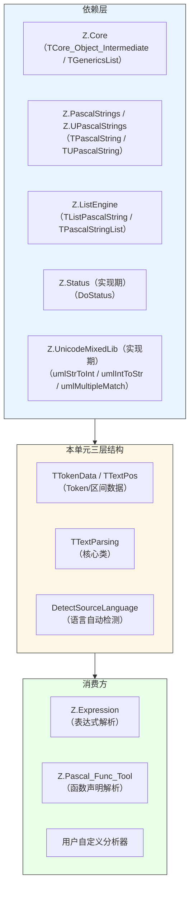
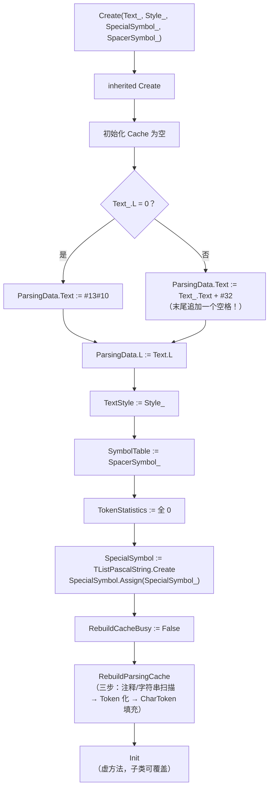
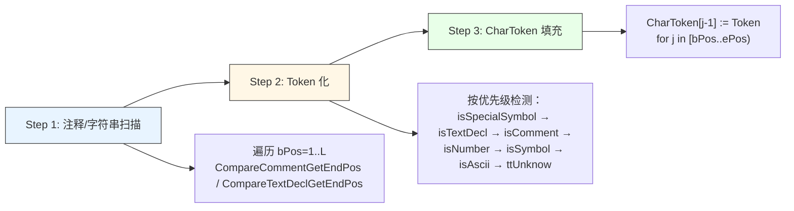
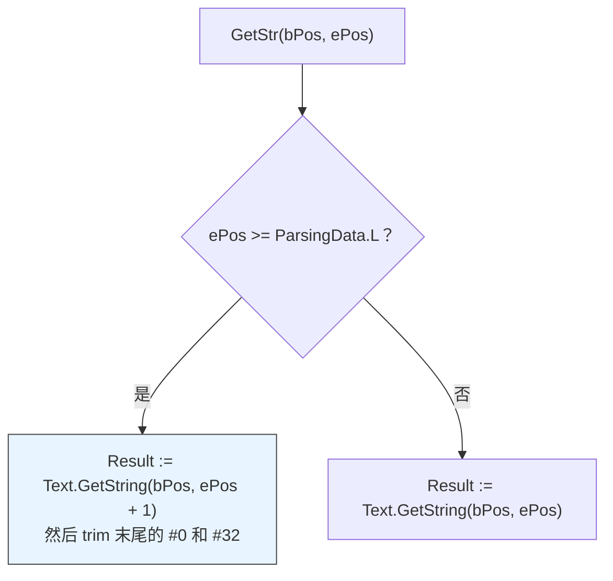
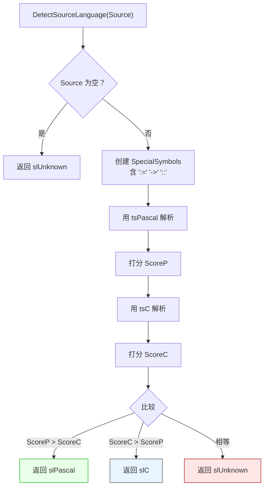
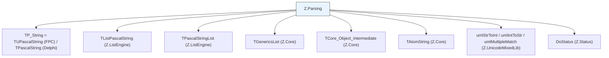

# Z.Parsing 知识库（最终传承版）

> **定位**：面向 AI 与人类工程师的权威参考。目标是让读者**无需翻阅源码**即可安全、准确地使用 `Z.Parsing`。
> **承诺**：所有描述均来自 `Z.Parsing.pas` 的逐行核对。凡我无法从源码确定的，在文末「诚实的不确定清单」中明示。
> **制图约定**：全文流程图/架构图/决策树一律使用 Mermaid，不使用字符制图。
> **关于 md 文件**：本知识库**修正**了 `Z.Parsing.md` v5.0 中的若干错误（见附录 A）。

---

## 第 0 章 快速定位：这个单元是什么

`Z.Parsing` 是 Z 框架的**词法分析 + 文本操作引擎**。它不是通用解析器生成器，而是**面向 Pascal/C/纯文本的 Token 化工具**，为表达式解析、代码重构、静态分析提供基础设施。



**核心能力**：

| 能力 | 说明 |
|------|------|
| Token 化 | 7 种 Token 类型：`ttTextDecl` / `ttComment` / `ttNumber` / `ttSymbol` / `ttAscii` / `ttSpecialSymbol` / `ttUnknow` |
| 缓存 | 三级缓存：注释区间 / 字符串区间 / Token 列表 + CharToken 数组 |
| 探针 | 按类型、文本、类型+文本左右搜索 |
| 括号匹配 | `IndentSymbolEndProbeR` / `IndentSymbolBeginProbeL` 处理嵌套 |
| 向量/矩阵 | 从逗号/分号分隔列表中提取 |
| 编辑 | 删除、插入、删注释 |
| 转换 | Pascal/C 字符串/注释互转 |

**风格**：
- `tsPascal`：`{}`、`(* *)`、`//` 注释；`'...'` 字符串；`#NN` 字符；`$FF` 十六进制。
- `tsC`：`/* */`、`//` 注释；`"..."` 和 `'...'` 字符串；`\n` 等转义；`0xNN` 十六进制；**`#` 开头行视为注释**。
- `tsText`：纯文本，仅字母数字成 `ttAscii`，其他为 `ttUnknow`。

---

## 第 1 章 核心类型

### 1.1 跨编译器别名

```pascal
{$IFDEF FPC}
  TP_String       = TUPascalString;      // UTF-16
  TP_PString      = PUPascalString;
  TP_SystemString = USystemString;
  TP_Char         = USystemChar;
  TP_ArrayString  = TUArrayPascalString;
  TP_OrdChar      = TUOrdChar;
  TP_OrdChars     = TUOrdChars;
{$ELSE FPC}
  TP_String       = TPascalString;
  TP_PString      = PPascalString;
  TP_SystemString = SystemString;
  TP_Char         = SystemChar;
  TP_ArrayString  = TArrayPascalString;
  TP_OrdChar      = TOrdChar;
  TP_OrdChars     = TOrdChars;
{$ENDIF FPC}
```

**⚠️ 关键差异**：
- **FPC 下 `TP_String = TUPascalString`（UTF-16）**，Delphi 下 `TP_String = TPascalString`（也是 UTF-16）。
- 两者都基于 UTF-16，但**类型不同**。用户传入 `TPascalString` 到 FPC 下的 API，会自动转换（走 `Bytes`，即 UTF-8 中转）。

### 1.2 枚举

```pascal
TTextStyle = (tsPascal, tsC, tsText);
TTokenType = (ttTextDecl, ttComment, ttNumber, ttSymbol, ttAscii, ttSpecialSymbol, ttUnknow);
TTokenTypes = set of TTokenType;
TTokenStatistics = array [TTokenType] of Integer;
```

**`ttUnknow` 的行为**：**连续未识别字符合并为一个 Token**（源码 `RebuildParsingCache` 里的 else 分支会 `TokenDataPtr^.ePos := ePos; TokenDataPtr^.Text.Append(...)`）。

**`TTokenStatistics` 的索引**：
- `TokenStatistics[ttTextDecl]` 是 `ttTextDecl` 的计数
- 由于 `TTokenType` 是枚举，数组按枚举序排列

### 1.3 记录

```pascal
TTextPos = record
  bPos, ePos: Integer;    // 1-based, 半开区间 [bPos, ePos)
  Text: TP_String;        // 缓存的区间文本
end;
PTextPos = ^TTextPos;

TTokenData = record
  bPos, ePos: Integer;
  Text: TP_String;
  tokenType: TTokenType;
  Index: Integer;         // Token 列表中的索引（0-based）
  procedure Init;         // 重置所有字段
end;
PTokenData = ^TTokenData;

TTextParsingCache = record
  CommentDecls, TextDecls: TTextPosList_Decl;    // 有序区间列表
  TokenDataList: TTokenDataList_Decl;            // Token 有序列表
  CharToken: array of PTokenData;                // 字符位置 → Token 指针
end;

TTextParsingData = record
  Cache: TTextParsingCache;
  Text: TP_String;         // 源文本（+末尾空格）
  L: Integer;
  property Len: Integer read L;
end;

TSymbolVector = TP_ArrayString;         // dynamic array of TP_String
TSymbolMatrix = array of TSymbolVector; // 二维
```

**`TTokenData.Init` 的默认值**：
- `bPos := -1`
- `ePos := -1`
- `Text := ''`
- `tokenType := ttUnknow`
- `Index := -1`

**`CharToken` 数组**：
- 长度 = `ParsingData.L`
- 索引 `i` 对应**字符位置 `i+1`**（因为 `CharToken[i]` 对应第 `i+1` 个字符）
- 每个元素指向该字符所属的 Token

---

## 第 2 章 `TTextParsing` 精确 API

### 2.1 字段

```pascal
TTextParsing = class(TCore_Object_Intermediate)
public
  TextStyle: TTextStyle;
  ParsingData: TTextParsingData;
  SymbolTable: TP_String;              // 单字符符号集
  TokenStatistics: TTokenStatistics;
  SpecialSymbol: TListPascalString;    // 多字符符号列表
  RebuildCacheBusy: Boolean;           // 内部防重入标志
end;
```

**`SymbolTable` 与 `SpecialSymbol` 的差异**：

| 字段 | 类型 | 语义 | 用途 |
|------|------|------|------|
| `SymbolTable` | `TP_String`（字符集） | 单字符符号（如 `+`, `-`, `(`, `)`） | `isSymbol` 判断 |
| `SpecialSymbol` | `TListPascalString`（字符串列表） | 多字符符号（如 `:=`, `>=`） | `isSpecialSymbol` 判断 |

**`RebuildCacheBusy` 的语义**：
- 内部标志，`RebuildParsingCache` 开始时置 True，结束时置 False。
- 为 True 时，所有 `TokenPos[cOffset]` 缓存查询**会跳过**（源码 `if not RebuildCacheBusy then ...`）。
- 用户不应手动改这个字段。

### 2.2 构造函数

```pascal
constructor Create(Text_: TP_String; Style_: TTextStyle; SpecialSymbol_: TListPascalString; SpacerSymbol_: TP_SystemString); overload;
constructor Create(Text_: TP_String; Style_: TTextStyle; SpecialSymbol_: TListPascalString); overload;
constructor Create(Text_: TP_String; Style_: TTextStyle); overload;
constructor Create(Text_: TP_String); overload;   // Style_ = tsText
destructor  Destroy; override;
```

**构造函数的精确行为**（源码）：



**关键点**：
1. **构造时末尾追加 `#32`**（源码注释：`append space for safe scanning`）。
2. **空文本会用 `#13#10`（CRLF）初始化**——不是真正的空！
3. `ParsingData.L` 是**含末尾空格的长度**（非空文本时 = 原文长度 + 1）。
4. `SpecialSymbol_` 会 `Assign` 复制一份，**外部列表可以释放**。
5. `RebuildParsingCache` **自动调用**，构造后 Token 已就绪。

**`Create(Text_)` 的默认 Style**：`tsText`（不是 `tsPascal`）。

**`Create(Text_, Style_, SpecialSymbol_)` 的 `SpacerSymbol_`**：从 `SpacerSymbol.V` 全局原子字符串取。

### 2.3 字符分类（静态方法）

```pascal
class function Char_is(c: TP_Char; SomeChars: array of TP_Char): Boolean; overload; static;
class function Char_is(c: TP_Char; SomeChar: TP_Char): Boolean; overload; static;
class function Char_is(c: TP_Char; s: TP_String): Boolean; overload; static;
class function Char_is(c: TP_Char; p: TP_PString): Boolean; overload; static;
class function Char_is(c: TP_Char; SomeCharsets: TP_OrdChars): Boolean; overload; static;
class function Char_is(c: TP_Char; SomeCharset: TP_OrdChar): Boolean; overload; static;
class function Char_is(c: TP_Char; SomeCharsets: TP_OrdChars; SomeChars: TP_String): Boolean; overload; static;
class function Char_is(c: TP_Char; SomeCharsets: TP_OrdChars; p: TP_PString): Boolean; overload; static;
```

**契约**：委托给 `UCharIn`（FPC）或 `CharIn`（Delphi），**不是独立实现**。

**推荐**：直接用 `UCharIn` / `CharIn`，无需绕道 `Char_is`。

### 2.4 位置比较

```pascal
function ComparePosStr(cOffset: Integer; t: TP_String): Boolean; overload;
function ComparePosStr(cOffset: Integer; p: TP_PString): Boolean; overload;
function ComparePosChar(cOffset: Integer; c: TP_Char): Boolean; overload;
function ComparePosChar(cOffset: Integer; c: TP_Char; ignoreCase_: Boolean): Boolean; overload;
```

**契约**：
- `cOffset` 是 **1-based** 字符位置。
- `ComparePosStr` 用 `ParsingData.Text.ComparePos(cOffset, t)`，**区分大小写**。
- `ComparePosChar` 用 `ParsingData.Text[cOffset] = c`（**不检查边界**）。
- `ComparePosChar(ignoreCase_=True)` 委托给 `ComparePosStr(cOffset, c)`——**这个行为是 case-insensitive 的字符串比较**。

### 2.5 注释/字符串边界

```pascal
function CompareCommentGetEndPos(cOffset: Integer): Integer;
function CompareTextDeclGetEndPos(cOffset: Integer): Integer;
```

**`CompareCommentGetEndPos` 契约**：
- 优先查缓存（若 `not RebuildCacheBusy`）。
- 否则基于 `TextStyle` 手动扫描：
  - `tsPascal` / `tsC`：`//` 单行注释
  - `tsC`：`#` 预处理指令、`/* */` 多行注释
  - `tsPascal`：`{ }`、`(* *)` 注释
- 返回**排除**末尾的结束位置。
- **未找到注释**时返回 `cOffset`。

**`CompareTextDeclGetEndPos` 契约**：
- 优先查缓存。
- 支持：
  - Pascal `'...'`（含 `''` 转义）
  - C `'...'`（含 `\'` 转义）和 `"..."`（含 `\"` 转义）
  - Pascal `#NN` 和 `#$NN`（十进制/十六进制）
  - **递归处理连续 `#` 序列**（`#65#66`）
- 返回**排除**末尾的结束位置。

### 2.6 缓存重建

```pascal
procedure RebuildParsingCache;                     // 从 Text 重建全部缓存
procedure RebuildText;                             // 从注释/字符串区间重建 Text
procedure RebuildToken;                            // 从 Token 列表重建 Text
function  FastRebuildTokenTo(): TP_String;         // 返回拼接结果，不改内部状态
```

**`RebuildParsingCache` 三步**：



**`RebuildParsingCache` 的副作用**：
- 释放旧的 `CommentDecls` / `TextDecls` / `TokenDataList`（逐个 `Dispose` 元素）。
- 重建所有数据结构。
- 重置 `TokenStatistics` 为 0 后重新统计。

**`RebuildText` 契约**：
- 用于**修改注释/字符串内容后**把 `TTextPos.Text` 重新拼回 `ParsingData.Text`。
- 先处理 `TextDecls`，再处理 `CommentDecls`。
- 对每个区间：若长度变化，`Recompute` 调整后续区间的位置。
- 最后调用 `RebuildParsingCache`。
- **⚠️ 效率**：每个区间都拼接整个 Text，大量修改会很慢。

**`RebuildToken` 契约**：
- 把所有 Token 的 `Text` 拼接起来作为新的 `ParsingData.Text`。
- **不追加末尾 `#32`**！
- 最后调用 `RebuildParsingCache`。

**`FastRebuildTokenTo` 契约**：
- 只返回拼接结果，**不修改内部状态**。
- 用户可自由使用。

### 2.7 上下文（Token 边界）

```pascal
function GetContextBeginPos(cOffset: Integer): Integer;
function GetContextEndPos(cOffset: Integer): Integer;
```

**契约**：
- 优先查缓存（若不在 `RebuildCacheBusy`）。
- 返回 Token 的 `bPos` / `ePos`。
- **未找到 Token** 时返回 `cOffset`。

### 2.8 特殊符号

```pascal
function isSpecialSymbol(cOffset: Integer): Boolean; overload;
function isSpecialSymbol(cOffset: Integer; var speicalSymbolEndPos: Integer): Boolean; overload;
function GetSpecialSymbolEndPos(cOffset: Integer): Integer;
```

**契约**：
- 优先查缓存。
- 遍历 `SpecialSymbol` 列表，**匹配最长前缀**。
- 返回 True 时 `speicalSymbolEndPos` 设为最长匹配的结束位置。
- **未匹配**时 `speicalSymbolEndPos = cOffset`。

**⚠️ 注意**：源码里 `SpecialSymbol` 的顺序影响匹配——**不是**最长匹配优先，而是**第一个匹配**（代码 `if EP > speicalSymbolEndPos then ...` 后继续遍历所有项，取最长的）。实际是最长匹配。

### 2.9 数字检测

```pascal
function isNumber(cOffset: Integer): Boolean; overload;
function isNumber(cOffset: Integer; var NumberBegin: Integer; var IsHex: Boolean): Boolean; overload;
function GetNumberEndPos(cOffset: Integer): Integer;
```

**契约**：
- 优先查缓存。
- 支持：`$FF`、`0xFF`、`123`、`-456`、`+789`、`3.14`、`-.5`、`1e-4`、`2.5E+6`。
- `NumberBegin` 设为数字起始位置（**跳过前导 `+`/`-`**）。
- `IsHex` 指示是否十六进制。
- **未识别**时返回 False。

**⚠️ 陷阱**：
- 源码里数字循环会跳过注释和字符串：`cPos := GetTextDeclEndPos(GetCommentEndPos(cPos));`
- 但随后对当前字符做判断。**如果 `1/*c*/2` 中间无空格**，`isNumber(1)` 会认为整个 `1/*c*/2` 是数字（跨越注释）。
- 实际上有 `isWordSplitChar` 检查，如果字符是分隔符则 Break。

### 2.10 字符串检测

```pascal
function isTextDecl(cOffset: Integer): Boolean;
function GetTextDeclEndPos(cOffset: Integer): Integer;
function GetTextDeclBeginPos(cOffset: Integer): Integer;
function GetTextBody(Text_: TP_String): TP_String;
function GetTextDeclPos(cOffset: Integer; var charBeginPos, charEndPos: Integer): Boolean;
```

**`GetTextDeclPos` 契约**：
- 用**二分查找**在 `TextDecls` 中定位。
- `CompLst` 的三态返回值：`0`=命中、`-1`=offset 在区间之后、`1`=offset 在区间之前。
- **`-2` 是内部错误**，会 `RaiseInfo('struct error')`。

**`GetTextBody` 契约**：
- 根据 `TextStyle` 分派：
  - `tsPascal` → `Translate_Pascal_Decl_To_Text`
  - `tsC` → `Translate_C_Decl_To_Text`
  - `tsText` → 返回原文本
- **对 `tsText` 风格**，不做任何转换。

### 2.11 符号/ASCII/注释检测

```pascal
function isSymbol(cOffset: Integer): Boolean;
function GetSymbolEndPos(cOffset: Integer): Integer;
function isAscii(cOffset: Integer): Boolean;
function GetAsciiBeginPos(cOffset: Integer): Integer;
function GetAsciiEndPos(cOffset: Integer): Integer;
function isComment(cOffset: Integer): Boolean;
function GetCommentEndPos(cOffset: Integer): Integer;
function GetCommentBeginPos(cOffset: Integer): Integer;
function GetCommentPos(cOffset: Integer; var charBeginPos, charEndPos: Integer): Boolean;
function GetDeletedCommentText: TP_String;
```

**`isSymbol` 契约**：
- 优先查缓存。
- 否则判断 `Char_is(ParsingData.Text[cOffset], SymbolTable)`。

**`isAscii` 契约**（**核心逻辑**）：
1. 优先查缓存。
2. 若 `isComment` / `isTextDecl` / `isSpecialSymbol` → False。
3. 否则要求：**不是 `isSymbol`**、**不是 `isWordSplitChar`**、**不是 `isNumber`**。

**`GetCommentPos` 契约**：
- 用**二分查找**在 `CommentDecls` 中定位。
- `-2` 内部错误 → `RaiseInfo`。

**`GetDeletedCommentText` 契约**：
- 遍历文本，跳过注释区间，拼接剩余部分。
- 最后 `TrimChar(#32)`。

### 2.12 复合检查

```pascal
function isTextOrComment(cOffset: Integer): Boolean;
function isCommentOrText(cOffset: Integer): Boolean;
```

**契约**：`isTextOrComment` = `isTextDecl or isComment`；`isCommentOrText` 反之（语义相同）。

### 2.13 分词辅助

```pascal
class function isWordSplitChar(c: TP_Char): Boolean; overload;
class function isWordSplitChar(c: TP_Char; Split_Token_Char: TP_String): Boolean; overload;
class function isWordSplitChar(c: TP_Char; Include_C_0_to_32: Boolean; Split_Token_Char: TP_String): Boolean; overload;

function GetWordBeginPos(cOffset: Integer; Split_Token_Char: TP_String): Integer; overload;
function GetWordBeginPos(cOffset: Integer): Integer; overload;
function GetWordBeginPos(cOffset: Integer; Include_C_0_to_32: Boolean; Split_Token_Char: TP_String): Integer; overload;

function GetWordEndPos(cOffset: Integer; Split_Token_Char: TP_String): Integer; overload;
function GetWordEndPos(cOffset: Integer): Integer; overload;
function GetWordEndPos(cOffset: Integer; BeginSplitCharSet, EndSplitCharSet: TP_String): Integer; overload;
function GetWordEndPos(cOffset: Integer; Include_C_0_to_32: Boolean; BeginSplitCharSet: TP_String; EndDefaultChar: Boolean; EndSplitCharSet: TP_String): Integer; overload;
```

**`isWordSplitChar` 契约**：
- `Include_C_0_to_32=True` 时，字符 0-32 和 `Split_Token_Char` 都算分隔符。
- `Include_C_0_to_32=False` 时，仅 `Split_Token_Char` 算分隔符。

**`GetWordBeginPos` / `GetWordEndPos` 契约**：
- 会跳过注释和字符串。
- `GetWordEndPos` 先调用 `GetWordBeginPos`，再从那里向前扩展。

### 2.14 嗅探

```pascal
function SniffingNextChar(cOffset: Integer; declChar: TP_String): Boolean; overload;
function SniffingNextChar(cOffset: Integer; declChar: TP_String; out OutPos: Integer): Boolean; overload;
```

**契约**：
- 从 `cOffset` 向前，跳过**空白、注释、字符串**。
- 找到属于 `declChar` 的字符时返回 True 并设 `OutPos`。
- 否则返回 False。

### 2.15 分割

```pascal
function SplitChar(cOffset: Integer; var LastPos: Integer; Include_C_0_to_32: Boolean;
  Split_Token_Char, Split_End_Token_Char: TP_String; var SplitOutput: TSymbolVector): Integer; overload;
function SplitChar(cOffset: Integer; var LastPos: Integer; Split_Token_Char, Split_End_Token_Char: TP_String;
  var SplitOutput: TSymbolVector): Integer; overload;
function SplitChar(cOffset: Integer; Split_Token_Char, Split_End_Token_Char: TP_String;
  var SplitOutput: TSymbolVector): Integer; overload;

function SplitString(cOffset: Integer; var LastPos: Integer; SplitTokenS, SplitEndTokenS: TP_String;
  var SplitOutput: TSymbolVector): Integer; overload;
function SplitString(cOffset: Integer; SplitTokenS, SplitEndTokenS: TP_String;
  var SplitOutput: TSymbolVector): Integer; overload;
```

**`SplitChar` 契约**：
- `cOffset` 是 **1-based 字符位置**。
- 跳过注释和字符串。
- 遇 `Split_Token_Char` 中的字符：当前字段加入输出，跳过该字符。
- 遇 `Split_End_Token_Char` 中的字符：**立即返回**，`LastPos := cPos`（**end token 不被消费**）。
- **空字段被跳过**（`AddS` 里 `TrimChar(#32#0)` 后检查长度）。
- **`Include_C_0_to_32=True`** 时，`0-32` 也算分隔符。
- 返回**提取的字段数**。

**`SplitString` 契约**：
- **没有 `Include_C_0_to_32` 参数**！这是与 `SplitChar` 的**重大区别**。
- 用**字符串匹配** `ComparePosStr(cPos, SplitTokenS)`。
- 同样跳过注释和字符串。
- 同样跳过空字段。
- 同样在 `SplitEndTokenS` 处停止且不消费。

**⚠️ 关键陷阱**：
- **`SplitChar` 会跳过空字段**。若需要保留空字段，需自行解析。
- **`SplitString` 不按 `0-32` 分割**（没有这个选项）。
- **两个方法都会跳过 `#0` 和 `#32` 的空字段**。

### 2.16 Token 访问

```pascal
function CompareTokenText(cOffset: Integer; t: TP_String): Boolean;
function CompareTokenChar(cOffset: Integer; c: array of TP_Char): Boolean;
function GetToken(cOffset: Integer): PTokenData;
property TokenPos[cOffset: Integer]: PTokenData read GetToken;
property CharToken[cOffset: Integer]: PTokenData read GetToken;

function GetTokenIndex(t: TTokenType; idx: Integer): PTokenData;
property TokenIndex[t: TTokenType; idx: Integer]: PTokenData read GetTokenIndex;

function TokenCount: Integer; overload;
function TokenCountT(t: TTokenTypes): Integer; overload;

function GetTokens(idx: Integer): PTokenData;
property Tokens[idx: Integer]: PTokenData read GetTokens; default;
property Token[idx: Integer]: PTokenData read GetTokens;
property Count: Integer read TokenCount;

function FirstToken: PTokenData;
function LastToken: PTokenData;
function NextToken(p: PTokenData): PTokenData;
function PrevToken(p: PTokenData): PTokenData;

function TokenCombine(bTokenI, eTokenI: Integer; acceptT: TTokenTypes): TP_String; overload;
function TokenCombine(bTokenI, eTokenI: Integer): TP_String; overload;
function Combine(bTokenI, eTokenI: Integer; acceptT: TTokenTypes): TP_String; overload;
function Combine(bTokenI, eTokenI: Integer): TP_String; overload;
```

**`GetToken(cOffset)` 契约**：
- 查 `CharToken` 数组，**O(1)**。
- `cOffset` 是 **1-based**，`CharToken[cOffset - 1]` 是实际索引。
- **越界**返回 nil。

**`GetTokenIndex` 契约**：
- 遍历 Token 列表，返回**第 `idx` 个**匹配 `t` 的 Token。
- `idx` 是 0-based。

**`TokenCombine` 契约**：
- 拼接从 `bTokenI` 到 `eTokenI`（inclusive）的 Token 文本。
- 只拼 `acceptT` 中的类型。
- **末尾会删除 `#0` 和 `#32`**（源码：`while (Result.L > 0) and (Result.Last = #0) do Result.DeleteLast; if ... #32 ... then DeleteLast;`）。
- **无 acceptT 的版本**：拼接所有类型。

**⚠️ `PrevToken` 有 bug**：

```pascal
function TTextParsing.PrevToken(p: PTokenData): PTokenData;
begin
  Result := nil;
  if (p = nil) or (p^.Index - 1 >= 0) then   // ⚠️ 应为 < 0
      exit;
  Result := Tokens[p^.Index - 1];
end;
```

- 当 `p^.Index >= 1` 时（即 p 不是第一个）**错误地返回 nil**。
- 当 `p^.Index = 0` 时（p 是第一个），访问 `Tokens[-1]` 会**越界崩溃**。
- **结论**：`PrevToken` **基本不可用**。用 `Tokens[p^.Index - 1]` 替代（自行检查边界）。

### 2.17 Token 探针

```pascal
// TokenProbeL 系列
function TokenProbeL(startI: Integer; acceptT: TTokenTypes): PTokenData; overload;
function TokenProbeL(startI: Integer; t: TP_String): PTokenData; overload;
function TokenProbeL(startI: Integer; acceptT: TTokenTypes; t: TP_String): PTokenData; overload;
function TokenProbeL(startI: Integer; acceptT: TTokenTypes; t1, t2: TP_String): PTokenData; overload;
function TokenProbeL(startI: Integer; acceptT: TTokenTypes; t1, t2, t3: TP_String): PTokenData; overload;
function TokenProbeL(startI: Integer; acceptT: TTokenTypes; t1, t2, t3, t4: TP_String): PTokenData; overload;
function TokenProbeL(startI: Integer; acceptT: TTokenTypes; t1, t2, t3, t4, t5: TP_String): PTokenData; overload;

// TokenProbeR 系列（同样的 7 个重载）
function TokenProbeR(...): PTokenData; overload;

// 短别名（同 TokenProbeL/R）
function ProbeL(...): PTokenData; overload;
function LProbe(...): PTokenData; overload;
function ProbeR(...): PTokenData; overload;
function RProbe(...): PTokenData; overload;

// 前缀匹配
function TokenFullStringProbe(startI: Integer; acceptT: TTokenTypes; t: TP_String): PTokenData;
function StringProbe(startI: Integer; acceptT: TTokenTypes; t: TP_String): PTokenData;
```

**⚠️ 重大陷阱**：`startI` 是 **Token 索引**，**不是字符位置**！

**契约**：
- `TokenProbeL/R` 从 Token 索引 `startI` 开始向左右搜索。
- 按 `acceptT` 过滤类型，按 `t1..t5` 过滤文本（**大小写不敏感**，用 `Text.Same`）。
- `TokenProbeL(startI, t)` **不限制类型**，只比较文本。
- **未找到**返回 nil。

**`StringProbe` 契约**：
- 用 `ComparePosStr(p^.bPos, t)` 判断**字符级前缀匹配**（不是 Token 文本相等）。
- 用于"找以某字符串开头的 Token"。

**`TokenFullStringProbe`** 是 `StringProbe` 的别名。

### 2.18 括号匹配

```pascal
function IndentSymbolEndProbeR(startI: Integer; indent_begin_symbol, indent_end_symbol: TP_String): PTokenData;
function IndentSymbolBeginProbeL(startI: Integer; indent_begin_symbol, indent_end_symbol: TP_String): PTokenData;
```

**契约**：
- 从 `startI`（**Token 索引**）开始向左右搜索匹配的括号。
- 用 `indent_begin_symbol.Exists(p^.Text.buff)` 判断——**这是字符集判断，不是字符串相等**！

**⚠️ 陷阱**：
- `Exists` 判断的是 `p^.Text` 中是否有任何字符在 `indent_begin_symbol` 中。
- 例如 `indent_begin_symbol = '('`，若 `p^.Text = '('`，`Exists('(')` 为 True。
- 但如果 `indent_begin_symbol = '('`，`p^.Text = '()'`，`Exists` 也是 True——**多字符 Token 可能误判**。
- 实际上 Token 通常是单字符（符号），所以问题不大。**但需知道这个行为**。

**计数器语义**：
- `bC` 计数开符号，`eC` 计数闭符号。
- 当 `bC > 0 and eC = bC` 时返回当前 Token。
- **未找到匹配**返回 nil。

### 2.19 向量/矩阵

```pascal
function DetectSymbolVector: Boolean;
function Extract_Symbol_Vector(L: TPascalStringList): Boolean; overload;
function Extract_Symbol_Vector: TSymbolVector; overload;
function FillSymbolMatrix(W, H: Integer; var symbolMatrix: TSymbolMatrix): Boolean;
```

**`DetectSymbolVector` 契约**：
- 顶层扫描逗号/分号。
- **遇到 `(` 或 `[` 时用 `IndentSymbolEndProbeR` 跳过整个括号组**。
- 返回 `VectorNum > 1`（至少两个元素）。
- **括号不匹配**返回 False。

**`Extract_Symbol_Vector(L)` 契约**：
- 类似 `DetectSymbolVector`，但提取每个元素到 `L`。
- 用 `TokenCombine` 拼接元素文本。
- **空元素会被 `TokenCombine` 的末尾 trim 处理**。
- **返回 True 总是成立**（除非括号不匹配）。

**`Extract_Symbol_Vector` （无参）**：
- 内部创建 `TPascalStringList`，调用有参版本，转成动态数组。
- **调用者负责数组生命周期**（自动管理）。

**`FillSymbolMatrix` 契约**：
- **先 `SetLength(symbolMatrix, 0, 0)`**（清空矩阵）。
- 调用 `Extract_Symbol_Vector(L)`。
- **若 `L.Count >= W*H`**：填充 `symbolMatrix[j, i]`（行优先）。
- **否则**：矩阵保持 0x0，但**返回值仍可能是 True**！
- **⚠️ 陷阱**：返回值不代表填充成功。

### 2.20 文本提取

```pascal
function GetText(bPos, ePos: Integer): TP_String; overload;
function GetStr(bPos, ePos: Integer): TP_String; overload;
function GetStr(tp: TTextPos): TP_String; overload;
function GetWord(cOffset: Integer): TP_String;
function GetPoint(cOffset: Integer): TPoint;
function GetChar(cOffset: Integer): TP_Char;

property Len: Integer read ParsingData.L;
property ParseText: TP_String read ParsingData.Text;
property Text: TP_String read ParsingData.Text;
```

**`GetStr(bPos, ePos)` 契约**：



- `bPos` 是 1-based，**包含**。
- `ePos` 是**排除**的。
- **⚠️ `Text.GetString` 是 `TPascalString.GetString`，它的 `ePos` 是 exclusive**。

**`GetPoint(cOffset)` 契约**：
- 返回 `TPoint(X, Y)`，**1-based**。
- 遍历 `1..cOffset-1`：
  - `#10`（LF）：`Y++`，`X := 0`
  - 非 `#13`：`X++`
- **O(n)**——`cOffset` 大时慢。

**⚠️ 陷阱**：`GetPoint` 对 `cOffset = 1` 返回 `Point(1, 1)`，对 `cOffset = 2` 返回 `Point(2, 1)`（如果第一个字符不是换行）。

### 2.21 编辑

```pascal
procedure DeletePos(bPos, ePos: Integer); overload;
procedure DeletePos(tp: TTextPos); overload;
procedure DeletedComment;
procedure InsertTextBlock(bPos, ePos: Integer; InsertText_: TP_String); overload;
procedure InsertTextBlock(tp: TTextPos; InsertText_: TP_String); overload;
function SearchWordBody(initPos: Integer; wordInfo: TP_String; var OutPos: TTextPos): Boolean;
```

**`DeletePos(bPos, ePos)` 契约**：
- 删除 `[bPos, ePos)` 区间。
- 内部：`ParsingData.Text := GetStr(1, bPos) + GetStr(ePos, Len);`
- **重建缓存**（`RebuildParsingCache`）。
- **⚠️ `ParsingData.L` 会变**。
- **⚠️ `ParsingData.Text` 末尾的 `#32` 会丢失**（因为 `GetStr` 会 trim）。

**`DeletedComment` 契约**：
- 用 `GetDeletedCommentText.TrimChar(#32)` 替换 `ParsingData.Text`。
- **重建缓存**。

**`InsertTextBlock(bPos, ePos, InsertText_)` 契约**：
- 用 `InsertText_` 替换 `[bPos, ePos)`。
- **重建缓存**。

**`SearchWordBody` 契约**：
- 从 `initPos` 开始查找等于 `wordInfo` 的标识符或数字（**大小写不敏感**）。
- 返回 True 并填 `OutPos`。
- **跳过注释、字符串、符号**。

### 2.22 转换（类方法）

```pascal
class function Translate_Pascal_Decl_To_Text(Decl: TP_String): TP_String;
class function Translate_Text_To_Pascal_Decl(Decl: TP_String): TP_String;
class function Translate_Text_To_Pascal_Decl_With_Unicode(Decl: TP_String): TP_String;
class function Translate_C_Decl_To_Text(Decl: TP_String): TP_String;
class function Translate_Text_To_C_Decl(Decl: TP_String): TP_String;

class function Translate_Pascal_Decl_Comment_To_Text(Decl: TP_String): TP_String;
class function Translate_Text_To_Pascal_Decl_Comment(Decl: TP_String): TP_String;
class function Translate_C_Decl_Comment_To_Text(Decl: TP_String): TP_String;
class function Translate_Text_To_C_Decl_Comment(Decl: TP_String): TP_String;
```

**`Translate_Pascal_Decl_To_Text` 契约**：
- 处理 `''''`（4 引号）→ 输出 `'`。
- 处理 `'...'` 内的字符直接输出。
- 处理 `#NN` 或 `#$NN` → 输出对应字符。
- **不支持字符串内换行**（`#10`）。
- **未在引号内**遇到其他字符会**跳过**（不报错）。

**`Translate_Text_To_Pascal_Decl` 契约**：
- 把 `#0..#31` 和 `'` 编码为 `#N`。
- 其他字符用 `'...'` 包裹。
- 相邻的 `#N` 不加引号，与字符串互转时正确关闭/打开引号。

**`Translate_Text_To_Pascal_Decl_With_Unicode` 契约**：
- 同上，但**额外编码 `Ord(c) >= $80` 的字符**。

**`Translate_C_Decl_To_Text` 契约**：
- 跟踪单引号（`'`）和双引号（`"`）状态。
- 用 `CTranslateTable` 替换转义序列：`\a \b \f \n \r \t \v \\ \? \' \" \0`。
- **⚠️ 不支持 `\xNN` 和 `\uNNNN`**。
- **未知转义**（如 `\z`）：跳过 `\` 保留原字符（实际是保留 `\`，然后在下一轮处理 `z`）。

**`Translate_Text_To_C_Decl` 契约**：
- 用 `CTranslateTable` 编码控制字符和特殊字符。
- **⚠️ 源码 bug**：`LastIsOrdChar` **永不赋值**，末尾总是添加 `"`。**实际上不会出问题**（只是冗余判断），但用户需知道这一点。
- **⚠️ 不支持 `\xNN` 编码**，控制字符用 `\a` 等或原字符。

**注释转换**：
- `Translate_Pascal_Decl_Comment_To_Text`：识别 `{...}`、`(*...*)`、`//...`、`///...`、`////...`。
- `Translate_Text_To_Pascal_Decl_Comment`：若文本已有注释标记则不变，否则用 `{ ... }` 或 `(* ... *)`。
- `Translate_C_Decl_Comment_To_Text`：识别 `#...`（预处理）、`/*...*/`、`//...`、`///...`、`////...`。
- `Translate_Text_To_C_Decl_Comment`：若已有 `#` 则不变，否则 `/* ... */`。

### 2.23 虚方法

```pascal
procedure Init; virtual;
function Parsing: Boolean; virtual;
```

**契约**：
- `Init`：构造后调用（`RebuildParsingCache` 之后），默认空实现。
- `Parsing`：默认返回 False，子类可覆盖。

### 2.24 调试

```pascal
procedure Print;
```

**契约**：用 `DoStatus`（`Z.Status`）打印所有 Token 的索引、类型、文本。

---

## 第 3 章 全局函数与变量

### 3.1 `DetectSourceLanguage`

```pascal
type
  TSourceLanguage = (slPascal, slC, slUnknown);

function DetectSourceLanguage(const Source: TP_String): TSourceLanguage;
```

**算法流程**：



**打分规则**：

| 证据 | Pascal | C |
|------|--------|---|
| `{...}` 或 `(*...*)` 注释（含 C 风格内容）| +4 | 0 |
| `{...}` 或 `(*...*)` 注释（纯 Pascal）| 0 | +4 |
| `//...` 注释 | +1 | +1 |
| `/*...*/` 注释 | 0 | +4 |
| `#...` 注释 | 0 | +4 |
| `'...'` 字符串 | +2 | 0 |
| `"..."` 字符串 | 0 | +2 |
| Pascal 关键字（`begin`, `end`, ...）| +2 | 0 |
| C 关键字（`int`, `void`, ...）| 0 | +2 |
| `:=` | +3 | 0 |
| `->` | 0 | +3 |
| `{` 符号 | 0 | +1 |

**关键点**：
- **平局返回 `slUnknown`**（不是 `slPascal`）。
- **`{...}` 注释若含 C 关键字（`return`/`switch` 等）** 判定为 C，给 C +4。
- 空输入返回 `slUnknown`。

### 3.2 全局变量

```pascal
const
  C_SpacerSymbol = #44#43#45#42#47#40#41#59#58#61#35#64#94#38#37#33#34#91#93#60#62#63#123#125#39#36#124;

var
  SpacerSymbol: TAtomString;
```

**`C_SpacerSymbol` 解码**：`,` `+` `-` `*` `/` `(` `)` `;` `:` `=` `#` `@` `^` `&` `%` `!` `"` `[` `]` `<` `>` `?` `{` `}` `'` `$` `|`（27 个字符）。

**`SpacerSymbol` 的初始化**：
- `initialization` 里 `SpacerSymbol := TAtomString.Create(C_SpacerSymbol);`
- `finalization` 里 `DisposeObjectAndNil(SpacerSymbol);`
- **运行时可通过 `SpacerSymbol.V := ...` 修改**（线程安全）。

---

## 第 4 章 反例集

### 4.1 `ProbeR(0, ...)` 的 `0` 不是字符位置

```pascal
// ❌ 错误：以为 0 是字符位置
Tok := Parser.ProbeR(0, [ttAscii]);   // 0 是 Token 索引（从第一个 Token 开始）

// ✅ 正确：Token 索引从 0 开始
Tok := Parser.ProbeR(0, [ttAscii]);   // 找第一个 ttAscii Token
```

### 4.2 用 `ProbeR` 找字符位置

```pascal
// ❌ 错误：想找字符位置 100 处的 Token
Tok := Parser.ProbeR(100, [ttAscii]);   // 100 是 Token 索引，不是字符位置

// ✅ 正确：用 GetToken
Tok := Parser.GetToken(100);   // 100 是字符位置（1-based）
```

### 4.3 `SplitChar` 跳过空字段

```pascal
// ❌ 错误：以为空字段会保留
Parser.SplitChar(1, LastPos, False, ',', '', Output);
// 输入 'a,,b' → Output = ['a', 'b']（空字段被跳过）

// ✅ 正确：需要空字段时手动解析
```

### 4.4 `PrevToken` 有 bug

```pascal
// ❌ 错误：以为 PrevToken 返回前一个
Prev := Parser.PrevToken(Tok);   // 大部分情况返回 nil，第一个 Token 会崩

// ✅ 正确：手动索引
if Tok^.Index > 0 then
  Prev := Parser.Tokens[Tok^.Index - 1];
```

### 4.5 `FillSymbolMatrix` 返回值不可靠

```pascal
// ❌ 错误：以为返回 True 就是填充成功
if Parser.FillSymbolMatrix(3, 2, Matrix) then
  // 使用 Matrix；可能 Matrix 是空的！

// ✅ 正确：检查矩阵维度
Parser.FillSymbolMatrix(3, 2, Matrix);
if (Length(Matrix) = 2) and (Length(Matrix[0]) = 3) then
  // 安全使用
```

### 4.6 `DetectSourceLanguage` 平局返回 slUnknown

```pascal
// ❌ 错误：以为平局默认 slPascal
Lang := DetectSourceLanguage(Source);
if Lang = slPascal then ...   // 平局时 Lang = slUnknown

// ✅ 正确：显式处理 slUnknown
case Lang of
  slPascal: ...;
  slC: ...;
  slUnknown: ...;   // 平局或空输入
end;
```

### 4.7 构造时空文本被替换为 CRLF

```pascal
// ❌ 错误：以为空字符串会得到空 Token 列表
Parser := TTextParsing.Create('');
// 实际 ParsingData.Text = #13#10，Len = 2
// Token 列表里会有两个 ttUnknow Token（#13 和 #10 都是空白字符）
```

### 4.8 末尾 `#32` 影响 `Len`

```pascal
Parser := TTextParsing.Create('abc');
// ParsingData.L = 4（abc + 空格）
// Parser.GetStr(1, 3) = 'ab'  （ePos 排除）
// Parser.GetStr(1, 4) = 'abc' （ePos 排除 + 末尾 trim）
```

### 4.9 `GetPoint` 是 O(n)

```pascal
// ❌ 错误：在热循环里频繁调用
for i := 1 to Parser.Len do
  P := Parser.GetPoint(i);   // 每次 O(i)，总 O(n²)

// ✅ 正确：一次遍历计算所有
```

### 4.10 `RebuildToken` 不追加末尾空格

```pascal
Parser.RebuildToken;
// 现在 ParsingData.Text 末尾没有 #32
// 后续扫描可能读到末尾超出（虽然有 RebuildParsingCache 里的保护）
```

### 4.11 `Translate_C_Decl_To_Text` 不支持 `\xNN`

```pascal
// ❌ 错误：以为支持所有 C 转义
Result := TTextParsing.Translate_C_Decl_To_Text('"\\x41"');   // 输出 '\\x41'（不是 'A'）

// ✅ 正确：手动处理 \x
```

### 4.12 `IndentSymbolEndProbeR` 的字符集判断

```pascal
// ⚠️ 用字符集判断，不是字符串相等
Match := Parser.IndentSymbolEndProbeR(Start, '(', ')');
// 若某 Token 是 '()'（多字符），'(' 会被判定为开符号
// 实际中单字符符号不会这样，但需知道
```

### 4.13 `DeletePos` 后 `ParsingData.Text` 无末尾空格

```pascal
Parser.DeletePos(5, 10);
// ParsingData.Text 末尾不再有 #32
// 若后续立即构造新 Token，扫描边界可能有问题
// 通常 RebuildParsingCache 内部有保护，不会崩，但要注意
```

### 4.14 `GetTextDeclPos` 的 `-2` 错误

```pascal
// 源码：else RaiseInfo('struct error');
// 这在正常使用中不会触发（区间有序且不重叠）
// 若用户手动改 TextDecls 列表可能导致
```

### 4.15 编译期类型别名差异

```pascal
// FPC 下 TP_String = TUPascalString
// Delphi 下 TP_String = TPascalString
// 若跨编译器共享代码，可能因隐式转换出错（走 Bytes 中转可能乱码）
```

---

## 第 5 章 常见错误对照表

| 现象 | 根因 | 修正 |
|------|------|------|
| `ProbeR(0, ...)` 找不到 Token | `0` 是 Token 索引，不是字符位置 | 用 `GetToken(字符位置)` |
| `SplitChar` 返回元素比预期少 | 空字段被跳过 | 手动解析或用其他方法 |
| `PrevToken` 返回 nil 或崩 | 源码 bug | 用 `Tokens[p^.Index - 1]` |
| `FillSymbolMatrix` 返回 True 但矩阵为空 | 元素不足 W*H | 检查矩阵维度 |
| `DetectSourceLanguage` 返回 slUnknown 但文本明显是 Pascal | 平局返回 slUnknown | 显式处理 slUnknown |
| `ParsingData.L` 比原文长度多 1 | 构造时末尾追加空格 | 注意 `L` 含空格 |
| 空文本解析出两个 Token | 空文本被替换为 `#13#10` | 检查 `Text_.L = 0` |
| `GetPoint` 慢 | O(n) | 只在需要时调用 |
| `Translate_C_Decl_To_Text('"\\x41"')` 不返回 'A' | 不支持 `\xNN` | 手动处理 |
| `RebuildToken` 后 Text 末尾无空格 | 源码未追加 | 后续操作注意 |
| FPC 下 `TTextParsing.Create(MyString)` 报错 | `MyString` 是 `TPascalString`，但参数要 `TUPascalString` | 显式转换 |
| `IndentSymbolEndProbeR` 误匹配多字符 Token | `Exists` 是字符集判断 | 避免多字符符号作为括号 |
| `Translate_Text_To_C_Decl` 输出末尾总有 `"` | `LastIsOrdChar` 未赋值 | 无需修正（冗余） |
| `DetectSourceLanguage` 空输入返回 slUnknown | 源码显式判断 | 已知行为 |
| `DeletePos` 后 `L` 变化 | 源码重建 Text | 重新读取 `L` |
| `SplitString` 不按空白分割 | 无 `Include_C_0_to_32` 参数 | 用 `SplitChar` 或手动 |
| `TokenCombine` 末尾内容丢失 | 自动 trim `#0`/`#32` | 注意末尾字符 |
| `Translate_Pascal_Decl_To_Text` 遇到字符串内换行 | 源码 `exit(cPos)` | 只处理单行字符串 |
| `GetTextDeclPos` 抛 'struct error' | `TextDecls` 内部错误 | 不手动改缓存 |

---

## 第 6 章 与 Z.Core 的衔接

### 6.1 类型依赖



### 6.2 线程安全

| 操作 | 线程安全 |
|------|---------|
| `TTextParsing` 实例方法 | ❌ 否（同一实例不可跨线程） |
| 类方法（`Translate_*`） | ✅ 是（纯函数） |
| `Char_is` 静态方法 | ✅ 是（纯函数） |
| `SpacerSymbol` 全局 | ✅ 是（`TAtomString`） |
| `DetectSourceLanguage` | ✅ 是（内部创建独立实例） |

**建议**：**每个线程用独立的 `TTextParsing` 实例**。

### 6.3 与 `Z.Expression` 的关系

- `Z.Expression` 基于 `Z.Parsing` 的 Token 流构建表达式解析。
- 表达式求值时，Token 类型（`ttAscii` / `ttNumber` / `ttSymbol` / `ttSpecialSymbol`）是关键。
- **不要在 `Z.Expression` 中修改 `TTextParsing` 的缓存**（会破坏表达式解析器状态）。

### 6.4 与 `Z.Pascal_Func_Tool` 的关系

- 用 `Z.Parsing` 解析 Pascal 函数声明和注释。
- 使用 `TokenProbeR/L` 搜索关键字、括号。
- 使用 `GetTextBody` 提取字符串字面量。

---

## 第 7 章 诚实的不确定清单

> 以下是我从源码**无法完全确定**的点。若 AI 需要在这些场景下工作，**必须回查源码或询问人类**。

1. **`PrevToken` 是否为有意 bug**
   - 源码 `if (p = nil) or (p^.Index - 1 >= 0) then exit;` 显然是 `>=` 应为 `<`。
   - **不确定**：是否有意限制使用（如防止某些边界）还是纯粹 bug。
   - **建议**：不用此函数。

2. **`Translate_Pascal_Decl_Comment_To_Text` 中 `'////*'` / `'///*'` 的含义**
   - 源码有 4 个斜杠、3 个斜杠、2 个斜杠三个分支。
   - **不确定**：为什么需要 4/3 斜杠，是否有特殊用途。
   - **推测**：可能是防御性代码，处理嵌套或转义。

3. **`Translate_Text_To_C_Decl` 的 `LastIsOrdChar` 变量**
   - 源码：`LastIsOrdChar` 声明且初始化为 False，**但从不被赋值**。
   - 末尾 `if not LastIsOrdChar then Result.Append('"')` 会**总是执行**。
   - **不确定**：是有意还是遗留 bug。
   - **推测**：bug，但当前行为（末尾总加 `"`）是用户期望的。

4. **`DetectSourceLanguage` 的 `LooksLikeCCode`**
   - 用于判断 Pascal 注释里是否含 C 代码。
   - 用 `HasWord` 检查关键词（`return`, `switch`, `goto`, `sizeof`, `typedef`, `struct`, `union`）。
   - **不确定**：是否会误判（如 Pascal 变量名恰好是 `return`）。
   - **推测**：`HasWord` 有标识符边界检查，不会误判。

5. **`DetectSourceLanguage` 的注释加权**
   - `{...}` 若含 C 代码给 C +4，否则 Pascal +4。
   - **不确定**：为什么 `LooksLikeCCode` 的权重是 4（与其他证据同级）。
   - **推测**：注释是强证据，权重高合理。

6. **`isNumber` 跨越注释的行为**
   - `GetCommentEndPos` / `GetTextDeclEndPos` 用于跳过注释/字符串。
   - `1/*c*/2` 会被当作一个数字。
   - **不确定**：是否有意支持。
   - **建议**：不要依赖此行为。

7. **`isAscii` 中 `isWordSplitChar(c, True, SymbolTable)` 的语义**
   - 参数 `Include_C_0_to_32=True` 表示 0-32 也算分隔符。
   - **不确定**：是否有意（因为 `isAscii` 也可能接受 Unicode 字符）。
   - **推测**：有意。

8. **`RebuildText` 的效率**
   - 每个区间都 `ParsingData.Text := GetStr(1, p^.bPos) + p^.Text + GetStr(p^.ePos, L + 1)`。
   - 对 N 个区间是 O(N * L)。
   - **不确定**：是否有更好的策略（未实现）。
   - **建议**：避免大量区间修改。

9. **`ParsingData.Text + #32` 的内存开销**
   - 每次构造都 +1 字符。
   - **不确定**：对超大文本是否值得。
   - **推测**：源码注释说为了安全扫描。

10. **`SpecialSymbol` 的顺序影响**
    - 源码遍历所有符号取最长匹配。
    - **不确定**：是否有排序要求（列表顺序不影响，因为取最长）。

11. **`CTranslateTable` 的转义顺序**
    - 数组顺序：`\a \b \f \n \r \t \v \\ \? \' \" \0`。
    - **不确定**：为什么 `\\` 排在 `\?` 之前（是否有区别）。
    - **推测**：因为 `\\` 是双字符转义，需要优先匹配。

12. **`Translate_Text_To_Pascal_Decl` 的空输入**
    - 返回 `''''`（两个单引号，表示空字符串）。
    - **不确定**：这是期望行为还是 fallback。

13. **`GetTextDeclPos` 的二分查找边界**
    - `CompLst` 返回 `-2` 表示"不可能的情况"（源码 `else RaiseInfo`）。
    - **不确定**：什么情况下会触发。
    - **推测**：区间有重叠或未排序。

14. **`IndentSymbolEndProbeR` 的 `Exists` 语义**
    - `indent_begin_symbol.Exists(p^.Text.buff)` 是字符集判断，不是字符串相等。
    - **不确定**：是否有意（可能为了避免多字符 Token 匹配失败）。
    - **建议**：单字符括号用单字符串参数即可。

15. **`DetectSymbolVector` 的 `VectorNum` 计数**
    - 每遇到一个 `,`/`;` 或到末尾 `Inc(VectorNum)`。
    - **不确定**：为什么末尾也 `Inc(VectorNum)`。
    - **推测**：处理 `a, b, c`（末尾无分隔符）时算 3 个元素。

16. **`Extract_Symbol_Vector(L)` 的 `vExp` 类型**
    - `vExp := TokenCombine(...)` 返回 `TP_String`，赋给 `vExp: TP_String`。
    - `L.Add(vExp.Text)` 用 `.Text` 转成 `SystemString`。
    - **不确定**：为什么用 `.Text` 而不是直接 `L.Add(vExp)`。
    - **推测**：`TPascalStringList.Add` 接收 `SystemString`。

17. **`SearchWordBody` 是否区分大小写**
    - 源码用 `GetStr(cp, ePos).Same(wordInfo)`，`.Same` 是**大小写不敏感**。
    - **不确定**：是否有意。

18. **`Print` 方法的格式化**
    - 用 `PFormat('index: %d type: %s value: %s', [i, GetEnumName(...), pt^.Text.Text])`。
    - **不确定**：`GetEnumName` 在 FPC/Delphi 下的行为一致性。

19. **`TTextParsingData.Text` 的可变性**
    - 用户可直接修改 `Parser.ParsingData.Text`，但不会自动重建缓存。
    - **不确定**：是否有意。

20. **`TokenFullStringProbe` 与 `StringProbe` 的区别**
    - 源码里 `TokenFullStringProbe` 直接调用 `StringProbe`。
    - **不确定**：为什么有两个名字。

21. **`StringProbe` 的 `ComparePosStr` 用于 Token 文本**
    - `ComparePosStr(p^.bPos, t)` 检查 `ParsingData.Text` 中 `p^.bPos` 处是否以 `t` 开头。
    - 这**等价于**检查 Token 的 Text 是否以 `t` 开头（因为 Token 是从 `bPos` 开始的）。
    - **不确定**：是否有边界情况（Token 跨行等）。

22. **`DetectSourceLanguage` 的 `Source = ''` 检查**
    - 源码：`if (Source = '') or (Source.L = 0) then exit;`
    - **不确定**：`Source.L = 0` 时 `Source = ''` 也为 True，两个条件冗余。

23. **`SpacerSymbol` 全局的线程安全**
    - 用 `TAtomString`（内部有 `TCritical`）。
    - **不确定**：构造函数读取 `SpacerSymbol.V` 时是否加锁（应该是，`TAtomString.GetValue` 加锁）。

24. **`C_SpacerSymbol` 缺失的字符**
    - 常量不含 `~`、`\`、`` ` `` 等字符。
    - **不确定**：是否有意（这些字符在 Pascal 代码中不常见）。

---

## 第 8 章 结语

### 8.1 本知识库覆盖范围

- **已精确描述**：
  - `TTextParsing` 的所有公开 API。
  - 构造函数、`RebuildParsingCache`、Token 化优先级。
  - 探针、分割、括号匹配、向量/矩阵。
  - 转换方法（`Translate_*`）。
  - `DetectSourceLanguage` 的加权算法。
  - 全局 `SpacerSymbol` 与 `C_SpacerSymbol`。

- **已纠正的常见幻觉**：
  - **`ProbeR` 的 `startI` 是 Token 索引**，不是字符位置。
  - **`PrevToken` 有 bug**，几乎不可用。
  - **`SplitChar` 会跳过空字段**（`TrimChar(#32#0)` 后检查长度）。
  - **`SplitString` 没有 `Include_C_0_to_32` 参数**。
  - **`DetectSourceLanguage` 平局返回 `slUnknown`**（不是 `slPascal`）。
  - **`FillSymbolMatrix` 返回值不代表填充成功**。
  - **构造时空文本被替换为 `#13#10`**。
  - **构造时末尾追加 `#32`**，`ParsingData.L` 含这个空格。
  - **`GetStr` 在 `ePos >= L` 时自动 trim 末尾 `#0` 和 `#32`**。
  - **`Translate_C_Decl_To_Text` 不支持 `\xNN`**。
  - **`Translate_Text_To_C_Decl` 的 `LastIsOrdChar` 永不赋值**（冗余逻辑）。
  - **`IndentSymbolEndProbeR` 用 `Exists` 字符集判断**，不是字符串相等。
  - **`isNumber` 可能跨越注释**（`1/*c*/2` 被当作一个数字）。

- **未覆盖**：
  - 源码中的 24 个不确定点。
  - `Z.Expression` / `Z.Pascal_Func_Tool` 的内部实现。
  - 除 `Z.Parsing` 之外的单元。

### 8.2 给 AI 的使用规则

1. **`ProbeL/R` 的 `startI` 是 Token 索引**，不是字符位置。
2. **`GetToken(字符位置)` 用 1-based**，返回 `PTokenData`。
3. **`SplitChar` 会跳过空字段**，需要空字段时手动解析。
4. **`SplitString` 只按字符串分割**，不按空白。
5. **`PrevToken` 有 bug**，用 `Tokens[p^.Index - 1]`。
6. **`DetectSourceLanguage` 平局返回 `slUnknown`**。
7. **构造时末尾追加 `#32`**，`ParsingData.L` 含这个空格。
8. **空文本被替换为 `#13#10`**，Token 列表不为空。
9. **`Translate_*` 方法不处理所有转义**（尤其 C 的 `\xNN`）。
10. **`IndentSymbolEndProbeR` 用字符集判断**，多字符 Token 可能误判。
11. **每个线程独立 `TTextParsing` 实例**，不要共享。
12. **遇到不确定清单里的场景，请查源码或问人**。

### 8.3 与 Z.Core / Z.Expression 的衔接

- 使用本单元前，请先读 Z.Core 知识库第 1、2、5 章。
- `Z.Parsing` 的 Token 流是 `Z.Expression` 的输入。
- 不要在 `Z.Expression` 使用期间修改 `TTextParsing` 的缓存。

---

## 附录 A：对 `Z.Parsing.md` v5.0 的修正

| md 中的说法 | 实际 | 修正 |
|-------------|------|------|
| "平局默认 slPascal" | 源码：平局返回 `slUnknown` | 见 §3.1 |
| "ProbeR(startI, ...) 的 startI 是字符位置" | 是 **Token 索引** | 见 §2.17 |
| "SplitChar 保留空字段" | **会跳过空字段** | 见 §2.15 |
| "SplitString 有 Include_C_0_to_32" | **没有此参数** | 见 §2.15 |
| "PrevToken 返回前一个 Token" | 源码有 bug，几乎不可用 | 见 §2.16 |
| "FillSymbolMatrix 返回 True 表示成功" | 返回值不代表填充 | 见 §2.19 |
| "`Translate_C_Decl_To_Text` 支持 `\x`" | **不支持** | 见 §2.22 |
| "`IndentSymbolEndProbeR` 匹配字符串" | 用**字符集**判断 | 见 §2.18 |
| "构造时末尾追加 `#32` 无影响" | 影响 `L` 和 `GetStr` | 见 §2.2 |
| "空文本得到空 Token 列表" | **被替换为 `#13#10`** | 见 §2.2 |

---

**本知识库的定位**：一份**准确的、有边界的、可操作的** `Z.Parsing` 参考。它不假装能替代源码，但能让你在 90% 的场景下正确使用，并在剩下 10% 的场景下知道该停下来问人。