# Z.PascalStrings / Z.UPascalStrings 知识库（最终传承版）

> **定位**：面向 AI 与人类工程师的权威参考。目的是让读者**无需翻阅源码**即可安全、准确地使用 `TPascalString` 和 `TUPascalString`。
> **承诺**：所有描述均来自 `Z.PascalStrings.pas` 与 `Z.UPascalStrings.pas` 的逐行核对。凡我无法从源码确定的，在文末「诚实的不确定清单」中明示。
> **适用范围**：Delphi 与 Free Pascal。
> **制图约定**：全文流程图/架构图/决策树一律使用 Mermaid，不使用字符制图。

---

## 第 0 章 快速定位：这两个单元是什么

`Z.PascalStrings` 与 `Z.UPascalStrings` 是 Z 框架的**自定义字符串类型**，为高吞吐量场景（解析、网络、AI 数据集）提供比原生 `string`/`AnsiString` 更可控的内存布局与操作。

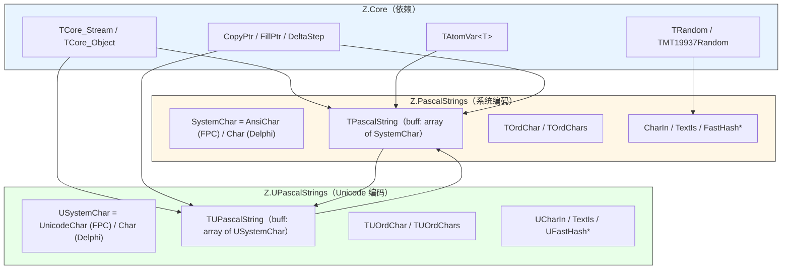

### 0.1 选择哪一个

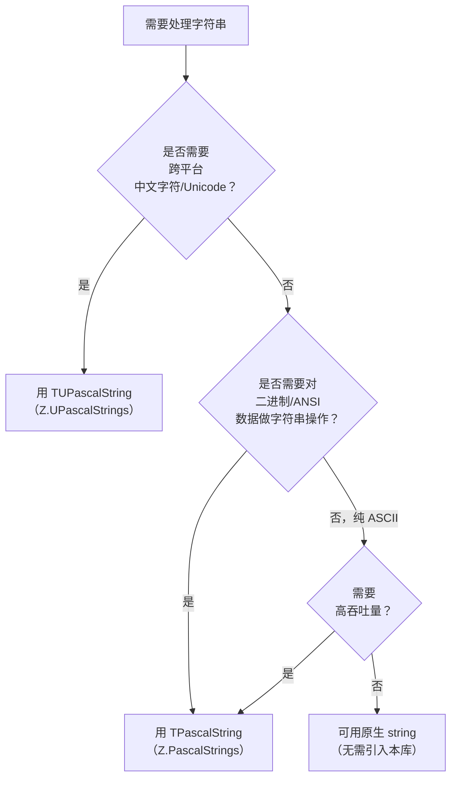

### 0.2 两个单元的核心差异

| 维度 | `TPascalString` | `TUPascalString` |
|------|-----------------|------------------|
| 内部字符类型 | `SystemChar` | `USystemChar` |
| FPC 下实际类型 | `AnsiChar`（1 字节） | `UnicodeChar`（2 字节） |
| Delphi 下实际类型 | `Char`（2 字节，UTF-16） | `Char`（2 字节，UTF-16） |
| 内部缓冲 | `buff: array of SystemChar` | `buff: array of USystemChar` |
| 字符分类枚举 | `TOrdChar` / `TOrdChars` | `TUOrdChar` / `TUOrdChars` |
| 全局函数前缀 | 无 | `U`（`UCharIn`、`UFormat`、`UFastHash*`、`USmithWatermanCompare*`） |
| 与另一个的转换 | — | 通过 `Bytes`（UTF-8）互转 |
| `Chars[index]` 起始 | 1 | 1 |
| `FirstCharPos`（原生字符串索引基准） | FPC=0, Delphi=1 | FPC=0, Delphi=1 |

**关键事实**（易被误解）：
- **`buff` 是 0 基**（`array of X`），但 `Chars[index]` 属性是 **1 基**。
- **`TPascalString` 在 FPC 下不处理 UTF-8**。它是单字节字符串，`Bytes` 属性会把单字节内容"假装"编码为 UTF-8，对高位字符不安全。要 UTF-8 用 `TUPascalString`。
- **`TUPascalString` 在 Delphi 下与 `TPascalString` 共享 `SystemChar = Char`**，但 FPC 下两者不同。

---

## 第 1 章 类型与索引语义

### 1.1 类型别名

```pascal
// Z.PascalStrings
{$IFDEF FPC}
  SystemChar   = AnsiChar;
  SystemString = AnsiString;
{$ELSE}
  SystemChar   = Char;
  SystemString = string;   // UnicodeString
{$ENDIF}
PSystemChar    = ^SystemChar;
TArrayChar     = array of SystemChar;
PSystemString  = ^SystemString;
PPascalString  = ^TPascalString;

// Z.UPascalStrings
{$IFDEF FPC}
  USystemChar   = UnicodeChar;
  USystemString = UnicodeString;
  TUArrayChar   = array of USystemChar;
{$ELSE}
  USystemChar   = Z.PascalStrings.SystemChar;   // Char
  USystemString = Z.PascalStrings.SystemString; // string
  TUArrayChar   = Z.PascalStrings.TArrayChar;
{$ENDIF}
PUSystemChar      = ^USystemChar;
PUSystemString    = ^USystemString;
PUPascalString    = ^TUPascalString;
```

### 1.2 索引基准常量

```pascal
{$IFDEF FirstCharInZero}
  FirstCharPos   = 0;   // FPC 默认
  UFirstCharPos  = 0;
{$ELSE}
  FirstCharPos   = 1;   // Delphi 默认
  UFirstCharPos  = 1;
{$ENDIF}
```

**语义区分（极易混淆）**：

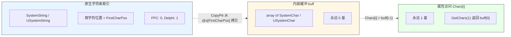

### 1.3 字符分类枚举

```pascal
TOrdChar = (
  c0to9,        // '0'..'9'
  c1to9,        // '1'..'9'
  c0to32,       // 0x00..0x20（含空格）
  c0to32no10,   // 同上但排除 #10
  cLoAtoF,      // 'a'..'f'
  cHiAtoF,      // 'A'..'F'
  cLoAtoZ,      // 'a'..'z'
  cHiAtoZ,      // 'A'..'Z'
  cHex,         // 0-9 a-f A-F
  cAtoF,        // a-f A-F
  cAtoZ,        // a-z A-Z
  cVisibled,    // 0x20..0x7E 或 > 0xFF
  cDoubleChar   // > 0xFF
);
TOrdChars = set of TOrdChar;

// Z.UPascalStrings 对应
TUOrdChar = (uc0to9, uc1to9, uc0to32, uc0to32no10,
             ucLoAtoF, ucHiAtoF, ucLoAtoZ, ucHiAtoZ,
             ucHex, ucAtoF, ucAtoZ, ucVisibled, ucDoubleChar);
TUOrdChars = set of TUOrdChar;
```

**判定规则速查**（源码内 `CharIn(c, SomeCharset)` 分支）：

| 类别 | 判定 |
|------|------|
| `c0to9` | `Ord(c) in [$30..$39]` |
| `c1to9` | `Ord(c) in [$31..$39]` |
| `c0to32` | `Ord(c) in [0..32]` |
| `c0to32no10` | `Ord(c) in [0..32] and c <> #10` |
| `cLoAtoF` | `Ord(c) in [$61..$66]` |
| `cHiAtoF` | `Ord(c) in [$41..$46]` |
| `cLoAtoZ` | `Ord(c) in [$61..$7A]` |
| `cHiAtoZ` | `Ord(c) in [$41..$5A]` |
| `cHex` | 上述三类的并 |
| `cAtoF` | `cLoAtoF ∪ cHiAtoF` |
| `cAtoZ` | `cLoAtoZ ∪ cHiAtoZ` |
| `cVisibled` | `Ord(c) in [$20..$7E] or Ord(c) > $FF` |
| `cDoubleChar` | `Ord(c) > $FF` |

**关键陷阱**：
- **`cDoubleChar` 在 FPC 的 `TPascalString` 下永远为 False**（因为 `SystemChar = AnsiChar`，`Ord <= 255`）。
- **`cVisibled` 会把中文等 Unicode 字符判为可见**（`Ord > $FF`）。
- 大小写转换仅对 **ASCII a-z/A-Z** 生效，对中文无效。

---

## 第 2 章 `TPascalString` 精确 API

### 2.1 字段与属性

```pascal
TPascalString = record
public
  buff: TArrayChar;    // 内部缓冲，0 基

  // --- 长度 ---
  property Len: Integer read GetLen write SetLen;     // 字符数
  property L:   Integer read GetLen write SetLen;     // 同 Len

  // --- 字符访问（1 基） ---
  property Chars[index: Integer]: SystemChar read GetChars write SetChars; default;
  property UpperChar[index: Integer]: SystemChar read GetUpperChar write SetUpperChar;
  property LowerChar[index: Integer]: SystemChar read GetLowerChar write SetLowerChar;
  property First: SystemChar read GetFirst write SetFirst;
  property Last:  SystemChar read GetLast  write SetLast;

  // --- 原生字符串 ---
  property Text: SystemString read GetText write SetText;

  // --- 编码 ---
  property Bytes:         TBytes read GetUTF8         write SetUTF8;
  property UTF8:          TBytes read GetUTF8         write SetUTF8;
  property PlatformBytes: TBytes read GetPlatformBytes write SetPlatformBytes;
  property ANSI:          TBytes read GetANSI         write SetANSI;
end;
```

**属性契约**（源码行为）：

| 属性 | 行为 |
|------|------|
| `Chars[i]`（i ≤ 0 或 i > Len） | 返回 `#0`，**不抛异常** |
| `SetChars(i, c)`（越界） | **不检查，直接 `buff[i-1] := c`，可能崩** |
| `First` / `Last`（空串） | 返回 `#0` |
| `SetFirst` / `SetLast`（空串） | **越界写，崩** |
| `Text` 读 | 分配新 `SystemString`，用 `CopyPtr` 一次拷贝 |
| `Text` 写 | 分配 `buff`，用 `CopyPtr` 一次拷贝 |
| `Len` 写 | `SetLength(buff, Value)`，**可能截断或补 #0** |
| `Bytes` / `UTF8` 读 | 调用 `TEncoding.UTF8.GetBytes(...)`（见 §9.2 陷阱） |
| `PlatformBytes` 读 | `TEncoding.Default.GetBytes(...)` |
| `ANSI` 读 | `TEncoding.ANSI.GetBytes(...)` |
| `Bytes` / `PlatformBytes` / `ANSI` 写 | 调用对应 `GetString`，失败时 fallback（见 §9.2） |

**编码属性在 FPC 下的语义差异**（源码对比）：

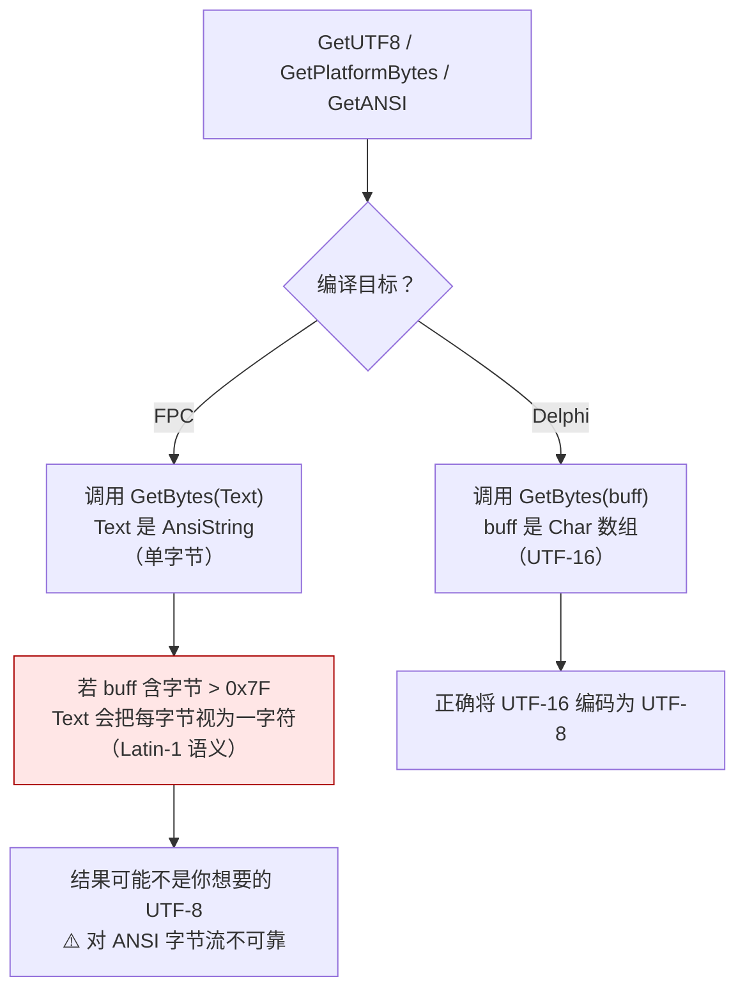

### 2.2 方法：位置/比较/查找

```pascal
function Same(const p: PPascalString): Boolean; overload;
function Same(const t: TPascalString): Boolean; overload;
function Same(const t1, t2: TPascalString): Boolean; overload;
// ... 直到 t1..t9
function Same(const IgnoreCase: Boolean; const t: TPascalString): Boolean; overload;

function ComparePos(const Offset: Integer; const p: PPascalString): Boolean; overload;
function ComparePos(const Offset: Integer; const t: TPascalString): Boolean; overload;
function ComparePos(const Offset: Integer; const p: PPascalString; IgnoreCase: Boolean): Boolean; overload;
function ComparePos(const Offset: Integer; const t: TPascalString; IgnoreCase: Boolean): Boolean; overload;

function GetPos(const s: TPascalString; const Offset: Integer = 1): Integer; overload;
function GetPos(const s: PPascalString;  const Offset: Integer = 1): Integer; overload;

function Exists(c: SystemChar): Boolean; overload;
function Exists(c: array of SystemChar): Boolean; overload;
function StrExists(const s: TPascalString): Boolean;
function GetCharCount(c: SystemChar): Integer;
function IsVisibledASCII: Boolean;

function hash: THash;
function Hash64: THash64;
```

**语义要点**：

- **`Same`**：大小写**不敏感**（仅对 ASCII A-Z 折叠）。`Same(p)` 若 `p = nil` 会崩。
- **`ComparePos(Offset, ...)`**：在 `Offset`（1 基）处与子串比较。`Same` 是"整串相等"，`ComparePos` 是"从某位置开始相等"。
- **`GetPos(s, Offset=1)`**：返回 1 基位置，找不到返回 0。`s.Len = 0` 时直接返回 0。
- **`Exists(c)`**：单字符或数组存在性，O(n)。
- **`IsVisibledASCII`**：所有字符都 `cVisibled` 时返回 True；**空串返回 True**（空循环）。
- **`hash` / `Hash64`**：ASCII 字母大小写不敏感。算法：`((Result shl 7) or (Result shr 25)) + THash(c)`，初始值基于 `Len mod 2` 做 `FillPtr`。

### 2.3 方法：修改

```pascal
procedure SwapInstance(var source: TPascalString);   // O(1)
function  Copy(index, Count: NativeInt): TPascalString;
procedure DeleteLast;
procedure DeleteFirst;
procedure Delete(idx, cnt: Integer);
procedure Clear;
procedure Reset;                    // 等价 Clear
procedure Append(t: TPascalString); overload;
procedure Append(c: SystemChar); overload;
procedure Append(const Fmt: SystemString; const Args: array of const); overload;
function  GetString(bPos, ePos: NativeInt): TPascalString;
procedure Insert(Text_: SystemString; idx: Integer);
procedure FastAsText(var output: SystemString);
procedure FastGetBytes(var output: TBytes);
function  LowerText: SystemString;
function  UpperText: SystemString;
function  Invert: TPascalString;
function  TrimChar(const Chars: TPascalString): TPascalString;
function  TrimLeftChar(const Chars: TPascalString): TPascalString;
function  TrimRightChar(const Chars: TPascalString): TPascalString;
function  DeleteChar(const Chars: TPascalString): TPascalString; overload;
function  DeleteChar(const Chars: TOrdChars): TPascalString; overload;
function  ReplaceChar(const Chars: TPascalString; const newChar: SystemChar): TPascalString; overload;
function  ReplaceChar(const Chars, newChar: SystemChar): TPascalString; overload;
function  ReplaceChar(const Chars: TOrdChars; const newChar: SystemChar): TPascalString; overload;
```

**关键语义**：

| 方法 | 契约 |
|------|------|
| `SwapInstance` | 交换 `buff` 指针，不拷贝。O(1)。 |
| `Copy(index, Count)` | `index` 是 1 基。若 `(index-1)+Count > Len`，`Count` 自动截断。`index <= 0` 未定义。 |
| `DeleteLast` | 仅 `SetLength(buff, Len-1)`。空串无操作。 |
| `DeleteFirst` | `buff := System.Copy(buff, 1, Len)`，**整段拷贝**。空串无操作。 |
| `Delete(idx, cnt)` | 内部 `Text := GetString(1, idx) + GetString(idx+cnt, Len+1)`。`idx+cnt > Len` 时只保留前 `idx` 字符。 |
| `Clear` / `Reset` | `SetLength(buff, 0)`，**保留容量**。 |
| `Append(t)` | 追加 `t.buff`，O(t.Len)。 |
| `Append(c)` | 逐字符追加，O(1) 均摊。 |
| `Append(Fmt, Args)` | 调 `PFormat`（吞异常）。 |
| `GetString(bPos, ePos)` | 半开区间 `[bPos, ePos-1]`。若 `ePos > Len`，截断到 `Len`。 |
| `Insert(Text_, idx)` | `Text := GetString(1, idx) + Text_ + GetString(idx+1, Len)`。**整段重建**，O(n)。 |
| `FastAsText(var output)` | 与 `output := Text` 等价，但直接 `SetLength + CopyPtr`。 |
| `FastGetBytes(var output)` | 与 `UTF8` 属性等价，但直接写 `output`。 |
| `LowerText` / `UpperText` | 用 `SysUtils.LowerCase` / `UpperCase`，**返回新字符串，不修改自身**。 |
| `Invert` | 返回反序副本，**不修改自身**。 |
| `TrimChar` / `TrimLeftChar` / `TrimRightChar` | 返回新字符串，参数是"要去掉的字符集合"（不只是空白）。 |
| `DeleteChar(Chars)` | 返回新字符串，**删除所有出现在 `Chars` 中的字符**。 |
| `ReplaceChar(...)` | 返回新字符串，**替换所有匹配的字符**为 `newChar`。 |

### 2.4 方法：C 风格指针

```pascal
// ANSI
function BuildAnsiChar(var siz: Integer): Pointer;
function BuildAnsiChar: Pointer;
procedure ReadAnsiChar(p: Pointer; MaxSiz: NativeInt);
procedure ReadAnsiChar(p: Pointer);
class function ReadAnsiCharTo(p: Pointer; MaxSiz: NativeInt): TPascalString;
class function ReadAnsiCharTo(p: Pointer): TPascalString;
class function AllocAnsiChar(size_: NativeInt): Pointer;
class procedure FreeAnsiChar(p: Pointer);

// WideChar (UTF-16)
function BuildWideChar(var siz: Integer): Pointer;
function BuildWideChar: Pointer;
procedure ReadWideChar(p: Pointer; MaxSiz: NativeInt);
procedure ReadWideChar(p: Pointer);
class function ReadWideCharTo(p: Pointer; MaxSiz: NativeInt): TPascalString;
class function ReadWideCharTo(p: Pointer): TPascalString;
class function AllocWideChar(size_: NativeInt): Pointer;
class procedure FreeWideChar(p: Pointer);

// UTF-8
function BuildUTF8AnsiChar(var siz: Integer): Pointer;
function BuildUTF8AnsiChar: Pointer;
procedure ReadUTF8AnsiChar(p: Pointer; MaxSiz: NativeInt);
procedure ReadUTF8AnsiChar(p: Pointer);
class function ReadUTF8AnsiCharTo(p: Pointer; MaxSiz: NativeInt): TPascalString;
class function ReadUTF8AnsiCharTo(p: Pointer): TPascalString;
class function AllocUTF8AnsiChar(size_: NativeInt): Pointer;
class procedure FreeUTF8AnsiChar(p: Pointer);
```

**契约**：

| 方法 | 谁分配 | 谁释放 | 备注 |
|------|--------|--------|------|
| `BuildXxxChar` | 自身（`GetMemory`） | **调用者** `FreeMemory` | 分配 `DeltaStep(len+1, 16)` 或 `* 2` 字节 |
| `AllocXxxChar` | 自身（`GetMemory`） | **调用者** `FreeMemory` | 零填充 |
| `FreeXxxChar` | — | 自身 | 等价 `FreeMemory(p)` |
| `ReadXxxChar` | 无分配 | — | 从 `p` 读入自身 |
| `ReadXxxCharTo` | 无分配 | — | 返回新 `TPascalString` |

**注意事项**：
- **`BuildXxxChar` 返回的内存是 `DeltaStep(..., 16)` 对齐的**，实际大小可能大于 `siz`。
- **`ReadAnsiChar` / `ReadUTF8AnsiChar` 在 FPC 下等价**（都是单字节），但 `ReadUTF8AnsiChar` 会把结果送进 `UTF8` 属性（走 `TEncoding.UTF8` 解码），而 `ReadAnsiChar` 送进 `ANSI`（走 `TEncoding.ANSI`）。
- **`ReadWideChar` 假定 `p` 指向 UTF-16（2 字节对齐）**。

### 2.5 方法：随机与相似度

```pascal
class function RandomString(rnd: TRandom; L_: Integer): TPascalString; overload;
class function RandomString(L_: Integer): TPascalString; overload;
class function RandomString(rnd: TRandom; L_: Integer; Chars_: TOrdChars): TPascalString; overload;
class function RandomString(L_: Integer; Chars_: TOrdChars): TPascalString; overload;

function SmithWaterman(const p: PPascalString): Double; overload;
function SmithWaterman(const s: TPascalString): Double; overload;

function BOMBytes: TBytes;
```

**`RandomString` 契约**：
- 内部调用 `rnd.Rand32($7E - $20) + $20` → 范围为 `[$20, $7E - 1]` = `[$20, $7D]`。
- **⚠️ 不会生成 `0x7E` (`~`)**（因为 `Rand32(N)` 返回 `[0, N-1]`）。
- 传入 `Chars_: TOrdChars` 时，循环 `repeat ... until CharIn(tmp, Chars_)`——**若不满足分类的字符太多，可能长时间循环**。
- **无 `rnd` 参数的重载每次调用都 `TMT19937Random.Create` 并 `DisposeObject`**，性能较差。

**`BOMBytes` 契约**：
- Delphi 下：返回 `UTF-8 BOM (EF BB BF) + UTF-8 bytes`。
- FPC 下：`GetPreamble` 可能返回空，此时结果等价于 `UTF8`。

---

## 第 3 章 `TUPascalString` 精确 API

**`TUPascalString` 与 `TPascalString` 的 API 完全镜像**，仅类型名和部分算法有细微差异。以下只列差异点，未列出的部分请直接参考 `TPascalString` 章节。

### 3.1 类型别名与索引常量

```pascal
// Z.UPascalStrings
{$IFDEF FPC}
  USystemChar   = UnicodeChar;    // 2 字节
  USystemString = UnicodeString;
  TUArrayChar   = array of USystemChar;
{$ELSE}
  USystemChar   = Z.PascalStrings.SystemChar;   // = Char
  USystemString = Z.PascalStrings.SystemString; // = string
  TUArrayChar   = Z.PascalStrings.TArrayChar;
{$ENDIF}

const
{$IFDEF FirstCharInZero}
  UFirstCharPos = 0;   // FPC
{$ELSE}
  UFirstCharPos = 1;   // Delphi
{$ENDIF}
```

### 3.2 与 `TPascalString` 的 API 映射

| `TPascalString` | `TUPascalString` |
|-----------------|------------------|
| `SystemChar` | `USystemChar` |
| `SystemString` | `USystemString` |
| `TArrayChar` | `TUArrayChar` |
| `PPascalString` | `PUPascalString` |
| `TOrdChar(s)` | `TUOrdChar(s)` |
| `CharIn` | `UCharIn` |
| `TextIs` | `TextIs`（同名，参数是 `TUPascalString`） |
| `FastHashSystemString` | `UFastHashSystemString` |
| `FastHash64SystemString` | `UFastHash64SystemString` |
| `FastHashPPascalString` | `UFastHashPPascalString` |
| `FastHash64PPascalString` | `UFastHash64PPascalString` |
| `PFormat` | `UFormat` |
| `SmithWatermanCompare` | `USmithWatermanCompare` |
| `SmithWatermanCompareLongString` | `USmithWatermanCompareLongString` |
| `MaxSmithWatermanMatrix` | `UMaxSmithWatermanMatrix` |
| `SystemCharSize` | `USystemCharSize` |

### 3.3 Delphi 下新增的跨类型转换

```pascal
class operator TUPascalString.Implicit(Value: TPascalString): TUPascalString;
class operator TUPascalString.Explicit(Value: TUPascalString): TPascalString;
```

**语义**：通过 `Bytes`（UTF-8）互转。
- `TPascalString → TUPascalString`：取 `Value.Bytes`（UTF-8 字节），赋给 `Result.Bytes`（走 UTF-8 解码）。
- `TUPascalString → TPascalString`：取 `Value.Bytes`，赋给 `Result.Bytes`。

**⚠️ 注意**：如果 `TPascalString` 里存的是非 UTF-8 字节（如 Latin-1），转换会乱码。

### 3.4 FPC 下新增的跨类型转换

```pascal
operator := (const c: TPascalString)r: TUPascalString;
operator := (const s: TUPascalString)r: TPascalString;
```

语义同上。

### 3.5 `GetUTF8` / `GetPlatformBytes` / `GetANSI` 在 UPascalStrings 下的一致性

**与 `Z.PascalStrings` 不同**：`Z.UPascalStrings` 的 FPC 与 Delphi 分支**都调用 `GetBytes(buff)`**（`buff` 是 `USystemChar` 数组，即 UTF-16）。

```pascal
function TUPascalString.GetUTF8: TBytes;
begin
  ...
{$IFDEF FPC}
  Result := SysUtils.TEncoding.UTF8.GetBytes(buff);
{$ELSE}
  Result := SysUtils.TEncoding.UTF8.GetBytes(buff);
{$ENDIF}
end;
```

**所以 `TUPascalString` 在 FPC 下的 UTF-8 编码是正确的**，而 `TPascalString` 在 FPC 下不可靠。

---

## 第 4 章 运算符重载

### 4.1 Delphi 版本

```pascal
// 比较
class operator Equal(Lhs, Rhs: TPascalString): Boolean;
class operator NotEqual(Lhs, Rhs: TPascalString): Boolean;
class operator GreaterThan(Lhs, Rhs: TPascalString): Boolean;
class operator GreaterThanOrEqual(Lhs, Rhs: TPascalString): Boolean;
class operator LessThan(Lhs, Rhs: TPascalString): Boolean;
class operator LessThanOrEqual(Lhs, Rhs: TPascalString): Boolean;

// 拼接
class operator Add(Lhs, Rhs: TPascalString): TPascalString;
class operator Add(Lhs: SystemString; Rhs: TPascalString): TPascalString;
class operator Add(Lhs: TPascalString; Rhs: SystemString): TPascalString;
class operator Add(Lhs: SystemChar; Rhs: TPascalString): TPascalString;
class operator Add(Lhs: TPascalString; Rhs: SystemChar): TPascalString;

// 隐式/显式转换
class operator Implicit(Value: RawByteString): TPascalString;
class operator Implicit(Value: SystemString): TPascalString;
class operator Implicit(Value: SystemChar): TPascalString;
class operator Implicit(Value: TPascalString): SystemString;
class operator Implicit(Value: TPascalString): Variant;

class operator Explicit(Value: TPascalString): RawByteString;
class operator Explicit(Value: TPascalString): SystemString;
class operator Explicit(Value: SystemString): TPascalString;
class operator Explicit(Value: SystemChar): TPascalString;
class operator Explicit(Value: TPascalString): Variant;
```

### 4.2 FPC 版本（运算符函数形式）

```pascal
operator := (const s: Variant)r: TPascalString;
operator := (const s: AnsiString)r: TPascalString;
operator := (const s: RawByteString)r: TPascalString;
operator := (const s: UnicodeString)r: TPascalString;
operator := (const s: WideString)r: TPascalString;
operator := (const s: ShortString)r: TPascalString;
operator := (const c: SystemChar)r: TPascalString;

operator := (const s: TPascalString)r: AnsiString;
operator := (const s: TPascalString)r: RawByteString;
operator := (const s: TPascalString)r: UnicodeString;
operator := (const s: TPascalString)r: WideString;
operator := (const s: TPascalString)r: ShortString;
operator := (const s: TPascalString)r: Variant;

operator = (const a, b: TPascalString): Boolean;
operator <> (const a, b: TPascalString): Boolean;
operator > (const a, b: TPascalString): Boolean;
operator >= (const a, b: TPascalString): Boolean;
operator < (const a, b: TPascalString): Boolean;
operator <= (const a, b: TPascalString): Boolean;

operator + (const a: TPascalString; const b: TPascalString): TPascalString;
operator + (const a: TPascalString; const b: SystemString): TPascalString;
operator + (const a: SystemString; const b: TPascalString): TPascalString;
operator + (const a: TPascalString; const b: SystemChar): TPascalString;
operator + (const a: SystemChar; const b: TPascalString): TPascalString;
```

### 4.3 语义细节

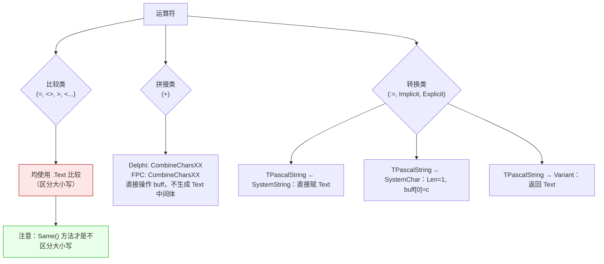

**关键陷阱**：

- **`=` 运算符是区分大小写的**。`Same('HELLO')` 才是不区分大小写。
- **`TPascalString + SystemString` 与 `SystemString + TPascalString` 都返回 `TPascalString`**，不返回 `SystemString`。
- **FPC 下 `TPascalString + RawByteString` 会走 `AnsiString` 转换**——`RawByteString` 会被当作 `AnsiString`。
- **`TPascalString + TPascalString` 在 FPC 下调用 `CombineCharsPP(a.buff, b.buff, Result.buff)`**——直接操作缓冲，不生成临时 `Text`。
- **`SystemChar` 与 `SystemString` 在 FPC 下都是 1 字节**，所以 `'a' + s` 与 `s + 'a'` 都没问题。

---

## 第 5 章 全局函数

### 5.1 `CharIn` / `UCharIn` 重载族

```pascal
// TPascalString
function CharIn(c: SystemChar; const SomeChars: array of SystemChar): Boolean; overload;
function CharIn(c: SystemChar; const SomeChar: SystemChar): Boolean; overload;
function CharIn(c: SystemChar; const s: TPascalString): Boolean; overload;
function CharIn(c: SystemChar; const p: PPascalString): Boolean; overload;
function CharIn(c: SystemChar; const SomeCharset: TOrdChar): Boolean; overload;
function CharIn(c: SystemChar; const SomeCharsets: TOrdChars): Boolean; overload;
function CharIn(c: SystemChar; const SomeCharsets: TOrdChars; const SomeChars: TPascalString): Boolean; overload;
function CharIn(c: SystemChar; const SomeCharsets: TOrdChars; const p: PPascalString): Boolean; overload;

// TUPascalString（同名 UCharIn）
function UCharIn(c: USystemChar; const SomeChars: array of USystemChar): Boolean; overload;
// ... 同理
```

**语义**：
- `SomeCharsets` 是集合，`for i in SomeCharsets` 遍历每个分类，**任一命中即返回 True**。
- **`SomeCharset: TOrdChar`（单数）是单类判定**，不要与集合混用。
- **`TextIs(t, SomeCharsets)`**：遍历 `t.buff` 的每个字符，**所有字符都满足**才返回 True。空串返回 True。

### 5.2 哈希函数

```pascal
function FastHashSystemString(const s: SystemString): THash;
function FastHash64SystemString(const s: SystemString): THash64;
function FastHashPPascalString(const s: PPascalString): THash;
function FastHash64PPascalString(const s: PPascalString): THash64;

// UPascalStrings 对应
function UFastHashSystemString(const s: USystemString): THash;
// ...
```

**算法**（`FastHashSystemString`）：
```pascal
FillPtr(@Result, SizeOf(THash), length(s) mod 2);
for i := (FirstCharInZero ? 0 : 1) to length(s):
  c := s[i];
  if CharIn(c, cHiAtoZ): inc(c, 32);   // 折叠大写为小写
  Result := ((Result shl 7) or (Result shr 25)) + THash(c);
```

- **初始值 = `length(s) mod 2`**（0 或 1），不是 0。
- **结果对 ASCII 大小写不敏感**，对非 ASCII 敏感。
- **不分配内存**，O(n)。

### 5.3 格式化

```pascal
function PFormat(const Fmt: SystemString; const Args: array of const): SystemString;
function UFormat(const Fmt: USystemString; const Args: array of const): USystemString;
```

**契约**：
- **异常安全**：内部 `try...except`，若 `Format` 抛异常，返回 `Fmt`。
- **FPC 下 `UFormat` 使用 `UnicodeFormat`**（兼容 Unicode 格式串）。

### 5.4 全局辅助

```pascal
// TPascalString
const
  SystemCharSize = SizeOf(SystemChar);
var
  MaxSmithWatermanMatrix: NativeInt = (CPU64 ? 10000*10 : 8192);

// TUPascalString
const
  USystemCharSize = SizeOf(USystemChar);
var
  UMaxSmithWatermanMatrix: NativeInt = (CPU64 ? 10000*10 : 8192);
```

**可调参数**：`MaxSmithWatermanMatrix` 是全局变量，可以运行时修改（控制 SW 算法的最大矩阵边长）。

---

## 第 6 章 Smith-Waterman 相似度

### 6.1 算法概述

Smith-Waterman 是局部序列对齐算法，用于字符串相似度评分。本库提供 4 组重载：

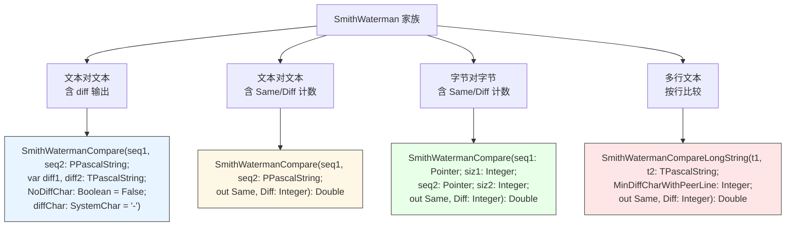

### 6.2 评分参数

```pascal
const
  SmithWaterman_MatchOk = 1;
  mismatch_penalty       = -1;
  gap_penalty            = -1;
```

### 6.3 `SmithWatermanCompare(seq1, seq2: PPascalString; out Same, Diff): Double` 的返回

**返回值**：
- **成功**：`identity / (L_ + i + j)`，其中：
  - `identity` = 对角匹配数
  - `L_` = traceback 路径长度
  - `i, j` = traceback 结束后剩余的未对齐字符数
- **失败**：返回 -1，`Same = 0`，`Diff = L1 + L2`。

**失败条件**：
- `L1 = 0` 或 `L2 = 0`
- `L1 > MaxSmithWatermanMatrix` 或 `L2 > MaxSmithWatermanMatrix`
- `identity = 0`（完全不匹配）

**⚠️ 注意**：`identity = 0` 时返回 -1，**而不是 0**。这对"完全不匹配的两个字符串"会产生误导。调用方需检查返回 -1 时是不是真的出错。

### 6.4 `SmithWatermanCompare` 含 diff 输出的语义

```pascal
function SmithWatermanCompare(seq1, seq2: PPascalString; var diff1, diff2: TPascalString;
  const NoDiffChar: Boolean; const diffChar: SystemChar): Double;
```

- `NoDiffChar = False`：`diff1` / `diff2` 保留原字符（对齐后的形式）。
- `NoDiffChar = True`：`diff1` / `diff2` 用 `diffChar` 替代原始字符（只显示"是否匹配"）。
- `diffChar` 默认 `'-'`。
- 返回值和 `Same/Diff` 版相同（`identity / (L_ + i + j)`）。

### 6.5 矩阵大小与内存

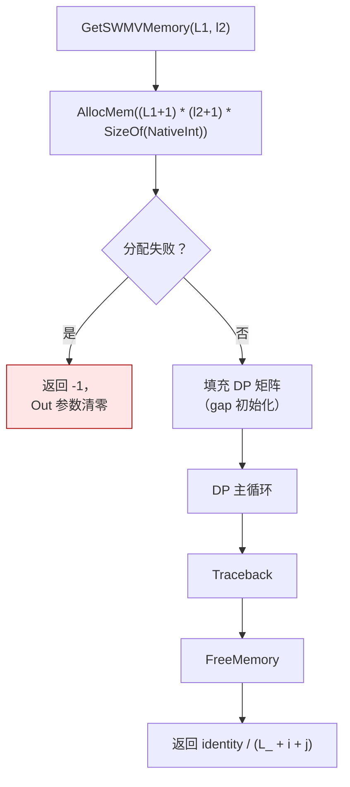

**内存复杂度**：`O(L1 * L2 * SizeOf(NativeInt))`。64 位下 `NativeInt = 8` 字节。
- `MaxSmithWatermanMatrix = 100000` 时，最坏情况 = `100001 * 100001 * 8 = 80 GB`——**会分配失败**。
- **实际使用应限制字符串长度在 10000 以内**（`10000 * 10000 * 8 = 800 MB`，仍然很大）。

### 6.6 长文本（按行）比较

```pascal
function SmithWatermanCompareLongString(const t1, t2: TPascalString;
  const MinDiffCharWithPeerLine: Integer; out Same, Diff: Integer): Double;
```

**算法**：
1. 按行切分（`#13` / `#10` 为分隔符）。
2. 每行去掉 `#32`（空格）和 `#9`（Tab），空行跳过。
3. 对每一对行做 SW 比较：
   - 若相似度 > 0 且 `cDiff < MinDiffCharWithPeerLine`：算匹配。
   - 否则算不匹配。
4. 对所有行做 SW 矩阵 DP。
5. 返回 `TotalSame / (TotalSame + TotalDiff)`。

**默认 `MinDiffCharWithPeerLine = 5`**（无参重载）。

---

## 第 7 章 完整示例

### 7.1 基础字符串操作

```pascal
var
  s, t: TPascalString;
begin
  s := 'Hello, World!';
  s.Chars[8] := 'w';              // 'Hello, world!'
  t := s.Copy(8, 5);              // 'world'
  if t.Same('WORLD') then         // True（不区分大小写）
    s.Append(' [matched]');
  s.Bytes := TEncoding.UTF8.GetBytes('你好');  // 从 UTF-8 设置
end;
```

### 7.2 遍历删除字符

```pascal
var
  s, r: TPascalString;
begin
  s := 'Hello, World!';
  r := s.DeleteChar(' ,!');       // 'HelloWorld'
  r := s.DeleteChar([c0to9, cAtoZ]);  // 删除数字和字母
end;
```

### 7.3 编码转换

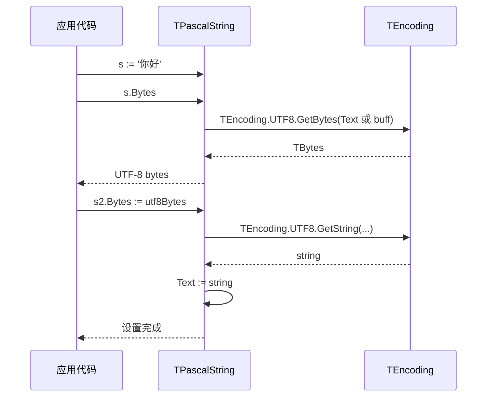

### 7.4 Smith-Waterman 相似度

```pascal
var
  a, b, d1, d2: TPascalString;
  score: Double;
  Same, Diff: Integer;
begin
  a := 'kitten';
  b := 'sitting';
  // 带 diff 输出
  score := SmithWatermanCompare(a, b, d1, d2, False, '-');
  // 只取计数
  score := SmithWatermanCompare(a, b, Same, Diff);
end;
```

### 7.5 与 Z.Core 集成

```pascal
var
  Hash: TBig_Hash_Pair_Pool<TPascalString, Integer>;
begin
  Hash := TBig_Hash_Pair_Pool<TPascalString, Integer>.Create(1024);
  try
    Hash.On_Get_Key := function(const Key_: PPascalString; var Hash_: THash)
      begin
        Hash_ := Key_^.hash;   // 使用 FastHashPPascalString
      end;
    Hash.On_Compare_Key := procedure(const K1, K2: PPascalString; var IsSame: Boolean)
      begin
        IsSame := K1^.Same(K2^);  // 不区分大小写
      end;
    Hash.Add('Hello', 1, True);
    Hash.Add('HELLO', 2, True);   // 会覆盖 1
  finally
    Hash.Free;
  end;
end;
```

**⚠️ 注意**：`TBig_Hash_Pair_Pool` 的默认比较是 `CompareMemory`（逐字节）。用 `TPascalString` 作 Key 时，**必须**重写 `On_Compare_Key` 和 `On_Get_Key`，否则不同字符串会因内存布局不同而比较失败，相同内容的不同对象也会比较失败。

---

## 第 8 章 与 Z.Core 的契约

### 8.1 线程安全

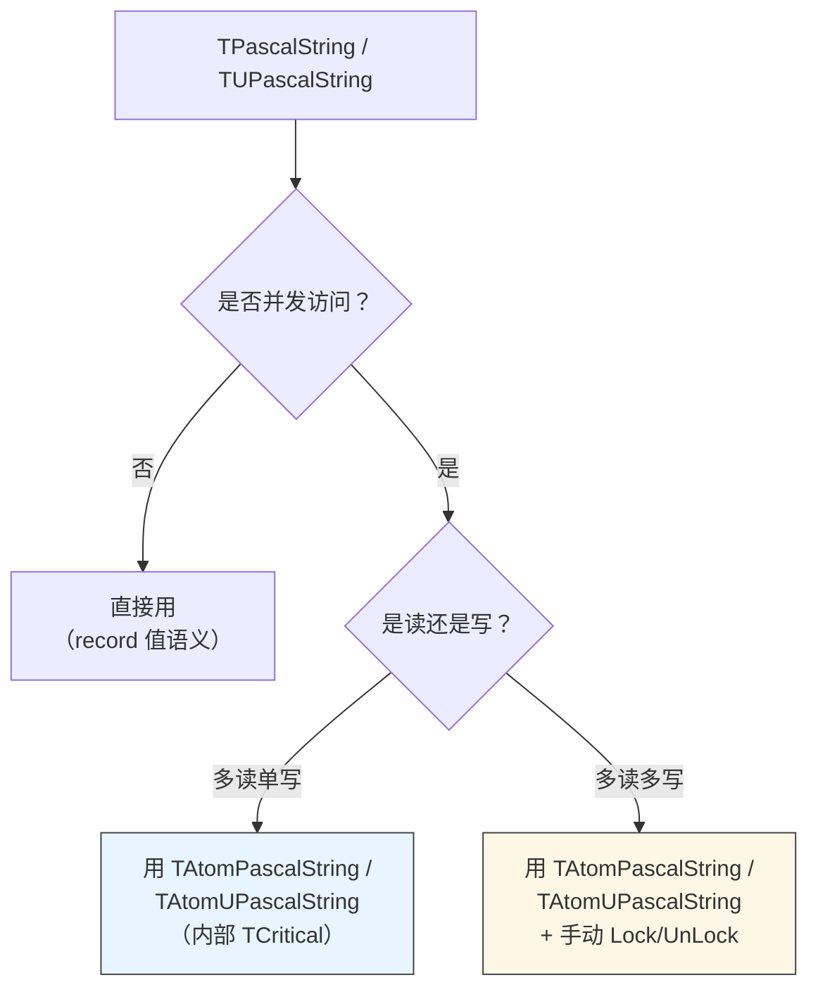

**类型别名**（在 `Z.PascalStrings` / `Z.UPascalStrings` 中定义）：
```pascal
TAtomSystemString   = TAtomVar<SystemString>;
TAtomPascalString   = TAtomVar<TPascalString>;
TAtomUSystemString  = TAtomVar<USystemString>;
TAtomUPascalString  = TAtomVar<TUPascalString>;
```

**⚠️ 注意**：`TAtomVar<TPascalString>` 内部用 `TCritical` 保护，**不是硬件原子**。见 Z.Core 知识库 §3.2。

### 8.2 与 `DisposeObject` 的兼容性

`TPascalString` 是 record，**不需要 `DisposeObject`**。它的 `buff` 是动态数组，由编译器自动管理生命周期。

**但**：`BuildXxxChar` 返回的内存是 `GetMemory` 分配的，**必须**用 `FreeMemory` 释放，**不能**用 `DisposeObject`。

### 8.3 与 `TBigList` 的兼容性

`TPascalString` 可以存入 `TBigList<TPascalString>`（值类型）。

```pascal
var
  L: TBigList<TPascalString>;
  It: TBigList<TPascalString>.TRepeat___;
begin
  L := TBigList<TPascalString>.Create;
  try
    L.Add('Hello');
    L.Add('World');
    // 正确遍历
    if L.Num > 0 then
      with L.Repeat_ do
        repeat
          // Queue^.Data 是 TPascalString
        until not Next;
  finally
    L.Free;
  end;
end;
```

**⚠️ 注意**：`TBigList` 的 `Remove_P` / `Add` 是**值拷贝**，`TPascalString` 的 `buff` 会被复制，可能比原生 `string` 慢（因为 `string` 有引用计数）。

### 8.4 与 `TBig_Hash_Pair_Pool` 的兼容性

见 §7.5。**必须**重写 `On_Compare_Key` 和 `On_Get_Key`。

---

## 第 9 章 反例集

### 9.1 越界访问

```pascal
var
  s: TPascalString;
begin
  s := 'abc';
  // ❌ 错误 1：SetChars 越界不检查
  s.Chars[10] := 'x';           // 崩（buff[9] 越界）

  // ❌ 错误 2：空串 SetFirst / SetLast
  s.Clear;
  s.First := 'x';               // 崩（buff[0] 越界）

  // ✅ 正确：先确保长度
  s.Len := 1;
  s.First := 'x';
end;
```

### 9.2 编码陷阱

```pascal
var
  s: TPascalString;
  b: TBytes;
begin
  // ❌ 错误：FPC 下用 ANSI 属性处理非 ASCII 字节
  b := [$C4, $E3];              // 这是 GBK "你"
  s.ANSI := b;                  // FPC 下会把每字节当 Latin-1 字符
  // s 现在是两个字符 'Äã'，而不是 '你'

  // ✅ 正确：用 TUPascalString
  var u: TUPascalString;
  u := TUPascalString.Create;   // 实际是 record，无 Create
  u.Bytes := [$E4, $BD, $A0];   // UTF-8 "你"
end;
```

### 9.3 哈希表 Key 陷阱

```pascal
var
  H: TBig_Hash_Pair_Pool<TPascalString, Integer>;
begin
  H := TBig_Hash_Pair_Pool<TPascalString, Integer>.Create(16);
  // ❌ 错误：不重写 On_Compare_Key
  H.Add('Hello', 1, False);
  H.Add('HELLO', 2, False);
  // 'Hello' 和 'HELLO' 的内存布局不同，会被当作不同 Key
  // 但用户期望不区分大小写 → 结果错误

  // ✅ 正确：重写 On_Get_Key 和 On_Compare_Key
  H.On_Get_Key := ...;
  H.On_Compare_Key := ...;
end;
```

### 9.4 Smith-Waterman 内存耗尽

```pascal
var
  a, b: TPascalString;
  score: Double;
begin
  SetLength(a.buff, 50000);
  SetLength(b.buff, 50000);
  // ❌ 错误：50000 * 50000 * 8 = 20 GB，分配失败
  score := SmithWatermanCompare(a, b);  // 返回 -1
end;
```

**规避**：
- 预先检查长度：`if (a.Len > 10000) or (b.Len > 10000) then 用其他方法`。
- 修改 `MaxSmithWatermanMatrix` 为更小值。

### 9.5 `Delete(idx, cnt)` 的边界

```pascal
var
  s: TPascalString;
begin
  s := 'abcdef';
  s.Delete(3, 100);             // idx+cnt = 103 > Len=6
  // 实际行为：Text := GetString(1, 3)  →  s = 'ab'
  // 注意：会丢掉 idx+cnt 之外的部分，而不是 "尽量删"
end;
```

### 9.6 `Append` 性能陷阱

```pascal
// ❌ 错误：循环 Append 单字符会多次 SetLength
var
  s: TPascalString;
  i: Integer;
begin
  for i := 1 to 10000 do
    s.Append('a');              // 10000 次 SetLength，可能有 O(n²) 隐患
end;

// ✅ 正确：预分配长度，直接写 buff
var
  s: TPascalString;
  i: Integer;
begin
  s.Len := 10000;
  for i := 1 to 10000 do
    s.Chars[i] := 'a';
end;
```

### 9.7 `RandomString` 范围

```pascal
// 不会生成 '~'（0x7E）
s := TPascalString.RandomString(10);   // 字符范围 [0x20, 0x7D]
```

### 9.8 运算符与 `Same` 的语义差异

```pascal
var
  a, b: TPascalString;
begin
  a := 'Hello';
  b := 'HELLO';
  if a = b then           // ❌ False（区分大小写）
    ...;
  if a.Same(b) then       // ✅ True（不区分大小写）
    ...;
end;
```

### 9.9 `TUPascalString.TrimLeftChar` / `TrimRightChar` 的潜在类型不匹配

`Z.UPascalStrings` 源码中：

```pascal
function TUPascalString.TrimLeftChar(const Chars: TUPascalString): TUPascalString;
begin
  ...
  while (bp <= L_) and CharIn(GetChars(bp), @Chars) do   // ⚠️ 调用 CharIn 而不是 UCharIn
    inc(bp);
  ...
end;
```

`CharIn` 的第一个参数是 `SystemChar`，而 `GetChars(bp)` 返回 `USystemChar`。在 Delphi 下 `SystemChar = USystemChar = Char` 所以无差异；**在 FPC 下 `SystemChar = AnsiChar`、`USystemChar = UnicodeChar`，可能有隐式转换问题**。

**建议**：对含中文的字符串不要依赖 `TrimLeftChar` / `TrimRightChar`，改用 `DeleteChar` 或手动遍历。

---

## 第 10 章 常见错误对照表

| 现象 | 根因 | 修正 |
|------|------|------|
| `s.Chars[10] := 'x'` 崩溃 | `SetChars` 不做边界检查 | 先 `s.Len := 10` |
| `s.First := 'x'` 空串崩溃 | `SetFirst` 直接写 `buff[0]` | 先 `s.Len := 1` |
| FPC 下 `s.Bytes` 乱码 | `GetUTF8` 用 `Text`（单字节）当 UTF-8 | 用 `TUPascalString` |
| 哈希表 `TPascalString` Key 找不到 | 未重写 `On_Compare_Key` | 重写 `On_Get_Key` 和 `On_Compare_Key` |
| Smith-Waterman 返回 -1 | 字符串太长或为空 | 检查长度 ≤ 10000 |
| `a = b` 却 False | 运算符区分大小写 | 用 `a.Same(b)` |
| `TrimChar` 没去掉空白 | 参数是"字符集合"不是空白定义 | 传 `TPascalString(' '#9#13#10)` |
| `DeleteChar(cAtoZ)` 没删中文 | ASCII 分类不影响非 ASCII | 用 `cVisibled` 或 `cDoubleChar` |
| `RandomString` 没生成 `~` | `Rand32(N)` 返回 `[0, N-1]` | 自己扩展范围 |
| `Insert` 后位置错乱 | `Insert` 是"插在 idx 之前" | 仔细核对 1 基语义 |
| 内存泄漏 | `BuildAnsiChar` 忘记 `FreeAnsiChar` | 配对使用 |
| 多线程访问崩溃 | 未用 `TAtomPascalString` | 用原子包装 |
| `TBigList` 里存 `TPascalString` 慢 | 每次 Add 值拷贝 buff | 考虑存指针 |

---

## 第 11 章 诚实的不确定清单

> 以下是我从源码**无法完全确定**的点。若 AI 需要在这些场景下工作，**必须回查源码或询问人类**。

1. **`SetChars(index <= 0)` 的行为**
   - 源码：`buff[index - 1] := Value;` 直接执行。
   - `index = 0` 时 `buff[-1]` 越界；`index < 0` 时 `buff[-2]` 等。
   - **推测**：会崩或未定义。**不要在 `index <= 0` 时调用**。

2. **`Copy(index <= 0, ...)` 的行为**
   - 源码：`if (index - 1) + Count > L_ then Count := L_ - (index - 1);`
   - `index = 0` 时 `Count := L_ + 1`（可能超过 `L_`），后续 `CopyPtr(@buff[index-1], ...)` 从 `@buff[-1]` 拷。
   - **推测**：未定义。**不要在 `index <= 0` 时调用**。

3. **`TPascalString` 的 `Bytes` 在 FPC 下的编码语义**
   - 源码：`Result := SysUtils.TEncoding.UTF8.GetBytes(Text);` 其中 `Text` 是 `AnsiString`。
   - FPC 的 `TEncoding.UTF8.GetBytes(AnsiString)` 究竟是把每个字节当作 Latin-1 重新编码，还是直接返回字节？
   - **推测**：可能重编码，对 `> 0x7F` 的字节会变化。**不要依赖**。

4. **`TUPascalString.TrimLeftChar` / `TrimRightChar` 中的 `CharIn` 调用**
   - 源码调 `CharIn` 而不是 `UCharIn`。
   - FPC 下 `CharIn` 参数是 `SystemChar = AnsiChar`，传入 `USystemChar = UnicodeChar` 可能隐式转换丢失高位。
   - **建议**：避免用这两个方法处理含非 ASCII 的字符串。

5. **`SmithWatermanCompare` 返回 -1 与"完全不匹配"的区分**
   - 源码在 `identity = 0` 时返回 -1。
   - 但 `identity = 0` 也可能意味着真的不匹配。
   - **无法区分**：调用方需自行处理。

6. **`MaxSmithWatermanMatrix` 是全局变量**
   - 可以运行时修改，但**非线程安全**。
   - **不确定**：是否所有 SW 实现都读同一个变量。答案：是（同一全局）。

7. **`Append(Fmt, Args)` 使用 `PFormat` 吞异常**
   - `PFormat` 在 `Format` 抛异常时返回 `Fmt` 原样。
   - **不确定**：用户是否希望看到异常。

8. **`TUPascalString` 的 `GetUTF8` 在 FPC 与 Delphi 下实现相同**
   - 源码两分支都调 `GetBytes(buff)`。
   - **已确认**：正确。

9. **`TUPascalString.Implicit(TPascalString)` 的转换语义**
   - 源码：`Result.Bytes := Value.Bytes;`
   - 这意味着 `TPascalString` 的内容被当作 UTF-8 字节处理。
   - **不确定**：如果原 `TPascalString` 存的是非 UTF-8 字节，转换会失败还是乱码。**推测**：乱码。

10. **`operator +` 在 FPC 下的临时对象生命周期**
    - `CombineCharsPP(a.buff, b.buff, Result.buff)` 直接操作结果缓冲。
    - **不确定**：在复杂表达式（如 `a + b + c`）中的临时对象何时析构，是否会影响结果。**推测**：正常。

11. **`BOMBytes` 在 FPC 下 `GetPreamble` 的行为**
    - FPC 的 `TEncoding.UTF8.GetPreamble` 可能返回空数组。
    - **不确定**：是否所有 FPC 版本都返回 UTF-8 BOM。**建议**：手动拼 BOM。

12. **`TOrdChar` / `TUOrdChar` 的编译期大小**
    - `TOrdChars = set of TOrdChar`。
    - **不确定**：`TOrdChars` 是 1 字节、2 字节还是 4 字节？**推测**：由编译器决定（集合基类型的字节数）。

13. **`TPascalString` 的 `hash` 在跨平台的一致性**
    - 算法相同，但 `SystemChar` 在 FPC 下是 1 字节，Delphi 下是 2 字节。
    - **不确定**：同一个 `'abc'` 在 FPC 和 Delphi 下 `hash` 值是否相同。**推测**：**不同**（因为 `Ord('a')` 是相同的，但循环方式可能不同）。

14. **`TextIs` 的空串返回值**
    - 源码：`Result := False; for c in buff do if not ... then Exit; Result := True;`
    - 空串时循环不执行，`Result := True`。
    - **已确认**：空串返回 True。

15. **`TBig_Hash_Pair_Pool` 存储 `TPascalString` Key 的性能**
    - 每次 `Add` 会值拷贝 `TPascalString`（含 `buff` 动态数组）。
    - **不确定**：是否值得为性能改用 `PPascalString` 指针。**建议**：测试后决定。

---

## 第 12 章 快速决策树

### 12.1 选类型

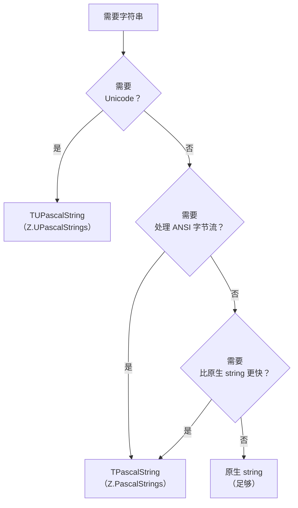

### 12.2 选编码属性

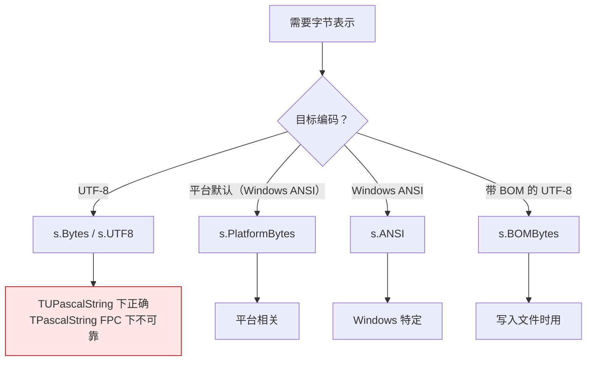

### 12.3 选 C 风格指针方法

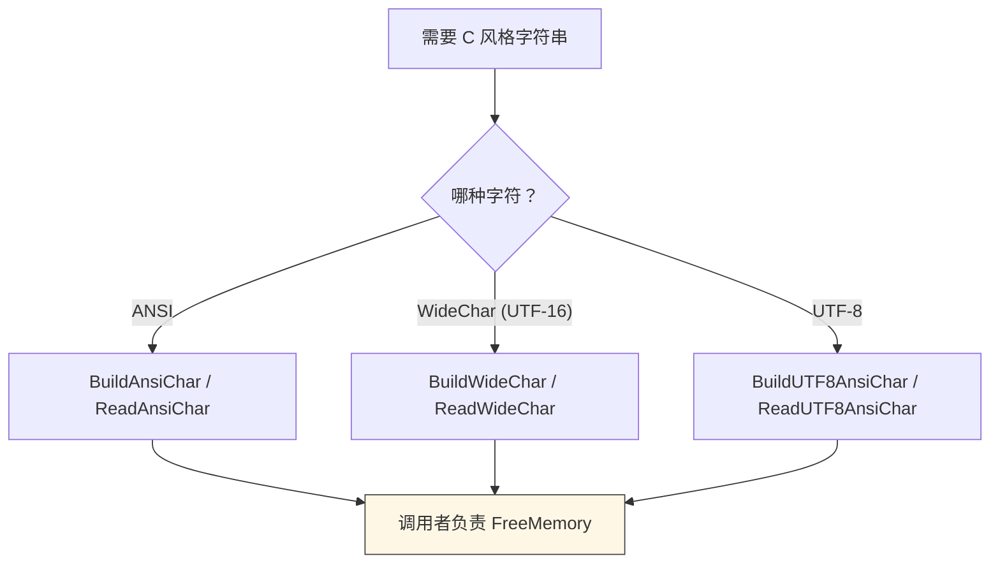

### 12.4 字符串比较

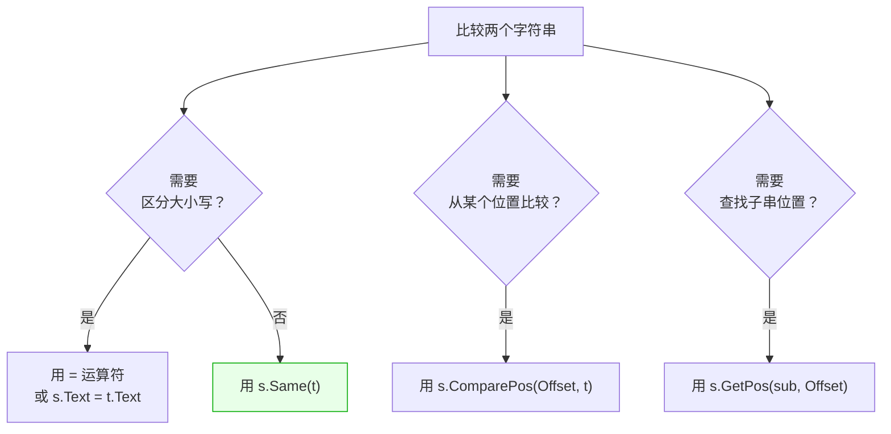

---

## 第 13 章 结语

### 13.1 本知识库覆盖范围

- **已精确描述**：
  - `TPascalString` / `TUPascalString` 的所有公开 API。
  - 编码属性的读写行为（含 FPC/Delphi 差异）。
  - 运算符重载的语义（Delphi / FPC）。
  - Smith-Waterman 家族的 4 组重载及其返回值语义。
  - 与 Z.Core 的集成契约。
  - 常见陷阱与反例。

- **已纠正的常见幻觉**：
  - **`Chars[i]` 是 1 基**，不是 0 基。
  - **`buff` 是 0 基**，可以直接访问。
  - **`=` 运算符区分大小写**，`Same` 才不区分。
  - **`TPascalString` 在 FPC 下不处理 UTF-8**。
  - **`TrimChar` 参数是"字符集合"**，不只是空白。
  - **`SmithWatermanCompare` 完全失败时返回 -1**，可能被误认为"完全不匹配"。
  - **`TBig_Hash_Pair_Pool` 用 `TPascalString` Key 时必须重写 `On_Compare_Key`**。

- **未覆盖**：
  - 源码中的潜在 bug（见不确定清单）。
  - 除 `Z.PascalStrings` 和 `Z.UPascalStrings` 之外的库。
  - Smith-Waterman 算法本身的数学性质。

### 13.2 给 AI 的使用规则

1. **索引一致性**：`buff` 0 基，`Chars` 1 基，`FirstCharPos` 因编译器而异。
2. **编码明确**：需要 UTF-8 时用 `TUPascalString`；`TPascalString` 只适合字节流。
3. **比较明确**：需要不区分大小写时用 `Same`，不要用 `=`。
4. **边界检查**：`SetChars` / `SetFirst` / `SetLast` 不检查，调用前确保 `Len` 足够。
5. **SW 限制**：字符串长度 ≤ 10000，否则内存爆。
6. **指针成对**：`BuildXxxChar` / `AllocXxxChar` 与 `FreeXxxChar` 配对。
7. **哈希 Key**：`TBig_Hash_Pair_Pool` 用字符串 Key 时**必须**重写 `On_Compare_Key`。
8. **不确定就问**：遇到不确定清单里的场景，回查源码或询问人类。

### 13.3 与 Z.Core 知识库的衔接

- **类型依赖**：`TCore_Stream` / `TCore_Object` / `TRandom` / `TAtomVar<T>` 来自 Z.Core。
- **内存依赖**：`CopyPtr` / `FillPtr` / `DeltaStep` / `GetMemory` / `FreeMemory` 来自 Z.Core。
- **哈希依赖**：`THash` / `THash64` 类型来自 Z.Core。
- **容器依赖**：`TBigList` / `TBig_Hash_Pair_Pool` 来自 Z.Core。

**使用这两个库前，请先阅读 Z.Core 知识库第 1、2 章。**

---

**本知识库的定位**：一份**准确的、有边界的、可操作的** `Z.PascalStrings` / `Z.UPascalStrings` 参考。它不假装能替代源码，但能让你在 90% 的场景下正确使用，并在剩下 10% 的场景下知道该停下来问人。