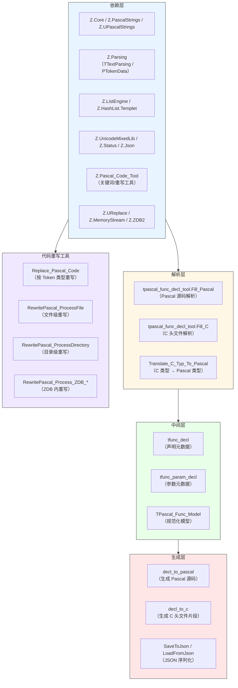
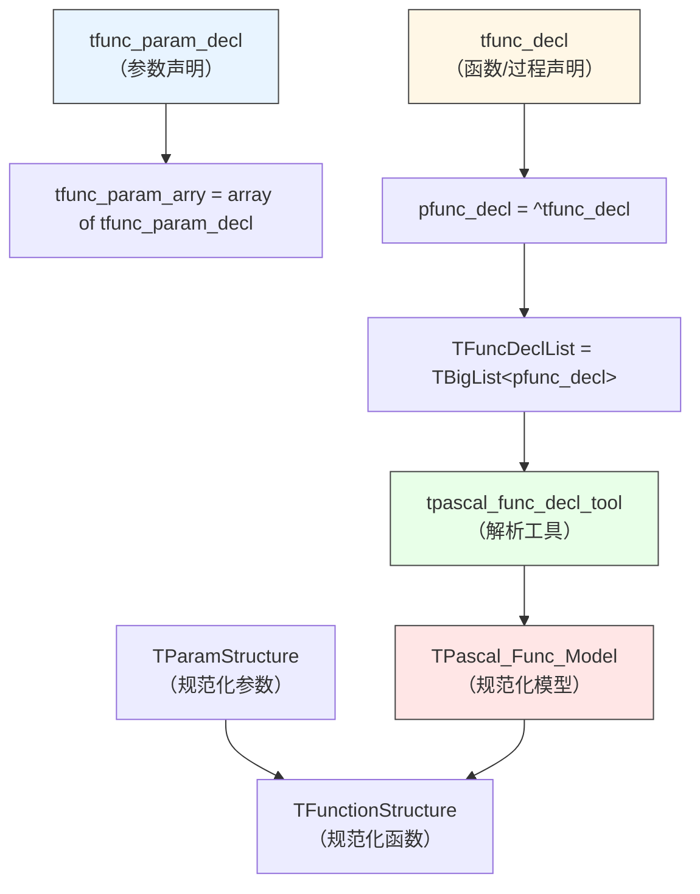
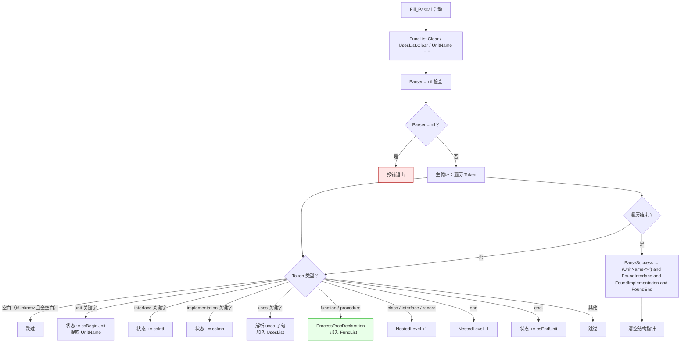
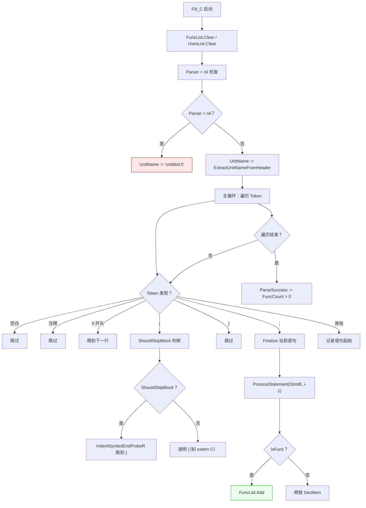
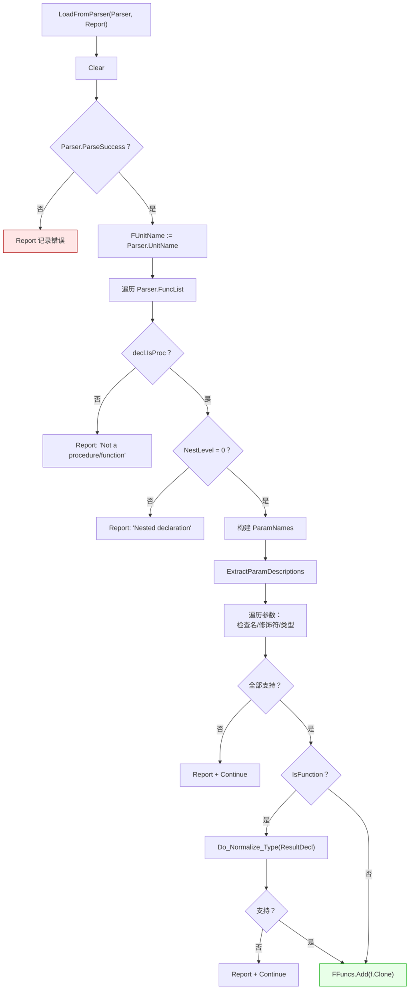

# Z.Pascal_Func_Tool Knowledge Base

> **定位**：面向 AI 与人类工程师的权威参考。目标是让读者**无需翻阅源码**即可安全、准确地使用 `Z.Pascal_Func_Tool` 及其相关单元。
> **承诺**：所有描述均来自以下源码的逐行核对：
> - `Z.Pascal_Func_Tool.pas`（主单元）
> - `Z.Pascal_Func_Tool.Fill_Pascal.inc`（Pascal 解析器）
> - `Z.Pascal_Func_Tool.Fill_C.inc`（C 头文件解析器）
> - `Z.Pascal_Func_Tool.Translate_C_Typ_To_Pascal.inc`（C→Pascal 类型转换）
> - `Z.Pascal_Func_Tool.decl_to_pascal.inc`（Pascal 代码生成）
> - `Z.Pascal_Func_Tool.decl_to_c.inc`（C 代码生成）
> - `Z.Pascal_Code_Tool.pas`（Pascal 代码重写工具）
> - `Z.Pascal_Func_Model.pas`（中间层元数据模型）
> 凡我无法从源码确定的，在文末「诚实的不确定清单」中明示。
> **制图约定**：全文流程图/架构图/决策树一律使用 Mermaid，不使用字符制图。

---

## 第 0 章 快速定位：这些单元是什么

`Z.Pascal_Func_Tool` 是 Z 框架的 **Pascal/C 源码声明解析与代码生成工具链**。它从 Pascal 源码或 C 头文件中提取函数/过程声明元数据，然后可以**重新生成 Pascal 或 C 代码**，也可以转换为 JSON 供下游工具消费。



**核心能力**：

| 能力 | 说明 |
|------|------|
| Pascal 解析 | 提取 `unit` 名、`interface`/`implementation`、`uses`、所有顶层函数/过程 |
| C 头文件解析 | 提取顶层函数原型（跳过宏、类型定义、变量、函数定义） |
| C↔Pascal 类型映射 | 宽度和符号保留的双向映射 |
| 代码生成 | 从元数据生成 Pascal 或 C 代码片段 |
| JSON 序列化 | 保存/恢复整个解析结果 |
| 规范化模型 | `TPascal_Func_Model` 把类型归一化为 `Int64`/`Double`/`string` |
| 代码重写 | 按 Token 类型（注释/字符串/ASCII）安全替换标识符 |
| ZDB 支持 | 在 ZDB 数据库内重写源码 |

---

## 第 1 章 核心类型

### 1.1 类型总览



### 1.2 `tfunc_param_decl` — 参数元数据

```pascal
tfunc_param_decl = record
  param_mod: TP_String;      // 参数修饰符：'' | 'const' | 'var' | 'out' | 'in'
  param_name: TP_String;     // 参数名
  param_typ: TP_String;      // 类型（Pascal 或 C 风格）
  param_value: TP_String;    // 默认值（Pascal 专用，C 中为空）
  param_array: TP_String;    // 数组后缀，如 '[]' 或 '[N]'（C 专用）
  procedure reset;
end;

tfunc_param_arry = array of tfunc_param_decl;
```

**`reset` 契约**：所有字段置空字符串。

**`param_array` 的特殊性**：
- **C 解析器**捕获 `int buf[]` 时，`param_typ='int'`，`param_array='[]'`。
- **Pascal 解析器**不填充此字段（Pascal 用 `array of X`）。
- **`decl_to_pascal`** 将 `param_array<>''` 渲染为 `array of <type>`。
- **`decl_to_c`** 将 `param_array` 直接附加在参数名后。

### 1.3 `tfunc_decl` — 函数/过程声明

```pascal
tfunc_decl = record
  Body: TP_String;            // 声明完整文本
  IsProc: boolean;            // 是否为过程/函数（True）或普通 token（False）
  BPos, EPos: integer;        // 起止位置（仅 Pascal 解析器填充）
  Name: TP_String;            // 名称
  IsFunction: boolean;        // function（True）或 procedure（False）
  ParamDecl: TP_String;       // 参数声明的原始文本（含括号）
  param_arry: tfunc_param_arry; // 解析后的参数数组
  ResultDecl: TP_String;      // 返回类型（procedure 为空）
  ResultMod: TP_String;       // 返回类型修饰符（C 专用，目前只有 'const'）
  CallConv: TP_String;        // 调用约定：'cdecl' / 'stdcall' / ...（Pascal 专用）
  IsExternal: boolean;        // 是否 external
  ExternalLibrary: TP_String; // external 库名
  HasExplicitName: boolean;   // 是否有 name 'xxx' 子句
  ExplicitName: TP_String;    // name 后的字符串
  HasExplicitIndex: boolean;  // 是否有 index N 子句
  ExplicitIndex: TP_String;   // index 后的整数文本
  Index: integer;             // 在 FuncList 中的索引
  Comment: TP_String;         // 前面的注释
  NestLevel: integer;         // 嵌套层级（0=顶层，>0=类/记录/接口内部）
  procedure Init;
  procedure Free;
end;
```

**关键契约**：
- **`IsProc=False` 的条目不应被下游消费**（如 `decl_to_pascal` / `decl_to_c` 会跳过）。
- **`NestLevel > 0` 表示嵌套声明**（如类方法、记录方法），下游生成器**默认跳过**。
- **`IsFunction=True` 时 `ResultDecl` 非空**（除非 C 中 `void` 被转换为空串）。
- **`ResultMod='const'`** 表示 C 中 `const char *` 的 `const` 修饰符。

### 1.4 `TFuncDeclList` — 声明列表

```pascal
TFuncDeclList = class(TBigList<pfunc_decl>)
public
  procedure DoFree(var Data: pfunc_decl); override;
end;
```

**`DoFree` 契约**：调用 `Data^.Free`，然后 `Dispose(Data)`，再 `Data := nil`。

### 1.5 `tpascal_func_decl_tool` — 解析工具

```pascal
tpascal_func_decl_tool = class(TCore_Object_Intermediate)
public
  Parser: TTextParsing;              // 内部解析器
  FuncList: TFuncDeclList;           // 所有声明
  UsesList: TPascalStringList;       // uses 子句中的单元列表
  UnitName: TP_String;               // 单元名
  UnitToken: pfunc_decl;             // 保留字段（当前为 nil）
  InterfaceToken: pfunc_decl;
  ImplementationToken: pfunc_decl;
  EndToken: pfunc_decl;
  InitToken: pfunc_decl;
  FinalToken: pfunc_decl;
  ParseSuccess: boolean;             // 解析是否成功

  constructor Create; overload;
  destructor Destroy; override;

  class function CreateFrom_Pascal_Code(AText: TP_String): tpascal_func_decl_tool;
  procedure Fill_Pascal;

  class function CreateFrom_C_Code(AText: TP_String): tpascal_func_decl_tool;
  procedure Fill_C;
  procedure Translate_C_Typ_To_Pascal;

  procedure Clear;
  function Combine(const BTokenIdx, ETokenIdx: integer): TP_String;

  function SaveToJson: TP_String;
  procedure LoadFromJson(const JsonStr: TP_String);

  function decl_to_pascal(Report: TPascalStringList): TP_String;
  function decl_to_c(Report: TPascalStringList): TP_String;
end;
```

**全局变量**：

```pascal
var
  Pascal_Func_Tool_Log_Enabled: boolean = False;
```

**契约**：
- **`CreateFrom_Pascal_Code`** 创建 `TTextParsing.Create(AText, tsPascal)` 并调用 `Fill_Pascal`。
- **`CreateFrom_C_Code`** 创建 `TTextParsing.Create(AText, tsC)`，调用 `Fill_C` 和 `Translate_C_Typ_To_Pascal`。
- **`Parser` 由工具拥有**，析构时自动释放。
- **`FuncList` 只存储 `IsProc=True` 的条目**（普通 token 会被立即释放）。

### 1.6 规范化模型（`Z.Pascal_Func_Model`）

```pascal
TParamStructure = record
  Name: TP_String;          // 参数名
  Typ: TP_String;           // 原始类型
  PascalType: TP_String;    // 归一化类型：'Int64' / 'Double' / 'string' / ''
  Description: TP_String;   // 从注释提取的描述
  procedure Clear;
end;

TFunctionStructure = record
  Name: TP_String;
  IsFunction: boolean;
  Params: TParamArray;
  ReturnType: TP_String;    // 归一化返回类型
  Comment: TP_String;       // 清理后的注释
  procedure Clear;
  function Clone: TFunctionStructure;
end;

TPascal_Func_Model = class(TCore_Object_Intermediate)
public
  constructor Create;
  destructor  Destroy; override;
  procedure Clear;
  property Typ_Normalize_Func: TTyp_Normalize_Func read ... write ...; // tnf_Json / tnf_ABI
  property UnitName: TP_String read ... write ...;
  property Funcs: TFunctionList read ...;
  property FuncCount: integer read ...;
  procedure LoadFromParser(Parser: tpascal_func_decl_tool; Report: TPascalStringList);
  procedure SaveToParser(Parser: tpascal_func_decl_tool);
  procedure LoadFromJson(const JsonStr: TP_String);
  function  SaveToJson: TP_String;
end;
```

**类型归一化规则**：

| `tnf_Json` | `tnf_ABI` |
|-----------|-----------|
| 整数族 → `'int64'` | 整数族 → 保留原名小写（如 `'integer'`） |
| 浮点族 → `'double'` | 浮点族 → 保留原名小写 |
| 字符串族 → `'string'` | 字符串族 → 保留原名小写 |
| 其他 → `''`（跳过） | 其他 → `''`（跳过） |

**`TParamDescPool`**：继承自 `TPascalString_Big_Hash_Pair_Pool<TP_String>`，用于存储参数描述。

---

## 第 2 章 Pascal 源码解析（`Fill_Pascal`）

### 2.1 解析流程



### 2.2 `ProcessProcDeclaration` 契约

**输入**：`ProcDeclToken`（`function`/`procedure` 关键字）和 `ProcNameToken`（名称）。

**处理步骤**：
1. 设置 `IsProc := True`、`BPos`、`Name`、`IsFunction`。
2. **查找 `(`**：如果有参数列表：
   - `IndentSymbolEndProbeR` 找到匹配的 `)`。
   - `TokenCombine` 提取参数文本。
   - `tfunc_param_tool.extract_param_to_arry` 解析参数。
3. **procedure + `;`**：调用 `ProcessExternalAndCallingConvention`。
4. **function + `:`**：提取返回类型（直到 `;`），再调用 `ProcessExternalAndCallingConvention`。
5. **function 缺 `:`**：报错。
6. **procedure 无 `;` 且无调用约定**：报错。

### 2.3 `ProcessExternalAndCallingConvention` 契约

**输入**：`Idx`（`;` 之后的位置）。

**处理步骤**：
1. `ProbeR` 找第一个 `ttAscii` token。
2. **如果是调用约定**（`register`/`pascal`/`cdecl`/`stdcall`/`safecall`）：
   - 设置 `CallConv`。
   - 找下一个 `;`。
   - 找下一个 `ttAscii`。
   - **如果是 `external`**：继续处理。
   - 否则：结束。
3. **如果是 `external`**：设置 `IsExternal := True`。
   - 找库名（`ttTextDecl` 或 `ttAscii`）。
   - 找 `name`/`index` 子句。
4. **返回下一个 Token 索引**。

### 2.4 `tfunc_param_tool` 契约

```pascal
tfunc_param_tool = class(TBigList<tfunc_param_decl>)
public
  procedure DoFree(var Data: tfunc_param_decl); override;
  procedure fill_param(ParamDecl: TP_String);
  function get_param_arry: tfunc_param_arry;
  class function extract_param_to_arry(ParamDecl: TP_String): tfunc_param_arry;
end;
```

**`fill_param` 处理流程**：
1. `ParamDecl.TrimChar('()'#32#9#13#10)`——**去掉括号和空白**。
2. 创建 `TTextParsing(tmp, tsPascal)` + `DeletedComment`。
3. `SplitChar(1, lPos, ';', '', SplitOutput)`——**按 `;` 分割**。
4. 对每个参数段调用 `do_parsing_single_param`。

**`do_parsing_single_param` 处理流程**：
1. 用 `SplitChar(1, lPos, True, ',', ':', SplitOutput)` 按 `,` 分割（**`:` 作为结束符**）。
2. **若 `rNum = 0`**：整个段作为单元素。
3. **`param_mod` 识别**：若第一个 token 是 `var`/`out`/`in`/`const`，作为修饰符。
4. **`param_typ` 提取**：从 `:` 之后的文本用 `extract_typ_and_value` 解析。
5. **`param_value` 提取**：`:` 之后若含 `=`，`=` 后面的作为默认值。
6. **多个参数名共享类型**：`a, b, c: Integer` 会拆成 3 个参数。

**`extract_typ_and_value`**：
- `SplitChar(1, lPos, '=', ';', SplitOutput)`。
- `SplitOutput[0]` → `param_typ`。
- `SplitOutput[1]` → `param_value`。

### 2.5 `ExtractPrecedingComments` 契约

**输入**：`Idx`（声明关键字的位置）。

**处理**：
1. 从 `Idx-1` 向前跳过空白。
2. **收集连续 `ttComment` Token**。
3. **反向合并**（因为向前扫描）。
4. 结果合并成单个字符串（多行用 `#13#10` 分隔）。

**⚠️ 关键陷阱**：注释必须**紧邻声明**（中间无空行）才能被捕获。

### 2.6 `ProcessUsesClause` 契约

**输入**：`uses` 子句的完整文本。

**处理**：
1. 用 `TTextParsing(tsPascal)` 去掉注释。
2. `DeleteChar(#13#10#9)` 去掉换行/制表符。
3. `UmlSeparatorText(..., ',')` 按 `,` 分割。
4. 去掉每个元素的首尾空格。
5. `UmlMergeStrings(LocalList, UsesList, True)` 合并（忽略大小写去重）。

---

## 第 3 章 C 头文件解析（`Fill_C`）

### 3.1 解析流程



### 3.2 `ExtractUnitNameFromHeader` 契约

**优先级**：
1. **`*.h` / `*.c` 文件名**：在前 100 行内找 `.h` 或 `.c`，提取前面的标识符（**必须以字母开头**，避免 `1.0.3.h` → `3`）。
2. **Include guard 宏名**：
   - `#ifndef` / `#ifdef` → 任何标识符。
   - `#define` → **仅当宏名看起来像 guard**（`_H` / `_H_` / `_H__` / `_INCLUDED` / `_HPP` / `_HXX`）。
3. **回退**：`'untitled.h'`。

**`StripGuard` 契约**：从宏名去掉 `_H` / `_H_` / `_H__` / `_INCLUDED` / `_HPP` / `_HXX` 后缀，再去掉首尾 `_`。

### 3.3 `ProcessStatement` 契约

**输入**：语句的 token 范围 `[StmtB, StmtE]`。

**处理步骤**：
1. **查找第一个顶层 `(`**：
   - 前一个 token 必须是 `ttAscii` 且**不是 C 保留字**。
   - 那个前一个 token 是函数名。
2. **`IndentSymbolEndProbeR` 找匹配 `)`**。
3. **拒绝 `=` 初始化**：`)` 之后若有 `=`，是变量声明，跳过。
4. **拒绝函数指针参数**：`ContainsFuncPtrParam` 检查 `(` 后紧跟 `*`。
5. **提取返回类型**：`ExtractReturnType` 过滤修饰符。
6. **检测 `const` 返回修饰符**：`Decl.ResultMod := 'const'`。
7. **解析参数列表**：`JoinTokens_Canonical` + `ParseParamList`。
8. **填充 `Decl`**：`Name` / `IsProc` / `IsFunction` / `BPos` / `EPos` / `Body` / `ResultDecl` / `ParamDecl` / `Comment` / `NestLevel := 0` / `Index`。

### 3.4 `ExtractReturnType` 契约

**过滤的修饰符**：
- `extern` / `static` / `inline` / `register` / `volatile`
- `__inline` / `__forceinline` / `__volatile` / `__volatile__`
- `__cdecl` / `__stdcall` / `__fastcall` / `__pascal` / `__vectorcall`
- `__declspec(...)` / `__attribute__((...))`（**括号内整体跳过**）

**保留的 token**：其他所有非空白 token。

### 3.5 `ParseParamSegment` 契约

**输入**：段范围 `[segB, segE]`。

**输出**：`ParamMod` / `ParamName` / `ParamTyp`。

**处理**：
1. **`(void)` 特殊情况**：`segB=segE` 且 `void` → `ParamTyp='void'`。
2. **从后向前找最后一个非保留标识符**：
   - 跳过数组后缀 `[...]`。
   - 跳过 C 保留字。
   - 找到的第一个 `ttAscii` 非保留字是参数名。
3. **无名参数**（`LastIdentIdx < 0`）：纯类型段。
4. **struct/enum/union 无名参数**：类型名前的 token 是 `struct`/`enum`/`union`。
5. **正常情况**：`ParamName = 最后标识符`，`ParamTyp = JoinTypeTokens(segB, LastIdentIdx-1)`。
6. **`const` 检测**：类型范围内任意位置有 `const` → `ParamMod='const'`。

### 3.6 `JoinTokens` / `JoinTypeTokens` / `JoinTokens_Canonical`

| 函数 | 用途 | 特性 |
|------|------|------|
| `JoinTokens` | 通用 token 拼接 | 跳过空白，单空格分隔 |
| `JoinTypeTokens` | 类型 token 拼接 | **额外丢弃 `restrict` / `__restrict` / `__restrict__`** |
| `JoinTokens_Canonical` | 规范 C 风格拼接 | `(`/`[` 后无空格，`)`/`]`/`,` 前无空格 |

### 3.7 `ShouldSkipBlock` 契约

**返回 True 的条件**：
- **A**：`{` 前一个 token 是 `)` → **函数体**。
- **B**：语句范围内有 `struct`/`enum`/`union`/`typedef` → **类型定义**。

**返回 False 时**（透明 `{`）：如 `extern "C" {`。

### 3.8 跳过的内容

| 内容 | 原因 |
|------|------|
| 预处理指令 | `#` 开头的行 |
| 类型定义 | `struct` / `enum` / `union` / `typedef` |
| 全局变量 | 含 `=` 初始化 |
| 函数定义 | `{ ... }` 块 |
| 函数指针参数 | 参数列表含 `(*...)` |
| 变量声明 | 无 `()` |

---

## 第 4 章 C→Pascal 类型转换（`Translate_C_Typ_To_Pascal`）

### 4.1 转换表

| C 类型 | Pascal 类型 |
|--------|-------------|
| `signed char` / `int8_t` | `ShortInt` |
| `short` / `short int` / `signed short` / `int16_t` | `SmallInt` |
| `int` / `signed` / `signed int` / `int32_t` | `Integer` |
| `long` / `long int` / `signed long` / `signed long int` | `LongInt` |
| `long long` / `long long int` / `signed long long` / `int64_t` | `Int64` |
| `unsigned char` / `uint8_t` | `Byte` |
| `unsigned short` / `unsigned short int` / `uint16_t` | `Word` |
| `unsigned` / `unsigned int` / `uint32_t` | `Cardinal` |
| `unsigned long` / `unsigned long int` | `LongWord` |
| `unsigned long long` / `unsigned long long int` / `uint64_t` | `UInt64` |
| `size_t` / `uintptr_t` | `UInt64` |
| `ssize_t` / `ptrdiff_t` / `intptr_t` | `Int64` |
| `float` | `Single` |
| `double` | `Double` |
| `long double` | `Extended` |
| `char *` / `const char *` / `char const *` | `string` |
| **其他含 `*`** | `Pointer` |
| `void`（返回类型） | `''`（空） |
| **其他** | 原样保留 |

### 4.2 `Translate_C_Typ_To_Pascal` 主循环

对 `FuncList` 中的每个 `IsProc=True` 的条目：

1. **转换每个参数类型**：`ConvertCTypeToPascal`。
2. **清空 `param_value`**（C 无默认值）。
3. **重建 `ParamDecl`**：`BuildPascalParamDecl`（Pascal 语法）。
4. **转换返回类型**：`ConvertCTypeToPascal`。**若为空 → `IsFunction := False`**。
5. **清空非公开字段**：`BPos` / `EPos` / `CallConv` / `IsExternal` / `ExternalLibrary` / `HasExplicitName` / `ExplicitName` / `HasExplicitIndex` / `ExplicitIndex` / `NestLevel`；`Index := i`。
6. **转换 Comment**：C 风格 → Pascal 风格（`{ ... }`）。
7. **重建 Body**：`BuildPascalBody`。

### 4.3 注释转换规则

**`ConvertCCommentToPascalComment` 契约**：
- 已是 Pascal 风格（`{` 或 `(*` 开头）→ 原样返回。
- 否则用 `TTextParsing(tsC)` 提取 `ttComment` token。
- `Translate_C_Decl_Comment_To_Text` 转为纯文本。
- **去除开头的 `*`**（Doxygen `/**` 残留）。
- 包裹为 `{ ... }`。

**⚠️ 关键陷阱**：**用直接拼接而非 `Translate_Text_To_Pascal_Decl_Comment`**，因为后者会**重新分词并插入 CJK 字符间的多余空格**。

---

## 第 5 章 生成 Pascal 代码（`decl_to_pascal`）

### 5.1 输出格式

```pascal
unit YourUnit;

interface

{ Comment }
function Add(a: Int64; b: Int64): Int64;

{ Comment }
procedure Log(msg: string);

implementation

end.
```

### 5.2 类型支持检查

**`IsSupportedPascalType` 接受的类型**：
- 整数族：`ShortInt` / `SmallInt` / `Integer` / `LongInt` / `Int64` / `DWord`
- 无符号族：`Byte` / `Word` / `Cardinal` / `LongWord` / `UInt64`
- 别名：`Int8` / `Int16` / `Int32` / `UInt8` / `UInt16` / `UInt32`
- 浮点族：`Single` / `Double` / `Extended` / `Real`
- 指针：`Pointer`
- 字符串：`string` / `AnsiString` / `UnicodeString` / `PChar` / `PAnsiChar` / `PWideChar` / `TP_String` / `TPascalString` / `TUPascalString` / `U_String`

### 5.3 跳过条件

**`IsDeclSupported` 拒绝**：
- `IsProc=False`
- `NestLevel <> 0`（嵌套声明）
- `Name = ''`
- 参数名为空
- 参数修饰符是 `var` / `out`
- 参数类型不在支持列表
- 返回类型不在支持列表（function）

### 5.4 `BuildDeclString` 契约

```
[Comment]
function|procedure Name(ParamStr)[: ResultDecl];
```

**`BuildParamString` 契约**：
- 用 `; ` 分隔参数。
- `param_array <> ''` → 类型渲染为 `array of <type>`。
- 参数格式：`modifier name: type`。

**注意**：**调用约定和 external 指令被有意省略**。如需保留，需要扩展此函数。

---

## 第 6 章 生成 C 代码（`decl_to_c`）

### 6.1 输出格式

```c
/* YourUnit.h */

#ifndef YourUnit_H
#define YourUnit_H

/* Generated from unit YourUnit.h */

/* Comment */
long long Add(long long a, long long b);

#endif /* YourUnit_H */
```

### 6.2 Pascal→C 类型映射

| Pascal 类型 | C 类型 |
|------------|--------|
| `ShortInt` | `signed char` |
| `SmallInt` | `short` |
| `Integer` | `int` |
| `LongInt` | `long` |
| `Int64` | `long long` |
| `Byte` | `unsigned char` |
| `Word` | `unsigned short` |
| `Cardinal` / `DWord` | `unsigned int` |
| `LongWord` | `unsigned long` |
| `UInt64` | `unsigned long long` |
| `Single` | `float` |
| `Double` | `double` |
| `Extended` / `Real` | `long double` |
| `Pointer` | `void *` |
| 字符串族 | `char *` |
| `void` / `''` | `void` |

### 6.3 参数修饰符

**`const` 会被保留**。`var` / `out` → **声明被跳过**（`IsDeclSupported` 拒绝）。

### 6.4 数组后缀

`param_array` 直接附加在参数名后：
- `int buf[]` → `int buf[]`
- `int buf[N]` → `int buf[N]`

### 6.5 返回类型修饰符

**`ResultMod='const'` 时**：`const ` 前缀。

例如：`string` + `const` → `const char *`。

### 6.6 注释处理

`ConvertPascalCommentToCComment`：
- 已是 C 风格（`/*` 开头）→ 原样返回。
- 否则用 `TTextParsing(tsPascal)` 提取 `ttComment` token。
- `Translate_Pascal_Decl_Comment_To_Text` 转为纯文本。
- 包裹为 `/* ... */`。

---

## 第 7 章 JSON 序列化

### 7.1 `tpascal_func_decl_tool` 的 JSON

```pascal
function SaveToJson: TP_String;
procedure LoadFromJson(const JsonStr: TP_String);
```

**JSON 结构**：

```json
{
  "UnitName": "MyUnit",
  "ParseSuccess": true,
  "UsesList": ["SysUtils", "Classes"],
  "FuncList": [
    {
      "Body": "function Add(a: Integer; b: Integer): Integer;",
      "IsProc": true,
      "Name": "Add",
      "IsFunction": true,
      "ParamDecl": "(a: Integer; b: Integer)",
      "param_arry": [
        {"mod": "", "name": "a", "typ": "Integer", "value": "", "array": ""},
        {"mod": "", "name": "b", "typ": "Integer", "value": "", "array": ""}
      ],
      "ResultDecl": "Integer",
      "ResultMod": "",
      "CallConv": "",
      "IsExternal": false,
      "ExternalLibrary": "",
      "HasExplicitName": false,
      "ExplicitName": "",
      "HasExplicitIndex": false,
      "ExplicitIndex": "",
      "Index": 0,
      "Comment": "{ Adds two numbers. }",
      "NestLevel": 0
    }
  ],
  "UnitTokenIndex": -1,
  "InterfaceTokenIndex": -1,
  "ImplementationTokenIndex": -1,
  "EndTokenIndex": -1,
  "InitTokenIndex": -1,
  "FinalTokenIndex": -1
}
```

**契约**：
- **`BPos` / `EPos` 不被序列化**（`JsonToFuncDecl` 中置 0）。
- **结构指针保存为索引**（`GetDeclIndex`），恢复时通过 `FuncList[Idx]` 重建。
- **`Index` 字段被序列化**（与在 `FuncList` 中的位置对应）。

### 7.2 `TPascal_Func_Model` 的 JSON

```pascal
function SaveToJson: TP_String;
procedure LoadFromJson(const JsonStr: TP_String);
```

**JSON 结构**：

```json
{
  "UnitName": "MyUnit",
  "Functions": [
    {
      "Name": "Add",
      "IsFunction": true,
      "Comment": "Adds two numbers.",
      "ReturnType": "int64",
      "Params": [
        {"Name": "a", "Typ": "Integer", "PascalType": "int64", "Description": "First operand"},
        {"Name": "b", "Typ": "Integer", "PascalType": "int64", "Description": "Second operand"}
      ]
    }
  ]
}
```

**契约**：
- **`Function` 数组用 `TZ_JsonArray`**。
- **`Params` 数组的每个元素是对象**。
- **`ParseText` 失败时静默退出**（`Exit`）。

---

## 第 8 章 规范化模型（`TPascal_Func_Model`）

### 8.1 `LoadFromParser` 流程



### 8.2 `ExtractParamDescriptions` 契约

**输入**：注释文本 + 参数名数组。

**处理**：
1. `CleanComment` 清理注释。
2. 按 `#10` 分割成行。
3. 对每行创建 `TTextParsing(line, tsPascal)`。
4. 对每个 `ttAscii` token：
   - **是参数名？** → 进一步判断：
     - **规则 1**：前一个非空白 token 是 `@` 或 `\` → 识别。
     - **规则 2**：后一个非空白 token 是 `:` 或 `=` → 识别。
     - **规则 3**：后一个非空白 token 不是符号且不是其他参数名 → 识别。
   - **识别后**：从 `Token^.EPos` 到行尾作为描述。
   - **去除开头的 `:` 或 `=`**。
5. 用 `;` 连接同一参数的多个描述。

**支持的注释风格**：
- Doxygen：`@param a description` / `\param a description`
- 冒号：`a: description`
- 等号：`a = description`
- 空格：`a   description`

### 8.3 `CleanComment` 契约

**处理**：
1. `TTextParsing(Cmt, tsPascal)`。
2. 对每个 `ttComment` token：
   - `Translate_Pascal_Decl_Comment_To_Text`。
   - `TrimChar(#32#9#13#10)`。
3. 用 `sLineBreak` 合并。

### 8.4 `SaveToParser` 契约

**处理**：
1. `Parser.FuncList.Clear`。
2. `Parser.UsesList.Clear`。
3. `Parser.UnitName := FUnitName`。
4. 对每个 `TFunctionStructure`：
   - 创建新 `pfunc_decl`。
   - 设置 `IsProc := True` / `Name` / `IsFunction` / `ResultDecl` / `Comment` / `NestLevel := 0`。
   - 从 `f.Params` 重建 `param_arry`。
   - **`param_mod := ''`**（丢弃 var/const/out）。
5. `Parser.ParseSuccess := True`。

---

## 第 9 章 代码重写（`Z.Pascal_Code_Tool`）

### 9.1 关键词枚举

```pascal
TPascal_Keyword = (
  kUnit, kProgram, kLibrary, kInterface, kUses, kType, kSet, kClass, KArray, kOf,
  kFunction, kProcedure, kConst, kVar, kRecord, kPacked, kInline,
  kExternal, kExternal_Name, kExternal_Index,
  kImplementation, kBegin, kEnd, kIn, kOut, kIf, kFor, kWhile, kRepeat, kUntil,
  kLabel, kContinue, kBreak, kCase, kForward, kEol,
  kInherited, kOverload, kVirtual, kOverride, kStdcall, kCdecl, kPascal, kSafeCall, kRegister,
  kConstructor, kDestructor, kPublic, kPrivate, kProtected, kPublished,
  kAbstract, kSealed, kWeak, kUnsafe,
  kInitialization, kFinalization,
  kEmpty, kUnknow
);
```

**`Pascal_Keyword_DICT`**：`array[TPascal_Keyword] of (key, Decl)`。

**`Pascal_Keyword(const s: TP_String): TPascal_Keyword`**：遍历所有关键词做 `Same` 比较（**大小写不敏感**）。

### 9.2 `Replace_Pascal_Code` 契约

```pascal
function Replace_Pascal_Code(var Code_: TP_String;
  PatternHash_: THashStringList; TT_: TTokenTypes;
  OnlyWord, IgnoreCase: Boolean; bPos, ePos: Integer;
  FileInfo__: SystemString; OnStatus: TOnRewriteStatus): Boolean;
```

**处理**：
1. `U_BuildBatch(PatternHash_)` 构建替换批次。
2. `U_SortBatch(arry)` 排序（长匹配优先）。
3. `TTextParsing(Code_, tsPascal, nil, ...)`。
4. `U_BatchReplace` 替换。
5. **`Accept` 回调**：只有 token 类型在 `TT_` 中时才替换。
6. **返回是否发生替换**。

**⚠️ 关键陷阱**：`SpacerSymbol.V.DeleteChar('.')` —— **去掉 `.`**，否则 `.` 会被当作符号分隔符。

### 9.3 `Replace_ASCII_Code` 契约

与 `Replace_Pascal_Code` 类似，但**不做 token 类型检查**——直接替换。

### 9.4 `TRewrite_Trace` 契约

```pascal
TRewrite_Trace = class(TCore_Object_Intermediate)
public
  Current_: U_String;                 // 当前处理的文件
  marco_hash_: THashStringList;       // 宏替换表
  Include_Files_: TPascalStringList;  // {$I} 引用文件
  Uses_Files_: TPascalStringList;     // uses 引用单元
  Resource_Files_: TPascalStringList; // {$R} 资源
  Link_Files_: TPascalStringList;     // {$L} 链接
  IsCode_: Boolean;                   // 是否处理了代码
end;
```

### 9.5 `RewritePascal_Process_Code` 契约

**处理**：
1. 创建 `TTextParsing(Code_, tsPascal)`。
2. **主循环**：遍历 token，识别：
   - `{$I}` / `{$INCLUDE}` → `Include_Files_`
   - `{$R}` / `{$RESOURCE}` → `Resource_Files_`
   - `{$L}` / `{$LINK}` → `Link_Files_`
   - `unit X` → `Uses_Files_`
   - `uses X, Y` → `Uses_Files_`
   - `uses X in 'file.pas'` → `Uses_Files_` + 文件重命名
3. **替换单元名**：`UnitHash_` 中查表。
4. **重建代码**：`u_TP.RebuildToken` 后用 `U_BatchReplace` 替换。
5. **合并 `PatternHash_`**：与 `marco_hash` 合并后再次替换。

**关键契约**：
- **`UnitHash_`**：Key 是旧单元名（含 `.pas` / `.pp`），Value 是新单元名。
- **`PatternHash_`**：Key 是旧符号，Value 是新符号。
- **`Trace_.marco_hash_`**：记录本文件中所有替换。

### 9.6 `RewritePascal_ProcessDirectory` 契约

```pascal
function RewritePascal_ProcessDirectory(
  Parallel_: Boolean;
  directory_: U_String;
  UnitHash_, PatternHash_: THashStringList;
  CustomPattern_: TCustom_After_Source_Processor_Data_Pool;
  OnStatus: TOnRewriteStatus): Integer;
```

**处理**：
1. `umlGet_File_Full_Array` 获取所有文件。
2. **并行**（`Parallel_=True`）或**串行**处理每个文件。
3. `RewritePascal_Include_File_Processor` 合并 include 宏。
4. **Custom Pattern 处理**：对每个文件应用自定义替换。
5. **递归处理子目录**。

**返回值**：修改的文件数。

**⚠️ 关键陷阱**：
- **并行模式下 `Trace_Pool` 用 `LockObject` / `UnLockObject` 保护**。
- **FPC 用 `FPCParallelFor`，Delphi 用 `DelphiParallelFor`**。

### 9.7 ZDB 重写

```pascal
function RewritePascal_Process_ZDB_File(...): Boolean;
procedure Th_RewritePascal_Process_ZDB_Directory(...);
```

**契约**：
- 从 ZDB 读取文件内容（`LoadFrom_ZDB_File`）。
- 调用 `RewritePascal_Process_Code`。
- 保存回 ZDB（`SaveTo_ZDB_File`）。
- **多线程版本 `Th_*`**：用 `TThreadPost` 收集完成事件。

### 9.8 模型构建

```pascal
function Build_RewritePascal_Model(UnitData_, PatternData_: TSource_Processor_Data_Pool;
  CustomPattern_: TCustom_After_Source_Processor_Data_Pool): TMS64;
function Load_RewritePascal_Model(Model_: TMS64; ...): Boolean;
function Check_RewritePascal_Model(...): Boolean;
```

**`Build_RewritePascal_Model`**：用 `TZDB2_File_Encoder` 打包为 3 个条目（`Unit` / `Pattern` / `Custom`）。

**`Check_RewritePascal_Model`**：检查是否有 `Unit` 的 `New_Feature` 与 `Pattern`/`Custom` 的 `New_Feature` 冲突。

### 9.9 数据池

```pascal
TSource_Define_Pool = class(TGenericsList<PSource_Define>);          // 单元重命名表
TSource_Processor_Data_Pool = class(TGenericsList<PSource_Processor_Data>);  // 符号替换表
TCustom_After_Source_Processor_Data_Pool = class(TGenericsList<PCustom_After_Source_Processor_Data>);  // 按文件匹配的替换表
```

**`TSource_Define`**：
```pascal
TSource_Define = record
  SourceFile: U_String;   // 原文件
  NewName: U_String;      // 新单元名
end;
```

**`TSource_Processor_Data`**：
```pascal
TSource_Processor_Data = record
  OLD_Feature: U_String;  // 旧符号
  New_Feature: U_String;  // 新符号
end;
```

**`TCustom_After_Source_Processor_Data`**：
```pascal
TCustom_After_Source_Processor_Data = record
  File_Match: U_String;   // 文件名通配符
  OLD_Feature: U_String;
  New_Feature: U_String;
end;
```

### 9.10 `TSource_Define_Pool.Build_Unit_Processor` 契约

**处理**：
1. 构建 `tmpHash`：所有 Pascal 关键词加 `_LIB` 后缀（首字母大写）。
2. 对每个 `SourceFile` → `NewName`：
   - 取 `umlGetFileName(NewName)`。
   - 应用 `Fixed_Pascal_Keyword`（关键词替换）。
   - 加入 `Processor`。

**目的**：**避免新单元名与 Pascal 关键词冲突**。

---

## 第 10 章 完整使用范式

### 10.1 解析 Pascal 并生成 C 头文件

```pascal
var
  Tool: tpascal_func_decl_tool;
  Report: TPascalStringList;
  CCode: TP_String;
begin
  Tool := tpascal_func_decl_tool.CreateFrom_Pascal_Code(SourceCode);
  try
    if not Tool.ParseSuccess then
      raise Exception.Create('解析失败');

    WriteLn('Unit: ', Tool.UnitName.Text);
    WriteLn('函数数: ', Tool.FuncList.Count);

    Report := TPascalStringList.Create;
    try
      CCode := Tool.decl_to_c(Report);
      WriteLn('生成 C 代码长度: ', CCode.Len);
      WriteLn(Report.AsText);  // 跳过报告
    finally
      Report.Free;
    end;
  finally
    Tool.Free;
  end;
end;
```

### 10.2 解析 C 头文件并生成 Pascal

```pascal
var
  Tool: tpascal_func_decl_tool;
  Report: TPascalStringList;
  PasCode: TP_String;
begin
  Tool := tpascal_func_decl_tool.CreateFrom_C_Code(CHeaderText);
  try
    if not Tool.ParseSuccess then
      raise Exception.Create('解析失败');

    Report := TPascalStringList.Create;
    try
      PasCode := Tool.decl_to_pascal(Report);
      WriteLn(PasCode);
    finally
      Report.Free;
    end;
  finally
    Tool.Free;
  end;
end;
```

### 10.3 JSON 往返

```pascal
var
  Tool: tpascal_func_decl_tool;
  Json: TP_String;
begin
  Tool := tpascal_func_decl_tool.CreateFrom_Pascal_Code(SourceCode);
  try
    Json := Tool.SaveToJson;
  finally
    Tool.Free;
  end;

  // 稍后：
  Tool := tpascal_func_decl_tool.Create;
  try
    Tool.LoadFromJson(Json);
    WriteLn(Tool.UnitName.Text);
    WriteLn(Tool.FuncList.Count);
  finally
    Tool.Free;
  end;
end;
```

### 10.4 使用规范化模型

```pascal
var
  Tool: tpascal_func_decl_tool;
  Model: TPascal_Func_Model;
  Report: TPascalStringList;
begin
  Tool := tpascal_func_decl_tool.CreateFrom_Pascal_Code(SourceCode);
  try
    if not Tool.ParseSuccess then
      raise Exception.Create('解析失败');

    Model := TPascal_Func_Model.Create;
    try
      Model.Typ_Normalize_Func := tnf_ABI;
      Report := TPascalStringList.Create;
      try
        Model.LoadFromParser(Tool, Report);
        WriteLn('加载: ', Model.FuncCount, ' 个函数');
        WriteLn(Report.AsText);
      finally
        Report.Free;
      end;

      for var i := 0 to Model.FuncCount - 1 do
        begin
          WriteLn('函数: ', Model.Funcs[i].Name.Text);
          WriteLn('  返回: ', Model.Funcs[i].ReturnType.Text);
          for var j := 0 to High(Model.Funcs[i].Params) do
            WriteLn('  参数: ', Model.Funcs[i].Params[j].Name.Text,
              ' : ', Model.Funcs[i].Params[j].PascalType.Text,
              ' (', Model.Funcs[i].Params[j].Description.Text, ')');
        end;
    finally
      Model.Free;
    end;
  finally
    Tool.Free;
  end;
end;
```

### 10.5 代码重写

```pascal
var
  UnitHash, PatternHash: THashStringList;
begin
  UnitHash := THashStringList.Create;
  PatternHash := THashStringList.Create;
  try
    UnitHash.Add('OldUnit.pas', 'NewUnit');
    UnitHash.Add('OldUnit.pp',  'NewUnit');
    PatternHash.Add('OldSymbol', 'NewSymbol');

    RewritePascal_ProcessDirectory(
      False,                          // 串行
      'C:\MyProject\src',
      UnitHash, PatternHash,
      nil,
      procedure(const Fmt: SystemString; const Args: array of const)
      begin
        WriteLn(Format(Fmt, Args));
      end
    );
  finally
    PatternHash.Free;
    UnitHash.Free;
  end;
end;
```

---

## 第 11 章 反例集

### 11.1 在 `decl_to_c` 中保留 var 参数

```pascal
// ❌ 错误：希望 var 参数被保留
// 实际：IsDeclSupported 拒绝 var/out，声明被跳过
```

**✅ 正确**：手动扩展 `IsDeclSupported` 和 `BuildCParamString`。

### 11.2 忘记处理 `Report = nil`

```pascal
// ❌ 错误：Report 为 nil 时崩溃
Tool.decl_to_c(nil);   // 实际上：内部检查 `if Report <> nil then`
```

**✅ 正确**：`Report` 可以是 nil，框架会跳过报告。

### 11.3 `unit` 名丢失

```pascal
// ❌ 错误：Parser 返回的 UnitName 为空
// 原因：unit 声明在 interface 之前，或缺少 unit 关键字
```

**✅ 正确**：确保源文件以 `unit X;` 开头。

### 11.4 C 解析器遇到 `extern "C" {`

```pascal
// ⚠️ `extern "C" {` 被当作透明块
// 内容会被正常处理
// 但 `extern "C"` 本身不会被当作声明
```

### 11.5 `restrict` 限定符

```pascal
// ⚠️ `int * restrict p` 中的 `restrict` 被丢弃
// 类型变为 `int *`，最终映射为 `Pointer`
```

**建议**：需要保留时手动扩展 `JoinTypeTokens`。

### 11.6 函数指针参数

```pascal
// ❌ 函数指针参数会被跳过整个声明
// 如：void register_callback(void (*cb)(int));
```

**✅ 正确**：手动扩展 `ContainsFuncPtrParam`。

### 11.7 `uses` 子句中的 `in 'file.pas'`

```pascal
// ⚠️ C 解析器不处理 uses 子句（那是 Pascal 语法）
// Pascal 解析器会处理 `uses X in 'file.pas'`
```

### 11.8 `TPascal_Func_Model` 跳过 `var` 参数

```pascal
// ❌ 错误：期望 var 参数出现在模型中
// 实际：LoadFromParser 拒绝 var/out
```

**✅ 正确**：使用 `tpascal_func_decl_tool` 直接处理。

### 11.9 注释与声明之间有空行

```pascal
// ❌ 注释与声明之间有空行 → 注释不被关联
{ Comment }

function F;   // 注释丢失
```

**✅ 正确**：注释必须紧邻声明。

### 11.10 多行注释未加 `*`

```pascal
// ⚠️ 多行注释会自动加 ` *` 前缀
{ First line
  Second line }
// 变成：
{ First line
 * Second line }
```

**✅ 正确**：这是 C 风格规范化的副作用。

### 11.11 `RewritePascal_ProcessDirectory` 中 `nil` 回调

```pascal
// ❌ 错误：OnStatus 为 nil 时崩溃
RewritePascal_ProcessDirectory(False, dir, uh, ph, nil, nil);
```

**✅ 正确**：提供空实现或非 nil 回调。

### 11.12 ZDB 重写的线程安全

```pascal
// ⚠️ Th_RewritePascal_Process_ZDB_Directory 内部用 TThreadPost
// 但 TObjectDataManager 的操作可能不是线程安全的
// 实际由 TThreadPost 序列化
```

### 11.13 `TSource_Define_Pool.Build_Unit_Processor` 的关键词冲突

```pascal
// ⚠️ 新单元名等于 Pascal 关键词时会被加 `_LIB` 后缀
// 如新名 `Class` → `Class_LIB`
```

### 11.14 JSON 反序列化后位置丢失

```pascal
// ⚠️ BPos / EPos 不被序列化
// 反序列化后为 0
```

**✅ 正确**：仅依赖名称/类型等逻辑字段。

### 11.15 `Combine` 越界

```pascal
// ❌ 错误：BTokIdx / ETokenIdx 越界
Tool.Combine(-1, 1000);   // 内部检查 `(Lo >= 0) and (Hi < FuncList.Num)`
```

**✅ 正确**：检查索引范围。

---

## 第 12 章 常见错误对照表

| 现象 | 根因 | 修正 |
|------|------|------|
| `ParseSuccess=False` | 源文件缺少 `unit` / `interface` / `implementation` / `end.` | 检查源文件结构 |
| `UnitName='untitled.h'`（C 解析） | 无 `.h` 文件名或 include guard | 手动设置 `UnitName` |
| 函数未出现在 `FuncList` | 嵌套在 `class` / `record` 内 | `NestLevel > 0` 被跳过 |
| `var`/`out` 参数消失 | `IsDeclSupported` 拒绝 | 手动扩展 |
| `restrict` 丢失 | `JoinTypeTokens` 丢弃 | 手动扩展 |
| 函数指针参数导致整条跳过 | `ContainsFuncPtrParam` | 手动扩展 |
| 注释未关联 | 注释与声明间有空行 | 去掉空行 |
| C 注释转 Pascal 后乱码 | CJK 字符被重分词 | 源码已用直接拼接 |
| 多行 C 注释行首无 `*` | 规范化规则 | 正常行为 |
| `decl_to_c` 输出无换行 | `Result` 拼接 | 正常行为 |
| `decl_to_pascal` 无调用约定 | 有意省略 | 手动扩展 |
| JSON 反序列化后 BPos=0 | 未序列化 | 正常行为 |
| `RewritePascal_ProcessDirectory` 慢 | 串行 | 设置 `Parallel_=True` |
| 重写时匹配到注释/字符串 | `TT_` 未限制 | 用 `ttAscii` 等 |
| ZDB 重写线程崩溃 | 未用 `Th_*` 版本 | 用 `Th_RewritePascal_Process_ZDB_*` |
| `TSource_Define_Pool` 冲突 | 关键词 | `Build_Unit_Processor` 自动加 `_LIB` |
| `TPascal_Func_Model` 跳过类型 | 归一化不支持 | 用 `tnf_ABI` |
| 参数描述为空 | 注释风格不支持 | 用 Doxygen / `:` / `=` |

---

## 第 13 章 与 Z.Parsing / Z.Json / Z.ListEngine 的衔接

### 13.1 类型依赖

```mermaid
flowchart TD
    A["Z.Pascal_Func_Tool"] --> B["Z.Parsing<br/>（TTextParsing / TTokenData / TTokenType）"]
    A --> C["Z.Json<br/>（TZ_JsonObject / TZ_JsonArray）"]
    A --> D["Z.ListEngine<br/>（TPascalStringList / THashStringList）"]
    A --> E["Z.Pascal_Code_Tool<br/>（Pascal_Keyword / Pascal_Keyword_DICT）"]
    A --> F["Z.Core<br/>（TBigList / TCore_Object_Intermediate）"]
    A --> G["Z.Pascal_Func_Model<br/>（TPascal_Func_Model）"]
    A --> H["Z.UnicodeMixedLib<br/>（umlStrToInt / umlGetFileName / ...）"]
    A --> I["Z.UReplace<br/>（U_BatchReplace / U_BuildBatch）"]
    A --> J["Z.MemoryStream<br/>（TMS64）"]
    A --> K["Z.ZDB2<br/>（TZDB2_File_Encoder）"]
    A --> L["Z.HashList.Templet<br/>（TPascalString_Big_Hash_Pair_Pool）"]

    style A fill:#e8f4ff,stroke:#444
```



### 13.2 线程安全矩阵

| 组件 | 线程安全 |
|------|---------|
| `tpascal_func_decl_tool` 实例 | ❌ 否（同一实例不可跨线程） |
| `TPascal_Func_Model` 实例 | ❌ 否 |
| `Pascal_Keyword` | ✅ 是（纯函数） |
| `Replace_Pascal_Code` / `Replace_ASCII_Code` | ✅ 是（无共享状态） |
| `RewritePascal_Process_Code` | ⚠️ 部分（`Trace_` 需要独占） |
| `RewritePascal_ProcessDirectory`（`Parallel_=True`） | ✅ 是（内部用 `LockObject` 保护） |
| `Th_RewritePascal_Process_ZDB_*` | ✅ 是（`TThreadPost` 序列化） |
| `TPascal_Func_Model.LoadFromParser` | ❌ 否（依赖 `Parser` 独占） |

### 13.3 与 `Z.Parsing` 的契约

- **`TTextParsing.Create(Text, tsPascal)`**：Pascal 模式。
- **`TTextParsing.Create(Text, tsC)`**：C 模式。
- **`Parser.Tokens[i]`**：返回 `PTokenData`（Token 类型 + 文本）。
- **`Parser.TokenPos[cPos]`**：按字符位置查 Token。
- **`Parser.IndentSymbolEndProbeR(Idx, '(', ')')`**：括号匹配。
- **`Parser.ProbeR(Idx, TokenTypes)`**：向右搜索指定类型的 Token。
- **`Parser.TokenCombine(BIdx, EIdx)`**：拼接 Token 文本。
- **`Parser.GetStr(BPos, EPos)`**：提取字符范围。
- **`Translate_C_Decl_Comment_To_Text`** / **`Translate_Pascal_Decl_Comment_To_Text`**：注释解码。

### 13.4 与 `Z.Json` 的契约

- **`TZ_JsonObject` / `TZ_JsonArray`**：JSON 序列化。
- **`ParseText(JsonStr)`**：解析 JSON 字符串。
- **`ToJSONString(Formated_)`**：导出 JSON。
- **`A['Name']`**：访问数组属性。
- **`S['Key']` / `B['Key']` / `i['Key']`**：访问字符串 / 布尔 / 整数属性。

### 13.5 与 `Z.Pascal_Code_Tool` 的契约

- **`Pascal_Keyword(const s: TP_String): TPascal_Keyword`**：关键词识别。
- **`Pascal_Keyword_DICT[k].Decl`**：关键词的文本声明。
- **`Replace_Pascal_Code` / `Replace_ASCII_Code`**：Token 级替换。
- **`RewritePascal_Process_*`**：文件/目录/ZDB 级重写。

### 13.6 与 `Z.HashList.Templet` 的契约

- **`TPascalString_Big_Hash_Pair_Pool<TP_String>`**：`TParamDescPool` 基类。

### 13.7 与 `Z.ZDB2` 的契约

- **`TZDB2_File_Encoder`**：打包模型。
- **`TZDB2_File_Decoder`**：解包模型。
- **`TZDB2_FI`**：文件项。

---

## 第 14 章 诚实的不确定清单

> 以下是我从源码**无法完全确定**的点。若 AI 需要在这些场景下工作，**必须回查源码或询问人类**。

1. **`Fill_Pascal` 中 `csIntfUses` 状态的精确语义**
   - 源码：`Include(Sections, csIntfUses)` 在 `kFunction` / `kProcedure` 分支内。
   - **不确定**：是否只处理第一次 `uses`。
   - **推测**：只处理一次（`if (not(csIntfUses in Sections)) and (Keyword = kUses)`）。

2. **`ProcessExternalAndCallingConvention` 的 `TokenAfterSemi^.TokenType in [ttTextDecl, ttAscii]` 分支**
   - 源码：`if (TokenAfterExternal <> nil) and (TokenAfterExternal^.TokenType in [ttTextDecl, ttAscii])`。
   - **不确定**：`ttNumber` 是否应被接受为库名。
   - **推测**：库名只能是字符串或标识符。

3. **`Fill_Pascal` 中 `end;` 的嵌套递减**
   - 源码：`if Parser.ComparePosStr(CurrentToken^.BPos, 'end;') or Parser.ComparePosStr(CurrentToken^.BPos, 'end ')`。
   - **不确定**：`end` 后无分号无空格的行为。
   - **推测**：不会触发递减。

4. **`Fill_C` 中 `StmtBIdx` 的重置**
   - 源码：`{` / `}` / `;` / `#` 之后 `StmtBIdx := -1`。
   - **不确定**：其他情况下的重置逻辑。
   - **推测**：只有上述位置重置。

5. **`Fill_C` 中 `unit` 名的 `IsGuardMacroName` 后缀匹配**
   - 源码：`_H` / `_H_` / `_H__` / `_INCLUDED` / `_HPP` / `_HXX`。
   - **不确定**：是否支持其他常见 guard 后缀（如 `_INCLUDE`）。
   - **推测**：只支持上述 6 种。

6. **`Fill_C` 中 `1.0.3.h` 的边界**
   - 源码：`while (start < pos) and (txt[start] = '.') do Inc(start);`。
   - **不确定**：`0.0.1.h` 的提取结果。
   - **推测**：`start` 会跳过 `0` 和 `.`，然后找不到字母，返回空。

7. **`Translate_C_Typ_To_Pascal` 中 `char const *` 的识别**
   - 源码：`t.Same('char const *')`。
   - **不确定**：`const char * const` 是否被识别。
   - **推测**：不识别（会落到 `*` 检测 → `Pointer`）。

8. **`decl_to_pascal` 的 `array of X` 渲染**
   - 源码：`if Params[i].param_array <> '' then TypeStr := 'array of ' + Params[i].param_typ`。
   - **不确定**：`int buf[10]` 是否应渲染为 `array[0..9] of Integer`。
   - **推测**：不支持固定长度，只有动态数组。

9. **`decl_to_c` 的 `ResultMod='const'` 逻辑**
   - 源码：`if Decl.IsFunction and Decl.ResultMod.Same('const') then RetType := 'const ' + RetType`。
   - **不确定**：`const` 是否应放在 `char *` 之前（如 `const char *`）还是之后。
   - **推测**：放在之前。

10. **`TPascal_Func_Model.LoadFromParser` 的 `ExtractParamDescriptions` 支持多种风格**
    - 源码：Doxygen / `:` / `=` / 空格。
    - **不确定**：其他风格（如 `- a: desc`）是否被识别。
    - **推测**：不识别（会落到空格规则）。

11. **`TPascal_Func_Model.SaveToParser` 的 `param_mod` 处理**
    - 源码：`paramDecl.param_mod := '';`。
    - **不确定**：是否应保留 `const`。
    - **推测**：有意丢弃（保持简化）。

12. **`TPascal_Func_Model.Do_Normalize_Type` 的 `RaiseInfo`**
    - 源码：`else RaiseInfo('error');`。
    - **不确定**：`FTyp_Normalize_Func` 被设为其他值时的行为。
    - **推测**：抛异常。

13. **`CleanComment` 的多行合并**
    - 源码：`Result := Result + sLineBreak + Parts[i]`。
    - **不确定**：`sLineBreak` 与原始换行符的一致性。
    - **推测**：取决于平台。

14. **`ExtractParamDescriptions` 的 `Break` 语义**
    - 源码：`Break; // Only one description per line.`。
    - **不确定**：一行内有多个参数名时的行为。
    - **推测**：只处理第一个。

15. **`RewritePascal_Process_Code` 中 `Run_Replace` 的 `Accept` 回调**
    - 源码：`Accept := (tmp_TP.TokenPos[bPos]^.tokenType = ttAscii)`。
    - **不确定**：`ttNumber` 是否也应被替换。
    - **推测**：不替换（防止数字被误改）。

16. **`TSource_Define_Pool.Build_Unit_Processor` 的 `_LIB` 后缀**
    - 源码：`N2 := N + '_LIB'; N2.First := N2.UpperChar[1];`。
    - **不确定**：`N2.First := ...` 的效果（修改首字符）。
    - **推测**：把首字母转大写。

17. **`Replace_Pascal_Code` 的 `TT_` 类型检查**
    - 源码：`if u_TP.TokenPos[bPos]^.tokenType in TT_`。
    - **不确定**：`bPos` 是 1-based 还是 0-based。
    - **推测**：1-based（`TokenPos` 的约定）。

18. **`RewritePascal_ProcessDirectory` 的 `Parallel_` 参数**
    - 源码：`if Parallel_ then ... FPCParallelFor / DelphiParallelFor`。
    - **不确定**：`Parallel_=True` 在单核系统上的行为。
    - **推测**：仍并行（线程池调度）。

19. **`Th_RewritePascal_Process_ZDB_Directory` 的 `th_Pool.num > 0` 循环**
    - 源码：`repeat ... until Busy = 0`。
    - **不确定**：`th_Pool` 为空时的行为。
    - **推测**：`Busy := 0` 立即退出。

20. **`Check_RewritePascal_Model` 的 `umlReplaceSum` 检查**
    - 源码：`if umlReplaceSum(@UnitData_[i]^.New_Feature, N, True, True, 0, 0, nil) > 0`。
    - **不确定**：`umlReplaceSum` 的返回值语义。
    - **推测**：替换次数。

21. **`Load_RewritePascal_Model` 的 `Result` 初始化**
    - 源码：`Result := False;`。
    - **不确定**：所有条目都缺失时的返回值。
    - **推测**：False。

22. **`TThread_RewritePascal_Process_ZDB_File.Do_Sync` 的线程安全**
    - 源码：在 `th_Post.PostM1(Do_Sync)` 后执行。
    - **不确定**：`Eng_` 是否需要在 `thID` 线程执行。
    - **推测**：`th_Post` 保证在 `thID` 线程。

23. **`Fill_Pascal` 中 `csImp` 分支的 `kInitialization` / `kFinalization`**
    - 源码：`else if Keyword = kInitialization then ... else if Keyword = kFinalization then ...`。
    - **不确定**：`InitToken` / `FinalToken` 是否被赋值。
    - **推测**：源码注释说"不再存储"，实际为 nil。

24. **`decl_to_c` 的 `Report` 格式**
    - 源码：`Report.Add(PFormat('=== C Declaration skip report ===', []))`。
    - **不确定**：格式是否与 `decl_to_pascal` 一致。
    - **推测**：基本一致，只是标题不同。

25. **`TPascal_Func_Model.Typ_Normalize_Func` 的默认值**
    - 源码：`FTyp_Normalize_Func := TTyp_Normalize_Func.tnf_Json;`。
    - **不确定**：`tnf_ABI` 与 `tnf_Json` 的差异是否充分文档化。
    - **推测**：`tnf_Json` 归一化到小写 `int64`/`double`/`string`；`tnf_ABI` 保留原始小写类型名。

---

## 第 15 章 结语

### 15.1 本知识库覆盖范围

- **已精确描述**：
  - `tpascal_func_decl_tool` 的全部公开 API（`CreateFrom_Pascal_Code` / `CreateFrom_C_Code` / `Fill_Pascal` / `Fill_C` / `Translate_C_Typ_To_Pascal` / `decl_to_pascal` / `decl_to_c` / `SaveToJson` / `LoadFromJson` / `Combine` / `Clear`）。
  - `tfunc_decl` / `tfunc_param_decl` 的完整字段与契约。
  - `Fill_Pascal` 的完整解析流程（状态机、嵌套、uses、注释）。
  - `Fill_C` 的完整解析流程（unit 名提取、语句分类、参数解析、块跳过）。
  - `Translate_C_Typ_To_Pascal` 的完整类型映射与注释转换。
  - `decl_to_pascal` / `decl_to_c` 的生成规则与跳过条件。
  - `TPascal_Func_Model` 的规范化、类型归一化、参数描述提取。
  - `Z.Pascal_Code_Tool` 的代码重写 API（`Replace_*` / `RewritePascal_Process_*` / ZDB 版本）。
  - 完整使用范式与反例集。

- **已纠正的常见幻觉**：
  - **`Fill_C` 的 `UnitName` 提取**优先级：`.h` 文件名 > include guard > `'untitled.h'`。
  - **`Fill_C` 拒绝 `=` 初始化、函数指针参数、函数体**。
  - **`Translate_C_Typ_To_Pascal` 的 `restrict` 被丢弃**。
  - **`Translate_C_Typ_To_Pascal` 用直接拼接避免 CJK 乱码**。
  - **`decl_to_pascal` / `decl_to_c` 有意跳过 `var`/`out` 参数**。
  - **`decl_to_pascal` / `decl_to_c` 有意跳过 `NestLevel > 0`**。
  - **`decl_to_pascal` 有意省略调用约定与 external**。
  - **`TPascal_Func_Model` 的 `tnf_Json` 归一化到 `int64` / `double` / `string`**。
  - **`TPascal_Func_Model` 的 `tnf_ABI` 保留原始小写类型名**。
  - **`ExtractParamDescriptions` 支持 Doxygen / `:` / `=` / 空格 4 种风格**。
  - **`Replace_Pascal_Code` 用 `TokenPos` 做 token 类型过滤**。
  - **`TSource_Define_Pool.Build_Unit_Processor` 自动加 `_LIB` 后缀避免关键词冲突**。
  - **ZDB 重写用 `TThreadPost` 序列化**。

- **未覆盖**：
  - 源码中的 25 个不确定点。
  - `Z.Parsing` / `Z.Json` / `Z.ListEngine` / `Z.ZDB2` 的内部实现。
  - 除 `Z.Pascal_Func_Tool` / `Z.Pascal_Code_Tool` / `Z.Pascal_Func_Model` 之外的单元。

### 15.2 给 AI 的使用规则

1. **`Fill_Pascal` / `Fill_C` 必须在 `CreateFrom_*` 内调用**，不要手动调用。
2. **`FuncList` 只存储 `IsProc=True` 的条目**，普通 token 被立即释放。
3. **`NestLevel > 0` 的声明会被下游生成器跳过**。
4. **`var` / `out` 参数会被跳过**——需要时手动扩展。
5. **`restrict` 限定符会被丢弃**——需要时手动扩展。
6. **注释必须紧邻声明**（中间无空行）。
7. **JSON 往返会丢失 `BPos` / `EPos`**——仅依赖逻辑字段。
8. **`decl_to_pascal` / `decl_to_c` 有意省略调用约定**——需要时手动扩展。
9. **`TPascal_Func_Model` 的 `tnf_ABI` 保留类型名**，`tnf_Json` 归一化。
10. **代码重写用 `ttAscii` 过滤**——避免误改注释/字符串。
11. **目录级重写设置 `Parallel_=True` 加速**。
12. **ZDB 重写用 `Th_*` 版本**（线程安全）。
13. **遇到不确定清单里的场景，请查源码或问人**。

### 15.3 与 Z.Core / Z.Parsing / Z.Json 的衔接

- 使用本单元前，请先读 Z.Core 知识库（了解 `TBigList` / `TCore_Object_Intermediate`）。
- `Z.Parsing` 的 `TTextParsing` 是核心依赖（token 流、括号匹配、ProbeR/ProbeL）。
- `Z.Json` 的 `TZ_JsonObject` / `TZ_JsonArray` 用于 JSON 序列化。
- `Z.Pascal_Code_Tool` 提供 Pascal 关键词表与代码重写工具。
- `Z.HashList.Templet` 提供 `TPascalString_Big_Hash_Pair_Pool`（`TParamDescPool` 基类）。
- `Z.ZDB2` 提供 `TZDB2_File_Encoder` / `TZDB2_File_Decoder`（模型打包/解包）。

---

**本知识库的定位**：一份**准确的、有边界的、可操作的** `Z.Pascal_Func_Tool`（含 `Z.Pascal_Code_Tool` 与 `Z.Pascal_Func_Model`）参考。它不假装能替代源码，但能让你在 90% 的场景下正确使用，并在剩下 10% 的场景下知道该停下来问人。