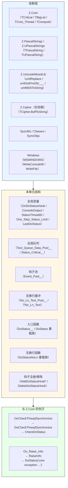
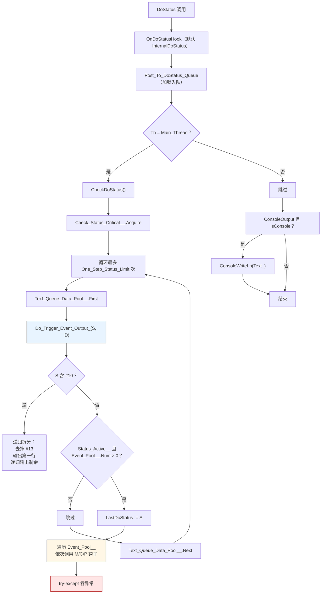
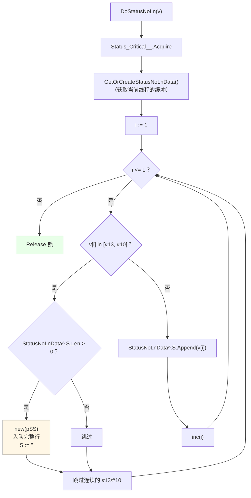

# Z.Status 知识库（最终传承版）

> **定位**：面向 AI 与人类工程师的权威参考。目标是让读者**无需翻阅源码**即可安全、准确地使用 `Z.Status`。
> **承诺**：所有描述均来自 `Z.Status.pas` 的逐行核对。凡我无法从源码确定的，在文末「诚实的不确定清单」中明示。
> **制图约定**：全文流程图/架构图/决策树一律使用 Mermaid，不使用字符制图。

---

## 第 0 章 快速定位：这个单元是什么

`Z.Status` 是 Z 框架的**线程安全状态/日志子系统**。它提供一个集中式消息队列和多种钩子机制，允许任意线程发出状态消息，并由主线程（或任意线程）异步/同步处理。



**核心能力**：

| 能力 | 说明 |
|------|------|
| 任意线程发消息 | `DoStatus` 可从任意线程调用，内部入队 |
| 钩子机制 | 支持 C/M/P 三种风格，多钩子并存 |
| 异步分发 | 消息入队后由 `CheckDoStatus` 统一处理 |
| 同步分发 | 主线程调用 `DoStatus` 时立即处理 |
| 无换行累积 | `DoStatusNoLn` 逐字追加，遇 `#13`/`#10` 时整行发出 |
| 多行拆分 | `Do_Trigger_Event_Output_` 递归拆分多行，每行带线程 ID 前缀 |
| 内存转储 | `DoStatus(@buffer, size, width)` 十六进制行输出 |
| 类型化重载 | Int64 / Integer / Single / Double / Pointer / TMD5 / TPascalString / TUPascalString / SystemString 等 |
| 控制台输出 | Windows 下 `WriteConsoleW`（真控制台）/ `WriteFile`（重定向） |
| 与 Z.Core 集成 | 自动挂钩 `OnCheckThreadSynchronize` 和 `On_Raise_Info` |

**它不是**：
- **不是**完整的日志框架（没有文件轮转、级别过滤、异步刷盘）。
- **不是**持久化的（消息仅存活于内存队列）。
- **不是**零开销的（每次调用都有队列锁和字符串处理）。

---

## 第 1 章 全局变量

### 1.1 全局变量表

```pascal
var
  LastDoStatus: SystemString;         // 最后一条被分发的消息
  ConsoleOutput: Boolean;             // 是否同时输出到控制台（默认 True）
  OnDoStatusHook: TDoStatus_C;        // 默认 InternalDoStatus
  StatusThreadID: Boolean;            // 是否在消息前加 [线程ID] 前缀（默认 True）
  One_Step_Status_Limit: Integer;     // 单次 CheckDoStatus 最多处理的消息数（默认 20）
```

### 1.2 语义

| 变量 | 语义 | 修改建议 |
|------|------|---------|
| `LastDoStatus` | 最后一条实际分发给钩子的消息（**经过多行拆分和线程 ID 前缀处理后的字符串**） | 只读 |
| `ConsoleOutput` | True 时**额外**把消息 `WriteLn` 到控制台 | 可动态切换 |
| `OnDoStatusHook` | **最低层拦截点**，所有 `DoStatus` 最终调用它 | 替换时记得保留原钩子链 |
| `StatusThreadID` | True 时给每条消息加 `[tid] ` 前缀（**多行消息每行都加**） | 可动态切换 |
| `One_Step_Status_Limit` | **防止单次 `CheckDoStatus` 阻塞主线程过久** | 大量消息时增大 |

### 1.3 内部全局变量（不导出）

```pascal
var
  Status_Active__: Boolean;                       // 是否启用
  Event_Pool__: TEvent_Pool__;                    // 钩子池
  Text_Queue_Data_Pool__: TText_Queue_Data_Pool__; // 消息队列
  Status_Critical__: TCritical;                   // 队列互斥锁
  Check_Status_Critical__: TCritical;             // Check 互斥锁
  No_Ln_Text_Pool__: TNo_Ln_Text_Pool__;          // 每线程无换行缓冲
  Hooked_OnCheckThreadSynchronize: TOn_Check_Thread_Synchronize;  // 备份的 Z.Core 钩子
  Hooked_OnRaiseInfo: TOn_Raise_Info;             // 备份的 Z.Core 异常钩子
```

---

## 第 2 章 回调类型

### 2.1 三种回调风格

```pascal
TDoStatus_C = procedure(Text_: SystemString; const ID: Integer);

TDoStatus_M = procedure(Text_: SystemString; const ID: Integer) of object;

{$IFDEF FPC}
  TDoStatus_P = procedure(Text_: SystemString; const ID: Integer) is nested;
{$ELSE FPC}
  TDoStatus_P = reference to procedure(Text_: SystemString; const ID: Integer);
{$ENDIF FPC}
```

| 风格 | 语义 | 捕获上下文 |
|------|------|-----------|
| `_C` | 独立过程 / 类静态方法 | ❌ 无 |
| `_M` | 对象方法 | 通过 `Self` |
| `_P` | 嵌套过程（FPC）/ 匿名方法（Delphi） | ✅ 可捕获局部变量 |

### 2.2 回调参数

| 参数 | 说明 |
|------|------|
| `Text_: SystemString` | 消息文本（**已经过线程 ID 前缀处理**） |
| `ID: Integer` | 用户标识（默认 0），用于分类/过滤 |

---

## 第 3 章 钩子管理

### 3.1 注册钩子

```pascal
procedure AddDoStatusHook(TokenObj: TCore_Object; OnNotify: TDoStatus_M);       // = AddDoStatusHookM
procedure AddDoStatusHookM(TokenObj: TCore_Object; OnNotify: TDoStatus_M);
procedure AddDoStatusHookC(TokenObj: TCore_Object; OnNotify: TDoStatus_C);
procedure AddDoStatusHookP(TokenObj: TCore_Object; OnNotify: TDoStatus_P);
```

**契约**：
- **`TokenObj` 仅用于移除**，不参与调用。
- **多个钩子按添加顺序执行**。
- **钩子池是 `TBigList`，不是线程安全的**——**注册/移除必须在主线程**。
- **同一个 `TokenObj` 可注册多个钩子**，`DeleteDoStatusHook` 会移除所有。

### 3.2 移除钩子

```pascal
procedure DeleteDoStatusHook(TokenObj: TCore_Object);
procedure RemoveDoStatusHook(TokenObj: TCore_Object);   // = DeleteDoStatusHook
```

**契约**：
- 先 `Free_Recycle_Pool` 清理上次的延迟删除项。
- 遍历 `Event_Pool__`，`TokenObj` 匹配的条目 `Push_To_Recycle_Pool`。
- 再次 `Free_Recycle_Pool` 真正释放。

**⚠️ 关键陷阱**：
- **不是线程安全的**，与 `AddDoStatusHook*` 一样，需在主线程调用。
- **移除操作在消息处理过程中调用**（如钩子回调内）会**破坏迭代器**。

### 3.3 钩子执行流程



**关键契约**：
- **`Do_Trigger_Event_Output_` 是递归的**，多行消息会拆成多行。
- **每个钩子的异常被 `try-except` 吞掉**，不影响其他钩子。
- **同一 `TEvent_Struct__` 内的 M/C/P 是三个独立 `if`**，不是 `else if`——**若同时赋值多个，全部执行**（但实际上注册函数保证只有一个非 nil）。

---

## 第 4 章 消息发送

### 4.1 入口函数

```pascal
procedure DoStatus__(Text_: SystemString; const ID: Integer);
procedure DoStatus(Text_: SystemString; const ID: Integer);  // = DoStatus__
```

**契约**：
- **`DoStatus__` 是唯一底层入口**，调用 `OnDoStatusHook(Text_, ID)`。
- **`OnDoStatusHook` 内部异常被 `try-except` 吞掉**。
- **所有 `DoStatus` 重载最终都调用 `DoStatus__`**（除特殊版本如 `DoStatus(v, siz, width)`）。

### 4.2 重载族总览

```mermaid
flowchart TD
    Root["DoStatus__"]
    R1["DoStatus(v: SystemString)"]
    R2["DoStatus(v1,v2: SystemString)"]
    R3["DoStatus(v1,v2,v3: SystemString)"]
    R4["DoStatus(v: TPascalString)"]
    R5["DoStatus(v1,v2: TPascalString)"]
    R6["DoStatus(v1,v2,v3: TPascalString)"]
    R7["DoStatus(v: TUPascalString)"]
    R8["DoStatus(v1,v2: TUPascalString)"]
    R9["DoStatus(v1,v2,v3: TUPascalString)"]
    R10["DoStatus(v: Int64)"]
    R11["DoStatus(v: Integer)"]
    R12["DoStatus(v: Single)"]
    R13["DoStatus(v: Double)"]
    R14["DoStatus(v: TMD5)"]
    R15["DoStatus(v: Pointer; siz: Integer)"]
    R16["DoStatus(v: SystemString; Args: array of const)"]
    R17["DoStatusPtr(v: Pointer)"]
    R18["DoStatus(v: Pointer; siz, width: NativeInt)"]
    R19["DoStatus(prefix: SystemString; v: Pointer; siz, width)"]
    R20["DoStatus(v: TCore_Strings)"]
    R21["DoStatus()"]

    Root --> R1
    Root --> R2
    Root --> R3
    Root --> R4
    Root --> R5
    Root --> R6
    Root --> R7
    Root --> R8
    Root --> R9
    R10 --> R1
    R11 --> R1
    R12 --> R1
    R13 --> R1
    R14 --> R1
    R15 --> R1
    R16 --> R1
    R17 --> R1
    R18 --> R1
    R19 --> R1
    R20 --> R1
    R21 --> CheckDoStatus["CheckDoStatus()"]

    style Root fill:#e8f4ff,stroke:#444
    style R21 fill:#ffe6e6,stroke:#a00
```



### 4.3 字符串重载

| 重载 | 行为 |
|------|------|
| `DoStatus(v: SystemString)` | `DoStatus__(v, 0)` |
| `DoStatus(v1, v2: SystemString)` | `DoStatus__(v1 + v2, 0)` |
| `DoStatus(v1, v2, v3: SystemString)` | `DoStatus__(v1 + v2 + v3, 0)` |
| `DoStatus(v: TPascalString)` | `DoStatus__(v, 0)`（隐式转换） |
| `DoStatus(v: TUPascalString)` | 同上 |
| `DoStatus(v: SystemString; Args: array of const)` | `Format` 后调用 `DoStatus(v)`；**格式化失败输出 `'format text error %s'`** |

### 4.4 数值重载

| 重载 | 转换 |
|------|------|
| `DoStatus(v: Int64)` | `IntToStr(v)` |
| `DoStatus(v: Integer)` | `IntToStr(v)` |
| `DoStatus(v: Single)` | `FloatToStr(v)` |
| `DoStatus(v: Double)` | `FloatToStr(v)` |
| `DoStatusPtr(v: Pointer)` | `Format('0x%p', [v])`；失败静默 |
| `DoStatus(v: TMD5)` | `umlMD5ToString(v).Text` |

### 4.5 内存/列表重载

| 重载 | 行为 |
|------|------|
| `DoStatus(v: Pointer; siz: Integer)` | `TCipher.BuffToString(p, siz)`（**不带换行**） |
| `DoStatus(v: Pointer; siz, width: NativeInt)` | 每行 `width div 2` 字节的十六进制行 |
| `DoStatus(prefix: SystemString; v: Pointer; siz, width)` | 每行加 `prefix` 前缀 |
| `DoStatus(v: TCore_Strings)` | 逐行输出；**若条目有关联对象，追加 `<ClassName>`** |

**`DoStatus(v: TCore_Strings)` 契约**：
- 遍历 `v.Count`。
- 若 `v.Objects[i] <> nil`：输出 `'%s<%s>'`（文本 + `<类名>`）。
- 否则：输出 `v[i]`。

### 4.6 `DoStatus()` 无参重载

```pascal
procedure DoStatus(); overload;
```

**契约**：**仅调用 `CheckDoStatus()`**，不产生新消息。

**⚠️ 用途**：手动触发一次队列处理（例如在工作线程中希望主线程立即处理）。

---

## 第 5 章 消息队列

### 5.1 队列结构

```pascal
TText_Queue_Data = record
  S: SystemString;         // 消息文本
  Th: TCore_Thread;        // 发出消息的线程
  TriggerTime: TTimeTick;  // 入队时间
  ID: Integer;             // 用户标识
end;
PText_Queue_Data = ^TText_Queue_Data;

TText_Queue_Data_Pool__ = class(TBigList<PText_Queue_Data>);
```

**契约**：**`TText_Queue_Data_Pool__` 不是线程安全的**，所有访问都由 `Status_Critical__` 保护。

### 5.2 队列操作函数

```pascal
function  Get_DoStatus_Queue_Num: NativeInt;
procedure Wait_DoStatus_Queue;
procedure CheckDoStatus();
```

**`Get_DoStatus_Queue_Num`**：返回 `Text_Queue_Data_Pool__.Num`（**不加锁**）。

**`Wait_DoStatus_Queue`**：忙等（`while ... do TCompute.Sleep(10)`）。

**`CheckDoStatus` 契约**：
- `Status_Critical__ = nil` 时直接退出（**finalization 期间的防御**）。
- `Check_Status_Critical__` 保证同一时刻只有一个 Check 在执行。
- 每次最多处理 `One_Step_Status_Limit` 条。
- 每条消息处理前后都加锁。

### 5.3 `Post_To_DoStatus_Queue`

```pascal
procedure Post_To_DoStatus_Queue(Th: TCore_Thread; Text_: SystemString; const ID: Integer);
```

**契约**：
- `new(pSS)` 分配队列节点。
- **`StatusThreadID=True` 时**：`pSS^.S := '[tid] ' + umlReplace(Text_, #10, #10 + '[tid] ', ...)`。
  - **多行消息的每行都带前缀**。
- **`StatusThreadID=False` 时**：`pSS^.S := Text_`（原样）。
- 加 `Status_Critical__` 锁后 `Add`。

**⚠️ 关键陷阱**：`Post_To_DoStatus_Queue` 是**公开的**，可绕过 `OnDoStatusHook` 直接入队。

---

## 第 6 章 无换行输出

### 6.1 数据结构

```pascal
TNo_Ln_Text = record
  S: TPascalString;       // 累积文本
  Th: TCore_Thread;       // 所属线程
  TriggerTime: TTimeTick; // 最后更新时间
end;
PNo_Ln_Text = ^TNo_Ln_Text;

TNo_Ln_Text_Pool__ = class(TBigList<PNo_Ln_Text>);
```

### 6.2 API

```pascal
procedure DoStatusNoLn(const v: TPascalString);
procedure DoStatusNoLn(const v: SystemString; const Args: array of const);
procedure DoStatusNoLn;
```

**`DoStatusNoLn(v: TPascalString)` 执行流程**：



**关键契约**：
- **整个函数持有 `Status_Critical__` 锁**。
- **遇到换行符时**：若缓冲区非空，**整行入队**（ID=0），然后清空缓冲。
- **连续换行符被合并为一个**（`repeat inc(i) until ...`）。
- **`DoStatusNoLn` 无参版本**：把当前缓冲区内容作为一条完整消息发出（**不加换行**）。

### 6.3 自动回收

**`GetOrCreateStatusNoLnData_` 的自动回收机制**：
- 遍历 `No_Ln_Text_Pool__`。
- **当前线程匹配**：更新 `TriggerTime`，复用。
- **超过 `C_Tick_Minute`（1 分钟）未更新**：`Push_To_Recycle_Pool`。
- 最后 `Free_Recycle_Pool` 释放。

**契约**：
- **`1 分钟` 是硬编码的**（`C_Tick_Minute`）。
- **`DoStatusNoLn` 无参版本不会更新 `TriggerTime`**（因为它不调用 `GetOrCreateStatusNoLnData_`？——**实际上会调用**，所以会更新）。

**⚠️ 关键陷阱**：如果某线程的 `DoStatusNoLn` 缓冲区超过 1 分钟未使用，会被自动回收——**未发出的累积文本会丢失**。

---

## 第 7 章 消息分发核心

### 7.1 `Do_Trigger_Event_Output_`

```pascal
procedure Do_Trigger_Event_Output_(const Text_: U_String; const ID: Integer);
```

**契约**：
- **多行拆分**：
  - `Text_.Exists(#10)` 时：
    - 去掉 `#13`。
    - `Do_Trigger_Event_Output_(第一行, ID)`。
    - 递归处理剩余部分。
- **单行处理**：
  - 若 `Status_Active__` 且 `Event_Pool__.Num > 0`：
    - `LastDoStatus := Text_`。
    - 遍历钩子池，依次调用 `OnStatusM` / `OnStatusC` / `OnStatusP`。
    - **每个钩子的异常被吞掉**。

**⚠️ 递归陷阱**：**`#10` 拆分是递归的**——**大量的换行符会导致栈深**。

### 7.2 `InternalDoStatus`

```pascal
procedure InternalDoStatus(Text_: SystemString; const ID: Integer);
```

**执行流程**：
1. `if not Status_Active__ then exit`。
2. `Th := TCore_Thread.CurrentThread`。
3. `Post_To_DoStatus_Queue(Th, Text_, ID)`（入队）。
4. **`if Th = Main_Thread then CheckDoStatus()`**（主线程立即处理）。
5. **`if ConsoleOutput and IsConsole then`**：
   - 加 `Status_Critical__` 锁。
   - `ConsoleWriteLn(Text_)`。

**关键契约**：
- **工作线程只入队**，处理由主线程的 `CheckDoStatus` 完成。
- **主线程同步处理**（可能有性能影响）。
- **控制台输出在锁内**（避免多线程交错）。

**⚠️ 潜在的递归**：
- `InternalDoStatus`（主线程） → `CheckDoStatus` → `Do_Trigger_Event_Output_` → 钩子。
- 若钩子内部调用 `DoStatus` → 再次进入 `InternalDoStatus` → 再次 `CheckDoStatus`（**因为仍在主线程**）。
- **可能导致无限递归或栈溢出**。

---

## 第 8 章 启用/禁用

```pascal
procedure DisableStatus;
procedure EnabledStatus;

function Is_EnabledStatus: Boolean;
function Is_DisableStatus: Boolean;
```

**契约**：
- `DisableStatus` 设 `Status_Active__ := False`。
- `EnabledStatus` 设 `Status_Active__ := True`。
- **禁用时 `InternalDoStatus` 直接返回**——不入队、不输出。
- **`OnDoStatusHook` 被替换成其他函数时，禁用逻辑失效**——需替换者自行处理。

**⚠️ 关键陷阱**：
- **`DisableStatus` 不阻止 `DoStatus__` 调用 `OnDoStatusHook`**，只是让默认的 `InternalDoStatus` 短路。
- **队列中已有消息不会因禁用而清除**——重新启用后会继续处理。

---

## 第 9 章 控制台输出

### 9.1 `ConsoleWrite` / `ConsoleWriteLn`

```pascal
procedure ConsoleWrite(const S: string);
procedure ConsoleWriteLn(const S: string);
```

**契约**：
- **非控制台环境直接返回**（`IsConsole=False`）。
- **Windows**：
  - 用 `GetStdHandle(STD_OUTPUT_HANDLE)` 获取句柄。
  - 若 `GetConsoleMode` 成功（真控制台）：用 `WriteConsoleW` 输出 Unicode。
  - 否则（重定向到管道/文件）：用 `WriteFile` 输出 UTF-8 字节。
- **非 Windows**：直接 `Write(UTF8Str)`。

**`ConsoleWriteLn`**：
- `ConsoleWrite(S)`。
- **Windows**：再 `ConsoleWrite(sLineBreak)`。
- **非 Windows**：`WriteLn()`。

**关键设计**：
- **真控制台用 `WriteConsoleW`**：正确处理宽字符。
- **重定向用 `WriteFile`**：UTF-8 字节流，父进程可捕获。
- **解决了 `WriteConsoleW` 绕过 stdout 重定向的问题**。

### 9.2 `InternalDoStatus` 中的控制台输出

**契约**：
- **在 `Status_Critical__` 锁内调用 `ConsoleWriteLn`**。
- **FPC 下**：`ConsoleWriteLn(Text_)`。
- **Delphi 下**：`WriteLn(Text_)`（**不使用 `ConsoleWriteLn`**）。

**⚠️ 平台差异**：FPC 与 Delphi 的控制台输出路径不同。FPC 用 `ConsoleWriteLn`，Delphi 用 `WriteLn`（依赖 RTL 的 Unicode 处理）。

---

## 第 10 章 与 Z.Core 的钩子

### 10.1 双钩子安装

```pascal
procedure _DoInit;
begin
  ...
  Hooked_OnCheckThreadSynchronize := Z.Core.OnCheckThreadSynchronize;
  Z.Core.OnCheckThreadSynchronize := DoCheckThreadSynchronize;
  Hooked_OnRaiseInfo := Z.Core.On_Raise_Info;
  Z.Core.On_Raise_Info := RaiseInfo;
end;
```

**`DoCheckThreadSynchronize`**：
1. `CheckDoStatus()` 处理队列。
2. 调用原 `Hooked_OnCheckThreadSynchronize`（若存在）。

**`RaiseInfo`**：
- `DoStatus('core exception ' + n)`。

**契约**：
- **`OnCheckThreadSynchronize` 是单指针钩子**（见 Z.Core 知识库）。
- **若用户在本单元初始化后覆盖 `OnCheckThreadSynchronize`**，会破坏本单元的钩子。
- **`On_Raise_Info` 同理**。

### 10.2 卸载

```pascal
procedure _DoFree;
begin
  ...
  Z.Core.OnCheckThreadSynchronize := Hooked_OnCheckThreadSynchronize;
  Z.Core.On_Raise_Info := Hooked_OnRaiseInfo;
end;
```

**契约**：**恢复原始钩子**，保证其他单元（如 `Z.Notify`）能继续工作。

---

## 第 11 章 完整使用范式

### 11.1 最简单的日志

```pascal
uses Z.Status;

begin
  DoStatus('Hello, world!');
  DoStatus('Error occurred', 1);
end;
```

### 11.2 添加自定义钩子

```pascal
type
  TMyLogger = class
    procedure LogToMemo(Text_: SystemString; const ID: Integer);
  end;

procedure TMyLogger.LogToMemo(Text_: SystemString; const ID: Integer);
begin
  Memo1.Lines.Add(Format('[%d] %s', [ID, Text_]));
end;

var
  Logger: TMyLogger;
begin
  Logger := TMyLogger.Create;
  AddDoStatusHookM(Logger, Logger.LogToMemo);
  // ...
  DeleteDoStatusHook(Logger);   // 移除
  Logger.Free;
end;
```

### 11.3 匿名钩子

```pascal
AddDoStatusHookP(Self,
  procedure(Text_: SystemString; const ID: Integer)
  begin
    if ID > 0 then
      WriteLn('Error: ' + Text_);
  end
);
```

### 11.4 无换行进度

```pascal
DoStatusNoLn('Processing: ');
for i := 1 to 100 do
  begin
    DoStatusNoLn('.');
    if i mod 10 = 0 then
      DoStatusNoLn(' ' + IntToStr(i) + '%' + #13#10);   // 换行刷新
  end;
DoStatusNoLn;   // 强制刷新残留
```

### 11.5 内存转储

```pascal
var
  Buffer: array[0..63] of Byte;
begin
  // 填充 Buffer
  DoStatus(@Buffer, 64, 16);           // 每行 16 字节
  DoStatus('Data: ', @Buffer, 64, 16); // 带前缀
end;
```

### 11.6 等待队列清空

```pascal
DoStatus('Final message');
Wait_DoStatus_Queue;   // 忙等直到队列空
```

### 11.7 禁用/启用

```pascal
DisableStatus;
try
  // 关键区，不输出日志
  ...
finally
  EnabledStatus;
end;
```

---

## 第 12 章 反例集

### 12.1 在 `OnDoStatusHook` 中抛异常

```pascal
// ❌ 错误
OnDoStatusHook := procedure(Text_: SystemString; const ID: Integer)
  begin
    raise Exception.Create('boom');   // 被 DoStatus__ 的 try-except 吞掉
  end;
```

**✅ 正确**：不要在 `OnDoStatusHook` 中抛异常，因为异常会被静默吞掉，无法排查。

### 12.2 钩子中调用 `DoStatus`

```pascal
// ⚠️ 危险：主线程中可能递归
AddDoStatusHookC(Self, procedure(Text_: SystemString; const ID: Integer)
  begin
    DoStatus('logged: ' + Text_);   // ⚠️ 递归
  end);
```

**✅ 正确**：钩子中避免调用 `DoStatus`，用其他日志通道。

### 12.3 `DeleteDoStatusHook` 在钩子内

```pascal
// ❌ 错误：在钩子回调中删除自己
AddDoStatusHookC(Self, procedure(Text_: SystemString; const ID: Integer)
  begin
    DeleteDoStatusHook(Self);   // ❌ 破坏迭代器
  end);
```

**✅ 正确**：在钩子外调用 `DeleteDoStatusHook`，或用 `TCompute.Post` 延后。

### 12.4 `DoStatusNoLn` 后忘记刷新

```pascal
// ❌ 错误：进度信息一直不显示
DoStatusNoLn('Progress: ');
// ... 大量操作 ...
// 缓冲区未发出
```

**✅ 正确**：结束时调用 `DoStatusNoLn`（无参）或 `DoStatusNoLn(#13#10)`。

### 12.5 禁用期间累积大量消息

```pascal
// ⚠️ 禁用期间消息仍会入队
DisableStatus;
try
  for i := 1 to 1000000 do
    DoStatus(IntToStr(i));   // 全部入队，内存暴涨
finally
  EnabledStatus;
end;
```

**✅ 正确**：禁用期间也避免海量 `DoStatus`。

### 12.6 `Wait_DoStatus_Queue` 在工作线程

```pascal
// ❌ 错误：工作线程等待队列清空
TCompute.RunC_NP(procedure
  begin
    DoStatus('从工作线程发出');
    Wait_DoStatus_Queue;   // ❌ 死锁！主线程不 Check，队列永不空
  end);
```

**✅ 正确**：`Wait_DoStatus_Queue` 只在主线程或确定主线程会 Check 的场景使用。

### 12.7 `OnDoStatusHook` 被替换后禁用失效

```pascal
// ⚠️ 替换后 DisableStatus 不再影响该钩子
OnDoStatusHook := MyCustomHook;
DisableStatus;   // ⚠️ 只影响 InternalDoStatus，不影响 MyCustomHook
```

**✅ 正确**：自定义钩子内部也检查 `Is_DisabledStatus`。

### 12.8 内存转储的 `width` 参数

```pascal
// ⚠️ width 必须为偶数
DoStatus(@buf, 64, 3);   // ❌ 每行 3 字节，实际按 width div 2 = 1 字节换行
```

**✅ 正确**：`width` 用 8 / 16 / 32 等偶数。

### 12.9 `DoStatus(const v: Pointer; siz, width)` 的行拆分

```pascal
// ⚠️ 内部 n := n + ' ' + ... 用空格分隔每字节
// 所以输出形如 "AA BB CC DD ..."
```

### 12.10 `TCore_Strings` 中的对象

```pascal
// ⚠️ 若 Objects[i] 已被释放但未置 nil
sl.AddObject('item', SomeObj);
SomeObj.Free;   // ⚠️ sl.Objects[i] 仍指向已释放对象
DoStatus(sl);   // ❌ 访问已释放对象
```

**✅ 正确**：手动管理 `Objects` 的生命周期。

---

## 第 13 章 常见错误对照表

| 现象 | 根因 | 修正 |
|------|------|------|
| 钩子未执行 | 未在主线程添加 | `AddDoStatusHook*` 在主线程 |
| 移除钩子崩溃 | 在钩子内调用 `DeleteDoStatusHook` | 延后到钩子外 |
| 无换行消息丢失 | 超过 1 分钟未更新 | 及时刷新或减少间隔 |
| `Wait_DoStatus_Queue` 死锁 | 工作线程等待队列空 | 只在主线程调用 |
| 内存暴涨 | 禁用期间海量 `DoStatus` | 减少禁用期间的调用 |
| 控制台无输出 | `IsConsole=False` | 检查编译目标 |
| 重定向到文件乱码 | 未用 UTF-8 | Windows 下用 `ConsoleWrite` |
| 多行消息行前缀重复 | `StatusThreadID=True` | 正常行为 |
| 队列处理不及时 | `One_Step_Status_Limit` 太小 | 增大 |
| `OnDoStatusHook` 抛异常被吞 | 设计如此 | 钩子中不要抛异常 |
| `On_Raise_Info` 被覆盖 | 用户修改了 `Z.Core.On_Raise_Info` | 不要覆盖 |
| `OnCheckThreadSynchronize` 被覆盖 | 用户修改了 `Z.Core.OnCheckThreadSynchronize` | 用 `Hooked_OnCheckThreadSynchronize` 链式 |
| `DoStatus()` 无参刷新 | 手动触发 `CheckDoStatus` | 正常行为 |
| `DoStatus(v, siz, width)` 输出错乱 | `width` 非偶数 | 用 8/16/32 |
| `TCore_Strings` 输出崩溃 | 关联对象已释放 | 先置 nil |

---

## 第 14 章 诚实的不确定清单

> 以下是我从源码**无法完全确定**的点。若 AI 需要在这些场景下工作，**必须回查源码或询问人类**。

1. **`Do_Trigger_Event_Output_` 中 `#10` 拆分的递归深度**
   - 源码：`Do_Trigger_Event_Output_(tmp, ID)` 递归调用。
   - **不确定**：含大量换行的消息是否会栈溢出。
   - **推测**：普通消息不会，但极端情况可能。

2. **`DoStatus__` 调用 `OnDoStatusHook` 时的 `try-except`**
   - 源码：`try OnDoStatusHook(Text_, ID); except end;`。
   - **不确定**：异常信息是否被记录。
   - **推测**：**完全静默**。

3. **`ConsoleWrite` 在非 Windows 下的 UTF-8 处理**
   - 源码：`Write(UTF8Str)`。
   - **不确定**：`Write` 是否接受 UTF8String。
   - **推测**：接受（FPC 的 `Write` 处理 `UTF8String`）。

4. **`InternalDoStatus` 中 FPC 与 Delphi 的分支差异**
   - 源码：FPC 用 `ConsoleWriteLn(Text_)`，Delphi 用 `WriteLn(Text_)`。
   - **不确定**：Delphi 的 `WriteLn` 在 Unicode 下的行为。
   - **推测**：依赖 RTL 的 `IsConsole` 和 `WriteLn` 的编码处理。

5. **`DoStatusNoLn` 无参版本是否更新 `TriggerTime`**
   - 源码：调用 `GetOrCreateStatusNoLnData()`，内部更新 `TriggerTime := Tick`。
   - **不确定**：是否因此延长了缓冲生命周期。
   - **推测**：**是**。

6. **`DisableStatus` 是否影响正在处理中的消息**
   - 源码：`Status_Active__` 只在 `Do_Trigger_Event_Output_` 中检查。
   - **不确定**：禁用后队列中已有消息是否继续分发。
   - **推测**：**继续分发**（因为检查是在分发时）。

7. **`DoStatus` 的 `format` 失败回退**
   - 源码：`except DoStatus('format text error %s', [v]);`。
   - **不确定**：递归调用是否可能再次失败。
   - **推测**：`'format text error %s'` 用字面量，不会失败。

8. **`AddDoStatusHook*` 与 `DeleteDoStatusHook` 的线程安全**
   - 源码：直接操作 `Event_Pool__`，无锁。
   - **不确定**：是否需外部加锁。
   - **推测**：**必须在主线程调用**。

9. **`Event_Pool__.Push_To_Recycle_Pool` 与 `Free_Recycle_Pool` 的时机**
   - 源码：`RemoveDoStatusHook` 中先 Free 再遍历再 Free。
   - **不确定**：两次 Free 是否必要。
   - **推测**：第一次清理上次残留，第二次清理本次标记。

10. **`TNo_Ln_Text_Pool__` 的自动回收阈值**
    - 源码：`Tick - Queue^.Data^.TriggerTime > C_Tick_Minute`。
    - **不确定**：`C_Tick_Minute` 的具体值（Z.Core 常量）。
    - **推测**：`60 * 1000`（1 分钟）。

11. **`GetOrCreateStatusNoLnData_` 遍历时的删除**
    - 源码：遍历中调用 `Push_To_Recycle_Pool`，但不在遍历中立即删除。
    - **不确定**：是否安全。
    - **推测**：安全，因为 `Push_To_Recycle_Pool` 只标记。

12. **`CheckDoStatus` 的 `One_Step_Status_Limit` 为 0 时的行为**
    - 源码：`while ... and (i < One_Step_Status_Limit)`。
    - **不确定**：`One_Step_Status_Limit=0` 时是否不处理任何消息。
    - **推测**：**是**。

13. **`Wait_DoStatus_Queue` 的忙等开销**
    - 源码：`while ... do TCompute.Sleep(10)`。
    - **不确定**：10ms 是否最优。
    - **推测**：经验值。

14. **`DoStatus(const v: Pointer; siz, width)` 中 `width div 2` 的语义**
    - 源码：`i mod (width div 2) = 0` 时换行。
    - **不确定**：为何是 `width div 2` 而非 `width`。
    - **推测**：因为每字节输出两个十六进制字符。

15. **`TCore_Strings` 的 `Objects` 生命周期**
    - 源码：只读取 `Objects[i]`，不释放。
    - **不确定**：用户是否需自行管理。
    - **推测**：**是**。

16. **`Post_To_DoStatus_Queue` 的公开性**
    - 源码：`procedure Post_To_DoStatus_Queue(...)` 在 interface 中声明。
    - **不确定**：是否推荐用户直接调用。
    - **推测**：**不推荐**，应通过 `DoStatus__`。

17. **`DoStatus()` 无参版本的实际用途**
    - 源码：只调用 `CheckDoStatus()`。
    - **不确定**：典型使用场景。
    - **推测**：手动触发队列处理（例如在工作线程中需要主线程立刻处理）。

18. **`On_Raise_Info` 钩子的签名**
    - 源码：`procedure RaiseInfo(const n: string)`。
    - **不确定**：与 `Z.Core.On_Raise_Info` 的类型是否一致。
    - **推测**：一致（`TOn_Raise_Info`）。

19. **`ConsoleWrite` 中 `WriteFile` 的参数**
    - 源码：`WriteFile(StdHandle, Pointer(UTF8Str)^, Length(UTF8Str), Written, nil)`。
    - **不确定**：`Pointer(UTF8Str)^` 在空字符串时的行为。
    - **推测**：安全（`Length=0` 时 `WriteFile` 忽略缓冲区）。

20. **`DoStatus(v: SystemString; Args: array of const)` 中 `Format` 的异常**
    - 源码：`except DoStatus('format text error %s', [v]);`。
    - **不确定**：为何用 `'%s'` 而非 `'format text error'`。
    - **推测**：保留原始格式串便于排查。

---

## 第 15 章 结语

### 15.1 本知识库覆盖范围

- **已精确描述**：
  - `TDoStatus_C/M/P` 三种回调类型。
  - `AddDoStatusHook*` / `DeleteDoStatusHook` / `RemoveDoStatusHook` 钩子管理。
  - `DoStatus__` / `DoStatus` 全部重载（字符串 / 数值 / 指针 / MD5 / TCore_Strings / 内存转储 / 格式化）。
  - `DoStatusNoLn` 无换行累积与自动回收。
  - `CheckDoStatus` / `Wait_DoStatus_Queue` / `Get_DoStatus_Queue_Num` 队列管理。
  - `DisableStatus` / `EnabledStatus` / `Is_EnabledStatus` / `Is_DisableStatus` 启用控制。
  - `InternalDoStatus` / `Post_To_DoStatus_Queue` / `Do_Trigger_Event_Output_` 内部机制。
  - `ConsoleWrite` / `ConsoleWriteLn` 平台相关实现。
  - 与 `Z.Core` 的 `OnCheckThreadSynchronize` / `On_Raise_Info` 双钩子集成。
  - 全局变量（`LastDoStatus` / `ConsoleOutput` / `OnDoStatusHook` / `StatusThreadID` / `One_Step_Status_Limit`）。

- **已纠正的常见幻觉**：
  - **`DoStatus__` 是唯一底层入口**，异常被吞掉。
  - **`OnDoStatusHook` 默认是 `InternalDoStatus`**，替换后需自行处理。
  - **`DoStatusNoLn` 的缓冲区 1 分钟不用会被回收**。
  - **`Do_Trigger_Event_Output_` 递归拆分多行**，可能导致栈深。
  - **`CheckDoStatus` 每次处理最多 `One_Step_Status_Limit` 条**。
  - **`ConsoleWrite` 在 Windows 下区分真控制台与重定向**。
  - **`OnCheckThreadSynchronize` / `On_Raise_Info` 是单指针钩子**，会链式调用。
  - **`AddDoStatusHook*` / `DeleteDoStatusHook` 必须主线程调用**。
  - **`DoStatusNoLn` 无参版本会刷新缓冲区**。
  - **`DisableStatus` 只影响 `InternalDoStatus`**。

- **未覆盖**：
  - 源码中的 20 个不确定点。
  - `Z.Core` / `Z.PascalStrings` / `Z.UnicodeMixedLib` / `Z.Cipher` 的内部实现。
  - 除 `Z.Status` 之外的单元。

### 15.2 给 AI 的使用规则

1. **`DoStatus` 可从任意线程调用**，内部入队。
2. **钩子注册/移除必须在主线程**。
3. **钩子中不要抛异常**，会被静默吞掉。
4. **钩子中避免调用 `DoStatus`**，可能递归。
5. **`DoStatusNoLn` 后记得刷新**。
6. **`Wait_DoStatus_Queue` 只在主线程或确定主线程 Check 时用**。
7. **替换 `OnDoStatusHook` 时**，注意 `DisableStatus` 失效。
8. **不要覆盖 `Z.Core.OnCheckThreadSynchronize` / `On_Raise_Info`**。
9. **`TCore_Strings` 输出时**，`Objects[i]` 必须有效。
10. **内存转储的 `width` 用偶数**。
11. **遇到不确定清单里的场景，请查源码或问人**。

### 15.3 与 Z.Core 的衔接

- 使用本单元前，请先读 Z.Core 知识库第 1、2、5 章。
- 本单元的 `OnCheckThreadSynchronize` 钩子会与 `Z.Notify` 的钩子**链式协作**。
- `TCritical` / `TBigList` / `TCore_Thread` / `TCompute` 来自 `Z.Core`。
- `TPascalString` / `TUPascalString` 来自 `Z.PascalStrings` / `Z.UPascalStrings`。
- `umlReplace` / `umlMD5ToString` / `umlGetFirstStr___` / `umlDeleteFirstStr___` 来自 `Z.UnicodeMixedLib`。
- `TCipher.BuffToString` 来自 `Z.Cipher`（实现期依赖）。

---

**本知识库的定位**：一份**准确的、有边界的、可操作的** `Z.Status` 参考。它不假装能替代源码，但能让你在 90% 的场景下正确使用，并在剩下 10% 的场景下知道该停下来问人。