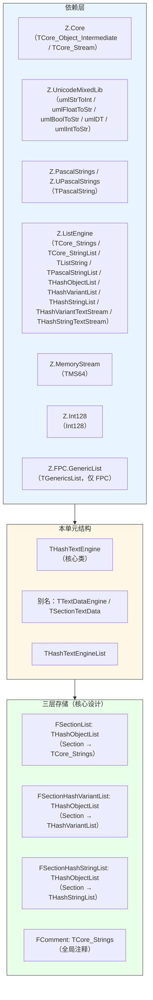
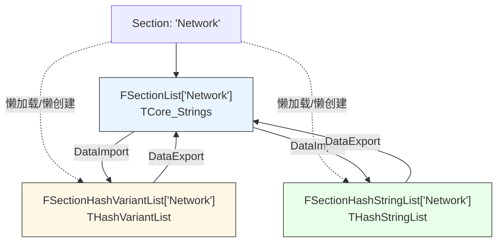
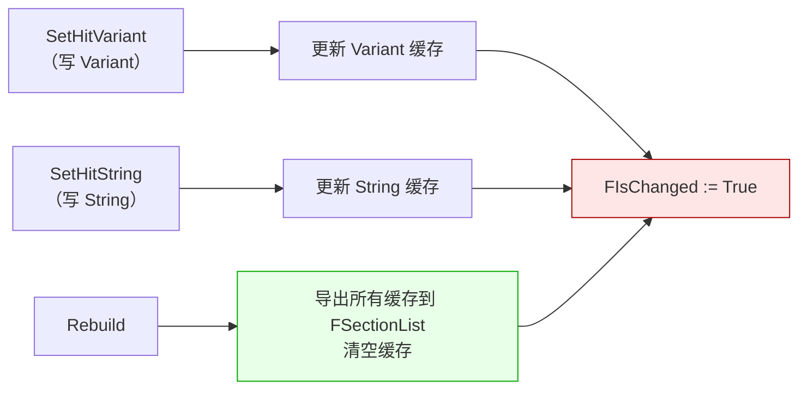
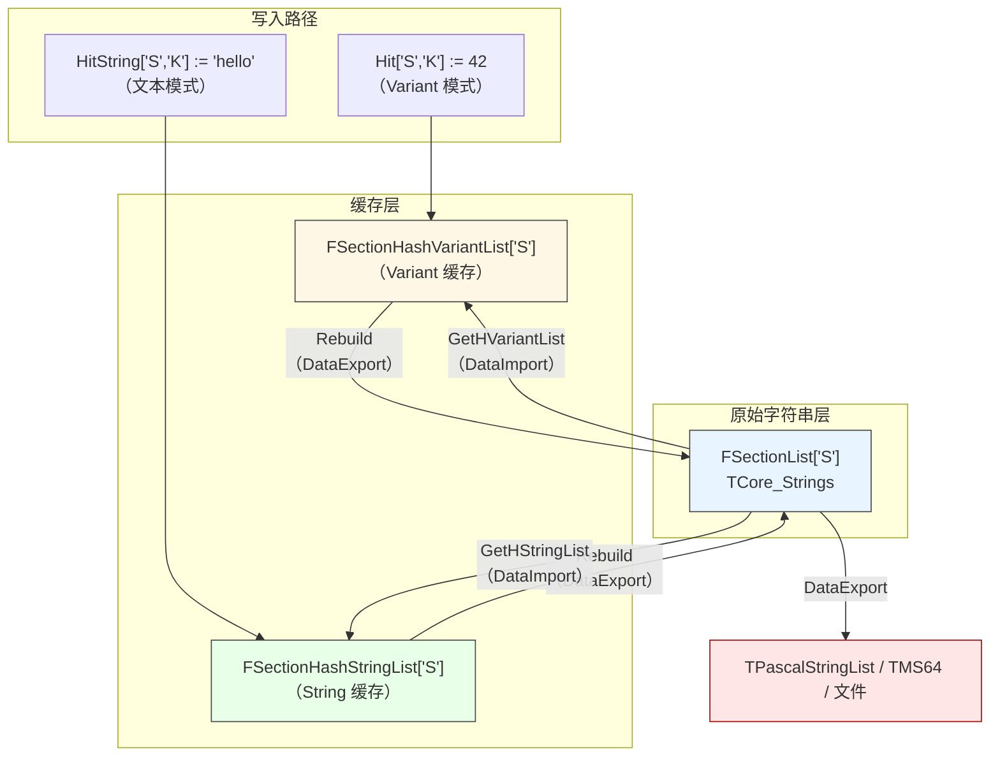
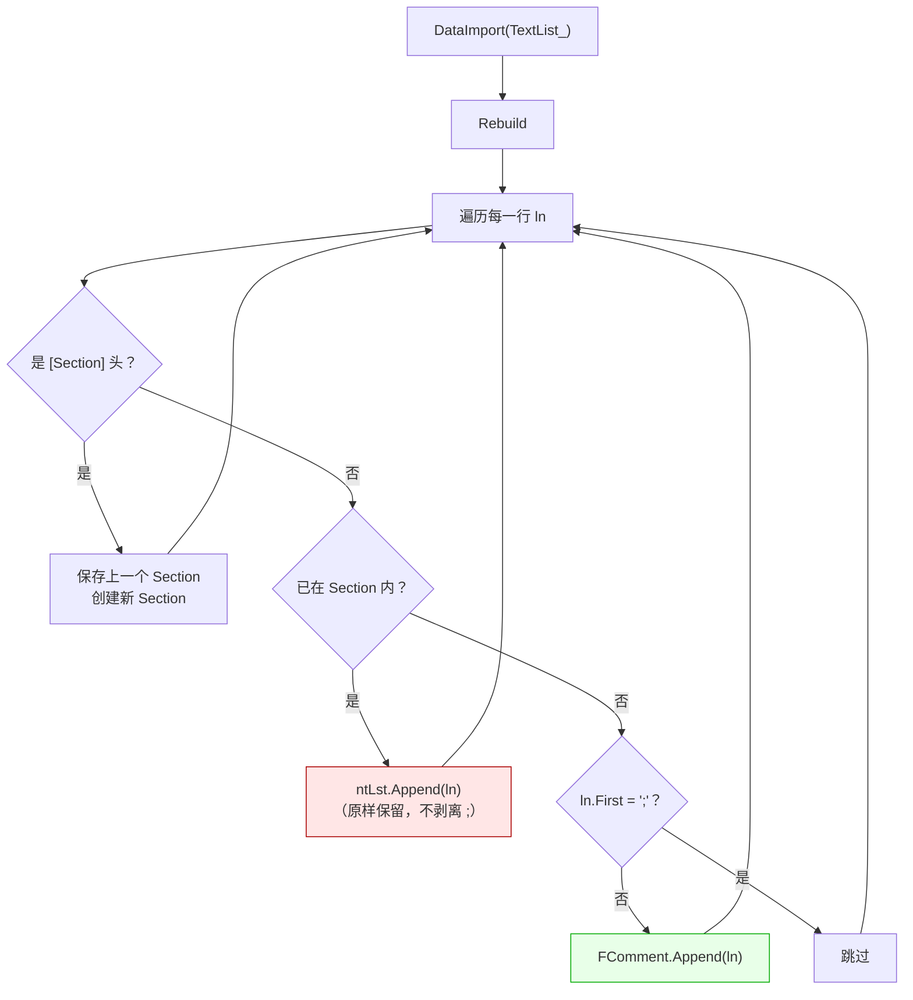
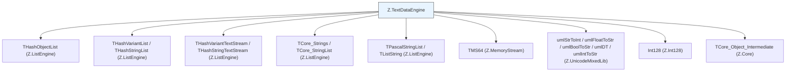

# Z.TextDataEngine 知识库（最终传承版）

> **定位**：面向 AI 与人类工程师的权威参考。目标是让读者**无需翻阅源码**即可安全、准确地使用 `Z.TextDataEngine`。
> **承诺**：所有描述均来自 `Z.TextDataEngine.pas` 的逐行核对。凡我无法从源码确定的，在文末「诚实的不确定清单」中明示。
> **制图约定**：全文流程图/架构图/决策树一律使用 Mermaid，不使用字符制图。

---

## 第 0 章 快速定位：这个单元是什么

`Z.TextDataEngine` 是 Z 框架的 **INI 风格配置引擎**。它通过 **Section（节）+ Key（键）** 组织数据，支持 **Variant 模式** 和 **纯文本模式**，并提供懒加载缓存、类型化访问、注释保留、流/文件持久化、合并克隆等功能。



**核心能力**：

| 能力 | 说明 |
|------|------|
| Section/Key 组织 | 每个 Section 是一组 `key=value` 行 |
| 三层存储 | 原始字符串 / Variant 缓存 / String 缓存 |
| 懒加载 | 首次访问某 Section 时才解析原始字符串 |
| Variant 模式 | `Hit['S','K'] := 42` 存为整数 Variant |
| 文本模式 | `HitString['S','K'] := '42'` 存为字符串 |
| 类型化 Getter | `GetDefaultText_I32/I64/I128/Float/Bool/DT` |
| 注释处理 | 导入时自动剥离 `;` 后面的内容，全局注释保存在 `Comment` |
| 流/文件 I/O | `SaveToStream` / `LoadFromStream` / `SaveToFile` / `LoadFromFile` |
| 合并/克隆/比较 | `Merge` / `Assign` / `Clone` / `Same` |
| 交换实例 | `SwapInstance`（O(1) 交换所有内部字段） |

**它不是**：
- **不是**线程安全的（多线程访问需外部加锁）。
- **不是**持久化的（只在内存中，除非显式保存）。
- **不是**类型安全的（Variant 模式可存任意类型，读取时行为依赖底层）。
- **不是**键级注释保留的（导入时剥离，无键级注释存储）。

---

## 第 1 章 三种存储层

### 1.1 三层结构



**各层的职责**：

| 层 | 类型 | 存储 | 用途 |
|----|------|------|------|
| **原始字符串层** | `FSectionList: THashObjectList` | `TCore_Strings`（每行 `key=value`） | 持久化基础、导出源 |
| **Variant 缓存层** | `FSectionHashVariantList: THashObjectList` | `THashVariantList` | Variant 模式快速访问 |
| **String 缓存层** | `FSectionHashStringList: THashObjectList` | `THashStringList` | 文本模式快速访问 |
| **注释层** | `FComment: TCore_Strings` | `TCore_Strings` | 全局注释 |

### 1.2 懒加载机制

**关键契约**：
- **首次通过 `Hit[]` 访问某 Section 时**：
  1. 检查 `FSectionHashVariantList[SName]` 是否存在。
  2. 不存在则从 `FSectionList[SName]`（原始字符串）解析为 `THashVariantList`。
  3. 缓存到 `FSectionHashVariantList[SName]`。
- **首次通过 `HitString[]` 访问某 Section 时**：同理，缓存到 `FSectionHashStringList`。
- **`Rebuild`**：把所有缓存层的数据导出回 `FSectionList`，并清空缓存。

### 1.3 三层数据同步



**⚠️ 重大陷阱**：
- **写 Variant 模式时不会自动更新 String 缓存**（反之亦然）。
- **同一 Section/Key 混用两种模式会导致数据不一致**。
- **只有 `Rebuild` 或导出时才会把缓存写回 `FSectionList`**。

---

## 第 2 章 `THashTextEngine` 完整 API

### 2.1 字段

```pascal
THashTextEngine = class(TCore_Object_Intermediate)
private
  FComment: TCore_Strings;                       // 全局注释
  FSectionList: THashObjectList;                 // 原始字符串层
  FSectionHashVariantList: THashObjectList;      // Variant 缓存层
  FSectionHashStringList: THashObjectList;       // String 缓存层
  FAutoUpdateDefaultValue: Boolean;              // GetDefaultValue 是否自动存储默认值
  FSectionPoolSize, FListPoolSize: Integer;      // 哈希桶大小
  FIsChanged: Boolean;                           // 是否已修改
end;
```

### 2.2 构造函数

```pascal
constructor Create;                                                     // 16, 16
constructor Create(SectionPoolSize_: Integer);                          // SectionPoolSize, 16
constructor Create(SectionPoolSize_, ListPoolSize_: Integer);
destructor  Destroy; override;
```

**契约**：
- `Create` 等价于 `Create(16, 16)`。
- `FSectionList` / `FSectionHashVariantList` / `FSectionHashStringList` 都是 `THashObjectList.CustomCreate(True, SectionPoolSize_)`（**AutoFreeData=True**）。
- `FComment` 是 `TCore_StringList`。
- `FAutoUpdateDefaultValue := False`。
- `FIsChanged := False`。
- **析构时 `Clear` + 释放所有层**。

### 2.3 属性

```pascal
property IsChanged: Boolean read FIsChanged write FIsChanged;
property AutoUpdateDefaultValue: Boolean read FAutoUpdateDefaultValue write FAutoUpdateDefaultValue;
property Comment: TCore_Strings read FComment write FComment;

property Hit[SName, VName: SystemString]: Variant read GetHitVariant write SetHitVariant; default;
property HitVariant[SName, VName: SystemString]: Variant read GetHitVariant write SetHitVariant;
property HitString[SName, VName: SystemString]: SystemString read GetHitString write SetHitString;
property HitS[SName, VName: SystemString]: SystemString read GetHitString write SetHitString;
property SHit[SName, VName: SystemString]: SystemString read GetHitString write SetHitString;

property Names[N_: SystemString]: TCore_Strings read GetNames write SetNames;
property Strings[N_: SystemString]: TCore_Strings read GetNames write SetNames;

property VariantList[N_: SystemString]: THashVariantList read GetHVariantList;
property HVariantList[N_: SystemString]: THashVariantList read GetHVariantList;
property StringList[N_: SystemString]: THashStringList read GetHStringList;
property HStringList[N_: SystemString]: THashStringList read GetHStringList;

property Count: Integer read TotalCount;
property MaxSectionNameLen: Integer read MaxSectionNameSize;
property MinSectionNameLen: Integer read MinSectionNameSize;
property AsText: SystemString read GetAsText write SetAsText;
```

**关键契约**：

| 属性 | 语义 |
|------|------|
| `Hit`（默认） | Variant 模式读写；**不存在时读返回 `Null`** |
| `HitString` / `HitS` / `SHit` | 文本模式读写；**不存在时读返回 `''`** |
| `Names` / `Strings` | 原始字符串列表；**不存在时自动创建空 `TCore_StringList`** |
| `VariantList` / `HVariantList` | Variant 缓存列表；**懒创建并填充** |
| `StringList` / `HStringList` | String 缓存列表；**懒创建并填充** |

### 2.4 只读查询

```pascal
function  Exists(Section_: SystemString): Boolean;
function  ExistsKey(Section_, Key_: SystemString): Boolean;
function  TotalCount: Integer;
function  MaxSectionNameSize: Integer;
function  MinSectionNameSize: Integer;
function  GetAsText: SystemString;
procedure SetAsText(const Value: SystemString);
function  GetSectionNameArry: U_StringArray;
procedure GetSectionList(dest: TCore_Strings); overload;
procedure GetSectionList(dest: TListString); overload;
procedure GetSectionList(dest: TPascalStringList); overload;
function  GetSectionObjectName(Obj_: THashVariantList): SystemString; overload;
function  GetSectionObjectName(Obj_: THashStringList): SystemString; overload;
```

**`Exists(Section_)` 契约**：**任一存储层存在即返回 True**（`FSectionList` / `FSectionHashVariantList` / `FSectionHashStringList`）。

**`ExistsKey(Section_, Key_)` 契约**：
1. 若 `FSectionHashVariantList` 中存在该 Section：返回 Variant 缓存中是否有该 Key。
2. 若 `FSectionHashStringList` 中存在该 Section：返回 String 缓存中是否有该 Key。
3. 否则若 `FSectionList` 中存在该 Section：
   - 调用 `GetHStringList(Section_)` 创建临时 String 缓存检查。
   - **检查后 `FSectionHashStringList.Delete(Section_)` 删除临时缓存**。
4. 否则返回 False。

**⚠️ 陷阱**：`ExistsKey` 在只有原始字符串层时会**临时创建 String 缓存**再删除，对性能有影响。

**`TotalCount` 契约**（**关键**）：
- 遍历 `FSectionList`，**只统计那些不在 Variant/String 缓存中的 Section 的 `Count`**。
- 加上 `FSectionHashVariantList` 中所有 Section 的 `Count`。
- 加上 `FSectionHashStringList` 中所有 Section 的 `Count`。
- **目的**：避免重复计数（缓存层与原始层可能同时存在）。

**`MaxSectionNameSize` / `MinSectionNameSize` 契约**：
- 取三层 `HashList.MaxNameSize` / `MinNameSize` 的极大/极小值。
- **注意**：`HashList.MaxNameSize` 是 `THashList` 的统计属性（见 Z.ListEngine 知识库）。

**`GetSectionObjectName` 契约**：
- 用 `THashObjectList.GetObjAsName(Obj_)` 反向查找 Section 名。
- **O(N) 线性扫描**。

### 2.5 增删

```pascal
procedure Clear;
procedure Delete(Section_: SystemString);
procedure DeleteKey(Section_, Key_: SystemString);
```

**`Clear` 契约**：
- `FSectionList.Clear` / `FSectionHashVariantList.Clear` / `FSectionHashStringList.Clear` / `FComment.Clear`。
- `FIsChanged := True`。
- **释放所有 `TCore_Strings` / `THashVariantList` / `THashStringList` 实例**（因为 `AutoFreeData=True`）。

**`Delete(Section_)` 契约**：
- 三层同时 `Delete(Section_)`。
- `FIsChanged := True`。

**`DeleteKey(Section_, Key_)` 契约**（**复杂**）：
1. `found_ := False`。
2. 若 `FSectionHashVariantList.Exists(Section_)`：删除 Variant 缓存中的 Key；记录 `found_`。
3. 若 `FSectionHashStringList.Exists(Section_)`：删除 String 缓存中的 Key；记录 `found_`。
4. **若都不存在**（`not found_`）：
   - `Rebuild`：把所有缓存导出回原始层。
   - `HStringList[Section_].Delete(Key_)`：在 String 缓存中删除 Key。
   - `Rebuild`：再次导出。
5. `FIsChanged := True`。

**⚠️ 关键陷阱**：`DeleteKey` 若 Key 只在原始字符串层（缓存未创建），会触发**两次 `Rebuild`**，性能较差。

### 2.6 类型化 Getter/Setter

```pascal
function  GetDefaultValue(const SectionName, KeyName: SystemString; const DefaultValue: Variant): Variant;
procedure SetDefaultValue(const SectionName, KeyName: SystemString; const Value: Variant);
function  GetDefaultText(const SectionName, KeyName: SystemString; const DefaultValue: SystemString): SystemString;
procedure SetDefaultText(const SectionName, KeyName: SystemString; const Value: SystemString);
function  GetDefaultText_I32(...; const DefaultValue: Integer): Integer;
procedure SetDefaultText_I32(...; const Value: Integer);
function  GetDefaultText_I64(...; const DefaultValue: Int64): Int64;
procedure SetDefaultText_I64(...; const Value: Int64);
function  GetDefaultText_I128(...; const DefaultValue: Int128): Int128;
procedure SetDefaultText_I128(...; const Value: Int128);
function  GetDefaultText_Float(...; const DefaultValue: Double): Double;
procedure SetDefaultText_Float(...; const Value: Double);
function  GetDefaultText_Bool(...; const DefaultValue: Boolean): Boolean;
procedure SetDefaultText_Bool(...; const Value: Boolean);
function  GetDefaultText_DT(...; const DefaultValue: TDateTime): TDateTime;
procedure SetDefaultText_DT(...; const Value: TDateTime);
```

**关键契约**：

| 方法 | 读/写层 | 行为 |
|------|---------|------|
| `GetDefaultValue` | Variant 缓存 | 通过 `VariantList[Section].GetDefaultValue`；**`AutoUpdateDefaultValue=True` 时插入默认值** |
| `SetDefaultValue` | Variant 缓存 | = `Hit[Section, Key] := Value` |
| `GetDefaultText` | String 缓存 | 通过 `HStringList[Section].GetDefaultValue` |
| `SetDefaultText` | String 缓存 | = `HitString[Section, Key] := Value` |
| `GetDefaultText_I32` | String 缓存 | `umlStrToInt(HStringList[Section].GetDefaultValue(Key, umlIntToStr(Default)), Default)` |
| `SetDefaultText_I32` | String 缓存 | `HitString[Section, Key] := umlIntToStr(Value)` |
| `GetDefaultText_I64` | String 缓存 | 同上（`umlStrToInt64`） |
| `GetDefaultText_I128` | String 缓存 | 同上（`umlStrToInt128`） |
| `GetDefaultText_Float` | String 缓存 | 同上（`umlStrToFloat`） |
| `GetDefaultText_Bool` | String 缓存 | 同上（`umlStrToBool`） |
| `GetDefaultText_DT` | String 缓存 | `umlDT(HStringList[Section].GetDefaultValue(Key, umlDT(Default)), Default)` |

**⚠️ 关键陷阱**：
- **`GetDefaultText_*` 全部走 String 缓存**（`HStringList[Section]`），**不管你是用 Variant 模式还是文本模式写的**——**前提是 String 缓存已被创建过**（即通过 `HitString` 或 `GetDefaultText*` 访问过）。
- **若先用 Variant 模式写入 `Hit['S','K'] := 42`，立即用 `GetDefaultText_I32('S','K', 0)` 读取**：
  - `HStringList['S']` 首次访问会从 `FSectionList['S']` 解析——**但 `Hit` 写入的 42 还在 Variant 缓存中，未同步到 `FSectionList`**。
  - **结果可能返回默认值 0**。
- **解决方案**：混用前先 `Rebuild`，或统一用一种模式写入。

**`AutoUpdateDefaultValue` 契约**：
- True 时，`GetDefaultValue` / `GetDefaultText` 在键不存在时会**自动插入默认值**。
- **底层通过 `THashVariantList.AutoUpdateDefaultValue` / `THashStringList.AutoUpdateDefaultValue` 实现**。
- **`GetHVariantList` / `GetHStringList` 懒创建时会把 `FAutoUpdateDefaultValue` 传递给缓存列表**。

### 2.7 导入/导出

```pascal
function  DataImport(TextList_: TCore_Strings): Boolean; overload;
function  DataImport(TextList_: TPascalStringList): Boolean; overload;
procedure DataExport(TextList_: TCore_Strings); overload;
procedure DataExport(TextList_: TPascalStringList); overload;
procedure LoadFromStream(stream: TCore_Stream);
procedure SaveToStream(stream: TCore_Stream);
procedure LoadFromFile(FileName: SystemString);
procedure SaveToFile(FileName: SystemString);
```

**`DataImport` 契约**：
1. `Rebuild`（确保原始层最新）。
2. `i := 0`。
3. 遍历 `TextList_`：
   - `ln := umlTrimChar(TextList_[i], ' ')`（去空格）。
   - **是 Section 头 `[SectionName]`**：
     - 若 `Result=True` 且有上一个 Section：`AddDataSection(nsect, ntLst)`。
     - `ntLst := TCore_StringList.Create`。
     - `nsect := umlGetFirstStr(ln, '[]').Text`。
     - `Result := True`。
   - **已在 Section 内**：`ntLst.Append(ln)`。
   - **不在 Section 内**：若行首不是 `;`，`FComment.Append(ln)`。
4. 处理最后一个 Section。
5. 清理 `FComment` 首尾空行。

**⚠️ 关键陷阱**：
- **`DataImport(TCore_Strings)` 不会剥离 `;` 注释**——按原样保留整行到 `ntLst`。
- **`DataImport(TPascalStringList)` 同理**——**也不剥离 `;` 注释**（但 `TPascalStringList` 可能在其 `LoadFromStream` 时已处理）。
- **`AddDataSection` 内部会删除 `TextList_` 首尾的空行**。
- **`DataImport(TPascalStringList)` 会设置 `FIsChanged := False`**（表示导入后状态是"未修改"）。
- **`DataImport(TCore_Strings)` 不设置 `FIsChanged := False`**（保持原值）。

**`DataExport` 契约**：
1. `Rebuild`（确保原始层最新）。
2. `TextList_.AddStrings(FComment)`（先输出全局注释）。
3. 若 `FComment.Count > 0`，追加一个空行。
4. 遍历 `FSectionList`：
   - 输出 `[SectionName]`。
   - 输出该 Section 的所有行。
   - 输出一个空行。

**`LoadFromStream` 契约**：
1. `Clear`。
2. 创建 `TPascalStringList`。
3. `N_.LoadFromStream(stream)`。
4. `DataImport(N_)`。
5. 释放 `N_`。

**`SaveToStream` 契约**：
1. 创建 `TPascalStringList`。
2. `DataExport(N_)`。
3. `N_.SaveToStream(stream)`。
4. 释放 `N_`。

**`LoadFromFile` 契约**：
1. 创建 `TMS64`。
2. `try m64.LoadFromFile(FileName)`；**失败时 `DisposeObject(m64)` 并 `Exit`**（**静默失败**）。
3. `try LoadFromStream(m64)`；`finally DisposeObject(m64)`。

**`SaveToFile` 契约**：
1. 创建 `TMS64`。
2. `try SaveToStream(m64); m64.SaveToFile(FileName); finally DisposeObject(m64)`。

### 2.8 合并/赋值/比较/克隆

```pascal
procedure SwapInstance(sour: THashTextEngine);
procedure Merge(sour: THashTextEngine);
procedure Assign(sour: THashTextEngine);
function  Same(sour: THashTextEngine): Boolean;
function  Clone: THashTextEngine;
```

**`SwapInstance` 契约**：
- 交换 7 个字段：`FComment` / `FSectionList` / `FSectionHashVariantList` / `FSectionHashStringList` / `FAutoUpdateDefaultValue` / `FSectionPoolSize` / `FListPoolSize`。
- 双向 `IsChanged := True`。
- **O(1) 交换**，不复制数据。

**`Merge` 契约**：
1. `try` 包裹（异常被吞）。
2. `Rebuild`。
3. 创建 `TCore_StringList`。
4. `sour.Rebuild` + `sour.DataExport(ns)`。
5. `DataImport(ns)`（**合并**：同名 Section 会被 `FSectionList.Add(..., Overwrite=True)` 覆盖）。
6. `Rebuild`。
7. `FIsChanged := True`。

**`Assign` 契约**：
1. `try` 包裹。
2. 创建 `TPascalStringList`。
3. `sour.Rebuild` + `sour.DataExport(L)`。
4. `Clear`。
5. `DataImport(L)`。
6. `Rebuild`。
7. `FIsChanged := True`。

**`Same` 契约**：
1. `Rebuild` 双方。
2. 比较 `FSectionList.Count`。
3. 获取 `FSectionList` 的 Section 名列表。
4. 检查每个 Section 是否在对方存在。
5. **逐 Section 用 `SameText` 比较 `Strings[N_].Text`**（**大小写不敏感**）。
6. 全部匹配返回 True。

**⚠️ 关键陷阱**：`Same` 用 `SameText`（大小写不敏感），**`Key=Value` 与 `key=value` 视为相同**。

**`Clone` 契约**：
- `Result := THashTextEngine.Create; Result.Assign(Self);`

### 2.9 底层访问

```pascal
property Names[N_: SystemString]: TCore_Strings read GetNames write SetNames;
property Strings[N_: SystemString]: TCore_Strings read GetNames write SetNames;
property VariantList[N_: SystemString]: THashVariantList read GetHVariantList;
property HVariantList[N_: SystemString]: THashVariantList read GetHVariantList;
property StringList[N_: SystemString]: THashStringList read GetHStringList;
property HStringList[N_: SystemString]: THashStringList read GetHStringList;
```

**`GetNames` 契约**（**关键**）：
1. 若 `FSectionList` 不存在该 Section：创建空 `TCore_StringList`。
2. **若 `FSectionHashVariantList` 存在该 Section**：
   - 创建新的 `TCore_StringList`。
   - 用 `THashVariantTextStream.DataExport` 把 Variant 缓存导出。
   - **替换 `FSectionList[N_]`**。
   - `FIsChanged := True`。
3. 返回 `FSectionList[N_]`。

**⚠️ 关键陷阱**：`GetNames` 会在 Variant 缓存存在时**用缓存覆盖原始层**——**这是隐式的数据同步**。

**`SetNames` 契约**：
1. 创建新 `TCore_StringList` 并 `Assign(Value)`。
2. `FSectionList[N_] := ns`。
3. **`FSectionHashVariantList.Delete(N_)`**：删除 Variant 缓存。
4. `FIsChanged := True`。
5. **注意：不删除 String 缓存**——可能残留不一致。

**`GetHVariantList` / `GetHStringList` 契约**：
- 懒创建：不存在时创建 `THashVariantList` / `THashStringList`。
- 用 `THashVariantTextStream` / `THashStringTextStream` 从 `Names[N_]` 导入。
- **把 `FAutoUpdateDefaultValue` 传给缓存列表**。
- `FIsChanged := True`。

---

## 第 3 章 完整数据流

### 3.1 写入 → 读取 → 导出



### 3.2 关键规则

| 规则 | 说明 |
|------|------|
| **同一 Section 只用一种模式** | 混用会导致数据不一致 |
| **`Rebuild` 是同步点** | 缓存与原始层之间的数据交换只在 `Rebuild` 时发生 |
| **`DataExport` 内部先 `Rebuild`** | 导出前保证原始层最新 |
| **`DataImport` 内部先 `Rebuild`** | 导入前保证原始层最新 |
| **`GetNames` 会隐式同步** | Variant 缓存存在时覆盖原始层 |
| **`SetNames` 会删 Variant 缓存** | 但不删 String 缓存（可能残留） |

---

## 第 4 章 注释处理

### 4.1 导入时的注释剥离

**`DataImport` 的注释处理**：



**⚠️ 重要事实**：**`DataImport` 不剥离行尾的 `;` 注释**——它把整行原样存入 `ntLst`。

**那么 `;` 注释何时被剥离？**

**答**：**在 `THashVariantTextStream.DataImport` 或 `THashStringTextStream.DataImport` 时**（当首次通过 `Hit[]` 或 `HitString[]` 访问该 Section 时）。

**验证路径**：
1. `DataImport` 把 `Port=8080  ; comment` 原样存入 `FSectionList['Server']`。
2. 首次 `Hit['Server', 'Port']` 触发 `GetHitVariant`。
3. `GetHitVariant` 调用 `THashVariantTextStream.Create(vl); vt.DataImport(nsl)`。
4. `THashVariantTextStream.DataImport` 内部会剥离 `;` 注释（见 Z.ListEngine 知识库）。
5. 结果：Variant 缓存中 `Port = 8080`。

**结论**：**`;` 注释在首次访问 Section 时被剥离**——**原始字符串层仍保留注释**。

### 4.2 全局注释

**定义**：**Section 外的非空、非 `;` 开头的行**。

**存储**：`FComment: TCore_Strings`。

**导出**：`DataExport` 先输出 `FComment`。

**⚠️ 关键陷阱**：
- **导入时 `FComment` 不会清空**（追加而非替换）。
- **多次 `DataImport` 会累积注释**。
- **`Clear` 会清空 `FComment`**。

### 4.3 键级注释

**不支持**。

**`DataExport` 不会重新添加 `;` 注释**——因为剥离后的注释已丢失。

**若需要保留 `;` 注释**：
- 自行维护注释数据结构（键 → 注释）。
- 导出时手动拼接。

---

## 第 5 章 完整使用范式

### 5.1 最简单的 Variant 模式

```pascal
var
  cfg: THashTextEngine;
begin
  cfg := THashTextEngine.Create;
  try
    cfg.Hit['Network', 'Port'] := 8080;           // Integer
    cfg.Hit['Network', 'Enabled'] := True;        // Boolean
    cfg.Hit['Network', 'Name'] := 'MyServer';     // String

    WriteLn(cfg.Hit['Network', 'Port']);           // 8080
    WriteLn(cfg.Hit['Network', 'Enabled']);        // True
  finally
    cfg.Free;
  end;
end;
```

### 5.2 最简单的文本模式

```pascal
var
  cfg: THashTextEngine;
begin
  cfg := THashTextEngine.Create;
  try
    cfg.HitString['Database', 'Host'] := 'localhost';
    cfg.HitString['Database', 'Port'] := '5432';

    WriteLn(cfg.HitString['Database', 'Host']);    // localhost
  finally
    cfg.Free;
  end;
end;
```

### 5.3 类型化读取（推荐）

```pascal
var
  cfg: THashTextEngine;
  Port: Integer;
  Enabled: Boolean;
  Score: Double;
begin
  cfg := THashTextEngine.Create;
  try
    cfg.HitString['Server', 'Port'] := '8080';
    cfg.HitString['Server', 'Enabled'] := 'true';
    cfg.HitString['Server', 'Score'] := '95.5';

    Port := cfg.GetDefaultText_I32('Server', 'Port', 80);       // 8080
    Enabled := cfg.GetDefaultText_Bool('Server', 'Enabled', False);  // True
    Score := cfg.GetDefaultText_Float('Server', 'Score', 0.0);  // 95.5
  finally
    cfg.Free;
  end;
end;
```

### 5.4 自动创建默认值

```pascal
cfg.AutoUpdateDefaultValue := True;
var
  Port: Integer;
begin
  Port := cfg.GetDefaultText_I32('Server', 'Port', 8080);
  // 若 'Server' 节或 'Port' 键不存在，会自动创建 'Port=8080'
end;
```

### 5.5 文件 I/O

```pascal
var
  cfg: THashTextEngine;
begin
  cfg := THashTextEngine.Create;
  try
    if umlFileExists('config.ini') then
      cfg.LoadFromFile('config.ini')
    else
      begin
        cfg.HitString['Server', 'Host'] := '0.0.0.0';
        cfg.HitString['Server', 'Port'] := '8080';
        cfg.SaveToFile('config.ini');
      end;

    if cfg.IsChanged then
      cfg.SaveToFile('config.ini');
  finally
    cfg.Free;
  end;
end;
```

### 5.6 合并

```pascal
var
  base, override_: THashTextEngine;
begin
  base := THashTextEngine.Create;
  override_ := THashTextEngine.Create;
  try
    base.HitString['S', 'K1'] := 'a';
    base.HitString['S', 'K2'] := 'b';
    override_.HitString['S', 'K2'] := 'c';   // 覆盖
    override_.HitString['S', 'K3'] := 'd';

    base.Merge(override_);
    // base: K1=a, K2=c, K3=d
  finally
    base.Free;
    override_.Free;
  end;
end;
```

### 5.7 导出为字符串

```pascal
var
  text: SystemString;
begin
  text := cfg.AsText;
  // 或
  cfg.AsText := '[Section]'#13#10'Key=Value';
end;
```

### 5.8 遍历所有 Section

```pascal
var
  names: U_StringArray;
  i: Integer;
begin
  names := cfg.GetSectionNameArry;
  for i := 0 to High(names) do
    WriteLn(names[i]);
end;
```

---

## 第 6 章 反例集

### 6.1 混用 Variant 模式和文本模式

```pascal
// ❌ 错误：同一 Section/Key 混用两种模式
cfg.Hit['S', 'K'] := 42;              // Variant 缓存
WriteLn(cfg.HitString['S', 'K']);     // ❌ 可能返回 ''（String 缓存未同步）

// ✅ 正确：统一用文本模式
cfg.HitString['S', 'K'] := '42';
WriteLn(cfg.HitString['S', 'K']);     // '42'
```

**原因**：`Hit` 只更新 `FSectionHashVariantList`，`HitString` 读 `FSectionHashStringList`——**两个缓存独立**。

### 6.2 读取不存在的键

```pascal
// ❌ 错误：期望抛异常
try
  v := cfg.Hit['S', 'NotExist'];   // 返回 Null，不抛
except
end;

// ✅ 正确：检查 Exists 或直接用默认值
if cfg.ExistsKey('S', 'NotExist') then
  v := cfg.Hit['S', 'NotExist'];
```

### 6.3 `DeleteKey` 性能陷阱

```pascal
// ⚠️ 若 Key 只在原始层（缓存未创建）
cfg.DeleteKey('S', 'K');   // 触发两次 Rebuild
```

**✅ 正确**：先通过 `Hit[]` / `HitString[]` 访问该 Section 触发缓存创建，再 `DeleteKey`。

### 6.4 `GetNames` 的隐式覆盖

```pascal
cfg.Hit['S', 'K'] := 42;      // 写入 Variant 缓存
var
  names: TCore_Strings;
begin
  names := cfg.Names['S'];    // ⚠️ GetNames 会用 Variant 缓存覆盖 FSectionList
end;
```

**✅ 正确**：不要在写入后立即读 `Names`，除非你理解其副作用。

### 6.5 `SetNames` 不删 String 缓存

```pascal
cfg.HitString['S', 'K'] := 'old';   // String 缓存
var
  newList: TCore_Strings;
begin
  newList := TCore_StringList.Create;
  newList.Add('K=new');
  cfg.Names['S'] := newList;         // ⚠️ 只删 Variant 缓存，不删 String 缓存
  // 此时 String 缓存仍是 'old'
end;
```

**✅ 正确**：手动 `cfg.StringList['S'].Clear` 或 `cfg.Rebuild` 后重设。

### 6.6 `LoadFromFile` 静默失败

```pascal
// ⚠️ 文件不存在时静默
cfg.LoadFromFile('/no/such/file.ini');
// cfg 保持为空，无异常
```

**✅ 正确**：先检查 `umlFileExists`。

### 6.7 `Same` 大小写不敏感

```pascal
cfg1.HitString['S', 'K'] := 'Value';
cfg2.HitString['S', 'K'] := 'VALUE';
if cfg1.Same(cfg2) then   // True！SameText 大小写不敏感
  ...
```

**✅ 正确**：需要区分大小写时手动比较。

### 6.8 导入时的注释累积

```pascal
cfg.DataImport(list1);   // list1 有注释
cfg.DataImport(list2);   // ⚠️ 注释累积，不清空
```

**✅ 正确**：导入前 `cfg.Comment.Clear`。

### 6.9 `SwapInstance` 后的 `IsChanged`

```pascal
cfg1.SwapInstance(cfg2);
// 双方 IsChanged 都变 True
```

**✅ 正确**：不需要额外处理，但要知道这一点。

### 6.10 多次 `DataExport` 的空行

```pascal
cfg.DataExport(list);
// ⚠️ 每个 Section 后都有一个空行
```

**✅ 正确**：这是设计，方便人工阅读 INI。

### 6.11 `Clone` 的浅拷贝

```pascal
var
  c: THashTextEngine;
begin
  c := cfg.Clone;   // ✅ 深拷贝（内部用 DataExport + DataImport）
end;
```

### 6.12 `AutoUpdateDefaultValue` 的副作用

```pascal
cfg.AutoUpdateDefaultValue := True;
cfg.GetDefaultText('S', 'NotExist', 'default');   // ⚠️ 会创建 'S' 节和 'NotExist' 键
```

**✅ 正确**：只在初始化配置时开启。

---

## 第 7 章 常见错误对照表

| 现象 | 根因 | 修正 |
|------|------|------|
| `HitString` 读不到 `Hit` 写的值 | 两种模式缓存独立 | 统一用一种模式 |
| `GetDefaultText_I32` 返回默认值 | 键在 Variant 缓存而非 String 缓存 | 用 `HitString` 写，或先 `Rebuild` |
| `DeleteKey` 慢 | 触发两次 `Rebuild` | 先访问 Section 创建缓存 |
| `LoadFromFile` 静默失败 | 源码 `except` 吞异常 | 先 `umlFileExists` |
| `Same` 返回 True 但语义不同 | 用 `SameText`（大小写不敏感） | 手动比较 |
| 注释累积 | `DataImport` 追加到 `FComment` | 先 `Comment.Clear` |
| `AutoUpdateDefaultValue` 创建了不想要的键 | 副作用 | 只在初始化时开启 |
| `DataExport` 多个空行 | 每个 Section 后有空行 | 设计如此 |
| `SetNames` 后 String 缓存残留 | 未删 String 缓存 | 手动 `Clear` 或 `Rebuild` |
| `ExistsKey` 慢 | 可能触发临时 String 缓存 | 先访问 Section |
| `TotalCount` 不准确 | 三层计数去重逻辑 | 理解去重规则 |
| `AsText` 读写不一致 | `TPascalStringList.AsText` 的 CRLF 处理 | 见 Z.ListEngine |
| `SwapInstance` 后双方 `IsChanged=True` | 设计如此 | 正常 |

---

## 第 8 章 与 Z.ListEngine / Z.MemoryStream 的衔接

### 8.1 类型依赖



### 8.2 线程安全

| 组件 | 线程安全 |
|------|---------|
| `THashTextEngine` | ❌ 否 |
| `FComment` / `FSectionList` / `FSectionHashVariantList` / `FSectionHashStringList` | ❌ 否（内部 `THashObjectList` 是非线程安全的 `THashList` 包装） |
| 纯查询（`Exists` / `GetAsText`） | ❌ 否（内部操作共享状态） |

**建议**：**多线程访问必须外部加锁**（`TCritical`）。

### 8.3 与 Z.MemoryStream 的衔接

- `LoadFromStream` / `SaveToStream` 接受 `TCore_Stream`（`TMS64` 是子类）。
- `LoadFromFile` / `SaveToFile` 内部用 `TMS64` 中转。

### 8.4 与 Z.ListEngine 的衔接

- `THashObjectList`：Section → 层对象。
- `THashVariantList` / `THashStringList`：键值对存储。
- `THashVariantTextStream` / `THashStringTextStream`：**负责 `key=value` 文本与哈希表之间的转换**——**`;` 注释的实际剥离发生在这里**。
- `TPascalStringList`：Section 行的容器。

**关键契约**（来自 Z.ListEngine 知识库）：
- `THashVariantList.AutoUpdateDefaultValue`：True 时 `GetDefaultValue` 自动插入默认值。
- `THashStringList.AutoUpdateDefaultValue`：同上。
- `THashVariantTextStream.StrToV`：解析 `key=value` 行；**会剥离 `;` 注释**。
- `THashStringTextStream`：同理。

---

## 第 9 章 诚实的不确定清单

> 以下是我从源码**无法完全确定**的点。若 AI 需要在这些场景下工作，**必须回查源码或询问人类**。

1. **`DataImport(TCore_Strings)` 是否真的不剥离 `;` 注释**
   - 源码：`ntLst.Append(ln)` 直接追加整行。
   - **不确定**：`ln` 是否已被 `umlTrimChar` 剥离 `;`。
   - **推测**：`umlTrimChar` 只剥离空格，不剥离 `;`。真正的剥离在 `THashVariantTextStream.DataImport` 时发生。

2. **`DataImport(TPascalStringList)` 与 `TCore_Strings` 版的差异**
   - 源码：`TPascalStringList` 版设置 `FIsChanged := False`，`TCore_Strings` 版不设置。
   - **不确定**：是否有意。
   - **推测**：`TPascalStringList` 版可能期望"导入即干净"。

3. **`GetNames` 中 `FIsChanged := True` 的必要性**
   - 源码：从 Variant 缓存导出后设置 `FIsChanged := True`。
   - **不确定**：为何导出也算"修改"。
   - **推测**：因为 `FSectionList` 的内容被替换了。

4. **`SetNames` 不删 String 缓存是否有意**
   - 源码：只 `FSectionHashVariantList.Delete(N_)`。
   - **不确定**：是否是 bug。
   - **推测**：**可能是 bug**。

5. **`ExistsKey` 中临时创建 String 缓存再删除的意图**
   - 源码：`Result := GetHStringList(Section_).Exists(Key_); FSectionHashStringList.Delete(Section_);`
   - **不确定**：为何要删——直接保留会更好（性能）。
   - **推测**：避免缓存污染。

6. **`TotalCount` 的去重逻辑**
   - 源码：原始层只统计"不在缓存中"的 Section。
   - **不确定**：若原始层和缓存层都有同一 Section，会被算一次还是两次。
   - **推测**：**一次**（原始层跳过）。

7. **`SwapInstance` 交换 `FSectionPoolSize` / `FListPoolSize` 是否有意**
   - 源码：连池大小都交换。
   - **不确定**：是否是设计意图。
   - **推测**：是（两个实例的数据+配置完全交换）。

8. **`Merge` / `Assign` 中 `try...except` 吞异常**
   - 源码：整个方法体在 `try...except` 中。
   - **不确定**：异常信息是否可见。
   - **推测**：**完全静默**。

9. **`Same` 用 `SameText` 是否有意**
   - 源码：`SameText(Strings[N_].Text, sour.Strings[N_].Text)`。
   - **不确定**：是否考虑大小写敏感场景。
   - **推测**：有意（INI 文件通常大小写不敏感）。

10. **`DataExport` 中 `Rebuild` 的副作用**
    - 源码：`DataExport` 首先 `Rebuild`。
    - **不确定**：`Rebuild` 会清空 Variant/String 缓存，`DataExport` 后缓存丢失。
    - **推测**：有意（导出后缓存失效，下次访问重新解析）。

11. **`GetSectionList` 的内部 `Rebuild` 副作用**
    - 源码：所有 `GetSectionList` 重载都先 `Rebuild`。
    - **不确定**：是否有意。
    - **推测**：是，确保返回的 Section 列表是最新的。

12. **`GetSectionObjectName` 的 `O(N)` 行为**
    - 源码：`FSectionHashVariantList.GetObjAsName(Obj_)`。
    - **不确定**：`GetObjAsName` 的复杂度。
    - **推测**：`THashObjectList.GetObjAsName` 是 O(N)（见 Z.ListEngine 知识库）。

13. **`Clone` 是否真的深拷贝**
    - 源码：`Result.Assign(Self)`。
    - **不确定**：`Assign` 是否完全独立。
    - **推测**：是（通过 `DataExport` + `DataImport` 中转）。

14. **`AsText` 的换行符**
    - 源码：`TPascalStringList.AsText` 用 `#13#10`。
    - **不确定**：跨平台一致性。
    - **推测**：Windows 用 CRLF，Unix 用 LF（取决于 `TPascalStringList.AsText` 的实现）。

15. **`DataImport` 中 `nsect := umlGetFirstStr(ln, '[]').Text` 的边界**
    - 源码：`umlGetFirstStr(ln, '[]')` 提取 `[...]` 中的内容。
    - **不确定**：`[a][b]` 这种嵌套的处理。
    - **推测**：提取第一个 `[]` 之间的内容（即 `a`）。

16. **`AutoUpdateDefaultValue` 传递给缓存列表的时机**
    - 源码：`GetHVariantList` / `GetHStringList` 创建时传递。
    - **不确定**：若创建后修改 `FAutoUpdateDefaultValue`，缓存列表是否更新。
    - **推测**：**不更新**（缓存列表的 `AutoUpdateDefaultValue` 在创建时固定）。

17. **`AddDataSection` 中删除首尾空行的副作用**
    - 源码：`while ... TextList_.Delete(0)` 等。
    - **不确定**：是否是期望行为。
    - **推测**：是，清理空行。

18. **`LoadFromFile` 中 `m64.LoadFromFile` 抛异常后的状态**
    - 源码：`try m64.LoadFromFile; except DisposeObject(m64); Exit; end`。
    - **不确定**：`cfg` 是否已 `Clear`（因为 `LoadFromStream` 会 `Clear`）。
    - **推测**：**未清空**——`LoadFromFile` 失败时 `cfg` 保持原状。

19. **`GetDefaultValue` 与 `AutoUpdateDefaultValue` 的交互**
    - 源码：`Result := VariantList[SectionName].GetDefaultValue(KeyName, DefaultValue)`。
    - **不确定**：`VariantList[SectionName]` 首次访问是否会创建缓存。
    - **推测**：**会**（`GetHVariantList` 懒创建）。

20. **`TTextDataEngine` / `TSectionTextData` 别名**
    - 源码：`TTextDataEngine = THashTextEngine; TSectionTextData = THashTextEngine;`
    - **不确定**：这两个别名的历史用途。
    - **推测**：`TTextDataEngine` 是旧名，`TSectionTextData` 可能是遗留。

---

## 第 10 章 结语

### 10.1 本知识库覆盖范围

- **已精确描述**：
  - `THashTextEngine` 的所有公开 API。
  - 三层存储（原始字符串 / Variant 缓存 / String 缓存）与懒加载机制。
  - Variant 模式 vs 文本模式的语义差异与陷阱。
  - 类型化 Getter/Setter（`GetDefaultText_I32/I64/I128/Float/Bool/DT`）。
  - 注释处理（导入时的剥离、全局注释保存）。
  - 导入/导出、文件/流 I/O。
  - 合并/赋值/比较/克隆/交换实例。
  - 完整使用范式与反例集。

- **已纠正的常见幻觉**：
  - **`DataImport` 不剥离 `;` 注释**（剥离发生在缓存创建时）。
  - **`Hit` 和 `HitString` 使用独立的缓存**，混用会不一致。
  - **`GetDefaultText_*` 全部走 String 缓存**（非 Variant）。
  - **`DeleteKey` 在只有原始层时触发两次 `Rebuild`**。
  - **`SetNames` 不删 String 缓存**（可能残留）。
  - **`GetNames` 会用 Variant 缓存覆盖原始层**。
  - **`Same` 用 `SameText`（大小写不敏感）**。
  - **`LoadFromFile` 静默失败**。
  - **`Merge` / `Assign` 的异常被吞掉**。
  - **`TotalCount` 有三层去重逻辑**。
  - **`SwapInstance` 连池大小都交换**。
  - **`AutoUpdateDefaultValue` 只在缓存创建时传递**。

- **未覆盖**：
  - 源码中的 20 个不确定点。
  - `Z.ListEngine` / `Z.MemoryStream` / `Z.Int128` / `Z.UnicodeMixedLib` 的内部实现。
  - 除 `Z.TextDataEngine` 之外的单元。

### 10.2 给 AI 的使用规则

1. **同一 Section 只用一种模式**（Variant 或文本）。
2. **推荐用文本模式 + 类型化 Getter**（`HitString` 写，`GetDefaultText_*` 读）。
3. **`GetDefaultText_*` 走 String 缓存**，不是 Variant 缓存。
4. **混用模式前先 `Rebuild`**。
5. **`DeleteKey` 慢**，先访问 Section 创建缓存。
6. **`LoadFromFile` 静默失败**，先检查 `umlFileExists`。
7. **`Same` 大小写不敏感**。
8. **导入前清空 `Comment`**（避免累积）。
9. **`AutoUpdateDefaultValue` 只在初始化时开启**。
10. **多线程访问必须外部加锁**。
11. **遇到不确定清单里的场景，请查源码或问人**。

### 10.3 与 Z.ListEngine / Z.MemoryStream 的衔接

- 使用本单元前，请先读 Z.ListEngine 知识库（了解 `THashVariantList` / `THashStringList` / `THashVariantTextStream` / `THashStringTextStream`）。
- 本单元的三层结构依赖 `THashObjectList`（Section → 层对象）。
- `;` 注释的实际剥离发生在 `THashVariantTextStream.DataImport` / `THashStringTextStream.DataImport`。
- `TMS64` 用于 `LoadFromFile` / `SaveToFile` 的中转。
- `umlStrToInt` / `umlFloatToStr` / `umlBoolToStr` / `umlDT` 来自 `Z.UnicodeMixedLib`。

---

**本知识库的定位**：一份**准确的、有边界的、可操作的** `Z.TextDataEngine` 参考。它不假装能替代源码，但能让你在 90% 的场景下正确使用，并在剩下 10% 的场景下知道该停下来问人。