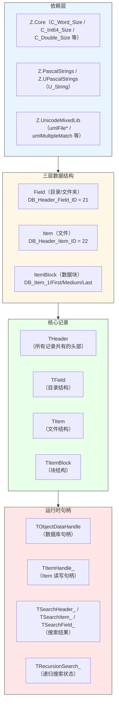
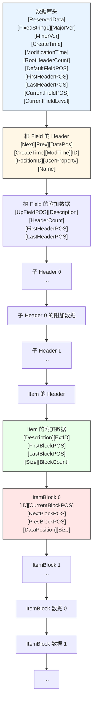
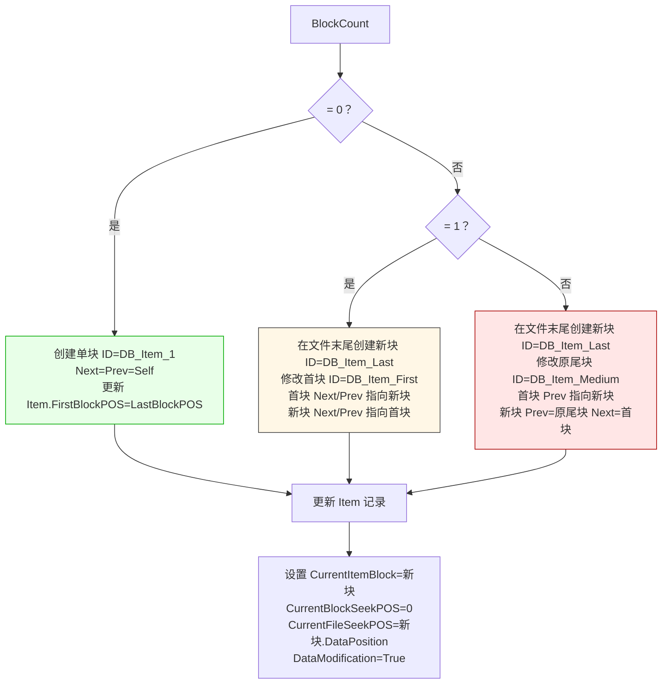
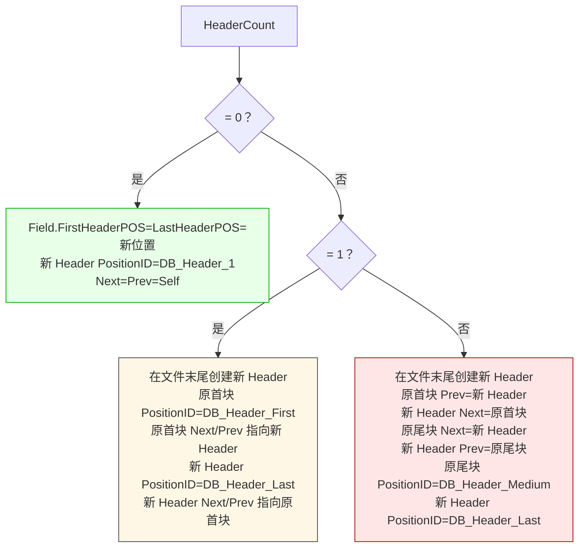

# Z.ZDB.ObjectData_LIB 知识库（最终传承版）

> **定位**：面向 AI 与人类工程师的权威参考。目标是让读者**无需翻阅源码**即可安全、准确地使用 `Z.ZDB.ObjectData_LIB`。
> **承诺**：所有描述均来自 `Z.ZDB.ObjectData_LIB.pas` 的逐行核对。凡我无法从源码确定的，在文末「诚实的不确定清单」中明示。
> **制图约定**：全文流程图/架构图/决策树一律使用 Mermaid，不使用字符制图。
> **历史定位**：本单元是 **ZDB2 存储引擎的前身**（`ObjectDataV2.3`），提供**目录 + 文件 + 块链表**的轻量级嵌入式数据库。它被 Z 框架广泛用于元数据和配置存储，是 `Z.ZDB2` 的基础。

---

## 第 0 章 快速定位：这个单元是什么

`Z.ZDB.ObjectData_LIB` 是 Z 框架的**轻量级嵌入式数据库引擎**。它把**单个文件**组织成**层级目录结构**，支持**文件存储**和**块级数据管理**。



**核心能力**：

| 能力 | 说明 |
|------|------|
| 层级目录 | Field 可嵌套，任意深度（最大 `DB_Max_Secursion_Level=128`） |
| 文件存储 | Item 保存任意二进制数据，分块链接 |
| 双向链表 | Field/Item/Block 均使用 `Next`/`Prev` 双向链接 |
| 64 位位置 | 所有指针为 `Int64` 文件位置 |
| 固定长度字符串 | `FixedStringL` 使存储可预测（无长度前缀） |
| 通配符搜索 | `?` 单字符，`*` 多字符 |
| 完整事件系统 | 22 个回调钩子，覆盖所有读写路径 |
| 流/文件支持 | 支持 `TCore_Stream` 和磁盘文件 |
| 复制/移动 | 支持跨数据库和跨字段的 Item/Field 复制和移动 |
| 递归搜索 | 遍历整棵数据库树 |

**它不是**：
- **不是**并发安全的（需外部加锁）。
- **不是**事务性的（没有回滚）。
- **不是**压缩的（数据原样存储）。
- **不是**加密的（需上层实现）。

---

## 第 1 章 常量与版本

### 1.1 尺寸常量

```pascal
const
  DB_Version_Size          = C_Word_Size;       // 2 字节
  DB_Time_Size             = C_Double_Size;     // 8 字节（TDateTime）
  DB_Counter_Size          = C_Int64_Size;      // 8 字节
  DB_DataSize_Size         = C_Int64_Size;      // 8 字节
  DB_Position_Size         = C_Int64_Size;      // 8 字节（文件偏移）
  DB_ID_Size               = C_Byte_Size;       // 1 字节
  DB_Property_Size         = C_Cardinal_Size;   // 4 字节
  DB_Level_Size            = C_Word_Size;       // 2 字节
  DB_ReservedData_Size     = 64;                // 数据库头保留区
  DB_FixedStringL_Size     = 1;                 // 固定字符串长度前缀
```

### 1.2 版本与描述

```pascal
DB_MajorVersion          = 2;
DB_MinorVersion          = 3;
DB_Max_Secursion_Level   = 128;
DB_FileDescription       = 'ObjectDataV2.3';
DB_DefaultField          = 'Default-Root';
DB_Path_Delimiter        = '/';
```

**契约**：
- **`DB_FileDescription` 是数据库描述**，在 `db_CreateNew` / `db_CreateAndSetRootField` 时写入。
- **`DB_DefaultField` 是新建数据库时的根字段名**。
- **`DB_Path_Delimiter` 是路径分隔符**，但实际 `db_GetPath` 使用 `ZDB_Field_Separator__`（`'/\'`）。

### 1.3 头部 ID 常量

```pascal
DB_Header_Field_ID = 21;   // Field（目录）
DB_Header_Item_ID  = 22;   // Item（文件）
```

### 1.4 位置 ID 常量

```pascal
DB_Header_First  = 11;   // 链表首节点
DB_Header_Medium = 12;   // 链表中间节点
DB_Header_Last   = 13;   // 链表尾节点
DB_Header_1      = 14;   // 单节点链表
```

### 1.5 块 ID 常量

```pascal
DB_Item_1      = 33;   // 单块
DB_Item_First  = 34;   // 首块
DB_Item_Medium = 35;   // 中间块
DB_Item_Last   = 36;   // 尾块
```

### 1.6 返回码

**正值表示成功，负值表示特定错误**。

| 类别 | 示例 |
|------|------|
| Header 成功 | `DB_Header_ok = 300` |
| Header 错误 | `DB_Header_SetPosError = -301`、`DB_Header_ReadNameError = -326` 等 |
| Item 成功 | `DB_Item_ok = 200` |
| Item 错误 | `DB_Item_SetPosError = -201`、`DB_Item_BlockReadError = -242` 等 |
| Field 成功 | `DB_Field_ok = 100` |
| Field 错误 | `DB_Field_SetPosError = -101`、`DB_Field_DeleteHeaderError = -124` 等 |
| DB 成功 | `DB_ok = 400` |
| DB 错误 | `DB_CreatePackError = -402`、`DB_OpenPackError = -425` 等 |

**完整错误码列表见源码**。`TranslateReturnCode` 将返回码翻译为人类可读字符串。

### 1.7 全局变量

```pascal
var
  ZDB_Header_Multiple_Char__: U_String;    // 默认 '?'
  ZDB_Header_Multiple_String__: U_String;  // 默认 '*'
  ZDB_Field_Separator__: U_String;         // 默认 '/\'
```

**初始化**在 `initialization` 段设置默认值。

---

## 第 2 章 核心数据结构

### 2.1 `THeader` —— 所有记录共有的头部

```pascal
THeader = record
  CurrentHeader: Int64;                    // 本记录在文件中的位置（由 ReadRec 设置）
  NextHeader, PrevHeader, DataPosition: Int64;  // 链表指针 + 数据位置
  ID: Byte;                                // 记录类型（Field=21 或 Item=22）
  PositionID: Byte;                        // 链表位置（First/Medium/Last/1）
  CreateTime, ModificationTime: Double;    // 时间戳
  UserProperty: Cardinal;                  // 用户自定义属性
  Name: U_String;                          // 名称（Field 名或 Item 名）
  State: Integer;                          // 操作返回码
end;
```

**字段语义**：
- **`CurrentHeader` 是本记录的物理位置**——所有其他记录的 `NextHeader`/`PrevHeader`/`DataPosition` 都指向某个 `CurrentHeader`。
- **`DataPosition` 指向**：对 Field 是 `TField` 附加数据（`Description`/`HeaderCount`/`FirstHeaderPOS`/`LastHeaderPOS`）；对 Item 是 `TItem` 附加数据（`Description`/`ExtID`/`FirstBlockPOS` 等）。
- **`ID` 必须是 21 或 22**，否则 `dbHeader_ReadRec` 报错。

### 2.2 `TField` —— 目录

```pascal
TField = record
  RHeader: THeader;           // 头部
  UpFieldPOS: Int64;          // 父 Field 位置（根为 0 或 -1）
  Description: U_String;      // 描述
  HeaderCount: Int64;         // 子条目数（Field + Item）
  FirstHeaderPOS, LastHeaderPOS: Int64;  // 首尾子条目
  State: Integer;             // 返回码
end;
```

**契约**：
- **`RHeader.DataPosition` 指向本结构的 `UpFieldPOS` 字段**。
- **`UpFieldPOS = -1` 表示根 Field**（见 `db_CheckRootField`）。
- **`HeaderCount = 0` 时 `FirstHeaderPOS` / `LastHeaderPOS` 无意义**。

### 2.3 `TItem` —— 文件

```pascal
TItem = record
  RHeader: THeader;                  // 头部
  Description: U_String;             // 描述
  ExtID: Byte;                       // 用户扩展 ID
  FirstBlockPOS, LastBlockPOS: Int64;  // 首尾数据块
  Size: Int64;                       // 总数据大小
  BlockCount: Int64;                 // 块数量
  CurrentBlockSeekPOS: Int64;        // 当前块内位置
  CurrentFileSeekPOS: Int64;         // 当前文件位置
  CurrentItemBlock: TItemBlock;      // 当前活动块
  DataModification: Boolean;         // 数据已修改标志
  State: Integer;                    // 返回码
end;
```

**契约**：
- **`RHeader.DataPosition` 指向本结构的 `Description` 字段**。
- **`Size` 是所有块的 `Size` 之和**。
- **`BlockCount` 是链表中块的数量**。

### 2.4 `TItemBlock` —— 数据块

```pascal
TItemBlock = record
  ID: Byte;                                // 33/34/35/36
  CurrentBlockPOS, NextBlockPOS, PrevBlockPOS, DataPosition: Int64;
  Size: Int64;                             // 本块数据大小
  State: Integer;                          // 返回码
end;
```

**契约**：
- **`ID` 表示块在链表中的位置**：单块用 `DB_Item_1`，多块用 First/Medium/Last。
- **`DataPosition` 指向块数据**，即 `CurrentBlockPOS + Get_DB_BlockL(IOHnd)`。

### 2.5 `TObjectDataHandle` —— 数据库句柄

```pascal
TObjectDataHandle = record
  IOHnd: TIOHnd;                                  // I/O 句柄
  ReservedData: TObjectDataHandle_Reserved_Data;  // 64 字节保留区
  FixedStringL: Byte;                             // 固定字符串长度
  MajorVer, MinorVer: SmallInt;                   // 版本
  CreateTime, ModificationTime: Double;           // 时间戳
  RootHeaderCount: Int64;                         // 根条目数
  DefaultFieldPOS, FirstHeaderPOS, LastHeaderPOS: Int64;  // 根字段位置
  CurrentFieldPOS: Int64;                         // 当前工作字段
  CurrentFieldLevel: Word;                        // 当前嵌套深度
  OverWriteItem: Boolean;                         // 是否覆盖同名 Item（默认 True）
  AllowSameHeaderName: Boolean;                   // 是否允许同名（默认 False）
  State: Integer;                                 // 总状态
  // 22 个事件回调...
end;
```

**关键契约**：
- **`IOHnd.Data` 指向本结构**（`Init_TTMDB` 设置），使 `dbHeader_WriteRec` 等可以回调事件。
- **`OverWriteItem=True`** 时，创建同名 Item 会先删除旧的。
- **`AllowSameHeaderName=False`** 时，`OverWriteItem=False` 下不允许创建同名 Item。

### 2.6 运行时句柄

**`TItemHandle_`**：
```pascal
TItemHandle_ = record
  Item: TItem;
  Name: U_String;
  Description: U_String;
  CreateTime, ModificationTime: Double;
  ItemExtID: Byte;
  OpenFlags: Boolean;    // True 表示已打开
end;
```

**`TSearchHeader_`** / **`TSearchItem_`** / **`TSearchField_`**：
- 持有 `FieldSearch: TFieldSearch` 状态。
- `CompleteCount` 记录已找到的数量。

**`TRecursionSearch_`**：
- 持有 `SearchBuff: array [0..DB_Max_Secursion_Level] of TFieldSearch`（递归栈）。

### 2.7 事件回调类型

22 个回调钩子，覆盖所有读写路径：

| 回调 | 触发时机 |
|------|---------|
| `OnError` | 任何操作失败时 |
| `OnDeleteHeader` | 删除 Header 后 |
| `OnPrepareWriteHeader` / `OnWriteHeader` | Header 写前 / 写后 |
| `OnReadHeader` | Header 读前 |
| `OnPrepareWriteItemBlock` / `OnWriteItemBlock` | ItemBlock 写前 / 写后 |
| `OnReadItemBlock` | ItemBlock 读前 |
| `OnPrepareWriteItem` / `OnWriteItem` | Item 写前 / 写后 |
| `OnReadItem` | Item 读前 |
| `OnPrepareOnlyWriteItemRec` / `OnOnlyWriteItemRec` | Item 数据（不含头）写前 / 写后 |
| `OnOnlyReadItemRec` | Item 数据（不含头）读前 |
| `OnPrepareWriteField` / `OnWriteField` | Field 写前 / 写后 |
| `OnReadField` | Field 读前 |
| `OnPrepareOnlyWriteFieldRec` / `OnOnlyWriteFieldRec` | Field 数据（不含头）写前 / 写后 |
| `OnOnlyReadFieldRec` | Field 数据（不含头）读前 |
| `OnPrepareWriteTMDB` / `OnWriteTMDB` | 数据库头写前 / 写后 |
| `OnReadTMDB` | 数据库头读前 |

**`OnPrepare*` 回调的 `Done` 参数**：若设为 `True`，则**跳过默认写入**，使用用户修改后的值。

---

## 第 3 章 存储格式

### 3.1 文件布局



### 3.2 记录尺寸计算

```pascal
Get_DB_StringL(IOHnd)   = IOHnd.FixedStringL
Get_DB_HeaderL(IOHnd)   = StringL + 3*Position + 2*Time + 2*ID + 1*Property
Get_DB_ItemL(IOHnd)     = StringL + 1*ID + 2*Position + 1*DataSize + 1*Counter
Get_DB_BlockL(IOHnd)    = 1*ID + 4*Position + 1*DataSize
Get_DB_FieldL(IOHnd)    = StringL + 1*Counter + 3*Position
Get_DB_L(IOHnd)         = 64 + 1 + 2*Version + 2*Time + 1*Counter + 4*Position + 1*Level
```

### 3.3 固定字符串格式

**`FixedStringL` 是每个名称/描述字段的总长度**（默认 65 字节）。

**写入格式**：
- 1 字节：实际字符串长度
- `FixedStringL - 1` 字节：字符串内容（`Pascal2FixedString` 自动截断）

**读取格式**：
- 读取 1 字节长度，再读内容。

**关键陷阱**：
- **`FixedStringL` 是字节数**——对 `U_String`（UTF-16）而言，1 字符 = 2 字节。
- **`FixedStringL` 默认 65**，所以最多存 32 个 UTF-16 字符。

---

## 第 4 章 初始化函数

### 4.1 `Init_THeader` / `Init_TItemBlock` / `Init_TItem` / `Init_TField`

**契约**：
- 将所有字段置为默认值（`0` / `''` / `nil`）。
- **`State` 置为对应的 `_ok`**（`DB_Header_ok` / `DB_Item_ok` / `DB_Field_ok`）。

### 4.2 `Init_TTMDB(var DB_; FixedStringL: Byte)`

**执行流程**：
1. `InitIOHnd(DB_.IOHnd)`。
2. `DB_.IOHnd.FixedStringL := FixedStringL`。
3. `FillPtrByte(@DB_.ReservedData[0], DB_ReservedData_Size, 0)`。
4. **`DB_.IOHnd.Data := @DB_`**（关键：使回调可以访问数据库句柄）。
5. `DB_.OverWriteItem := True`，`DB_.AllowSameHeaderName := False`。
6. 所有回调置 `nil`。

**`Init_TTMDB(DB_)`** = `Init_TTMDB(DB_, 65)`。

### 4.3 运行时结构初始化

- `Init_TFieldSearch`：搜索状态。
- `Init_TTMDBItemHandle`：Item 句柄。
- `Init_TTMDBSearchHeader` / `Init_TTMDBSearchItem` / `Init_TTMDBSearchField`：搜索结果。
- `Init_TTMDBRecursionSearch`：递归搜索状态。

---

## 第 5 章 底层 I/O

### 5.1 Header 读写

#### `dbHeader_WriteRec(fPos, IOHnd, Header_)`
**执行流程**：
1. 检查 `IOHnd.IsOnlyRead` 或 `not IOHnd.IsOpen` → `DB_CheckIOError`。
2. **若 `OnPrepareWriteHeader` 已赋值**：调用它，若 `Done=True` 则跳过默认写入。
3. `umlFileSeek(fPos)`。
4. 依次写入：`NextHeader` / `PrevHeader` / `DataPosition` / `CreateTime` / `ModificationTime` / `ID` / `PositionID` / `UserProperty` / `Name`（FixedString）。
5. **若 `OnWriteHeader` 已赋值**：调用它。
6. 失败时调用 `OnError`。

#### `dbHeader_ReadRec(fPos, IOHnd, Header_)`
**执行流程**：
1. `umlCheckSeedPos(IOHnd, fPos)` 检查位置有效。
2. **若 `OnReadHeader` 已赋值**：调用它，若 `Done=True` 则跳过默认读取。
3. `umlFileSeek(fPos)`。
4. `Header_.CurrentHeader := fPos`。
5. 依次读取所有字段，**每个指针字段都用 `umlCheckSeedPos` 校验**。
6. **`ID` 必须属于 `[DB_Header_Field_ID, DB_Header_Item_ID]`**。
7. **`PositionID` 必须属于 `[DB_Header_First, DB_Header_Medium, DB_Header_Last, DB_Header_1]`**。

#### `dbHeader_ReadReservedRec`
- 只读取 `CurrentHeader` / `NextHeader` / `PrevHeader` / `DataPosition` / `ID` / `PositionID`。
- **不读取时间戳/属性/名称**。
- 用途：已知只关心链接关系时快速读取。

### 5.2 Item 读写

#### `dbItem_WriteRec`
- 先写 Header（`dbHeader_WriteRec`）。
- 然后 seek 到 `RHeader.DataPosition`，写入：`Description` / `ExtID` / `FirstBlockPOS` / `LastBlockPOS` / `Size` / `BlockCount`。

#### `dbItem_ReadRec`
- 先读 Header。
- 然后 seek 到 `RHeader.DataPosition`，读取附加数据。

#### `dbItem_OnlyWriteItemRec` / `dbItem_OnlyReadItemRec`
- **不写/读 Header**，只操作 Item 的附加数据。

### 5.3 Field 读写

#### `dbField_WriteRec`
- 先写 Header。
- 然后写入：`UpFieldPOS` / `Description` / `HeaderCount` / `FirstHeaderPOS` / `LastHeaderPOS`。

#### `dbField_ReadRec`
- 先读 Header。
- 然后读取附加数据。
- **`HeaderCount > 0` 时校验 `FirstHeaderPOS` / `LastHeaderPOS`**。

#### `dbField_OnlyWriteFieldRec` / `dbField_OnlyReadFieldRec`
- 只操作 Field 附加数据。

### 5.4 ItemBlock 读写

#### `dbItem_OnlyWriteItemBlockRec`
- 写入：`ID` / `CurrentBlockPOS` / `NextBlockPOS` / `PrevBlockPOS` / `DataPosition` / `Size`。

#### `dbItem_OnlyReadItemBlockRec`
- 读取所有字段，**每个指针字段都用 `umlCheckSeedPos` 校验**。

### 5.5 数据库头读写

#### `db_WriteRec(fPos, IOHnd, DB_)`
- 依次写入：`ReservedData` / `FixedStringL` / `MajorVer` / `MinorVer` / `CreateTime` / `ModificationTime` / `RootHeaderCount` / `DefaultFieldPOS` / `FirstHeaderPOS` / `LastHeaderPOS` / `CurrentFieldPOS` / `CurrentFieldLevel`。

#### `db_ReadRec(fPos, IOHnd, DB_)`
- 读取所有字段。
- **若 `DB_.FixedStringL = 0`**（旧版本），使用 `DB_.IOHnd.FixedStringL`。

---

## 第 6 章 通配符匹配

### 6.1 `dbMultipleMatch(SourStr, DestStr)`

```pascal
function dbMultipleMatch(const SourStr, DestStr: U_String): Boolean;
begin
  if SourStr.Len = 0 then
      Result := True
  else if DestStr.Len = 0 then
      Result := False
  else
      Result := umlMultipleMatch(True, SourStr, DestStr, ZDB_Header_Multiple_String__, ZDB_Header_Multiple_Char__);
end;
```

**契约**：
- **`SourStr` 是模式（可含 `*` / `?`），`DestStr` 是目标**。
- **`SourStr = ''` 时返回 True**（匹配一切）。
- **`DestStr = ''` 时返回 False**（空目标不匹配任何模式）。
- **`IgnoreCase=True`**（大小写不敏感）。

### 6.2 头部搜索

#### `dbHeader_FindNext(Name, FirstHeaderPOS, LastHeaderPOS, IOHnd, Header_)`
- 从 `FirstHeaderPOS` 开始向前遍历（通过 `NextHeader`），直到找到匹配 `Name` 的 Header。
- **到达 `Last` / `1` 仍未找到 → `DB_Header_NotFindHeader`**。

#### `dbHeader_FindPrev(Name, LastHeaderPOS, FirstHeaderPOS, IOHnd, Header_)`
- 从 `LastHeaderPOS` 开始向后遍历（通过 `PrevHeader`），直到找到匹配。
- **到达 `First` / `1` 仍未找到 → `DB_Header_NotFindHeader`**。

---

## 第 7 章 块级数据管理

### 7.1 `dbItem_BlockCreate` —— 创建新块

**根据 `BlockCount` 分三种情况**：



**关键契约**：
- **新块总是追加到文件末尾**（`umlFileGetSize(IOHnd)`）。
- **`DataPosition = CurrentBlockPOS + Get_DB_BlockL(IOHnd)`**。

### 7.2 `dbItem_BlockInit` —— 初始化块系统

- 若 `BlockCount = 0`，直接返回。
- 否则读取 `FirstBlockPOS` 处的块作为 `CurrentItemBlock`。
- 设置 `CurrentBlockSeekPOS = 0` / `CurrentFileSeekPOS = DataPosition`。

### 7.3 `dbItem_BlockReadData` —— 读取数据

**使用 `goto` 实现跨块读取**：
- 若当前块剩余不足，读完后跳到下一块继续。
- **`CurrentBlockSeekPOS` 在块内；`CurrentFileSeekPOS` 是文件绝对位置**。
- **遇到 `DB_Item_Last` / `DB_Item_1` 块仍不够 → `DB_Item_BlockOverrate`**。

### 7.4 `dbItem_BlockAppendWriteData` —— 追加数据

**优化路径**：
- **若当前块数据位置 + 大小 = 文件末尾**，直接追加到当前块（`Size += Size`）。
- **否则创建新块，在新块写入数据**。

**契约**：
- **`Item.Size += Size`**。
- **`DataModification := True`**。

### 7.5 `dbItem_BlockWriteData` —— 写入数据（可覆盖）

**根据当前位置与块关系分三种情况**：
- **当前位置 = 当前块末尾** → 走 `dbItem_BlockAppendWriteData`。
- **当前位置 + Size <= 当前块剩余** → 直接写入当前块。
- **否则** → 写满当前块，跳到下一块继续。

### 7.6 `dbItem_BlockSeekPOS` —— 定位

- **`Position = 0` 且 `Item.Size = 0`** → 直接返回。
- **`Position > Item.Size`** → `DB_Item_BlockOverrate`。
- 从首块开始遍历，找到包含 `Position` 的块。

### 7.7 `dbItem_BlockGetPOS` —— 获取当前位置

- **从 `CurrentItemBlock` 开始向后遍历**，累加块大小。
- **返回**：`CurrentBlockSeekPOS + 前面块大小之和`。

### 7.8 `dbItem_BlockSeekStartPOS` / `dbItem_BlockSeekLastPOS`

- 定位到首块 / 尾块。

---

## 第 8 章 字段搜索

### 8.1 搜索函数族

| 函数 | 说明 |
|------|------|
| `dbField_OnlyFindFirstName` | 找第一个匹配 `Name` 的 Header（不限 ID） |
| `dbField_OnlyFindNextName` | 继续找下一个 |
| `dbField_OnlyFindLastName` | 找最后一个匹配 `Name` 的 Header |
| `dbField_OnlyFindPrevName` | 继续找上一个 |
| `dbField_FindFirst` | 找第一个匹配 `Name` 和 `ID` 的 Header |
| `dbField_FindNext` | 继续找下一个 |
| `dbField_FindLast` | 找最后一个匹配 |
| `dbField_FindPrev` | 继续找上一个 |
| `dbField_FindFirstItem` | 找第一个匹配 `Name` 和 `ExtID` 的 Item |
| `dbField_FindNextItem` | 继续找下一个 |
| `dbField_FindLastItem` | 找最后一个 |
| `dbField_FindPrevItem` | 继续找上一个 |
| `dbField_ExistItem` | 是否存在 |
| `dbField_ExistHeader` | 是否存在 |

**搜索状态 `TFieldSearch`**：
- `InitFlags`：是否已初始化。
- `Name`：搜索模式。
- `StartPos` / `OverPOS`：搜索范围。
- `ID`：Header ID 过滤。
- `PositionID`：当前 Header 的链表位置。
- `RHeader`：当前 Header。

---

## 第 9 章 字段管理

### 9.1 创建 Header

#### `dbField_CreateHeader(Name, ID, fPos, IOHnd, Header_)`

**根据 `HeaderCount` 分三种情况**：



#### `dbField_InsertNewHeader` —— 在指定位置插入

**根据插入位置的 `PositionID` 分四种情况**：`First` / `Medium` / `Last` / `1`，各自处理指针重连。

### 9.2 删除 Header

#### `dbField_DeleteHeader_(HeaderPOS, FieldPos, IOHnd, Field_)`

**根据 `HeaderCount` 分四种情况**：

| `HeaderCount` | 删除 `First` | 删除 `Medium` | 删除 `Last` |
|--------------|-------------|--------------|------------|
| 0 | 错误 | 错误 | 错误 |
| 1 | 清零 | 错误 | 错误 |
| 2 | 尾节点变 `1` | 错误 | 首节点变 `1` |
| 3 | 首节点变 `First`，尾节点 Next/Prev 更新 | 前驱 Next 指向后继，后继 Prev 指向前驱 | 尾节点变 `Last`，首节点 Next/Prev 更新 |
| > 3 | 同 3 的情况 | 同 3 的情况 | 同 3 的情况 |

#### `dbField_DeleteHeader` —— 带 `OnDeleteHeader` 回调的包装

### 9.3 移动 Header

#### `dbField_MoveHeader(HeaderPOS, SourcerFieldPOS, TargetFieldPos, IOHnd, Field_)`
- 先从源字段删除 Header。
- 再插入到目标字段的末尾。

### 9.4 创建 Field / Item

- `dbField_CreateField`：`CreateHeader` + 写入 Field 附加数据（`UpFieldPOS = fPos`）。
- `dbField_InsertNewField`：`InsertNewHeader` + 写入 Field 附加数据。
- `dbField_CreateItem`：`CreateHeader` + 写入 Item 附加数据（`ExtID` / `FirstBlockPOS=0` 等）。
- `dbField_InsertNewItem`：`InsertNewHeader` + 写入 Item 附加数据。

### 9.5 复制

#### `dbField_CopyItem` —— 复制 Item 到另一个字段

**执行流程**：
1. `dbField_CreateItem` 创建目标 Item。
2. `dbItem_BlockSeekStartPOS` 定位源。
3. **循环读取源数据（每块 `C_Buffer_Chunk_Size` 字节），追加到目标**。
4. 最后写入目标 Item 记录。

#### `dbField_CopyItemBuffer` —— 复制到已存在的 Item

- 与 `CopyItem` 类似，但目标 Item 已存在。
- **修正**：`dbHeader_ReadReservedRec` 重新读取目标头部，避免与并发操作冲突（注释说 "fixed by qq600585,2018-12"）。

#### `dbField_CopyAllTo` —— 递归复制所有匹配的 Field/Item

---

## 第 10 章 数据库 API

### 10.1 创建 / 打开 / 关闭

#### `db_CreateNew(FileName, DB_)`
- **若 `DB_.IOHnd` 已有效 → `DB_RepCreatePackError`**。
- `umlFileCreate(FileName, DB_.IOHnd)`。
- 初始化 DB_ 字段。
- `db_WriteRec(0, DB_.IOHnd, DB_)` 写头。
- `db_CreateAndSetRootField(DB_DefaultField, DB_FileDescription, DB_)` 创建默认根字段。

#### `db_Open(FileName, DB_, _OnlyRead)`
- **若 `DB_.IOHnd` 已有效 → `DB_RepOpenPackError`**。
- `umlFileOpen(FileName, DB_.IOHnd, _OnlyRead)`。
- **若文件为空**（`Size = 0`）：等同 `db_CreateNew` 的初始化路径。
- **否则**：`db_ReadRec(0, DB_.IOHnd, DB_)` 读头。

#### `db_CreateAsStream(stream, Name, Description, DB_)` / `db_OpenAsStream(stream, Name, DB_, _OnlyRead)`
- 使用 `umlFileCreateAsStream` / `umlFileOpenAsStream`。

#### `db_ClosePack(DB_)`
- **若 `DB_.IOHnd` 无效 → `DB_ClosePackError`**。
- **若 `ChangeFromWrite=True`**：更新时间戳，`db_WriteRec(0, ...)` 写头。
- `umlFileClose(DB_.IOHnd)`。

#### `db_Update(DB_)`
- 与 `db_ClosePack` 类似，但**不关闭 IOHnd**，只 `umlFileUpdate`。

### 10.2 复制

- `db_CopyFieldTo`：调用 `dbField_CopyAllTo`。
- `db_CopyAllTo`：从默认字段复制到目标默认字段。
- `db_CopyAllToDestPath`：从默认字段复制到目标指定路径。

### 10.3 名称校验

```pascal
function db_TestName(const Name: U_String): Boolean;
begin
  Result := Name.DeleteChar(ZDB_Field_Separator__ + #9#32#13#10).L > 0;
end;
```

**契约**：
- **名称不能包含路径分隔符（`/` 和 `\`）、TAB、空格、CR、LF**。
- **删除这些字符后长度必须 > 0**。

### 10.4 字段管理

- `db_CheckRootField`：不存在则创建。
- `db_CreateRootHeader`：根级 Header 创建（与 `dbField_CreateHeader` 类似，但操作 DB_.FirstHeaderPOS 等）。
- `db_CreateRootField`：根级字段创建。
- `db_CreateAndSetRootField`：创建并设置为默认字段。
- `db_CreateField(pathName, Description, DB_)`：路径创建（自动中间字段）。
- `db_SetFieldName` / `db_SetItemName`：重命名。
- `db_DeleteField` / `db_DeleteHeader`：删除（支持通配符）。
- `db_MoveItem` / `db_MoveField` / `db_MoveHeader`：移动。

### 10.5 当前字段导航

- `db_SetCurrentRootField(Name, DB_)`：按名称设置当前根字段。
- `db_SetCurrentField(pathName, DB_)`：按路径设置当前字段。

### 10.6 字段获取

- `db_GetRootField(Name, Field_, DB_)`：按名称获取根字段。
- `db_GetField(pathName, Field_, DB_)`：按路径获取字段。
- `db_GetPath(FieldPos, RootFieldPos, DB_, RetPath)`：反向获取路径。

### 10.7 Item 管理

- `db_NewItem(pathName, ItemName, ItemDescription, ItemExtID, Item_, DB_)`：创建 Item。
- `db_DeleteItem` / `db_DeleteItem2`：删除。
- `db_GetItem`：获取。

### 10.8 Item 句柄操作

- `db_ItemCreate` / `db_ItemFastCreate` / `db_ItemFastInsertNew`：创建并返回句柄。
- `db_ItemOpen` / `db_ItemFastOpen`：打开已有 Item。
- `db_ItemUpdate`：更新 Item 元数据。
- `db_ItemBodyReset`：重置 Item 数据（清空块）。
- `db_ItemClose`：关闭句柄。
- `db_ItemReName`：重命名。

### 10.9 Item I/O

- `db_ItemRead` / `db_ItemWrite`：读写数据。
- `db_ItemSeekPos` / `db_ItemSeekStartPos` / `db_ItemSeekLastPos`：定位。
- `db_ItemGetPos` / `db_ItemGetSize`：获取位置/大小。
- `db_AppendItemSize`：追加零填充。

### 10.10 搜索

- `db_ExistsRootField`：根字段存在性。
- `db_FindFirstHeader` / `db_FindNextHeader` / `db_FindLastHeader` / `db_FindPrevHeader`：Header 搜索。
- `db_FindFirstItem` / `db_FindNextItem` / `db_FindLastItem` / `db_FindPrevItem`：Item 搜索。
- `db_FastFindFirstItem` / `db_FastFindNextItem` / `db_FastFindLastItem` / `db_FastFindPrevItem`：快速 Item 搜索（直接指定 `FieldPos`）。
- `db_FindFirstField` / `db_FindNextField` / `db_FindLastField` / `db_FindPrevField`：Field 搜索。
- `db_FastFindFirstField` / `db_FastFindNextField` / `db_FastFindLastField` / `db_FastFindPrevField`：快速 Field 搜索。

### 10.11 递归搜索

- `db_RecursionSearchFirst(InitPath, FilterName, SenderRecursionSearch, DB_)`：从路径开始递归。
- `db_RecursionSearchNext(SenderRecursionSearch, DB_)`：继续递归。

**递归栈 `SearchBuff`**：
- 每进入一层子 Field，`SearchBuffGo += 1`。
- 每返回一层，`SearchBuffGo -= 1`。
- **到达 `DB_Max_Secursion_Level=128`** 时停止。

---

## 第 11 章 完整使用范式

### 11.1 最小数据库

```pascal
var
  DB: TObjectDataHandle;
begin
  Init_TTMDB(DB);
  try
    if db_CreateNew('mydb.dat', DB) then
      begin
        // 创建字段
        db_CreateField('Users', '用户目录', DB);

        // 创建 Item
        db_NewItem('Users', 'alice', 'Alice 的资料', 0, Item, DB);

        // 写入数据
        db_ItemCreate('Users', 'alice', 'Alice 的资料', 0, ItemHnd, DB);
        db_ItemWrite(Length(Data), Data, ItemHnd, DB);
        db_ItemClose(ItemHnd, DB);

        // 保存
        db_Update(DB);
      end;
  finally
    db_ClosePack(DB);
  end;
end;
```

### 11.2 遍历字段内所有 Item

```pascal
var
  sr: TSearchItem_;
begin
  if db_FindFirstItem('Users', '*', 0, sr, DB) then
    repeat
      WriteLn(sr.Name, ' = ', sr.Size, ' bytes');
    until not db_FindNextItem(sr, 0, DB);
end;
```

### 11.3 读取 Item 数据

```pascal
var
  ItemHnd: TItemHandle_;
  buff: array [0..1023] of Byte;
  total: Int64;
begin
  if db_ItemOpen('Users', 'alice', 0, ItemHnd, DB) then
    begin
      total := db_ItemGetSize(ItemHnd, DB);
      db_ItemRead(total, buff, ItemHnd, DB);
      db_ItemClose(ItemHnd, DB);
    end;
end;
```

### 11.4 递归搜索

```pascal
var
  rs: TRecursionSearch_;
begin
  Init_TTMDBRecursionSearch(rs);
  if db_RecursionSearchFirst('/', '*', rs, DB) then
    repeat
      case rs.ReturnHeader.ID of
        DB_Header_Field_ID: WriteLn('Field: ', rs.ReturnHeader.Name);
        DB_Header_Item_ID:  WriteLn('Item: ', rs.ReturnHeader.Name);
      end;
    until not db_RecursionSearchNext(rs, DB);
end;
```

### 11.5 复制整库

```pascal
var
  SrcDB, DestDB: TObjectDataHandle;
begin
  Init_TTMDB(SrcDB);
  Init_TTMDB(DestDB);
  db_Open('src.dat', SrcDB, True);
  db_CreateNew('dest.dat', DestDB);
  db_CopyAllTo(SrcDB, DestDB);
  db_ClosePack(SrcDB);
  db_ClosePack(DestDB);
end;
```

### 11.6 使用回调

```pascal
procedure TMyClass.OnPrepareWriteHeader(fPos: Int64; var wVal: THeader; var Done: Boolean);
begin
  // 修改 Header 或设置 Done=True 跳过默认写入
end;

DB.OnPrepareWriteHeader := OnPrepareWriteHeader;
```

---

## 第 12 章 反例集

### 12.1 未初始化 DB 就调用

```pascal
// ❌ 错误：DB 未初始化
var DB: TObjectDataHandle;
db_CreateNew('mydb.dat', DB);  // DB.IOHnd 未初始化，崩溃
```

**✅ 正确**：`Init_TTMDB(DB);` 后再调用。

### 12.2 使用无效的 `ID`

```pascal
// ❌ 错误：ID 不是 21 或 22
var h: THeader;
h.ID := 99;
dbHeader_WriteRec(0, IOHnd, h);  // 写入成功，但读取时报错
```

### 12.3 `FixedStringL` 设置过小

```pascal
// ❌ 错误：FixedStringL 太小
Init_TTMDB(DB, 4);  // 只能存 1 个 UTF-16 字符
```

**✅ 正确**：`FixedStringL` 至少 65。

### 12.4 路径包含分隔符

```pascal
// ❌ 错误：名称含 '/'
db_CreateField('A/B', 'desc', DB);  // 被解释为嵌套路径
```

### 12.5 未检查 `db_TestName`

```pascal
// ❌ 错误：创建含非法字符的 Item
db_NewItem('', 'a b', 'desc', 0, Item, DB);  // ItemName 含空格，失败
```

### 12.6 忘记 `db_ItemClose`

```pascal
// ❌ 错误：打开后不关闭
db_ItemOpen('Users', 'alice', 0, ItemHnd, DB);
db_ItemWrite(...);
// 忘记 db_ItemClose，修改可能丢失
```

### 12.7 在 `OnPrepareWrite*` 中修改 `wVal`

**允许**，但要注意：
- 修改后的值会写入磁盘。
- 若设置 `Done := True`，跳过默认写入。

### 12.8 递归搜索栈溢出

```pascal
// ⚠️ DB_Max_Secursion_Level = 128，超过则搜索停止
```

### 12.9 `db_ItemBodyReset` 后继续读数据

```pascal
// ❌ 错误：重置后 Item 数据已清空
db_ItemBodyReset(ItemHnd, DB);
db_ItemRead(100, Buff, ItemHnd, DB);  // 失败（Size = 0）
```

### 12.10 未初始化搜索状态

```pascal
// ❌ 错误：未 Init_TTMDBSearchItem
var sr: TSearchItem_;
db_FindNextItem(sr, 0, DB);  // sr.FieldSearch.InitFlags 未设置，失败
```

**✅ 正确**：`Init_TTMDBSearchItem(sr);` 后再调用。

### 12.11 跨数据库移动 Item

```pascal
// ⚠️ db_MoveItem 只能在同一数据库内移动
// 跨数据库请用 dbField_CopyItem
```

### 12.12 `FixedStringL` 的字节 vs 字符

```pascal
// ⚠️ FixedStringL = 65 表示 65 字节
// 对 U_String（UTF-16）而言，最多 32 个字符
```

---

## 第 13 章 常见错误对照表

| 现象 | 根因 | 修正 |
|------|------|------|
| `db_CreateNew` 返回 False | `DB_.IOHnd` 已有效 | 先 `Init_TTMDB` |
| `db_Open` 返回 `DB_RepOpenPackError` | 同上 | 同上 |
| `db_OpenPackError` | 文件不存在 | 检查路径 |
| `db_ClosePackError` | `IOHnd` 无效 | 检查是否已打开 |
| `DB_Header_ReadIDError` | ID 不是 21/22 | 检查数据完整性 |
| `DB_Header_ReadNameError` | 名称读取失败 | 检查 FixedStringL |
| `DB_Item_BlockReadError` | 块数据读取失败 | 检查文件完整性 |
| `DB_Item_BlockOverrate` | 读写超出块边界 | 检查 Size |
| `DB_Field_DeleteHeaderError` | 删除 Header 失败 | 检查 HeaderPOS |
| `DB_PathNameError` | 路径包含非法字符 | 使用 `db_TestName` |
| `DB_RepeatCreateItemError` | Item 已存在 | 设置 `OverWriteItem=True` |
| `DB_ItemNameError` | Item 名称非法 | 检查名称 |
| `DB_RepeatOpenItemError` | Item 已打开 | 先关闭 |
| `DB_RecursionSearchOver` | 递归搜索结束 | 正常结束信号 |
| `FixedStringL` 截断 | 名称过长 | 增大 `FixedStringL` |

---

## 第 14 章 诚实的不确定清单

> 以下是我从源码**无法完全确定**的点。若 AI 需要在这些场景下工作，**必须回查源码或询问人类**。

1. **`dbField_GetPOSField` 返回初始化 Field 的条件**
   - 源码：`if not dbField_ReadRec(...) then Init_TField(Result)`。
   - **不确定**：读取失败时返回初始化的 Field，是否会引起上层误用。
   - **推测**：返回值应检查 `State`。

2. **`dbItem_BlockReadData` 中 `goto Rep_Label` 的跳转逻辑**
   - 源码使用 `label Rep_Label` + `goto`。
   - **不确定**：`BlockPOS = 0` 分支和 `BlockPOS := 0` 分支的行为差异。
   - **推测**：两者都跳到 `Rep_Label`，但前者的 `BlockPOS` 已为 0，后者重置为 0 再跳。

3. **`dbItem_BlockCreate` 中 `BlockCount = 2` 的处理**
   - 源码：`else` 分支（`BlockCount >= 2`）。
   - **不确定**：`BlockCount = 2` 时，`LastItemBlock` 原 ID 是 `DB_Item_Last`，改 `DB_Item_Medium` 后，新块 ID 设为 `DB_Item_Last`。
   - **推测**：正确。

4. **`dbField_DeleteHeader_` 在 `HeaderCount = 2` 时删除 `Medium` 的行为**
   - 源码：`case DeleteHeader.PositionID of` 只处理 `First` / `Last`，`Medium` 走 `else` 报错。
   - **不确定**：`HeaderCount = 2` 时确实不存在 `Medium` 位置，但源码未处理。
   - **推测**：**这是设计**——2 个节点时只可能是 First 和 Last。

5. **`dbField_InsertNewHeader` 中 `f.HeaderCount = 0` 时的 `Curr.PositionID`**
   - 源码：调用 `dbField_InsertNewHeader` 前必须已有 Header（通过 `InsertHeaderPos` 定位）。
   - **不确定**：`Curr.PositionID` 为 `DB_Header_1` 时进入 `DB_Header_1` 分支，但 `f.HeaderCount` 仍为 0 状态。
   - **推测**：调用者需保证 `f.HeaderCount > 0`。

6. **`dbHeader_ReadReservedRec` 不读 `Name`**
   - 源码：只读 `CurrentHeader` / `NextHeader` / `PrevHeader` / `DataPosition` / `ID` / `PositionID`。
   - **不确定**：`Name` 保持为之前的值（若之前未初始化则为空）。
   - **推测**：用户需自行管理。

7. **`dbField_CopyItem` 中 `NewItemHnd := Item_;` 的意图**
   - 源码：先 `Init_TItem(NewItemHnd)`，然后 `NewItemHnd := Item_`。
   - **不确定**：`Init_TItem` 后立即赋值，等于复制 `Item_` 的所有字段。
   - **推测**：多余的 `Init_TItem` 调用。

8. **`dbField_CopyItemBuffer` 中 `dbHeader_ReadReservedRec` 的目的**
   - 源码注释：`fixed by qq600585,2018-12`。
   - **不确定**：为什么需要重新读取目标头部。
   - **推测**：避免并发操作修改目标 Item 的 Name 等。

9. **`db_GetPath` 中 `RootFieldPos` 的判断**
   - 源码：`if f.RHeader.CurrentHeader = RootFieldPos then`。
   - **不确定**：`RootFieldPos` 是根字段位置，比较路径的终止条件。
   - **推测**：正确。

10. **`db_SetCurrentField` 的 `CurrentFieldLevel`**
    - 源码：`DB_.CurrentFieldLevel := path_num_;`。
    - **不确定**：`path_num_` 是路径段数，是否等于嵌套深度。
    - **推测**：是。

11. **`db_RecursionSearchFirst` 中 `SearchBuffGo` 初始值**
    - 源码：`SenderRecursionSearch.SearchBuffGo := 0;`。
    - **不确定**：为何从 0 开始（而非 1）。
    - **推测**：`SearchBuff[0]` 是根字段的搜索状态。

12. **`db_RecursionSearchNext` 中 `SearchBuffGo` 的回退逻辑**
    - 源码：`while dbField_FindNext(...) = False do begin if SearchBuffGo = 0 then ... end;`。
    - **不确定**：回退到 0 时是否已处理完所有。
    - **推测**：是。

13. **`dbItem_BlockSeekPOS` 中 `DeformityInt <= ItemBlock.Size` 的边界**
    - 源码：`if DeformityInt <= ItemBlock.Size then`。
    - **不确定**：`DeformityInt = ItemBlock.Size` 时定位到块末尾。
    - **推测**：是。

14. **`dbItem_BlockGetPOS` 的 `Result := Result + ItemBlock.Size;`**
    - 源码：从 `CurrentItemBlock` 向前累加。
    - **不确定**：若 `CurrentItemBlock` 是首块，是否加。
    - **推测**：不加（`case ... of DB_Item_First, DB_Item_1: exit`）。

15. **`db_ClosePack` 中 `ChangeFromWrite` 的判断**
    - 源码：`if DB_.IOHnd.ChangeFromWrite then`。
    - **不确定**：何时 `ChangeFromWrite` 为 True。
    - **推测**：`umlFileWrite` 调用后为 True。

16. **`db_CreateNew` 中 `FillPtrByte` 的目的**
    - 源码：`FillPtrByte(@DB_.ReservedData[0], DB_ReservedData_Size, 0);`。
    - **不确定**：为何要清零保留区。
    - **推测**：确保初始状态干净。

17. **`db_Open` 中文件大小为 0 的处理**
    - 源码：走 `db_CreateNew` 的初始化路径。
    - **不确定**：这是否是期望行为（打开空文件当成新建）。
    - **推测**：是——空文件视为新建。

18. **`dbField_FindFirstItem` 的两个重载**
    - 一个带 `Item_: TItem` 输出，一个不带。
    - **不确定**：为什么需要两个版本。
    - **推测**：不带版本用于只搜索不读取数据。

19. **`dbHeader_ReadRec` 中 `Header_.State := DB_Header_ok;` 的位置**
    - 源码：在 `Result := True;` 之前。
    - **不确定**：为什么要在成功前设置 State。
    - **推测**：确保成功时 State 正确。

20. **`dbField_WriteRec` 中 `Field_.RHeader.State := DB_CheckIOError;`**
    - 源码：在 `IOHnd.IsOnlyRead` 时设置。
    - **不确定**：`Field_.State` 和 `Field_.RHeader.State` 的区别。
    - **推测**：两个独立的状态字段。

21. **`dbItem_BlockReadData` 的 `DeformitySize` 变量名**
    - 源码：`DeformitySize` 实际是"剩余待读大小"。
    - **不确定**：为何用 "Deformity" 命名。
    - **推测**：可能是历史遗留。

22. **`db_Update` 和 `db_ClosePack` 的差异**
    - `db_Update` 不关闭 IOHnd，`db_ClosePack` 关闭。
    - **不确定**：`db_Update` 后继续使用 DB_ 是否安全。
    - **推测**：安全（IOHnd 仍打开）。

23. **`dbField_MoveHeader` 的目标字段选择**
    - 源码：`if dbField_ReadRec(TargetFieldPos, IOHnd, Field_)`。
    - **不确定**：移动后的 Header 是否保留原时间戳。
    - **推测**：保留（Header 内容不变，只是链接变化）。

24. **`db_CopyAllTo` 的深拷贝**
    - 源码：通过 `dbField_CopyAllTo` 递归。
    - **不确定**：是否复制了所有层级。
    - **推测**：是。

---

## 第 15 章 结语

### 15.1 本知识库覆盖范围

- **已精确描述**：
  - 常量、版本、返回码。
  - 核心数据结构（`THeader` / `TField` / `TItem` / `TItemBlock`）。
  - 运行时句柄（`TObjectDataHandle` / `TItemHandle_` / 搜索状态）。
  - 底层 I/O（Header/Item/Field/Block 读写）。
  - 通配符匹配。
  - 块级数据管理（创建/读/写/定位）。
  - 字段搜索（FindFirst/Next/Last/Prev）。
  - 字段管理（创建/删除/移动/复制）。
  - 数据库 API（创建/打开/关闭/更新/复制）。
  - Item 管理（创建/打开/读写/关闭）。
  - 递归搜索。
  - 22 个事件回调。
  - 完整使用范式与反例。

- **已纠正的常见幻觉**：
  - **`FixedStringL` 是字节数，不是字符数**。
  - **`DB_Header_Field_ID = 21` / `DB_Header_Item_ID = 22`**。
  - **`db_GetPath` 使用 `ZDB_Field_Separator__`**，而非 `DB_Path_Delimiter`。
  - **`dbField_DeleteHeader_` 在 `HeaderCount = 2` 时不处理 `Medium`**（设计如此）。
  - **`db_RecursionSearchFirst` 的 `SearchBuffGo` 从 0 开始**。
  - **`dbItem_BlockReadData` 用 `goto` 实现跨块读取**。
  - **`Init_TTMDB` 自动设置 `DB_.IOHnd.Data := @DB_`**。
  - **`db_TestName` 删除 `/\`、TAB、空格、CR、LF 后必须非空**。
  - **`db_Open` 打开空文件视为新建**。
  - **`db_CopyItemBuffer` 有 `dbHeader_ReadReservedRec` 修正**。

- **未覆盖**：
  - 源码中的 24 个不确定点。
  - `Z.Core` / `Z.UnicodeMixedLib` 的内部实现。
  - 除 `Z.ZDB.ObjectData_LIB` 之外的单元。

### 15.2 给 AI 的使用规则

1. **始终先 `Init_TTMDB(DB)`** 再调用任何 DB API。
2. **`FixedStringL` 至少 65 字节**（约 32 个 UTF-16 字符）。
3. **名称不能含 `/\`、TAB、空格、CR、LF**。
4. **Item 打开后必须 `db_ItemClose`**。
5. **`OverWriteItem=True` 时创建同名 Item 会覆盖**。
6. **`db_ItemBodyReset` 后数据清空**。
7. **递归搜索最多 128 层**。
8. **搜索前必须 `Init_TTMDBSearch*`**。
9. **所有返回码都通过 `TranslateReturnCode` 翻译**。
10. **`db_ClosePack` 关闭后 DB_ 不可继续使用**。
11. **跨数据库移动请用 `dbField_CopyItem`**（`db_MoveItem` 只支持同库）。
12. **遇到不确定清单里的场景，请查源码或问人**。

### 15.3 与 Z.ZDB2 / Z.Core 的衔接

- **`Z.ZDB.ObjectData_LIB` 是 ZDB2 存储引擎的前身**。
- **`TIOHnd` 来自 `Z.Core`**（底层 I/O 句柄）。
- **`umlFile*` 函数来自 `Z.UnicodeMixedLib`**。
- **`U_String` 是 `Z.PascalStrings` 的 `TPascalString`**。
- **`C_Word_Size` / `C_Int64_Size` / `C_Double_Size` 来自 `Z.Core`**。

---

**本知识库的定位**：一份**准确的、有边界的、可操作的** `Z.ZDB.ObjectData_LIB` 参考。它不假装能替代源码，但能让你在 90% 的场景下正确使用，并在剩下 10% 的场景下知道该停下来问人。