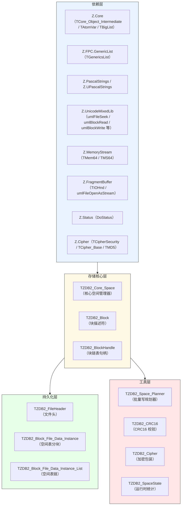
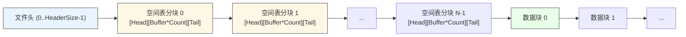
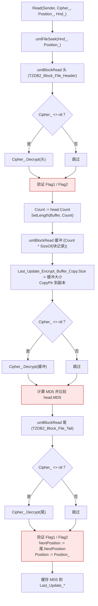
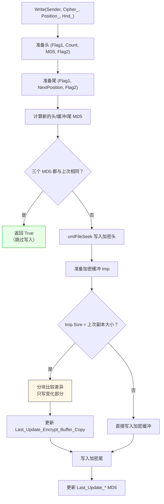
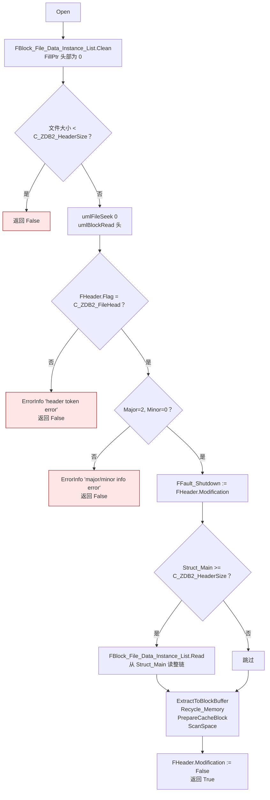
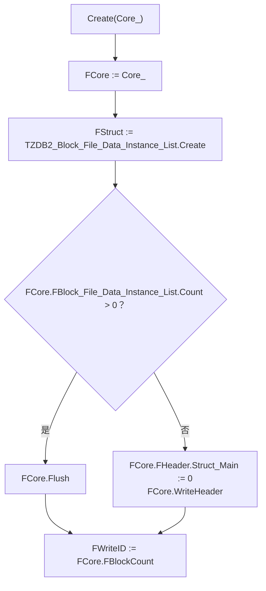
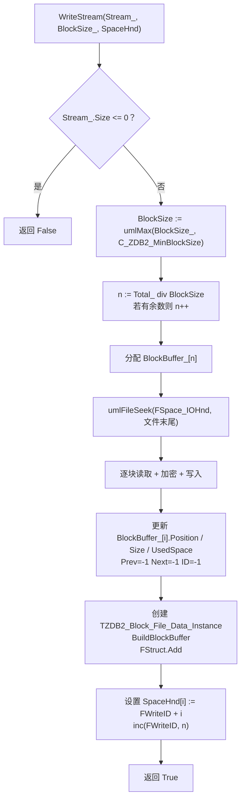
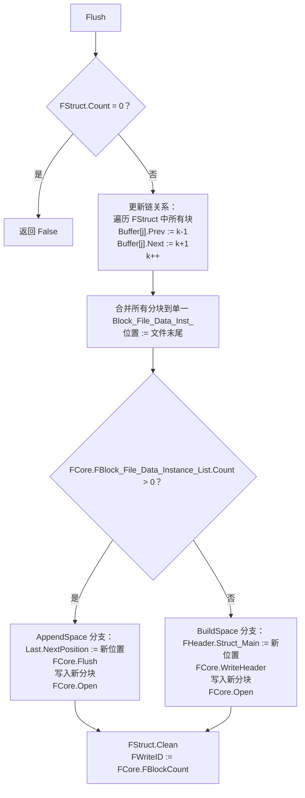

# Z.ZDB2 知识库（最终传承版）

> **定位**：面向 AI 与人类工程师的权威参考。目标是让读者**无需翻阅源码**即可安全、准确地使用 `Z.ZDB2`。
> **承诺**：所有描述均来自 `Z.ZDB2.pas` 的逐行核对。凡我无法从源码确定的，在文末「诚实的不确定清单」中明示。
> **制图约定**：全文流程图/架构图/决策树一律使用 Mermaid，不使用字符制图。
> **规模警告**：本单元约 **3500 行**，是 Z 框架的**下一代块存储引擎核心**。它是 `Z.ZDB`（层级数据库）的底层后端，也可独立用作可靠的、加密的、带缓存的块存储。

---

## 第 0 章 快速定位：这个单元是什么

`Z.ZDB2` 是 Z 框架的**下一代块存储引擎**。它把线性地址空间（文件或内存流）划分为**固定大小的块**，用**块链表**表示变长数据对象，用**空间表链**持久化所有块描述符。它**不提供文件系统或层级结构**——所有语义组织由上层（如 `Z.ZDB`）实现。



**核心能力**：

| 能力 | 说明 |
|------|------|
| 64 位块存储 | 支持最大 **130 TB** 和数十亿块 |
| 变长数据对象 | 块链表（`TZDB2_BlockHandle`）表示 |
| 加密 | 通过 `IZDB2_Cipher` 实现每块加解密 |
| 两级缓存 | 读缓存 + 写缓存，按操作模式配置 |
| 增量写入优化 | 空间表分块只写变化部分 |
| 快速空间构建 | `Fast_BuildSpace` / `Fast_AppendSpace` 不填零 |
| 安全空间构建 | `BuildSpace` / `AppendSpace` 填零 |
| 碎片整理 | `OptimizedSpaceTo` 压缩到新存储 |
| 定位读取 | `Read_Position` 读取任意子区间 |
| CRC16 校验 | 全空间或句柄级别的完整性检查 |
| 崩溃恢复 | 文件头 `Modification` 标记 |

**它不是**：
- **不是**文件系统（没有目录/文件名概念）。
- **不是**层级结构（上层 `Z.ZDB` 负责）。
- **不是**事务性的（没有事务/回滚）。
- **不是**并发的（需外部加锁）。

---

## 第 1 章 常量与数据结构

### 1.1 魔术常量

```pascal
const
  C_ZDB2_FileHead         = $89898989;   // 文件头标识
  C_ZDB2_SpaceTableHead_1 = $90909090;   // 空间表分块头标识 1
  C_ZDB2_SpaceTableHead_2 = $91919191;   // 空间表分块头标识 2
  C_ZDB2_SpaceTableTail_1 = $92929292;   // 空间表分块尾标识 1
  C_ZDB2_SpaceTableTail_2 = $93939393;   // 空间表分块尾标识 2
  C_ZDB2_MinBlockSize     = $40;          // 最小块大小（64 字节）
  C_ZDB2_HeaderSize       = SizeOf(TZDB2_FileHeader);
```

### 1.2 文件头 `TZDB2_FileHeader`

```pascal
TZDB2_FileHeader = packed record
  Flag: Cardinal;                            // = C_ZDB2_FileHead
  Major, Minor: WORD;                        // 版本号（2.0）
  Struct_Main: Int64;                        // 空间表主链的文件位置
  UserCustomHeader: TZDB2_UserCustomHeader;  // 用户自定义 254 字节
  Modification: Boolean;                     // 是否已修改（崩溃恢复）
end;
TZDB2_UserCustomHeader = array [0 .. 253] of Byte;
```

**关键契约**：
- **`Flag` 必须是 `$89898989`**，否则 `Open` 失败。
- **`Major=2, Minor=0`** 是当前版本。
- **`Struct_Main` 是空间表链的起始位置**（0 表示无空间表）。
- **`Modification=True` 表示上次非正常关闭**（`Fault_Shutdown=True`）。

### 1.3 块描述符 `TZDB2_Block`

```pascal
TZDB2_Block = record
  Position: Int64;      // 块数据起始文件位置
  Size: WORD;           // 块总大小（固定）
  UsedSpace: WORD;      // 已用字节数（<= Size）
  Prev, Next: Integer;  // 链表中前驱/后继块索引（-1 表示无）
  ID: Integer;          // 在 BlockBuffer 中的索引
end;
```

**契约**：
- **`Size` 是 WORD（最大 65535 字节）**，所以块大小不能超过 64 KB。
- **`UsedSpace=0` 表示空闲块**。
- **`Prev/Next` 为 -1 表示链表的端点**。
- **`ID` 是自引用**（即 `FBlockBuffer[ID]` 就是本块）。

### 1.4 缓存条目 `TZDB2_BlockCache`

```pascal
TZDB2_BlockCache = record
  Mem: TZDB2_Mem;                  // 缓存数据缓冲（nil 表示未缓存）
  FlushThisCacheToFile: Boolean;   // 是否需要刷回磁盘
end;
```

### 1.5 持久化块记录 `TZDB2_Block_File`

```pascal
TZDB2_Block_File = packed record
  Position: Int64;
  Size: WORD;
  UsedSpace: WORD;
  Prev, Next: Integer;
end;
```

**与内存块的差异**：**无 `ID` 字段**（持久化时 ID 由数组索引决定）。

### 1.6 空间表分块结构

**头部 `TZDB2_Block_File_Header`**：
```pascal
TZDB2_Block_File_Header = packed record
  Flag1: Cardinal;   // = C_ZDB2_SpaceTableHead_1
  Count: Integer;    // 本分块的块记录数
  MD5: TMD5;         // 块记录缓冲的 MD5（解密后）
  Flag2: Cardinal;   // = C_ZDB2_SpaceTableHead_2
end;
```

**尾部 `TZDB2_Block_File_Tail`**：
```pascal
TZDB2_Block_File_Tail = packed record
  Flag1: Cardinal;        // = C_ZDB2_SpaceTableTail_1
  NextPosition: Int64;    // 下一分块的文件位置（0 表示无）
  Flag2: Cardinal;        // = C_ZDB2_SpaceTableTail_2
end;
```

**磁盘布局**：



---

## 第 2 章 `TZDB2_Block_File_Data_Instance`

### 2.1 字段

```pascal
TZDB2_Block_File_Data_Instance = class(TCore_Object_Intermediate)
private
  Position: Int64;                            // 本分块文件位置
  NextPosition: Int64;                        // 下一分块位置
  Count: Integer;                             // 块记录数
  Buffer: TZDB2_Block_File_Buffer;            // 块记录数组
  Last_Update_Head_MD5: TMD5;                 // 上次写入时的头 MD5
  Last_Update_Buffer_MD5: TMD5;               // 上次写入时的缓冲 MD5
  Last_Update_Encrypt_Buffer_Copy: TMem64;    // 上次加密缓冲副本
  Last_Update_Tail_MD5: TMD5;                 // 上次写入时的尾 MD5
public
  constructor Create;
  destructor Destroy; override;
  function Read(Sender: TZDB2_Core_Space; Cipher_: IZDB2_Cipher; Position_: Int64; var Hnd_: TIOHnd): Boolean;
  function Write(Sender: TZDB2_Core_Space; Cipher_: IZDB2_Cipher; Position_: Int64; var Hnd_: TIOHnd): Boolean;
  procedure BuildBlockBuffer(var BlockBuffer_: TZDB2_BlockBuffer);
  class function ComputeSize(BlockNum_: Integer): Int64;
end;
```

### 2.2 `Read` 契约



**契约**：
- **任何验证失败 → 返回 False 并 `ErrorInfo`**。
- **加密顺序**：先读原始字节，再解密。
- **MD5 基于解密后的缓冲**。

### 2.3 `Write` 契约

**增量写入优化**：



**关键契约**：
- **增量优化仅在缓冲大小不变时生效**。
- **分块大小** = `max(tmp.Size div 100, $FFFF * 10)`。
- **加密在比较之前**（比较的是加密后的字节）。

### 2.4 `BuildBlockBuffer`

```pascal
procedure BuildBlockBuffer(var BlockBuffer_: TZDB2_BlockBuffer);
```
- 从内存 `TZDB2_BlockBuffer` 构建持久化 `Buffer`。
- **不包含 ID 字段**。

### 2.5 `ComputeSize`

```pascal
class function ComputeSize(BlockNum_: Integer): Int64;
begin
  Result := SizeOf(TZDB2_Block_File_Header) + (SizeOf(TZDB2_Block_File) * BlockNum_) + SizeOf(TZDB2_Block_File_Tail);
end;
```

---

## 第 3 章 `TZDB2_Block_File_Data_Instance_List`

### 3.1 API

```pascal
TZDB2_Block_File_Data_Instance_List = class(TZDB2_Block_File_Data_Instance_List_)
public
  function BlockSum(): Integer;
  procedure ExtractToStoreBuffer(var Buffer: TZDB2_Block_File_Buffer); overload;
  procedure ExtractToBlockBuffer(var Buffer: TZDB2_BlockBuffer; StartID_: Integer); overload;
  procedure ExtractToBlockBuffer(var Buffer: TZDB2_BlockBuffer); overload;
  function FillFromBlockBuffer(var Buffer: TZDB2_BlockBuffer; StartID_: Integer): Boolean; overload;
  function FillFromBlockBuffer(var Buffer: TZDB2_BlockBuffer): Boolean; overload;
  function Read(Sender: TZDB2_Core_Space; Cipher_: IZDB2_Cipher; Position_: Int64; var Hnd_: TIOHnd): Boolean;
  function Write(Sender: TZDB2_Core_Space; Cipher_: IZDB2_Cipher; Position_: Int64; var Hnd_: TIOHnd): Boolean;
  procedure Clean;
  procedure Recycle_Memory;
end;
```

**关键契约**：
- **`ExtractToBlockBuffer`**：从持久化格式转内存格式（含 ID 赋值）。
- **`FillFromBlockBuffer`**：反向操作。
- **`Read`**：从 `Position_` 开始遍历整个链（直到 `NextPosition=0`）。
- **`Write`**：遍历所有分块，各自写入自己的 `Position`。
- **`Recycle_Memory`**：释放 `Buffer` 内存但保留 `Count`（用于节省 RAM）。

---

## 第 4 章 `TZDB2_Core_Space` —— 核心空间管理器

### 4.1 字段

```pascal
TZDB2_Core_Space = class(TCore_Object_Intermediate)
private
  FHeader: TZDB2_FileHeader;
  FFault_Shutdown: Boolean;
  FAutoCloseIOHnd: Boolean;
  FAutoFreeIOHnd: Boolean;
  FSpace_IOHnd: PIOHnd;
  FFreeSpaceIndexProbe: Integer;
  FBlockCount: Integer;
  FBlockBuffer: TZDB2_BlockBuffer;
  FBlock_File_Data_Instance_List: TZDB2_Block_File_Data_Instance_List;
  FMaxCacheMemory: Int64;              // 默认 32MB
  FUsedReadCache: Boolean;
  FUsedWriteCache: Boolean;
  FBlockWriteCache: TZDB2_BlockWriteCache;
  FMode: TZDB2_SpaceMode;
  FCipher: IZDB2_Cipher;
  FCipherMem: TMem64;
  FState: TZDB2_SpaceState;
  FLast_Modification: TTimeTick;
  FLast_Error_Info: TZDB2_Core_Space_Error_Info;
  FLast_Warning_Info: TZDB2_Core_Space_Warning_Info;
  FOnProgress: TZDB2_OnProgress;
  FOnNoSpace: TZDB2_OnNoSpace;
end;
```

### 4.2 操作模式 `TZDB2_SpaceMode`

| 模式 | 数据库大小 | 块数 | 读缓存 | 写缓存 |
|------|----------|------|-------|-------|
| `smBigData` | > 100G, < 130TB | < 1000 万 | ❌ | ❌ |
| `smNormal` | > 1G, < 100G | < 500 万 | ❌ | ✅ |
| `smFast` | > 100M, < 10G | < 100 万 | ✅ | ✅ |

**`SetMode` 契约**：
- 修改 `FUsedReadCache` / `FUsedWriteCache`。
- **不改变已有缓存内容**。

### 4.3 构造与析构

```pascal
constructor Create(IOHnd_: PIOHnd);
destructor Destroy; override;
```

**构造**：
- 初始化所有字段。
- `FMaxCacheMemory := 1024 * 1024 * 32`（32 MB）。
- `FMode := smNormal`。
- 创建 `FBlock_File_Data_Instance_List` / `FCipherMem`。
- 创建 `FLast_Error_Info` / `FLast_Warning_Info`。

**析构**：
- **若 `FHeader.Modification` 为 True，则 `Flush`**（自动保存未提交的修改）。
- 释放所有字段。
- **若 `FAutoCloseIOHnd`，则 `umlFileClose`**。
- **若 `FAutoFreeIOHnd`，则 `Dispose` 掉 IOHnd**。

### 4.4 打开与检查

#### `CheckStream`
```pascal
class function CheckStream(stream: TCore_Stream; Cipher_: IZDB2_Cipher): Boolean;
class function CheckStream(stream: TCore_Stream; Cipher_: IZDB2_Cipher; Check_Fault_Shutdown_: Boolean): Boolean;
```
- **临时打开流，不改变原流位置**。
- `Check_Fault_Shutdown_=True` 时额外检查 `Fault_Shutdown`。

#### `Open`


### 4.5 空间构建与扩展

#### `Fast_BuildSpace` vs `BuildSpace`

| 方面 | `Fast_BuildSpace` | `BuildSpace` |
|------|-------------------|-------------|
| 数据初始化 | **不填零**（直接 `SetSize`） | **填零**（逐块 `umlBlockWrite` 零） |
| 速度 | 快 | 慢 |
| 安全性 | 低（可能暴露旧数据） | 高 |
| 适用场景 | 新建文件 | 覆盖敏感数据 |

**共同契约**：
- **`BlockSize_` 会被 clamp 到 `[C_ZDB2_MinBlockSize, 65535]`**。
- **`FBlockBuffer` 长度 = `(PhySpaceSize - headSiz) / BlockSize`**。
- **`FHeader.Struct_Main := C_ZDB2_HeaderSize`**。
- **创建 `TZDB2_Block_File_Data_Instance` 并写入空间表**。
- **完成后 `ScanSpace` + `Do_Modification`**。

#### `Fast_AppendSpace` vs `AppendSpace`

| 方面 | `Fast_AppendSpace` | `AppendSpace` |
|------|-------------------|--------------|
| 数据初始化 | **不填零** | **填零** |
| 速度 | 快 | 慢 |
| 空间表位置 | **文件末尾追加新分块** | 同上 |
| 旧空间表 | **保留**（`Last.NextPosition := 新头位置`） | 同上 |

**共同契约**：
- **若 `FBlock_File_Data_Instance_List.Count = 0`，则调用 `BuildSpace` 分支**。
- **先 `FlushCache`**（确保数据一致）。
- **`headPos := umlFileGetSize`**（新分块在文件末尾）。
- **`BlockNum_ := NewSpaceSize_ div DestBlockSize_`**（不取整到 `BlockSize_`——潜在陷阱，见不确定清单）。
- **完成后 `PrepareCacheBlock` + `ScanSpace` + `Do_Modification`**。

### 4.6 碎片整理 `OptimizedSpaceTo`

```pascal
function OptimizedSpaceTo(var Dest_IOHnd: TIOHnd): Boolean;
```

**流程**：
1. `FlushCache`。
2. 在目标 IOHnd 的 0 位置预留头部空间。
3. 遍历所有块，逐块读写到目标（**重新分配连续位置**）。
4. 写入新头（`Struct_Main := C_ZDB2_HeaderSize`）。
5. 写入新空间表分块。

**关键契约**：
- **保留所有块的 `Prev/Next` 关系**。
- **`dest_BlockBuffer[i].Position` 为目标 IOHnd 的顺序位置**。
- **目标文件已存在时会被覆盖**。

### 4.7 扫描与状态

```pascal
procedure ScanSpace;
```
- 重新计算 `FState.Physics` / `FState.FreeSpace`。
- 找到首个空闲块索引存入 `FFreeSpaceIndexProbe`。

```pascal
property State: PZDB2_Core_SpaceState read GetState;
```
**`TZDB2_SpaceState` 字段**：
- `Physics`：所有块的总物理大小。
- `FreeSpace`：所有空闲字节数。
- `Cache`：缓存使用的内存。
- `ReadNum` / `ReadSize`：读操作计数 / 字节数。
- `WriteNum` / `WriteSize`：写操作计数 / 字节数。

### 4.8 句柄操作

#### `Check(ID_)`
- 验证 `ID_` 是有效块且属于有效链。

#### `GetSpaceHndID(ID_)`
- 返回包含 `ID_` 的链的头块 ID。
- **失败返回 -1**。

#### `GetSpaceHnd(ID_)`
- 返回完整的块链表句柄（头到尾）。
- **失败返回空数组**。

#### `GetSpaceHndAsText(ID_)`
- 返回逗号分隔的字符串。

#### `GetSpaceHndPtr(ID_)`
- 返回 `TZDB2_BlockPtrList`（**调用方负责释放**）。

#### `BuildTableID`
- 返回所有数据对象的头块 ID 数组。

### 4.9 写空间检查

```pascal
function CheckWriteSpace(Siz_: Int64): Boolean; overload;
function CheckWriteSpace(Siz_: Int64; Space_: TZDB2_BlockPtrList): Boolean; overload;
function GetWriteSpaceBlock(): Integer;
```

**`CheckWriteSpace` 契约**：
- 从 `FFreeSpaceIndexProbe` 开始遍历空闲块。
- 累加空闲块大小直到 >= `Siz_`。
- **`Space_` 非 nil 时收集空闲块指针**。

**`GetWriteSpaceBlock`**：
- 返回第一个空闲块 ID。
- **更新 `FFreeSpaceIndexProbe`**。

### 4.10 块级 I/O

#### `Block_IO_Read`
```pascal
function Block_IO_Read(buff: Pointer; ID: Integer): WORD;
```
- 优先读缓存。
- 未命中 → 磁盘读 + 解密 + 写入读缓存（若启用）。
- **返回 `UsedSpace`**。

#### `Block_IO_Write`
```pascal
function Block_IO_Write(buff: Pointer; ID: Integer): Boolean;
```
- 若写缓存启用 → 写缓存。
- 否则 → 磁盘写（加密后写）+ 若 `Size > UsedSpace` 填零。
- **`Do_Modification` 先调用**。

#### `Block_IO_Custom_Read`
```pascal
function Block_IO_Custom_Read(buff: Pointer; ID, Block_Offset, Block_Read_Size: Integer): Boolean;
```
- **部分读取块数据**。
- 缓存命中或有加密 → 整块读后 `CopyPtr`。
- 否则 → 直接 seek + read（**优化路径**）。

### 4.11 写入操作

#### `WriteStream`
- 输入 `TCore_Stream`，输出 `TZDB2_BlockHandle` 或 `Integer ID`。
- **流大小必须 > 0**。
- **`CheckWriteSpace` 失败 → 调用 `FOnNoSpace`，若 `retry=True` 则递归**。
- **逐块填充**，最后一块 `UsedSpace=tmp`，若 `Size > tmp` 填零。

#### `WriteData`
- 输入 `TZDB2_Mem`，输出句柄/ID。
- **`BuffProtected_=True` 时用 `FCipherMem` 中转加密**（避免修改原缓冲）。
- `BuffProtected_=False` 时**原地加密**。

#### `Write_Combine_Memory` / `Write_Combine_Stream`
- 合并多个缓冲/流写入。
- **`TMS64_Array` / `TMem64_Array` / `TStream_Array`**。
- **`TStream_Array` 版本会保存/恢复流的原始位置**。

### 4.12 读取操作

#### `ReadStream`
- 输入句柄或 ID，输出 `TCore_Stream`。
- **优先读缓存**。
- **保存并恢复流的原始位置**。

#### `ReadData`
- 输入 `TZDB2_Mem`，输出内存。
- **自动 `SetSize`**。

#### `Compute_Data_Position`
- 给定数据位置 `Pos_`，计算所在块 `BlockID_` 和块内偏移 `BlockPos_`。
- **`Pos_` 在块边界时**可能返回下一个块的起始（取决于 `<=` 判断，见不确定清单）。

#### `Compute_Data_Range`
- 给定 `Pos_` / `Size_`，计算涉及的块列表 `Range_Space` 和起止偏移。

#### `Read_Position`
- **从块链中读取任意子区间**。
- 处理三种情况：**跨块** / **单块** / **空范围**。
- **保存并恢复流的原始位置**。

### 4.13 MD5 与删除

#### `ComputeMD5`
- 遍历所有块，用 `TMD5_Tool` 增量计算。
- **优先读缓存**。

#### `RemoveData`
- **`SafeClean_=True` 时填零覆盖**（防数据恢复）。
- **`SafeClean_=False` 时只标记 `UsedSpace=0`**。
- **释放缓存 + 更新 `FFreeSpaceIndexProbe` + 增加 `FreeSpace`**。

### 4.14 其他

#### `GetDataSize` / `GetDataPhysics`
- `GetDataSize`：`UsedSpace` 总和。
- `GetDataPhysics`：`Size` 总和。

#### `Format_Space`
- **清空所有块**（`UsedSpace=0`），保留 `Position` / `Size`。
- **清空用户自定义头**。

#### `DoProgress`
- 触发 `FOnProgress`。

#### 类方法

```pascal
class function Combine_Handle(hnd1, hnd2: TZDB2_BlockHandle): TZDB2_BlockHandle;
class function Combine_Handle(L1, L2: TZDB2_ID_List): TZDB2_BlockHandle;
class function Get_Handle(Hnd: TZDB2_BlockHandle): TZDB2_BlockHandle;
class function Get_Handle(L: TZDB2_ID_List): TZDB2_BlockHandle;
class function Get_Handle(L: TZDB2_ID_Pool): TZDB2_BlockHandle;
```

**契约**：
- `Combine_Handle`：拼接两个句柄/列表。
- `Get_Handle`：从各种容器转换为 `TZDB2_BlockHandle`。

---

## 第 5 章 `TZDB2_Space_Planner` —— 批量写规划器

### 5.1 定位

`TZDB2_Space_Planner` 用于**批量的、可能多次的**写入操作，把这些写入的**数据块**和**空间表分块**统一规划，最后一次性 `Flush`。

### 5.2 字段

```pascal
TZDB2_Space_Planner = class(TCore_Object_Intermediate)
private
  FCore: TZDB2_Core_Space;
  FStruct: TZDB2_Block_File_Data_Instance_List;  // 待写入的空间表分块
  FWriteID: Integer;                             // 下一可用块 ID
public
  constructor Create(Core_: TZDB2_Core_Space);
  destructor Destroy; override;
  function WriteStream(Stream_: TCore_Stream; BlockSize_: WORD; var SpaceHnd: TZDB2_BlockHandle): Boolean; overload;
  function WriteStream(Stream_: TCore_Stream; BlockSize_: WORD; var ID: Integer): Boolean; overload;
  function WriteFile(FileName_: SystemString; BlockSize_: WORD; var SpaceHnd: TZDB2_BlockHandle): Boolean; overload;
  function WriteFile(FileName_: SystemString; BlockSize_: WORD; var ID: Integer): Boolean; overload;
  function Flush: Boolean;
end;
```

### 5.3 构造契约



### 5.4 `WriteStream` 契约



**关键契约**：
- **块直接写入文件末尾**，`BlockBuffer_[i].Position` 记录实际位置。
- **`Prev` / `Next` 均为 -1**（链关系在 `Flush` 时建立）。
- **`ID` 为 -1**（未加入主 `FBlockBuffer`）。
- **进度回调**：`FCore.FOnProgress(n, BlockID_)`。

### 5.5 `Flush` 契约



**关键契约**：
- **链关系修正**：`k` 从 `FCore.FBlockCount` 开始递增，把新块接入主链。
- **空间表分块写入文件末尾**。
- **写完 `FCore.Open`** 重新加载整个空间表。

---

## 第 6 章 `TZDB2_CRC16` —— 完整性校验

### 6.1 API

```pascal
TZDB2_CRC16 = class(TCore_Object_Intermediate)
public
  CRC16Buffer: array of WORD;
  constructor Create;
  destructor Destroy; override;
  function Build(Core_: TZDB2_Core_Space): Boolean; overload;
  function Build(Core_: TZDB2_Core_Space; Hnd: TZDB2_BlockHandle): Boolean; overload;
  procedure LoadFromStream(stream: TCore_Stream);
  procedure SaveToStream(stream: TCore_Stream);
  procedure LoadFromFile(FileName_: SystemString);
  procedure SaveToFile(FileName_: SystemString);
end;
```

### 6.2 `Build` 契约

- 遍历所有块（或句柄中的块）。
- **`UsedSpace=0` 时 CRC16=0**。
- **优先读缓存**。
- 未命中 → seek + read + 解密 + `umlCRC16`。
- **触发 `FOnProgress`**。

### 6.3 I/O 格式

```
[Int32 Count]
[Word * Count]（CRC16 数组）
```

---

## 第 7 章 `TZDB2_Cipher` —— 加密包装

### 7.1 定义

```pascal
TZDB2_Cipher = class(TCore_InterfacedObject_Intermediate, IZDB2_Cipher)
private
  FCipher_: TCipher_Base;
public
  class function GetCipherSecurity(CipherSecurityString_: U_String): TCipherSecurity;
  constructor Create(CipherSecurity_: TCipherSecurity; password_: U_String; Level_: Integer; Tail_, CBC_: Boolean); overload;
  constructor Create(CipherSecurityString_: U_String; password_: U_String; Level_: Integer; Tail_, CBC_: Boolean); overload;
  destructor Destroy; override;
  procedure Encrypt(buff: Pointer; Size: NativeInt);
  procedure Decrypt(buff: Pointer; Size: NativeInt);
  function Get_CipherSecurity: TCipherSecurity;
  class procedure Test;
end;
```

**契约**：
- 使用 `CreateCipherClassFromPassword` 创建底层 cipher。
- **`Level_` 是加密轮数**（1 最高安全）。
- **`Tail_` 是否处理尾部**。
- **`CBC_` 是否使用 CBC 模式**。
- **`GetCipherSecurity` 遍历 `TCipher.AllCipher` 匹配名称**。

### 7.2 `Test`

- 遍历所有 cipher，验证加解密往返一致。

---

## 第 8 章 全局函数

### 8.1 `Get_New_ZDB2_Extract_FileName`

```pascal
function Get_New_ZDB2_Extract_FileName(F: U_String): U_String;
begin
  Result := F + '.~Extract';
end;
```
- 生成提取文件名（加 `~Extract` 后缀）。

### 8.2 `Check_And_Replace_ZDB2_Extract_FileName`

```pascal
procedure Check_And_Replace_ZDB2_Extract_FileName(F: U_String);
```
- 若 `F.~Extract` 存在：
  1. 删除 `F.~OLD`。
  2. `F` 重命名为 `F.~OLD`。
  3. `F.~Extract` 重命名为 `F`。

**用途**：从崩溃恢复中提取新版本。

---

## 第 9 章 完整使用范式

### 9.1 最小工作流（内存流）

```pascal
var
  Hnd: TIOHnd;
  db: TZDB2_Core_Space;
  data: TMS64;
  hnd: TZDB2_BlockHandle;
begin
  InitIOHnd(Hnd);
  umlFileCreateAsMemory(Hnd);

  db := TZDB2_Core_Space.Create(@Hnd);
  db.AutoCloseIOHnd := True;
  try
    db.BuildSpace(8 * 1024 * 1024, 4096);   // 8MB 空间，4KB 块

    data := TMS64.Create;
    data.WriteString('Hello, ZDB2!');

    if db.WriteStream(data, hnd) then
      begin
        data.Clear;
        if db.ReadStream(data, hnd) then
          WriteLn(data.ReadString);
        db.RemoveData(hnd, True);
      end;
    db.Flush;
  finally
    DisposeObject(db);
    DisposeObject(data);
  end;
end;
```

### 9.2 加密存储

```pascal
var
  Cipher_: TZDB2_Cipher;
begin
  Cipher_ := TZDB2_Cipher.Create(TCipherSecurity.csAES256, 'password', 1, False, True);
  db.Cipher := Cipher_;
  // 后续操作自动加解密
end;
```

### 9.3 空间规划器（批量写）

```pascal
var
  planner: TZDB2_Space_Planner;
begin
  planner := TZDB2_Space_Planner.Create(db);
  try
    planner.WriteStream(data1, 4096, hnd1);
    planner.WriteStream(data2, 4096, hnd2);
    planner.WriteStream(data3, 4096, hnd3);
    planner.Flush;  // 一次性提交
  finally
    DisposeObject(planner);
  end;
end;
```

### 9.4 定位读取

```pascal
var
  tmp: TMS64;
begin
  tmp := TMS64.Create;
  if db.Read_Position(tmp, hnd, 100, 500) = 500 then
      // 从偏移 100 读取 500 字节
end;
```

### 9.5 CRC16 完整性检查

```pascal
var
  crc: TZDB2_CRC16;
begin
  crc := TZDB2_CRC16.Create;
  crc.Build(db);
  crc.SaveToFile('crc.dat');
end;
```

### 9.6 碎片整理

```pascal
var
  NewHnd: TIOHnd;
begin
  InitIOHnd(NewHnd);
  umlFileCreateAsMemory(NewHnd);
  if db.OptimizedSpaceTo(NewHnd) then
      // 新 IOHnd 是紧凑的
end;
```

### 9.7 文件存储（非内存）

```pascal
var
  Hnd: TIOHnd;
begin
  InitIOHnd(Hnd);
  if umlFileCreate('mydb.zdb2', Hnd) then
    begin
      db := TZDB2_Core_Space.Create(@Hnd);
      db.BuildSpace(100 * 1024 * 1024, 65535);
      // ...
    end;
end;
```

---

## 第 10 章 反例集

### 10.1 块大小超过 WORD 范围

```pascal
// ❌ 错误：块大小超过 65535
db.BuildSpace(8 * 1024 * 1024, 65536);  // ⚠️ 会被 clamp 到 65535
```

### 10.2 `Fast_BuildSpace` 暴露旧数据

```pascal
// ⚠️ 在已有数据的文件上调用 Fast_BuildSpace
umlFileCreate('existing.dat', Hnd);
db.Fast_BuildSpace(8 * 1024 * 1024, 4096);
// 旧数据仍可能被读取（未填零）
```

**✅ 正确**：用 `BuildSpace`。

### 10.3 忘记 `Flush`

```pascal
// ❌ 错误：写入后不 Flush
db.WriteStream(data, hnd);
// 进程退出，修改丢失！
```

**✅ 正确**：`db.Flush;` 或依赖析构时的自动 `Flush`（若 `Modification=True`）。

### 10.4 在 `Fault_Shutdown=True` 时直接使用

```pascal
db.Open;
if db.Fault_Shutdown then
  // ⚠️ 上次非正常关闭，数据可能不一致
  // 需要手动恢复
```

**✅ 正确**：检查 `Fault_Shutdown`，必要时重建空间表。

### 10.5 `Write_Combine_Stream` 位置副作用

```pascal
// ⚠️ Write_Combine_Stream 会保存/恢复流的原始位置
// 但内部会先 seek 到 0
```

### 10.6 `Read_Position` 越界

```pascal
// ❌ 错误：Read_Size 超出数据
db.Read_Position(tmp, hnd, 0, 999999999);
// 返回值可能小于请求大小
```

**✅ 正确**：先 `GetDataSize` 获取实际大小。

### 10.7 `Check` 失败后继续操作

```pascal
// ❌ 错误：Check 失败但继续操作
if not db.Check(ID) then
  db.ReadStream(data, ID);  // ⚠️ 可能崩溃
```

**✅ 正确**：Check 失败时中止。

### 10.8 `Space_IOHnd` 为空

```pascal
// ❌ 错误：IOHnd 未初始化
db := TZDB2_Core_Space.Create(nil);  // 传入 nil
db.BuildSpace(...);  // 崩溃
```

**✅ 正确**：必须传入有效的 `PIOHnd`。

### 10.9 忘记设置 `AutoCloseIOHnd`

```pascal
// ❌ 错误：IOHnd 是栈变量但未 AutoClose
procedure Test;
var
  Hnd: TIOHnd;  // 栈变量
  db: TZDB2_Core_Space;
begin
  InitIOHnd(Hnd);
  umlFileCreate('f.dat', Hnd);
  db := TZDB2_Core_Space.Create(@Hnd);
  // 忘记 db.AutoCloseIOHnd := True
  db.Free;  // ⚠️ Handle 泄漏
end;
```

**✅ 正确**：`db.AutoCloseIOHnd := True;`。

### 10.10 加密后不设置 `Cipher`

```pascal
// ❌ 错误：加密写入但不解密读取
Cipher_ := TZDB2_Cipher.Create(...);
db.Cipher := Cipher_;
db.WriteStream(data, hnd);
db.Cipher := nil;  // ⚠️ 后续读取会失败
```

**✅ 正确**：`Cipher` 在整个生命周期保持一致。

### 10.11 `OptimizedSpaceTo` 覆盖敏感文件

```pascal
// ⚠️ OptimizedSpaceTo 直接覆盖目标 IOHnd
db.OptimizedSpaceTo(ExistingFileHnd);  // 原内容被覆盖
```

**✅ 正确**：先确认目标可覆盖。

### 10.12 多个 `TZDB2_Core_Space` 共享同一 IOHnd

```pascal
// ❌ 错误：两个 db 共享同一 IOHnd
db1 := TZDB2_Core_Space.Create(@Hnd);
db2 := TZDB2_Core_Space.Create(@Hnd);
// 缓存不一致，崩溃
```

**✅ 正确**：一个 IOHnd 只对应一个 `TZDB2_Core_Space`。

---

## 第 11 章 常见错误对照表

| 现象 | 根因 | 修正 |
|------|------|------|
| Open 失败 'header token error' | 文件头 `Flag` 不匹配 | 确认文件有效 |
| Open 失败 'major/minor' | 版本不兼容 | 检查 ZDB2 版本 |
| Read 失败 'verify Buffer md5' | 空间表损坏 | 从备份恢复 |
| Read 失败 'verify Tail' | 空间表尾部损坏 | 从备份恢复 |
| WriteStream 'No Space' | 空间不足 | 调用 `AppendSpace` |
| 加密数据读取失败 | 解密密钥不匹配 | 保持 `Cipher` 一致 |
| `Fault_Shutdown=True` | 上次非正常关闭 | 从备份恢复或接受数据损失 |
| `Check` 失败 | 链结构损坏 | 不要使用该句柄 |
| `Read_Position` 返回 < 请求 | 数据不足 | 先 `GetDataSize` |
| `Fast_BuildSpace` 慢 | 未填零导致读旧数据 | 正常（有意设计） |
| `BuildSpace` 慢 | 逐块填零 | 正常（安全代价） |
| 内存占用大 | 读缓存开启 | 切换 `Mode := smBigData` |
| 缓存频繁 flush | `MaxCacheMemory` 太小 | 增大 `MaxCacheMemory` |
| `Write_Combine_Stream` 后流位置错误 | 自动恢复 | 正常（源码保证） |

---

## 第 12 章 诚实的不确定清单

> 以下是我从源码**无法完全确定**的点。若 AI 需要在这些场景下工作，**必须回查源码或询问人类**。

1. **`Compute_Data_Position` 的边界判断**
   - 源码：`if (Pos_ >= cp) and (Pos_ <= cp + UsedSpace) then`。
   - **不确定**：`Pos_ = cp + UsedSpace` 时返回当前块还是下一块。
   - **推测**：返回当前块（`<=` 包含上界），但这可能不是期望行为。

2. **`Compute_Data_Range` 的 `EndBlockPos_` 计算**
   - 源码：跨块时 `EndBlockPos_ := ePos - cp`，其中 `cp` 在循环内递增。
   - **不确定**：`cp` 递增顺序是否正确。
   - **推测**：正确（每块结束时递增）。

3. **`Fast_AppendSpace` 中 `BlockNum_ := NewSpaceSize_ div DestBlockSize_`**
   - 源码：使用 `DestBlockSize_` 而非 clamp 后的 `BlockSize`。
   - **不确定**：若 `DestBlockSize_ < C_ZDB2_MinBlockSize`，`BlockNum_` 会偏大。
   - **推测**：可能导致 `SetLength(tmp, BlockNum_)` 分配比实际需要更多的块。

4. **`Write` 中的 `Last_Update_Encrypt_Buffer_Copy.SwapInstance(tmp)`**
   - 源码：`SwapInstance(tmp)` 后 `tmp` 变成空，`Last_Update_Encrypt_Buffer_Copy` 持有数据。
   - **不确定**：`tmp.Position := 0` 是否影响 `Last_Update_Encrypt_Buffer_Copy`。
   - **推测**：不影响（Swap 交换内部指针）。

5. **`BuildTableID` 的 `except` 分支**
   - 源码：`except SetLength(Result, 0); end;`。
   - **不确定**：什么异常会触发。
   - **推测**：内存不足或链结构损坏。

6. **`Open` 后 `FHeader.Modification := False`**
   - 源码：Open 成功时置 False。
   - **不确定**：是否应立即写回磁盘。
   - **推测**：只在下次 `Flush` 时写回。

7. **`FlushCache` 中 `ZDB2_NULL_Data` 的填充**
   - 源码：`if Size - UsedSpace > 0 then umlBlockWrite(FSpace_IOHnd^, ZDB2_NULL_Data, Size - UsedSpace)`。
   - **不确定**：填零范围是否正确。
   - **推测**：正确（覆盖剩余空间）。

8. **`WriteStream` 中 `FBlockBuffer[SpaceHnd[0]].Prev := -1` 的时机**
   - 源码：在填充链后设置。
   - **不确定**：是否在 `SpaceHnd[0]` 为 -1 时会崩。
   - **推测**：`SpaceHnd` 非空时安全。

9. **`ScanSpace` 对 `FFreeSpaceIndexProbe` 的处理**
   - 源码：初始为 `FBlockCount`，找到空闲块时更新为更小值。
   - **不确定**：若所有块都占用，`FFreeSpaceIndexProbe` 保持 `FBlockCount`。
   - **推测**：正确（此时无空闲块）。

10. **`OptimizedSpaceTo` 中 `dest_StoreData.Write` 的 `Position`**
    - 源码：`dest_StoreData.Position := headPos_`。
    - **不确定**：`headPos_` 与 `C_ZDB2_HeaderSize` 关系。
    - **推测**：`headPos_ = C_ZDB2_HeaderSize`（空间表紧跟在头之后）。

11. **`CheckStream` 中 `stream.Position` 的恢复**
    - 源码：`bak_pos := stream.Position; ... stream.Position := bak_pos;`。
    - **不确定**：若异常中途抛出是否恢复。
    - **推测**：**不会**（无 try/finally）。

12. **`TZDB2_BlockPtrList.Clean` 的 `inherited Clear`**
    - 源码：先 `Dispose` 所有元素，再 `inherited Clear`。
    - **不确定**：`inherited Clear` 是否再次 `Dispose`。
    - **推测**：`TGenericsList.Clear` 只清空列表，不释放元素，所以安全。

13. **`TZDB2_Core_Space.Destroy` 中 `FHeader.Modification` 判断**
    - 源码：`if FHeader.Modification then Flush();`。
    - **不确定**：`Flush` 失败时是否继续析构。
    - **推测**：继续（`Flush` 内部已处理错误）。

14. **`TZDB2_Space_Planner.WriteStream` 中的 `SwapBuff_` 释放**
    - 源码：`try ... finally System.FreeMemory(SwapBuff_) end;`。
    - **不确定**：异常时 `SwapBuff_` 是否已初始化。
    - **推测**：`System.GetMemory` 在 try 之前，所以 finally 中安全。

15. **`TZDB2_CRC16.Build` 中 `SwapBuff_` 大小**
    - 源码：`System.GetMemory($FFFF)`。
    - **不确定**：若 `UsedSpace > $FFFF` 是否越界。
    - **推测**：`UsedSpace <= Size <= 65535 = $FFFF`，所以安全。

16. **`TZDB2_Space_Planner.Flush` 中链关系的 `k` 起始值**
    - 源码：`k := FCore.FBlockCount`。
    - **不确定**：`FStruct` 中的块 ID 与 `FCore.FBlockBuffer` 索引的关系。
    - **推测**：`FWriteID = FCore.FBlockCount` 时，新块索引从 `FCore.FBlockCount` 开始。

17. **`TZDB2_Core_Space.Open` 中 `FBlock_File_Data_Instance_List.Read` 失败的处理**
    - 源码：失败时 `ErrorInfo('Open: read BlockStoreDataStruct error')` 并返回 False。
    - **不确定**：是否清空部分读取的数据。
    - **推测**：`Clean` 已调用，但可能残留部分分块。

18. **`Write` 中 `Last_Update_Encrypt_Buffer_Copy` 的初始状态**
    - 源码：构造函数中 `Last_Update_Encrypt_Buffer_Copy := TMem64.Create`。
    - **不确定**：首次 `Write` 时 `Size = 0`，与 `tmp.Size` 不等，走直接写分支。
    - **推测**：正确。

19. **`TZDB2_Core_Space.Write_Combine_Memory` 中 `Do_Read_Arry_Data` 的剩余处理**
    - 源码：`if (arry_index < L) and (LCount <= R) then` 中处理剩余。
    - **不确定**：`arry_pos` 更新是否正确。
    - **推测**：正确（`inc(arry_pos, LCount)`）。

20. **`GetSpaceHndAsText` 中的 `U_String` 操作**
    - 源码：用 `TMem64` 累积字符串，再拷贝到 `Result.buff`。
    - **不确定**：`Result.buff` 是否已正确分配。
    - **推测**：`Result.L := m64.Size div SystemCharSize` 设置长度，`buff` 由 `TPascalString` 自动管理。

21. **`TZDB2_Core_Space.Create` 中 `FHeader.Modification` 的初始值**
    - 源码：`FillPtr(@FHeader, C_ZDB2_HeaderSize, 0)` 全零。
    - **不确定**：`Modification=False` 是否表示未修改。
    - **推测**：是。

22. **`Flush` 中 `FHeader.Modification := False` 的时机**
    - 源码：在 `WriteTable` 之前设置。
    - **不确定**：若 `WriteTable` 失败，`Modification` 是否会保持 False。
    - **推测**：会——可能导致数据不一致。

23. **`TZDB2_Space_Planner.WriteStream` 中 `BlockBuffer_[BlockID_].ID := -1`**
    - 源码：显式设为 -1。
    - **不确定**：`Flush` 时是否重新赋值 ID。
    - **推测**：`Flush` 中 `ExtractToBlockBuffer` 会重新赋值。

24. **`TZDB2_Core_Space.BuildSpace` 中 `FBlockBuffer[i].Position` 的赋值**
    - 源码：`FBlockBuffer[i].Position := umlFileGetPOS(FSpace_IOHnd^)`。
    - **不确定**：每次循环后文件位置是否已推进。
    - **推测**：是（`umlBlockWrite` 会推进）。

25. **`TZDB2_Core_Space.Fast_BuildSpace` 的 `umlFileSetSize` 失败**
    - 源码：`if not umlFileSetSize(...) then ErrorInfo; exit; end;`。
    - **不确定**：失败后是否保持部分状态。
    - **推测**：可能残留部分分配的空间。

---

## 第 13 章 结语

### 13.1 本知识库覆盖范围

- **已精确描述**：
  - 文件头、块描述符、空间表分块结构。
  - `TZDB2_Block_File_Data_Instance` 的读/写/构建。
  - `TZDB2_Block_File_Data_Instance_List` 的链式管理。
  - `TZDB2_Core_Space` 全部 API（构建/打开/扩展/读/写/删除/定位读取/MD5/CRC16/优化）。
  - `TZDB2_Space_Planner` 批量写规划。
  - `TZDB2_CRC16` 完整性校验。
  - `TZDB2_Cipher` 加密包装。
  - 空间模式、缓存策略、崩溃恢复。
  - 完整使用范式与反例。

- **已纠正的常见幻觉**：
  - **块大小最大 65535 字节**（`Size: WORD`）。
  - **`Fast_BuildSpace` 不填零**（可能暴露旧数据）。
  - **`BuildSpace` 填零**（安全但慢）。
  - **空间表分块以链式存储**，每块带 MD5 校验。
  - **增量写入优化仅在缓冲大小不变时生效**。
  - **`OptimizedSpaceTo` 会重新分配块的 `Position`**（碎片整理）。
  - **`CheckStream` 不恢复 `stream.Position` 当异常抛出**。
  - **`Fault_Shutdown=True` 表示上次非正常关闭**。
  - **一个 IOHnd 只能对应一个 `TZDB2_Core_Space`**。
  - **`Cipher` 必须贯穿整个生命周期保持一致**。

- **未覆盖**：
  - 源码中的 25 个不确定点。
  - `Z.ZDB`（上层层级数据库）的实现。
  - `Z.FragmentBuffer` 的 `TIOHnd` 详细契约（见其知识库）。
  - `Z.Cipher` 的各加密算法实现。

### 13.2 给 AI 的使用规则

1. **块大小限制在 `[64, 65535]`**——`C_ZDB2_MinBlockSize` 和 `WORD` 决定。
2. **新建空间用 `BuildSpace`**（安全），性能优先用 `Fast_BuildSpace`。
3. **敏感数据必须用 `BuildSpace`**（填零覆盖旧数据）。
4. **写完后必须 `Flush`** 或依赖析构自动保存。
5. **`Fault_Shutdown=True` 时暂停使用**，先恢复。
6. **一个 IOHnd 只对应一个 `TZDB2_Core_Space`**。
7. **`Cipher` 全程一致**——写入和读取用同一密钥。
8. **`OptimizedSpaceTo` 会覆盖目标**。
9. **`Check` 失败后中止操作**。
10. **`Read_Position` 前先 `GetDataSize`** 确认范围。
11. **`Write_Combine_Stream` 会自动恢复流位置**。
12. **大量小块写入时用 `TZDB2_Space_Planner`** 减少空间表更新。
13. **遇到不确定清单里的场景，请查源码或问人**。

### 13.3 与 Z.ZDB / Z.FragmentBuffer / Z.Cipher 的衔接

- **`Z.ZDB2` 是 `Z.ZDB`（层级数据库）的底层后端**。
- **`TIOHnd` 来自 `Z.FragmentBuffer`**，提供可靠的文件/流 I/O。
- **`IZDB2_Cipher` 默认实现 `TZDB2_Cipher` 基于 `Z.Cipher`**。
- **`TMem64` / `TMS64` 来自 `Z.MemoryStream`**。
- **`TMD5` / `umlMD5` 来自 `Z.UnicodeMixedLib` / `Z.Cipher`**。
- **`TBigList` / `TAtomVar` 来自 `Z.Core`**。

---

**本知识库的定位**：一份**准确的、有边界的、可操作的** `Z.ZDB2` 参考。它不假装能替代源码，但能让你在 90% 的场景下正确使用，并在剩下 10% 的场景下知道该停下来问人。